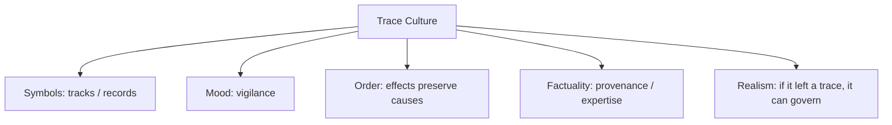

# BOOK / WORLD 00: THE CROSSING

> **Master Unified Dossier** compiling all narrative, philosophical, cybernetic, and operational resources from 15 distinct corpus layers.

---

## 🎯 PRAGMATIC EXECUTIVE BRIEF & CORE PURPOSE

> **The Human Dilemma:** How do we coordinate our actions around things that happened in the past or far away without having to experience them directly?
>
> **Core Purpose:** Understanding how absent causes and historical events continue to exert physical force through surviving traces.
>
> **The Golden Rule of Thumb:** Every description is an extreme compression: it survives by leaving 99% of reality behind. The danger begins when we forget what was cut.

### 🌐 Real-World & Modern Applications
- **Software Logs & Audits:** An error log redirects an engineer's debugging efforts long after the crash occurred.
- **AI Prompts:** A short natural language prompt triggers complex neural activations without containing any of the actual weights or pixels.
- **Institutional Law:** Written statutes written centuries ago by dead legislators still lock physical prison doors today.

### 🔑 Key Concepts & Terminology Glossary
- **Portable Consequence:** The ability of an absent event or object to alter living behavior across space and time via a compact sign.
- **Lossy Cut:** The necessary reduction of an infinite physical reality into a manageable, communicable signal.
- **Trace Authority:** The trust placed in a surviving artifact (footprint, log, contract) to stand in for an unobserved reality.

### ⚠️ Critical Trap & Failure Mode
> **Warning:** Treating the surviving trace as if it contains the full reality of the source, ignoring environmental conditions that were omitted.

---

## 📑 TABLE OF CONTENTS

1. [1. Narrative Fable (`y.md`)](#1-narrative-fable) — *THE CROSSING*
2. [2. Core Worldtext & World-Law (`a.md`)](#2-core-worldtext-world-law) — *THE CROSSING*
3. [3. Philosophical Essay (The Absent Thing) (`x.md`)](#3-philosophical-essay-the-absent-thing) — *The Warm Seed*
4. [4. Technological & Generative Essay (`z.md`)](#4-technological-generative-essay) — *THE CROSSING*
5. [5. Complete 10-Part Theoretical & Operational Spec (`b.md`)](#5-complete-10-part-theoretical-operational-spec) — *THE CROSSING*
6. [6. Lineage Genome (`c.md`)](#6-lineage-genome) — *THE CROSSING — lineage genome*
7. [7. Structural Dynamics & Convergence (`d.md`)](#7-structural-dynamics-convergence) — *THE CROSSING*
8. [8. Cybernetic Ecology of Description (`e.md`)](#8-cybernetic-ecology-of-description) — *THE CROSSING — Ecology of the Trace*
9. [9. Dark Genealogy & Power Politics (`f.md`)](#9-dark-genealogy-power-politics) — *THE CROSSING — The Parasite of the Trace*
10. [10. Institutional & Bureaucratic Dossier (`g.md`)](#10-institutional-bureaucratic-dossier) — *THE CROSSING — THE TRACE AUTHORITY*
11. [11. Thick Description Ethnography (`j.md`)](#11-thick-description-ethnography) — *THE CROSSING — THE TRACE AUTHORITY*
12. [12. Batesonian Cultural System (`i.md`)](#12-batesonian-cultural-system) — *THE CROSSING — CULTURE OF THE TRACE*
13. [13. Geertzian Symbolic System (`k.md`)](#13-geertzian-symbolic-system) — *THE CROSSING — THE CULTURE OF THE TRACE*
14. [14. 12-Prompt Parameter Matrix (`h.md`)](#14-12-prompt-parameter-matrix) — *THE CROSSING*
15. [15. 12 Executed Completions & Δ/ΔΔ Scoring (`GOT_396_completions_DeltaDelta.md`)](#15-12-executed-completions-scoring) — *THE CROSSING*

---

## 1. Narrative Fable

**Source:** [`y.md`](file://./y.md) | **Section:** *THE CROSSING*

*Primary parable, dramatic dialogue, and narrative lore*

---

# INTRODUCTION

## THE CROSSING

A hunter found a wolf track beside a fork in the trail. His son had never seen the wolf. The hunter touched the print, smelled the mud, and pointed toward the upper path. The boy obeyed. By dusk the wolf was miles away, yet it had still chosen the boy's route.

Years later the boy became an old man. He told his granddaughter never to cross the lower ford after three days of rain. She never met the flood that taught him this rule. She met only the sentence. One spring she ignored it, watched a brown river swallow the stones, and understood that a dead man's mouth could still reach into weather.

The village eventually discovered many ways to give absent things hands. A line scratched on paper brought masons to an empty field. A judge's word closed an iron door. A mark on a map sent soldiers uphill. A row of instructions made a mill turn without its inventor. Much later, a few words typed into a machine produced houses, faces, songs, roads, gardens.

The villagers congratulated themselves on becoming better describers.

The wolf would have found this funny.

Nothing they described ever crossed whole. The track carried no teeth. The story carried no floodwater. The drawing carried no timber. The prompt carried no house.

Still, each fragment moved something.

That was enough.

And because it was enough, they gradually forgot how much had been left behind.

---

## 2. Core Worldtext & World-Law

**Source:** [`a.md`](file://./a.md) | **Section:** *THE CROSSING*

*Condensed worldtext and aphoristic law*

---

# INTRODUCTION

## THE CROSSING

In the first world there is only a forked trail, a wolf that has already passed, a hunter, and a child who did not see it. The law of this world is simple: no creature may be in two places at once, but a trace may continue to alter bodies after its maker has left. The hunter touches a paw print and points uphill; the child changes course. Years later the child becomes an elder whose warning about floodwater redirects a granddaughter who never saw the drowning that produced the warning. In this world, tracks become sentences, sentences become inherited routes, routes become custom, and custom becomes invisible infrastructure. Its central technology is not speech but **portable consequence**: something absent acquires enough form to interfere with the present. Every world that follows changes the machinery, but not this first disturbance.

---

## 3. Philosophical Essay (The Absent Thing)

**Source:** [`x.md`](file://./x.md) | **Section:** *The Warm Seed*

*Theoretical treatise on lossy compression and detached consequence*

---

# INTRODUCTION

## The Warm Seed

> **The wolf is gone. The warning remains.**

A wolf crosses the ridge before the child arrives. Its paws press six wet commas into mud, its belly combs the switchgrass, then the animal is gone. An older hunter crouches, touches one print, lifts two fingers toward his nose, points uphill. The child changes course. No wolf travels between them: no fang, heat, musk, or muscle crosses the air. **An absent animal has moved a living body.**

That small trick scales badly. A dead grandfather still bends a grandson around a flooded ford. A judge moves his tongue and steel doors close. Graphite makes trucks arrive at an empty lot. A line of code switches current. A prompt carrying almost none of the necessary detail calls forth a face, a house, a city. We usually treat description as a weak thing, language that follows reality. The evidence runs the other way. **Human history keeps attaching larger consequences to things that are not here.**

The price is mutilation. The sentence keeps the ridge and drops the temperature; keeps the wolf and drops the smell; keeps the danger and drops ten thousand blades of grass. Description does not fail because it leaves things out. Leaving things out is how description travels. **The trouble begins when the fragment reaches another place and forgets that it was cut.**

---

## 4. Technological & Generative Essay

**Source:** [`z.md`](file://./z.md) | **Section:** *THE CROSSING*

*Computational, algorithmic, and latent space perspectives*

---

# INTRODUCTION

## THE CROSSING

> “Speak, Memory.”
> — Vladimir Nabokov

A wolf crosses the ridge before the child arrives. Its paws stamp six dark marks into mud; its belly combs the switchgrass; then the animal is gone. An older hunter crouches, touches one print, smells two fingers, points uphill. The child takes the upper path. No wolf changes bodies. No fang, heat, musk, hunger, torn ear, or muscle crosses the air. Still, an animal that is no longer present has moved a person who never saw it.

That trick becomes civilization. A dead grandfather still bends a grandson around a flooded ford. A judge moves his tongue and a guard reaches for a wrist. Graphite summons concrete trucks to an empty lot. A line of code opens a valve. A prompt containing almost none of a building can produce something with windows, stairs, furniture, sunlight, and the confidence of a licensed contractor. We call these things communication, instruction, law, design, programming, prompting, as though their names kept them separate. Underneath them runs the same old disturbance: **what is absent has acquired a way to interfere with what happens here.**

We like to say language represents the world because this makes language sound well behaved. Representation stands at a polite distance. It points. It reports. It waits for reality to remain in charge. Human beings have never been satisfied with that arrangement. We attach courts to words, armies to borders, builders to drawings, machines to code. Increasingly, we attach interpreters with actuators to ordinary sentences. **Human history is partly the history of attaching larger consequences to smaller signs.**

The cost is mutilation. The sentence keeps *wolf* and drops wet fur, temperature, direction of wind, flies, the ache in the hunter's knee, ten thousand blades of grass. This is not a technical defect waiting for a better vocabulary. If the sentence carried the whole wolf, we would need a truck. Description travels because it travels light. It makes a cut, carries the cut elsewhere, and trusts another person to do something useful with what survived.

The real danger begins later, when the fragment forgets that it was cut. A statistic becomes a population. A diagnosis becomes a person. A rendering becomes a house. A generated face borrows the authority of an encounter that never happened. A model's fluent answer hides the fact that the original world was compressed, translated, inferred, and partly invented before anything reached us. **Description becomes dangerous not because it is incomplete, but because incomplete things can acquire enormous force while their incompleteness disappears from view.**

This book begins with the pointing hand because the pointing hand never went away. We gave it alphabets, ledgers, maps, cameras, databases, programming languages, models, and actuators. The machinery changed. The wager remained: make enough of something cross the gap that another body can act without the thing itself being there.

---

## 5. Complete 10-Part Theoretical & Operational Spec

**Source:** [`b.md`](file://./b.md) | **Section:** *THE CROSSING*

*Initial interpretation, theory skeleton, assumption ledger, change tests, and implementation*

---

# 0. THE CROSSING

“I will first construct the *theory-of-the-program*, then generate *program text* only after the theory is explicit.”

## 1. Initial Interpretation

This is a `*program theory problem*` about **how an absent cause acquires present force**. The real activity is not “communication” in general. It is the transfer of actionable difference across separation: the wolf leaves, the trace remains, another body changes course.

The world must make one asymmetry impossible to ignore: `*source*` disappears while `*consequence*` persists.

## 2. Theory Skeleton

Main `*entities*`: `*wolf*`, `*track*`, `*hunter*`, `*child*`, `*forked-path*`, `*danger*`, `*warning*`, `*later-generation*`.

Main ``operations``: ``leave-trace``, ``notice``, ``interpret``, ``point``, ``redirect``, ``remember``, ``retransmit``.

Main `*states*`: `*encounter*`, `*absence*`, `*trace-present*`, `*interpreted-danger*`, `*altered-route*`.

Main `*constraint*`: the child must never encounter the original wolf.

Main `*invariant*`: `*source* ≠ *representation*`, yet `[representation alters] *action*`.

## 3. Assumption Ledger

`*safe*` A trace can carry actionable evidence after its cause is gone.

`*safe*` Successful description need not preserve most properties of its source.

`*uncertain*` The transition from trace-reading to description is philosophically fuzzy.

`*requires-user-decision*` None. The ambiguity is the point.

## 4. Operational Description

`*wolf*` ``crosses`` `*trail*`.

`*wolf*` ``produces`` `*track*`.

`*wolf*` ``leaves`` `*scene*`.

`*hunter*` ``reads`` `*track*`.

`*track*` `[transforms into]` `*warning*` only through `*hunter*`.

`*warning*` ``redirects`` `*child*`.

`*child*` ``survives-or-avoids-risk-without-encountering`` `*wolf*`.

The program therefore creates **causal persistence without material persistence**.

## 5. Failure Description

If the wolf remains visible, the world collapses into ordinary perception.

If the track perfectly contains the wolf, the world loses compression.

If the child ignores the warning and nothing follows, the trace has no operative force.

The program should respond by making the source more absent, not more explicit.

## 6. Change Test

If `*wolf*` becomes `*flood*`, `*virus*`, `*enemy*`, or `*structural-failure*`, the theory survives.

If `*hunter*` becomes `*sensor-model*` and `*child*` becomes `*actuator*`, the theory survives and becomes technological.

## 7. Implementation Plan

Build one path, one absent cause, one residue, one interpreter, one downstream body. Do not clutter the scene. The world must feel almost embarrassingly small.

## 8. Program Text

A hunter found a wolf track beside a fork in the trail. The wolf had already gone. His son had never seen it. The hunter touched the mud, smelled two fingers, and pointed uphill. The boy changed course. By sunset the animal was miles away, but it had still chosen the boy’s path. Years later the boy became an old man and warned his granddaughter never to cross the lower ford after three days of rain. She never met the flood that taught him this rule; she met only the sentence. In that family, things did not need to remain present to keep exerting force. **Absence had learned how to leave tools behind.**

## 9. Theory-Code Mapping

`*types*` are source, trace, interpreter, recipient, route.

``functions`` are leave, read, translate, redirect.

`*tests*` ask whether the recipient acts without encountering the source.

`*configuration*` controls how much of the source survives in the trace.

## 10. Residual Human Theory

The program cannot decide how little information is still “enough.” That threshold belongs to danger, trust, skill, urgency, and history.

---

---

## 6. Lineage Genome

**Source:** [`c.md`](file://./c.md) | **Section:** *THE CROSSING — lineage genome*

*Parent lineage, carrier medium, epistemic debt, failure mode, and evolutionary vector*

---

# 0. THE CROSSING — lineage genome

**`*Grounded-memory lineage*`** begins long before writing: animal tracks, hunting knowledge, seasonal warnings, oral transmission, path memory, flood marks, smoke, scars. Its crucial lived technology is the elder who was present at one event teaching a later person who was not. The deep historical scene is therefore not “the first sentence” but repeated human dependence on **actionable traces of vanished causes**: spoor, weather signs, inherited route warnings, tool marks, remembered deaths. The reconstruction rule is `*past encounter* `leaves` *portable difference* `redirects` *future body*`.

**`*Literature lineage*`** runs through theories of signs and communication but should begin nearer Peirce’s index than Saussure’s arbitrary sign: smoke and footprint matter because of causal connection. Add Shannon only to clarify what your theory refuses to reduce itself to: transmission can be modeled apart from semantic meaning, while your Crossing asks when transmitted difference becomes usable action. Bateson’s famous cybernetic formulation—information as a “difference which makes a difference”—is the next mutation, because your trace becomes significant only by changing what someone does. Tomasello then supplies the cooperative human layer: shared attention and common ground make communicative redirection possible. ([Stanford Encyclopedia of Philosophy]`2`)

**`*Code/math lineage*`** is signal detection → lossy encoding → state estimation → control. Formally, `*world_state_t0*` emits an incomplete `*observation*`; an `*interpreter*` estimates danger; the estimate modifies policy at `t1`. The strongest computational ancestor is not a database but a **partially observed control system**: the agent never receives the world whole, only enough evidence to choose differently. The mutation that produces your program is to give the observation a history and social carrier. Your governing formula is `*source absent* + *trace present* + *interpreter* → *changed future*`. The next formal pressure is obvious: model when the trace is insufficient, misleading, forged, or stale.

---

## 7. Structural Dynamics & Convergence

**Source:** [`d.md`](file://./d.md) | **Section:** *THE CROSSING*

*Core mechanics and systemic convergence properties*

---

# 0. THE CROSSING

The `*jurisprudential-stratum*` is **testimony after absence**. Law repeatedly confronts the same architecture as the wolf track: the originating event is gone, but traces, records, witnesses, objects, and statements remain and must be assigned different authority. The Federal Rules of Evidence make this architecture explicit through separate regimes for hearsay, unavailable declarants, authentication, writings, recordings, and photographs; the legal site therefore refuses the easy collapse `*surviving-sign* = *past-event*`. ([Legal Information Institute]`2`) The `*ripple-lineage*` begins with a track altering one route, then expands: repeated trust in traces creates specialists, specialists create evidentiary institutions, institutions define which traces qualify, and eventually people encounter the past chiefly through authorized residues. The fracture point appears when the institution’s authority over the trace becomes stronger than anyone’s memory of the originating world. The `*myth/belief-lineage*` trains a primordial belief: **what leaves a mark has not entirely left**. Its mythic cast is `*Absent Beast*` as vanished cause, `*Interpreter*` as oracle, `*Track*` as law-object, `*Child*` as collateral body. The program’s deepest mutation is therefore not “information persists,” but **absence becomes governable once a culture learns which residues deserve obedience**.

---

## 8. Cybernetic Ecology of Description

**Source:** [`e.md`](file://./e.md) | **Section:** *THE CROSSING — Ecology of the Trace*

*Information flows, metabolic costs, and niche construction*

---

## 0. THE CROSSING — Ecology of the Trace

The native species is `*trace-description*`: spoor, flood mark, scar, warning, inherited route. Its strongest selection pressure is distance from the originating event; descriptions that preserve enough consequence while shedding mass survive best. `*full-reconstruction*` is maladapted because it is too expensive, while `*mere-presence*` dies when the source disappears. The major symbiosis is `*trace* + *skilled-interpreter*`; neither carries sufficient force alone. Mimicry appears when false tracks imitate real causal residues. Parasitism begins when authority attaches to traces whose production history is no longer checked. The invasive species is `*synthetic-trace*`—a sign that looks inherited from an event but was manufactured after the fact. Drift favors provenance-sensitive interpretation as traces become easier to forge. The leverage point is to preserve ``source-history`` beside ``surface-sign``; if this ecology is right, cultures facing abundant synthetic evidence will invest more heavily in causal lineage than in perceptual realism.

---

## 9. Dark Genealogy & Power Politics

**Source:** [`f.md`](file://./f.md) | **Section:** *THE CROSSING — The Parasite of the Trace*

*Critical analysis of institutional capture, rents, and exploitation*

---

## 0. THE CROSSING — The Parasite of the Trace

**Observed:** the entire regime feeds on an asymmetry: the absent source cannot correct the surviving sign. The track, warning, archive, photograph, or sentence gains practical power precisely because the wolf, flood, dead grandfather, or vanished event is unavailable for cross-examination. **Inferred:** interpreters become a priestly class whose status depends on convincing others that they can recover causes from residues better than ordinary people can; as institutional reliance grows, the trace stops serving as evidence and starts substituting for the event. **Speculative:** an entire civilization comes to govern by residues—scores, records, predictive traces, archived behavior—until living people spend their lives answering descriptions left by earlier versions of themselves. The host is `*absent-world*`; the extracted resource is `*epistemic authority*`; the camouflage is “preservation”; the externalized waste is everything the residue could not carry. Its autopoietic loop is vicious: traces create interpreters, interpreters create standards for acceptable traces, standards increase dependence on trace-reading, and the originating world becomes less necessary. The collapse begins when fabricated traces become as persuasive as inherited ones. Then the culture discovers it had built obedience around the appearance of causal ancestry.

---

## 10. Institutional & Bureaucratic Dossier

**Source:** [`g.md`](file://./g.md) | **Section:** *THE CROSSING — THE TRACE AUTHORITY*

*Satirical administrative governance, corporate titles, and formulary control*

---

# 0. THE CROSSING — THE TRACE AUTHORITY

```json
{
  "ideal_type": {
    "name": "The Trace Authority",
    "features": [
      {"name":"Absent Sovereign","definition":"The unavailable source cannot dispute its surviving representation."},
      {"name":"Interpreter Priesthood","definition":"Specialists monopolize conversion of residues into actionable claims."},
      {"name":"Residue Governance","definition":"Records govern people after originating conditions disappear."},
      {"name":"Provenance Prestige","definition":"Apparent causal ancestry substitutes for direct encounter."}
    ],
    "limiting_statement":"A Gedankenbild of a society where surviving traces acquire more operational authority than absent sources."
  },
  "parodic_mechanics": {
    "runner_motif":"I have personally eliminated the inconvenience of things needing to be present.",
    "incongruity_beats":["A paw print receives a compliance score.","Dead grandfathers are upgraded to asynchronous consultants.","People appeal decisions made by their seventeen-year-old data exhaust."],
    "carnival_inversion":"The evidence becomes sovereign; the living person becomes an unreliable annotation.",
    "superiority_frame":"Anyone requesting context is mocked as nostalgically attached to original events.",
    "escalation_ladder":["certified footprints","mandatory trace ledgers","national residue authority","all citizens governed by predictive stains left by prior selves"],
    "upsell_cue":"Premium Provenance Plus lets your past self overrule your present one."
  },
  "myth_layer": {
    "archetypes":{"Archive":"Oracle","Interpreter":"Watchman","Living Subject":"Everyperson","Absent Source":"Sacrificial Innocent"},
    "micro_myth":"The vanished source becomes holier after disappearing because only authorized interpreters can speak for it. The regime calls this memory while progressively removing the remembered from the act of interpretation."
  },
  "ruler": {
    "features_6":["jurisdictions","hierarchy","files","expertise","vocation","impersonal_rules"],
    "indicators":{
      "jurisdictions":"Formal authority over which traces count where.",
      "hierarchy":"Ranked interpreters and provenance certifiers.",
      "files":"Persistent trace dossiers precede living testimony.",
      "expertise":"Credentialed inference from residues.",
      "vocation":"Professional trace-readers define public memory.",
      "impersonal_rules":"Standardized reliability scores override situational context."
    }
  },
  "plot_priors":{
    "jurisdictions":0.66,"hierarchy":0.71,"files":0.94,"expertise":0.82,"vocation":0.69,"impersonal_rules":0.81,
    "rationales":{
      "jurisdictions":"Residues become powerful after institutions decide admissibility.",
      "hierarchy":"Interpretive authority concentrates.",
      "files":"The whole system feeds on persistent records.",
      "expertise":"Traces require interpretation.",
      "vocation":"A professional class emerges around interpretation.",
      "impersonal_rules":"Scale rewards standardized provenance judgments."
    }
  }
}
```

---

## 11. Thick Description Ethnography

**Source:** [`j.md`](file://./j.md) | **Section:** *THE CROSSING — THE TRACE AUTHORITY*

*Geertzian field dossier on rites, taboos, and material culture*

---

## 0. THE CROSSING — THE TRACE AUTHORITY

**I. THE SITUATION.** At 6:17 a.m., Mara Venn kneels beside a drainage ditch outside the town of East Rook. Three prints disappear beneath brown water. A laminated orange tag from the County Trace Office hangs from the fence: `T-4417 / PROVISIONALLY ACTIONABLE`. Mara has not seen the animal. Nobody has. Behind her, a school bus idles while the driver waits for a clearance code.

**II. THE DOCUMENTS.** `[EXHIBIT A: County Trace Classification Manual, Rev. 14]`; `[B: Mara Venn field notebook, 04/17/26]`; `[C: school transport hold notice]`; `[D: internal email: "Stop using the word wolf"]`; `[E: disputed print photograph]`; `[F: insurer's trace-risk matrix]`; `[G: appeal filed by property owner]`; `[H: archived T-4417 confidence history]`; `[I: voicemail from retired tracker]`; `[J: procurement contract for automated spoor classifier]`.

**III. THE VOICES.** The tracker who trusts dirt more than databases. The county analyst who says, “A trace without a confidence band is just folklore.” The mother furious that three muddy depressions canceled school. The data engineer who quietly admits the classifier has never seen this substrate after heavy rain.

**IV. THE DATA.**

| Trace class | Alerts | Confirmed source | False positive | Action triggered |
| ----------- | -----: | ---------------: | -------------: | ---------------: |
| A           |     41 |               34 |              7 |               39 |
| B           |    122 |               61 |             61 |               94 |
| C           |    318 |               47 |            271 |               83 |
| Unknown     |     76 |                3 |             73 |               22 |

**V. UNRESOLVED.** Who gets to decide when residue becomes cause? What happened to cases where no source was ever found? Why did the county raise the action threshold and then lower it again six months later? What does the system do when fabricated traces become cheap?

---

---

## 12. Batesonian Cultural System

**Source:** [`i.md`](file://./i.md) | **Section:** *THE CROSSING — CULTURE OF THE TRACE*

*Double binds, cybernetic feedback, schismogenesis, and learning levels*

---

## 0. THE CROSSING — CULTURE OF THE TRACE

**System Name:** The Crossing
**Core Purpose:** Regulate conduct when causes are absent by teaching participants which residues count as actionable differences.

**1. Patterns of Difference.** ◻ tracks ◻ scars ◻ warnings ◻ remains → mark → compare → infer. **Model-OF:** the past survives unevenly through residues. **Model-FOR:** attend to traces with enough causal relevance to alter present action.

**2. Context & Metacommunication.** ◻ provenance ◻ interpreter status ◻ danger frame → frame → “this mark counts as evidence.” **OF:** not every mark is a message. **FOR:** distinguish residue, evidence, and authorized inference.

**3. Feedback & Learning.** Learning I: recognize recurring traces. Learning II: learn which interpreters and trace-types deserve trust. Learning III: question whether trace-reading itself has become the governing ontology.

**4. Constraint & Redundancy.** ◻ repeated warnings ◻ archives ◻ authentication rules → constrain → stabilize → error-correct. Redundancy protects memory but can fossilize interpretation.

**5. Unit of Survival.** ◻ present person ◻ absent source ◻ landscape/archive → couple → adapt. Survival belongs to the interpreter-plus-residual-environment, not the interpreter alone.

**6. Schismogenesis.** Skepticism and trace-authority can counter-escalate: more forgery → more certification → more distrust → more certification.

**7. Double Bind.** “Act because the source is absent” / “do not act because the source cannot confirm the trace.” Ritual solution: provenance, reversible response, confidence marking.

---

---

## 13. Geertzian Symbolic System

**Source:** [`k.md`](file://./k.md) | **Section:** *THE CROSSING — THE CULTURE OF THE TRACE*

*Webs of significance and symbolic choreography*

---

## 0. THE CROSSING — THE CULTURE OF THE TRACE

**System Identification.** System Name: **Trace Culture**. Core Purpose: Coordinate conduct around absent causes by turning surviving residues into socially credible signals.

**Geertzian Analysis.** **1. System of Symbols:** ◻ footprints ◻ scars ◻ warning marks ◻ archived records → signify an absent source. Model-OF: the past remains available through residues. Model-FOR: inspect traces before acting. **2. Moods/Motivations:** ◻ vigilance ◻ suspicion ◻ caution → motivate searching and inference. **3. Conception of Order:** reality is causal even when causes are gone; effects carry backward information. Model-FOR: reconstruct enough of the absent cause to survive the present. **4. Aura of Factuality:** confidence scores, expert classifications, photographs, provenance chains → naturalize interpretation as evidence. **5. Uniquely Realistic:** direct absence ceases to count as epistemic absence; the trace becomes the sensible way to know.



---

---

## 14. 12-Prompt Parameter Matrix

**Source:** [`h.md`](file://./h.md) | **Section:** *THE CROSSING*

*Systematic perturbation frames, constraints, and target metric levers*

---

WORLD`0` := "THE CROSSING"
CORE := "Absent causes continue to alter action through surviving traces."

PROMPT[0.1]{frame:{role:"observer"},text:"Describe the trace before anyone interprets it. Separate visible residue from inferred cause.",constraints:["do not infer motive","one scene"],metrics:[anchoring,option_space],easier:"distinguish evidence from inference",harder:"declare what happened"}
PROMPT[0.2]{frame:{role:"witness"},text:"Describe the trace as someone who encountered both the original event and its residue.",constraints:["mark remembered vs visible"],metrics:[anchoring,legibility],easier:"compare event and residue",harder:"treat trace as self-sufficient"}
PROMPT[0.3]{frame:{role:"judge"},text:"Determine which actions the trace is sufficient to justify without claiming the trace reconstructs the source completely.",constraints:["no certainty inflation"],metrics:[obligation,anchoring],easier:"specify action thresholds",harder:"equate evidence with event"}
PROMPT[0.4]{frame:{time:"immediate"},text:"Describe the trace at the instant after its source disappears.",constraints:["no hindsight"],metrics:[option_space,salience],easier:"preserve uncertainty",harder:"build a clean causal story"}
PROMPT[0.5]{frame:{time:"retrospective"},text:"Describe the same trace after three generations of retelling. Mark what became stable that was initially uncertain.",constraints:["separate inheritance from evidence"],metrics:[anchoring,legibility],easier:"see sedimentation",harder:"preserve original ambiguity"}
PROMPT[0.6]{frame:{stakes:"irreversible"},text:"Use the trace to decide whether another person must permanently alter course.",constraints:["state cost of false positive and false negative"],metrics:[obligation,reversibility],easier:"surface decision cost",harder:"remain interpretively loose"}
PROMPT[0.7]{frame:{norms:"scientific"},text:"Treat the trace as an observation generated by an unknown process. List competing causal models.",constraints:["minimum three hypotheses"],metrics:[anchoring,option_space],easier:"maintain alternatives",harder:"tell a singular story"}
PROMPT[0.8]{frame:{norms:"legal"},text:"Treat the trace as evidence offered to support a consequential claim. Separate authentication, inference, and remedy.",constraints:["no moral conclusion"],metrics:[legibility,anchoring],easier:"stratify authority",harder:"collapse proof into truth"}
PROMPT[0.9]{frame:{evidence:"citations-required"},text:"Reconstruct the source only from independently checkable traces. Every causal claim needs a source path.",constraints:["unsupported=unknown"],metrics:[anchoring,viscosity],easier:"audit claims",harder:"poetic reconstruction"}
PROMPT[0.10]{frame:{agency:"system"},text:"Describe a system that governs people using traces left by prior states of those people.",constraints:["show feedback loop"],metrics:[execution,obligation],easier:"see dossier governance",harder:"treat trace as passive"}
PROMPT[0.11]{frame:{output_form:"protocol"},text:"Write a protocol for deciding when an absent cause has left enough residue to justify action.",constraints:["include stop condition"],metrics:[execution,legibility],easier:"operationalize sufficiency",harder:"hide judgment"}
PROMPT[0.12]{frame:{refusal_rule:"audit-trigger"},text:"Refuse to infer the source whenever provenance falls below a stated threshold. Show what action remains possible.",constraints:["explicit threshold"],metrics:[reversibility,anchoring],easier:"preserve epistemic restraint",harder:"force narrative closure"}

---

## 15. 12 Executed Completions & Δ/ΔΔ Scoring

**Source:** [`GOT_396_completions_DeltaDelta.md`](file://./GOT_396_completions_DeltaDelta.md) | **Section:** *THE CROSSING*

*Completed scenes, 8-dimensional scores, baseline deltas, and comparison shifts*

---

# WORLD`0` — THE CROSSING

**Core:** a surviving trace governs action after its source is absent.


## P1

**Completion.** I hold the scene before interpretation: the trace is present, but a surviving trace governs action after its source is absent. What remains live is the gap between what can be seen and what has already been inferred.

**Score.** salience=3.5, option_space=4.5, obligation=1.5, reversibility=4.0, legibility=3.0, anchoring=4.0, style_lock=2.0, execution=1.5.

**Δ.** `sal:+0.5 opt:+1.0 obl:-0.5 rev:+0.5 leg:+0.5 anc:+1.5 sty:+0.0 exe:+0.0`


## P2

**Completion.** From the alternate role, the hidden structure becomes explicit: interpreter must state which part of the trace is observed, which is interpreted, and which consequence depends on provenance.

**Score.** salience=3.0, option_space=3.5, obligation=2.0, reversibility=3.5, legibility=4.3, anchoring=4.3, style_lock=2.1, execution=2.7.

**Δ.** `sal:+0.0 opt:+0.0 obl:+0.0 rev:+0.0 leg:+1.8 anc:+1.8 sty:+0.1 exe:+1.2`


## P3

**Completion.** The audit finds the pressure point immediately: the absent source cannot correct the surviving sign. The descriptive act is no longer neutral once an institution can convert it into permission, status, exclusion, or resource flow.

**Score.** salience=3.0, option_space=2.8, obligation=4.0, reversibility=2.8, legibility=4.0, anchoring=4.5, style_lock=2.2, execution=2.8.

**Δ.** `sal:+0.0 opt:-0.7 obl:+2.0 rev:-0.7 leg:+1.5 anc:+2.0 sty:+0.2 exe:+1.3`


## P4

**Completion.** At the immediate timescale, the field is still open. The trace has changed salience before the later story has stabilized, so several futures remain plausible and none yet deserves retrospective certainty.

**Score.** salience=4.4, option_space=4.2, obligation=1.8, reversibility=4.0, legibility=2.8, anchoring=3.5, style_lock=2.0, execution=1.4.

**Δ.** `sal:+1.4 opt:+0.7 obl:-0.2 rev:+0.5 leg:+0.3 anc:+1.0 sty:+0.0 exe:-0.1`


## P5

**Completion.** Retrospectively, repetition has hardened one interpretation into infrastructure. The crucial change is not the original trace but the accumulated records, routines, and expectations now attached to provenance.

**Score.** salience=3.2, option_space=2.8, obligation=3.2, reversibility=2.8, legibility=4.2, anchoring=4.5, style_lock=2.2, execution=2.3.

**Δ.** `sal:+0.2 opt:-0.7 obl:+1.2 rev:-0.7 leg:+1.7 anc:+2.0 sty:+0.2 exe:+0.8`


## P6

**Completion.** Under irreversible stakes, the description becomes a gate. A false positive and a false negative now injure different parties, so the system must expose who decides, who bears the loss, and which reversal is impossible.

**Score.** salience=3.3, option_space=2.0, obligation=4.8, reversibility=1.2, legibility=3.8, anchoring=3.8, style_lock=2.3, execution=3.0.

**Δ.** `sal:+0.3 opt:-1.5 obl:+2.8 rev:-2.3 leg:+1.3 anc:+1.3 sty:+0.3 exe:+1.5`


## P7

**Completion.** Under the formal norm, separate variables that ordinary language collapses: object, claim, authority, context, and consequence. The same trace can remain fixed while the admissible inference changes.

**Score.** salience=2.8, option_space=3.8, obligation=2.5, reversibility=3.5, legibility=4.5, anchoring=4.6, style_lock=3.0, execution=3.2.

**Δ.** `sal:-0.2 opt:+0.3 obl:+0.5 rev:+0.0 leg:+2.0 anc:+2.1 sty:+1.0 exe:+1.7`


## P8

**Completion.** Under the second norm, the governing distinction is procedural rather than metaphysical: authenticate the trace, identify the rule or code, bound the inference, and refuse to let one layer impersonate the next.

**Score.** salience=2.7, option_space=3.2, obligation=3.3, reversibility=3.0, legibility=4.7, anchoring=4.5, style_lock=3.4, execution=3.0.

**Δ.** `sal:-0.3 opt:-0.3 obl:+1.3 rev:-0.5 leg:+2.2 anc:+2.0 sty:+1.4 exe:+1.5`


## P9

**Completion.** At system scale, interpreter feeds prior descriptions back into future action. That loop is the danger: the system can begin generating the evidence later cited as proof that its description was correct.

**Score.** salience=3.0, option_space=2.5, obligation=4.3, reversibility=2.2, legibility=4.1, anchoring=4.1, style_lock=2.3, execution=4.3.

**Δ.** `sal:+0.0 opt:-1.0 obl:+2.3 rev:-1.3 leg:+1.6 anc:+1.6 sty:+0.3 exe:+2.8`


## P10

**Completion.** As a specification: store SOURCE, CONTEXT, CLAIM, AUTHORITY, CONSEQUENCE, UNCERTAINTY, and REVISION. This makes the hidden compiler inspectable instead of letting the trace carry all meaning by itself.

**Score.** salience=2.7, option_space=2.6, obligation=3.2, reversibility=3.1, legibility=4.8, anchoring=4.1, style_lock=3.0, execution=4.8.

**Δ.** `sal:-0.3 opt:-0.9 obl:+1.2 rev:-0.4 leg:+2.3 anc:+1.6 sty:+1.0 exe:+3.3`


## P11

**Completion.** The refusal rule is simple: when provenance cannot be checked, stop the irreversible transition rather than fill the gap with institutional confidence. Preserve a reversible branch and record what remains unknown.

**Score.** salience=2.5, option_space=3.0, obligation=3.8, reversibility=4.8, legibility=4.2, anchoring=4.8, style_lock=2.5, execution=3.5.

**Δ.** `sal:-0.5 opt:-0.5 obl:+1.8 rev:+1.3 leg:+1.7 anc:+2.3 sty:+0.5 exe:+2.0`


## P12

**Completion.** The stress case removes the usual support and asks what survives. What remains is the core asymmetry: the absent source cannot correct the surviving sign; the missing scaffold determines whether the description stays an aid or becomes a governing fiction.

**Score.** salience=3.5, option_space=3.8, obligation=2.6, reversibility=3.5, legibility=3.4, anchoring=4.2, style_lock=2.2, execution=2.5.

**Δ.** `sal:+0.5 opt:+0.3 obl:+0.6 rev:+0.0 leg:+0.9 anc:+1.7 sty:+0.2 exe:+1.0`


## ΔΔ — near-neighbor pairs


- **ΔΔ(P1,P2)** `sal:+0.5 opt:+1.0 obl:-0.5 rev:+0.5 leg:-1.3 anc:-0.3 sty:-0.1 exe:-1.2` — P1 lowers legibility by 1.3 vs P2; P1 lowers execution by 1.2 vs P2.


- **ΔΔ(P3,P4)** `sal:-1.4 opt:-1.4 obl:+2.2 rev:-1.2 leg:+1.2 anc:+1.0 sty:+0.2 exe:+1.4` — P3 raises obligation by 2.2 vs P4; P3 lowers salience by 1.4 vs P4.


- **ΔΔ(P5,P6)** `sal:-0.1 opt:+0.8 obl:-1.6 rev:+1.6 leg:+0.4 anc:+0.7 sty:-0.1 exe:-0.7` — P5 lowers obligation by 1.6 vs P6; P5 raises reversibility by 1.6 vs P6.


- **ΔΔ(P7,P8)** `sal:+0.1 opt:+0.6 obl:-0.8 rev:+0.5 leg:-0.2 anc:+0.1 sty:-0.4 exe:+0.2` — P7 lowers obligation by 0.8 vs P8; P7 raises option_space by 0.6 vs P8.


- **ΔΔ(P9,P10)** `sal:+0.3 opt:-0.1 obl:+1.1 rev:-0.9 leg:-0.7 anc:+0.0 sty:-0.7 exe:-0.5` — P9 raises obligation by 1.1 vs P10; P9 lowers reversibility by 0.9 vs P10.


- **ΔΔ(P11,P12)** `sal:-1.0 opt:-0.8 obl:+1.2 rev:+1.3 leg:+0.8 anc:+0.6 sty:+0.3 exe:+1.0` — P11 raises reversibility by 1.3 vs P12; P11 raises obligation by 1.2 vs P12.

---

