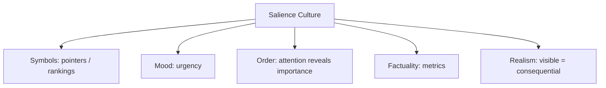

# BOOK / WORLD 01: THE KINGDOM OF TURNED HEADS

> **Master Unified Dossier** compiling all narrative, philosophical, cybernetic, and operational resources from 15 distinct corpus layers.

---

## 🎯 PRAGMATIC EXECUTIVE BRIEF & CORE PURPOSE

> **The Human Dilemma:** Who controls what we look at, and how does directing attention create reality before any words are spoken?
>
> **Core Purpose:** Analyzing deixis and joint attention as the fundamental starting point of all communication and social power.
>
> **The Golden Rule of Thumb:** Whoever controls public salience controls public reality. The first battle is never what things mean, but what people look at.

### 🌐 Real-World & Modern Applications
- **UI/UX Design:** Notifications, red badges, and visual hierarchy directing user eye-lines before they read any copy.
- **Algorithmic Feeds:** Recommender systems determining public discourse by setting the salience agenda.
- **Leadership & Management:** Directing a team's focus to specific KPIs, which automatically deprioritizes unmeasured work.

### 🔑 Key Concepts & Terminology Glossary
- **Deixis:** The act of pointing or indexing attention toward an external referent.
- **Salience Monopoly:** Power gained by having exclusive authority to dictate what others notice.
- **Pre-semantic Orientation:** The physical turning of the head or eyes before cognitive interpretation begins.

### ⚠️ Critical Trap & Failure Mode
> **Warning:** Mistaking the finger for the fire—focusing endlessly on the spectacle of the sign while losing track of the underlying event.

---

## 📑 TABLE OF CONTENTS

1. [1. Narrative Fable (`y.md`)](#1-narrative-fable) — *THE BOY WHO POINTED*
2. [2. Core Worldtext & World-Law (`a.md`)](#2-core-worldtext-world-law) — *THE KINGDOM OF TURNED HEADS*
3. [3. Philosophical Essay (The Absent Thing) (`x.md`)](#3-philosophical-essay-the-absent-thing) — *THE POINTING HAND*
4. [4. Technological & Generative Essay (`z.md`)](#4-technological-generative-essay) — *THE POINTING HAND*
5. [5. Complete 10-Part Theoretical & Operational Spec (`b.md`)](#5-complete-10-part-theoretical-operational-spec) — *THE KINGDOM OF TURNED HEADS*
6. [6. Lineage Genome (`c.md`)](#6-lineage-genome) — *THE KINGDOM OF TURNED HEADS — lineage genome*
7. [7. Structural Dynamics & Convergence (`d.md`)](#7-structural-dynamics-convergence) — *THE KINGDOM OF TURNED HEADS*
8. [8. Cybernetic Ecology of Description (`e.md`)](#8-cybernetic-ecology-of-description) — *THE KINGDOM OF TURNED HEADS — Ecology of Attention*
9. [9. Dark Genealogy & Power Politics (`f.md`)](#9-dark-genealogy-power-politics) — *THE KINGDOM OF TURNED HEADS — Attention Feudalism*
10. [10. Institutional & Bureaucratic Dossier (`g.md`)](#10-institutional-bureaucratic-dossier) — *THE KINGDOM OF TURNED HEADS — ATTENTION FEUDALISM*
11. [11. Thick Description Ethnography (`j.md`)](#11-thick-description-ethnography) — *THE KINGDOM OF TURNED HEADS — ATTENTION FEUDALISM*
12. [12. Batesonian Cultural System (`i.md`)](#12-batesonian-cultural-system) — *THE KINGDOM OF TURNED HEADS — CULTURE OF SALIENCE*
13. [13. Geertzian Symbolic System (`k.md`)](#13-geertzian-symbolic-system) — *THE KINGDOM OF TURNED HEADS — THE CULTURE OF SALIENCE*
14. [14. 12-Prompt Parameter Matrix (`h.md`)](#14-12-prompt-parameter-matrix) — *THE KINGDOM OF TURNED HEADS*
15. [15. 12 Executed Completions & Δ/ΔΔ Scoring (`GOT_396_completions_DeltaDelta.md`)](#15-12-executed-completions-scoring) — *THE KINGDOM OF TURNED HEADS*

---

## 1. Narrative Fable

**Source:** [`y.md`](file://./y.md) | **Section:** *THE BOY WHO POINTED*

*Primary parable, dramatic dialogue, and narrative lore*

---

# I

## THE BOY WHO POINTED

In a valley where everyone watched only what stood directly before them, a boy saw smoke beyond the hill. He had no word for smoke, fire, hill, or danger. He simply pointed.

The adults looked at his finger.

The boy struck one adult on the ear, turned his head, and pointed again.

This time the man looked where the finger ended rather than where it began.

The village survived the fire.

Afterward the villagers invented a word for smoke. Then another for hill. Then one for the wind that drove flames downhill. Their children learned these words before seeing any of the things that had required them.

Generations later, nobody remembered the boy.

Everyone remembered where to look.

---

## 2. Core Worldtext & World-Law

**Source:** [`a.md`](file://./a.md) | **Section:** *THE KINGDOM OF TURNED HEADS*

*Condensed worldtext and aphoristic law*

---

# I

## THE KINGDOM OF TURNED HEADS

In the Kingdom of Turned Heads, nothing receives a name until two people have looked at it together. Children learn no nouns at first; they learn gestures, eye-lines, whistles, and the hard tap on the shoulder that means *not me, beyond me*. The kingdom’s oldest monument is not a statue but a blackened hill where, according to the village chronicle, a child once pointed at smoke while the adults stared foolishly at his finger. Since then, pointing carries legal force: to redirect another person’s attention is to incur responsibility for what they find there. Hunters point to spoor, healers to discoloration, judges to evidence, lovers to stars. The kingdom eventually discovers that attention is scarce and that whoever controls pointing controls public reality. Its oldest blessing therefore doubles as a warning: **may your finger be clear, and may no one mistake the finger for the fire.**

---

## 3. Philosophical Essay (The Absent Thing)

**Source:** [`x.md`](file://./x.md) | **Section:** *THE POINTING HAND*

*Theoretical treatise on lossy compression and detached consequence*

---

# I

## THE POINTING HAND

> **Before there was a word for the thing, there was a way to make another body turn toward it.**

A hand rises; a neck turns. Before anyone names the animal, one body has redirected another body's attention toward something neither is touching. Description may begin here, before nouns, before grammar: **a private difference becomes public enough to alter another creature's movement.**

A field contains stones, beetles, moisture, dung, cloud shadow, fungal threads, heat, seeds, rot. The sentence says, “The deer went north.” Most of the field disappears so one relation can travel. **Description is not a miniature world. It is triage performed on a world too large to carry.**

Someone once cut a distinction deeply enough that later mouths inherited it after the emergency that produced it had vanished. A word can outlive the circumstance that first made it useful. **Language stores old acts of attention long after everyone who first needed them has turned to soil.**

---

## 4. Technological & Generative Essay

**Source:** [`z.md`](file://./z.md) | **Section:** *THE POINTING HAND*

*Computational, algorithmic, and latent space perspectives*

---

# I

## THE POINTING HAND

> “And whatsoever Adam called every living creature, that was the name thereof.”
> — *Genesis*

A hand rises. Another head turns. Before anyone names the animal, one organism has rented a little space inside another organism's attention. The first descriptive act may have been cheaper than language: look there. One body singles out a difference; another body begins behaving as though that difference matters. Description starts not with a dictionary but with a redirection.

A field contains beetles, dung, fungus, heat, cloud shadow, moisture, seeds, rot, wind, spoor, hunger. “The deer went north” murders almost all of it. Good. Nobody needs a complete ontology while tracking dinner. Description is not a miniature world. **It is triage performed on a world too large to carry.** Its usefulness depends on refusing most of what happened.

This refusal has consequences. The first person sees bent grass among ten thousand other differences. The second person learns to look for bent grass. Repeat the exchange and a temporary distinction becomes a habit of attention. Repeat it across generations and the original emergency can disappear while the distinction remains. Language begins storing not just objects but **old decisions about what deserved to be noticed.**

This makes language less like a mirror and more like a path through woods. A path helps. It also leaves most of the woods unwalked. The important question is not whether the path corresponds to the forest. The important question is where inherited paths keep sending our feet.

---

## 5. Complete 10-Part Theoretical & Operational Spec

**Source:** [`b.md`](file://./b.md) | **Section:** *THE KINGDOM OF TURNED HEADS*

*Initial interpretation, theory skeleton, assumption ledger, change tests, and implementation*

---

# 1. THE KINGDOM OF TURNED HEADS

“I will first construct the *theory-of-the-program*, then generate *program text* only after the theory is explicit.”

## 1. Initial Interpretation

This world is not about naming. It is about the more primitive operation that makes naming possible: **one body commandeers another body’s attention**.

The `*program theory problem*` is: how does a private distinction become public before there is a stable symbol for it?

## 2. Theory Skeleton

`*entities*`: `*pointer*`, `*observer*`, `*target*`, `*finger*`, `*attention-field*`, `*shared-salience*`.

``operations``: ``notice``, ``point``, ``misread-sign``, ``reorient``, ``jointly-attend``.

`*states*`: `*private-seeing*`, `*sign-fixation*`, `*reoriented-attention*`, `*joint-attention*`.

`*constraint*`: the first observer initially looks at the sign rather than the referent.

`*invariant*`: description cannot begin until `*sign*` successfully changes `*attention*`.

## 3. Assumption Ledger

`*safe*` Human communication depends heavily on joint attention.

`*safe*` A sign can become an object of attention and thereby obscure its referent.

`*uncertain*` Whether pointing itself already counts as description.

## 4. Operational Description

`*boy*` ``notices`` `*smoke*`.

`*boy*` ``points`` `*smoke*`.

`*adults*` ``attend-to`` `*finger*`.

`*boy*` ``physically-reorients`` `*adult-head*`.

`*adult*` ``attends-to`` `*smoke*`.

`*private-salience*` ``becomes`` `*shared-salience*`.

The first “semantic” victory is therefore a **successful redirection**, not a successful definition.

## 5. Failure Description

The world fails if the adults immediately understand the point. There must be friction between sign and referent.

It also fails if naming solves the problem too early. The world should live before nouns.

## 6. Change Test

Replace `*finger*` with gaze, whistle, laser pointer, map marker: survives.

Replace `*target*` with an abstract concept no one can jointly attend to: the theory shifts toward symbolism rather than joint attention.

## 7. Implementation Plan

Make the kingdom’s institutions descend from the original pointing event. Let law, hunting, medicine, and teaching all treat attention as a public resource.

## 8. Program Text

In the Kingdom of Turned Heads, no child learned a noun until they could make another person look where they meant. The kingdom’s founding story concerned a boy who saw smoke beyond the ridge and pointed. The adults stared at his finger. Furious, he seized one man by the jaw and turned his face toward the hill. The village escaped the fire. Centuries later judges still touched a witness’s chin before asking for testimony, physicians trained apprentices by redirecting the eyes before naming the lesion, and hunters considered a bad point worse than a bad shot. The kingdom eventually learned that whoever could direct attention could quietly decide which part of the world became public. **Its oldest law was not “tell the truth,” but “do not make the finger more interesting than the fire.”**

## 9. Theory-Code Mapping

`*type AttentionField*` holds what is currently salient.

`[point()]` attempts a salience transfer.

`[misread()]` captures fixation on sign instead of referent.

`*test*` succeeds when another body samples the target.

## 10. Residual Human Theory

Attention is not neutral. The program can model redirection, but not why one thing deserves attention more than another.

---

---

## 6. Lineage Genome

**Source:** [`c.md`](file://./c.md) | **Section:** *THE KINGDOM OF TURNED HEADS — lineage genome*

*Parent lineage, carrier medium, epistemic debt, failure mode, and evolutionary vector*

---

# 1. THE KINGDOM OF TURNED HEADS — lineage genome

**`*Grounded-memory lineage*`** is the ordinary prelinguistic scene of one person following another’s gaze, finger, head turn, or alarm orientation. Developmental research observes a progression involving sharing, following, and directing attention; this makes your kingdom much more specific than a general “theory of communication.” Its ancestral human scene is the caregiver saying almost nothing while aligning a child’s eyes with a bird, toy, wound, or threat. ([PubMed]`1`)

**`*Literature lineage*`** is Bühler’s deictic field → Gricean communicative intention → Bruner and Tomasello on joint attention/shared intentionality → relevance theory’s ostensive-inferential communication. The crucial mutation is Tomasello’s: communication rests on an infrastructure in which agents can establish common ground and coordinate attention around something. Your fable moves even earlier than lexical semantics and asks whether **attention routing is already proto-description**. ([MIT Press Direct]`3`)

**`*Code/math lineage*`** is pointer semantics, addressing, attention mechanisms, and routing. A pointer is useful precisely because it is *not* the object; it changes where another process looks. The comic adults staring at the finger instantiate a dereferencing failure: `*pointer*` is consumed as `*value*` rather than ``dereferenced-to` *target*`. This gives the world a formal invariant different from The Crossing: `*successful-sign* := sign whose consumption reallocates observation toward referent`. In machine-learning language, the relevant ancestor is attention selection rather than representation learning. The world’s distinctive program is thus not “transmit data” but **reallocate another agent’s sampling budget**.

---

## 7. Structural Dynamics & Convergence

**Source:** [`d.md`](file://./d.md) | **Section:** *THE KINGDOM OF TURNED HEADS*

*Core mechanics and systemic convergence properties*

---

# 1. THE KINGDOM OF TURNED HEADS

The `*jurisprudential-stratum*` is **expressive conduct**: legal systems sometimes have to decide when bodily action is merely action and when it carries protected communicative force. *Hurley* treats parade participation and symbolic acts as expression even without a narrowly articulable verbal message; the legal excavation therefore resembles your kingdom’s problem of deciding when a turn, march, gesture, or point becomes socially legible as a communicative act. ([Legal Information Institute]`1`) The `*ripple-lineage*` begins with one successful point, then produces conventions of pointing, experts in directing attention, prestige around interpreters, institutions competing to determine what becomes salient, and finally a political economy of attention in which `*who-may-point*` becomes more consequential than `*what-is-there*`. The fracture point occurs when directing attention ceases to serve perception and starts manufacturing public reality by systematically starving alternative targets of notice. The `*myth/belief-lineage*` casts `*Pointer*` as Herald, `*Target*` as Hidden Truth, `*Crowd*` as those-who-must-be-awakened. Repetition trains the belief that visibility equals importance. The deeper counter-myth your fable plants is nastier: **the person who makes everyone look may gain power before anyone asks why this object, and not another, deserved the turn of the head.**

---

## 8. Cybernetic Ecology of Description

**Source:** [`e.md`](file://./e.md) | **Section:** *THE KINGDOM OF TURNED HEADS — Ecology of Attention*

*Information flows, metabolic costs, and niche construction*

---

## 1. THE KINGDOM OF TURNED HEADS — Ecology of Attention

The native species is `*deictic-description*`: pointing, gaze, head turn, “there.” Its climate is governed by scarce attention rather than scarce information. Descriptions thrive when they successfully redirect sampling toward something consequential. The dominant predator is `*attention-capture*`: signs engineered to consume the gaze rather than deliver it to a referent. Mimicry appears when status displays imitate genuine warning signals. Parasitism appears when institutions exploit trusted pointers—experts, journalists, teachers, interfaces—to route attention toward their own interests. The invasive grammar is `*engagement-description*`, which optimizes for being looked at rather than for helping someone look elsewhere. Drift therefore moves from referential pointing toward self-consuming signals unless the ecology rewards successful downstream orientation. The smallest leverage point is to evaluate a description by **what the recipient notices after it**, not by interaction with the sign itself. If this model is right, systems optimized for engagement will increasingly produce highly salient descriptions with declining referential yield.

---

## 9. Dark Genealogy & Power Politics

**Source:** [`f.md`](file://./f.md) | **Section:** *THE KINGDOM OF TURNED HEADS — Attention Feudalism*

*Critical analysis of institutional capture, rents, and exploitation*

---

## 1. THE KINGDOM OF TURNED HEADS — Attention Feudalism

**Observed:** pointing redistributes attention. That is already power. **Inferred:** the person who consistently controls what others inspect becomes an informal governor long before any explicit censorship appears. Teachers, curators, journalists, recommender systems, experts, influencers, and interface designers need not forbid anything; they need only make certain things perpetually easier to notice than others. **Speculative:** the kingdom becomes an attention feudalism in which citizens remain “free” to look anywhere while every path toward salience is privately engineered. The host is `*finite-attention*`; extraction is notice, legitimacy, and agenda-setting; camouflage is “helping you find what matters.” The parasitic innovation is that the regime does not need false descriptions. It can tell the truth selectively until selection itself becomes governance. Its darkest lineage runs through propaganda, advertising, agenda setting, ranking systems, and engagement optimization. The collapse does not come from one lie. It comes when citizens realize that the ecology has become saturated with fingers and almost no one remembers how to inspect the horizon without being pointed.

---

## 10. Institutional & Bureaucratic Dossier

**Source:** [`g.md`](file://./g.md) | **Section:** *THE KINGDOM OF TURNED HEADS — ATTENTION FEUDALISM*

*Satirical administrative governance, corporate titles, and formulary control*

---

# 1. THE KINGDOM OF TURNED HEADS — ATTENTION FEUDALISM

```json
{
  "ideal_type":{
    "name":"Attention Feudalism",
    "features":[
      {"name":"Salience Lords","definition":"A few actors determine what everyone else notices."},
      {"name":"Referential Decay","definition":"Signs compete to be seen instead of directing sight elsewhere."},
      {"name":"Agenda Rent","definition":"Visibility becomes privately allocable political territory."},
      {"name":"Choice Theater","definition":"Everyone may look anywhere after attention has already been routed."}
    ],
    "limiting_statement":"An extreme type where attention remains formally free while salience is infrastructurally owned."
  },
  "parodic_mechanics":{
    "runner_motif":"We do not censor anything; we merely place it where absolutely nobody will look.",
    "incongruity_beats":["Public warning fingers carry sponsorship logos.","Citizens receive monthly eye-allocation statements.","A ministry celebrates 99.4% voluntary head turns."],
    "carnival_inversion":"The pointer becomes more important than the fire.",
    "superiority_frame":"Unrouted looking is dismissed as artisanal eyeballing.",
    "escalation_ladder":["recommended glance","certified salience","attention zoning","privately metered visual field"],
    "upsell_cue":"Attention Premium unlocks three unsponsored horizons per month."
  },
  "myth_layer":{
    "archetypes":{"Pointer":"Oracle","Ranking System":"Leviathan","Citizen":"Everyperson","Advertiser":"Trickster"},
    "micro_myth":"The kingdom says it merely helps citizens find what matters. Eventually what matters means whatever successfully rented the kingdom's pointing hand."
  },
  "ruler":{
    "features_6":["jurisdictions","hierarchy","files","expertise","vocation","impersonal_rules"],
    "indicators":{
      "jurisdictions":"Platforms allocate salience territories.",
      "hierarchy":"Verified pointers outrank ordinary witnesses.",
      "files":"Attention histories determine future visibility.",
      "expertise":"Optimization specialists manage gaze.",
      "vocation":"Attention routing becomes a profession.",
      "impersonal_rules":"Ranking formulas normalize selective visibility."
    }
  },
  "plot_priors":{
    "jurisdictions":0.72,"hierarchy":0.78,"files":0.77,"expertise":0.83,"vocation":0.80,"impersonal_rules":0.88,
    "rationales":{"jurisdictions":"Visibility is partitionable.","hierarchy":"Some pointers gain authority.","files":"Past attention feeds routing.","expertise":"Optimization becomes technical.","vocation":"A professional industry forms.","impersonal_rules":"Ranking scales through rules."}
  }
}
```

---

## 11. Thick Description Ethnography

**Source:** [`j.md`](file://./j.md) | **Section:** *THE KINGDOM OF TURNED HEADS — ATTENTION FEUDALISM*

*Geertzian field dossier on rites, taboos, and material culture*

---

## 1. THE KINGDOM OF TURNED HEADS — ATTENTION FEUDALISM

**I. THE SITUATION.** At 12:04 p.m. in the Civic Concourse, 214 people turn their heads within three seconds. Nothing has exploded. A six-meter ribbon display has switched from gray to amber and placed a small white circle around a man standing by Exit C. The man looks behind himself.

**II. THE DOCUMENTS.** `[A: Salience Routing Standard SR-3]`; `[B: municipal attention-map heat sheet]`; `[C: vendor deck: "From Information to Orientation"]`; `[D: complaint from Exit C subject]`; `[E: control-room transcript]`; `[F: ad-sales rate card for sponsored civic alerts]`; `[G: ethics committee minutes]`; `[H: emergency drill footage log]`; `[I: employee Slack: "people follow the halo even when it's wrong"]`; `[J: quarterly dwell-time report]`.

**III. THE VOICES.** The operator who insists, “We don't tell people what to think. We tell them where the thing is.” The advertiser delighted that sponsored cues outperform signage. The janitor who has learned to ignore amber. The visitor who says the building “feels like everyone shares one nervous system.”

**IV. THE DATA.**

| Cue          | Head-turn rate | Target acquisition | Recall after 10 min |
| ------------ | -------------: | -----------------: | ------------------: |
| White circle |            82% |                68% |                 21% |
| Amber pulse  |            91% |                55% |                 18% |
| Spoken alert |            66% |                71% |                 44% |
| No cue       |            12% |                 9% |                  7% |

**V. UNRESOLVED.** When does orientation become control? Why is target acquisition falling while head-turn rate rises? Who owns the right to make a public object salient? What happens when citizens learn to ignore the system?

---

---

## 12. Batesonian Cultural System

**Source:** [`i.md`](file://./i.md) | **Section:** *THE KINGDOM OF TURNED HEADS — CULTURE OF SALIENCE*

*Double binds, cybernetic feedback, schismogenesis, and learning levels*

---

## 1. THE KINGDOM OF TURNED HEADS — CULTURE OF SALIENCE

**Core Purpose:** Coordinate collective perception by regulating who may cause others to notice what.

**1. Difference.** ◻ finger ◻ gaze ◻ alarm ◻ highlighted object → orient → select → foreground. **OF:** attention is scarce and distributed. **FOR:** look where authorized signals indicate consequential difference.

**2. Frame.** ◻ emergency cue ◻ expert badge ◻ recommendation → “this deserves notice.” The frame converts a possible object into a salient object.

**3. Learning.** I: follow reliable pointers. II: learn which pointing authorities count. III: discover that the pointing system itself governs reality by governing sampling.

**4. Constraint.** Repetition, ranking, visual hierarchy, ritualized alerts stabilize shared attention.

**5. Survival Unit.** perceiver + attention ecology. Fitness depends not simply on seeing but on having salience allocated well.

**6. Schismogenesis.** Competing pointers escalate salience until signs consume more attention than their referents.

**7. Double Bind.** “Choose freely what to inspect” while every attentional path has already been weighted. Repair requires visible attention-routing rules.

---

---

## 13. Geertzian Symbolic System

**Source:** [`k.md`](file://./k.md) | **Section:** *THE KINGDOM OF TURNED HEADS — THE CULTURE OF SALIENCE*

*Webs of significance and symbolic choreography*

---

## 1. THE KINGDOM OF TURNED HEADS — THE CULTURE OF SALIENCE

**System Identification.** System Name: **Salience Culture**. Core Purpose: Organize collective reality by determining which differences receive attention.

**Geertzian Analysis.** **1. Symbols:** ◻ pointers ◻ highlights ◻ rankings ◻ alerts → foreground selected objects. Model-OF: the world contains more than anyone can attend to. Model-FOR: follow trusted salience cues. **2. Moods/Motivations:** urgency, curiosity, FOMO, vigilance → turn bodies toward selected targets. **3. Conception of Order:** what matters is what successfully enters attention. **4. Aura of Factuality:** trending lists, notification counts, expert badges, engagement metrics → make visibility appear proportional to importance. **5. Uniquely Realistic:** unseen things begin to feel less real than highlighted things.



---

---

## 14. 12-Prompt Parameter Matrix

**Source:** [`h.md`](file://./h.md) | **Section:** *THE KINGDOM OF TURNED HEADS*

*Systematic perturbation frames, constraints, and target metric levers*

---

WORLD`1` := "THE KINGDOM OF TURNED HEADS"
CORE := "Description begins as redistribution of attention."

PROMPT[1.1]{frame:{role:"observer"},text:"Describe only where each person is looking and how that changes.",constraints:["no naming targets"],metrics:[salience,legibility],easier:"see attention routing",harder:"explain meaning"}
PROMPT[1.2]{frame:{role:"engineer"},text:"Design a pointing act that maximizes successful referent acquisition while minimizing attention captured by the sign itself.",constraints:["one target"],metrics:[execution,salience],easier:"optimize dereferencing",harder:"make the sign theatrical"}
PROMPT[1.3]{frame:{role:"auditor"},text:"Audit who gains power from repeated control over what others notice.",constraints:["trace downstream effects"],metrics:[anchoring,obligation],easier:"locate agenda power",harder:"treat pointing as innocent"}
PROMPT[1.4]{frame:{time:"immediate"},text:"Describe the first half-second after a finger moves.",constraints:["no inferred intentions"],metrics:[salience,option_space],easier:"isolate presemantic orientation",harder:"claim communication succeeded"}
PROMPT[1.5]{frame:{time:"forecast"},text:"Forecast what happens when the same actor controls attention routing for ten years.",constraints:["no dystopian leap"],metrics:[obligation,execution],easier:"see structural accumulation",harder:"keep act local"}
PROMPT[1.6]{frame:{stakes:"public"},text:"Describe a public emergency where the pointer can save lives or monopolize the scene.",constraints:["show both possibilities"],metrics:[obligation,reversibility],easier:"compare routing vs capture",harder:"assume salience is neutral"}
PROMPT[1.7]{frame:{norms:"ritual"},text:"Describe pointing as a sanctioned ritual that determines what may become publicly noticeable.",constraints:["no metaphor"],metrics:[legibility,style_lock],easier:"see institutionalized attention",harder:"treat gaze as private"}
PROMPT[1.8]{frame:{evidence:"trace"},text:"Infer attention control only from head turns, dwell time, and ignored targets.",constraints:["no stated motives"],metrics:[anchoring,salience],easier:"ground power behaviorally",harder:"psychologize"}
PROMPT[1.9]{frame:{agency:"institution"},text:"Describe an institution whose primary function is allocating public salience.",constraints:["show allocation rule"],metrics:[execution,obligation],easier:"see attention governance",harder:"reduce to individual persuasion"}
PROMPT[1.10]{frame:{output_form:"spec"},text:"Specify a deictic interface whose success metric is whether users inspect the referent rather than the cue.",constraints:["metric required"],metrics:[execution,legibility],easier:"test referential yield",harder:"optimize engagement"}
PROMPT[1.11]{frame:{refusal_rule:"hard"},text:"Forbid the system from increasing the salience of itself relative to its target.",constraints:["reject self-consuming cues"],metrics:[salience,reversibility],easier:"protect referential function",harder:"use spectacle"}
PROMPT[1.12]{frame:{stakes:"irreversible"},text:"Describe one misdirected act of attention that cannot be corrected later.",constraints:["single causal chain"],metrics:[obligation,viscosity],easier:"show cost of pointing",harder:"keep option space open"}

---

## 15. 12 Executed Completions & Δ/ΔΔ Scoring

**Source:** [`GOT_396_completions_DeltaDelta.md`](file://./GOT_396_completions_DeltaDelta.md) | **Section:** *THE KINGDOM OF TURNED HEADS*

*Completed scenes, 8-dimensional scores, baseline deltas, and comparison shifts*

---

# WORLD`1` — THE KINGDOM OF TURNED HEADS

**Core:** attention is redistributed before meaning is settled.


## P1

**Completion.** I hold the scene before interpretation: the pointer is present, but attention is redistributed before meaning is settled. What remains live is the gap between what can be seen and what has already been inferred.

**Score.** salience=3.5, option_space=4.5, obligation=1.5, reversibility=4.0, legibility=3.0, anchoring=4.0, style_lock=2.0, execution=1.5.

**Δ.** `sal:+0.5 opt:+1.0 obl:-0.5 rev:+0.5 leg:+0.5 anc:+1.5 sty:+0.0 exe:+0.0`


## P2

**Completion.** From the alternate role, the hidden structure becomes explicit: salience system must state which part of the pointer is observed, which is interpreted, and which consequence depends on attention.

**Score.** salience=3.0, option_space=3.5, obligation=2.0, reversibility=3.5, legibility=4.3, anchoring=4.3, style_lock=2.1, execution=2.7.

**Δ.** `sal:+0.0 opt:+0.0 obl:+0.0 rev:+0.0 leg:+1.8 anc:+1.8 sty:+0.1 exe:+1.2`


## P3

**Completion.** The audit finds the pressure point immediately: the pointer can become more powerful than the referent. The descriptive act is no longer neutral once an institution can convert it into permission, status, exclusion, or resource flow.

**Score.** salience=3.0, option_space=2.8, obligation=4.0, reversibility=2.8, legibility=4.0, anchoring=4.5, style_lock=2.2, execution=2.8.

**Δ.** `sal:+0.0 opt:-0.7 obl:+2.0 rev:-0.7 leg:+1.5 anc:+2.0 sty:+0.2 exe:+1.3`


## P4

**Completion.** At the immediate timescale, the field is still open. The pointer has changed salience before the later story has stabilized, so several futures remain plausible and none yet deserves retrospective certainty.

**Score.** salience=4.4, option_space=4.2, obligation=1.8, reversibility=4.0, legibility=2.8, anchoring=3.5, style_lock=2.0, execution=1.4.

**Δ.** `sal:+1.4 opt:+0.7 obl:-0.2 rev:+0.5 leg:+0.3 anc:+1.0 sty:+0.0 exe:-0.1`


## P5

**Completion.** Retrospectively, repetition has hardened one interpretation into infrastructure. The crucial change is not the original pointer but the accumulated records, routines, and expectations now attached to attention.

**Score.** salience=3.2, option_space=2.8, obligation=3.2, reversibility=2.8, legibility=4.2, anchoring=4.5, style_lock=2.2, execution=2.3.

**Δ.** `sal:+0.2 opt:-0.7 obl:+1.2 rev:-0.7 leg:+1.7 anc:+2.0 sty:+0.2 exe:+0.8`


## P6

**Completion.** Under irreversible stakes, the description becomes a gate. A false positive and a false negative now injure different parties, so the system must expose who decides, who bears the loss, and which reversal is impossible.

**Score.** salience=3.3, option_space=2.0, obligation=4.8, reversibility=1.2, legibility=3.8, anchoring=3.8, style_lock=2.3, execution=3.0.

**Δ.** `sal:+0.3 opt:-1.5 obl:+2.8 rev:-2.3 leg:+1.3 anc:+1.3 sty:+0.3 exe:+1.5`


## P7

**Completion.** Under the formal norm, separate variables that ordinary language collapses: object, claim, authority, context, and consequence. The same pointer can remain fixed while the admissible inference changes.

**Score.** salience=2.8, option_space=3.8, obligation=2.5, reversibility=3.5, legibility=4.5, anchoring=4.6, style_lock=3.0, execution=3.2.

**Δ.** `sal:-0.2 opt:+0.3 obl:+0.5 rev:+0.0 leg:+2.0 anc:+2.1 sty:+1.0 exe:+1.7`


## P8

**Completion.** Under the second norm, the governing distinction is procedural rather than metaphysical: authenticate the pointer, identify the rule or code, bound the inference, and refuse to let one layer impersonate the next.

**Score.** salience=2.7, option_space=3.2, obligation=3.3, reversibility=3.0, legibility=4.7, anchoring=4.5, style_lock=3.4, execution=3.0.

**Δ.** `sal:-0.3 opt:-0.3 obl:+1.3 rev:-0.5 leg:+2.2 anc:+2.0 sty:+1.4 exe:+1.5`


## P9

**Completion.** At system scale, salience system feeds prior descriptions back into future action. That loop is the danger: the system can begin generating the evidence later cited as proof that its description was correct.

**Score.** salience=3.0, option_space=2.5, obligation=4.3, reversibility=2.2, legibility=4.1, anchoring=4.1, style_lock=2.3, execution=4.3.

**Δ.** `sal:+0.0 opt:-1.0 obl:+2.3 rev:-1.3 leg:+1.6 anc:+1.6 sty:+0.3 exe:+2.8`


## P10

**Completion.** As a specification: store SOURCE, CONTEXT, CLAIM, AUTHORITY, CONSEQUENCE, UNCERTAINTY, and REVISION. This makes the hidden compiler inspectable instead of letting the pointer carry all meaning by itself.

**Score.** salience=2.7, option_space=2.6, obligation=3.2, reversibility=3.1, legibility=4.8, anchoring=4.1, style_lock=3.0, execution=4.8.

**Δ.** `sal:-0.3 opt:-0.9 obl:+1.2 rev:-0.4 leg:+2.3 anc:+1.6 sty:+1.0 exe:+3.3`


## P11

**Completion.** The refusal rule is simple: when attention cannot be checked, stop the irreversible transition rather than fill the gap with institutional confidence. Preserve a reversible branch and record what remains unknown.

**Score.** salience=2.5, option_space=3.0, obligation=3.8, reversibility=4.8, legibility=4.2, anchoring=4.8, style_lock=2.5, execution=3.5.

**Δ.** `sal:-0.5 opt:-0.5 obl:+1.8 rev:+1.3 leg:+1.7 anc:+2.3 sty:+0.5 exe:+2.0`


## P12

**Completion.** The stress case removes the usual support and asks what survives. What remains is the core asymmetry: the pointer can become more powerful than the referent; the missing scaffold determines whether the description stays an aid or becomes a governing fiction.

**Score.** salience=3.5, option_space=3.8, obligation=2.6, reversibility=3.5, legibility=3.4, anchoring=4.2, style_lock=2.2, execution=2.5.

**Δ.** `sal:+0.5 opt:+0.3 obl:+0.6 rev:+0.0 leg:+0.9 anc:+1.7 sty:+0.2 exe:+1.0`


## ΔΔ — near-neighbor pairs


- **ΔΔ(P1,P2)** `sal:+0.5 opt:+1.0 obl:-0.5 rev:+0.5 leg:-1.3 anc:-0.3 sty:-0.1 exe:-1.2` — P1 lowers legibility by 1.3 vs P2; P1 lowers execution by 1.2 vs P2.


- **ΔΔ(P3,P4)** `sal:-1.4 opt:-1.4 obl:+2.2 rev:-1.2 leg:+1.2 anc:+1.0 sty:+0.2 exe:+1.4` — P3 raises obligation by 2.2 vs P4; P3 lowers salience by 1.4 vs P4.


- **ΔΔ(P5,P6)** `sal:-0.1 opt:+0.8 obl:-1.6 rev:+1.6 leg:+0.4 anc:+0.7 sty:-0.1 exe:-0.7` — P5 lowers obligation by 1.6 vs P6; P5 raises reversibility by 1.6 vs P6.


- **ΔΔ(P7,P8)** `sal:+0.1 opt:+0.6 obl:-0.8 rev:+0.5 leg:-0.2 anc:+0.1 sty:-0.4 exe:+0.2` — P7 lowers obligation by 0.8 vs P8; P7 raises option_space by 0.6 vs P8.


- **ΔΔ(P9,P10)** `sal:+0.3 opt:-0.1 obl:+1.1 rev:-0.9 leg:-0.7 anc:+0.0 sty:-0.7 exe:-0.5` — P9 raises obligation by 1.1 vs P10; P9 lowers reversibility by 0.9 vs P10.


- **ΔΔ(P11,P12)** `sal:-1.0 opt:-0.8 obl:+1.2 rev:+1.3 leg:+0.8 anc:+0.6 sty:+0.3 exe:+1.0` — P11 raises reversibility by 1.3 vs P12; P11 raises obligation by 1.2 vs P12.

---

