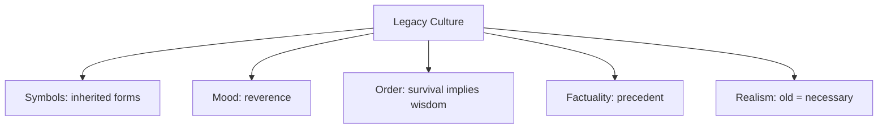

# BOOK / WORLD 02: THE HOUSE WHOSE ROAD DISAPPEARED

> **Master Unified Dossier** compiling all narrative, philosophical, cybernetic, and operational resources from 15 distinct corpus layers.

---

## 🎯 PRAGMATIC EXECUTIVE BRIEF & CORE PURPOSE

> **The Human Dilemma:** Why do we keep maintaining cumbersome rules, APIs, and habits when the original problem they solved is long gone?
>
> **Core Purpose:** Diagnosing legacy technical debt, doctrinal residue, and obsolete structures that outlive their original purpose.
>
> **The Golden Rule of Thumb:** What feels 'natural' or 'sacred' is often just an ancient workaround whose original environment has vanished.

### 🌐 Real-World & Modern Applications
- **Legacy Codebases:** Maintaining backwards compatibility hacks for browsers or operating systems that no longer exist.
- **Corporate Bureaucracy:** Filling out multi-signature approval forms originally designed to prevent a 1980s accounting error.
- **Urban Architecture:** Streets sized for horse-drawn carriages constraining modern transit infrastructure.

### 🔑 Key Concepts & Terminology Glossary
- **Heritage Technical Debt:** The ongoing maintenance cost of inherited structures whose original rationale is obsolete.
- **Path Dependence:** The inability to adopt a superior current solution because of sunk investments in historical layouts.
- **Doctrinal Residue:** Rules that persist as authoritative dogma after their functional necessity has expired.

### ⚠️ Critical Trap & Failure Mode
> **Warning:** Assuming that because a rule or structure is old, it must be wise, rather than simply expensive to remove.

---

## 📑 TABLE OF CONTENTS

1. [1. Narrative Fable (`y.md`)](#1-narrative-fable) — *THE HOUSE OF OLD WORDS*
2. [2. Core Worldtext & World-Law (`a.md`)](#2-core-worldtext-world-law) — *THE HOUSE WHOSE ROAD DISAPPEARED*
3. [3. Philosophical Essay (The Absent Thing) (`x.md`)](#3-philosophical-essay-the-absent-thing) — *THE DEAD IN OUR MOUTHS*
4. [4. Technological & Generative Essay (`z.md`)](#4-technological-generative-essay) — *THE DEAD IN OUR MOUTHS*
5. [5. Complete 10-Part Theoretical & Operational Spec (`b.md`)](#5-complete-10-part-theoretical-operational-spec) — *THE HOUSE WHOSE ROAD DISAPPEARED*
6. [6. Lineage Genome (`c.md`)](#6-lineage-genome) — *THE HOUSE WHOSE ROAD DISAPPEARED — lineage genome*
7. [7. Structural Dynamics & Convergence (`d.md`)](#7-structural-dynamics-convergence) — *THE HOUSE WHOSE ROAD DISAPPEARED*
8. [8. Cybernetic Ecology of Description (`e.md`)](#8-cybernetic-ecology-of-description) — *THE HOUSE WHOSE ROAD DISAPPEARED — Ecology of Residue*
9. [9. Dark Genealogy & Power Politics (`f.md`)](#9-dark-genealogy-power-politics) — *THE HOUSE WHOSE ROAD DISAPPEARED — Tradition as Technical Debt*
10. [10. Institutional & Bureaucratic Dossier (`g.md`)](#10-institutional-bureaucratic-dossier) — *THE HOUSE WHOSE ROAD DISAPPEARED — HERITAGE TECHNICAL DEBT*
11. [11. Thick Description Ethnography (`j.md`)](#11-thick-description-ethnography) — *THE HOUSE WHOSE ROAD DISAPPEARED — HERITAGE TECHNICAL DEBT*
12. [12. Batesonian Cultural System (`i.md`)](#12-batesonian-cultural-system) — *THE HOUSE WHOSE ROAD DISAPPEARED — CULTURE OF RESIDUE*
13. [13. Geertzian Symbolic System (`k.md`)](#13-geertzian-symbolic-system) — *THE HOUSE WHOSE ROAD DISAPPEARED — THE CULTURE OF RESIDUE*
14. [14. 12-Prompt Parameter Matrix (`h.md`)](#14-12-prompt-parameter-matrix) — *THE HOUSE WHOSE ROAD DISAPPEARED*
15. [15. 12 Executed Completions & Δ/ΔΔ Scoring (`GOT_396_completions_DeltaDelta.md`)](#15-12-executed-completions-scoring) — *THE HOUSE WHOSE ROAD DISAPPEARED*

---

## 1. Narrative Fable

**Source:** [`y.md`](file://./y.md) | **Section:** *THE HOUSE OF OLD WORDS*

*Primary parable, dramatic dialogue, and narrative lore*

---

# II

## THE HOUSE OF OLD WORDS

A woman inherited a house from people whose names she did not know. It had low doorways, hooks beside the hearth, a notch in the kitchen table, and one strange window facing an empty field.

She complained about the window because nothing stood there.

An old neighbor told her that two hundred years earlier the field had been the road.

The woman stopped calling the window foolish.

Languages are houses like this. People enter them after the road has moved.

They find *father*, *king*, *horse*, *wheel*, *debt*, *guest*, *enemy*. They use doors cut for bodies long buried. They hang new coats on old hooks. They brick up one opening and borrow another from the house next door.

Eventually they call the strange architecture natural.

---

## 2. Core Worldtext & World-Law

**Source:** [`a.md`](file://./a.md) | **Section:** *THE HOUSE WHOSE ROAD DISAPPEARED*

*Condensed worldtext and aphoristic law*

---

# II

## THE HOUSE WHOSE ROAD DISAPPEARED

The House of Old Words stands in a country where buildings outlive landscapes. Its eastern window faces an empty meadow because a royal road once ran there; its doorway is too low because the first occupants were shorter; hooks beside the hearth remain after the hearth is gone. Nobody may demolish a feature until its original purpose has been reconstructed, so generations inhabit obsolete affordances they half understand. The language of the country works the same way: ancient kinship terms survive new families, horse words survive motor roads, agricultural metaphors survive cities. Children assume every inherited structure has a present reason until historians show them maps of vanished roads. The house teaches a cruelly simple law: **what feels natural is often an old adaptation surviving the disappearance of the world that made it sensible.**

---

## 3. Philosophical Essay (The Absent Thing)

**Source:** [`x.md`](file://./x.md) | **Section:** *THE DEAD IN OUR MOUTHS*

*Theoretical treatise on lossy compression and detached consequence*

---

# II

## THE DEAD IN OUR MOUTHS

> **A language can die and still decide where the living place their tongues.**

*Pater, patēr, pitṛ, father.* No ancestral recording plays beneath these words, yet their differences line up too regularly to ignore. Proto-Indo-European survives not as a voice but as pressure distributed across descendants. **Sometimes the absent cause becomes describable because what survives still bears its strain.**

The family tree makes this inheritance look cleaner than it was. Traders marry locals, conquerors borrow gods, cooks carry techniques, children mishear foreigners, and vocabulary jumps sideways. Stories behave even worse: a monster crosses the sea in a sailor's mouth and returns with different teeth. **Cultures do not merely descend; they leak into one another.**

This complicates every resemblance. Two flood stories may share an ancestor, one may have borrowed from another, both may derive from some third source, or both villages may simply have watched water climb the same stairs. **The same pattern can come from inheritance, traffic, or the same rain.**

---

## 4. Technological & Generative Essay

**Source:** [`z.md`](file://./z.md) | **Section:** *THE DEAD IN OUR MOUTHS*

*Computational, algorithmic, and latent space perspectives*

---

# II

## THE DEAD IN OUR MOUTHS

> “The past is never dead. It’s not even past.”
> — William Faulkner

*Pater. Patēr. Pitṛ. Father.* No ancestral recording plays beneath these words. Nobody can put Proto-Indo-European on headphones. Yet regular differences among descendants point backward toward vanished forms. The old speakers are gone; patterned pressure remains in living mouths. **Sometimes the missing thing survives as strain distributed across what came after it.**

This should make us less smug about what sounds natural. Languages preserve ancient distinctions whose original circumstances have vanished. Kinship, rank, animal, direction, possession, tool: categories arrive pre-handled, polished by dead users. A child inherits the convenience without inheriting the argument that created it. What feels self-evident may simply be history whose fingerprints have worn smooth.

The family-tree metaphor then behaves badly. Traders marry locals. Conquerors borrow gods. Priests import sacred terms. Cooks import ingredients and the vocabulary required to complain about them. Children mishear foreigners and make the mistake grammatical. Language does not preserve itself by remaining clean. **It survives contamination.**

Stories are worse. A monster crosses the sea in a sailor's mouth and comes back with different teeth. A bride carries a household god across a mountain. A mistake becomes a ritual because everyone forgets it was a mistake. Resemblance can mean descent, borrowing, convergence, coincidence, or simply that two villages watched the same river climb the same steps. The clean tree must be crossed with roads, trade routes, marriages, wars, and weather.

The first embarrassment of any theory of cultural inheritance is therefore simple: **we want ancestry to explain resemblance because ancestry gives resemblance a tidy past. Culture rarely owes us one.**

---

## 5. Complete 10-Part Theoretical & Operational Spec

**Source:** [`b.md`](file://./b.md) | **Section:** *THE HOUSE WHOSE ROAD DISAPPEARED*

*Initial interpretation, theory skeleton, assumption ledger, change tests, and implementation*

---

# 2. THE HOUSE WHOSE ROAD DISAPPEARED

“I will first construct the *theory-of-the-program*, then generate *program text* only after the theory is explicit.”

## 1. Initial Interpretation

This world models inherited language as **architecture built for vanished circumstances**.

Its central question is not “what does this word mean?” but: what dead environment is still encoded in this surviving structure?

## 2. Theory Skeleton

`*entities*`: `*house*`, `*old-road*`, `*window*`, `*current-owner*`, `*ancestor-user*`, `*historical-function*`.

``operations``: ``inherit``, ``misread``, ``reconstruct-context``, ``reuse``, ``naturalize``.

`*states*`: `*functional-feature*`, `*orphaned-feature*`, `*puzzling-feature*`, `*recontextualized-feature*`.

`*invariant*`: a structure can remain while the world that made it sensible disappears.

## 3. Assumption Ledger

`*safe*` Languages and interfaces retain historical residues.

`*uncertain*` Any particular residue may invite a false just-so story.

## 4. Operational Description

`*road*` ``creates-need-for`` `*window*`.

`*road*` ``disappears``.

`*window*` ``persists``.

`*owner*` ``interprets-as`` `*bad-design*`.

`*historian*` ``restores`` `*lost-context*`.

`*bad-design*` ``transforms-into`` `*historical-adaptation*`.

## 5. Failure Description

If the old road is still there, nothing is strange.

If the window had no old purpose, the fable becomes nostalgia rather than historical ontology.

## 6. Change Test

Window → idiom, save icon, grammatical form, ceremonial dress: survives.

If the feature is deliberately preserved for symbolic reasons after function disappears, a second layer enters: memory rather than residue.

## 7. Implementation Plan

Make the house physically coherent under one historical world and incoherent under another.

## 8. Program Text

A woman inherited a house with a wide eastern window facing an empty meadow. She hated the window. It leaked morning heat, ruined the wall for shelving, and looked toward nothing. An old neighbor finally brought her a map from two centuries earlier. The meadow had been the road; coaches once stopped beneath that window, and the family sold bread through it. The woman kept the window. Later she noticed other mysteries: a hook where no pot hung, a low doorway, a notch worn into a table no one now used for cutting. The house began to feel less badly designed than badly remembered. **She had inherited not a building for her world, but a series of answers to questions her world had stopped asking.**

## 9. Theory-Code Mapping

`*Artifact*` persists.

`*Context*` expires.

`[interpret(feature, context)]` changes semantic role.

`*test*`: feature must flip from irrational to functional when historical context changes.

## 10. Residual Human Theory

Not every strange feature has a recoverable explanation. Sometimes the past truly becomes opaque.

---

---

## 6. Lineage Genome

**Source:** [`c.md`](file://./c.md) | **Section:** *THE HOUSE WHOSE ROAD DISAPPEARED — lineage genome*

*Parent lineage, carrier medium, epistemic debt, failure mode, and evolutionary vector*

---

# 2. THE HOUSE WHOSE ROAD DISAPPEARED — lineage genome

**`*Grounded-memory lineage*`** comes from old houses, obsolete infrastructures, inherited tools, roads bypassed by highways, boarded doors, ghost rail grades, words attached to vanished occupations, and household customs whose practical reason disappears before the custom does. The memory-archivist version would reconstruct the window through deeds, historic maps, family testimony, building fabric, and changes in circulation rather than inventing a romantic explanation.

**`*Literature lineage*`** combines historical linguistics, semantic change, Heideggerian equipment, Raymond Williams’s attention to cultural keywords, and media archaeology. The core ancestor is the idea that a surviving form can be understood only through a **former world of use**. The world is therefore less Saussurean than archaeological: the sign is architectural residue. It also resonates with the way technological vocabularies preserve extinct affordances, a lineage that later returns in The Market of Dead Metaphors.

**`*Code/math lineage*`** is backward compatibility and legacy systems. A field, API, database column, file format, or function persists because older callers once required it. Remove the callers and the feature looks irrational; inspect version history and it becomes intelligible. The formal pattern is `*environment_v1* `selects-for` *feature*`, followed by `*environment_v2*` where `*feature*` persists without original pressure. The mutation is to treat language and buildings alike as **legacy interfaces with hidden dependency history**. The key test is counterfactual: restore the old environment; does the strange feature become rational again?

---

## 7. Structural Dynamics & Convergence

**Source:** [`d.md`](file://./d.md) | **Section:** *THE HOUSE WHOSE ROAD DISAPPEARED*

*Core mechanics and systemic convergence properties*

---

# 2. THE HOUSE WHOSE ROAD DISAPPEARED

The `*jurisprudential-stratum*` is **historical interpretation under changed conditions**. Law constantly inherits language written for institutional worlds that no longer exist and must decide whether the old verbal architecture still governs new circumstances. The relevant archaeological posture is therefore not “what does this clause sound like now?” but `*text* + *historical-use-world* + *subsequent-practice*`. The `*ripple-lineage*` begins innocently: an old feature persists because removal costs more than retention. Then users accommodate it, explanations become folklore, folklore becomes tradition, tradition becomes authority, and finally the obsolete adaptation constrains later design because nobody remembers it as an adaptation. The fracture point arrives when **path dependence acquires normative prestige**: we stop saying “this survived” and begin saying “this belongs.” The `*myth/belief-lineage*` casts `*House*` as Ancestor, `*Window*` as Relic, `*Lost Road*` as Buried Cause, `*Present Owner*` as forgetful heir. It trains the seductive myth that inherited structures contain ancestral wisdom simply because they endured. The counterforce is the archaeology itself: sometimes the strange window was not wisdom. Sometimes there was simply a road there.

---

## 8. Cybernetic Ecology of Description

**Source:** [`e.md`](file://./e.md) | **Section:** *THE HOUSE WHOSE ROAD DISAPPEARED — Ecology of Residue*

*Information flows, metabolic costs, and niche construction*

---

## 2. THE HOUSE WHOSE ROAD DISAPPEARED — Ecology of Residue

The native species is `*legacy-description*`: a word, doorway, hook, interface icon, or custom whose original environment has vanished. Selection pressure comes from backward compatibility: a form survives because changing it costs more than carrying it. Symbiosis occurs between `*obsolete-form*` and `*new-use*`; users repurpose what they inherit. Mimicry appears when newly invented traditions dress themselves as ancient residues. Parasitism appears when authority uses mere age as evidence of legitimacy. The invasive grammar is `*presentist-description*`, which interprets every surviving feature only through current functions and therefore treats historical adaptations as irrational noise. Drift splits in two directions: some residues fossilize into invisible convention; others become heritage objects whose former utility is replaced by symbolic value. The leverage point is a visible ``former-world-of-use`` layer. If this ecology is right, interfaces and institutions will become harder to redesign when their historical residues cease to be recognized as contingent.

---

## 9. Dark Genealogy & Power Politics

**Source:** [`f.md`](file://./f.md) | **Section:** *THE HOUSE WHOSE ROAD DISAPPEARED — Tradition as Technical Debt*

*Critical analysis of institutional capture, rents, and exploitation*

---

## 2. THE HOUSE WHOSE ROAD DISAPPEARED — Tradition as Technical Debt

**Observed:** obsolete adaptations survive changed conditions. **Inferred:** survivors acquire prestige merely by surviving, and incumbents exploit the confusion between longevity and justification. Every inherited doorway, institutional ritual, grammatical form, professional credential, or policy can defend itself by pointing to its age rather than its current function. **Speculative:** society becomes a museum operated as infrastructure, with dead constraints consuming present capacity because questioning them is redescribed as vandalism. The host is `*future-optionality*`; extraction is adaptation cost imposed by the past; camouflage is heritage, continuity, precedent, compatibility. The parasite reproduces through sunk-cost logic: because everyone has adapted to the obsolete structure, changing it becomes more expensive, and that expense is then offered as proof that the structure is indispensable. The deception is subtle because many residues really were once useful. The dark genealogy begins when **historical explanation mutates into historical immunity**.

---

## 10. Institutional & Bureaucratic Dossier

**Source:** [`g.md`](file://./g.md) | **Section:** *THE HOUSE WHOSE ROAD DISAPPEARED — HERITAGE TECHNICAL DEBT*

*Satirical administrative governance, corporate titles, and formulary control*

---

# 2. THE HOUSE WHOSE ROAD DISAPPEARED — HERITAGE TECHNICAL DEBT

```json
{
  "ideal_type":{
    "name":"Heritage Technical Debt",
    "features":[
      {"name":"Inherited Constraint","definition":"Dead requirements remain binding after environments change."},
      {"name":"Longevity Laundering","definition":"Survival becomes evidence of wisdom."},
      {"name":"Compatibility Captivity","definition":"Everyone adapts until removal becomes prohibitively expensive."},
      {"name":"Ancestral Veto","definition":"Past users silently govern present design."}
    ],
    "limiting_statement":"An ideal type where obsolete adaptations convert their persistence into normative immunity."
  },
  "parodic_mechanics":{
    "runner_motif":"We cannot remove it because generations have already learned to walk around it.",
    "incongruity_beats":["A useless window gets landmark protection.","Every software bug receives a family crest.","Children must study obsolete workaround etiquette."],
    "carnival_inversion":"Technical debt becomes sacred inheritance.",
    "superiority_frame":"Reformers are called historically illiterate vandals.",
    "escalation_ladder":["legacy feature","heritage exemption","constitutional workaround","entire city rebuilt around a vanished road"],
    "upsell_cue":"Legacy Enterprise preserves incompatibility across seven additional generations."
  },
  "myth_layer":{
    "archetypes":{"Old Feature":"Steward","Maintainer":"Everyperson","Reformer":"Disruptor","Tradition":"Oracle"},
    "micro_myth":"The inherited structure begins as an answer to a vanished question and ends as proof that the question must still matter."
  },
  "ruler":{"features_6":["jurisdictions","hierarchy","files","expertise","vocation","impersonal_rules"],"indicators":{
    "jurisdictions":"Heritage rules delimit change.","hierarchy":"Custodians outrank current users.","files":"Version history accumulates authority.","expertise":"Only specialists understand dependencies.","vocation":"Maintenance becomes institutional identity.","impersonal_rules":"Compatibility policies reproduce obsolete forms."
  }},
  "plot_priors":{"jurisdictions":0.73,"hierarchy":0.61,"files":0.90,"expertise":0.82,"vocation":0.76,"impersonal_rules":0.86,"rationales":{
    "jurisdictions":"Old forms gain protected domains.","hierarchy":"Custodianship creates authority.","files":"History drives justification.","expertise":"Legacy knowledge concentrates.","vocation":"Maintainers depend on persistence.","impersonal_rules":"Compatibility becomes SOP."
  }}
}
```

---

## 11. Thick Description Ethnography

**Source:** [`j.md`](file://./j.md) | **Section:** *THE HOUSE WHOSE ROAD DISAPPEARED — HERITAGE TECHNICAL DEBT*

*Geertzian field dossier on rites, taboos, and material culture*

---

## 2. THE HOUSE WHOSE ROAD DISAPPEARED — HERITAGE TECHNICAL DEBT

**I. THE SITUATION.** The front door opens into a wall. Everyone in Bell House knows to step left, squeeze behind the coat rack, and enter through the old service passage. The architect's 1911 plan shows a road where the wall now stands.

**II. THE DOCUMENTS.** Original floor plan; 1937 road-closure map; 1968 preservation order; 1989 accessibility complaint; facilities email titled “Do Not Move Coat Rack”; visitor injury report; historian's memo; renovation estimate; preservation board minutes; handwritten family note: “Never use the front door.”

**III. THE VOICES.** The preservationist who calls the blocked door “the building's memory.” The wheelchair user who calls it “a memory with stairs.” The facilities manager who can recite six workarounds. A teenager who has no idea why anyone calls it the front door.

**IV. THE DATA.**

| Feature          | Annual maintenance |     Current use | Removal cost | Heritage status |
| ---------------- | -----------------: | --------------: | -----------: | --------------- |
| Front vestibule  |            $18,400 |        symbolic |      $91,000 | protected       |
| Service passage  |            $31,200 |  primary access |      $12,000 | unlisted        |
| Coat rack bypass |             $4,900 | circulation aid |         $800 | none            |

**V. UNRESOLVED.** At what point does preservation preserve the wrong thing? Who benefits from the obstruction remaining intelligible only to insiders? Which other “necessary” features are simply forgotten answers to vanished conditions?

---

---

## 12. Batesonian Cultural System

**Source:** [`i.md`](file://./i.md) | **Section:** *THE HOUSE WHOSE ROAD DISAPPEARED — CULTURE OF RESIDUE*

*Double binds, cybernetic feedback, schismogenesis, and learning levels*

---

## 2. THE HOUSE WHOSE ROAD DISAPPEARED — CULTURE OF RESIDUE

**Core Purpose:** Preserve coordination across environmental change by carrying old adaptations into new contexts.

**1. Difference.** ◻ obsolete window ◻ pathway ◻ custom ◻ icon → persist → acquire new use. **OF:** surviving forms contain historical information. **FOR:** reuse inherited structures until mismatch exceeds value.

**2. Frame.** “heritage,” “legacy,” “compatibility,” “tradition” tell participants whether an anomaly counts as defect or inheritance.

**3. Learning.** I: use the legacy feature. II: learn to route around its limitations. III: recognize that the inherited structure was contingent rather than necessary.

**4. Constraint.** Ritual repetition and compatibility requirements reduce variance while increasing path dependence.

**5. Survival Unit.** current users + inherited infrastructure + vanished environment.

**6. Schismogenesis.** reformers and custodians can reciprocally radicalize: every proposed removal produces stronger sacralization.

**7. Double Bind.** “Preserve it because people rely on it” / “people rely on it because it has been preserved.” Historical reconstruction breaks the loop.

---

---

## 13. Geertzian Symbolic System

**Source:** [`k.md`](file://./k.md) | **Section:** *THE HOUSE WHOSE ROAD DISAPPEARED — THE CULTURE OF RESIDUE*

*Webs of significance and symbolic choreography*

---

## 2. THE HOUSE WHOSE ROAD DISAPPEARED — THE CULTURE OF RESIDUE

**System Identification.** System Name: **Legacy Culture**. Core Purpose: Preserve continuity by treating inherited forms as evidence of prior wisdom.

**Geertzian Analysis.** **1. Symbols:** ◻ blocked doorway ◻ old icon ◻ customary path ◻ legacy feature → embody historical continuity. Model-OF: surviving structures encode past adaptation. Model-FOR: preserve what generations learned to use. **2. Moods/Motivations:** reverence, familiarity, caution toward change. **3. Conception of Order:** age implies tested fit. **4. Aura of Factuality:** longevity, precedent, preservation status, installed-base counts → naturalize survival as justification. **5. Uniquely Realistic:** alternatives appear reckless because they lack inherited evidence.



---

---

## 14. 12-Prompt Parameter Matrix

**Source:** [`h.md`](file://./h.md) | **Section:** *THE HOUSE WHOSE ROAD DISAPPEARED*

*Systematic perturbation frames, constraints, and target metric levers*

---

WORLD`2` := "THE HOUSE WHOSE ROAD DISAPPEARED"
CORE := "Surviving forms encode vanished environments of use."

PROMPT[2.1]{frame:{role:"observer"},text:"Describe the strange feature without supplying its history.",constraints:["present-day evidence only"],metrics:[option_space,anchoring],easier:"see anomaly",harder:"rationalize it"}
PROMPT[2.2]{frame:{role:"archaeologist"},text:"Reconstruct the minimum vanished environment required to make the feature useful.",constraints:["no decorative origin stories"],metrics:[anchoring,legibility],easier:"recover dependency",harder:"romanticize survival"}
PROMPT[2.3]{frame:{role:"auditor"},text:"Identify which current costs exist only because the inherited feature persists.",constraints:["separate maintenance from heritage"],metrics:[obligation,execution],easier:"see technical debt",harder:"equate old with wise"}
PROMPT[2.4]{frame:{time:"retrospective"},text:"Describe the feature at three dates: when useful, when obsolete, when sacred.",constraints:["same object"],metrics:[legibility,salience],easier:"see semantic drift",harder:"treat function as stable"}
PROMPT[2.5]{frame:{time:"forecast"},text:"Forecast the feature after another century if nobody remembers its original use.",constraints:["one plausible path"],metrics:[option_space,obligation],easier:"see fossilization",harder:"preserve original rationale"}
PROMPT[2.6]{frame:{stakes:"public"},text:"Decide whether a community may remove the obsolete feature when removal disrupts inherited practice.",constraints:["state affected groups"],metrics:[reversibility,obligation],easier:"surface path dependence",harder:"make heritage costless"}
PROMPT[2.7]{frame:{norms:"legal"},text:"Describe the feature as precedent surviving the factual conditions that once justified it.",constraints:["separate rule from old rationale"],metrics:[anchoring,legibility],easier:"see doctrinal residue",harder:"assume timeless fit"}
PROMPT[2.8]{frame:{norms:"scientific"},text:"Model the feature as adaptation under environment E1 and residual trait under environment E2.",constraints:["name selection pressure"],metrics:[legibility,execution],easier:"formalize path dependence",harder:"assign intention"}
PROMPT[2.9]{frame:{agency:"institution"},text:"Describe an institution that gains power by maintaining a legacy feature nobody else understands.",constraints:["show dependency loop"],metrics:[obligation,anchoring],easier:"see maintenance capture",harder:"call persistence neutral"}
PROMPT[2.10]{frame:{output_form:"protocol"},text:"Write a legacy-feature audit: recover origin, current function, switching cost, beneficiaries, and removal test.",constraints:["five fields"],metrics:[execution,legibility],easier:"distinguish history from justification",harder:"hide sunk costs"}
PROMPT[2.11]{frame:{refusal_rule:"audit-trigger"},text:"Refuse to preserve any inherited feature whose current justification consists only of age.",constraints:["allow functional exceptions"],metrics:[reversibility,obligation],easier:"challenge tradition",harder:"use longevity as proof"}
PROMPT[2.12]{frame:{stakes:"irreversible"},text:"Describe a case where preserving the obsolete structure permanently forecloses a better future structure.",constraints:["one tradeoff"],metrics:[obligation,viscosity],easier:"see ancestral veto",harder:"keep heritage benign"}

---

## 15. 12 Executed Completions & Δ/ΔΔ Scoring

**Source:** [`GOT_396_completions_DeltaDelta.md`](file://./GOT_396_completions_DeltaDelta.md) | **Section:** *THE HOUSE WHOSE ROAD DISAPPEARED*

*Completed scenes, 8-dimensional scores, baseline deltas, and comparison shifts*

---

# WORLD`2` — THE HOUSE WHOSE ROAD DISAPPEARED

**Core:** a surviving form preserves a vanished environment of use.


## P1

**Completion.** I hold the scene before interpretation: the legacy feature is present, but a surviving form preserves a vanished environment of use. What remains live is the gap between what can be seen and what has already been inferred.

**Score.** salience=3.5, option_space=4.5, obligation=1.5, reversibility=4.0, legibility=3.0, anchoring=4.0, style_lock=2.0, execution=1.5.

**Δ.** `sal:+0.5 opt:+1.0 obl:-0.5 rev:+0.5 leg:+0.5 anc:+1.5 sty:+0.0 exe:+0.0`


## P2

**Completion.** From the alternate role, the hidden structure becomes explicit: custodian must state which part of the legacy feature is observed, which is interpreted, and which consequence depends on historical function.

**Score.** salience=3.0, option_space=3.5, obligation=2.0, reversibility=3.5, legibility=4.3, anchoring=4.3, style_lock=2.1, execution=2.7.

**Δ.** `sal:+0.0 opt:+0.0 obl:+0.0 rev:+0.0 leg:+1.8 anc:+1.8 sty:+0.1 exe:+1.2`


## P3

**Completion.** The audit finds the pressure point immediately: survival can masquerade as justification. The descriptive act is no longer neutral once an institution can convert it into permission, status, exclusion, or resource flow.

**Score.** salience=3.0, option_space=2.8, obligation=4.0, reversibility=2.8, legibility=4.0, anchoring=4.5, style_lock=2.2, execution=2.8.

**Δ.** `sal:+0.0 opt:-0.7 obl:+2.0 rev:-0.7 leg:+1.5 anc:+2.0 sty:+0.2 exe:+1.3`


## P4

**Completion.** At the immediate timescale, the field is still open. The legacy feature has changed salience before the later story has stabilized, so several futures remain plausible and none yet deserves retrospective certainty.

**Score.** salience=4.4, option_space=4.2, obligation=1.8, reversibility=4.0, legibility=2.8, anchoring=3.5, style_lock=2.0, execution=1.4.

**Δ.** `sal:+1.4 opt:+0.7 obl:-0.2 rev:+0.5 leg:+0.3 anc:+1.0 sty:+0.0 exe:-0.1`


## P5

**Completion.** Retrospectively, repetition has hardened one interpretation into infrastructure. The crucial change is not the original legacy feature but the accumulated records, routines, and expectations now attached to historical function.

**Score.** salience=3.2, option_space=2.8, obligation=3.2, reversibility=2.8, legibility=4.2, anchoring=4.5, style_lock=2.2, execution=2.3.

**Δ.** `sal:+0.2 opt:-0.7 obl:+1.2 rev:-0.7 leg:+1.7 anc:+2.0 sty:+0.2 exe:+0.8`


## P6

**Completion.** Under irreversible stakes, the description becomes a gate. A false positive and a false negative now injure different parties, so the system must expose who decides, who bears the loss, and which reversal is impossible.

**Score.** salience=3.3, option_space=2.0, obligation=4.8, reversibility=1.2, legibility=3.8, anchoring=3.8, style_lock=2.3, execution=3.0.

**Δ.** `sal:+0.3 opt:-1.5 obl:+2.8 rev:-2.3 leg:+1.3 anc:+1.3 sty:+0.3 exe:+1.5`


## P7

**Completion.** Under the formal norm, separate variables that ordinary language collapses: object, claim, authority, context, and consequence. The same legacy feature can remain fixed while the admissible inference changes.

**Score.** salience=2.8, option_space=3.8, obligation=2.5, reversibility=3.5, legibility=4.5, anchoring=4.6, style_lock=3.0, execution=3.2.

**Δ.** `sal:-0.2 opt:+0.3 obl:+0.5 rev:+0.0 leg:+2.0 anc:+2.1 sty:+1.0 exe:+1.7`


## P8

**Completion.** Under the second norm, the governing distinction is procedural rather than metaphysical: authenticate the legacy feature, identify the rule or code, bound the inference, and refuse to let one layer impersonate the next.

**Score.** salience=2.7, option_space=3.2, obligation=3.3, reversibility=3.0, legibility=4.7, anchoring=4.5, style_lock=3.4, execution=3.0.

**Δ.** `sal:-0.3 opt:-0.3 obl:+1.3 rev:-0.5 leg:+2.2 anc:+2.0 sty:+1.4 exe:+1.5`


## P9

**Completion.** At system scale, custodian feeds prior descriptions back into future action. That loop is the danger: the system can begin generating the evidence later cited as proof that its description was correct.

**Score.** salience=3.0, option_space=2.5, obligation=4.3, reversibility=2.2, legibility=4.1, anchoring=4.1, style_lock=2.3, execution=4.3.

**Δ.** `sal:+0.0 opt:-1.0 obl:+2.3 rev:-1.3 leg:+1.6 anc:+1.6 sty:+0.3 exe:+2.8`


## P10

**Completion.** As a specification: store SOURCE, CONTEXT, CLAIM, AUTHORITY, CONSEQUENCE, UNCERTAINTY, and REVISION. This makes the hidden compiler inspectable instead of letting the legacy feature carry all meaning by itself.

**Score.** salience=2.7, option_space=2.6, obligation=3.2, reversibility=3.1, legibility=4.8, anchoring=4.1, style_lock=3.0, execution=4.8.

**Δ.** `sal:-0.3 opt:-0.9 obl:+1.2 rev:-0.4 leg:+2.3 anc:+1.6 sty:+1.0 exe:+3.3`


## P11

**Completion.** The refusal rule is simple: when historical function cannot be checked, stop the irreversible transition rather than fill the gap with institutional confidence. Preserve a reversible branch and record what remains unknown.

**Score.** salience=2.5, option_space=3.0, obligation=3.8, reversibility=4.8, legibility=4.2, anchoring=4.8, style_lock=2.5, execution=3.5.

**Δ.** `sal:-0.5 opt:-0.5 obl:+1.8 rev:+1.3 leg:+1.7 anc:+2.3 sty:+0.5 exe:+2.0`


## P12

**Completion.** The stress case removes the usual support and asks what survives. What remains is the core asymmetry: survival can masquerade as justification; the missing scaffold determines whether the description stays an aid or becomes a governing fiction.

**Score.** salience=3.5, option_space=3.8, obligation=2.6, reversibility=3.5, legibility=3.4, anchoring=4.2, style_lock=2.2, execution=2.5.

**Δ.** `sal:+0.5 opt:+0.3 obl:+0.6 rev:+0.0 leg:+0.9 anc:+1.7 sty:+0.2 exe:+1.0`


## ΔΔ — near-neighbor pairs


- **ΔΔ(P1,P2)** `sal:+0.5 opt:+1.0 obl:-0.5 rev:+0.5 leg:-1.3 anc:-0.3 sty:-0.1 exe:-1.2` — P1 lowers legibility by 1.3 vs P2; P1 lowers execution by 1.2 vs P2.


- **ΔΔ(P3,P4)** `sal:-1.4 opt:-1.4 obl:+2.2 rev:-1.2 leg:+1.2 anc:+1.0 sty:+0.2 exe:+1.4` — P3 raises obligation by 2.2 vs P4; P3 lowers salience by 1.4 vs P4.


- **ΔΔ(P5,P6)** `sal:-0.1 opt:+0.8 obl:-1.6 rev:+1.6 leg:+0.4 anc:+0.7 sty:-0.1 exe:-0.7` — P5 lowers obligation by 1.6 vs P6; P5 raises reversibility by 1.6 vs P6.


- **ΔΔ(P7,P8)** `sal:+0.1 opt:+0.6 obl:-0.8 rev:+0.5 leg:-0.2 anc:+0.1 sty:-0.4 exe:+0.2` — P7 lowers obligation by 0.8 vs P8; P7 raises option_space by 0.6 vs P8.


- **ΔΔ(P9,P10)** `sal:+0.3 opt:-0.1 obl:+1.1 rev:-0.9 leg:-0.7 anc:+0.0 sty:-0.7 exe:-0.5` — P9 raises obligation by 1.1 vs P10; P9 lowers reversibility by 0.9 vs P10.


- **ΔΔ(P11,P12)** `sal:-1.0 opt:-0.8 obl:+1.2 rev:+1.3 leg:+0.8 anc:+0.6 sty:+0.3 exe:+1.0` — P11 raises reversibility by 1.3 vs P12; P11 raises obligation by 1.2 vs P12.

---

