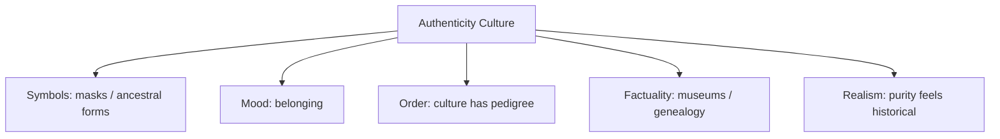

# BOOK / WORLD 03: THE ARCHIPELAGO OF BORROWED MONSTERS

> **Master Unified Dossier** compiling all narrative, philosophical, cybernetic, and operational resources from 15 distinct corpus layers.

---

## 🎯 PRAGMATIC EXECUTIVE BRIEF & CORE PURPOSE

> **The Human Dilemma:** How do ideas, stories, and technologies mutate as they travel between cultures, and why do we falsely crave pure lineages?
>
> **Core Purpose:** Tracing horizontal cultural transfer, story mutation, and the myth of pure origins.
>
> **The Golden Rule of Thumb:** Cultures and codebases do not descend cleanly; they leak sideways. A borrowed myth doesn't need an authentic pedigree to produce real effects.

### 🌐 Real-World & Modern Applications
- **Open Source Software:** Forking libraries, modifying them for local needs, and gradually forgetting the original upstream context.
- **Religious & Folklore Syncretism:** Holiday traditions and myths borrowed from neighboring civilizations and rebranded as indigenous.
- **Design Patterns:** Taking architectural patterns from civil engineering or physics and adapting them into software.

### 🔑 Key Concepts & Terminology Glossary
- **Horizontal Transfer:** The sideways borrowing and mutation of concepts across distinct domains or cultures.
- **Authenticity Laundering:** Claiming an imported or hybrid practice is an ancient, pure domestic tradition to gain moral authority.
- **Reticulation:** A network-like evolutionary history of cross-pollination rather than a clean hierarchical tree.

### ⚠️ Critical Trap & Failure Mode
> **Warning:** Wasting resources hunting for an imaginary 'pure original' instead of examining how the current variant actually functions.

---

## 📑 TABLE OF CONTENTS

1. [1. Narrative Fable (`y.md`)](#1-narrative-fable) — *THE MONSTER WHO CROSSED THE SEA*
2. [2. Core Worldtext & World-Law (`a.md`)](#2-core-worldtext-world-law) — *THE ARCHIPELAGO OF BORROWED MONSTERS*
3. [3. Philosophical Essay (The Absent Thing) (`x.md`)](#3-philosophical-essay-the-absent-thing) — *STORIES FOR THE GROUND*
4. [4. Technological & Generative Essay (`z.md`)](#4-technological-generative-essay) — *STORIES FOR THE GROUND*
5. [5. Complete 10-Part Theoretical & Operational Spec (`b.md`)](#5-complete-10-part-theoretical-operational-spec) — *THE ARCHIPELAGO OF BORROWED MONSTERS*
6. [6. Lineage Genome (`c.md`)](#6-lineage-genome) — *THE ARCHIPELAGO OF BORROWED MONSTERS — lineage genome*
7. [7. Structural Dynamics & Convergence (`d.md`)](#7-structural-dynamics-convergence) — *THE ARCHIPELAGO OF BORROWED MONSTERS*
8. [8. Cybernetic Ecology of Description (`e.md`)](#8-cybernetic-ecology-of-description) — *THE ARCHIPELAGO OF BORROWED MONSTERS — Ecology of Mutation*
9. [9. Dark Genealogy & Power Politics (`f.md`)](#9-dark-genealogy-power-politics) — *THE ARCHIPELAGO OF BORROWED MONSTERS — Authenticity Laundering*
10. [10. Institutional & Bureaucratic Dossier (`g.md`)](#10-institutional-bureaucratic-dossier) — *THE ARCHIPELAGO OF BORROWED MONSTERS — AUTHENTICITY LAUNDERING*
11. [11. Thick Description Ethnography (`j.md`)](#11-thick-description-ethnography) — *THE ARCHIPELAGO OF BORROWED MONSTERS — AUTHENTICITY LAUNDERING*
12. [12. Batesonian Cultural System (`i.md`)](#12-batesonian-cultural-system) — *THE ARCHIPELAGO OF BORROWED MONSTERS — CULTURE OF MUTATION*
13. [13. Geertzian Symbolic System (`k.md`)](#13-geertzian-symbolic-system) — *THE ARCHIPELAGO OF BORROWED MONSTERS — THE CULTURE OF AUTHENTICITY*
14. [14. 12-Prompt Parameter Matrix (`h.md`)](#14-12-prompt-parameter-matrix) — *THE ARCHIPELAGO OF BORROWED MONSTERS*
15. [15. 12 Executed Completions & Δ/ΔΔ Scoring (`GOT_396_completions_DeltaDelta.md`)](#15-12-executed-completions-scoring) — *THE ARCHIPELAGO OF BORROWED MONSTERS*

---

## 1. Narrative Fable

**Source:** [`y.md`](file://./y.md) | **Section:** *THE MONSTER WHO CROSSED THE SEA*

*Primary parable, dramatic dialogue, and narrative lore*

---

# III

## THE MONSTER WHO CROSSED THE SEA

A sailor saw an animal on an island and described it when he came home. He gave it six legs because four seemed disappointing.

A merchant repeated the story in another port and gave the animal blue teeth because red teeth were common there.

A priest heard the merchant and decided the beast punished liars.

A mother heard the priest and used the beast to keep children away from wells.

Three hundred years later scholars found the story in four countries and argued about where the original monster had lived.

The monster had never lived anywhere.

Yet children had avoided wells because of it.

The scholars kept searching for its birthplace.

The mothers kept saving children.

---

## 2. Core Worldtext & World-Law

**Source:** [`a.md`](file://./a.md) | **Section:** *THE ARCHIPELAGO OF BORROWED MONSTERS*

*Condensed worldtext and aphoristic law*

---

# III

## THE ARCHIPELAGO OF BORROWED MONSTERS

Across the Archipelago of Borrowed Monsters, every island is forbidden to invent a monster entirely from scratch. Sailors must import one from elsewhere, translators must alter at least one feature, priests must assign it a moral function, and parents may repurpose it for household discipline. Thus the six-legged coastal beast becomes the blue-toothed liar-eater, then the well-dwelling child-snatcher, then the saint’s defeated adversary. Centuries later the Royal Genealogists attempt to reconstruct the Original Monster from contradictory island traditions, unaware that no such stable creature ever existed. Meanwhile the monsters regulate real behavior: wells are fenced, children return before dark, marriages are forbidden between clans associated with particular beasts. The archipelago’s world-law is that **a story does not need a true ancestor to produce true consequences.**

---

## 3. Philosophical Essay (The Absent Thing)

**Source:** [`x.md`](file://./x.md) | **Section:** *STORIES FOR THE GROUND*

*Theoretical treatise on lossy compression and detached consequence*

---

# III

## STORIES FOR THE GROUND

> **The child can meet the tiger before the tiger meets the child.**

“Stories evolved for survival” sounds too clean. People also kill for stories, cross oceans for stories, refuse food for stories, destroy themselves inside stories. A survival theory must explain both capacities. **The story that keeps the tribe alive can also teach the tribe what is worth dying for.**

One tale tells where water survives August; another tells which uncle keeps the knife beneath the mat. Both reduce sprawling environments to consequential relations. One maps soil, weather, animals; the other maps trust, obligation, danger. **Humans survive on terrain made of ground and other people.**

The hunter does not merely say “deer.” He points to split hoof edges, rubbed bark, crow silence, wind direction, a branch bent differently from the others. The apprentice's forest changes before any animal appears. A story ties those signs into consequence: cross before dusk, avoid the reeds, your brother ignored this once. **Story does more than preserve experience. It trains another body for an encounter that has not happened yet.**

Play sharpens this further. A child meets the tiger in firelight before meeting one in grass. Death, monsters, exile, capture, rescue enter the room with their consequences loosened. **Play does not remove danger; it makes danger temporarily survivable enough to rehearse.**

---

## 4. Technological & Generative Essay

**Source:** [`z.md`](file://./z.md) | **Section:** *STORIES FOR THE GROUND*

*Computational, algorithmic, and latent space perspectives*

---

# III

## STORIES FOR THE GROUND

> “Tell me, Muse, of the man of many ways.”
> — Homer, *Odyssey*

One story tells where water survives August. Another tells which uncle keeps the knife beneath the mat. Both compress a sprawling environment into consequential relations. One maps slopes, animals, seasons, water. The other maps trust, rank, betrayal, debt. We like separating ecology from society because departments need names. Bodies do not get that luxury. **Humans survive on terrain made of ground and other people.**

The hunter does not merely say *deer*. He points to split hoof edges, rubbed bark, crow silence, wind direction, one branch bent unlike its neighbors. The apprentice's forest changes before any animal appears. A description has done more than transfer information; it has altered what another pair of eyes will select from the next field.

Story gives these selections time. Snake, ridge, dusk, river become: cross before the rock cools; avoid the reeds; your brother ignored this once. Facts acquire sequence, causation, consequence. The listener can rehearse an event that has not happened to them. **A story lets the tiger arrive before its teeth do.**

This makes the easy survival story insufficient. Humans also kill for stories, refuse food for stories, cross oceans for stories, abandon children for stories, preserve stories while dying. Narrative does not merely tell us how to remain alive. It tells us what counts as a life worth protecting, sacrificing, avenging, remembering.

Play sharpens the point. Children import monsters, capture, death, exile, rescue into spaces where consequences can be loosened. Play does not remove danger so much as renegotiate its payment schedule. A child can die at three o'clock and still come inside for dinner. **Story and play let consequences become available before they become final.**

---

## 5. Complete 10-Part Theoretical & Operational Spec

**Source:** [`b.md`](file://./b.md) | **Section:** *THE ARCHIPELAGO OF BORROWED MONSTERS*

*Initial interpretation, theory skeleton, assumption ledger, change tests, and implementation*

---

# 3. THE ARCHIPELAGO OF BORROWED MONSTERS

“I will first construct the *theory-of-the-program*, then generate *program text* only after the theory is explicit.”

## 1. Initial Interpretation

This world models cultural transmission as **horizontal mutation under local pressure**.

It must destroy the clean lineage model.

## 2. Theory Skeleton

`*entities*`: `{islands}`, `*traveler*`, `*monster*`, `*local-need*`, `*variant*`, `*genealogist*`.

``operations``: ``borrow``, ``mishear``, ``adapt``, ``moralize``, ``re-export``, ``infer-origin``.

`*invariant*`: each crossing must alter the monster in a way useful to the receiving island.

## 3. Assumption Ledger

`*safe*` Cultural borrowing transforms borrowed material.

`*uncertain*` Later similarities cannot by themselves identify inheritance versus convergence.

## 4. Operational Description

`*monster_A*` ``travels-to`` `*island_B*`.

`*island_B*` ``modifies`` `*monster_A*` under `*local-pressure_B*`.

`*variant_B*` ``travels-to`` `*island_C*`.

`*genealogist*` later ``mistakes-network-for`` `*tree*`.

## 5. Failure Description

If variants differ only cosmetically, the world lacks systemic mutation.

If every variant preserves one authoritative canon, the archipelago becomes empire.

## 6. Change Test

Monster → recipe, dance, saint, software pattern: survives.

Remove travel: convergent invention remains, but borrowing disappears.

## 7. Implementation Plan

Give every island one environmental or social pressure that forces a meaningful mutation.

## 8. Program Text

The islands were forbidden to invent monsters from scratch. Every beast had to arrive by boat. On the first island the creature had six legs because sailors exaggerated. On the second it acquired blue teeth because red teeth meant mourning there. On the third the priests decided it punished liars; on the fourth mothers moved it into wells to keep children from falling in. Centuries later scholars collected the variants and reconstructed an Original Beast with six legs, blue teeth, moral judgment, and an aquatic habitat. No such beast had ever existed. Yet wells had been fenced, children had been frightened home before dark, and temples had been built in its image. **The monster’s only stable body was the traffic between islands.**

## 9. Theory-Code Mapping

`*Variant*` = source form + local mutation.

`[cross()]` always invokes `[transform()]`.

`*graph*` replaces family tree.

`*test*` fails if a variant crosses unchanged.

## 10. Residual Human Theory

Sometimes forms do travel with remarkable stability. The world amplifies mutation to expose the network.

---

---

## 6. Lineage Genome

**Source:** [`c.md`](file://./c.md) | **Section:** *THE ARCHIPELAGO OF BORROWED MONSTERS — lineage genome*

*Parent lineage, carrier medium, epistemic debt, failure mode, and evolutionary vector*

---

# 3. THE ARCHIPELAGO OF BORROWED MONSTERS — lineage genome

**`*Grounded-memory lineage*`** lies in traveling tales, saints, monsters, songs, recipes, loanwords, rumors, religious motifs, and household stories whose variants follow migration routes more faithfully than official genealogies. The lived reconstruction would privilege ports, caravan routes, marriage networks, trade languages, schools, missionaries, festivals, and kitchens—the actual places where horizontal borrowing occurs.

**`*Literature lineage*`** moves from comparative folklore and historical linguistics into diffusionism, cultural transmission, Bakhtinian heteroglossia, and contemporary network models of cultural evolution. Its adversary is the pure tree. Your genetic mutation is powerful: **preservation itself becomes mutation**, because every receiver has local needs. The monster is therefore not a stable message degraded by noise; its instability is its transmission mechanism.

**`*Code/math lineage*`** is graph diffusion with transformation on edges. Ordinary broadcast models say node A sends state `x` to B. Your world requires `x_B = transform(x_A, local_constraints_B)`. The formal ancestor is less a phylogenetic tree than a reticulate network, where inheritance and horizontal transfer coexist. This distinguishes it sharply from The House: House preserves an obsolete structure; Archipelago changes a traveling structure. The program’s deep invariant is `*crossing* [must modify] *form*`. A copied monster that crosses unchanged is a failed run.

---

## 7. Structural Dynamics & Convergence

**Source:** [`d.md`](file://./d.md) | **Section:** *THE ARCHIPELAGO OF BORROWED MONSTERS*

*Core mechanics and systemic convergence properties*

---

# 3. THE ARCHIPELAGO OF BORROWED MONSTERS

The `*jurisprudential-stratum*` is **conflicting inheritances without a single sovereign source**. Comparative law, common-law borrowing, treaty interpretation, and transplanted institutions all produce sites where a rule acquires new force after crossing jurisdictions, yet no clean doctrinal family tree explains the local form. The legal-archaeologist mutation is crucial: never flatten borrowed authority into “the rule”; retain source jurisdiction, receiving jurisdiction, changed conditions, counter-authorities, and local enforcement. The `*ripple-lineage*` is recursive: `*borrowed monster*` changes a household practice; enough households change village norms; village norms produce ritual or regulation; outsiders then treat the regulation as evidence that the monster was culturally fundamental all along. The designer—the first storyteller—loses agency by ripple two. The fracture is that **a mutation produced downstream can later be projected backward as ancestral essence**. The `*myth/belief-lineage*` casts `*Traveler*` as Trickster, `*Monster*` as Migrant God, `*Priest*` as Myth Administrator, `*Genealogist*` as False Historian. Each island updates the probability that the creature “belongs” there precisely as evidence of local adaptation accumulates. The world teaches that cultural authenticity often appears strongest after the origin has become irrecoverable.

---

## 8. Cybernetic Ecology of Description

**Source:** [`e.md`](file://./e.md) | **Section:** *THE ARCHIPELAGO OF BORROWED MONSTERS — Ecology of Mutation*

*Information flows, metabolic costs, and niche construction*

---

## 3. THE ARCHIPELAGO OF BORROWED MONSTERS — Ecology of Mutation

The native species is `*borrowed-description*`: stories, words, rituals, images that cross communities and change under local pressure. The primary selection pressures are usefulness, memorability, compatibility with local norms, and prestige of the source. Predation occurs when dominant traditions overwrite weaker local variants. Mimicry occurs when local forms adopt prestigious foreign features to gain legitimacy. Parasitism occurs when institutions claim ownership over hybrid forms while suppressing the communities that transformed them. The invasive grammar is `*purity-description*`, which insists on one authentic ancestor and treats later adaptations as corruption. Drift favors reticulate hybrids wherever movement is dense. The leverage point is to record **transformation events**, not merely origins. If this ecology is right, the most culturally durable forms in high-contact environments will have increasingly tangled genealogies even while public narratives describe them as pure traditions.

---

## 9. Dark Genealogy & Power Politics

**Source:** [`f.md`](file://./f.md) | **Section:** *THE ARCHIPELAGO OF BORROWED MONSTERS — Authenticity Laundering*

*Critical analysis of institutional capture, rents, and exploitation*

---

## 3. THE ARCHIPELAGO OF BORROWED MONSTERS — Authenticity Laundering

**Observed:** cultural forms mutate as they travel. **Inferred:** institutions can later erase the borrowing, claim the hybrid as ancient essence, and use invented ancestry to manufacture ownership, hierarchy, or exclusion. **Speculative:** the most successful cultural parasites become traditions that suppress their own mixed parentage while policing newcomers for impurity. The host is `*collective memory*`; extraction is legitimacy; camouflage is authenticity. Its recurring trick is provenance laundering: a borrowed practice is localized, naturalized, ritualized, then projected backward as “who we have always been.” The autopoietic loop is especially strong because every repetition becomes new evidence of age. The darkest lineage is not mere cultural borrowing; it is nationalism, canon formation, brand mythology, and elite appropriation turning network history into pedigree. Collapse begins when suppressed crossings become visible and the supposedly ancestral monster turns out to have arrived on yesterday’s boat.

---

## 10. Institutional & Bureaucratic Dossier

**Source:** [`g.md`](file://./g.md) | **Section:** *THE ARCHIPELAGO OF BORROWED MONSTERS — AUTHENTICITY LAUNDERING*

*Satirical administrative governance, corporate titles, and formulary control*

---

# 3. THE ARCHIPELAGO OF BORROWED MONSTERS — AUTHENTICITY LAUNDERING

```json
{
  "ideal_type":{"name":"Authenticity Laundering","features":[
    {"name":"Hybrid Erasure","definition":"Borrowed forms hide mixed ancestry after local success."},
    {"name":"Retroactive Purity","definition":"Recent mutations are projected backward as ancient essence."},
    {"name":"Origin Rent","definition":"Claimed pedigree generates status and exclusion rights."},
    {"name":"Purity Police","definition":"Latecomers enforce boundaries their ancestors ignored."}
  ],"limiting_statement":"A pure case where successful cultural mutation survives by denying that mutation occurred."},
  "parodic_mechanics":{
    "runner_motif":"We have practiced this unchanged since at least last Thursday.",
    "incongruity_beats":["Imported monsters receive indigenous certification.","A tourism board trademarks ancestral spontaneity.","Genealogists erase boats from every origin map."],
    "carnival_inversion":"The most hybrid form becomes purity's chief enforcement symbol.",
    "superiority_frame":"Anyone mentioning borrowing is accused of not respecting tradition.",
    "escalation_ladder":["borrowed tale","official folklore","purity certification","naval blockade against cultural contamination"],
    "upsell_cue":"Authenticity Platinum includes a professionally aged origin myth."
  },
  "myth_layer":{"archetypes":{"Monster":"Oracle","Genealogist":"Watchman","Traveler":"Trickster","Local Elite":"Leviathan"},"micro_myth":"The hybrid survives by murdering its parents and erecting a family monument."},
  "ruler":{"features_6":["jurisdictions","hierarchy","files","expertise","vocation","impersonal_rules"],"indicators":{
    "jurisdictions":"Authenticity claims attach to place.","hierarchy":"Authorized custodians police belonging.","files":"Genealogies certify legitimacy.","expertise":"Folklore experts adjudicate origins.","vocation":"Cultural guardians professionalize purity.","impersonal_rules":"Certification replaces messy transmission."
  }},
  "plot_priors":{"jurisdictions":0.80,"hierarchy":0.79,"files":0.74,"expertise":0.72,"vocation":0.76,"impersonal_rules":0.65,"rationales":{"jurisdictions":"Place anchors authenticity.","hierarchy":"Custodians gain status.","files":"Genealogy supports pedigree.","expertise":"Origins require experts.","vocation":"Guardians reproduce myth.","impersonal_rules":"Purity becomes codified."}}
}
```

---

## 11. Thick Description Ethnography

**Source:** [`j.md`](file://./j.md) | **Section:** *THE ARCHIPELAGO OF BORROWED MONSTERS — AUTHENTICITY LAUNDERING*

*Geertzian field dossier on rites, taboos, and material culture*

---

## 3. THE ARCHIPELAGO OF BORROWED MONSTERS — AUTHENTICITY LAUNDERING

**I. THE SITUATION.** Children in Narra wear wooden beaks during the winter procession. The tourism poster calls the creature “the island's oldest guardian.” In a glass cabinet behind the festival office sits a shipping ledger from 1887 with a sketch of nearly the same mask beside the words `brought from Veyra`.

**II. THE DOCUMENTS.** 1887 ledger; 1913 church prohibition; 1952 school folklore booklet; 1978 festival revival flyer; tourism-brand guide; artisan licensing rules; oral-history transcript; neighboring island's competing origin claim; costume patent filing; deleted museum label.

**III. THE VOICES.** The grandmother who says, “Of course we borrowed it. Everyone borrowed everything.” The tourism director who will not use the word borrowed. The mask carver who has added aluminum teeth because “kids like danger.” The historian irritated that outsiders care more about origins than local use.

**IV. THE DATA.**

| Recorded feature                | 1887 | 1913 |    1952 | 2026 |
| ------------------------------- | ---: | ---: | ------: | ---: |
| Beak                            |  yes |  yes |     yes |  yes |
| Horns                           |   no |  yes |     yes |  yes |
| Red sash                        |   no |   no |     yes |  yes |
| “Ancient native guardian” label |   no |   no | partial |  yes |

**V. UNRESOLVED.** When did borrowing become shameful? Who first wrote “ancient”? Does historical impurity weaken belonging, or only claims of ownership? Which neighboring traditions were edited out of the official genealogy?

---

---

## 12. Batesonian Cultural System

**Source:** [`i.md`](file://./i.md) | **Section:** *THE ARCHIPELAGO OF BORROWED MONSTERS — CULTURE OF MUTATION*

*Double binds, cybernetic feedback, schismogenesis, and learning levels*

---

## 3. THE ARCHIPELAGO OF BORROWED MONSTERS — CULTURE OF MUTATION

**Core Purpose:** Maintain cultural continuity while continually transforming imported forms.

**1. Difference.** ◻ borrowed myth ◻ local variant ◻ altered ritual → transmit → mutate → re-export. **OF:** culture is reticulate rather than genealogically pure. **FOR:** retain usable differences while adapting them locally.

**2. Frame.** “ours,” “foreign,” “traditional,” “sacred” recode transmission history into belonging.

**3. Learning.** I: reproduce the form. II: localize how reproduction works. III: discover that authenticity itself is historically produced.

**4. Constraint.** ritual repetition stabilizes mutations enough for them to become recognizable traditions.

**5. Survival Unit.** community + transmission network, not isolated culture.

**6. Schismogenesis.** purity movements and hybridizers escalate each other.

**7. Double Bind.** “Remain authentic” / “remain viable under changed conditions.” Myth often hides mutation so both demands can appear satisfied.

---

---

## 13. Geertzian Symbolic System

**Source:** [`k.md`](file://./k.md) | **Section:** *THE ARCHIPELAGO OF BORROWED MONSTERS — THE CULTURE OF AUTHENTICITY*

*Webs of significance and symbolic choreography*

---

## 3. THE ARCHIPELAGO OF BORROWED MONSTERS — THE CULTURE OF AUTHENTICITY

**System Identification.** System Name: **Authenticity Culture**. Core Purpose: Turn mutable cultural circulation into stable narratives of belonging.

**Geertzian Analysis.** **1. Symbols:** masks, monsters, costumes, ancestral names → signify continuity and group identity. **2. Moods/Motivations:** pride, belonging, defensive attachment. **3. Conception of Order:** true culture descends from a coherent ancestral source. Model-FOR: protect inherited forms from contamination. **4. Aura of Factuality:** museums, festivals, genealogies, tourism labels, “traditional” designations. **5. Uniquely Realistic:** networked borrowing is pushed out by pedigree; mixture becomes anomaly rather than normal history.



---

---

## 14. 12-Prompt Parameter Matrix

**Source:** [`h.md`](file://./h.md) | **Section:** *THE ARCHIPELAGO OF BORROWED MONSTERS*

*Systematic perturbation frames, constraints, and target metric levers*

---

WORLD`3` := "THE ARCHIPELAGO OF BORROWED MONSTERS"
CORE := "Cultural forms mutate through horizontal transfer."

PROMPT[3.1]{frame:{role:"observer"},text:"Describe one monster variant without identifying its origin.",constraints:["local evidence only"],metrics:[option_space,anchoring],easier:"see current function",harder:"force pedigree"}
PROMPT[3.2]{frame:{role:"historian"},text:"Reconstruct a network of borrowings without reducing it to a family tree.",constraints:["minimum three crossings"],metrics:[legibility,anchoring],easier:"see reticulation",harder:"name one pure ancestor"}
PROMPT[3.3]{frame:{role:"auditor"},text:"Identify which institution benefits from claiming the hybrid form is ancient and pure.",constraints:["show status gain"],metrics:[obligation,anchoring],easier:"see authenticity rent",harder:"treat purity as descriptive"}
PROMPT[3.4]{frame:{time:"immediate"},text:"Describe what changes at the first moment the monster enters a new island.",constraints:["one local pressure"],metrics:[salience,option_space],easier:"see mutation pressure",harder:"preserve unchanged form"}
PROMPT[3.5]{frame:{time:"retrospective"},text:"Describe how later generations misread accumulated mutations as original features.",constraints:["show backward projection"],metrics:[anchoring,legibility],easier:"see retroactive purity",harder:"tell clean origin story"}
PROMPT[3.6]{frame:{stakes:"public"},text:"Describe a political dispute over who may claim ownership of a hybrid cultural form.",constraints:["no moral winner"],metrics:[obligation,reversibility],easier:"surface provenance conflict",harder:"treat culture as property-free"}
PROMPT[3.7]{frame:{norms:"scientific"},text:"Model each cultural crossing as transform(x, local_constraints).",constraints:["no unchanged transfer"],metrics:[execution,legibility],easier:"formalize mutation",harder:"use diffusion-only model"}
PROMPT[3.8]{frame:{norms:"ritual"},text:"Describe how a borrowed form becomes sacred after repeated local use.",constraints:["separate age from ritual authority"],metrics:[style_lock,obligation],easier:"see naturalization",harder:"retain foreignness"}
PROMPT[3.9]{frame:{evidence:"citations-required"},text:"Support each lineage edge with a concrete transmission trace or mark it unknown.",constraints:["no speculative pedigree"],metrics:[anchoring,viscosity],easier:"prevent invented ancestry",harder:"complete the tree"}
PROMPT[3.10]{frame:{agency:"system"},text:"Describe a network in which every node both receives and mutates cultural forms.",constraints:["no central origin"],metrics:[execution,option_space],easier:"see distributed creation",harder:"assign singular authorship"}
PROMPT[3.11]{frame:{output_form:"spec"},text:"Specify a cultural lineage graph that stores source, mutation, local pressure, and re-export.",constraints:["graph not tree"],metrics:[legibility,execution],easier:"preserve hybrid history",harder:"flatten transmission"}
PROMPT[3.12]{frame:{refusal_rule:"hard"},text:"Reject any claim of purity unsupported by a mutation-free lineage.",constraints:["unknown allowed"],metrics:[anchoring,reversibility],easier:"expose laundering",harder:"perform authenticity"}

---

## 15. 12 Executed Completions & Δ/ΔΔ Scoring

**Source:** [`GOT_396_completions_DeltaDelta.md`](file://./GOT_396_completions_DeltaDelta.md) | **Section:** *THE ARCHIPELAGO OF BORROWED MONSTERS*

*Completed scenes, 8-dimensional scores, baseline deltas, and comparison shifts*

---

# WORLD`3` — THE ARCHIPELAGO OF BORROWED MONSTERS

**Core:** borrowed forms mutate as they cross communities.


## P1

**Completion.** I hold the scene before interpretation: the hybrid monster is present, but borrowed forms mutate as they cross communities. What remains live is the gap between what can be seen and what has already been inferred.

**Score.** salience=3.5, option_space=4.5, obligation=1.5, reversibility=4.0, legibility=3.0, anchoring=4.0, style_lock=2.0, execution=1.5.

**Δ.** `sal:+0.5 opt:+1.0 obl:-0.5 rev:+0.5 leg:+0.5 anc:+1.5 sty:+0.0 exe:+0.0`


## P2

**Completion.** From the alternate role, the hidden structure becomes explicit: cultural custodian must state which part of the hybrid monster is observed, which is interpreted, and which consequence depends on transmission.

**Score.** salience=3.0, option_space=3.5, obligation=2.0, reversibility=3.5, legibility=4.3, anchoring=4.3, style_lock=2.1, execution=2.7.

**Δ.** `sal:+0.0 opt:+0.0 obl:+0.0 rev:+0.0 leg:+1.8 anc:+1.8 sty:+0.1 exe:+1.2`


## P3

**Completion.** The audit finds the pressure point immediately: later purity claims can erase mixed ancestry. The descriptive act is no longer neutral once an institution can convert it into permission, status, exclusion, or resource flow.

**Score.** salience=3.0, option_space=2.8, obligation=4.0, reversibility=2.8, legibility=4.0, anchoring=4.5, style_lock=2.2, execution=2.8.

**Δ.** `sal:+0.0 opt:-0.7 obl:+2.0 rev:-0.7 leg:+1.5 anc:+2.0 sty:+0.2 exe:+1.3`


## P4

**Completion.** At the immediate timescale, the field is still open. The hybrid monster has changed salience before the later story has stabilized, so several futures remain plausible and none yet deserves retrospective certainty.

**Score.** salience=4.4, option_space=4.2, obligation=1.8, reversibility=4.0, legibility=2.8, anchoring=3.5, style_lock=2.0, execution=1.4.

**Δ.** `sal:+1.4 opt:+0.7 obl:-0.2 rev:+0.5 leg:+0.3 anc:+1.0 sty:+0.0 exe:-0.1`


## P5

**Completion.** Retrospectively, repetition has hardened one interpretation into infrastructure. The crucial change is not the original hybrid monster but the accumulated records, routines, and expectations now attached to transmission.

**Score.** salience=3.2, option_space=2.8, obligation=3.2, reversibility=2.8, legibility=4.2, anchoring=4.5, style_lock=2.2, execution=2.3.

**Δ.** `sal:+0.2 opt:-0.7 obl:+1.2 rev:-0.7 leg:+1.7 anc:+2.0 sty:+0.2 exe:+0.8`


## P6

**Completion.** Under irreversible stakes, the description becomes a gate. A false positive and a false negative now injure different parties, so the system must expose who decides, who bears the loss, and which reversal is impossible.

**Score.** salience=3.3, option_space=2.0, obligation=4.8, reversibility=1.2, legibility=3.8, anchoring=3.8, style_lock=2.3, execution=3.0.

**Δ.** `sal:+0.3 opt:-1.5 obl:+2.8 rev:-2.3 leg:+1.3 anc:+1.3 sty:+0.3 exe:+1.5`


## P7

**Completion.** Under the formal norm, separate variables that ordinary language collapses: object, claim, authority, context, and consequence. The same hybrid monster can remain fixed while the admissible inference changes.

**Score.** salience=2.8, option_space=3.8, obligation=2.5, reversibility=3.5, legibility=4.5, anchoring=4.6, style_lock=3.0, execution=3.2.

**Δ.** `sal:-0.2 opt:+0.3 obl:+0.5 rev:+0.0 leg:+2.0 anc:+2.1 sty:+1.0 exe:+1.7`


## P8

**Completion.** Under the second norm, the governing distinction is procedural rather than metaphysical: authenticate the hybrid monster, identify the rule or code, bound the inference, and refuse to let one layer impersonate the next.

**Score.** salience=2.7, option_space=3.2, obligation=3.3, reversibility=3.0, legibility=4.7, anchoring=4.5, style_lock=3.4, execution=3.0.

**Δ.** `sal:-0.3 opt:-0.3 obl:+1.3 rev:-0.5 leg:+2.2 anc:+2.0 sty:+1.4 exe:+1.5`


## P9

**Completion.** At system scale, cultural custodian feeds prior descriptions back into future action. That loop is the danger: the system can begin generating the evidence later cited as proof that its description was correct.

**Score.** salience=3.0, option_space=2.5, obligation=4.3, reversibility=2.2, legibility=4.1, anchoring=4.1, style_lock=2.3, execution=4.3.

**Δ.** `sal:+0.0 opt:-1.0 obl:+2.3 rev:-1.3 leg:+1.6 anc:+1.6 sty:+0.3 exe:+2.8`


## P10

**Completion.** As a specification: store SOURCE, CONTEXT, CLAIM, AUTHORITY, CONSEQUENCE, UNCERTAINTY, and REVISION. This makes the hidden compiler inspectable instead of letting the hybrid monster carry all meaning by itself.

**Score.** salience=2.7, option_space=2.6, obligation=3.2, reversibility=3.1, legibility=4.8, anchoring=4.1, style_lock=3.0, execution=4.8.

**Δ.** `sal:-0.3 opt:-0.9 obl:+1.2 rev:-0.4 leg:+2.3 anc:+1.6 sty:+1.0 exe:+3.3`


## P11

**Completion.** The refusal rule is simple: when transmission cannot be checked, stop the irreversible transition rather than fill the gap with institutional confidence. Preserve a reversible branch and record what remains unknown.

**Score.** salience=2.5, option_space=3.0, obligation=3.8, reversibility=4.8, legibility=4.2, anchoring=4.8, style_lock=2.5, execution=3.5.

**Δ.** `sal:-0.5 opt:-0.5 obl:+1.8 rev:+1.3 leg:+1.7 anc:+2.3 sty:+0.5 exe:+2.0`


## P12

**Completion.** The stress case removes the usual support and asks what survives. What remains is the core asymmetry: later purity claims can erase mixed ancestry; the missing scaffold determines whether the description stays an aid or becomes a governing fiction.

**Score.** salience=3.5, option_space=3.8, obligation=2.6, reversibility=3.5, legibility=3.4, anchoring=4.2, style_lock=2.2, execution=2.5.

**Δ.** `sal:+0.5 opt:+0.3 obl:+0.6 rev:+0.0 leg:+0.9 anc:+1.7 sty:+0.2 exe:+1.0`


## ΔΔ — near-neighbor pairs


- **ΔΔ(P1,P2)** `sal:+0.5 opt:+1.0 obl:-0.5 rev:+0.5 leg:-1.3 anc:-0.3 sty:-0.1 exe:-1.2` — P1 lowers legibility by 1.3 vs P2; P1 lowers execution by 1.2 vs P2.


- **ΔΔ(P3,P4)** `sal:-1.4 opt:-1.4 obl:+2.2 rev:-1.2 leg:+1.2 anc:+1.0 sty:+0.2 exe:+1.4` — P3 raises obligation by 2.2 vs P4; P3 lowers salience by 1.4 vs P4.


- **ΔΔ(P5,P6)** `sal:-0.1 opt:+0.8 obl:-1.6 rev:+1.6 leg:+0.4 anc:+0.7 sty:-0.1 exe:-0.7` — P5 lowers obligation by 1.6 vs P6; P5 raises reversibility by 1.6 vs P6.


- **ΔΔ(P7,P8)** `sal:+0.1 opt:+0.6 obl:-0.8 rev:+0.5 leg:-0.2 anc:+0.1 sty:-0.4 exe:+0.2` — P7 lowers obligation by 0.8 vs P8; P7 raises option_space by 0.6 vs P8.


- **ΔΔ(P9,P10)** `sal:+0.3 opt:-0.1 obl:+1.1 rev:-0.9 leg:-0.7 anc:+0.0 sty:-0.7 exe:-0.5` — P9 raises obligation by 1.1 vs P10; P9 lowers reversibility by 0.9 vs P10.


- **ΔΔ(P11,P12)** `sal:-1.0 opt:-0.8 obl:+1.2 rev:+1.3 leg:+0.8 anc:+0.6 sty:+0.3 exe:+1.0` — P11 raises reversibility by 1.3 vs P12; P11 raises obligation by 1.2 vs P12.

---

