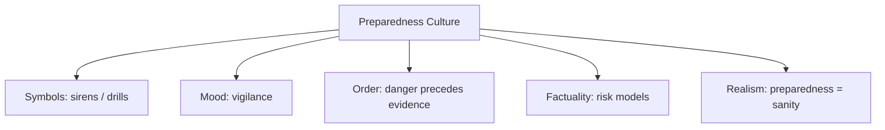

# BOOK / WORLD 04: THE VALLEY WHERE DANGERS ARRIVE EARLY

> **Master Unified Dossier** compiling all narrative, philosophical, cybernetic, and operational resources from 15 distinct corpus layers.

---

## 🎯 PRAGMATIC EXECUTIVE BRIEF & CORE PURPOSE

> **The Human Dilemma:** How do humans prepare for catastrophic risks before experiencing them in the flesh?
>
> **Core Purpose:** Exploring pre-enactment, simulation, and fiction as low-cost survival and rehearsal technologies.
>
> **The Golden Rule of Thumb:** Fiction is not a decorative lie; it is a rehearsal chamber that loosens real consequences so bodies can train for dangerous futures.

### 🌐 Real-World & Modern Applications
- **Disaster Simulations & Red Teaming:** Running cyberattack drills or fire simulations to train reflexes before an actual breach.
- **Aviation Flight Simulators:** Allowing pilots to crash ten thousand virtual airplanes to prevent a single real crash.
- **Storytelling & Literature:** Childhood fables instilling deep cautionary instincts regarding strangers, dark forests, and poisons.

### 🔑 Key Concepts & Terminology Glossary
- **Pre-enactment:** Simulating a future hazard in safe conditions to prime cognitive and physical reflexes.
- **Consequence Loosening:** Temporarily decoupling an action from its fatal real-world stakes during play or training.
- **Synthetic Preparedness:** Building genuine competence through exposure to artificial scenarios.

### ⚠️ Critical Trap & Failure Mode
> **Warning:** Confusing the rehearsal with reality, or becoming paralyzed by endless catastrophic scenarios that never occur.

---

## 📑 TABLE OF CONTENTS

1. [1. Narrative Fable (`y.md`)](#1-narrative-fable) — *THE TIGER IN THE ROOM*
2. [2. Core Worldtext & World-Law (`a.md`)](#2-core-worldtext-world-law) — *THE VALLEY WHERE DANGERS ARRIVE EARLY*
3. [3. Philosophical Essay (The Absent Thing) (`x.md`)](#3-philosophical-essay-the-absent-thing) — *WHAT HAPPENS AFTER THE WORD*
4. [4. Technological & Generative Essay (`z.md`)](#4-technological-generative-essay) — *WHAT HAPPENS AFTER THE WORD*
5. [5. Complete 10-Part Theoretical & Operational Spec (`b.md`)](#5-complete-10-part-theoretical-operational-spec) — *THE VALLEY WHERE DANGERS ARRIVE EARLY*
6. [6. Lineage Genome (`c.md`)](#6-lineage-genome) — *THE VALLEY WHERE DANGERS ARRIVE EARLY — lineage genome*
7. [7. Structural Dynamics & Convergence (`d.md`)](#7-structural-dynamics-convergence) — *THE VALLEY WHERE DANGERS ARRIVE EARLY*
8. [8. Cybernetic Ecology of Description (`e.md`)](#8-cybernetic-ecology-of-description) — *THE VALLEY WHERE DANGERS ARRIVE EARLY — Ecology of Rehearsal*
9. [9. Dark Genealogy & Power Politics (`f.md`)](#9-dark-genealogy-power-politics) — *THE VALLEY WHERE DANGERS ARRIVE EARLY — The Security Parasite*
10. [10. Institutional & Bureaucratic Dossier (`g.md`)](#10-institutional-bureaucratic-dossier) — *THE VALLEY WHERE DANGERS ARRIVE EARLY — PERMANENT PREPAREDNESS*
11. [11. Thick Description Ethnography (`j.md`)](#11-thick-description-ethnography) — *THE VALLEY WHERE DANGERS ARRIVE EARLY — PERMANENT PREPAREDNESS*
12. [12. Batesonian Cultural System (`i.md`)](#12-batesonian-cultural-system) — *THE VALLEY WHERE DANGERS ARRIVE EARLY — CULTURE OF REHEARSAL*
13. [13. Geertzian Symbolic System (`k.md`)](#13-geertzian-symbolic-system) — *THE VALLEY WHERE DANGERS ARRIVE EARLY — THE CULTURE OF PREPAREDNESS*
14. [14. 12-Prompt Parameter Matrix (`h.md`)](#14-12-prompt-parameter-matrix) — *THE VALLEY WHERE DANGERS ARRIVE EARLY*
15. [15. 12 Executed Completions & Δ/ΔΔ Scoring (`GOT_396_completions_DeltaDelta.md`)](#15-12-executed-completions-scoring) — *THE VALLEY WHERE DANGERS ARRIVE EARLY*

---

## 1. Narrative Fable

**Source:** [`y.md`](file://./y.md) | **Section:** *THE TIGER IN THE ROOM*

*Primary parable, dramatic dialogue, and narrative lore*

---

# IV

## THE TIGER IN THE ROOM

A village had no tigers, but every winter an old woman told children how a tiger approached from downwind, how birds fell quiet before it appeared, and how one should never run downhill through loose stones.

The children loved the tiger because it frightened them without eating anyone.

One year a trader brought news that tigers had entered the northern valley.

The adults debated whether the trader exaggerated.

The children checked the wind.

A story had arrived years before the animal it described.

That winter nobody called storytelling entertainment.

---

## 2. Core Worldtext & World-Law

**Source:** [`a.md`](file://./a.md) | **Section:** *THE VALLEY WHERE DANGERS ARRIVE EARLY*

*Condensed worldtext and aphoristic law*

---

# IV

## THE VALLEY WHERE DANGERS ARRIVE EARLY

In the Valley of Early Dangers, nothing dangerous is allowed to arrive without first appearing in story. Before winter, elders stage fireside rehearsals of avalanches, tigers, betrayal, illness, hunger, and getting lost; children must play each disaster from multiple roles, including the fool who ignores the warning. The valley’s maps contain no monsters, but its stories do. A child may therefore fear a tiger years before a tiger enters the watershed. When the real animal eventually appears, adults argue over evidence while children check wind direction because the story already taught their bodies what counted as a sign. Here fiction occupies the status of **pre-enactment** rather than falsehood. The valley survives by allowing possible worlds to arrive before actual ones charge admission.

---

## 3. Philosophical Essay (The Absent Thing)

**Source:** [`x.md`](file://./x.md) | **Section:** *WHAT HAPPENS AFTER THE WORD*

*Theoretical treatise on lossy compression and detached consequence*

---

# IV

## WHAT HAPPENS AFTER THE WORD

> **Do not ask first what the sentence means. Watch what everybody does next.**

A stick lies in dirt until someone says sword. A chalk line is pavement until someone says out. A wooden piece becomes king because players agree that some moves will count and others will not. **Rules redistribute what ordinary things are allowed to do.**

Language works under similar pressure. A sentence becomes promise, insult, prayer, joke, command without changing its atoms. “The river is rising” sends one person toward a notebook and another toward children's shoes. **Meaning does not sit inside the sentence; it appears partly in the choreography the sentence enters.**

This is where thin description breaks. A camera can record every twitch of an eyelid and still miss that the twitch is a mockery of another person's secret wink. More pixels solve the wrong problem. **A terabyte can preserve the eyelid and lose the wink.**

---

## 4. Technological & Generative Essay

**Source:** [`z.md`](file://./z.md) | **Section:** *WHAT HAPPENS AFTER THE WORD*

*Computational, algorithmic, and latent space perspectives*

---

# IV

## WHAT HAPPENS AFTER THE WORD

> “The meaning of a word is its use in the language.”
> — Ludwig Wittgenstein

“The river is rising.” One person writes down a number. Another wakes the children. Same words, different machinery. If we insist that meaning sits behind the sentence like powder sealed inside a capsule, ordinary life humiliates us before breakfast. **Meaning appears partly in what competent people know to do next.**

A stick becomes sword because hands agree to fight with it differently. Chalk becomes boundary because feet agree to stop. A carved piece becomes king because certain movements acquire consequence while others become illegal. Nothing mystical has happened to the wood. A practice has reorganized the field of possible action.

Language lives there. Promise, insult, joke, prayer, order are not substances hidden inside acoustic vibrations. They are moves whose force depends on surrounding rules, histories, expectations, institutions, bodies. The sentence does not carry its whole use with it. Other people finish it.

This is why the perfect camera can lose the wink. It records the eyelid; the village records flirtation, mockery, conspiracy, insult. More pixels do not recover the game if the game never entered the record. **A terabyte can preserve the muscle and miss the event.**

The lesson cuts both ways. A thin description can be wrong while every recorded detail is accurate. A crude sentence can be right because it catches the relation the sensor ignored. Technical fidelity and social fidelity do not automatically rise together.

---

## 5. Complete 10-Part Theoretical & Operational Spec

**Source:** [`b.md`](file://./b.md) | **Section:** *THE VALLEY WHERE DANGERS ARRIVE EARLY*

*Initial interpretation, theory skeleton, assumption ledger, change tests, and implementation*

---

# 4. THE VALLEY WHERE DANGERS ARRIVE EARLY

“I will first construct the *theory-of-the-program*, then generate *program text* only after the theory is explicit.”

## 1. Initial Interpretation

This program treats story as **low-cost advance contact with possible danger**.

## 2. Theory Skeleton

`*entities*`: `*storyteller*`, `*child*`, `*possible-danger*`, `*cue*`, `*rehearsal*`, `*later-event*`.

``operations``: ``simulate``, ``encode-cue``, ``rehearse``, ``recognize-later``.

`*invariant*`: narrative must alter behavior before the actual danger arrives.

## 3. Assumption Ledger

`*safe*` Stories can train expectations and attention.

`*uncertain*` Survival is not the sole function of narrative.

## 4. Operational Description

`*danger*` ``is-absent``.

`*story*` ``makes-model-of`` `*danger*`.

`*child*` ``practices-response-to`` `*model*`.

Later `*danger*` ``appears``.

`*child*` ``recognizes`` `*cue*` before direct encounter.

## 5. Failure Description

If the exact event is memorized as a rigid script, the child becomes brittle.

The story must teach cues and relations, not merely plot.

## 6. Change Test

Tiger → avalanche or betrayal: survives.

If no later action changes, story becomes ornament.

## 7. Implementation Plan

Make the valley’s pedagogy entirely anticipatory.

## 8. Program Text

In the Valley of Early Dangers, children were introduced to disasters before they were introduced to arithmetic. The elders told of tigers approaching from downwind, snow cracking above a slope, friends who lied too smoothly, rivers that looked shallow after storms. The children acted each story out and took turns being the fool. Years later, when a tiger actually entered the northern valley, the adults debated whether the trader’s report was credible. The children checked which way the grass bent. **The story had reached their bodies before the animal had.**

## 9. Theory-Code Mapping

`*Scenario*` stores cues and consequences.

`[rehearse()]` updates perceptual policy.

`*test*`: later cue must trigger action without replaying the whole story.

## 10. Residual Human Theory

Stories can create false danger just as easily as useful preparedness.

---

---

## 6. Lineage Genome

**Source:** [`c.md`](file://./c.md) | **Section:** *THE VALLEY WHERE DANGERS ARRIVE EARLY — lineage genome*

*Parent lineage, carrier medium, epistemic debt, failure mode, and evolutionary vector*

---

# 4. THE VALLEY WHERE DANGERS ARRIVE EARLY — lineage genome

**`*Grounded-memory lineage*`** is warning tale, cautionary tale, hunting instruction, disaster memory, children’s games, evacuation drills, navigation stories, proverbs tied to weather, and family anecdotes beginning “the last time somebody did that…”. Its grounded past is the place where elders translate one person’s costly experience into another person’s cheaper rehearsal.

**`*Literature lineage*`** joins Aristotle’s mimetic learning, Huizinga on play, Vygotskian learning through socially organized activity, narrative simulation theories, and pragmatist rehearsal. The important break from simplistic “story evolved for survival” accounts is that stories do not only forecast danger; they also establish what deserves sacrifice. Your world preserves the narrower mechanism—pre-experience rehearsal—without reducing all narrative to adaptive information.

**`*Code/math lineage*`** is simulation, model-predictive control, Monte Carlo rollouts, adversarial training, and synthetic environments. An agent can evaluate possible futures without paying the full cost of executing them. The program is `*possible_event* [compiled into] *low-cost rehearsal* `updates` *policy*`. The invariant is temporal asymmetry: the model must arrive **before** the real event. This differs from The Crossing, where the source event has already happened; here description gains value by modeling an event that may never happen at all.

---

## 7. Structural Dynamics & Convergence

**Source:** [`d.md`](file://./d.md) | **Section:** *THE VALLEY WHERE DANGERS ARRIVE EARLY*

*Core mechanics and systemic convergence properties*

---

# 4. THE VALLEY WHERE DANGERS ARRIVE EARLY

The `*jurisprudential-stratum*` is **risk regulation before injury**: precaution, threat assessment, safety codes, warnings, injunctions, emergency planning. The doctrinal fracture mirrors the fable: when is an imagined future sufficiently probable to justify present constraint? Procedure matters because institutions often require standing, ripeness, concrete injury, or other thresholds before hypothetical danger becomes judicially actionable. The `*ripple-lineage*` begins with a low-cost warning, produces rehearsal, then standard operating procedures, then institutionalized drills, then an economy of professional forecasters and compliance systems. At the outer rim, preparedness itself can reorganize perception until every ambiguous cue resembles the rehearsed danger. The `*myth/belief-lineage*` casts `*Tiger*` as Future Threat, `*Elder*` as Oracle, `*Child*` as Initiate, `*Rehearsal*` as ritual. Bayesianly, each story raises priors for certain dangers and lowers perceptual thresholds for matching cues. The mythic fracture is therefore exact: **the same narrative machinery that lets danger arrive early can also make an enemy arrive before one exists.**

---

## 8. Cybernetic Ecology of Description

**Source:** [`e.md`](file://./e.md) | **Section:** *THE VALLEY WHERE DANGERS ARRIVE EARLY — Ecology of Rehearsal*

*Information flows, metabolic costs, and niche construction*

---

## 4. THE VALLEY WHERE DANGERS ARRIVE EARLY — Ecology of Rehearsal

The native species is `*anticipatory-description*`: warning tale, scenario, drill, prophecy, simulation. Selection pressure comes from asymmetric cost: a false rehearsal is cheap compared with an unprepared catastrophe. This gives the ecosystem a natural bias toward overprediction. Predation appears when fear-rich narratives crowd out mundane but statistically common risks. Mimicry appears when political or commercial messages borrow the grammar of emergency. Parasitism occurs when institutions keep populations in rehearsal because permanent alertness increases compliance. The invasive grammar is `*spectacle-threat*`, which is memorable but poorly calibrated. Drift tends toward threat inflation unless costs for false positives remain visible. The leverage point is to retain an archive of `*predicted danger*` against `*actual outcome*`. If this ecology is right, cultures that rehearse extensively without prediction audits will become increasingly skilled at recognizing dramatic threats and increasingly poor at estimating ordinary ones.

---

## 9. Dark Genealogy & Power Politics

**Source:** [`f.md`](file://./f.md) | **Section:** *THE VALLEY WHERE DANGERS ARRIVE EARLY — The Security Parasite*

*Critical analysis of institutional capture, rents, and exploitation*

---

## 4. THE VALLEY WHERE DANGERS ARRIVE EARLY — The Security Parasite

**Observed:** imagined danger changes behavior before danger appears. **Inferred:** whoever controls scenarios can govern populations through futures that never need to occur. Preparedness institutions gain budget, status, and authority from threats whose non-occurrence can always be interpreted as proof that vigilance worked. **Speculative:** rehearsal becomes permanent emergency; the valley spends more resources preparing for narratively vivid dangers than living ordinary life. The host is `*uncertainty*`; extraction is compliance, attention, funding, exceptional authority; camouflage is safety. The parasite cannot be falsified easily: if catastrophe occurs, it predicted correctly; if catastrophe does not occur, precautions are credited. Its dark genealogy includes moral panics, security theater, catastrophic forecasting, militarized preparedness, and fear-driven governance. The collapse point is not one false alarm. It is when people can no longer distinguish **being prepared for danger** from **being governed by its story**.

---

## 10. Institutional & Bureaucratic Dossier

**Source:** [`g.md`](file://./g.md) | **Section:** *THE VALLEY WHERE DANGERS ARRIVE EARLY — PERMANENT PREPAREDNESS*

*Satirical administrative governance, corporate titles, and formulary control*

---

# 4. THE VALLEY WHERE DANGERS ARRIVE EARLY — PERMANENT PREPAREDNESS

```json
{
  "ideal_type":{"name":"Permanent Preparedness","features":[
    {"name":"Threat Preemption","definition":"Imagined danger licenses present intervention."},
    {"name":"Unfalsifiable Vigilance","definition":"Both danger and non-danger validate preparedness."},
    {"name":"Fear Infrastructure","definition":"Institutions depend materially on future catastrophe."},
    {"name":"Threat Inflation","definition":"Vivid scenarios crowd out ordinary probability."}
  ],"limiting_statement":"A Gedankenbild where safety institutions survive by ensuring danger never becomes conceptually absent."},
  "parodic_mechanics":{
    "runner_motif":"The fact that nothing happened proves Phase Seven worked.",
    "incongruity_beats":["Children perform quarterly tiger compliance drills.","No-tiger years trigger larger tiger budgets.","The valley installs anti-tiger bollards in bedrooms."],
    "carnival_inversion":"Safety becomes the largest persistent source of fear.",
    "superiority_frame":"Skeptics are told they will understand after the next preventable catastrophe.",
    "escalation_ladder":["warning tale","mandatory drill","threat bureaucracy","mountain excavated to eliminate hypothetical tiger cover"],
    "upsell_cue":"Preparedness Pro predicts disasters that Basic has not yet imagined."
  },
  "myth_layer":{"archetypes":{"Threat Model":"Oracle","Safety Agency":"Watchman","Child":"Everyperson","Future Tiger":"Executioner"},"micro_myth":"The Oracle gains authority from disasters that happen and disasters that do not. Absence becomes the strongest evidence that vigilance must continue."},
  "ruler":{"features_6":["jurisdictions","hierarchy","files","expertise","vocation","impersonal_rules"],"indicators":{
    "jurisdictions":"Threat zones define authority.","hierarchy":"Emergency roles concentrate command.","files":"Scenario dossiers accumulate indefinitely.","expertise":"Forecasters interpret uncertain futures.","vocation":"Preparedness becomes permanent profession.","impersonal_rules":"Drill requirements persist independent of local probability."
  }},
  "plot_priors":{"jurisdictions":0.72,"hierarchy":0.84,"files":0.85,"expertise":0.91,"vocation":0.90,"impersonal_rules":0.88,"rationales":{"jurisdictions":"Threat management needs zones.","hierarchy":"Emergency power is vertical.","files":"Forecasts require records.","expertise":"Uncertainty elevates specialists.","vocation":"Institutions depend on persistence.","impersonal_rules":"Preparedness becomes SOP."}}
}
```

---

## 11. Thick Description Ethnography

**Source:** [`j.md`](file://./j.md) | **Section:** *THE VALLEY WHERE DANGERS ARRIVE EARLY — PERMANENT PREPAREDNESS*

*Geertzian field dossier on rites, taboos, and material culture*

---

## 4. THE VALLEY WHERE DANGERS ARRIVE EARLY — PERMANENT PREPAREDNESS

**I. THE SITUATION.** Every first Wednesday, the valley siren sounds at 10:00. Children crouch beneath desks for the “ridge event.” The last major ridge collapse occurred before any of their parents were born.

**II. THE DOCUMENTS.** Disaster manual; drill schedule; risk-model revision log; emergency-budget request; parent complaint; simulation screenshots; county geologist memo; school announcement; procurement contract for shelter doors; after-action review marked `NO EVENT`.

**III. THE VOICES.** The emergency director who says non-events are proof. The geologist uncomfortable with the 1-in-400 model being taught as inevitability. The child who dreams about the siren. The hardware vendor who calls the valley “a mature preparedness market.”

**IV. THE DATA.**

| Year | Drills | Real events | Preparedness budget | Reported anxiety calls |
| ---- | -----: | ----------: | ------------------: | ---------------------: |
| 2022 |      6 |           0 |               $2.1m |                     48 |
| 2023 |      8 |           0 |               $2.8m |                     67 |
| 2024 |     10 |     1 minor |               $3.5m |                    104 |
| 2025 |     12 |           0 |               $4.2m |                    139 |

**V. UNRESOLVED.** What observation would count against the preparedness regime? Who benefits from keeping the danger narratively near? Are children learning readiness or threat saturation?

---

---

## 12. Batesonian Cultural System

**Source:** [`i.md`](file://./i.md) | **Section:** *THE VALLEY WHERE DANGERS ARRIVE EARLY — CULTURE OF REHEARSAL*

*Double binds, cybernetic feedback, schismogenesis, and learning levels*

---

## 4. THE VALLEY WHERE DANGERS ARRIVE EARLY — CULTURE OF REHEARSAL

**Core Purpose:** Alter future behavior by making possible dangers consequential before direct encounter.

**1. Difference.** ◻ warning story ◻ drill ◻ omen ◻ simulation → anticipate → rehearse → prepare.

**2. Frame.** “this is only practice” and “this could become real” coexist as the key metacommunicative pair.

**3. Learning.** I: perform response. II: identify cues signaling when response applies. III: reconsider the premises governing what counts as danger.

**4. Constraint.** recurring drills and canonical threat narratives reduce response variance.

**5. Survival Unit.** organism + anticipated environment.

**6. Schismogenesis.** threat inflation and skepticism mutually escalate.

**7. Double Bind.** If nothing happens, preparedness “worked”; if something happens, preparedness was “necessary.” Calibration archives are the escape route.

---

---

## 13. Geertzian Symbolic System

**Source:** [`k.md`](file://./k.md) | **Section:** *THE VALLEY WHERE DANGERS ARRIVE EARLY — THE CULTURE OF PREPAREDNESS*

*Webs of significance and symbolic choreography*

---

## 4. THE VALLEY WHERE DANGERS ARRIVE EARLY — THE CULTURE OF PREPAREDNESS

**System Identification.** System Name: **Preparedness Culture**. Core Purpose: Make future dangers behaviorally real before they occur.

**Geertzian Analysis.** **1. Symbols:** sirens, drills, threat maps, warning stories → signify possible catastrophe. **2. Moods/Motivations:** alertness, anxiety, readiness. **3. Conception of Order:** the future contains threats that reward rehearsal. Model-FOR: act before certainty. **4. Aura of Factuality:** risk percentages, simulations, emergency plans, official exercises. **5. Uniquely Realistic:** not preparing begins to feel irrational even when probabilities are poorly calibrated.



---

---

## 14. 12-Prompt Parameter Matrix

**Source:** [`h.md`](file://./h.md) | **Section:** *THE VALLEY WHERE DANGERS ARRIVE EARLY*

*Systematic perturbation frames, constraints, and target metric levers*

---

WORLD`4` := "THE VALLEY WHERE DANGERS ARRIVE EARLY"
CORE := "Narrative rehearses possible danger before direct encounter."

PROMPT[4.1]{frame:{role:"observer"},text:"Describe the warning story without assuming the danger will occur.",constraints:["future remains open"],metrics:[option_space,anchoring],easier:"separate scenario from prediction",harder:"create inevitability"}
PROMPT[4.2]{frame:{role:"engineer"},text:"Design a rehearsal that improves response without teaching one brittle script.",constraints:["vary scenario"],metrics:[execution,reversibility],easier:"train transferable cues",harder:"overfit"}
PROMPT[4.3]{frame:{role:"auditor"},text:"Measure whether repeated warnings improve calibration or merely increase fear.",constraints:["compare forecast to outcome"],metrics:[anchoring,obligation],easier:"audit preparedness",harder:"credit every non-event to vigilance"}
PROMPT[4.4]{frame:{time:"immediate"},text:"Describe the child's first encounter with a danger story before any real danger occurs.",constraints:["no future knowledge"],metrics:[salience,option_space],easier:"see anticipatory shaping",harder:"validate story retrospectively"}
PROMPT[4.5]{frame:{time:"retrospective"},text:"Compare dangers rehearsed with dangers actually encountered over twenty years.",constraints:["count false alarms"],metrics:[anchoring,legibility],easier:"see threat bias",harder:"maintain myth of perfect foresight"}
PROMPT[4.6]{frame:{stakes:"irreversible"},text:"Describe a rehearsal regime where acting on a false warning also causes irreversible harm.",constraints:["both error costs"],metrics:[obligation,reversibility],easier:"surface tradeoffs",harder:"equate caution with safety"}
PROMPT[4.7]{frame:{norms:"scientific"},text:"Treat stories as policy simulations and score calibration, recall, and false-positive cost.",constraints:["no moral language"],metrics:[anchoring,execution],easier:"measure rehearsal value",harder:"use vividness as evidence"}
PROMPT[4.8]{frame:{norms:"ritual"},text:"Describe the same warning after it becomes a mandatory annual rite.",constraints:["show changed function"],metrics:[style_lock,obligation],easier:"see ritualization",harder:"treat story as mere information"}
PROMPT[4.9]{frame:{agency:"institution"},text:"Describe an organization whose budget depends on dangers remaining narratively present.",constraints:["show incentive"],metrics:[obligation,anchoring],easier:"see preparedness capture",harder:"treat forecasting as disinterested"}
PROMPT[4.10]{frame:{output_form:"protocol"},text:"Write a threat-rehearsal protocol that records prediction, intervention, outcome, and counterfactual.",constraints:["audit loop"],metrics:[execution,anchoring],easier:"falsify scenarios",harder:"claim unfalsifiable success"}
PROMPT[4.11]{frame:{refusal_rule:"audit-trigger"},text:"Suspend a warning narrative after repeated uncalibrated false alarms.",constraints:["define threshold"],metrics:[reversibility,anchoring],easier:"prevent permanent emergency",harder:"keep threat institution immortal"}
PROMPT[4.12]{frame:{stakes:"low"},text:"Describe the same rehearsal when almost nothing is at stake.",constraints:["remove catastrophe language"],metrics:[option_space,salience],easier:"see narrative mechanics",harder:"justify coercive preparedness"}

---

## 15. 12 Executed Completions & Δ/ΔΔ Scoring

**Source:** [`GOT_396_completions_DeltaDelta.md`](file://./GOT_396_completions_DeltaDelta.md) | **Section:** *THE VALLEY WHERE DANGERS ARRIVE EARLY*

*Completed scenes, 8-dimensional scores, baseline deltas, and comparison shifts*

---

# WORLD`4` — THE VALLEY WHERE DANGERS ARRIVE EARLY

**Core:** stories rehearse danger before direct encounter.


## P1

**Completion.** I hold the scene before interpretation: the warning story is present, but stories rehearse danger before direct encounter. What remains live is the gap between what can be seen and what has already been inferred.

**Score.** salience=3.5, option_space=4.5, obligation=1.5, reversibility=4.0, legibility=3.0, anchoring=4.0, style_lock=2.0, execution=1.5.

**Δ.** `sal:+0.5 opt:+1.0 obl:-0.5 rev:+0.5 leg:+0.5 anc:+1.5 sty:+0.0 exe:+0.0`


## P2

**Completion.** From the alternate role, the hidden structure becomes explicit: preparedness office must state which part of the warning story is observed, which is interpreted, and which consequence depends on forecast.

**Score.** salience=3.0, option_space=3.5, obligation=2.0, reversibility=3.5, legibility=4.3, anchoring=4.3, style_lock=2.1, execution=2.7.

**Δ.** `sal:+0.0 opt:+0.0 obl:+0.0 rev:+0.0 leg:+1.8 anc:+1.8 sty:+0.1 exe:+1.2`


## P3

**Completion.** The audit finds the pressure point immediately: preparedness can become permanent emergency. The descriptive act is no longer neutral once an institution can convert it into permission, status, exclusion, or resource flow.

**Score.** salience=3.0, option_space=2.8, obligation=4.0, reversibility=2.8, legibility=4.0, anchoring=4.5, style_lock=2.2, execution=2.8.

**Δ.** `sal:+0.0 opt:-0.7 obl:+2.0 rev:-0.7 leg:+1.5 anc:+2.0 sty:+0.2 exe:+1.3`


## P4

**Completion.** At the immediate timescale, the field is still open. The warning story has changed salience before the later story has stabilized, so several futures remain plausible and none yet deserves retrospective certainty.

**Score.** salience=4.4, option_space=4.2, obligation=1.8, reversibility=4.0, legibility=2.8, anchoring=3.5, style_lock=2.0, execution=1.4.

**Δ.** `sal:+1.4 opt:+0.7 obl:-0.2 rev:+0.5 leg:+0.3 anc:+1.0 sty:+0.0 exe:-0.1`


## P5

**Completion.** Retrospectively, repetition has hardened one interpretation into infrastructure. The crucial change is not the original warning story but the accumulated records, routines, and expectations now attached to forecast.

**Score.** salience=3.2, option_space=2.8, obligation=3.2, reversibility=2.8, legibility=4.2, anchoring=4.5, style_lock=2.2, execution=2.3.

**Δ.** `sal:+0.2 opt:-0.7 obl:+1.2 rev:-0.7 leg:+1.7 anc:+2.0 sty:+0.2 exe:+0.8`


## P6

**Completion.** Under irreversible stakes, the description becomes a gate. A false positive and a false negative now injure different parties, so the system must expose who decides, who bears the loss, and which reversal is impossible.

**Score.** salience=3.3, option_space=2.0, obligation=4.8, reversibility=1.2, legibility=3.8, anchoring=3.8, style_lock=2.3, execution=3.0.

**Δ.** `sal:+0.3 opt:-1.5 obl:+2.8 rev:-2.3 leg:+1.3 anc:+1.3 sty:+0.3 exe:+1.5`


## P7

**Completion.** Under the formal norm, separate variables that ordinary language collapses: object, claim, authority, context, and consequence. The same warning story can remain fixed while the admissible inference changes.

**Score.** salience=2.8, option_space=3.8, obligation=2.5, reversibility=3.5, legibility=4.5, anchoring=4.6, style_lock=3.0, execution=3.2.

**Δ.** `sal:-0.2 opt:+0.3 obl:+0.5 rev:+0.0 leg:+2.0 anc:+2.1 sty:+1.0 exe:+1.7`


## P8

**Completion.** Under the second norm, the governing distinction is procedural rather than metaphysical: authenticate the warning story, identify the rule or code, bound the inference, and refuse to let one layer impersonate the next.

**Score.** salience=2.7, option_space=3.2, obligation=3.3, reversibility=3.0, legibility=4.7, anchoring=4.5, style_lock=3.4, execution=3.0.

**Δ.** `sal:-0.3 opt:-0.3 obl:+1.3 rev:-0.5 leg:+2.2 anc:+2.0 sty:+1.4 exe:+1.5`


## P9

**Completion.** At system scale, preparedness office feeds prior descriptions back into future action. That loop is the danger: the system can begin generating the evidence later cited as proof that its description was correct.

**Score.** salience=3.0, option_space=2.5, obligation=4.3, reversibility=2.2, legibility=4.1, anchoring=4.1, style_lock=2.3, execution=4.3.

**Δ.** `sal:+0.0 opt:-1.0 obl:+2.3 rev:-1.3 leg:+1.6 anc:+1.6 sty:+0.3 exe:+2.8`


## P10

**Completion.** As a specification: store SOURCE, CONTEXT, CLAIM, AUTHORITY, CONSEQUENCE, UNCERTAINTY, and REVISION. This makes the hidden compiler inspectable instead of letting the warning story carry all meaning by itself.

**Score.** salience=2.7, option_space=2.6, obligation=3.2, reversibility=3.1, legibility=4.8, anchoring=4.1, style_lock=3.0, execution=4.8.

**Δ.** `sal:-0.3 opt:-0.9 obl:+1.2 rev:-0.4 leg:+2.3 anc:+1.6 sty:+1.0 exe:+3.3`


## P11

**Completion.** The refusal rule is simple: when forecast cannot be checked, stop the irreversible transition rather than fill the gap with institutional confidence. Preserve a reversible branch and record what remains unknown.

**Score.** salience=2.5, option_space=3.0, obligation=3.8, reversibility=4.8, legibility=4.2, anchoring=4.8, style_lock=2.5, execution=3.5.

**Δ.** `sal:-0.5 opt:-0.5 obl:+1.8 rev:+1.3 leg:+1.7 anc:+2.3 sty:+0.5 exe:+2.0`


## P12

**Completion.** The stress case removes the usual support and asks what survives. What remains is the core asymmetry: preparedness can become permanent emergency; the missing scaffold determines whether the description stays an aid or becomes a governing fiction.

**Score.** salience=3.5, option_space=3.8, obligation=2.6, reversibility=3.5, legibility=3.4, anchoring=4.2, style_lock=2.2, execution=2.5.

**Δ.** `sal:+0.5 opt:+0.3 obl:+0.6 rev:+0.0 leg:+0.9 anc:+1.7 sty:+0.2 exe:+1.0`


## ΔΔ — near-neighbor pairs


- **ΔΔ(P1,P2)** `sal:+0.5 opt:+1.0 obl:-0.5 rev:+0.5 leg:-1.3 anc:-0.3 sty:-0.1 exe:-1.2` — P1 lowers legibility by 1.3 vs P2; P1 lowers execution by 1.2 vs P2.


- **ΔΔ(P3,P4)** `sal:-1.4 opt:-1.4 obl:+2.2 rev:-1.2 leg:+1.2 anc:+1.0 sty:+0.2 exe:+1.4` — P3 raises obligation by 2.2 vs P4; P3 lowers salience by 1.4 vs P4.


- **ΔΔ(P5,P6)** `sal:-0.1 opt:+0.8 obl:-1.6 rev:+1.6 leg:+0.4 anc:+0.7 sty:-0.1 exe:-0.7` — P5 lowers obligation by 1.6 vs P6; P5 raises reversibility by 1.6 vs P6.


- **ΔΔ(P7,P8)** `sal:+0.1 opt:+0.6 obl:-0.8 rev:+0.5 leg:-0.2 anc:+0.1 sty:-0.4 exe:+0.2` — P7 lowers obligation by 0.8 vs P8; P7 raises option_space by 0.6 vs P8.


- **ΔΔ(P9,P10)** `sal:+0.3 opt:-0.1 obl:+1.1 rev:-0.9 leg:-0.7 anc:+0.0 sty:-0.7 exe:-0.5` — P9 raises obligation by 1.1 vs P10; P9 lowers reversibility by 0.9 vs P10.


- **ΔΔ(P11,P12)** `sal:-1.0 opt:-0.8 obl:+1.2 rev:+1.3 leg:+0.8 anc:+0.6 sty:+0.3 exe:+1.0` — P11 raises reversibility by 1.3 vs P12; P11 raises obligation by 1.2 vs P12.

---

