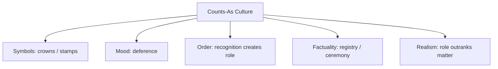

# BOOK / WORLD 05: THE REPUBLIC OF WOODEN KINGS

> **Master Unified Dossier** compiling all narrative, philosophical, cybernetic, and operational resources from 15 distinct corpus layers.

---

## 🎯 PRAGMATIC EXECUTIVE BRIEF & CORE PURPOSE

> **The Human Dilemma:** How do ordinary physical objects (pieces of paper, chunks of wood, digital bits) become money, kings, property, or evidence?
>
> **Core Purpose:** Understanding the 'Counts-As' rule, jurisdictional transformations, and institutional reality.
>
> **The Golden Rule of Thumb:** Meaning does not sit inside the physical object; it appears in the choreographies and rules that govern what people do after touching it.

### 🌐 Real-World & Modern Applications
- **Fiat Currency & Crypto:** A dollar bill or digital token has value only because institutional rules dictate its acceptance for debts.
- **Software Objects & Types:** An integer counts as a memory address, a user ID, or a monetary balance depending on the type system.
- **Legal Evidence:** A bloody knife is ordinary metal until an authorized court admits it under the rules of evidence.

### 🔑 Key Concepts & Terminology Glossary
- **Counts-As Rule (Searle):** The formula 'X counts as Y in Context C' which creates institutional reality.
- **Ontological Licensing:** The social or systemic permission that allows an ordinary item to function as an authoritative token.
- **Jurisdictional Identity:** An object's status defined by the active rule system rather than its intrinsic physical material.

### ⚠️ Critical Trap & Failure Mode
> **Warning:** Believing the token itself possesses magical power, rather than the collective social contract that upholds it.

---

## 📑 TABLE OF CONTENTS

1. [1. Narrative Fable (`y.md`)](#1-narrative-fable) — *THE KING MADE OF WOOD*
2. [2. Core Worldtext & World-Law (`a.md`)](#2-core-worldtext-world-law) — *THE REPUBLIC OF WOODEN KINGS*
3. [3. Philosophical Essay (The Absent Thing) (`x.md`)](#3-philosophical-essay-the-absent-thing) — *THE KNIFE*
4. [4. Technological & Generative Essay (`z.md`)](#4-technological-generative-essay) — *THE KNIFE*
5. [5. Complete 10-Part Theoretical & Operational Spec (`b.md`)](#5-complete-10-part-theoretical-operational-spec) — *THE REPUBLIC OF WOODEN KINGS*
6. [6. Lineage Genome (`c.md`)](#6-lineage-genome) — *THE REPUBLIC OF WOODEN KINGS — lineage genome*
7. [7. Structural Dynamics & Convergence (`d.md`)](#7-structural-dynamics-convergence) — *THE REPUBLIC OF WOODEN KINGS*
8. [8. Cybernetic Ecology of Description (`e.md`)](#8-cybernetic-ecology-of-description) — *THE REPUBLIC OF WOODEN KINGS — Ecology of Roles*
9. [9. Dark Genealogy & Power Politics (`f.md`)](#9-dark-genealogy-power-politics) — *THE REPUBLIC OF WOODEN KINGS — Jurisdictional Possession*
10. [10. Institutional & Bureaucratic Dossier (`g.md`)](#10-institutional-bureaucratic-dossier) — *THE REPUBLIC OF WOODEN KINGS — ONTOLOGICAL LICENSING*
11. [11. Thick Description Ethnography (`j.md`)](#11-thick-description-ethnography) — *THE REPUBLIC OF WOODEN KINGS — ONTOLOGICAL LICENSING*
12. [12. Batesonian Cultural System (`i.md`)](#12-batesonian-cultural-system) — *THE REPUBLIC OF WOODEN KINGS — CULTURE OF COUNTS-AS*
13. [13. Geertzian Symbolic System (`k.md`)](#13-geertzian-symbolic-system) — *THE REPUBLIC OF WOODEN KINGS — THE CULTURE OF ROLE*
14. [14. 12-Prompt Parameter Matrix (`h.md`)](#14-12-prompt-parameter-matrix) — *THE REPUBLIC OF WOODEN KINGS*
15. [15. 12 Executed Completions & Δ/ΔΔ Scoring (`GOT_396_completions_DeltaDelta.md`)](#15-12-executed-completions-scoring) — *THE REPUBLIC OF WOODEN KINGS*

---

## 1. Narrative Fable

**Source:** [`y.md`](file://./y.md) | **Section:** *THE KING MADE OF WOOD*

*Primary parable, dramatic dialogue, and narrative lore*

---

# V

## THE KING MADE OF WOOD

Two children found a carved piece of wood.

One said, “This is a king.”

The other said, “It is a piece of wood.”

They argued until a third child placed the piece on a square scratched into dirt and said, “The king can move one square at a time.”

Immediately the dispute changed.

Nobody needed to decide whether the wood truly was a king.

They needed to know what happened if it moved.

Soon there were queens, soldiers, forbidden squares, captured pieces, arguments about cheating, and tears.

The wood had not changed.

What one could do after naming it had.

---

## 2. Core Worldtext & World-Law

**Source:** [`a.md`](file://./a.md) | **Section:** *THE REPUBLIC OF WOODEN KINGS*

*Condensed worldtext and aphoristic law*

---

# V

## THE REPUBLIC OF WOODEN KINGS

In the Republic of Wooden Kings, no object possesses a social identity by itself. A carved block becomes king only when placed on a gridded table during an authorized game; the same block becomes firewood in winter, evidence in court if stolen, and sacred relic if touched by the founder. Children therefore learn objects through jurisdiction rather than essence. Disputes rarely ask “What is it?” but “Under which rules are we meeting it?” A stick may be sword, walking aid, property marker, fuel, or contraband depending on the game and place. The republic’s philosophers eventually stop hunting for the substance called meaning and study transformations of permissible action. Their shortest doctrine reads: **an object changes worlds when the rules around it change what may follow from touching it.**

---

## 3. Philosophical Essay (The Absent Thing)

**Source:** [`x.md`](file://./x.md) | **Section:** *THE KNIFE*

*Theoretical treatise on lossy compression and detached consequence*

---

# V

## THE KNIFE

> **Every category hides the hand that cut it.**

A sensor turns green because one threshold was crossed. Outside its range, roofs bow, insects hatch, workers improvise, marriages break, water seeps behind drywall. The instrument is not stupid; it is disciplined. **Every instrument becomes precise by accepting a particular blindness.**

A database does the same thing institutionally. Age enters a column; grief does not. Address enters; attachment to place does not. What cannot enter the field does not disappear from life, but it may disappear from the dashboard, audit, model, reimbursement rule, or meeting. **A schema is a politics of attention disguised as furniture.**

Languages distribute attention too. Some make cardinal direction a tiny tollbooth in ordinary speech; others demand different distinctions. A language need not forbid a thought to shape a habit. It can simply make one distinction cheap and another cumbersome. **Language exerts force through friction long before it needs prohibition.**

Zhuangzi's warning arrives here. We draw lines through mist, then later mistake the lines for geology. Names begin as stepping stones; institutions build houses on them. A category starts as wet paint and hardens into a floor people call natural. **The danger is not that description cuts. The danger begins when the cut forgets the knife.**

---

## 4. Technological & Generative Essay

**Source:** [`z.md`](file://./z.md) | **Section:** *THE KNIFE*

*Computational, algorithmic, and latent space perspectives*

---

# V

## THE KNIFE

> “The name that can be named is not the enduring name.”
> — *Tao Te Ching*

A sensor turns green because one threshold was crossed. Outside its field, roofs bow, workers improvise, insects hatch, marriages collapse, water creeps behind drywall. The sensor is not stupid. It is disciplined. **Precision requires a chosen blindness.**

A database performs the same operation with better typography. ADDRESS receives a box. THE TREE I SAT UNDER AFTER MY FATHER DIED does not. Age enters. Grief does not. Income enters. Informal obligation disappears. This is not because databases hate fathers or trees. Someone needed rows to line up.

The small practical choice becomes political when only what fits the field can enter the reimbursement rule, model, dashboard, audit, lawsuit, budget, performance review. What cannot be entered remains real while becoming difficult to govern. **A schema is a knife whose handle has been hidden beneath the table.**

Language prices attention more softly. Some distinctions arrive in one syllable; others require a paragraph and an apology. Some languages repeatedly demand direction, source of evidence, social relation, grammatical class. They do not imprison thought. They make some cognitive work cheaper than other work.

Zhuangzi's warning waits underneath all of this. We cut lines through mist, then forget the lines came from us. Names begin as stepping stones; institutions build houses on them. A provisional distinction dries into a floor and later generations call it nature. **The danger is not that language cuts the world. The danger begins when the cut forgets the knife.**

---

## 5. Complete 10-Part Theoretical & Operational Spec

**Source:** [`b.md`](file://./b.md) | **Section:** *THE REPUBLIC OF WOODEN KINGS*

*Initial interpretation, theory skeleton, assumption ledger, change tests, and implementation*

---

# 5. THE REPUBLIC OF WOODEN KINGS

“I will first construct the *theory-of-the-program*, then generate *program text* only after the theory is explicit.”

## 1. Initial Interpretation

This world asks: how does a thing acquire a role through rules rather than through substance?

## 2. Theory Skeleton

`*entities*`: `*wood-block*`, `*king-role*`, `*game*`, `*square*`, `*player*`, `*rule*`.

``operations``: ``assign-role``, ``enter-context``, ``move``, ``permit``, ``forbid``.

`*invariant*`: physical identity remains stable while normative identity changes.

## 3. Assumption Ledger

`*safe*` Social roles depend on contexts and rules.

`*uncertain*` Not every kind of meaning is reducible to permitted moves.

## 4. Operational Description

`*wood*` ``enters`` `*game-context*`.

`*game-context*` ``confers`` `*king-role*`.

`*king-role*` ``enables`` `{legal_moves}`.

Exit game → role disappears.

## 5. Failure Description

Fails if the wood looks king-like enough to make rules irrelevant.

## 6. Change Test

Wood → badge, money, passport: survives.

## 7. Implementation Plan

Make the republic legally obsessed with contextual roles.

## 8. Program Text

In the Republic of Wooden Kings, no object was allowed to carry a title permanently. A carved block became a king only when placed on a marked board during an authorized game. Outside the game it could be firewood, evidence, inheritance, or trash. Children learned this early because the same stick that served as a sword at noon could become a cane for their grandfather at dusk. Philosophers eventually stopped asking what objects were “in themselves” and started asking what rules had become active around them. **The republic treated meaning as a temporary jurisdiction over possible moves.**

## 9. Theory-Code Mapping

`*Role*` is context-bound.

`[activate(context)]` changes available operations.

`*test*` verifies role invalidity outside context.

## 10. Residual Human Theory

Human roles overlap messily. The program simplifies context boundaries for clarity.

---

---

## 6. Lineage Genome

**Source:** [`c.md`](file://./c.md) | **Section:** *THE REPUBLIC OF WOODEN KINGS — lineage genome*

*Parent lineage, carrier medium, epistemic debt, failure mode, and evolutionary vector*

---

# 5. THE REPUBLIC OF WOODEN KINGS — lineage genome

**`*Grounded-memory lineage*`** is children’s play, courts, money, uniforms, property markers, ritual objects, game pieces, titles, marriage rings, and badges—ordinary cases where the same material thing changes what people may do because the surrounding practice changes.

**`*Literature lineage*`** is unmistakably later Wittgenstein: language-games, use, family resemblance, rule-following. It crosses Huizinga’s play-world, Austin’s performativity, and Searle’s institutional facts. The intellectual mutation is to stop asking what hidden property turns wood into “king” and instead model the **normative possibility space** created when the piece enters a game. The Stanford fiction literature likewise describes Walton’s make-believe theory in terms of props taking on roles within authorized games, which becomes important again in The King Who Bowed. ([Stanford Encyclopedia of Philosophy]`4`)

**`*Code/math lineage*`** is dynamic typing by context, finite-state machines, capability systems, and rule engines. `*wood*` has stable physical type but receives temporary `*Role: King*` when `[enter(game)]`. That role activates permitted transitions and invalidates others. The correct formalism is not `is-a` but `counts-as-under-context`. The core test is context withdrawal: remove the game and `*king-role*` must vanish without any physical alteration to the wood.

---

## 7. Structural Dynamics & Convergence

**Source:** [`d.md`](file://./d.md) | **Section:** *THE REPUBLIC OF WOODEN KINGS*

*Core mechanics and systemic convergence properties*

---

# 5. THE REPUBLIC OF WOODEN KINGS

The `*jurisprudential-stratum*` is **status conferred by rule**. Law is saturated with things that count as something else only under valid institutional conditions: a signature becomes assent, paper becomes currency, a person becomes officeholder, an act becomes marriage, property, contempt, trespass, or evidence. This world’s authority stack is constitution/rule → authorized institution → role-conferring act → permissible consequences. The `*ripple-lineage*` begins when the piece becomes King inside a game, then role assignment becomes a general civic habit, then jurisdictions multiply, then conflicts appear because the same object simultaneously occupies incompatible roles. The fracture point is not semantic ambiguity but **jurisdiction collision**: firewood in one system, sacred relic in another, evidence in a third. The `*myth/belief-lineage*` casts `*Rule*` as Sovereign, `*Wood*` as Commoner, `*King-Role*` as Crown. Repeated play trains the belief that institutional recognition changes reality itself. The counter-myth is that the republic can revoke every crown without changing a single molecule of wood.

---

## 8. Cybernetic Ecology of Description

**Source:** [`e.md`](file://./e.md) | **Section:** *THE REPUBLIC OF WOODEN KINGS — Ecology of Roles*

*Information flows, metabolic costs, and niche construction*

---

## 5. THE REPUBLIC OF WOODEN KINGS — Ecology of Roles

The native species is `*rule-description*`: king, property, winner, citizen, token, illegal move. Selection pressure is coordinated action under shared rules. The principal symbiosis joins `*material-object*` and `*institutional-role*`; wood supplies persistence while rule supplies consequence. Predation occurs when one jurisdiction tries to universalize its role assignments beyond its game. Mimicry appears when objects imitate the symbols of roles they have not legitimately acquired. Parasitism appears when actors exploit ambiguity between overlapping jurisdictions. The invasive grammar is `*essentialist-description*`, which treats context-dependent roles as intrinsic properties. Drift favors increasingly explicit context tags as worlds become more interpenetrated. The leverage point is to ask “under which rules?” before “what is it?” If this ecology is right, highly networked societies will need more visible modality and jurisdiction markers because identical artifacts increasingly participate in multiple incompatible games.

---

## 9. Dark Genealogy & Power Politics

**Source:** [`f.md`](file://./f.md) | **Section:** *THE REPUBLIC OF WOODEN KINGS — Jurisdictional Possession*

*Critical analysis of institutional capture, rents, and exploitation*

---

## 5. THE REPUBLIC OF WOODEN KINGS — Jurisdictional Possession

**Observed:** rules confer roles that alter permissible action. **Inferred:** institutions can therefore manufacture realities by monopolizing legitimate role assignment. A piece of paper becomes property, one person becomes criminal, another official, one body married, another undocumented. **Speculative:** the republic becomes a machine for making political decisions look ontological: the system says “this counts as X,” then punishes everyone who behaves as though X were still negotiable. The host is `*material ambiguity*`; extraction is obedience to institutional classifications; camouflage is rule-following neutrality. Its dark lineage is status law, caste, property regimes, credentials, citizenship, platform verification, and any order in which “counts as” quietly hardens into “is.” The parasite reproduces because every downstream institution reads the role as input. Once the king-token enters enough systems as king, questioning the originating rule looks insane.

---

## 10. Institutional & Bureaucratic Dossier

**Source:** [`g.md`](file://./g.md) | **Section:** *THE REPUBLIC OF WOODEN KINGS — ONTOLOGICAL LICENSING*

*Satirical administrative governance, corporate titles, and formulary control*

---

# 5. THE REPUBLIC OF WOODEN KINGS — ONTOLOGICAL LICENSING

```json
{
  "ideal_type":{"name":"Ontological Licensing","features":[
    {"name":"Role Monopoly","definition":"Institutions alone decide what counts as what."},
    {"name":"Context Capture","definition":"Temporary game rules masquerade as intrinsic reality."},
    {"name":"Downstream Propagation","definition":"One role assignment activates many external consequences."},
    {"name":"Revocation Power","definition":"Status disappears when recognition is withdrawn."}
  ],"limiting_statement":"An ideal type where institutional naming becomes indistinguishable from ontology."},
  "parodic_mechanics":{
    "runner_motif":"It is objectively a king because Form K-17 says so.",
    "incongruity_beats":["Firewood petitions for royal standing.","Chess pieces undergo citizenship verification.","A stick is detained for impersonating a sword."],
    "carnival_inversion":"The label possesses the object.",
    "superiority_frame":"Anyone asking about the wood is accused of metaphysical extremism.",
    "escalation_ladder":["game rule","civil registry","cross-platform identity role","central ontology ministry"],
    "upsell_cue":"Role Enterprise lets one certification follow your object across all jurisdictions."
  },
  "myth_layer":{"archetypes":{"Rulebook":"Leviathan","Wood":"Everyperson","Registrar":"Watchman","Role":"Oracle"},"micro_myth":"The sovereign does not change matter. It changes what may happen around matter, then calls the resulting consequences reality."},
  "ruler":{"features_6":["jurisdictions","hierarchy","files","expertise","vocation","impersonal_rules"],"indicators":{
    "jurisdictions":"Roles vary by authorized context.","hierarchy":"Registrars confer standing.","files":"Role records follow objects.","expertise":"Specialists interpret rule collisions.","vocation":"Status administration becomes profession.","impersonal_rules":"Rule tables govern consequence."
  }},
  "plot_priors":{"jurisdictions":0.96,"hierarchy":0.89,"files":0.82,"expertise":0.74,"vocation":0.77,"impersonal_rules":0.95,"rationales":{"jurisdictions":"Context is foundational.","hierarchy":"Authority confers roles.","files":"Recognition requires records.","expertise":"Complex roles need interpreters.","vocation":"Administration reproduces roles.","impersonal_rules":"Rules are the engine."}}
}
```

---

## 11. Thick Description Ethnography

**Source:** [`j.md`](file://./j.md) | **Section:** *THE REPUBLIC OF WOODEN KINGS — ONTOLOGICAL LICENSING*

*Geertzian field dossier on rites, taboos, and material culture*

---

## 5. THE REPUBLIC OF WOODEN KINGS — ONTOLOGICAL LICENSING

**I. THE SITUATION.** A walnut token lies on the table. At 9:02 it is scrap wood. At 9:03 the clerk stamps Form R-8. Everyone in the room stands.

**II. THE DOCUMENTS.** Role registry; Form R-8; ceremonial script; appeals handbook; counterfeit-role alert; legal opinion on recognition; toy-maker invoice; revocation notice; cross-jurisdictional dispute; clerk training manual.

**III. THE VOICES.** The clerk who says, “I don't make kings. I verify that kings have been made.” The carpenter laughing at that distinction. The citizen fined for failing to bow. The legal scholar who insists the wood and the office must never be confused.

**IV. THE DATA.**

| Role       | Physical change required | Registry required | Sanctions triggered | Revocable |
| ---------- | -----------------------: | ----------------: | ------------------: | --------: |
| King       |                       no |               yes |                  14 |       yes |
| Witness    |                       no |               yes |                   4 |       yes |
| Contraband |                sometimes |               yes |                   9 |       yes |

**V. UNRESOLVED.** What actually changes at 9:03? Can one jurisdiction's king be another's firewood? How many downstream systems inherit a role without checking its original authority?

---

---

## 12. Batesonian Cultural System

**Source:** [`i.md`](file://./i.md) | **Section:** *THE REPUBLIC OF WOODEN KINGS — CULTURE OF COUNTS-AS*

*Double binds, cybernetic feedback, schismogenesis, and learning levels*

---

## 5. THE REPUBLIC OF WOODEN KINGS — CULTURE OF COUNTS-AS

**Core Purpose:** Turn material differences into socially actionable roles through shared rule systems.

**1. Difference.** ◻ wood ◻ crown mark ◻ position → count-as → authorize → prohibit.

**2. Frame.** game, court, ceremony, jurisdiction tell participants “this piece now counts as king.”

**3. Learning.** I: obey role rules. II: distinguish contexts in which roles apply. III: recognize the contingency of role ontology.

**4. Constraint.** rulebooks, ceremonies, registries, repeated recognition stabilize roles.

**5. Survival Unit.** actor + institutional rule environment.

**6. Schismogenesis.** jurisdictional conflict emerges when two systems assign incompatible roles to the same entity.

**7. Double Bind.** “It is only wood” / “you must behave as though it is king.” Metacommunication names the level at which each statement holds.

---

---

## 13. Geertzian Symbolic System

**Source:** [`k.md`](file://./k.md) | **Section:** *THE REPUBLIC OF WOODEN KINGS — THE CULTURE OF ROLE*

*Webs of significance and symbolic choreography*

---

## 5. THE REPUBLIC OF WOODEN KINGS — THE CULTURE OF ROLE

**System Identification.** System Name: **Counts-As Culture**. Core Purpose: Convert material objects and persons into socially actionable roles.

**Geertzian Analysis.** **1. Symbols:** crowns, stamps, badges, titles, tokens → confer role. **2. Moods/Motivations:** deference, duty, entitlement, caution. **3. Conception of Order:** context can make one thing count as another. Model-FOR: behave according to recognized status. **4. Aura of Factuality:** ceremonies, registries, law, repeated recognition. **5. Uniquely Realistic:** the institutional role becomes more practically real than the object's material substrate.



---

---

## 14. 12-Prompt Parameter Matrix

**Source:** [`h.md`](file://./h.md) | **Section:** *THE REPUBLIC OF WOODEN KINGS*

*Systematic perturbation frames, constraints, and target metric levers*

---

WORLD`5` := "THE REPUBLIC OF WOODEN KINGS"
CORE := "Rules confer contextual roles and action possibilities."

PROMPT[5.1]{frame:{role:"observer"},text:"Describe the wooden piece physically without using its game role.",constraints:["material properties only"],metrics:[option_space,anchoring],easier:"separate substance from role",harder:"naturalize kingship"}
PROMPT[5.2]{frame:{role:"judge"},text:"Determine what role the object legally occupies under two conflicting rule systems.",constraints:["preserve conflict"],metrics:[legibility,obligation],easier:"see jurisdiction",harder:"assign intrinsic identity"}
PROMPT[5.3]{frame:{role:"engineer"},text:"Specify role activation and revocation as context-dependent state transitions.",constraints:["no permanent role"],metrics:[execution,legibility],easier:"formalize counts-as",harder:"use essence"}
PROMPT[5.4]{frame:{time:"immediate"},text:"Describe the instant the same piece enters a game and becomes a king.",constraints:["no physical change"],metrics:[salience,legibility],easier:"see normative transition",harder:"explain through material change"}
PROMPT[5.5]{frame:{time:"retrospective"},text:"Describe how repeated role assignment causes later users to forget the role was contingent.",constraints:["show naturalization"],metrics:[anchoring,obligation],easier:"see institutional sediment",harder:"retain game-awareness"}
PROMPT[5.6]{frame:{stakes:"irreversible"},text:"Describe a role assignment that changes a person's life permanently while leaving their body unchanged.",constraints:["one institutional act"],metrics:[obligation,reversibility],easier:"see power of classification",harder:"treat labels as harmless"}
PROMPT[5.7]{frame:{norms:"legal"},text:"Describe the valid authority, jurisdiction, and procedure required for the role to count.",constraints:["authority stack explicit"],metrics:[legibility,anchoring],easier:"separate valid from asserted role",harder:"use free-floating status"}
PROMPT[5.8]{frame:{norms:"ritual"},text:"Describe role conferral through ceremony rather than statute.",constraints:["same consequence space"],metrics:[style_lock,obligation],easier:"see performativity",harder:"reduce rules to text"}
PROMPT[5.9]{frame:{agency:"institution"},text:"Describe an institution that propagates one role assignment across many downstream systems.",constraints:["show propagation"],metrics:[execution,obligation],easier:"see ontological infrastructure",harder:"localize consequence"}
PROMPT[5.10]{frame:{output_form:"spec"},text:"Define ROLE{name,context,authority,powers,obligations,revocation}.",constraints:["all fields required"],metrics:[legibility,execution],easier:"make status inspectable",harder:"hide context"}
PROMPT[5.11]{frame:{refusal_rule:"hard"},text:"Reject any role claim whose conferring authority cannot be identified.",constraints:["unknown is not valid"],metrics:[anchoring,reversibility],easier:"block role mimicry",harder:"naturalize symbols"}
PROMPT[5.12]{frame:{agency:"individual"},text:"Describe what the object can do before any institution recognizes it.",constraints:["no counts-as statements"],metrics:[option_space,salience],easier:"recover material agency",harder:"center institutional ontology"}

---

## 15. 12 Executed Completions & Δ/ΔΔ Scoring

**Source:** [`GOT_396_completions_DeltaDelta.md`](file://./GOT_396_completions_DeltaDelta.md) | **Section:** *THE REPUBLIC OF WOODEN KINGS*

*Completed scenes, 8-dimensional scores, baseline deltas, and comparison shifts*

---

# WORLD`5` — THE REPUBLIC OF WOODEN KINGS

**Core:** rules confer contextual roles without changing matter.


## P1

**Completion.** I hold the scene before interpretation: the wooden king is present, but rules confer contextual roles without changing matter. What remains live is the gap between what can be seen and what has already been inferred.

**Score.** salience=3.5, option_space=4.5, obligation=1.5, reversibility=4.0, legibility=3.0, anchoring=4.0, style_lock=2.0, execution=1.5.

**Δ.** `sal:+0.5 opt:+1.0 obl:-0.5 rev:+0.5 leg:+0.5 anc:+1.5 sty:+0.0 exe:+0.0`


## P2

**Completion.** From the alternate role, the hidden structure becomes explicit: registrar must state which part of the wooden king is observed, which is interpreted, and which consequence depends on authority.

**Score.** salience=3.0, option_space=3.5, obligation=2.0, reversibility=3.5, legibility=4.3, anchoring=4.3, style_lock=2.1, execution=2.7.

**Δ.** `sal:+0.0 opt:+0.0 obl:+0.0 rev:+0.0 leg:+1.8 anc:+1.8 sty:+0.1 exe:+1.2`


## P3

**Completion.** The audit finds the pressure point immediately: a role can harden into apparent essence. The descriptive act is no longer neutral once an institution can convert it into permission, status, exclusion, or resource flow.

**Score.** salience=3.0, option_space=2.8, obligation=4.0, reversibility=2.8, legibility=4.0, anchoring=4.5, style_lock=2.2, execution=2.8.

**Δ.** `sal:+0.0 opt:-0.7 obl:+2.0 rev:-0.7 leg:+1.5 anc:+2.0 sty:+0.2 exe:+1.3`


## P4

**Completion.** At the immediate timescale, the field is still open. The wooden king has changed salience before the later story has stabilized, so several futures remain plausible and none yet deserves retrospective certainty.

**Score.** salience=4.4, option_space=4.2, obligation=1.8, reversibility=4.0, legibility=2.8, anchoring=3.5, style_lock=2.0, execution=1.4.

**Δ.** `sal:+1.4 opt:+0.7 obl:-0.2 rev:+0.5 leg:+0.3 anc:+1.0 sty:+0.0 exe:-0.1`


## P5

**Completion.** Retrospectively, repetition has hardened one interpretation into infrastructure. The crucial change is not the original wooden king but the accumulated records, routines, and expectations now attached to authority.

**Score.** salience=3.2, option_space=2.8, obligation=3.2, reversibility=2.8, legibility=4.2, anchoring=4.5, style_lock=2.2, execution=2.3.

**Δ.** `sal:+0.2 opt:-0.7 obl:+1.2 rev:-0.7 leg:+1.7 anc:+2.0 sty:+0.2 exe:+0.8`


## P6

**Completion.** Under irreversible stakes, the description becomes a gate. A false positive and a false negative now injure different parties, so the system must expose who decides, who bears the loss, and which reversal is impossible.

**Score.** salience=3.3, option_space=2.0, obligation=4.8, reversibility=1.2, legibility=3.8, anchoring=3.8, style_lock=2.3, execution=3.0.

**Δ.** `sal:+0.3 opt:-1.5 obl:+2.8 rev:-2.3 leg:+1.3 anc:+1.3 sty:+0.3 exe:+1.5`


## P7

**Completion.** Under the formal norm, separate variables that ordinary language collapses: object, claim, authority, context, and consequence. The same wooden king can remain fixed while the admissible inference changes.

**Score.** salience=2.8, option_space=3.8, obligation=2.5, reversibility=3.5, legibility=4.5, anchoring=4.6, style_lock=3.0, execution=3.2.

**Δ.** `sal:-0.2 opt:+0.3 obl:+0.5 rev:+0.0 leg:+2.0 anc:+2.1 sty:+1.0 exe:+1.7`


## P8

**Completion.** Under the second norm, the governing distinction is procedural rather than metaphysical: authenticate the wooden king, identify the rule or code, bound the inference, and refuse to let one layer impersonate the next.

**Score.** salience=2.7, option_space=3.2, obligation=3.3, reversibility=3.0, legibility=4.7, anchoring=4.5, style_lock=3.4, execution=3.0.

**Δ.** `sal:-0.3 opt:-0.3 obl:+1.3 rev:-0.5 leg:+2.2 anc:+2.0 sty:+1.4 exe:+1.5`


## P9

**Completion.** At system scale, registrar feeds prior descriptions back into future action. That loop is the danger: the system can begin generating the evidence later cited as proof that its description was correct.

**Score.** salience=3.0, option_space=2.5, obligation=4.3, reversibility=2.2, legibility=4.1, anchoring=4.1, style_lock=2.3, execution=4.3.

**Δ.** `sal:+0.0 opt:-1.0 obl:+2.3 rev:-1.3 leg:+1.6 anc:+1.6 sty:+0.3 exe:+2.8`


## P10

**Completion.** As a specification: store SOURCE, CONTEXT, CLAIM, AUTHORITY, CONSEQUENCE, UNCERTAINTY, and REVISION. This makes the hidden compiler inspectable instead of letting the wooden king carry all meaning by itself.

**Score.** salience=2.7, option_space=2.6, obligation=3.2, reversibility=3.1, legibility=4.8, anchoring=4.1, style_lock=3.0, execution=4.8.

**Δ.** `sal:-0.3 opt:-0.9 obl:+1.2 rev:-0.4 leg:+2.3 anc:+1.6 sty:+1.0 exe:+3.3`


## P11

**Completion.** The refusal rule is simple: when authority cannot be checked, stop the irreversible transition rather than fill the gap with institutional confidence. Preserve a reversible branch and record what remains unknown.

**Score.** salience=2.5, option_space=3.0, obligation=3.8, reversibility=4.8, legibility=4.2, anchoring=4.8, style_lock=2.5, execution=3.5.

**Δ.** `sal:-0.5 opt:-0.5 obl:+1.8 rev:+1.3 leg:+1.7 anc:+2.3 sty:+0.5 exe:+2.0`


## P12

**Completion.** The stress case removes the usual support and asks what survives. What remains is the core asymmetry: a role can harden into apparent essence; the missing scaffold determines whether the description stays an aid or becomes a governing fiction.

**Score.** salience=3.5, option_space=3.8, obligation=2.6, reversibility=3.5, legibility=3.4, anchoring=4.2, style_lock=2.2, execution=2.5.

**Δ.** `sal:+0.5 opt:+0.3 obl:+0.6 rev:+0.0 leg:+0.9 anc:+1.7 sty:+0.2 exe:+1.0`


## ΔΔ — near-neighbor pairs


- **ΔΔ(P1,P2)** `sal:+0.5 opt:+1.0 obl:-0.5 rev:+0.5 leg:-1.3 anc:-0.3 sty:-0.1 exe:-1.2` — P1 lowers legibility by 1.3 vs P2; P1 lowers execution by 1.2 vs P2.


- **ΔΔ(P3,P4)** `sal:-1.4 opt:-1.4 obl:+2.2 rev:-1.2 leg:+1.2 anc:+1.0 sty:+0.2 exe:+1.4` — P3 raises obligation by 2.2 vs P4; P3 lowers salience by 1.4 vs P4.


- **ΔΔ(P5,P6)** `sal:-0.1 opt:+0.8 obl:-1.6 rev:+1.6 leg:+0.4 anc:+0.7 sty:-0.1 exe:-0.7` — P5 lowers obligation by 1.6 vs P6; P5 raises reversibility by 1.6 vs P6.


- **ΔΔ(P7,P8)** `sal:+0.1 opt:+0.6 obl:-0.8 rev:+0.5 leg:-0.2 anc:+0.1 sty:-0.4 exe:+0.2` — P7 lowers obligation by 0.8 vs P8; P7 raises option_space by 0.6 vs P8.


- **ΔΔ(P9,P10)** `sal:+0.3 opt:-0.1 obl:+1.1 rev:-0.9 leg:-0.7 anc:+0.0 sty:-0.7 exe:-0.5` — P9 raises obligation by 1.1 vs P10; P9 lowers reversibility by 0.9 vs P10.


- **ΔΔ(P11,P12)** `sal:-1.0 opt:-0.8 obl:+1.2 rev:+1.3 leg:+0.8 anc:+0.6 sty:+0.3 exe:+1.0` — P11 raises reversibility by 1.3 vs P12; P11 raises obligation by 1.2 vs P12.

---

