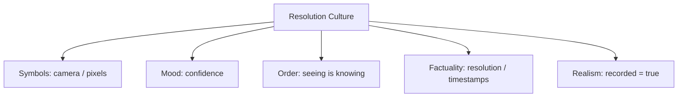

# BOOK / WORLD 06: THE PALACE OF THE PERFECT CAMERA

> **Master Unified Dossier** compiling all narrative, philosophical, cybernetic, and operational resources from 15 distinct corpus layers.

---

## 🎯 PRAGMATIC EXECUTIVE BRIEF & CORE PURPOSE

> **The Human Dilemma:** Why does collecting more data and higher-resolution video fail to explain why people do what they do?
>
> **Core Purpose:** Exposing the limits of high-resolution surveillance and thin observational capture versus social context.
>
> **The Golden Rule of Thumb:** A terabyte can record the exact twitch of an eyelid and still miss whether it was a spasm, a wink, a secret signal, or a mocking insult.

### 🌐 Real-World & Modern Applications
- **Big Data Analytics:** Storing millions of user clickstreams without understanding user intent, frustration, or life context.
- **Surveillance & Telemetry:** Monitoring keystrokes and webcam presence while completely failing to measure actual developer productivity.
- **Autonomous Vehicles:** Cameras capturing pixel-level scene geometries while struggling with subtle pedestrian social cues.

### 🔑 Key Concepts & Terminology Glossary
- **Thin Capture:** High-fidelity physical recording that omits social, historical, and interpersonal context.
- **Resolutionism:** The false belief that increasing data density or pixel count automatically yields semantic understanding.
- **Hermeneutic Gap:** The distance between what can be physically measured and what the action means.

### ⚠️ Critical Trap & Failure Mode
> **Warning:** Investing in more surveillance sensors when the real failure is an inability to interpret context and conventions.

---

## 📑 TABLE OF CONTENTS

1. [1. Narrative Fable (`y.md`)](#1-narrative-fable) — *THE CAMERA AND THE WINK*
2. [2. Core Worldtext & World-Law (`a.md`)](#2-core-worldtext-world-law) — *THE PALACE OF THE PERFECT CAMERA*
3. [3. Philosophical Essay (The Absent Thing) (`x.md`)](#3-philosophical-essay-the-absent-thing) — *THE ARCHIPELAGO*
4. [4. Technological & Generative Essay (`z.md`)](#4-technological-generative-essay) — *THE ARCHIPELAGO*
5. [5. Complete 10-Part Theoretical & Operational Spec (`b.md`)](#5-complete-10-part-theoretical-operational-spec) — *THE PALACE OF THE PERFECT CAMERA*
6. [6. Lineage Genome (`c.md`)](#6-lineage-genome) — *THE PALACE OF THE PERFECT CAMERA — lineage genome*
7. [7. Structural Dynamics & Convergence (`d.md`)](#7-structural-dynamics-convergence) — *THE PALACE OF THE PERFECT CAMERA*
8. [8. Cybernetic Ecology of Description (`e.md`)](#8-cybernetic-ecology-of-description) — *THE PALACE OF THE PERFECT CAMERA — Ecology of Thin Capture*
9. [9. Dark Genealogy & Power Politics (`f.md`)](#9-dark-genealogy-power-politics) — *THE PALACE OF THE PERFECT CAMERA — Surveillance Innocence*
10. [10. Institutional & Bureaucratic Dossier (`g.md`)](#10-institutional-bureaucratic-dossier) — *THE PALACE OF THE PERFECT CAMERA — RESOLUTIONISM*
11. [11. Thick Description Ethnography (`j.md`)](#11-thick-description-ethnography) — *THE PALACE OF THE PERFECT CAMERA — RESOLUTIONISM*
12. [12. Batesonian Cultural System (`i.md`)](#12-batesonian-cultural-system) — *THE PALACE OF THE PERFECT CAMERA — CULTURE OF OBSERVABILITY*
13. [13. Geertzian Symbolic System (`k.md`)](#13-geertzian-symbolic-system) — *THE PALACE OF THE PERFECT CAMERA — THE CULTURE OF VISIBILITY*
14. [14. 12-Prompt Parameter Matrix (`h.md`)](#14-12-prompt-parameter-matrix) — *THE PALACE OF THE PERFECT CAMERA*
15. [15. 12 Executed Completions & Δ/ΔΔ Scoring (`GOT_396_completions_DeltaDelta.md`)](#15-12-executed-completions-scoring) — *THE PALACE OF THE PERFECT CAMERA*

---

## 1. Narrative Fable

**Source:** [`y.md`](file://./y.md) | **Section:** *THE CAMERA AND THE WINK*

*Primary parable, dramatic dialogue, and narrative lore*

---

# VI

## THE CAMERA AND THE WINK

A king hired a machine-maker to build a camera that missed nothing.

The machine-maker succeeded. His device recorded every eyelash, pore, tremor, twitch, and bead of sweat in the kingdom.

During a banquet, the king's minister winked at the ambassador.

The camera preserved the wink perfectly.

War began the next morning.

The king demanded to know why.

The machine-maker replayed the eyelid in exquisite detail.

Nobody had recorded that the wink meant, “He is lying. Delay the treaty.”

The king smashed the camera.

The machine-maker protested that it had missed nothing.

---

## 2. Core Worldtext & World-Law

**Source:** [`a.md`](file://./a.md) | **Section:** *THE PALACE OF THE PERFECT CAMERA*

*Condensed worldtext and aphoristic law*

---

# VI

## THE PALACE OF THE PERFECT CAMERA

The Palace of the Perfect Camera has no blind spots. Every corridor records at microscopic resolution; every eyelid movement, pulse at the temple, and movement of a finger is preserved in the Royal Archive. Because nothing visible can disappear, the court abolishes human witnesses as unreliable. Then a diplomat winks during a treaty dinner, the opposing delegation leaves, and war begins. The archive proves exactly when the eyelid moved but cannot recover the convention that made the motion an insult, warning, joke, or conspiracy. The king orders more cameras; the war grows. The palace slowly discovers a category of facts its machines cannot capture because those facts exist only across people, histories, and rules. Its ruin bears the inscription: **the visible event and the meaningful event are not always the same event.**

---

## 3. Philosophical Essay (The Absent Thing)

**Source:** [`x.md`](file://./x.md) | **Section:** *THE ARCHIPELAGO*

*Theoretical treatise on lossy compression and detached consequence*

---

# VI

## THE ARCHIPELAGO

> **A bridge does not abolish the sea.**

A word stands upright because neighboring words press against it. *Tree* holds shape beside bush, grass, timber, forest. A sentence stays short because a culture supplies premises it does not need to pronounce. **Every explicit description rests on an invisible architecture of alternatives and assumptions.**

Writing makes that architecture unstable. A mark survives the breath that made it, but survival requires leaving the scene where correction was possible. A sentence can return five minutes later with another intention stapled to it. **Durability and betrayal arrive together.**

Translation deepens the problem. One language has a term packed with centuries that another language distributes across phrase, gesture, silence, custom. The translator cannot carry the object intact because there is no identical container waiting on the other side. **Translation is reconstruction under unequal gravity.**

That failure can be productive. Borrowed words shed sounds, gain jokes, lose taboos. Mistranslations become rituals; imported forms become local genres. Where two descriptive systems fail to overlap, a narrow strip appears and something new takes root. **Culture often grows in the seam between descriptions that cannot quite become one another.**

---

## 4. Technological & Generative Essay

**Source:** [`z.md`](file://./z.md) | **Section:** *THE ARCHIPELAGO*

*Computational, algorithmic, and latent space perspectives*

---

# VI

## THE ARCHIPELAGO

> “No man is an island, entire of itself.”
> — John Donne

Translation is often described with the optimism of international shipping. Put meaning into Language A. Carry it across. Unload into Language B. Nothing spills. Everyone signs.

There is no container.

One language holds in one word what another disperses across gesture, history, ritual, taboo, tone, silence. The translator cannot move an identical object because no identical socket waits on the far shore. The translator builds something that can bear enough weight in another material. **Translation is less FedEx than emergency architecture.**

Some beams fail to meet. People hang laundry from them anyway. A borrowed word loses a sound, gains a joke, sheds a taboo, narrows, expands, becomes ordinary. A mistranslation stabilizes into ritual. An imported form acquires a local use nobody in its birthplace imagined.

This is not merely damage. Overlay two descriptive systems and their boundaries rarely coincide. Between them appear small conceptual strips neither possessed beforehand. Reeds root there. Birds arrive. A settlement follows. **Novelty often colonizes the seam between descriptions that fail to overlap.**

An archipelago therefore gives us a better picture than a continent. Communication does not require complete identity of internal worlds. It requires crossings reliable enough to support action. Bridges matter precisely because the water remains.

---

## 5. Complete 10-Part Theoretical & Operational Spec

**Source:** [`b.md`](file://./b.md) | **Section:** *THE PALACE OF THE PERFECT CAMERA*

*Initial interpretation, theory skeleton, assumption ledger, change tests, and implementation*

---

# 6. THE PALACE OF THE PERFECT CAMERA

“I will first construct the *theory-of-the-program*, then generate *program text* only after the theory is explicit.”

## 1. Initial Interpretation

The world pits `*captured-surface*` against `*social-relation*`.

## 2. Theory Skeleton

`*entities*`: `*camera*`, `*wink*`, `*minister*`, `*ambassador*`, `*convention*`, `*war*`.

``operations``: ``record``, ``interpret``, ``misread``, ``act-on-meaning``.

`*invariant*`: perfect recording of motion cannot recover a convention absent from the model.

## 3. Assumption Ledger

`*safe*` Social gestures derive force from conventions.

`*uncertain*` A sufficiently context-aware machine may infer them.

## 4. Operational Description

`*minister*` ``performs`` `*wink*`.

`*camera*` ``records`` `*movement*`.

`*ambassador*` ``interprets`` `*convention*`.

`*interpretation*` ``triggers`` `*political-action*`.

`*archive*` preserves only `*movement*`.

## 5. Failure Description

If the camera has access to all cultural context, the fable needs a new missing layer.

## 6. Change Test

Wink → sarcasm, handshake, dress code: survives.

## 7. Implementation Plan

Make the camera genuinely perfect within its domain so the failure cannot be blamed on poor engineering.

## 8. Program Text

The king ordered a camera that missed nothing. It could enlarge a pore to the size of a coin and preserve the smallest tremor in a hand. At a treaty dinner the minister winked at the ambassador. The next morning the ambassador’s army withdrew. The camera showed the eyelid perfectly. It could not show that among the ambassador’s people the gesture meant: he is lying; delay the treaty. The king demanded more resolution. The engineers gave him eyelashes. **The palace learned too late that accuracy inside the wrong ontology is merely exquisite ignorance.**

## 9. Theory-Code Mapping

`*SensorModel*` captures visible features.

`*ConventionModel*` is absent.

`*test*`: increase resolution; meaning must remain missing.

## 10. Residual Human Theory

No ontology is final. Add context and another context appears.

---

---

## 6. Lineage Genome

**Source:** [`c.md`](file://./c.md) | **Section:** *THE PALACE OF THE PERFECT CAMERA — lineage genome*

*Parent lineage, carrier medium, epistemic debt, failure mode, and evolutionary vector*

---

# 6. THE PALACE OF THE PERFECT CAMERA — lineage genome

**`*Grounded-memory lineage*`** is misunderstanding across cultures, ritual gestures, coded looks, courtroom testimony, family signals, military signals, flirtation, sarcasm, and jokes: events whose visible motor pattern underdetermines their social meaning.

**`*Literature lineage*`** begins with Gilbert Ryle’s twitch/wink distinction and becomes famous through Clifford Geertz’s thick description. The key claim is that a visible contraction of the eyelid does not contain enough information to distinguish twitch, wink, parody, or conspiracy; the code and situation matter. Your camera world literalizes the epistemic failure of “thin description.” ([RCNi Company Limited]`5`)

**`*Code/math lineage*`** is an observability problem. The camera observes state vector `x_visible` with arbitrarily high precision, while the relevant latent variable `z_social_code` is absent. Increasing sensor resolution drives measurement error toward zero without making the hidden state identifiable. That is the crucial distinction: **precision is not observability**. The program therefore ancestors hidden-state models and partially observable systems, but with a cultural twist: the missing state is not physical noise; it is shared convention. The test is to increase resolution to absurd levels while prediction of social consequence remains wrong.

---

## 7. Structural Dynamics & Convergence

**Source:** [`d.md`](file://./d.md) | **Section:** *THE PALACE OF THE PERFECT CAMERA*

*Core mechanics and systemic convergence properties*

---

# 6. THE PALACE OF THE PERFECT CAMERA

The `*jurisprudential-stratum*` is the difference between **record and legally sufficient meaning**. Evidence law requires authentication and context rather than assuming a recording proves every claim anyone attaches to it; expert-evidence doctrine similarly asks not merely whether information exists but whether its inferential method is reliable and relevant. ([Legal Information Institute]`3`) The `*ripple-lineage*` begins when cameras outperform witnesses on physical detail. Institutions then privilege recorded events, witnesses lose status, surveillance architectures proliferate, and behavior shifts toward whatever can be legibly defended on camera. Eventually citizens optimize conduct for thin evidence rather than social meaning. The fracture point is the **Trust Recession of Context**: people believe what was captured and distrust what requires interpretation, even though the decisive facts increasingly live outside the captured ontology. The `*myth/belief-lineage*` casts `*Camera*` as Omniscient Eye, `*Wink*` as Trickster Sign, `*King*` as Believer, `*War*` as collateral. The palace trains the ideology that visibility equals truth until one invisible convention destroys the kingdom.

---

## 8. Cybernetic Ecology of Description

**Source:** [`e.md`](file://./e.md) | **Section:** *THE PALACE OF THE PERFECT CAMERA — Ecology of Thin Capture*

*Information flows, metabolic costs, and niche construction*

---

## 6. THE PALACE OF THE PERFECT CAMERA — Ecology of Thin Capture

The native species is `*surface-description*`: pixel, gesture, movement, measurable physical state. It thrives under a climate rewarding auditability, reproducibility, and machine capture. Its predator is `*thick-context*`, not because context destroys it but because context reveals its insufficiency. Mimicry occurs when socially sophisticated systems produce outputs resembling contextual understanding from statistical surface cues. Parasitism occurs when institutions use recording as a shield against responsibility for interpretation: “the footage speaks for itself.” The invasive grammar is `*resolutionism*`, the belief that adding measurement density eventually recovers meaning. Drift favors multimodal contextual models but also deeper institutional faith in technically recorded evidence. The leverage point is to force every captured event to name `*missing-code-system*`. If this ecology is right, increasing sensor fidelity alone will produce diminishing gains in interpretation once the remaining error is relational rather than perceptual.

---

## 9. Dark Genealogy & Power Politics

**Source:** [`f.md`](file://./f.md) | **Section:** *THE PALACE OF THE PERFECT CAMERA — Surveillance Innocence*

*Critical analysis of institutional capture, rents, and exploitation*

---

## 6. THE PALACE OF THE PERFECT CAMERA — Surveillance Innocence

**Observed:** perfect surface capture can miss social meaning. **Inferred:** the camera’s incompleteness becomes politically useful because institutions can pretend the visible record exhausts responsibility. What is not legible to the system becomes deniable. **Speculative:** life is reorganized around machine-readable innocence, with citizens learning to perform technically exculpatory surfaces while substantive coercion migrates into context the cameras cannot adjudicate. The host is `*human ambiguity*`; extraction is trust redirected from witnesses toward instrumentation; camouflage is objectivity. The dark lineage includes surveillance, quantified management, dashboard governance, automated adjudication, and “the footage speaks for itself.” The parasite reproduces through apparent precision: each measurable success justifies broader deployment, which sidelines contextual expertise further, making institutions even more dependent on capture. Collapse comes when the system records every pixel of a catastrophe and cannot answer what happened.

---

## 10. Institutional & Bureaucratic Dossier

**Source:** [`g.md`](file://./g.md) | **Section:** *THE PALACE OF THE PERFECT CAMERA — RESOLUTIONISM*

*Satirical administrative governance, corporate titles, and formulary control*

---

# 6. THE PALACE OF THE PERFECT CAMERA — RESOLUTIONISM

```json
{
  "ideal_type":{"name":"Resolutionism","features":[
    {"name":"Measurement Absolutism","definition":"More captured detail is presumed to approach total truth."},
    {"name":"Context Offloading","definition":"Unmeasured relations are treated as someone else's problem."},
    {"name":"Instrument Prestige","definition":"Machine capture outranks situated witnesses."},
    {"name":"Ontological Blindness","definition":"Missing variables are redescribed as nonexistent variables."}
  ],"limiting_statement":"A regime where precision inside a narrow ontology is confused with completeness."
  },
  "parodic_mechanics":{
    "runner_motif":"We have increased truth by another twelve megapixels.",
    "incongruity_beats":["Diplomatic meaning is reconstructed from eyelashes.","A firmware update adds 4K sarcasm.","The king asks for more pixels after war begins."],
    "carnival_inversion":"The perfect witness understands nothing.",
    "superiority_frame":"Contextual interpretation is mocked as analog speculation.",
    "escalation_ladder":["HD camera","total palace capture","micro-expression ministry","molecular livestream of every meaningless twitch"],
    "upsell_cue":"Truth Ultra records pores previously excluded from national security."
  },
  "myth_layer":{"archetypes":{"Camera":"Oracle","Engineer":"Disruptor","Minister":"Trickster","Context":"Sacrificial Innocent"},"micro_myth":"The Eye promises omniscience while measuring only what its own ontology recognizes. Every failure is answered with more seeing."},
  "ruler":{"features_6":["jurisdictions","hierarchy","files","expertise","vocation","impersonal_rules"],"indicators":{
    "jurisdictions":"Capture zones expand surveillance authority.","hierarchy":"Instrument readings outrank testimony.","files":"Permanent recordings dominate disputes.","expertise":"Engineers interpret the official eye.","vocation":"Surveillance becomes administrative profession.","impersonal_rules":"Recorded features become standardized evidence."
  }},
  "plot_priors":{"jurisdictions":0.78,"hierarchy":0.82,"files":0.98,"expertise":0.92,"vocation":0.83,"impersonal_rules":0.89,"rationales":{"jurisdictions":"Capture defines oversight.","hierarchy":"Instrument authority is strong.","files":"Recording is core.","expertise":"Sensors need specialists.","vocation":"Permanent bureaucracy follows.","impersonal_rules":"Machine legibility scales."}}
}
```

---

## 11. Thick Description Ethnography

**Source:** [`j.md`](file://./j.md) | **Section:** *THE PALACE OF THE PERFECT CAMERA — RESOLUTIONISM*

*Geertzian field dossier on rites, taboos, and material culture*

---

## 6. THE PALACE OF THE PERFECT CAMERA — RESOLUTIONISM

**I. THE SITUATION.** The camera catches the minister's eyelid closing for 117 milliseconds. Three analysts replay it frame by frame. Nobody in the room speaks the dialect in which the preceding sentence was delivered.

**II. THE DOCUMENTS.** Camera procurement spec; facial-motion report; interpreter memo; diplomatic cable; model confidence output; analyst chat; sensor-upgrade pitch; incident review; transcript with untranslated phrase; ministerial rebuttal.

**III. THE VOICES.** The engineer proud that “nothing visible was missed.” The interpreter saying the sentence mattered more than the eyelid. The analyst who admits the system has no variable for ritual deference. The minister who calls the whole exercise “high-definition ignorance.”

**IV. THE DATA.**

| Camera generation | Resolution | Gesture detection | Context interpretation accuracy |
| ----------------- | ---------: | ----------------: | ------------------------------: |
| G1                |      1080p |               71% |                             56% |
| G2                |         4K |               88% |                             58% |
| G3                |         8K |               96% |                             59% |

**V. UNRESOLVED.** What remains unobservable after perceptual error approaches zero? Why did the institution answer contextual failure with another sensor upgrade? Which decisions were already made from incomplete ontology?

---

---

## 12. Batesonian Cultural System

**Source:** [`i.md`](file://./i.md) | **Section:** *THE PALACE OF THE PERFECT CAMERA — CULTURE OF OBSERVABILITY*

*Double binds, cybernetic feedback, schismogenesis, and learning levels*

---

## 6. THE PALACE OF THE PERFECT CAMERA — CULTURE OF OBSERVABILITY

**Core Purpose:** Coordinate truth claims through capture while negotiating what the capture system cannot see.

**1. Difference.** ◻ pixels ◻ gestures ◻ movements → record → compare → infer.

**2. Frame.** “recorded” often metacommunicates “objective,” even when the relevant code remains absent.

**3. Learning.** I: detect recurring visible patterns. II: learn contextual codes connecting patterns to meaning. III: recognize that increased precision cannot repair missing ontology.

**4. Constraint.** recording standards and sensor schemas stabilize visible evidence.

**5. Survival Unit.** observer + sensor + social code.

**6. Schismogenesis.** contextual interpreters demand more context while technical systems respond with more resolution.

**7. Double Bind.** “Believe the camera” / “the camera cannot tell you what the gesture means.” Solution: separate capture from interpretation.

---

---

## 13. Geertzian Symbolic System

**Source:** [`k.md`](file://./k.md) | **Section:** *THE PALACE OF THE PERFECT CAMERA — THE CULTURE OF VISIBILITY*

*Webs of significance and symbolic choreography*

---

## 6. THE PALACE OF THE PERFECT CAMERA — THE CULTURE OF VISIBILITY

**System Identification.** System Name: **Resolution Culture**. Core Purpose: Establish truth through increasingly precise capture.

**Geertzian Analysis.** **1. Symbols:** lenses, pixels, timestamps, replay screens → signify observational access. **2. Moods/Motivations:** confidence, forensic curiosity, distrust of memory. **3. Conception of Order:** reality becomes more knowable as capture becomes more precise. **4. Aura of Factuality:** resolution numbers, confidence scores, machine vision, “the footage.” **5. Uniquely Realistic:** contextual knowledge begins to seem subjective because the camera's evidence looks harder.



---

---

## 14. 12-Prompt Parameter Matrix

**Source:** [`h.md`](file://./h.md) | **Section:** *THE PALACE OF THE PERFECT CAMERA*

*Systematic perturbation frames, constraints, and target metric levers*

---

WORLD`6` := "THE PALACE OF THE PERFECT CAMERA"
CORE := "Increasing perceptual precision does not guarantee contextual observability."

PROMPT[6.1]{frame:{role:"observer"},text:"Describe every visible movement but make no claim about social meaning.",constraints:["surface only"],metrics:[anchoring,option_space],easier:"see measurement boundary",harder:"infer convention"}
PROMPT[6.2]{frame:{role:"anthropologist"},text:"Describe the same movement using the relevant social code and participant relationships.",constraints:["state code source"],metrics:[legibility,anchoring],easier:"recover thick meaning",harder:"pretend pixels suffice"}
PROMPT[6.3]{frame:{role:"auditor"},text:"Identify decisions incorrectly justified by higher image resolution.",constraints:["trace decision chain"],metrics:[obligation,anchoring],easier:"see resolutionism",harder:"equate precision with truth"}
PROMPT[6.4]{frame:{time:"immediate"},text:"Describe the gesture before its consequence reveals which interpretation mattered.",constraints:["multiple hypotheses"],metrics:[option_space,salience],easier:"preserve ambiguity",harder:"retrofit meaning"}
PROMPT[6.5]{frame:{time:"retrospective"},text:"Describe how knowledge of the consequence changes interpretation of identical footage.",constraints:["surface remains fixed"],metrics:[anchoring,legibility],easier:"see contextual inference",harder:"call recording self-explanatory"}
PROMPT[6.6]{frame:{stakes:"irreversible"},text:"Use the camera record to decide an irreversible diplomatic action while one social variable remains unobserved.",constraints:["name missing variable"],metrics:[obligation,reversibility],easier:"surface observability risk",harder:"act from image alone"}
PROMPT[6.7]{frame:{norms:"scientific"},text:"Model visible gesture x and latent convention z separately. Show why lowering error(x) does not identify z.",constraints:["formal distinction"],metrics:[legibility,execution],easier:"prove precision≠observability",harder:"request more pixels"}
PROMPT[6.8]{frame:{norms:"legal"},text:"Separate authentication of the recording from interpretation of what the recording proves.",constraints:["two stages"],metrics:[anchoring,legibility],easier:"stratify evidence",harder:"make footage dispositive"}
PROMPT[6.9]{frame:{evidence:"citations-required"},text:"Every contextual interpretation must identify the convention or testimony supporting it.",constraints:["unsupported=unknown"],metrics:[anchoring,viscosity],easier:"audit thick description",harder:"smuggle context"}
PROMPT[6.10]{frame:{agency:"system"},text:"Describe a surveillance system that restructures behavior toward whatever its sensors can adjudicate.",constraints:["show adaptation loop"],metrics:[execution,obligation],easier:"see thin-capture governance",harder:"treat camera as passive"}
PROMPT[6.11]{frame:{output_form:"protocol"},text:"Write an observability audit separating measured variables, latent variables, conventions, and decision stakes.",constraints:["four fields"],metrics:[execution,legibility],easier:"identify missing ontology",harder:"solve with fidelity"}
PROMPT[6.12]{frame:{refusal_rule:"audit-trigger"},text:"Refuse consequential interpretation whenever relevant social context is not independently observable.",constraints:["state what remains knowable"],metrics:[reversibility,anchoring],easier:"bound camera authority",harder:"perform omniscience"}

---

## 15. 12 Executed Completions & Δ/ΔΔ Scoring

**Source:** [`GOT_396_completions_DeltaDelta.md`](file://./GOT_396_completions_DeltaDelta.md) | **Section:** *THE PALACE OF THE PERFECT CAMERA*

*Completed scenes, 8-dimensional scores, baseline deltas, and comparison shifts*

---

# WORLD`6` — THE PALACE OF THE PERFECT CAMERA

**Core:** more perceptual detail does not guarantee contextual observability.


## P1

**Completion.** I hold the scene before interpretation: the camera record is present, but more perceptual detail does not guarantee contextual observability. What remains live is the gap between what can be seen and what has already been inferred.

**Score.** salience=3.5, option_space=4.5, obligation=1.5, reversibility=4.0, legibility=3.0, anchoring=4.0, style_lock=2.0, execution=1.5.

**Δ.** `sal:+0.5 opt:+1.0 obl:-0.5 rev:+0.5 leg:+0.5 anc:+1.5 sty:+0.0 exe:+0.0`


## P2

**Completion.** From the alternate role, the hidden structure becomes explicit: surveillance authority must state which part of the camera record is observed, which is interpreted, and which consequence depends on context.

**Score.** salience=3.0, option_space=3.5, obligation=2.0, reversibility=3.5, legibility=4.3, anchoring=4.3, style_lock=2.1, execution=2.7.

**Δ.** `sal:+0.0 opt:+0.0 obl:+0.0 rev:+0.0 leg:+1.8 anc:+1.8 sty:+0.1 exe:+1.2`


## P3

**Completion.** The audit finds the pressure point immediately: precision can conceal missing ontology. The descriptive act is no longer neutral once an institution can convert it into permission, status, exclusion, or resource flow.

**Score.** salience=3.0, option_space=2.8, obligation=4.0, reversibility=2.8, legibility=4.0, anchoring=4.5, style_lock=2.2, execution=2.8.

**Δ.** `sal:+0.0 opt:-0.7 obl:+2.0 rev:-0.7 leg:+1.5 anc:+2.0 sty:+0.2 exe:+1.3`


## P4

**Completion.** At the immediate timescale, the field is still open. The camera record has changed salience before the later story has stabilized, so several futures remain plausible and none yet deserves retrospective certainty.

**Score.** salience=4.4, option_space=4.2, obligation=1.8, reversibility=4.0, legibility=2.8, anchoring=3.5, style_lock=2.0, execution=1.4.

**Δ.** `sal:+1.4 opt:+0.7 obl:-0.2 rev:+0.5 leg:+0.3 anc:+1.0 sty:+0.0 exe:-0.1`


## P5

**Completion.** Retrospectively, repetition has hardened one interpretation into infrastructure. The crucial change is not the original camera record but the accumulated records, routines, and expectations now attached to context.

**Score.** salience=3.2, option_space=2.8, obligation=3.2, reversibility=2.8, legibility=4.2, anchoring=4.5, style_lock=2.2, execution=2.3.

**Δ.** `sal:+0.2 opt:-0.7 obl:+1.2 rev:-0.7 leg:+1.7 anc:+2.0 sty:+0.2 exe:+0.8`


## P6

**Completion.** Under irreversible stakes, the description becomes a gate. A false positive and a false negative now injure different parties, so the system must expose who decides, who bears the loss, and which reversal is impossible.

**Score.** salience=3.3, option_space=2.0, obligation=4.8, reversibility=1.2, legibility=3.8, anchoring=3.8, style_lock=2.3, execution=3.0.

**Δ.** `sal:+0.3 opt:-1.5 obl:+2.8 rev:-2.3 leg:+1.3 anc:+1.3 sty:+0.3 exe:+1.5`


## P7

**Completion.** Under the formal norm, separate variables that ordinary language collapses: object, claim, authority, context, and consequence. The same camera record can remain fixed while the admissible inference changes.

**Score.** salience=2.8, option_space=3.8, obligation=2.5, reversibility=3.5, legibility=4.5, anchoring=4.6, style_lock=3.0, execution=3.2.

**Δ.** `sal:-0.2 opt:+0.3 obl:+0.5 rev:+0.0 leg:+2.0 anc:+2.1 sty:+1.0 exe:+1.7`


## P8

**Completion.** Under the second norm, the governing distinction is procedural rather than metaphysical: authenticate the camera record, identify the rule or code, bound the inference, and refuse to let one layer impersonate the next.

**Score.** salience=2.7, option_space=3.2, obligation=3.3, reversibility=3.0, legibility=4.7, anchoring=4.5, style_lock=3.4, execution=3.0.

**Δ.** `sal:-0.3 opt:-0.3 obl:+1.3 rev:-0.5 leg:+2.2 anc:+2.0 sty:+1.4 exe:+1.5`


## P9

**Completion.** At system scale, surveillance authority feeds prior descriptions back into future action. That loop is the danger: the system can begin generating the evidence later cited as proof that its description was correct.

**Score.** salience=3.0, option_space=2.5, obligation=4.3, reversibility=2.2, legibility=4.1, anchoring=4.1, style_lock=2.3, execution=4.3.

**Δ.** `sal:+0.0 opt:-1.0 obl:+2.3 rev:-1.3 leg:+1.6 anc:+1.6 sty:+0.3 exe:+2.8`


## P10

**Completion.** As a specification: store SOURCE, CONTEXT, CLAIM, AUTHORITY, CONSEQUENCE, UNCERTAINTY, and REVISION. This makes the hidden compiler inspectable instead of letting the camera record carry all meaning by itself.

**Score.** salience=2.7, option_space=2.6, obligation=3.2, reversibility=3.1, legibility=4.8, anchoring=4.1, style_lock=3.0, execution=4.8.

**Δ.** `sal:-0.3 opt:-0.9 obl:+1.2 rev:-0.4 leg:+2.3 anc:+1.6 sty:+1.0 exe:+3.3`


## P11

**Completion.** The refusal rule is simple: when context cannot be checked, stop the irreversible transition rather than fill the gap with institutional confidence. Preserve a reversible branch and record what remains unknown.

**Score.** salience=2.5, option_space=3.0, obligation=3.8, reversibility=4.8, legibility=4.2, anchoring=4.8, style_lock=2.5, execution=3.5.

**Δ.** `sal:-0.5 opt:-0.5 obl:+1.8 rev:+1.3 leg:+1.7 anc:+2.3 sty:+0.5 exe:+2.0`


## P12

**Completion.** The stress case removes the usual support and asks what survives. What remains is the core asymmetry: precision can conceal missing ontology; the missing scaffold determines whether the description stays an aid or becomes a governing fiction.

**Score.** salience=3.5, option_space=3.8, obligation=2.6, reversibility=3.5, legibility=3.4, anchoring=4.2, style_lock=2.2, execution=2.5.

**Δ.** `sal:+0.5 opt:+0.3 obl:+0.6 rev:+0.0 leg:+0.9 anc:+1.7 sty:+0.2 exe:+1.0`


## ΔΔ — near-neighbor pairs


- **ΔΔ(P1,P2)** `sal:+0.5 opt:+1.0 obl:-0.5 rev:+0.5 leg:-1.3 anc:-0.3 sty:-0.1 exe:-1.2` — P1 lowers legibility by 1.3 vs P2; P1 lowers execution by 1.2 vs P2.


- **ΔΔ(P3,P4)** `sal:-1.4 opt:-1.4 obl:+2.2 rev:-1.2 leg:+1.2 anc:+1.0 sty:+0.2 exe:+1.4` — P3 raises obligation by 2.2 vs P4; P3 lowers salience by 1.4 vs P4.


- **ΔΔ(P5,P6)** `sal:-0.1 opt:+0.8 obl:-1.6 rev:+1.6 leg:+0.4 anc:+0.7 sty:-0.1 exe:-0.7` — P5 lowers obligation by 1.6 vs P6; P5 raises reversibility by 1.6 vs P6.


- **ΔΔ(P7,P8)** `sal:+0.1 opt:+0.6 obl:-0.8 rev:+0.5 leg:-0.2 anc:+0.1 sty:-0.4 exe:+0.2` — P7 lowers obligation by 0.8 vs P8; P7 raises option_space by 0.6 vs P8.


- **ΔΔ(P9,P10)** `sal:+0.3 opt:-0.1 obl:+1.1 rev:-0.9 leg:-0.7 anc:+0.0 sty:-0.7 exe:-0.5` — P9 raises obligation by 1.1 vs P10; P9 lowers reversibility by 0.9 vs P10.


- **ΔΔ(P11,P12)** `sal:-1.0 opt:-0.8 obl:+1.2 rev:+1.3 leg:+0.8 anc:+0.6 sty:+0.3 exe:+1.0` — P11 raises reversibility by 1.3 vs P12; P11 raises obligation by 1.2 vs P12.

---

