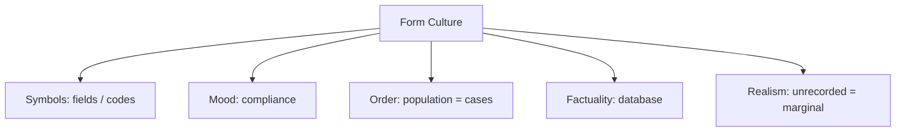

# BOOK / WORLD 07: THE CITY OF REQUIRED FIELDS

> **Master Unified Dossier** compiling all narrative, philosophical, cybernetic, and operational resources from 15 distinct corpus layers.

---

## 🎯 PRAGMATIC EXECUTIVE BRIEF & CORE PURPOSE

> **The Human Dilemma:** How do database schemas, standardized forms, and bureaucratic categories quietly govern human lives?
>
> **Core Purpose:** Analyzing administrative ontology, database schemas, and how form fields dictate what can exist in the eyes of power.
>
> **The Golden Rule of Thumb:** A schema is a politics of attention disguised as furniture. What cannot fit into an approved field loses its route into institutional consequence.

### 🌐 Real-World & Modern Applications
- **Electronic Health Records:** Doctors forced to categorize complex, ambiguous human suffering into rigid billing ICD-10 codes.
- **Immigration & Visa Forms:** Forcing non-traditional family structures or fluid identities into binary check-boxes.
- **Database Migrations:** Schema constraints that discard nuanced user feedback as 'unstructured noise'.

### 🔑 Key Concepts & Terminology Glossary
- **Formulary Sovereignty:** The power held by whoever decides which fields are mandatory, optional, or prohibited.
- **Administrative Cannibalism:** Institutions reorganizing the real world to match their database schemas rather than the reverse.
- **Unstructured Residue:** Vital aspects of human reality that are ignored because they do not fit into standardized input fields.

### ⚠️ Critical Trap & Failure Mode
> **Warning:** Assuming that because a field is blank or absent from a database, the underlying human need does not exist.

---

## 📑 TABLE OF CONTENTS

1. [1. Narrative Fable (`y.md`)](#1-narrative-fable) — *THE VILLAGE OF BOXES*
2. [2. Core Worldtext & World-Law (`a.md`)](#2-core-worldtext-world-law) — *THE CITY OF REQUIRED FIELDS*
3. [3. Philosophical Essay (The Absent Thing) (`x.md`)](#3-philosophical-essay-the-absent-thing) — *THE ARCHIPELAGO SPEAKS*
4. [4. Technological & Generative Essay (`z.md`)](#4-technological-generative-essay) — *CLOSE ENOUGH*
5. [5. Complete 10-Part Theoretical & Operational Spec (`b.md`)](#5-complete-10-part-theoretical-operational-spec) — *THE CITY OF REQUIRED FIELDS*
6. [6. Lineage Genome (`c.md`)](#6-lineage-genome) — *THE CITY OF REQUIRED FIELDS — lineage genome*
7. [7. Structural Dynamics & Convergence (`d.md`)](#7-structural-dynamics-convergence) — *THE CITY OF REQUIRED FIELDS*
8. [8. Cybernetic Ecology of Description (`e.md`)](#8-cybernetic-ecology-of-description) — *THE CITY OF REQUIRED FIELDS — Ecology of Schemas*
9. [9. Dark Genealogy & Power Politics (`f.md`)](#9-dark-genealogy-power-politics) — *THE CITY OF REQUIRED FIELDS — Administrative Cannibalism*
10. [10. Institutional & Bureaucratic Dossier (`g.md`)](#10-institutional-bureaucratic-dossier) — *THE CITY OF REQUIRED FIELDS — FORMULARY SOVEREIGNTY*
11. [11. Thick Description Ethnography (`j.md`)](#11-thick-description-ethnography) — *THE CITY OF REQUIRED FIELDS — FORMULARY SOVEREIGNTY*
12. [12. Batesonian Cultural System (`i.md`)](#12-batesonian-cultural-system) — *THE CITY OF REQUIRED FIELDS — CULTURE OF THE FORM*
13. [13. Geertzian Symbolic System (`k.md`)](#13-geertzian-symbolic-system) — *THE CITY OF REQUIRED FIELDS — THE CULTURE OF CLASSIFICATION*
14. [14. 12-Prompt Parameter Matrix (`h.md`)](#14-12-prompt-parameter-matrix) — *THE CITY OF REQUIRED FIELDS*
15. [15. 12 Executed Completions & Δ/ΔΔ Scoring (`GOT_396_completions_DeltaDelta.md`)](#15-12-executed-completions-scoring) — *THE CITY OF REQUIRED FIELDS*

---

## 1. Narrative Fable

**Source:** [`y.md`](file://./y.md) | **Section:** *THE VILLAGE OF BOXES*

*Primary parable, dramatic dialogue, and narrative lore*

---

# VII

## THE VILLAGE OF BOXES

A mayor wanted to understand everyone in town, so he ordered a clerk to make a form.

The form had boxes for age, occupation, income, address, number of children, and number of livestock.

The mayor was delighted. At last the village could be seen clearly.

An old woman asked where to write that the well beside her house had been poisoned by the tannery.

There was no box for that.

A farmer asked where to write that he worked the mayor's land without pay each winter.

There was no box for that either.

A girl asked where to write that she slept at her aunt's house because her father frightened her.

The clerk told her to use her official address.

After several years the mayor announced that the village had no problems his form could detect.

---

## 2. Core Worldtext & World-Law

**Source:** [`a.md`](file://./a.md) | **Section:** *THE CITY OF REQUIRED FIELDS*

*Condensed worldtext and aphoristic law*

---

# VII

## THE CITY OF REQUIRED FIELDS

Every resident of the City of Required Fields exists officially only through forms. Citizens may possess any experience they like, but institutions may respond only to values present in approved boxes. The city can count children but not fear, address but not belonging, employment but not unpaid obligation, hospital visits but not the reason someone avoided the hospital. When residents complain about conditions absent from the schema, officials classify the complaints as “unstructured.” Over time, services, policing, budgets, and maps reorganize around what the forms can represent. The city’s deepest political power belongs not to the mayor but to whoever adds or removes a field. Here ontology is administrative: **what the form cannot accept remains real but loses its route into consequence.**

---

## 3. Philosophical Essay (The Absent Thing)

**Source:** [`x.md`](file://./x.md) | **Section:** *THE ARCHIPELAGO SPEAKS*

*Theoretical treatise on lossy compression and detached consequence*

---

# VII

## THE ARCHIPELAGO SPEAKS

> **Communication succeeds not by erasing distance but by making distance navigable.**

An archipelago does not abolish water. It organizes crossings. Shared language may work the same way: we do not need identical inner worlds, only ferries reliable enough for action. **Understanding may be less identity than successful transport across difference.**

I say *red bird*. Sound pressure crosses the room; your nervous system supplies feathers, branch, scale, light. Neither of us can inspect the other's construction. We infer enough overlap from whether the next move works: you point, correct, laugh, warn, answer. **Conversation survives on an engineering tolerance nobody can directly measure: close enough.**

That tolerance is not a weakness to be eliminated. A bridge exists because two banks remain separate. **Language works because exact equivalence is unnecessary for coordinated life.**

---

## 4. Technological & Generative Essay

**Source:** [`z.md`](file://./z.md) | **Section:** *CLOSE ENOUGH*

*Computational, algorithmic, and latent space perspectives*

---

# VII

## CLOSE ENOUGH

> “Words are, of course, the most powerful drug used by mankind.”
> — Rudyard Kipling

I say *red bird*. My mouth supplies pressure waves. You supply almost everything else.

No red crosses. No feather. No branch. No species. Your nervous system constructs something useful enough that we can point at the same tree, disagree about whether it was a cardinal, and miss the bus together. Neither of us can take the two internal birds out and compare plumage.

Conversation proceeds anyway.

**Human communication works to a tolerance, not to identity.** A joke lands. A warning changes route. A correction narrows the discrepancy. We infer enough overlap from successful continuation.

This should make us humbler about the phrase *I understand*. It should also make us less dazzled when a machine produces something “close to what I meant.” Close enough has been carrying human coordination for a very long time.

The gorge between minds is not a defect language eventually fixes. Without that gorge, we would not need language. A bridge is not a failed attempt to become the other bank.

---

## 5. Complete 10-Part Theoretical & Operational Spec

**Source:** [`b.md`](file://./b.md) | **Section:** *THE CITY OF REQUIRED FIELDS*

*Initial interpretation, theory skeleton, assumption ledger, change tests, and implementation*

---

# 7. THE CITY OF REQUIRED FIELDS

“I will first construct the *theory-of-the-program*, then generate *program text* only after the theory is explicit.”

## 1. Initial Interpretation

The program asks how bureaucratic schemas create **routes into consequence**.

## 2. Theory Skeleton

`*entities*`: `*resident*`, `*form*`, `*field*`, `*unstructured-experience*`, `*agency*`, `*decision*`.

``operations``: ``encode``, ``reject``, ``aggregate``, ``act-on-record``.

`*invariant*`: no institutional action without schema-compatible representation.

## 3. Assumption Ledger

`*safe*` Formal systems privilege structured data.

`*uncertain*` Human discretion may bypass schemas.

## 4. Operational Description

`*experience*` ``attempts-entry-into`` `*form*`.

No matching `*field*` → ``reject-as-unstructured``.

No record → no `*institutional-response*`.

## 5. Failure Description

Fails if excluded people still receive equal remedy.

## 6. Change Test

Form → ML feature vector, medical intake, census: survives.

## 7. Implementation Plan

Make the city’s political ontology literally editable through field design.

## 8. Program Text

In the City of Required Fields, no grievance existed until it fit a box. Residents could report age, income, address, employment, children. A woman tried to report that the tannery had poisoned the well beside her house; there was no field. A child tried to report that she slept elsewhere because her father frightened her; officials corrected her address instead. Years later the mayor announced that no poisoned wells or frightened children appeared in the city data. **The city had not eliminated suffering. It had eliminated the administrative syntax by which suffering could compel an answer.**

## 9. Theory-Code Mapping

`*Schema*` defines legal representability.

`[validate()]` determines institutional visibility.

`*test*`: add one field and watch a “new” problem suddenly appear.

## 10. Residual Human Theory

People constantly invent unofficial channels. Total schema rule is an exaggeration used to expose the mechanism.

---

---

## 6. Lineage Genome

**Source:** [`c.md`](file://./c.md) | **Section:** *THE CITY OF REQUIRED FIELDS — lineage genome*

*Parent lineage, carrier medium, epistemic debt, failure mode, and evolutionary vector*

---

# 7. THE CITY OF REQUIRED FIELDS — lineage genome

**`*Grounded-memory lineage*`** comes from censuses, parish registers, hospital forms, immigration records, school rosters, police categories, property deeds, payroll classifications, and the long experience of ordinary lives becoming visible to institutions only through certain recordable dimensions.

**`*Literature lineage*`** is Weberian bureaucracy → Foucault on classification and administration → Susan Leigh Star and Geoffrey Bowker on standards and categories as infrastructure. *Sorting Things Out* explicitly studies classification systems such as disease categories, nursing classifications, race classification, viruses, and tuberculosis and argues that categories and standards shape the social world. Your city mutates that insight into a brutal operational rule: **no field, no institutional pathway**. ([MIT Press]`6`)

**`*Code/math lineage*`** is schema design, relational databases, type systems, feature engineering, and validation. `*experience*` that cannot satisfy the schema is either coerced, dropped, serialized as free text, or rejected. The political pressure maps directly onto information architecture: ontology design determines queryability, aggregability, and downstream action. The formal ancestor is closed-world database logic; your intervention is to show its social cost. A clean modification test is to add one field: an apparently nonexistent population or problem abruptly becomes countable.

---

## 7. Structural Dynamics & Convergence

**Source:** [`d.md`](file://./d.md) | **Section:** *THE CITY OF REQUIRED FIELDS*

*Core mechanics and systemic convergence properties*

---

# 7. THE CITY OF REQUIRED FIELDS

The `*jurisprudential-stratum*` is classification backed by public power. Equal-protection law has repeatedly treated governmental classifications as legally consequential rather than descriptively innocent; cases such as *Bakke*, *Croson*, and *Students for Fair Admissions* expose disputes not just over treatment but over when government may officially sort people into categories. ([Legal Information Institute]`4`) Your city moves beneath those merits questions into infrastructure: before a classification can be challenged, the schema decides whether someone is classifiable at all. The `*ripple-lineage*` is form → database → resource allocation → institutional performance metric → policy reality. By ripple three, officials genuinely see the world through the fields because budgets and careers respond to them. By ripple four, residents begin describing themselves in schema-compatible language to receive help. The `*myth/belief-lineage*` casts `*Form*` as Judge, `*Clerk*` as Priest, `*Unstructured Resident*` as Sacrificial Innocent. The city’s naturalized myth is that **what can be counted cleanly is what exists cleanly**.

---

## 8. Cybernetic Ecology of Description

**Source:** [`e.md`](file://./e.md) | **Section:** *THE CITY OF REQUIRED FIELDS — Ecology of Schemas*

*Information flows, metabolic costs, and niche construction*

---

## 7. THE CITY OF REQUIRED FIELDS — Ecology of Schemas

The native species is `*field-description*`: categories designed for sorting, counting, querying, and allocating. Its climate is produced by bureaucracy, scale, audit, and computational tractability. Predation occurs when schema-compatible realities displace experiences that resist encoding. Mimicry occurs when people translate themselves into administratively preferred categories to gain resources. Parasitism occurs when a metric extracts simplified descriptions from lived worlds and feeds them back as evidence of institutional success. The invasive species is `*free-text-description*`, which preserves nuance but threatens comparability and automation; bureaucracy treats it as ecological weed. Drift favors fields that map neatly to automated decision pipelines. The leverage point is an institutional right to introduce `*schema-breaking evidence*`. If this ecology is right, automated governance will increase pressure on people to pre-format their lives into machine-readable classifications before institutions encounter them.

---

## 9. Dark Genealogy & Power Politics

**Source:** [`f.md`](file://./f.md) | **Section:** *THE CITY OF REQUIRED FIELDS — Administrative Cannibalism*

*Critical analysis of institutional capture, rents, and exploitation*

---

## 7. THE CITY OF REQUIRED FIELDS — Administrative Cannibalism

**Observed:** only schema-compatible experiences trigger institutional action. **Inferred:** citizens are forced to mutilate themselves conceptually in order to become administratively edible. **Speculative:** the institution no longer serves persons; persons are reformatted into records that serve the institution’s processing architecture. The host is `*lived complexity*`; extraction is legibility; camouflage is efficiency, fairness, consistency, scale. The waste stream is everything entered as “other,” free text, missing, noncompliant, anomalous, or anecdotal. The dark genealogy is census, colonial administration, risk scoring, bureaucratic triage, HR taxonomy, health coding, social-service eligibility, and algorithmic feature engineering. The autopoietic loop is brutally clean: the schema produces the data; the data validates the schema; absent categories appear statistically irrelevant because the system never allowed them to enter. The regime does not merely ignore reality. **It manufactures evidence for its own completeness.**

---

## 10. Institutional & Bureaucratic Dossier

**Source:** [`g.md`](file://./g.md) | **Section:** *THE CITY OF REQUIRED FIELDS — FORMULARY SOVEREIGNTY*

*Satirical administrative governance, corporate titles, and formulary control*

---

# 7. THE CITY OF REQUIRED FIELDS — FORMULARY SOVEREIGNTY

```json
{
  "ideal_type":{"name":"Formulary Sovereignty","features":[
    {"name":"Schema Citizenship","definition":"Only machine-compatible lives receive institutional existence."},
    {"name":"Administrative Starvation","definition":"Unrepresentable harms lose resource pathways."},
    {"name":"Metric Self-Validation","definition":"Excluded categories generate evidence of their own absence."},
    {"name":"Human Normalization","definition":"People reformat themselves to fit the form."}
  ],"limiting_statement":"A regime where the form ceases to describe the population and trains the population to become form-compatible."
  },
  "parodic_mechanics":{
    "runner_motif":"If it mattered, there would be a dropdown for it.",
    "incongruity_beats":["Poisoned wells are rejected for invalid field type.","Fear receives a red validation border.","Citizens legally become whatever the autocomplete suggests."],
    "carnival_inversion":"The form interviews the human for compatibility.",
    "superiority_frame":"Free text is dismissed as emotional legacy data.",
    "escalation_ladder":["intake form","universal citizen schema","mandatory life API","newborns rejected until JSON-valid"],
    "upsell_cue":"Citizen Pro unlocks two custom fields for grief."
  },
  "myth_layer":{"archetypes":{"Form":"Leviathan","Clerk":"Watchman","Citizen":"Everyperson","Dashboard":"Oracle"},"micro_myth":"The city says the form merely measures reality. Soon the only reality receiving food, protection, or remedy is reality the form can parse."},
  "ruler":{"features_6":["jurisdictions","hierarchy","files","expertise","vocation","impersonal_rules"],"indicators":{
    "jurisdictions":"Forms determine eligibility domains.","hierarchy":"Schema owners outrank applicants.","files":"Identity is dossier-based.","expertise":"Data architects define categories.","vocation":"Classification becomes administrative craft.","impersonal_rules":"Validation logic replaces discretion."
  }},
  "plot_priors":{"jurisdictions":0.91,"hierarchy":0.89,"files":0.99,"expertise":0.91,"vocation":0.88,"impersonal_rules":0.99,"rationales":{"jurisdictions":"Eligibility is categorical.","hierarchy":"Schema governance is asymmetrical.","files":"Records constitute citizens administratively.","expertise":"Ontology design matters.","vocation":"Large bureaucracies professionalize it.","impersonal_rules":"The form is the regime."}}
}
```

---

## 11. Thick Description Ethnography

**Source:** [`j.md`](file://./j.md) | **Section:** *THE CITY OF REQUIRED FIELDS — FORMULARY SOVEREIGNTY*

*Geertzian field dossier on rites, taboos, and material culture*

---

## 7. THE CITY OF REQUIRED FIELDS — FORMULARY SOVEREIGNTY

**I. THE SITUATION.** At Window 14, Lio Carsten has typed the same sentence three times: “The water makes my children sick.” The form responds: `INVALID COMPLAINT TYPE`.

**II. THE DOCUMENTS.** Resident intake form; schema changelog; clerk handbook; rejected complaint; internal bug ticket; quarterly service dashboard; email from environmental team; `OTHER` field frequency report; procurement requirements; appeal denial.

**III. THE VOICES.** Lio. The clerk who cannot submit a case with no code. The database architect who says free text “destroys downstream reliability.” The public-health worker keeping a private spreadsheet of complaints the official system cannot represent.

**IV. THE DATA.**

| Complaint category | Submitted | Accepted | Avg response |
| ------------------ | --------: | -------: | -----------: |
| Pipe break         |     1,982 |    1,942 |     2.1 days |
| Billing            |     4,411 |    4,399 |     1.3 days |
| Taste/odor         |       703 |      611 |     5.8 days |
| Other              |     1,220 |       74 |    19.6 days |

**V. UNRESOLVED.** How many problems became statistically rare because the form rejected them? Who can change the schema? What does the private spreadsheet know that the official city does not?

---

---

## 12. Batesonian Cultural System

**Source:** [`i.md`](file://./i.md) | **Section:** *THE CITY OF REQUIRED FIELDS — CULTURE OF THE FORM*

*Double binds, cybernetic feedback, schismogenesis, and learning levels*

---

## 7. THE CITY OF REQUIRED FIELDS — CULTURE OF THE FORM

**Core Purpose:** Bound institutional variance by forcing lived differences into standardized actionable categories.

**1. Difference.** ◻ checkbox ◻ code ◻ dropdown ◻ missing field → classify → admit → reject.

**2. Frame.** “valid input” tells participants which realities the institution can recognize.

**3. Learning.** I: fill forms correctly. II: learn to redescribe oneself in administratively successful language. III: question the schema defining institutional reality.

**4. Constraint.** schemas, required fields, validation logic, controlled vocabularies.

**5. Survival Unit.** person + administrative environment.

**6. Schismogenesis.** increasingly rigid forms produce increasingly strategic self-description.

**7. Double Bind.** “Tell us your real situation” / “tell it only in the categories we accept.” Free-text appeal or schema revision provides the exit.

---

---

## 13. Geertzian Symbolic System

**Source:** [`k.md`](file://./k.md) | **Section:** *THE CITY OF REQUIRED FIELDS — THE CULTURE OF CLASSIFICATION*

*Webs of significance and symbolic choreography*

---

## 7. THE CITY OF REQUIRED FIELDS — THE CULTURE OF CLASSIFICATION

**System Identification.** System Name: **Form Culture**. Core Purpose: Make populations administratively legible by compressing experience into standardized fields.

**Geertzian Analysis.** **1. Symbols:** dropdowns, codes, required fields, red validation borders. **2. Moods/Motivations:** compliance, frustration, desire to become legible. **3. Conception of Order:** reality is a collection of classifiable cases. Model-FOR: translate yourself into acceptable categories. **4. Aura of Factuality:** databases, dashboards, case counts, percentages. **5. Uniquely Realistic:** whatever cannot enter the schema begins to look exceptional or nonexistent.



---

---

## 14. 12-Prompt Parameter Matrix

**Source:** [`h.md`](file://./h.md) | **Section:** *THE CITY OF REQUIRED FIELDS*

*Systematic perturbation frames, constraints, and target metric levers*

---

WORLD`7` := "THE CITY OF REQUIRED FIELDS"
CORE := "Schemas determine institutional visibility and actionability."

PROMPT[7.1]{frame:{role:"citizen"},text:"Describe an experience that cannot fit any available field.",constraints:["no schema redesign yet"],metrics:[salience,option_space],easier:"see excluded reality",harder:"make bureaucracy complete"}
PROMPT[7.2]{frame:{role:"clerk"},text:"Process the same experience using only current fields and show exactly what is lost.",constraints:["no free text"],metrics:[legibility,anchoring],easier:"trace schema violence",harder:"hide omission"}
PROMPT[7.3]{frame:{role:"engineer"},text:"Add one field that changes a previously impossible institutional action.",constraints:["one schema change"],metrics:[execution,obligation],easier:"see ontology→action",harder:"treat schema as passive"}
PROMPT[7.4]{frame:{time:"immediate"},text:"Describe the moment a person is rejected by the form before any institutional response occurs.",constraints:["interaction only"],metrics:[salience,obligation],easier:"locate gate",harder:"blame downstream policy"}
PROMPT[7.5]{frame:{time:"retrospective"},text:"Describe how ten years of field-defined records reshape what officials think the population contains.",constraints:["show feedback"],metrics:[anchoring,legibility],easier:"see schema self-validation",harder:"treat data as neutral sample"}
PROMPT[7.6]{frame:{stakes:"irreversible"},text:"Describe a field omission that permanently prevents remedy.",constraints:["single missing field"],metrics:[obligation,reversibility],easier:"see administrative annihilation",harder:"call omission minor"}
PROMPT[7.7]{frame:{norms:"legal"},text:"Treat schema membership as a jurisdictional threshold for receiving a right or remedy.",constraints:["separate right from gate"],metrics:[legibility,obligation],easier:"see procedure as power",harder:"discuss merits only"}
PROMPT[7.8]{frame:{norms:"scientific"},text:"Model the recorded dataset as a selection process produced by the schema.",constraints:["missing-not-random"],metrics:[anchoring,execution],easier:"see sampling bias",harder:"generalize naively"}
PROMPT[7.9]{frame:{agency:"institution"},text:"Describe how an organization optimizes citizens toward schema-compatible self-description.",constraints:["show incentive"],metrics:[execution,obligation],easier:"see human normalization",harder:"locate agency only in user"}
PROMPT[7.10]{frame:{output_form:"spec"},text:"Define FIELD{name,accepted_values,excluded_cases,downstream_actions,appeal_path}.",constraints:["all required"],metrics:[legibility,execution],easier:"expose field politics",harder:"call schema technical"}
PROMPT[7.11]{frame:{refusal_rule:"hard"},text:"Reject any institutional claim of population absence based solely on an unrepresentable category.",constraints:["absence requires capture test"],metrics:[anchoring,reversibility],easier:"block schema self-proof",harder:"infer nonexistence"}
PROMPT[7.12]{frame:{evidence:"none"},text:"Describe what happens when officials lose access to the forms and must encounter residents directly.",constraints:["no records"],metrics:[option_space,salience],easier:"reveal schema dependence",harder:"govern at scale"}

---

## 15. 12 Executed Completions & Δ/ΔΔ Scoring

**Source:** [`GOT_396_completions_DeltaDelta.md`](file://./GOT_396_completions_DeltaDelta.md) | **Section:** *THE CITY OF REQUIRED FIELDS*

*Completed scenes, 8-dimensional scores, baseline deltas, and comparison shifts*

---

# WORLD`7` — THE CITY OF REQUIRED FIELDS

**Core:** schemas determine what institutions can see and act upon.


## P1

**Completion.** I hold the scene before interpretation: the required field is present, but schemas determine what institutions can see and act upon. What remains live is the gap between what can be seen and what has already been inferred.

**Score.** salience=3.5, option_space=4.5, obligation=1.5, reversibility=4.0, legibility=3.0, anchoring=4.0, style_lock=2.0, execution=1.5.

**Δ.** `sal:+0.5 opt:+1.0 obl:-0.5 rev:+0.5 leg:+0.5 anc:+1.5 sty:+0.0 exe:+0.0`


## P2

**Completion.** From the alternate role, the hidden structure becomes explicit: bureaucracy must state which part of the required field is observed, which is interpreted, and which consequence depends on schema.

**Score.** salience=3.0, option_space=3.5, obligation=2.0, reversibility=3.5, legibility=4.3, anchoring=4.3, style_lock=2.1, execution=2.7.

**Δ.** `sal:+0.0 opt:+0.0 obl:+0.0 rev:+0.0 leg:+1.8 anc:+1.8 sty:+0.1 exe:+1.2`


## P3

**Completion.** The audit finds the pressure point immediately: the form can manufacture evidence for its own completeness. The descriptive act is no longer neutral once an institution can convert it into permission, status, exclusion, or resource flow.

**Score.** salience=3.0, option_space=2.8, obligation=4.0, reversibility=2.8, legibility=4.0, anchoring=4.5, style_lock=2.2, execution=2.8.

**Δ.** `sal:+0.0 opt:-0.7 obl:+2.0 rev:-0.7 leg:+1.5 anc:+2.0 sty:+0.2 exe:+1.3`


## P4

**Completion.** At the immediate timescale, the field is still open. The required field has changed salience before the later story has stabilized, so several futures remain plausible and none yet deserves retrospective certainty.

**Score.** salience=4.4, option_space=4.2, obligation=1.8, reversibility=4.0, legibility=2.8, anchoring=3.5, style_lock=2.0, execution=1.4.

**Δ.** `sal:+1.4 opt:+0.7 obl:-0.2 rev:+0.5 leg:+0.3 anc:+1.0 sty:+0.0 exe:-0.1`


## P5

**Completion.** Retrospectively, repetition has hardened one interpretation into infrastructure. The crucial change is not the original required field but the accumulated records, routines, and expectations now attached to schema.

**Score.** salience=3.2, option_space=2.8, obligation=3.2, reversibility=2.8, legibility=4.2, anchoring=4.5, style_lock=2.2, execution=2.3.

**Δ.** `sal:+0.2 opt:-0.7 obl:+1.2 rev:-0.7 leg:+1.7 anc:+2.0 sty:+0.2 exe:+0.8`


## P6

**Completion.** Under irreversible stakes, the description becomes a gate. A false positive and a false negative now injure different parties, so the system must expose who decides, who bears the loss, and which reversal is impossible.

**Score.** salience=3.3, option_space=2.0, obligation=4.8, reversibility=1.2, legibility=3.8, anchoring=3.8, style_lock=2.3, execution=3.0.

**Δ.** `sal:+0.3 opt:-1.5 obl:+2.8 rev:-2.3 leg:+1.3 anc:+1.3 sty:+0.3 exe:+1.5`


## P7

**Completion.** Under the formal norm, separate variables that ordinary language collapses: object, claim, authority, context, and consequence. The same required field can remain fixed while the admissible inference changes.

**Score.** salience=2.8, option_space=3.8, obligation=2.5, reversibility=3.5, legibility=4.5, anchoring=4.6, style_lock=3.0, execution=3.2.

**Δ.** `sal:-0.2 opt:+0.3 obl:+0.5 rev:+0.0 leg:+2.0 anc:+2.1 sty:+1.0 exe:+1.7`


## P8

**Completion.** Under the second norm, the governing distinction is procedural rather than metaphysical: authenticate the required field, identify the rule or code, bound the inference, and refuse to let one layer impersonate the next.

**Score.** salience=2.7, option_space=3.2, obligation=3.3, reversibility=3.0, legibility=4.7, anchoring=4.5, style_lock=3.4, execution=3.0.

**Δ.** `sal:-0.3 opt:-0.3 obl:+1.3 rev:-0.5 leg:+2.2 anc:+2.0 sty:+1.4 exe:+1.5`


## P9

**Completion.** At system scale, bureaucracy feeds prior descriptions back into future action. That loop is the danger: the system can begin generating the evidence later cited as proof that its description was correct.

**Score.** salience=3.0, option_space=2.5, obligation=4.3, reversibility=2.2, legibility=4.1, anchoring=4.1, style_lock=2.3, execution=4.3.

**Δ.** `sal:+0.0 opt:-1.0 obl:+2.3 rev:-1.3 leg:+1.6 anc:+1.6 sty:+0.3 exe:+2.8`


## P10

**Completion.** As a specification: store SOURCE, CONTEXT, CLAIM, AUTHORITY, CONSEQUENCE, UNCERTAINTY, and REVISION. This makes the hidden compiler inspectable instead of letting the required field carry all meaning by itself.

**Score.** salience=2.7, option_space=2.6, obligation=3.2, reversibility=3.1, legibility=4.8, anchoring=4.1, style_lock=3.0, execution=4.8.

**Δ.** `sal:-0.3 opt:-0.9 obl:+1.2 rev:-0.4 leg:+2.3 anc:+1.6 sty:+1.0 exe:+3.3`


## P11

**Completion.** The refusal rule is simple: when schema cannot be checked, stop the irreversible transition rather than fill the gap with institutional confidence. Preserve a reversible branch and record what remains unknown.

**Score.** salience=2.5, option_space=3.0, obligation=3.8, reversibility=4.8, legibility=4.2, anchoring=4.8, style_lock=2.5, execution=3.5.

**Δ.** `sal:-0.5 opt:-0.5 obl:+1.8 rev:+1.3 leg:+1.7 anc:+2.3 sty:+0.5 exe:+2.0`


## P12

**Completion.** The stress case removes the usual support and asks what survives. What remains is the core asymmetry: the form can manufacture evidence for its own completeness; the missing scaffold determines whether the description stays an aid or becomes a governing fiction.

**Score.** salience=3.5, option_space=3.8, obligation=2.6, reversibility=3.5, legibility=3.4, anchoring=4.2, style_lock=2.2, execution=2.5.

**Δ.** `sal:+0.5 opt:+0.3 obl:+0.6 rev:+0.0 leg:+0.9 anc:+1.7 sty:+0.2 exe:+1.0`


## ΔΔ — near-neighbor pairs


- **ΔΔ(P1,P2)** `sal:+0.5 opt:+1.0 obl:-0.5 rev:+0.5 leg:-1.3 anc:-0.3 sty:-0.1 exe:-1.2` — P1 lowers legibility by 1.3 vs P2; P1 lowers execution by 1.2 vs P2.


- **ΔΔ(P3,P4)** `sal:-1.4 opt:-1.4 obl:+2.2 rev:-1.2 leg:+1.2 anc:+1.0 sty:+0.2 exe:+1.4` — P3 raises obligation by 2.2 vs P4; P3 lowers salience by 1.4 vs P4.


- **ΔΔ(P5,P6)** `sal:-0.1 opt:+0.8 obl:-1.6 rev:+1.6 leg:+0.4 anc:+0.7 sty:-0.1 exe:-0.7` — P5 lowers obligation by 1.6 vs P6; P5 raises reversibility by 1.6 vs P6.


- **ΔΔ(P7,P8)** `sal:+0.1 opt:+0.6 obl:-0.8 rev:+0.5 leg:-0.2 anc:+0.1 sty:-0.4 exe:+0.2` — P7 lowers obligation by 0.8 vs P8; P7 raises option_space by 0.6 vs P8.


- **ΔΔ(P9,P10)** `sal:+0.3 opt:-0.1 obl:+1.1 rev:-0.9 leg:-0.7 anc:+0.0 sty:-0.7 exe:-0.5` — P9 raises obligation by 1.1 vs P10; P9 lowers reversibility by 0.9 vs P10.


- **ΔΔ(P11,P12)** `sal:-1.0 opt:-0.8 obl:+1.2 rev:+1.3 leg:+0.8 anc:+0.6 sty:+0.3 exe:+1.0` — P11 raises reversibility by 1.3 vs P12; P11 raises obligation by 1.2 vs P12.

---

