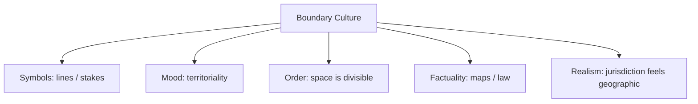

# BOOK / WORLD 08: THE MARSH OF ENFORCED LINES

> **Master Unified Dossier** compiling all narrative, philosophical, cybernetic, and operational resources from 15 distinct corpus layers.

---

## 🎯 PRAGMATIC EXECUTIVE BRIEF & CORE PURPOSE

> **The Human Dilemma:** How do arbitrary lines drawn on paper harden into violent physical borders across living terrain?
>
> **Core Purpose:** Understanding the violence of artificial borders and geometric imposition on continuous natural landscapes.
>
> **The Golden Rule of Thumb:** Nature does not have straight lines, but a boundary becomes real the moment institutions begin punishing bodies for crossing it.

### 🌐 Real-World & Modern Applications
- **Colonial Borders:** Straight lines drawn with rulers across Africa and the Middle East slicing through historic communities.
- **Software Microservice Boundaries:** Arbitrary domain boundaries that cause massive network latency and organizational friction.
- **Zoning Laws:** Rigid municipal boundaries separating residential and commercial zones regardless of neighborhood flow.

### 🔑 Key Concepts & Terminology Glossary
- **Cartographic Leviathan:** The institutional force required to compel a shifting physical world to obey static drawn lines.
- **Enforced Discontinuity:** Creating an artificial binary division in what is naturally a gradient or continuous spectrum.
- **Surveyor's Hubris:** Believing the map's geometry is more legitimate than the landscape's lived geography.

### ⚠️ Critical Trap & Failure Mode
> **Warning:** Fighting endless border wars to maintain an arbitrary line that nature continuously washes away.

---

## 📑 TABLE OF CONTENTS

1. [1. Narrative Fable (`y.md`)](#1-narrative-fable) — *THE MIST-CUTTERS*
2. [2. Core Worldtext & World-Law (`a.md`)](#2-core-worldtext-world-law) — *THE MARSH OF ENFORCED LINES*
3. [3. Philosophical Essay (The Absent Thing) (`x.md`)](#3-philosophical-essay-the-absent-thing) — *WHAT THE DEAD LEFT BY ACCIDENT*
4. [4. Technological & Generative Essay (`z.md`)](#4-technological-generative-essay) — *THE SHARD*
5. [5. Complete 10-Part Theoretical & Operational Spec (`b.md`)](#5-complete-10-part-theoretical-operational-spec) — *THE MARSH OF ENFORCED LINES*
6. [6. Lineage Genome (`c.md`)](#6-lineage-genome) — *THE MARSH OF ENFORCED LINES — lineage genome*
7. [7. Structural Dynamics & Convergence (`d.md`)](#7-structural-dynamics-convergence) — *THE MARSH OF ENFORCED LINES*
8. [8. Cybernetic Ecology of Description (`e.md`)](#8-cybernetic-ecology-of-description) — *THE MARSH OF ENFORCED LINES — Ecology of Boundaries*
9. [9. Dark Genealogy & Power Politics (`f.md`)](#9-dark-genealogy-power-politics) — *THE MARSH OF ENFORCED LINES — Cartographic Violence*
10. [10. Institutional & Bureaucratic Dossier (`g.md`)](#10-institutional-bureaucratic-dossier) — *THE MARSH OF ENFORCED LINES — CARTOGRAPHIC LEVIATHAN*
11. [11. Thick Description Ethnography (`j.md`)](#11-thick-description-ethnography) — *THE MARSH OF ENFORCED LINES — CARTOGRAPHIC LEVIATHAN*
12. [12. Batesonian Cultural System (`i.md`)](#12-batesonian-cultural-system) — *THE MARSH OF ENFORCED LINES — CULTURE OF TERRITORY*
13. [13. Geertzian Symbolic System (`k.md`)](#13-geertzian-symbolic-system) — *THE MARSH OF ENFORCED LINES — THE CULTURE OF TERRITORY*
14. [14. 12-Prompt Parameter Matrix (`h.md`)](#14-12-prompt-parameter-matrix) — *THE MARSH OF ENFORCED LINES*
15. [15. 12 Executed Completions & Δ/ΔΔ Scoring (`GOT_396_completions_DeltaDelta.md`)](#15-12-executed-completions-scoring) — *THE MARSH OF ENFORCED LINES*

---

## 1. Narrative Fable

**Source:** [`y.md`](file://./y.md) | **Section:** *THE MIST-CUTTERS*

*Primary parable, dramatic dialogue, and narrative lore*

---

# VIII

## THE MIST-CUTTERS

A kingdom hired surveyors to divide a marsh.

The surveyors hammered stakes into mud and drew straight lines between them.

Soon maps showed North Marsh, South Marsh, Crown Marsh, and Empty Marsh.

Birds ignored the lines.

Water ignored them.

Fish crossed them at night.

But taxes did not.

Neither did soldiers.

Within a generation, people began fighting over boundaries nobody could locate without the map.

An old fisherman pulled up one of the stakes and found nothing underneath it but mud.

He laughed until the guards arrived.

---

## 2. Core Worldtext & World-Law

**Source:** [`a.md`](file://./a.md) | **Section:** *THE MARSH OF ENFORCED LINES*

*Condensed worldtext and aphoristic law*

---

# VIII

## THE MARSH OF ENFORCED LINES

The Marsh of Enforced Lines contains no natural borders. Water migrates, reeds colonize, fish cross, fog erases distance. Surveyors arrive and drive stakes through mud, dividing the marsh into Crown, Common, Sacred, and Forbidden sectors. Birds ignore the boundaries; tax collectors do not. A generation later families possess inherited rights tied to lines visible only on state maps, and guards punish anyone who crosses coordinates the water itself refuses to respect. The people eventually argue that the lines must be natural because blood has been shed over them. The marsh answers every spring by moving. Its worldtext is an ongoing quarrel between geometry and force: **a boundary becomes real enough when institutions punish bodies for ignoring it.**

---

## 3. Philosophical Essay (The Absent Thing)

**Source:** [`x.md`](file://./x.md) | **Section:** *WHAT THE DEAD LEFT BY ACCIDENT*

*Theoretical treatise on lossy compression and detached consequence*

---

# VIII

## WHAT THE DEAD LEFT BY ACCIDENT

> **The shard never said it was a bowl. Someone had to risk the sentence.**

Mud caves beneath a boot. Hours later someone reads direction, weight, tread, speed. The print did not intend to tell anyone anything. Archaeologists brush dirt from a broken curve and risk *bowl*; historians rebuild a burned room from nails, ash, melted glass; linguists place an asterisk before a word nobody recorded. **The past becomes speakable through disciplined inference, not through access to a preserved whole.**

The interpreter is never cleanly outside this work. Every historian writes with categories produced by histories they did not choose. Every theory of description uses descriptions to describe description. **The strongest account is not the one that escapes its own limits, but the one that keeps those limits visible.**

The same problem appears in tools. A hammer vanishes while hammering succeeds; crack the handle and grain, weight, balance, splinter suddenly flood attention. The master potter moves the apprentice's thumb six millimeters because the paragraph fails. **Description thickens where fluent practice tears.**

---

## 4. Technological & Generative Essay

**Source:** [`z.md`](file://./z.md) | **Section:** *THE SHARD*

*Computational, algorithmic, and latent space perspectives*

---

# VIII

## THE SHARD

> “A wise man proportions his belief to the evidence.”
> — David Hume

The shard does not say *bowl*. The footprint does not say *heavy man walking east*. The fossil does not say *ancestor*. The reconstructed word does not whisper from beneath its asterisk. Somebody risks the sentence.

Archaeologists brush dirt from a broken curve and constrain possibilities. Linguists compare patterned correspondences and propose a form nobody recorded. Historians rebuild a burned room from nails, ash, melted glass, letters. **The past becomes speakable through disciplined risk, not through recovery of a preserved whole.**

Interpretation is often made mystical because this sounds more dignified than admitting what it looks like in practice: a remainder, a set of constraints, competing explanations, a claim that might embarrass you later. The honest interpreter does not eliminate risk. The honest interpreter leaves enough evidence visible that someone else can fight back.

The observer cannot stand cleanly outside the problem. Every historian uses categories produced by histories they did not choose. Every theory of description must use description to describe description. A field becomes ridiculous when it diagnoses everybody else's cuts while presenting its own as transparent.

**A theory of description earns trust only by keeping its own knife on the table.**

---

## 5. Complete 10-Part Theoretical & Operational Spec

**Source:** [`b.md`](file://./b.md) | **Section:** *THE MARSH OF ENFORCED LINES*

*Initial interpretation, theory skeleton, assumption ledger, change tests, and implementation*

---

# 8. THE MARSH OF ENFORCED LINES

“I will first construct the *theory-of-the-program*, then generate *program text* only after the theory is explicit.”

## 1. Initial Interpretation

This world models the transition `*drawn-boundary* → *enforced-boundary* → *naturalized-boundary*`.

## 2. Theory Skeleton

`*entities*`: `*marsh*`, `*survey-line*`, `*water*`, `*guard*`, `*resident*`, `*map*`.

``operations``: ``survey``, ``codify``, ``enforce``, ``inherit``, ``naturalize``.

`*invariant*`: material ecology ignores the line while institutions enforce it.

## 3. Assumption Ledger

`*safe*` Social boundaries can become materially consequential through enforcement.

## 4. Operational Description

`*surveyor*` ``draws`` `*line*`.

`*state*` ``recognizes`` `*line*`.

`*guard*` ``sanctions-crossing``.

Bodies ``adapt-to`` line.

Later generations ``treat-as-natural`` line.

## 5. Failure Description

Fails if the line tracks an obvious river or cliff.

## 6. Change Test

Marsh → school district, property line, diagnostic threshold: survives.

## 7. Implementation Plan

Use a mutable environment to expose the rigidity of institutional geometry.

## 8. Program Text

Surveyors drove stakes through a marsh that changed shape every spring. The map called one side Crown Marsh and the other Common Marsh. Fish crossed nightly; reeds migrated; floodwater erased the distinction each season. Tax collectors did not erase it. Guards did not. After a generation, families inherited rights and grudges tied to coordinates no bird could see. One fisherman pulled up a stake and found only mud beneath it. **The boundary had no root in the marsh, but it had acquired roots in punishment.**

## 9. Theory-Code Mapping

`*Boundary*` has geometric and normative layers.

`[enforce()]` converts representation into consequence.

## 10. Residual Human Theory

Some social boundaries correspond to physical differences; the fable targets the leap from convention to necessity.

---

---

## 6. Lineage Genome

**Source:** [`c.md`](file://./c.md) | **Section:** *THE MARSH OF ENFORCED LINES — lineage genome*

*Parent lineage, carrier medium, epistemic debt, failure mode, and evolutionary vector*

---

# 8. THE MARSH OF ENFORCED LINES — lineage genome

**`*Grounded-memory lineage*`** is cadastral survey, enclosure, colonial border-making, property disputes, redistricting, zoning, racial classification, school boundaries, and fishing or grazing rights imposed on ecologies that do not share administrative geometry.

**`*Literature lineage*`** crosses Korzybski’s map/territory warning, political geography, James C. Scott’s legibility thesis, Bowker and Star’s classification consequences, and legal realism. Korzybski’s formulation targets confusion between representation and represented world; your marsh adds the missing force mechanism: the map may not be the territory, but **guards can make territory behave as though the map were sovereign**. ([Wikipedia]`7`)

**`*Code/math lineage*`** is computational geometry plus access control. The environment is continuous or dynamically changing; the normative layer rasterizes or partitions it into discrete jurisdictions. `[cross(boundary)]` triggers sanctions even though no corresponding state discontinuity exists in the ecological model. The deep formal mutation is from classification to **classification + enforcement feedback**. That distinguishes this world from Required Fields: City governs whether a condition can enter the record; Marsh governs whether a body can cross the represented line.

---

## 7. Structural Dynamics & Convergence

**Source:** [`d.md`](file://./d.md) | **Section:** *THE MARSH OF ENFORCED LINES*

*Core mechanics and systemic convergence properties*

---

# 8. THE MARSH OF ENFORCED LINES

The `*jurisprudential-stratum*` is literal boundary law. Interstate-boundary disputes show how surveyed lines, historical adoption, sovereign practice, river movement, and jurisdiction can combine to make an abstract line legally real; records in original-jurisdiction disputes repeatedly turn old surveys and long exercise of sovereignty into operative boundary evidence. ([Supreme Court]`5`) Redistricting supplies a second fracture: maps can directly allocate political power, while *Rucho* held partisan-gerrymandering claims nonjusticiable in federal court, leaving a sharp merits/remedy boundary around certain mapping disputes. ([Legal Information Institute]`6`) The `*ripple-lineage*` is survey → taxation → enforcement → settlement pattern → inherited identity → political myth. The boundary stops representing territory and begins producing territory-like behavior. The `*myth/belief-lineage*` casts `*Surveyor*` as Creator, `*Stake*` as Law-Object, `*Marsh*` as unruly Nature, `*Guard*` as Leviathan. The myth naturalizes the line by making the consequences of enforcement look like evidence that the division existed before enforcement.

---

## 8. Cybernetic Ecology of Description

**Source:** [`e.md`](file://./e.md) | **Section:** *THE MARSH OF ENFORCED LINES — Ecology of Boundaries*

*Information flows, metabolic costs, and niche construction*

---

## 8. THE MARSH OF ENFORCED LINES — Ecology of Boundaries

The native species is `*jurisdictional-description*`: parcel, district, protected zone, state line. Its selection pressure is enforceability, not ecological fit. Symbiosis occurs between `*map-line*` and `*sanction*`; without enforcement the boundary remains mostly symbolic. Predation occurs when rigid political boundaries suppress mobile ecological practices. Mimicry occurs when institutions present administrative lines as though they were natural features. Parasitism appears when actors exploit boundary asymmetries—tax, law, voting, access—without bearing the ecological costs. The invasive grammar is `*dynamic-ecological-description*`, which threatens settled authority by showing that the ground moves. Drift favors increasingly precise geospatial boundaries even as physical landscapes become more dynamic. The leverage point is to separate `*geometric boundary*` from `*ecological discontinuity*` in every map. If this ecology is right, climate instability will increase conflict between fixed jurisdictional maps and moving physical systems.

---

## 9. Dark Genealogy & Power Politics

**Source:** [`f.md`](file://./f.md) | **Section:** *THE MARSH OF ENFORCED LINES — Cartographic Violence*

*Critical analysis of institutional capture, rents, and exploitation*

---

## 8. THE MARSH OF ENFORCED LINES — Cartographic Violence

**Observed:** sanctions turn representational boundaries into lived constraints. **Inferred:** the map externalizes the violence required to make territory resemble the map, allowing political geometry to masquerade as discovered geography. **Speculative:** people eventually die defending lines whose only material property is that earlier people died defending them. The host is `*continuous-ground*`; extraction is sovereignty, rent, votes, policing power, exclusion; camouflage is precision. The dark lineage includes enclosure, cadastral survey, redlining, colonial borders, zoning, districting, property regimes. The parasite reproduces because every road, tax rule, school assignment, insurance zone, and police jurisdiction built around the line produces material discontinuities that later appear to justify it. **The boundary creates the evidence of difference it later cites as evidence that the boundary was necessary.**

---

## 10. Institutional & Bureaucratic Dossier

**Source:** [`g.md`](file://./g.md) | **Section:** *THE MARSH OF ENFORCED LINES — CARTOGRAPHIC LEVIATHAN*

*Satirical administrative governance, corporate titles, and formulary control*

---

# 8. THE MARSH OF ENFORCED LINES — CARTOGRAPHIC LEVIATHAN

```json
{
  "ideal_type":{"name":"Cartographic Leviathan","features":[
    {"name":"Line Enforcement","definition":"Representational boundaries acquire force through sanctions."},
    {"name":"Naturalization Loop","definition":"Consequences of lines later justify the lines."},
    {"name":"Ecological Disobedience","definition":"Material systems constantly violate political geometry."},
    {"name":"Territorial Rent","definition":"Boundary control generates power and exclusion."}
  ],"limiting_statement":"A pure case where administration forces moving ground to behave as though fixed lines were natural."
  },
  "parodic_mechanics":{
    "runner_motif":"The fish have again crossed illegally.",
    "incongruity_beats":["Floodwater receives a trespass citation.","Migrating reeds require passports.","Survey stakes are promoted to natural landmarks."],
    "carnival_inversion":"The map prosecutes the marsh for inaccuracy.",
    "superiority_frame":"Ecologists are mocked for failing to respect administrative reality.",
    "escalation_ladder":["survey stake","guard post","river checkpoint","hydrological border wall"],
    "upsell_cue":"Boundary Plus keeps your jurisdiction stationary during seasonal flooding."
  },
  "myth_layer":{"archetypes":{"Surveyor":"Oracle","State":"Leviathan","Fisherman":"Everyperson","Marsh":"Trickster"},"micro_myth":"The sovereign draws a line, punishes bodies around it, then cites the resulting social difference as evidence that the line was always there."},
  "ruler":{"features_6":["jurisdictions","hierarchy","files","expertise","vocation","impersonal_rules"],"indicators":{
    "jurisdictions":"Boundary itself defines rule space.","hierarchy":"Survey and enforcement offices dominate.","files":"Cadastral records fix territory.","expertise":"Surveyors translate ground into authority.","vocation":"Boundary management institutionalizes.","impersonal_rules":"Coordinates trigger automatic consequence."
  }},
  "plot_priors":{"jurisdictions":1.0,"hierarchy":0.92,"files":0.96,"expertise":0.90,"vocation":0.86,"impersonal_rules":0.95,"rationales":{"jurisdictions":"This is the core mechanism.","hierarchy":"Enforcement requires vertical authority.","files":"Maps stabilize claims.","expertise":"Geometry legitimizes power.","vocation":"Survey and enforcement persist.","impersonal_rules":"Lines become procedural facts."}}
}
```

---

## 11. Thick Description Ethnography

**Source:** [`j.md`](file://./j.md) | **Section:** *THE MARSH OF ENFORCED LINES — CARTOGRAPHIC LEVIATHAN*

*Geertzian field dossier on rites, taboos, and material culture*

---

## 8. THE MARSH OF ENFORCED LINES — CARTOGRAPHIC LEVIATHAN

**I. THE SITUATION.** Blue survey stakes cross the marsh in a perfectly straight line. The tide is halfway over them.

**II. THE DOCUMENTS.** Boundary survey; fisheries map; enforcement citation; flood-model overlay; cadastral registry; fisher's appeal; police GPS record; historical wetland chart; district-tax notice; interagency dispute memo.

**III. THE VOICES.** The surveyor who says coordinates are not arguments. The fisher fined for crossing a line he cannot see from the water. The ecologist who notes the nursery grounds migrate seasonally. The district official whose budget depends on the boundary staying fixed.

**IV. THE DATA.**

| Year | Boundary moved | Marsh edge moved | Cross-boundary citations |
| ---- | -------------: | ---------------: | -----------------------: |
| 2021 |            0 m |             18 m |                       43 |
| 2022 |            0 m |             31 m |                       62 |
| 2023 |            0 m |             27 m |                       87 |
| 2024 |            0 m |             44 m |                      119 |

**V. UNRESOLVED.** How much physical divergence can a legal line tolerate? Which differences between districts were caused by the boundary itself? What would count as sufficient reason to redraw it?

---

---

## 12. Batesonian Cultural System

**Source:** [`i.md`](file://./i.md) | **Section:** *THE MARSH OF ENFORCED LINES — CULTURE OF TERRITORY*

*Double binds, cybernetic feedback, schismogenesis, and learning levels*

---

## 8. THE MARSH OF ENFORCED LINES — CULTURE OF TERRITORY

**Core Purpose:** Stabilize political relations by enforcing abstract boundaries onto moving physical systems.

**1. Difference.** ◻ survey mark ◻ coordinate ◻ fence → divide → assign → sanction.

**2. Frame.** map and legal authority say “this side counts differently.”

**3. Learning.** I: obey boundary. II: organize routes and identity around it. III: recognize enforcement as the source of many apparent natural differences.

**4. Constraint.** cadastral maps, checkpoints, property rules, jurisdiction.

**5. Survival Unit.** population + territory + ecology.

**6. Schismogenesis.** neighboring jurisdictions define themselves increasingly against one another.

**7. Double Bind.** “The line follows reality” / “reality must follow the line.” Boundary revision is the systemic release valve.

---

---

## 13. Geertzian Symbolic System

**Source:** [`k.md`](file://./k.md) | **Section:** *THE MARSH OF ENFORCED LINES — THE CULTURE OF TERRITORY*

*Webs of significance and symbolic choreography*

---

## 8. THE MARSH OF ENFORCED LINES — THE CULTURE OF TERRITORY

**System Identification.** System Name: **Boundary Culture**. Core Purpose: Convert continuous ground into discrete jurisdictions.

**Geertzian Analysis.** **1. Symbols:** survey stakes, maps, fences, checkpoints. **2. Moods/Motivations:** belonging, territorial vigilance, fear of trespass. **3. Conception of Order:** space naturally divides into bounded domains. **4. Aura of Factuality:** coordinates, legal maps, property documents, police enforcement. **5. Uniquely Realistic:** political lines come to seem geographic; ecology that crosses them looks disorderly.



---

---

## 14. 12-Prompt Parameter Matrix

**Source:** [`h.md`](file://./h.md) | **Section:** *THE MARSH OF ENFORCED LINES*

*Systematic perturbation frames, constraints, and target metric levers*

---

WORLD`8` := "THE MARSH OF ENFORCED LINES"
CORE := "Enforcement makes representational boundaries materially consequential."

PROMPT[8.1]{frame:{role:"observer"},text:"Describe the marsh without political boundaries.",constraints:["ecological features only"],metrics:[option_space,anchoring],easier:"see continuous ground",harder:"naturalize jurisdiction"}
PROMPT[8.2]{frame:{role:"surveyor"},text:"Draw the minimum boundary needed for administration and state what physical features do not respect it.",constraints:["explicit mismatch"],metrics:[legibility,anchoring],easier:"see map/ground divergence",harder:"pretend line discovered itself"}
PROMPT[8.3]{frame:{role:"auditor"},text:"Trace every material consequence produced only because the boundary is enforced.",constraints:["separate ecological from institutional causes"],metrics:[obligation,anchoring],easier:"see cartographic violence",harder:"attribute differences to nature"}
PROMPT[8.4]{frame:{time:"immediate"},text:"Describe the first day after a line is declared but before people adapt to it.",constraints:["no inherited identity"],metrics:[salience,option_space],easier:"see constructedness",harder:"call line traditional"}
PROMPT[8.5]{frame:{time:"retrospective"},text:"Describe the same line after settlement, schools, taxes, and identities have adapted around it.",constraints:["show generated differences"],metrics:[legibility,obligation],easier:"see naturalization loop",harder:"separate cause from consequence"}
PROMPT[8.6]{frame:{stakes:"irreversible"},text:"Describe a boundary decision that permanently redistributes political power.",constraints:["show beneficiaries and excluded"],metrics:[obligation,reversibility],easier:"see line as allocator",harder:"treat map as descriptive"}
PROMPT[8.7]{frame:{norms:"legal"},text:"Separate geometric boundary, legal jurisdiction, enforcement practice, and remedy.",constraints:["four layers"],metrics:[legibility,anchoring],easier:"stratify line authority",harder:"collapse boundary into coordinate"}
PROMPT[8.8]{frame:{norms:"scientific"},text:"Model the ecological system as dynamic and the legal boundary as static. Measure divergence over time.",constraints:["no politics claim"],metrics:[execution,anchoring],easier:"quantify mismatch",harder:"treat fixed line as natural"}
PROMPT[8.9]{frame:{agency:"system"},text:"Describe a map-linked enforcement system that makes people reorganize around its categories.",constraints:["feedback loop"],metrics:[execution,obligation],easier:"see territory production",harder:"call enforcement secondary"}
PROMPT[8.10]{frame:{output_form:"protocol"},text:"Write a boundary audit: geometry, jurisdiction, ecological fit, sanctions, generated differences, revision trigger.",constraints:["six fields"],metrics:[execution,legibility],easier:"keep seams visible",harder:"naturalize line"}
PROMPT[8.11]{frame:{refusal_rule:"audit-trigger"},text:"Require boundary revision when ecological divergence exceeds a stated threshold.",constraints:["threshold explicit"],metrics:[reversibility,execution],easier:"make map corrigible",harder:"preserve sovereign fixity"}
PROMPT[8.12]{frame:{agency:"individual"},text:"Describe one body crossing the line while water, birds, and reeds ignore it.",constraints:["ground-level scene"],metrics:[salience,obligation],easier:"see sanction asymmetry",harder:"abstract boundary"}

---

## 15. 12 Executed Completions & Δ/ΔΔ Scoring

**Source:** [`GOT_396_completions_DeltaDelta.md`](file://./GOT_396_completions_DeltaDelta.md) | **Section:** *THE MARSH OF ENFORCED LINES*

*Completed scenes, 8-dimensional scores, baseline deltas, and comparison shifts*

---

# WORLD`8` — THE MARSH OF ENFORCED LINES

**Core:** enforcement makes representational boundaries materially consequential.


## P1

**Completion.** I hold the scene before interpretation: the survey line is present, but enforcement makes representational boundaries materially consequential. What remains live is the gap between what can be seen and what has already been inferred.

**Score.** salience=3.5, option_space=4.5, obligation=1.5, reversibility=4.0, legibility=3.0, anchoring=4.0, style_lock=2.0, execution=1.5.

**Δ.** `sal:+0.5 opt:+1.0 obl:-0.5 rev:+0.5 leg:+0.5 anc:+1.5 sty:+0.0 exe:+0.0`


## P2

**Completion.** From the alternate role, the hidden structure becomes explicit: border authority must state which part of the survey line is observed, which is interpreted, and which consequence depends on jurisdiction.

**Score.** salience=3.0, option_space=3.5, obligation=2.0, reversibility=3.5, legibility=4.3, anchoring=4.3, style_lock=2.1, execution=2.7.

**Δ.** `sal:+0.0 opt:+0.0 obl:+0.0 rev:+0.0 leg:+1.8 anc:+1.8 sty:+0.1 exe:+1.2`


## P3

**Completion.** The audit finds the pressure point immediately: the line can create the differences later used to justify it. The descriptive act is no longer neutral once an institution can convert it into permission, status, exclusion, or resource flow.

**Score.** salience=3.0, option_space=2.8, obligation=4.0, reversibility=2.8, legibility=4.0, anchoring=4.5, style_lock=2.2, execution=2.8.

**Δ.** `sal:+0.0 opt:-0.7 obl:+2.0 rev:-0.7 leg:+1.5 anc:+2.0 sty:+0.2 exe:+1.3`


## P4

**Completion.** At the immediate timescale, the field is still open. The survey line has changed salience before the later story has stabilized, so several futures remain plausible and none yet deserves retrospective certainty.

**Score.** salience=4.4, option_space=4.2, obligation=1.8, reversibility=4.0, legibility=2.8, anchoring=3.5, style_lock=2.0, execution=1.4.

**Δ.** `sal:+1.4 opt:+0.7 obl:-0.2 rev:+0.5 leg:+0.3 anc:+1.0 sty:+0.0 exe:-0.1`


## P5

**Completion.** Retrospectively, repetition has hardened one interpretation into infrastructure. The crucial change is not the original survey line but the accumulated records, routines, and expectations now attached to jurisdiction.

**Score.** salience=3.2, option_space=2.8, obligation=3.2, reversibility=2.8, legibility=4.2, anchoring=4.5, style_lock=2.2, execution=2.3.

**Δ.** `sal:+0.2 opt:-0.7 obl:+1.2 rev:-0.7 leg:+1.7 anc:+2.0 sty:+0.2 exe:+0.8`


## P6

**Completion.** Under irreversible stakes, the description becomes a gate. A false positive and a false negative now injure different parties, so the system must expose who decides, who bears the loss, and which reversal is impossible.

**Score.** salience=3.3, option_space=2.0, obligation=4.8, reversibility=1.2, legibility=3.8, anchoring=3.8, style_lock=2.3, execution=3.0.

**Δ.** `sal:+0.3 opt:-1.5 obl:+2.8 rev:-2.3 leg:+1.3 anc:+1.3 sty:+0.3 exe:+1.5`


## P7

**Completion.** Under the formal norm, separate variables that ordinary language collapses: object, claim, authority, context, and consequence. The same survey line can remain fixed while the admissible inference changes.

**Score.** salience=2.8, option_space=3.8, obligation=2.5, reversibility=3.5, legibility=4.5, anchoring=4.6, style_lock=3.0, execution=3.2.

**Δ.** `sal:-0.2 opt:+0.3 obl:+0.5 rev:+0.0 leg:+2.0 anc:+2.1 sty:+1.0 exe:+1.7`


## P8

**Completion.** Under the second norm, the governing distinction is procedural rather than metaphysical: authenticate the survey line, identify the rule or code, bound the inference, and refuse to let one layer impersonate the next.

**Score.** salience=2.7, option_space=3.2, obligation=3.3, reversibility=3.0, legibility=4.7, anchoring=4.5, style_lock=3.4, execution=3.0.

**Δ.** `sal:-0.3 opt:-0.3 obl:+1.3 rev:-0.5 leg:+2.2 anc:+2.0 sty:+1.4 exe:+1.5`


## P9

**Completion.** At system scale, border authority feeds prior descriptions back into future action. That loop is the danger: the system can begin generating the evidence later cited as proof that its description was correct.

**Score.** salience=3.0, option_space=2.5, obligation=4.3, reversibility=2.2, legibility=4.1, anchoring=4.1, style_lock=2.3, execution=4.3.

**Δ.** `sal:+0.0 opt:-1.0 obl:+2.3 rev:-1.3 leg:+1.6 anc:+1.6 sty:+0.3 exe:+2.8`


## P10

**Completion.** As a specification: store SOURCE, CONTEXT, CLAIM, AUTHORITY, CONSEQUENCE, UNCERTAINTY, and REVISION. This makes the hidden compiler inspectable instead of letting the survey line carry all meaning by itself.

**Score.** salience=2.7, option_space=2.6, obligation=3.2, reversibility=3.1, legibility=4.8, anchoring=4.1, style_lock=3.0, execution=4.8.

**Δ.** `sal:-0.3 opt:-0.9 obl:+1.2 rev:-0.4 leg:+2.3 anc:+1.6 sty:+1.0 exe:+3.3`


## P11

**Completion.** The refusal rule is simple: when jurisdiction cannot be checked, stop the irreversible transition rather than fill the gap with institutional confidence. Preserve a reversible branch and record what remains unknown.

**Score.** salience=2.5, option_space=3.0, obligation=3.8, reversibility=4.8, legibility=4.2, anchoring=4.8, style_lock=2.5, execution=3.5.

**Δ.** `sal:-0.5 opt:-0.5 obl:+1.8 rev:+1.3 leg:+1.7 anc:+2.3 sty:+0.5 exe:+2.0`


## P12

**Completion.** The stress case removes the usual support and asks what survives. What remains is the core asymmetry: the line can create the differences later used to justify it; the missing scaffold determines whether the description stays an aid or becomes a governing fiction.

**Score.** salience=3.5, option_space=3.8, obligation=2.6, reversibility=3.5, legibility=3.4, anchoring=4.2, style_lock=2.2, execution=2.5.

**Δ.** `sal:+0.5 opt:+0.3 obl:+0.6 rev:+0.0 leg:+0.9 anc:+1.7 sty:+0.2 exe:+1.0`


## ΔΔ — near-neighbor pairs


- **ΔΔ(P1,P2)** `sal:+0.5 opt:+1.0 obl:-0.5 rev:+0.5 leg:-1.3 anc:-0.3 sty:-0.1 exe:-1.2` — P1 lowers legibility by 1.3 vs P2; P1 lowers execution by 1.2 vs P2.


- **ΔΔ(P3,P4)** `sal:-1.4 opt:-1.4 obl:+2.2 rev:-1.2 leg:+1.2 anc:+1.0 sty:+0.2 exe:+1.4` — P3 raises obligation by 2.2 vs P4; P3 lowers salience by 1.4 vs P4.


- **ΔΔ(P5,P6)** `sal:-0.1 opt:+0.8 obl:-1.6 rev:+1.6 leg:+0.4 anc:+0.7 sty:-0.1 exe:-0.7` — P5 lowers obligation by 1.6 vs P6; P5 raises reversibility by 1.6 vs P6.


- **ΔΔ(P7,P8)** `sal:+0.1 opt:+0.6 obl:-0.8 rev:+0.5 leg:-0.2 anc:+0.1 sty:-0.4 exe:+0.2` — P7 lowers obligation by 0.8 vs P8; P7 raises option_space by 0.6 vs P8.


- **ΔΔ(P9,P10)** `sal:+0.3 opt:-0.1 obl:+1.1 rev:-0.9 leg:-0.7 anc:+0.0 sty:-0.7 exe:-0.5` — P9 raises obligation by 1.1 vs P10; P9 lowers reversibility by 0.9 vs P10.


- **ΔΔ(P11,P12)** `sal:-1.0 opt:-0.8 obl:+1.2 rev:+1.3 leg:+0.8 anc:+0.6 sty:+0.3 exe:+1.0` — P11 raises reversibility by 1.3 vs P12; P11 raises obligation by 1.2 vs P12.

---

