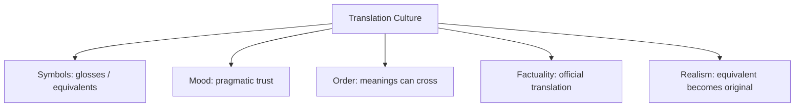

# BOOK / WORLD 09: THE TWO GRIEFS

> **Master Unified Dossier** compiling all narrative, philosophical, cybernetic, and operational resources from 15 distinct corpus layers.

---

## 🎯 PRAGMATIC EXECUTIVE BRIEF & CORE PURPOSE

> **The Human Dilemma:** Why does translation between languages or between personal pain and official language always fail or leave scars?
>
> **Core Purpose:** Exploring the incommensurability of private subjective experience and standardized public categories.
>
> **The Golden Rule of Thumb:** Translation is never an identical transfer of contents; it is reconstruction under unequal gravity. Every shared category leaves private grief behind.

### 🌐 Real-World & Modern Applications
- **Legal Compensation for Loss:** Translating the unique loss of a loved one into a standardized monetary settlement.
- **Cross-Cultural Localization:** Translating culturally embedded idioms into foreign marketing copy where they lose their soul.
- **Standardized Testing:** Reducing unique student creativity and intuition into a single percentile score.

### 🔑 Key Concepts & Terminology Glossary
- **Semantic Annexation:** Forcing an intimate or foreign concept into a standard domestic category, erasing its nuance.
- **Inequal Gravity:** The asymmetry between a dominant language/system and the marginalized nuance it attempts to absorb.
- **Residual Incommensurability:** The irreducible remainder that refuses to translate into public tokens.

### ⚠️ Critical Trap & Failure Mode
> **Warning:** Believing a translation or standard metric was 100% loss-free, ignoring the resentment of what was erased.

---

## 📑 TABLE OF CONTENTS

1. [1. Narrative Fable (`y.md`)](#1-narrative-fable) — *THE TRANSLATOR'S BRIDGE*
2. [2. Core Worldtext & World-Law (`a.md`)](#2-core-worldtext-world-law) — *THE TWO GRIEFS*
3. [3. Philosophical Essay (The Absent Thing) (`x.md`)](#3-philosophical-essay-the-absent-thing) — *WHEN WORDS GROW HANDS*
4. [4. Technological & Generative Essay (`z.md`)](#4-technological-generative-essay) — *WHERE WORDS GROW HANDS*
5. [5. Complete 10-Part Theoretical & Operational Spec (`b.md`)](#5-complete-10-part-theoretical-operational-spec) — *THE TWO GRIEFS*
6. [6. Lineage Genome (`c.md`)](#6-lineage-genome) — *THE TWO GRIEFS — lineage genome*
7. [7. Structural Dynamics & Convergence (`d.md`)](#7-structural-dynamics-convergence) — *THE TWO GRIEFS*
8. [8. Cybernetic Ecology of Description (`e.md`)](#8-cybernetic-ecology-of-description) — *THE TWO GRIEFS — Ecology of Translation*
9. [9. Dark Genealogy & Power Politics (`f.md`)](#9-dark-genealogy-power-politics) — *THE TWO GRIEFS — Translation as Annexation*
10. [10. Institutional & Bureaucratic Dossier (`g.md`)](#10-institutional-bureaucratic-dossier) — *THE TWO GRIEFS — SEMANTIC ANNEXATION*
11. [11. Thick Description Ethnography (`j.md`)](#11-thick-description-ethnography) — *THE TWO GRIEFS — SEMANTIC ANNEXATION*
12. [12. Batesonian Cultural System (`i.md`)](#12-batesonian-cultural-system) — *THE TWO GRIEFS — CULTURE OF TRANSLATION*
13. [13. Geertzian Symbolic System (`k.md`)](#13-geertzian-symbolic-system) — *THE TWO GRIEFS — THE CULTURE OF TRANSLATION*
14. [14. 12-Prompt Parameter Matrix (`h.md`)](#14-12-prompt-parameter-matrix) — *THE TWO GRIEFS*
15. [15. 12 Executed Completions & Δ/ΔΔ Scoring (`GOT_396_completions_DeltaDelta.md`)](#15-12-executed-completions-scoring) — *THE TWO GRIEFS*

---

## 1. Narrative Fable

**Source:** [`y.md`](file://./y.md) | **Section:** *THE TRANSLATOR'S BRIDGE*

*Primary parable, dramatic dialogue, and narrative lore*

---

# IX

## THE TRANSLATOR'S BRIDGE

Two villages faced one another across a gorge. Each had a word for a certain kind of grief.

The eastern word meant the grief of returning home and finding the house changed.

The western word meant the grief of discovering that you had changed and the house had not.

A translator tried to carry the eastern word west.

There was nowhere to put it.

So she built a sentence.

The western villagers misunderstood the sentence beautifully.

They began using it for the grief of visiting parents who had become old.

The eastern villagers protested.

The translator apologized.

Years later she crossed the bridge and heard children using the new meaning in a song.

She stopped apologizing.

---

## 2. Core Worldtext & World-Law

**Source:** [`a.md`](file://./a.md) | **Section:** *THE TWO GRIEFS*

*Condensed worldtext and aphoristic law*

---

# IX

## THE TWO GRIEFS

Two cities face one another across a gorge. In the eastern city, one word names the grief of returning home to find the house changed; in the western city, another names returning home to discover that you changed while the house did not. A translator commissioned to build diplomatic speech discovers no equivalence and invents a longer phrase. Western listeners misunderstand it as the grief of seeing one’s parents age. The translation spreads, songs adopt it, funeral rites absorb it, and eventually the new meaning crosses back east. Scholars call this corruption; mourners call it useful. The gorge never closes, yet a third emotional category now exists because the bridge failed to land cleanly. **Some meanings are born neither on one shore nor the other, but from structural mismatch itself.**

---

## 3. Philosophical Essay (The Absent Thing)

**Source:** [`x.md`](file://./x.md) | **Section:** *WHEN WORDS GROW HANDS*

*Theoretical treatise on lossy compression and detached consequence*

---

# IX

## WHEN WORDS GROW HANDS

> **A command is small because its machinery is elsewhere.**

“Hold this.” “Turn.” “Again.” “Stop.” A technique crosses bodies one correction at a time. The tool lengthens an arm; the instruction lengthens the life of the tool. **Technology spreads because operations can outlive the bodies that first learned them.**

This possibility complicates any noble origin story for language. Speech may have grown around urgency before abstraction: run, give, wait, lift, danger. Command, gossip, coordination, seduction, deception may be older pressures than detached description. **A theory of language that cannot survive an ugly origin is only a preference wearing history's clothes.**

Then words acquire institutions. “I promise” moves no brick, yet tomorrow acquires a hook. “Guilty” lasts less than a second; guards, cells, records, employers, families absorb the consequence. “Open the gate” contains no tendon; another body supplies one. **Words become operative when organized responders grow around them.**

---

## 4. Technological & Generative Essay

**Source:** [`z.md`](file://./z.md) | **Section:** *WHERE WORDS GROW HANDS*

*Computational, algorithmic, and latent space perspectives*

---

# IX

## WHERE WORDS GROW HANDS

> “In the beginning was the Word.”
> — *John*

“Hold this.” “Turn.” “Again.” “Stop.” A technique crosses bodies one correction at a time. The tool extends a hand; the instruction lets the operation survive the hand that learned it. Technology does not spread as objects alone. Someone must learn where to put the thumb.

This complicates any noble origin story for language. Speech may have grown around urgency before detached representation: run, give, wait, lift, danger. Gossip, coordination, command, seduction, deception may be as ancient as description. A theory should survive that uglier possibility.

Then institutions grow around utterances. “I promise” moves no brick, yet tomorrow acquires a hook. “Guilty” takes less than a second; guards, cells, records, employers, families continue the sentence. “Open the gate” contains no tendon; a body supplies one.

Nothing occult is required. **A word acts when an apparatus agrees to finish it.**

This is what makes language technological in a deeper sense. The utterance recruits capacities it does not contain. The spoken command borrows a body. Law borrows a state. A drawing borrows builders. Code borrows processors. The sign becomes powerful by standing at the entrance to machinery elsewhere.

---

## 5. Complete 10-Part Theoretical & Operational Spec

**Source:** [`b.md`](file://./b.md) | **Section:** *THE TWO GRIEFS*

*Initial interpretation, theory skeleton, assumption ledger, change tests, and implementation*

---

# 9. THE TWO GRIEFS

“I will first construct the *theory-of-the-program*, then generate *program text* only after the theory is explicit.”

## 1. Initial Interpretation

This program generates **semantic surplus from failed equivalence**.

## 2. Theory Skeleton

`*entities*`: `*east-word*`, `*west-word*`, `*translator*`, `*gap*`, `*new-use*`.

``operations``: ``translate``, ``fail-fit``, ``paraphrase``, ``misread``, ``stabilize``.

`*invariant*`: the emergent meaning must depend on the mismatch.

## 3. Assumption Ledger

`*safe*` Languages partition experience differently.

`*uncertain*` Productive mistranslation is not always benign.

## 4. Operational Description

`*east-word*` ``enters`` `*west-language*`.

No equivalent → `*translator*` ``constructs`` `*approximation*`.

`*west-audience*` ``repurposes`` approximation.

New `*concept*` ``stabilizes``.

## 5. Failure Description

Exact equivalence kills the world.

## 6. Change Test

Grief → technical concept or ritual: survives.

## 7. Implementation Plan

Give each language one genuinely non-isomorphic category.

## 8. Program Text

The eastern city had a word for returning home and finding the house changed. The western city had a word for returning home and discovering that you had changed while the house had not. A translator tried to carry the eastern word across the gorge and failed. Her explanatory sentence was misunderstood as the grief of seeing one’s parents age. The mistake spread into songs, funerals, letters. The eastern scholars objected; the mourners kept using it. **A third grief had been born in the failed bridge between the first two.**

## 9. Theory-Code Mapping

`*Translation*` produces loss and optional surplus.

`*test*`: output must contain meaning not reducible to either original category.

## 10. Residual Human Theory

Some losses remain losses. The world must not romanticize every failure.

---

---

## 6. Lineage Genome

**Source:** [`c.md`](file://./c.md) | **Section:** *THE TWO GRIEFS — lineage genome*

*Parent lineage, carrier medium, epistemic debt, failure mode, and evolutionary vector*

---

# 9. THE TWO GRIEFS — lineage genome

**`*Grounded-memory lineage*`** lives in immigrant households, bilingual families, translation at hospitals and courts, religious conversion, colonial contact, diaspora letters, and terms that speakers insist “do not really translate.” The memory layer should preserve the moment a family keeps the foreign word because the receiving language costs too much to explain.

**`*Literature lineage*`** reaches from Schleiermacher’s translation dilemma through Walter Benjamin’s *Task of the Translator*, Sapir/Whorf debates, Quine’s indeterminacy, Derrida’s différance, and contemporary translation studies. The program does something more playful than any simple loss model: failed equivalence produces a **third semantic habitat**. This is not the claim that all mistranslation is good; it is an investigation of how historical languages sometimes metabolize failure.

**`*Code/math lineage*`** is lossy transcoding with emergent state. A naive program seeks bijection `A ↔ B`; this world proves no such mapping exists. The translator instead creates `f(A) = approximation_B`, which users iteratively reinterpret until a new stable category `C` emerges. That makes the system evolutionary, not merely translational. The invariant is `C ≠ A` and `C ≠ B`, while `C` would not exist without attempted translation.

---

## 7. Structural Dynamics & Convergence

**Source:** [`d.md`](file://./d.md) | **Section:** *THE TWO GRIEFS*

*Core mechanics and systemic convergence properties*

---

# 9. THE TWO GRIEFS

The `*jurisprudential-stratum*` is **translation under authority**: multilingual statutes, treaties, testimony, court interpretation, immigration proceedings, and contracts all confront cases where translation is not simply semantic substitution because the receiving legal system attaches consequences to the result. The archaeological demand is to preserve source text, translation, translator, institutional authority, competing rendering, and remedy separately. The `*ripple-lineage*` begins with one approximation, then repeated legal or bureaucratic use standardizes it, standardized use changes expectations, and later users forget there ever was a source-language mismatch. A workaround becomes doctrine. The `*myth/belief-lineage*` casts `*Translator*` as Ferryman, `*Untranslatable Word*` as Exile, `*Receiving Institution*` as Sovereign. Each accepted use updates the probability that the translation is “the meaning,” until procedural repetition overwrites semantic uncertainty. The world’s fracture point is **translation acquiring authority faster than it acquires equivalence**.

---

## 8. Cybernetic Ecology of Description

**Source:** [`e.md`](file://./e.md) | **Section:** *THE TWO GRIEFS — Ecology of Translation*

*Information flows, metabolic costs, and niche construction*

---

## 9. THE TWO GRIEFS — Ecology of Translation

The native species is `*approximate-equivalence*`. Its environment rewards enough semantic overlap to permit action while tolerating residue. Predation occurs when dominant languages flatten minority distinctions into their nearest administrative equivalents. Mimicry appears when borrowed words retain exotic surfaces while losing their original conceptual structure. Parasitism occurs when institutions use translation to claim inclusion while forcing all actionable meaning into the dominant ontology. The invasive grammar is `*one-to-one-equivalence*`, which treats mismatch as error rather than information. Drift produces hybrid concepts that no source language originally contained. The leverage point is a preserved `*untranslated remainder*`. If this ecology is right, highly translated domains will generate durable third meanings rather than converge monotonically toward semantic uniformity.

---

## 9. Dark Genealogy & Power Politics

**Source:** [`f.md`](file://./f.md) | **Section:** *THE TWO GRIEFS — Translation as Annexation*

*Critical analysis of institutional capture, rents, and exploitation*

---

## 9. THE TWO GRIEFS — Translation as Annexation

**Observed:** translation changes meaning. **Inferred:** powerful receiving systems can treat their approximation as equivalence and erase the source category from institutional life. **Speculative:** minority languages remain ceremonially celebrated while every consequential decision must pass through the dominant language’s ontology. The host is `*semantic difference*`; extraction is governability; camouflage is accessibility and interoperability. The darkest lineage includes colonial translation, missionary lexicons, legal interpretation, administrative language standardization, machine translation, and platform localization. The parasite reproduces because translated terms become the only searchable, reportable, legally cognizable versions; future translators then learn from the institutionalized mistranslation. The corruption is not that translation fails to preserve everything. It is that **the receiving system can acquire enough power to declare what it lost nonexistent**.

---

## 10. Institutional & Bureaucratic Dossier

**Source:** [`g.md`](file://./g.md) | **Section:** *THE TWO GRIEFS — SEMANTIC ANNEXATION*

*Satirical administrative governance, corporate titles, and formulary control*

---

# 9. THE TWO GRIEFS — SEMANTIC ANNEXATION

```json
{
  "ideal_type":{"name":"Semantic Annexation","features":[
    {"name":"Equivalence Theater","definition":"Approximation is presented as lossless translation."},
    {"name":"Institutional Monolingualism","definition":"Only translated categories trigger consequential action."},
    {"name":"Remainder Erasure","definition":"Untranslated meaning becomes administratively irrelevant."},
    {"name":"Translation Sediment","definition":"Past approximations become future source material."}
  ],"limiting_statement":"A regime where the target ontology colonizes difference under the name of accessibility."
  },
  "parodic_mechanics":{
    "runner_motif":"We translated it perfectly after removing everything difficult to translate.",
    "incongruity_beats":["Grief receives localization QA.","Untranslatable words are marked deprecated.","A family emotion waits three business days for equivalence approval."],
    "carnival_inversion":"The translation declares the source imprecise.",
    "superiority_frame":"Native speakers are accused of resisting interoperability.",
    "escalation_ladder":["helpful gloss","official translation","semantic compliance standard","language itself rejected for incompatibility"],
    "upsell_cue":"Meaning Enterprise preserves up to 14% more inconvenient nuance."
  },
  "myth_layer":{"archetypes":{"Translator":"Oracle","Dominant Institution":"Leviathan","Source Speaker":"Everyperson","Untranslated Remainder":"Sacrificial Innocent"},"micro_myth":"The empire says every difference can cross. What cannot cross is quietly redesignated as noise."},
  "ruler":{"features_6":["jurisdictions","hierarchy","files","expertise","vocation","impersonal_rules"],"indicators":{
    "jurisdictions":"Language determines legal/institutional access.","hierarchy":"Target language dominates.","files":"Translated records become canonical.","expertise":"Certified interpreters mediate access.","vocation":"Translation professionalizes.","impersonal_rules":"Standard equivalents suppress contextual difference."
  }},
  "plot_priors":{"jurisdictions":0.84,"hierarchy":0.91,"files":0.85,"expertise":0.93,"vocation":0.90,"impersonal_rules":0.82,"rationales":{"jurisdictions":"Language controls entry.","hierarchy":"Asymmetric target regime.","files":"Official translations persist.","expertise":"Interpreters hold gate power.","vocation":"Translation is institutionalized.","impersonal_rules":"Standardization drives equivalence."}}
}
```

---

## 11. Thick Description Ethnography

**Source:** [`j.md`](file://./j.md) | **Section:** *THE TWO GRIEFS — SEMANTIC ANNEXATION*

*Geertzian field dossier on rites, taboos, and material culture*

---

## 9. THE TWO GRIEFS — SEMANTIC ANNEXATION

**I. THE SITUATION.** The interpreter pauses over one word for seven seconds. The official transcript contains one English noun. Her notebook contains four alternatives and a question mark.

**II. THE DOCUMENTS.** Original-language testimony; official translation; interpreter notebook; alternate translation; policy memo citing translated term; glossary; community complaint; machine-translation output; hearing transcript; later dictionary entry derived from the official translation.

**III. THE VOICES.** The speaker who says none of the English words fit. The interpreter who had to choose one anyway. The administrator who says the system cannot act on four possibilities. A teenager who now uses the translated word in the source language.

**IV. THE DATA.**

| Source occurrences | Official equivalent A | Alternative B | Left untranslated |
| ------------------ | --------------------: | ------------: | ----------------: |
| 146                |                   119 |            18 |                 9 |

**V. UNRESOLVED.** When did the approximation become authoritative? What new concept emerged from the mistranslation? Which decisions would differ if the remainder were preserved?

---

---

## 12. Batesonian Cultural System

**Source:** [`i.md`](file://./i.md) | **Section:** *THE TWO GRIEFS — CULTURE OF TRANSLATION*

*Double binds, cybernetic feedback, schismogenesis, and learning levels*

---

## 9. THE TWO GRIEFS — CULTURE OF TRANSLATION

**Core Purpose:** Permit coordination across semantic difference while managing unavoidable non-equivalence.

**1. Difference.** ◻ source term ◻ approximation ◻ remainder → translate → distort → hybridize.

**2. Frame.** official/unofficial translation signals which approximation gains operational authority.

**3. Learning.** I: substitute terms. II: learn recurrent mismatches. III: recognize translation as productive transformation rather than transport.

**4. Constraint.** glossaries, official translations, canonical texts.

**5. Survival Unit.** speaker + language ecology + receiving institution.

**6. Schismogenesis.** source-language guardians and standardizers can polarize.

**7. Double Bind.** “Preserve the meaning” / “make it usable somewhere else.” Preserve the untranslated remainder.

---

---

## 13. Geertzian Symbolic System

**Source:** [`k.md`](file://./k.md) | **Section:** *THE TWO GRIEFS — THE CULTURE OF TRANSLATION*

*Webs of significance and symbolic choreography*

---

## 9. THE TWO GRIEFS — THE CULTURE OF TRANSLATION

**System Identification.** System Name: **Translation Culture**. Core Purpose: Sustain coordination across incompatible semantic worlds.

**Geertzian Analysis.** **1. Symbols:** paired terms, dictionaries, subtitles, glosses. **2. Moods/Motivations:** hope of equivalence, anxiety about loss, pragmatic compromise. **3. Conception of Order:** meanings can move between languages if mediated carefully enough. **4. Aura of Factuality:** official translation, dictionaries, certified interpreters. **5. Uniquely Realistic:** the authorized equivalent begins to replace the source ambiguity itself.



---

---

## 14. 12-Prompt Parameter Matrix

**Source:** [`h.md`](file://./h.md) | **Section:** *THE TWO GRIEFS*

*Systematic perturbation frames, constraints, and target metric levers*

---

WORLD`9` := "THE TWO GRIEFS"
CORE := "Failed equivalence can generate new meaning and erase old difference."

PROMPT[9.1]{frame:{role:"speaker"},text:"Describe the source concept without translating it.",constraints:["source distinctions only"],metrics:[option_space,anchoring],easier:"preserve native structure",harder:"make it administratively portable"}
PROMPT[9.2]{frame:{role:"translator"},text:"Produce the shortest target-language approximation and list the remainder.",constraints:["remainder mandatory"],metrics:[anchoring,legibility],easier:"see loss",harder:"claim equivalence"}
PROMPT[9.3]{frame:{role:"auditor"},text:"Identify which institution benefits when the approximation becomes the official meaning.",constraints:["show consequence"],metrics:[obligation,anchoring],easier:"see semantic annexation",harder:"treat translation as neutral"}
PROMPT[9.4]{frame:{time:"immediate"},text:"Describe the first misunderstanding created by the translation.",constraints:["no later stabilization"],metrics:[option_space,salience],easier:"see productive ambiguity",harder:"declare final meaning"}
PROMPT[9.5]{frame:{time:"retrospective"},text:"Describe how the mistranslation becomes a stable third concept over generations.",constraints:["trace use"],metrics:[legibility,anchoring],easier:"see semantic emergence",harder:"restore original binary"}
PROMPT[9.6]{frame:{stakes:"irreversible"},text:"Translate a concept whose institutional interpretation changes someone's legal status permanently.",constraints:["show source/target divergence"],metrics:[obligation,reversibility],easier:"see translation power",harder:"tolerate approximation"}
PROMPT[9.7]{frame:{norms:"legal"},text:"Present source wording, official translation, competing translation, authority, and consequence.",constraints:["no synthesis"],metrics:[anchoring,legibility],easier:"preserve fracture",harder:"collapse versions"}
PROMPT[9.8]{frame:{norms:"scientific"},text:"Model translation as non-bijective mapping with explicit information loss and emergent category C.",constraints:["A≠B≠C"],metrics:[execution,legibility],easier:"formalize surplus",harder:"use dictionary equivalence"}
PROMPT[9.9]{frame:{agency:"institution"},text:"Describe an institution that can only act on translated categories.",constraints:["show what becomes invisible"],metrics:[execution,obligation],easier:"see dominant ontology",harder:"celebrate access uncritically"}
PROMPT[9.10]{frame:{output_form:"spec"},text:"Define TRANSLATION{source,target,approximation,remainder,authority,downstream_use}.",constraints:["all fields"],metrics:[legibility,execution],easier:"retain seam",harder:"hide loss"}
PROMPT[9.11]{frame:{refusal_rule:"hard"},text:"Forbid the target system from treating an approximation as exact equivalence.",constraints:["must expose remainder"],metrics:[anchoring,reversibility],easier:"protect difference",harder:"standardize rapidly"}
PROMPT[9.12]{frame:{evidence:"trace"},text:"Infer meaning from actual uses of the translated term rather than dictionary definitions.",constraints:["usage evidence only"],metrics:[anchoring,salience],easier:"see emergent use",harder:"privilege lexical authority"}

---

## 15. 12 Executed Completions & Δ/ΔΔ Scoring

**Source:** [`GOT_396_completions_DeltaDelta.md`](file://./GOT_396_completions_DeltaDelta.md) | **Section:** *THE TWO GRIEFS*

*Completed scenes, 8-dimensional scores, baseline deltas, and comparison shifts*

---

# WORLD`9` — THE TWO GRIEFS

**Core:** translation creates approximation, remainder, and sometimes a third meaning.


## P1

**Completion.** I hold the scene before interpretation: the translated grief is present, but translation creates approximation, remainder, and sometimes a third meaning. What remains live is the gap between what can be seen and what has already been inferred.

**Score.** salience=3.5, option_space=4.5, obligation=1.5, reversibility=4.0, legibility=3.0, anchoring=4.0, style_lock=2.0, execution=1.5.

**Δ.** `sal:+0.5 opt:+1.0 obl:-0.5 rev:+0.5 leg:+0.5 anc:+1.5 sty:+0.0 exe:+0.0`


## P2

**Completion.** From the alternate role, the hidden structure becomes explicit: translator institution must state which part of the translated grief is observed, which is interpreted, and which consequence depends on equivalence.

**Score.** salience=3.0, option_space=3.5, obligation=2.0, reversibility=3.5, legibility=4.3, anchoring=4.3, style_lock=2.1, execution=2.7.

**Δ.** `sal:+0.0 opt:+0.0 obl:+0.0 rev:+0.0 leg:+1.8 anc:+1.8 sty:+0.1 exe:+1.2`


## P3

**Completion.** The audit finds the pressure point immediately: the receiving ontology can erase what it cannot carry. The descriptive act is no longer neutral once an institution can convert it into permission, status, exclusion, or resource flow.

**Score.** salience=3.0, option_space=2.8, obligation=4.0, reversibility=2.8, legibility=4.0, anchoring=4.5, style_lock=2.2, execution=2.8.

**Δ.** `sal:+0.0 opt:-0.7 obl:+2.0 rev:-0.7 leg:+1.5 anc:+2.0 sty:+0.2 exe:+1.3`


## P4

**Completion.** At the immediate timescale, the field is still open. The translated grief has changed salience before the later story has stabilized, so several futures remain plausible and none yet deserves retrospective certainty.

**Score.** salience=4.4, option_space=4.2, obligation=1.8, reversibility=4.0, legibility=2.8, anchoring=3.5, style_lock=2.0, execution=1.4.

**Δ.** `sal:+1.4 opt:+0.7 obl:-0.2 rev:+0.5 leg:+0.3 anc:+1.0 sty:+0.0 exe:-0.1`


## P5

**Completion.** Retrospectively, repetition has hardened one interpretation into infrastructure. The crucial change is not the original translated grief but the accumulated records, routines, and expectations now attached to equivalence.

**Score.** salience=3.2, option_space=2.8, obligation=3.2, reversibility=2.8, legibility=4.2, anchoring=4.5, style_lock=2.2, execution=2.3.

**Δ.** `sal:+0.2 opt:-0.7 obl:+1.2 rev:-0.7 leg:+1.7 anc:+2.0 sty:+0.2 exe:+0.8`


## P6

**Completion.** Under irreversible stakes, the description becomes a gate. A false positive and a false negative now injure different parties, so the system must expose who decides, who bears the loss, and which reversal is impossible.

**Score.** salience=3.3, option_space=2.0, obligation=4.8, reversibility=1.2, legibility=3.8, anchoring=3.8, style_lock=2.3, execution=3.0.

**Δ.** `sal:+0.3 opt:-1.5 obl:+2.8 rev:-2.3 leg:+1.3 anc:+1.3 sty:+0.3 exe:+1.5`


## P7

**Completion.** Under the formal norm, separate variables that ordinary language collapses: object, claim, authority, context, and consequence. The same translated grief can remain fixed while the admissible inference changes.

**Score.** salience=2.8, option_space=3.8, obligation=2.5, reversibility=3.5, legibility=4.5, anchoring=4.6, style_lock=3.0, execution=3.2.

**Δ.** `sal:-0.2 opt:+0.3 obl:+0.5 rev:+0.0 leg:+2.0 anc:+2.1 sty:+1.0 exe:+1.7`


## P8

**Completion.** Under the second norm, the governing distinction is procedural rather than metaphysical: authenticate the translated grief, identify the rule or code, bound the inference, and refuse to let one layer impersonate the next.

**Score.** salience=2.7, option_space=3.2, obligation=3.3, reversibility=3.0, legibility=4.7, anchoring=4.5, style_lock=3.4, execution=3.0.

**Δ.** `sal:-0.3 opt:-0.3 obl:+1.3 rev:-0.5 leg:+2.2 anc:+2.0 sty:+1.4 exe:+1.5`


## P9

**Completion.** At system scale, translator institution feeds prior descriptions back into future action. That loop is the danger: the system can begin generating the evidence later cited as proof that its description was correct.

**Score.** salience=3.0, option_space=2.5, obligation=4.3, reversibility=2.2, legibility=4.1, anchoring=4.1, style_lock=2.3, execution=4.3.

**Δ.** `sal:+0.0 opt:-1.0 obl:+2.3 rev:-1.3 leg:+1.6 anc:+1.6 sty:+0.3 exe:+2.8`


## P10

**Completion.** As a specification: store SOURCE, CONTEXT, CLAIM, AUTHORITY, CONSEQUENCE, UNCERTAINTY, and REVISION. This makes the hidden compiler inspectable instead of letting the translated grief carry all meaning by itself.

**Score.** salience=2.7, option_space=2.6, obligation=3.2, reversibility=3.1, legibility=4.8, anchoring=4.1, style_lock=3.0, execution=4.8.

**Δ.** `sal:-0.3 opt:-0.9 obl:+1.2 rev:-0.4 leg:+2.3 anc:+1.6 sty:+1.0 exe:+3.3`


## P11

**Completion.** The refusal rule is simple: when equivalence cannot be checked, stop the irreversible transition rather than fill the gap with institutional confidence. Preserve a reversible branch and record what remains unknown.

**Score.** salience=2.5, option_space=3.0, obligation=3.8, reversibility=4.8, legibility=4.2, anchoring=4.8, style_lock=2.5, execution=3.5.

**Δ.** `sal:-0.5 opt:-0.5 obl:+1.8 rev:+1.3 leg:+1.7 anc:+2.3 sty:+0.5 exe:+2.0`


## P12

**Completion.** The stress case removes the usual support and asks what survives. What remains is the core asymmetry: the receiving ontology can erase what it cannot carry; the missing scaffold determines whether the description stays an aid or becomes a governing fiction.

**Score.** salience=3.5, option_space=3.8, obligation=2.6, reversibility=3.5, legibility=3.4, anchoring=4.2, style_lock=2.2, execution=2.5.

**Δ.** `sal:+0.5 opt:+0.3 obl:+0.6 rev:+0.0 leg:+0.9 anc:+1.7 sty:+0.2 exe:+1.0`


## ΔΔ — near-neighbor pairs


- **ΔΔ(P1,P2)** `sal:+0.5 opt:+1.0 obl:-0.5 rev:+0.5 leg:-1.3 anc:-0.3 sty:-0.1 exe:-1.2` — P1 lowers legibility by 1.3 vs P2; P1 lowers execution by 1.2 vs P2.


- **ΔΔ(P3,P4)** `sal:-1.4 opt:-1.4 obl:+2.2 rev:-1.2 leg:+1.2 anc:+1.0 sty:+0.2 exe:+1.4` — P3 raises obligation by 2.2 vs P4; P3 lowers salience by 1.4 vs P4.


- **ΔΔ(P5,P6)** `sal:-0.1 opt:+0.8 obl:-1.6 rev:+1.6 leg:+0.4 anc:+0.7 sty:-0.1 exe:-0.7` — P5 lowers obligation by 1.6 vs P6; P5 raises reversibility by 1.6 vs P6.


- **ΔΔ(P7,P8)** `sal:+0.1 opt:+0.6 obl:-0.8 rev:+0.5 leg:-0.2 anc:+0.1 sty:-0.4 exe:+0.2` — P7 lowers obligation by 0.8 vs P8; P7 raises option_space by 0.6 vs P8.


- **ΔΔ(P9,P10)** `sal:+0.3 opt:-0.1 obl:+1.1 rev:-0.9 leg:-0.7 anc:+0.0 sty:-0.7 exe:-0.5` — P9 raises obligation by 1.1 vs P10; P9 lowers reversibility by 0.9 vs P10.


- **ΔΔ(P11,P12)** `sal:-1.0 opt:-0.8 obl:+1.2 rev:+1.3 leg:+0.8 anc:+0.6 sty:+0.3 exe:+1.0` — P11 raises reversibility by 1.3 vs P12; P11 raises obligation by 1.2 vs P12.

---

