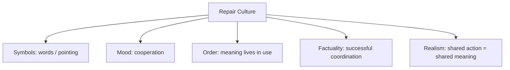

# BOOK / WORLD 10: THE COMMON BIRD

> **Master Unified Dossier** compiling all narrative, philosophical, cybernetic, and operational resources from 15 distinct corpus layers.

---

## 🎯 PRAGMATIC EXECUTIVE BRIEF & CORE PURPOSE

> **The Human Dilemma:** How do people coordinate around generic words like 'bird' or 'house' when everyone pictures something slightly different?
>
> **Core Purpose:** Examining cognitive prototypes, generic naming, and the secret social pacts that enable coordination.
>
> **The Golden Rule of Thumb:** Language works not because our mental images match, but because we agree to ignore our differences long enough to get work done.

### 🌐 Real-World & Modern Applications
- **Interface Design & Protocols:** Two microservices communicating via JSON contracts without needing identical internal architectures.
- **Legal Contracts:** Business partners agreeing on 'good faith efforts' without having identical philosophies of morality.
- **Design Systems:** A 'Button' component that looks acceptable across 50 distinct screens without perfectly fitting any single one.

### 🔑 Key Concepts & Terminology Glossary
- **Coordinative Equivalence:** Treating different internal mental models as identical for the pragmatic purpose of completing a task.
- **Prototype Flattening:** Using a generic archetype (a robin) to represent an entire sprawling biological class.
- **Alignment Theater:** Pretending full consensus exists when in reality only a functional tolerance threshold was met.

### ⚠️ Critical Trap & Failure Mode
> **Warning:** Demanding 100% philosophical agreement before allowing practical collaboration to proceed.

---

## 📑 TABLE OF CONTENTS

1. [1. Narrative Fable (`y.md`)](#1-narrative-fable) — *THE TWO RED BIRDS*
2. [2. Core Worldtext & World-Law (`a.md`)](#2-core-worldtext-world-law) — *THE COMMON BIRD*
3. [3. Philosophical Essay (The Absent Thing) (`x.md`)](#3-philosophical-essay-the-absent-thing) — *THE LEVER*
4. [4. Technological & Generative Essay (`z.md`)](#4-technological-generative-essay) — *THE LEVER*
5. [5. Complete 10-Part Theoretical & Operational Spec (`b.md`)](#5-complete-10-part-theoretical-operational-spec) — *THE COMMON BIRD*
6. [6. Lineage Genome (`c.md`)](#6-lineage-genome) — *THE COMMON BIRD — lineage genome*
7. [7. Structural Dynamics & Convergence (`d.md`)](#7-structural-dynamics-convergence) — *THE COMMON BIRD*
8. [8. Cybernetic Ecology of Description (`e.md`)](#8-cybernetic-ecology-of-description) — *THE COMMON BIRD — Ecology of Coordination*
9. [9. Dark Genealogy & Power Politics (`f.md`)](#9-dark-genealogy-power-politics) — *THE COMMON BIRD — Consensus Theater*
10. [10. Institutional & Bureaucratic Dossier (`g.md`)](#10-institutional-bureaucratic-dossier) — *THE COMMON BIRD — ALIGNMENT THEATER*
11. [11. Thick Description Ethnography (`j.md`)](#11-thick-description-ethnography) — *THE COMMON BIRD — ALIGNMENT THEATER*
12. [12. Batesonian Cultural System (`i.md`)](#12-batesonian-cultural-system) — *THE COMMON BIRD — CULTURE OF REPAIR*
13. [13. Geertzian Symbolic System (`k.md`)](#13-geertzian-symbolic-system) — *THE COMMON BIRD — THE CULTURE OF COORDINATION*
14. [14. 12-Prompt Parameter Matrix (`h.md`)](#14-12-prompt-parameter-matrix) — *THE COMMON BIRD*
15. [15. 12 Executed Completions & Δ/ΔΔ Scoring (`GOT_396_completions_DeltaDelta.md`)](#15-12-executed-completions-scoring) — *THE COMMON BIRD*

---

## 1. Narrative Fable

**Source:** [`y.md`](file://./y.md) | **Section:** *THE TWO RED BIRDS*

*Primary parable, dramatic dialogue, and narrative lore*

---

# X

## THE TWO RED BIRDS

A man said to his friend, “A red bird is on the wall.”

The friend looked and nodded.

“Exactly that red?” the man asked.

The friend shrugged.

“Exactly that size?”

Another shrug.

“Exactly the bird I mean?”

The friend picked up a stone and threw it near the bird. The bird flew away.

“There,” he said. “That one.”

The first man became irritated. He wanted certainty.

His friend wanted to finish lunch.

The bird did not care whether their inner birds matched.

---

## 2. Core Worldtext & World-Law

**Source:** [`a.md`](file://./a.md) | **Section:** *THE COMMON BIRD*

*Condensed worldtext and aphoristic law*

---

# X

## THE COMMON BIRD

The Common Bird lives in a society obsessed with verifying private perception. Couples must certify that colors match before marriage; witnesses compare internal images before testifying; schools teach children to doubt any word whose mental content cannot be inspected. Daily life nearly stops. One afternoon two workers disagree over the exact red of a bird on a wall. A third throws a pebble nearby; both point to the same fleeing animal. The government reluctantly accepts a new standard called Coordinated Sufficiency: people need not possess identical inner representations if they can reliably act toward the same public object. The bird becomes the emblem of an epistemic revolution. **Understanding is downgraded from perfect internal duplication to successful coordination across an irreducible gap.**

---

## 3. Philosophical Essay (The Absent Thing)

**Source:** [`x.md`](file://./x.md) | **Section:** *THE LEVER*

*Theoretical treatise on lossy compression and detached consequence*

---

# X

## THE LEVER

> **The shorter the command, the easier it becomes to forget the machine behind it.**

A law recruits courts. A blueprint recruits carpenters. A function recruits current. A prompt recruits models, datasets, interfaces, conventions, hidden labor. The sign grows smaller while the machinery behind it grows larger. **One history of technology is the fastening of larger levers to smaller signs.**

High leverage deserves no moral halo. A surgical button and a gun trigger both compress large consequences into tiny motions. The important question is not how much world a sign can move, but what hidden apparatus grants it that power. **Causal leverage and moral legitimacy are different measurements.**

Traditional programming tried to reduce ambiguity before execution. Miss the bracket and nothing happens. Generative systems accept *warm*, *ominous*, *generous* and fill hundreds of missing parameters. **The machine becomes useful precisely where the human stops specifying.**

---

## 4. Technological & Generative Essay

**Source:** [`z.md`](file://./z.md) | **Section:** *THE LEVER*

*Computational, algorithmic, and latent space perspectives*

---

# X

## THE LEVER

> “Give me a place to stand, and I will move the earth.”
> — Archimedes, traditionally attributed

A law recruits courts. A drawing recruits contractors. Code recruits electricity. A prompt recruits models, software, datasets, camera conventions, architectural precedents, industrial computing, hidden labor. The user types six words. The infrastructure does not.

**The history of technology is partly a history of fastening longer levers to shorter utterances.**

This explains a peculiar vanity in contemporary authorship. We type “glass tower at dusk,” receive an elaborate image, and speak as though the phrase contained the tower. The elevator passenger has begun accepting awards for vertical transportation.

Causal leverage and authorship are not the same. Neither are leverage and wisdom. A surgical button and a gun trigger both compress large physical sequences into small motions. The ease of issuing the command tells us nothing about whether the command deserves the machinery attached to it.

The shorter the control surface becomes, the easier it is to forget everything behind it. This is one reason technological interfaces feel magical. Their success consists partly in hiding the labor required to make obedience look simple.

---

## 5. Complete 10-Part Theoretical & Operational Spec

**Source:** [`b.md`](file://./b.md) | **Section:** *THE COMMON BIRD*

*Initial interpretation, theory skeleton, assumption ledger, change tests, and implementation*

---

# 10. THE COMMON BIRD

“I will first construct the *theory-of-the-program*, then generate *program text* only after the theory is explicit.”

## 1. Initial Interpretation

The problem is whether communication requires identical internal representations.

## 2. Theory Skeleton

`*entities*`: `*speaker*`, `*listener*`, `*bird*`, `*private-model-A*`, `*private-model-B*`, `*public-action*`.

``operations``: ``name``, ``construct-internally``, ``point``, ``correct``, ``coordinate``.

`*invariant*`: private models remain unverifiable.

## 3. Assumption Ledger

`*safe*` Shared action does not require identical qualia.

## 4. Operational Description

`*speaker*` ``utters`` “red bird”.

`*listener*` ``constructs`` private representation.

Both ``orient-to`` same bird.

Successful action ``licenses`` practical understanding.

## 5. Failure Description

If mental states become directly comparable, the conceptual pressure disappears.

## 6. Change Test

Bird → tool, route, legal referent: survives.

## 7. Implementation Plan

Make a culture so obsessed with mental sameness that mundane coordination becomes revolutionary.

## 8. Program Text

Two men saw a red bird on a wall. One demanded to know whether the other saw exactly his red, his size, his bird. The second man shrugged, tossed a pebble near the wall, and both watched the same animal fly. “That one,” he said. The first man remained dissatisfied because he wanted identical experience. The second returned to lunch because he wanted successful reference. **The bird exposed a quiet bargain beneath language: we rarely prove that our inner worlds match; we discover whether they overlap enough to go on.**

## 9. Theory-Code Mapping

`*PrivateModel*` stays hidden.

`[coordinate()]` is observable.

`*test*` passes on successful joint action.

## 10. Residual Human Theory

Operational agreement can hide profound conceptual disagreement.

---

---

## 6. Lineage Genome

**Source:** [`c.md`](file://./c.md) | **Section:** *THE COMMON BIRD — lineage genome*

*Parent lineage, carrier medium, epistemic debt, failure mode, and evolutionary vector*

---

# 10. THE COMMON BIRD — lineage genome

**`*Grounded-memory lineage*`** is ordinary deictic repair: “that one,” “no, the other one,” pointing across tables, teaching object names, correcting children, workers coordinating around tools, and travelers agreeing on landmarks without comparing private mental imagery.

**`*Literature lineage*`** joins Wittgenstein’s attack on private-language pictures, Gricean pragmatics, joint-attention research, and pragmatist accounts of meaning through successful action. Tomasello’s shared intentionality is especially close: communicators coordinate around information and common ground without requiring introspective access to one another’s representations. ([PubMed Central (PMC)]`8`)

**`*Code/math lineage*`** is distributed systems consensus under incomplete state replication. Two nodes need not maintain bitwise-identical internal representations if they can agree on a referent strongly enough to coordinate operations. The formal ancestor is not “shared memory” but **eventual practical consistency**. `PrivateModel_A` and `PrivateModel_B` remain inaccessible; `[joint_reference]` is tested through behavior. The failure scenario is beautiful: maximize internal verification until communication becomes impossible. The world discovers that perfect epistemic synchronization is overkill for many tasks.

---

## 7. Structural Dynamics & Convergence

**Source:** [`d.md`](file://./d.md) | **Section:** *THE COMMON BIRD*

*Core mechanics and systemic convergence properties*

---

# 10. THE COMMON BIRD

The `*jurisprudential-stratum*` is **public reference despite private disagreement**. Legal institutions could not function if contracts, statutes, testimony, and commands required proof that every participant entertained identical internal representations. Law instead builds public tests: reasonable meaning, objective manifestation, shared referents, observable conduct. The `*ripple-lineage*` begins with practical coordination, becomes standardized terminology, then generates interpretive communities and finally institutions that decide disagreements without access to anyone’s private bird. The risk appears when public operational agreement is mistaken for genuine conceptual unity. The `*myth/belief-lineage*` casts `*Bird*` as Common Object, `*Two Minds*` as Sealed Kingdoms, `*Pointing Gesture*` as Treaty. Its belief update is modest but profound: successful coordination raises confidence in shared reference while leaving private identity unresolved. The world naturalizes neither subjectivity nor objectivity; it naturalizes **repair**.

---

## 8. Cybernetic Ecology of Description

**Source:** [`e.md`](file://./e.md) | **Section:** *THE COMMON BIRD — Ecology of Coordination*

*Information flows, metabolic costs, and niche construction*

---

## 10. THE COMMON BIRD — Ecology of Coordination

The native species is `*repairable-reference*`: “that,” “no, that one,” correction, pointing, rephrasing. Selection pressure is successful coordination at low cognitive cost. Predation comes from `*verification-maximalism*`, which demands impossible proof of identical inner representation. Mimicry appears when apparent agreement hides incompatible practical models. Parasitism occurs when institutions exploit superficial consensus to claim deeper agreement than exists. The invasive grammar is `*internal-state-description*`, which attempts to settle communication by speculating about hidden mental sameness. Drift favors public operational criteria because they are cheaper to test. The leverage point is keeping ``correction`` cheap and socially permissible. If this ecology is right, communities with strong correction norms will coordinate effectively despite heterogeneous internal models, while communities that punish repair will mistake politeness for understanding.

---

## 9. Dark Genealogy & Power Politics

**Source:** [`f.md`](file://./f.md) | **Section:** *THE COMMON BIRD — Consensus Theater*

*Critical analysis of institutional capture, rents, and exploitation*

---

## 10. THE COMMON BIRD — Consensus Theater

**Observed:** practical coordination can occur without identical understanding. **Inferred:** institutions can exploit this fact to manufacture the appearance of consensus. Everyone points at the same deliverable, policy, metric, or slogan while privately inhabiting incompatible models. **Speculative:** organizations optimize for visible coordination while unresolved conceptual disagreements compound beneath the surface until failure. The host is `*tolerance-for-ambiguity*`; extraction is premature consensus; camouflage is alignment. Its dark lineage includes diplomatic euphemism, corporate strategy language, coalition politics, standards committees, requirements documents, and AI alignment rhetoric. The parasite feeds on “close enough,” then quietly raises the stakes after agreement has already been declared. The failure is noncommutative: `*same words* → *different private models* → *apparently coordinated action*` works until a later branch requires the hidden models to coincide. Then the common bird splits into several species at once.

---

## 10. Institutional & Bureaucratic Dossier

**Source:** [`g.md`](file://./g.md) | **Section:** *THE COMMON BIRD — ALIGNMENT THEATER*

*Satirical administrative governance, corporate titles, and formulary control*

---

# 10. THE COMMON BIRD — ALIGNMENT THEATER

```json
{
  "ideal_type":{"name":"Alignment Theater","features":[
    {"name":"Visible Agreement","definition":"Shared gestures conceal incompatible internal models."},
    {"name":"Repair Suppression","definition":"Correction threatens the appearance of consensus."},
    {"name":"Ambiguity Debt","definition":"Unresolved differences surface only at later branches."},
    {"name":"Consensus Prestige","definition":"Organizations reward appearing aligned before becoming aligned."}
  ],"limiting_statement":"A limiting organizational type where coordination is optimized while semantic divergence silently compounds."
  },
  "parodic_mechanics":{
    "runner_motif":"We are completely aligned on what 'red bird' means strategically.",
    "incongruity_beats":["Teams sign semantic alignment certificates.","Meetings ban clarification for momentum.","Three departments ship different birds under one OKR."],
    "carnival_inversion":"Misunderstanding becomes evidence of cross-functional autonomy.",
    "superiority_frame":"Clarifying questions are dismissed as low-velocity thinking.",
    "escalation_ladder":["shared slogan","alignment workshop","semantic freeze","company executes mutually exclusive definitions at scale"],
    "upsell_cue":"Alignment Pro automatically removes disagreement from meeting transcripts."
  },
  "myth_layer":{"archetypes":{"Strategy Deck":"Oracle","Executive":"Leviathan","Worker":"Everyperson","Clarifier":"Trickster"},"micro_myth":"The organization confuses moving together with seeing the same destination. Agreement survives until the road forks."},
  "ruler":{"features_6":["jurisdictions","hierarchy","files","expertise","vocation","impersonal_rules"],"indicators":{
    "jurisdictions":"Teams own separate interpretations.","hierarchy":"Leadership pronounces canonical language.","files":"Decks preserve apparent consensus.","expertise":"Facilitators manage semantic conflict.","vocation":"Alignment becomes organizational labor.","impersonal_rules":"Shared terminology becomes procedural requirement."
  }},
  "plot_priors":{"jurisdictions":0.70,"hierarchy":0.83,"files":0.80,"expertise":0.67,"vocation":0.65,"impersonal_rules":0.72,"rationales":{"jurisdictions":"Meaning fragments by function.","hierarchy":"Leaders stabilize wording.","files":"Consensus lives in artifacts.","expertise":"Specialists mediate.","vocation":"Alignment work emerges.","impersonal_rules":"Terms become standardized."}}
}
```

---

## 11. Thick Description Ethnography

**Source:** [`j.md`](file://./j.md) | **Section:** *THE COMMON BIRD — ALIGNMENT THEATER*

*Geertzian field dossier on rites, taboos, and material culture*

---

## 10. THE COMMON BIRD — ALIGNMENT THEATER

**I. THE SITUATION.** Three teams leave the meeting agreeing on “red bird.” By Friday they have built three incompatible things.

**II. THE DOCUMENTS.** Strategy deck; meeting transcript; whiteboard photo; engineering spec; marketing brief; design prototype; Slack clarification thread; launch checklist; executive email declaring alignment; postmortem.

**III. THE VOICES.** The executive saying, “Everyone nodded.” The engineer who thought red meant priority. The designer who thought it meant literal color. The marketer who thought bird was the customer archetype.

**IV. THE DATA.**

| Team        | Meaning of “red” | Meaning of “bird” | Deliverable  |
| ----------- | ---------------- | ----------------- | ------------ |
| Engineering | urgent           | event object      | alert system |
| Design      | color            | icon              | visual motif |
| Marketing   | premium          | customer segment  | campaign     |

**V. UNRESOLVED.** When did apparent agreement become expensive? Why did nobody repair the ambiguity in the room? Which organizational norms punish clarification?

---

---

## 12. Batesonian Cultural System

**Source:** [`i.md`](file://./i.md) | **Section:** *THE COMMON BIRD — CULTURE OF REPAIR*

*Double binds, cybernetic feedback, schismogenesis, and learning levels*

---

## 10. THE COMMON BIRD — CULTURE OF REPAIR

**Core Purpose:** Maintain practical coordination despite uncertain private equivalence.

**1. Difference.** ◻ bird ◻ point ◻ correction → refer → misrefer → repair.

**2. Frame.** conversational cues mark when an utterance is assertion, correction, joke, or uncertainty.

**3. Learning.** I: use shared terms. II: learn repair norms. III: abandon the demand that successful communication requires identical private representations.

**4. Constraint.** repeated usage and low-cost correction stabilize reference.

**5. Survival Unit.** interlocutors + shared environment.

**6. Schismogenesis.** disagreement escalates when correction becomes status threat.

**7. Double Bind.** “We must share meaning” / “we cannot inspect one another's meaning.” Public repair substitutes for impossible mental access.

---

---

## 13. Geertzian Symbolic System

**Source:** [`k.md`](file://./k.md) | **Section:** *THE COMMON BIRD — THE CULTURE OF COORDINATION*

*Webs of significance and symbolic choreography*

---

## 10. THE COMMON BIRD — THE CULTURE OF COORDINATION

**System Identification.** System Name: **Repair Culture**. Core Purpose: Produce enough shared meaning for coordinated action without requiring identical inner representations.

**Geertzian Analysis.** **1. Symbols:** pointing, correction, repetition, shared words. **2. Moods/Motivations:** trust, patience, mild embarrassment, cooperative repair. **3. Conception of Order:** public use matters more than private identity of meaning. **4. Aura of Factuality:** successful joint action itself validates the shared term. **5. Uniquely Realistic:** practical agreement becomes sufficient evidence that communication “worked.”



---

---

## 14. 12-Prompt Parameter Matrix

**Source:** [`h.md`](file://./h.md) | **Section:** *THE COMMON BIRD*

*Systematic perturbation frames, constraints, and target metric levers*

---

WORLD`10` := "THE COMMON BIRD"
CORE := "Coordination can succeed without identical private representations."

PROMPT[10.1]{frame:{role:"observer"},text:"Describe only observable coordination around the bird.",constraints:["no mental-state claims"],metrics:[anchoring,legibility],easier:"see public success",harder:"claim inner sameness"}
PROMPT[10.2]{frame:{role:"philosopher"},text:"List what remains unknowable after successful joint reference.",constraints:["no skepticism spiral"],metrics:[option_space,anchoring],easier:"preserve private gap",harder:"equate action with identity"}
PROMPT[10.3]{frame:{role:"auditor"},text:"Identify where visible agreement could conceal incompatible operational models.",constraints:["one future fork"],metrics:[obligation,anchoring],easier:"see consensus debt",harder:"celebrate alignment"}
PROMPT[10.4]{frame:{time:"immediate"},text:"Describe the repair sequence: wrong bird, correction, shared target.",constraints:["no introspection"],metrics:[execution,salience],easier:"see correction as mechanism",harder:"require conceptual identity"}
PROMPT[10.5]{frame:{time:"forecast"},text:"Forecast what happens when the shared term later controls a high-stakes branch requiring finer distinction.",constraints:["same initial agreement"],metrics:[obligation,option_space],easier:"see latent divergence",harder:"treat agreement as complete"}
PROMPT[10.6]{frame:{stakes:"low"},text:"Describe coordination where approximate agreement is entirely sufficient.",constraints:["no hidden catastrophe"],metrics:[option_space,reversibility],easier:"show value of good-enough reference",harder:"demand precision"}
PROMPT[10.7]{frame:{stakes:"irreversible"},text:"Use the same shared term where incompatible private models would produce irreversible divergence.",constraints:["single fork"],metrics:[obligation,reversibility],easier:"show precision threshold",harder:"rely on surface consensus"}
PROMPT[10.8]{frame:{norms:"legal"},text:"Describe how public meaning is established without proving private mental identity.",constraints:["observable manifestations only"],metrics:[legibility,anchoring],easier:"see objective tests",harder:"mentalize contract"}
PROMPT[10.9]{frame:{agency:"institution"},text:"Describe an organization that mistakes shared terminology for shared models.",constraints:["show operational consequence"],metrics:[execution,obligation],easier:"see alignment theater",harder:"equate vocabulary with understanding"}
PROMPT[10.10]{frame:{output_form:"protocol"},text:"Write a repair protocol for detecting when apparent semantic agreement is insufficient.",constraints:["trigger conditions"],metrics:[execution,legibility],easier:"institutionalize clarification",harder:"protect consensus appearance"}
PROMPT[10.11]{frame:{refusal_rule:"audit-trigger"},text:"Trigger clarification whenever downstream choices diverge under the same term.",constraints:["no mind-reading"],metrics:[anchoring,reversibility],easier:"test meaning through use",harder:"freeze definitions"}
PROMPT[10.12]{frame:{evidence:"none"},text:"Describe two people who use the same word successfully but cannot point to a shared external referent.",constraints:["no external anchor"],metrics:[option_space,salience],easier:"stress private-language limits",harder:"verify coordination"}

---

## 15. 12 Executed Completions & Δ/ΔΔ Scoring

**Source:** [`GOT_396_completions_DeltaDelta.md`](file://./GOT_396_completions_DeltaDelta.md) | **Section:** *THE COMMON BIRD*

*Completed scenes, 8-dimensional scores, baseline deltas, and comparison shifts*

---

# WORLD`10` — THE COMMON BIRD

**Core:** coordination can succeed without identical private representations.


## P1

**Completion.** I hold the scene before interpretation: the shared bird is present, but coordination can succeed without identical private representations. What remains live is the gap between what can be seen and what has already been inferred.

**Score.** salience=3.5, option_space=4.5, obligation=1.5, reversibility=4.0, legibility=3.0, anchoring=4.0, style_lock=2.0, execution=1.5.

**Δ.** `sal:+0.5 opt:+1.0 obl:-0.5 rev:+0.5 leg:+0.5 anc:+1.5 sty:+0.0 exe:+0.0`


## P2

**Completion.** From the alternate role, the hidden structure becomes explicit: coordinating group must state which part of the shared bird is observed, which is interpreted, and which consequence depends on repair.

**Score.** salience=3.0, option_space=3.5, obligation=2.0, reversibility=3.5, legibility=4.3, anchoring=4.3, style_lock=2.1, execution=2.7.

**Δ.** `sal:+0.0 opt:+0.0 obl:+0.0 rev:+0.0 leg:+1.8 anc:+1.8 sty:+0.1 exe:+1.2`


## P3

**Completion.** The audit finds the pressure point immediately: visible agreement can hide divergent operational models. The descriptive act is no longer neutral once an institution can convert it into permission, status, exclusion, or resource flow.

**Score.** salience=3.0, option_space=2.8, obligation=4.0, reversibility=2.8, legibility=4.0, anchoring=4.5, style_lock=2.2, execution=2.8.

**Δ.** `sal:+0.0 opt:-0.7 obl:+2.0 rev:-0.7 leg:+1.5 anc:+2.0 sty:+0.2 exe:+1.3`


## P4

**Completion.** At the immediate timescale, the field is still open. The shared bird has changed salience before the later story has stabilized, so several futures remain plausible and none yet deserves retrospective certainty.

**Score.** salience=4.4, option_space=4.2, obligation=1.8, reversibility=4.0, legibility=2.8, anchoring=3.5, style_lock=2.0, execution=1.4.

**Δ.** `sal:+1.4 opt:+0.7 obl:-0.2 rev:+0.5 leg:+0.3 anc:+1.0 sty:+0.0 exe:-0.1`


## P5

**Completion.** Retrospectively, repetition has hardened one interpretation into infrastructure. The crucial change is not the original shared bird but the accumulated records, routines, and expectations now attached to repair.

**Score.** salience=3.2, option_space=2.8, obligation=3.2, reversibility=2.8, legibility=4.2, anchoring=4.5, style_lock=2.2, execution=2.3.

**Δ.** `sal:+0.2 opt:-0.7 obl:+1.2 rev:-0.7 leg:+1.7 anc:+2.0 sty:+0.2 exe:+0.8`


## P6

**Completion.** Under irreversible stakes, the description becomes a gate. A false positive and a false negative now injure different parties, so the system must expose who decides, who bears the loss, and which reversal is impossible.

**Score.** salience=3.3, option_space=2.0, obligation=4.8, reversibility=1.2, legibility=3.8, anchoring=3.8, style_lock=2.3, execution=3.0.

**Δ.** `sal:+0.3 opt:-1.5 obl:+2.8 rev:-2.3 leg:+1.3 anc:+1.3 sty:+0.3 exe:+1.5`


## P7

**Completion.** Under the formal norm, separate variables that ordinary language collapses: object, claim, authority, context, and consequence. The same shared bird can remain fixed while the admissible inference changes.

**Score.** salience=2.8, option_space=3.8, obligation=2.5, reversibility=3.5, legibility=4.5, anchoring=4.6, style_lock=3.0, execution=3.2.

**Δ.** `sal:-0.2 opt:+0.3 obl:+0.5 rev:+0.0 leg:+2.0 anc:+2.1 sty:+1.0 exe:+1.7`


## P8

**Completion.** Under the second norm, the governing distinction is procedural rather than metaphysical: authenticate the shared bird, identify the rule or code, bound the inference, and refuse to let one layer impersonate the next.

**Score.** salience=2.7, option_space=3.2, obligation=3.3, reversibility=3.0, legibility=4.7, anchoring=4.5, style_lock=3.4, execution=3.0.

**Δ.** `sal:-0.3 opt:-0.3 obl:+1.3 rev:-0.5 leg:+2.2 anc:+2.0 sty:+1.4 exe:+1.5`


## P9

**Completion.** At system scale, coordinating group feeds prior descriptions back into future action. That loop is the danger: the system can begin generating the evidence later cited as proof that its description was correct.

**Score.** salience=3.0, option_space=2.5, obligation=4.3, reversibility=2.2, legibility=4.1, anchoring=4.1, style_lock=2.3, execution=4.3.

**Δ.** `sal:+0.0 opt:-1.0 obl:+2.3 rev:-1.3 leg:+1.6 anc:+1.6 sty:+0.3 exe:+2.8`


## P10

**Completion.** As a specification: store SOURCE, CONTEXT, CLAIM, AUTHORITY, CONSEQUENCE, UNCERTAINTY, and REVISION. This makes the hidden compiler inspectable instead of letting the shared bird carry all meaning by itself.

**Score.** salience=2.7, option_space=2.6, obligation=3.2, reversibility=3.1, legibility=4.8, anchoring=4.1, style_lock=3.0, execution=4.8.

**Δ.** `sal:-0.3 opt:-0.9 obl:+1.2 rev:-0.4 leg:+2.3 anc:+1.6 sty:+1.0 exe:+3.3`


## P11

**Completion.** The refusal rule is simple: when repair cannot be checked, stop the irreversible transition rather than fill the gap with institutional confidence. Preserve a reversible branch and record what remains unknown.

**Score.** salience=2.5, option_space=3.0, obligation=3.8, reversibility=4.8, legibility=4.2, anchoring=4.8, style_lock=2.5, execution=3.5.

**Δ.** `sal:-0.5 opt:-0.5 obl:+1.8 rev:+1.3 leg:+1.7 anc:+2.3 sty:+0.5 exe:+2.0`


## P12

**Completion.** The stress case removes the usual support and asks what survives. What remains is the core asymmetry: visible agreement can hide divergent operational models; the missing scaffold determines whether the description stays an aid or becomes a governing fiction.

**Score.** salience=3.5, option_space=3.8, obligation=2.6, reversibility=3.5, legibility=3.4, anchoring=4.2, style_lock=2.2, execution=2.5.

**Δ.** `sal:+0.5 opt:+0.3 obl:+0.6 rev:+0.0 leg:+0.9 anc:+1.7 sty:+0.2 exe:+1.0`


## ΔΔ — near-neighbor pairs


- **ΔΔ(P1,P2)** `sal:+0.5 opt:+1.0 obl:-0.5 rev:+0.5 leg:-1.3 anc:-0.3 sty:-0.1 exe:-1.2` — P1 lowers legibility by 1.3 vs P2; P1 lowers execution by 1.2 vs P2.


- **ΔΔ(P3,P4)** `sal:-1.4 opt:-1.4 obl:+2.2 rev:-1.2 leg:+1.2 anc:+1.0 sty:+0.2 exe:+1.4` — P3 raises obligation by 2.2 vs P4; P3 lowers salience by 1.4 vs P4.


- **ΔΔ(P5,P6)** `sal:-0.1 opt:+0.8 obl:-1.6 rev:+1.6 leg:+0.4 anc:+0.7 sty:-0.1 exe:-0.7` — P5 lowers obligation by 1.6 vs P6; P5 raises reversibility by 1.6 vs P6.


- **ΔΔ(P7,P8)** `sal:+0.1 opt:+0.6 obl:-0.8 rev:+0.5 leg:-0.2 anc:+0.1 sty:-0.4 exe:+0.2` — P7 lowers obligation by 0.8 vs P8; P7 raises option_space by 0.6 vs P8.


- **ΔΔ(P9,P10)** `sal:+0.3 opt:-0.1 obl:+1.1 rev:-0.9 leg:-0.7 anc:+0.0 sty:-0.7 exe:-0.5` — P9 raises obligation by 1.1 vs P10; P9 lowers reversibility by 0.9 vs P10.


- **ΔΔ(P11,P12)** `sal:-1.0 opt:-0.8 obl:+1.2 rev:+1.3 leg:+0.8 anc:+0.6 sty:+0.3 exe:+1.0` — P11 raises reversibility by 1.3 vs P12; P11 raises obligation by 1.2 vs P12.

---

