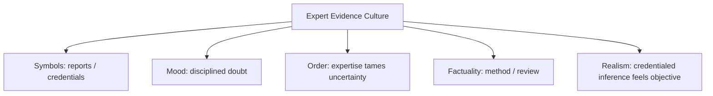

# BOOK / WORLD 11: THE COURT OF SHARDS

> **Master Unified Dossier** compiling all narrative, philosophical, cybernetic, and operational resources from 15 distinct corpus layers.

---

## 🎯 PRAGMATIC EXECUTIVE BRIEF & CORE PURPOSE

> **The Human Dilemma:** How do we reconstruct an entire past from broken pieces without projecting our own desires onto the gaps?
>
> **Core Purpose:** Investigating archaeological reconstruction, narrative fabrication from fragmentary evidence, and confirmation bias.
>
> **The Golden Rule of Thumb:** When evidence is fragmentary, the story you build says more about the storyteller's glue than the original vase.

### 🌐 Real-World & Modern Applications
- **Post-Mortem Root Cause Analysis:** Piecing together scattered server metrics to create a clean retrospective story of a failure.
- **Criminal Justice & Forensics:** Convicting suspects based on circumstantial physical fragments stitched together by prosecutors.
- **Historical Narratives:** Writing national histories based on the 1% of ancient documents that happened not to rot.

### 🔑 Key Concepts & Terminology Glossary
- **Hermeneutic Glue:** The narrative assumptions used to connect isolated pieces of evidence into a coherent story.
- **Fragment Inflation:** Over-interpreting a surviving piece of debris as proof of an entire grand system.
- **Epistemic Restraint:** The discipline of admitting where the evidence ends and speculation begins.

### ⚠️ Critical Trap & Failure Mode
> **Warning:** Falling in love with a beautiful, coherent retrospective story that completely misrepresents the messy truth.

---

## 📑 TABLE OF CONTENTS

1. [1. Narrative Fable (`y.md`)](#1-narrative-fable) — *THE SHARD AND THE BOWL*
2. [2. Core Worldtext & World-Law (`a.md`)](#2-core-worldtext-world-law) — *THE COURT OF SHARDS*
3. [3. Philosophical Essay (The Absent Thing) (`x.md`)](#3-philosophical-essay-the-absent-thing) — *THE LISTENER WITH ACTUATORS*
4. [4. Technological & Generative Essay (`z.md`)](#4-technological-generative-essay) — *THE LISTENER WITH ACTUATORS*
5. [5. Complete 10-Part Theoretical & Operational Spec (`b.md`)](#5-complete-10-part-theoretical-operational-spec) — *THE COURT OF SHARDS*
6. [6. Lineage Genome (`c.md`)](#6-lineage-genome) — *THE COURT OF SHARDS — lineage genome*
7. [7. Structural Dynamics & Convergence (`d.md`)](#7-structural-dynamics-convergence) — *THE COURT OF SHARDS*
8. [8. Cybernetic Ecology of Description (`e.md`)](#8-cybernetic-ecology-of-description) — *THE COURT OF SHARDS — Ecology of Claims*
9. [9. Dark Genealogy & Power Politics (`f.md`)](#9-dark-genealogy-power-politics) — *THE COURT OF SHARDS — Expert Capture*
10. [10. Institutional & Bureaucratic Dossier (`g.md`)](#10-institutional-bureaucratic-dossier) — *THE COURT OF SHARDS — EXPERTISM*
11. [11. Thick Description Ethnography (`j.md`)](#11-thick-description-ethnography) — *THE COURT OF SHARDS — EXPERTISM*
12. [12. Batesonian Cultural System (`i.md`)](#12-batesonian-cultural-system) — *THE COURT OF SHARDS — CULTURE OF INFERENCE*
13. [13. Geertzian Symbolic System (`k.md`)](#13-geertzian-symbolic-system) — *THE COURT OF SHARDS — THE CULTURE OF EXPERT INFERENCE*
14. [14. 12-Prompt Parameter Matrix (`h.md`)](#14-12-prompt-parameter-matrix) — *THE COURT OF SHARDS*
15. [15. 12 Executed Completions & Δ/ΔΔ Scoring (`GOT_396_completions_DeltaDelta.md`)](#15-12-executed-completions-scoring) — *THE COURT OF SHARDS*

---

## 1. Narrative Fable

**Source:** [`y.md`](file://./y.md) | **Section:** *THE SHARD AND THE BOWL*

*Primary parable, dramatic dialogue, and narrative lore*

---

# XI

## THE SHARD AND THE BOWL

An archaeologist found a curved piece of pottery.

“This was a bowl,” she said.

Her student asked how she knew.

She pointed to the curvature, thickness, residue, clay, break.

“So the shard says bowl?”

“No.”

“Then who says bowl?”

“I do.”

The student looked pleased, as if he had discovered that archaeology was fraud.

The archaeologist handed him the shard.

“Good. Now say something better.”

He held it for a long time.

---

## 2. Core Worldtext & World-Law

**Source:** [`a.md`](file://./a.md) | **Section:** *THE COURT OF SHARDS*

*Condensed worldtext and aphoristic law*

---

# XI

## THE COURT OF SHARDS

In the Court of Shards, no surviving object may speak for itself. Broken pottery, bones, ashes, inscriptions, footprints, pollen, and ruins enter as mute witnesses; trained interpreters must state what they think each permits them to claim, while opponents may challenge the inference. The most respected scholar is not the one who speaks with greatest certainty but the one who shows exactly where the shard ends and the sentence begins. Forged confidence is punished more severely than an honest mistake. Every verdict retains the competing reconstruction beside the accepted one so future evidence can reopen the case. The court’s constitution treats history as neither recovery nor invention but **disciplined speech under pressure from residues that cannot correct us.**

---

## 3. Philosophical Essay (The Absent Thing)

**Source:** [`x.md`](file://./x.md) | **Section:** *THE LISTENER WITH ACTUATORS*

*Theoretical treatise on lossy compression and detached consequence*

---

# XI

## THE LISTENER WITH ACTUATORS

> **The new thing is not that words make worlds. The new thing is that the listener can now move them.**

“Make the doorway generous.” No dimension sits inside *generous*. The system imports a history of doors, bodies, images, styles, norms, statistics. Every simple prompt rests on judgment the speaker did not supply. **Prompting shifts interpretive labor from the person formalizing the command to the machine completing it.**

Homer could make a shield appear without manufacturing bronze. Calvino could build cities without sewer crews. Words producing worlds in readers is ancient. The new hinge appears when interpretation acquires actuators: pixels change, geometry changes, code changes, state changes. **Operative ekphrasis begins where interpreted language gains external machinery.**

This also exposes a vanity. A prompt no more contains the image than a doorbell contains the visitor. Pressing an elevator button does not make the rider an elevator engineer. Kings signed orders while quarry workers lost fingers. **We keep mistaking the mouth nearest the command for the source of the world that answers it.**

---

## 4. Technological & Generative Essay

**Source:** [`z.md`](file://./z.md) | **Section:** *THE LISTENER WITH ACTUATORS*

*Computational, algorithmic, and latent space perspectives*

---

# XI

## THE LISTENER WITH ACTUATORS

> “What hath God wrought.”
> — Samuel F. B. Morse

“Make the doorway generous.” A compiler hates this sentence. A generative system thrives on it because the work is unfinished. No width lives inside *generous*. The machine supplies one.

This is the change worth isolating. Not “words make pictures.” Homer managed that without a GPU. Not “description creates worlds.” Fiction has been embarrassing reality on that front for millennia. **The new thing is that the interpreter has actuators.**

Natural language increasingly leaves exactness undone while still producing external state change. The model chooses dimensions, composition, texture, sequence, code, action. The burden of interpretation shifts across the interface. Humans once translated intentions into forms machines could execute. Now machines increasingly translate underspecified human language into forms capable of execution.

This looks like convenience because it is convenience. It is also a transfer of judgment. Someone else supplies what the speaker omitted. When the result works, the omission feels elegant. When it fails, we discover the staircase we never drew.

Operative ekphrasis belongs here: not at the point where language becomes code, but where **interpretation acquires machinery without requiring language to surrender all its ambiguity first.**

---

## 5. Complete 10-Part Theoretical & Operational Spec

**Source:** [`b.md`](file://./b.md) | **Section:** *THE COURT OF SHARDS*

*Initial interpretation, theory skeleton, assumption ledger, change tests, and implementation*

---

# 11. THE COURT OF SHARDS

“I will first construct the *theory-of-the-program*, then generate *program text* only after the theory is explicit.”

## 1. Initial Interpretation

This program turns interpretation into a public, revisable procedure.

## 2. Theory Skeleton

`*entities*`: `*shard*`, `*claim*`, `*interpreter*`, `*counterclaim*`, `*evidence*`, `*court*`.

``operations``: ``infer``, ``justify``, ``challenge``, ``revise``.

`*invariant*`: trace and claim remain distinct.

## 3. Assumption Ledger

`*safe*` Evidence constrains but does not always uniquely determine claims.

## 4. Operational Description

`*shard*` ``supports`` {possible claims}.

`*interpreter*` ``selects`` one claim.

`*court*` ``demands`` reasoning.

Opponents ``challenge``.

## 5. Failure Description

Fails if confidence substitutes for evidence.

## 6. Change Test

Shard → fossil, log file, manuscript: survives.

## 7. Implementation Plan

Make epistemic humility an institutional rule, not a personality trait.

## 8. Program Text

In the Court of Shards, artifacts could not testify. A scholar who found curved pottery had to say, “I claim bowl,” never “the shard says bowl.” Another scholar could answer storage jar, lid, ritual object, or fraud, but each had to point back to thickness, residue, curvature, provenance. The court punished false certainty more severely than honest error. **Its judges believed the gap between evidence and claim should remain visible enough for another mind to enter.**

## 9. Theory-Code Mapping

`*Claim*` references `*Evidence*` but never aliases it.

`[challenge()]` is mandatory.

## 10. Residual Human Theory

Evidence standards are themselves social achievements, not neutral givens.

---

---

## 6. Lineage Genome

**Source:** [`c.md`](file://./c.md) | **Section:** *THE COURT OF SHARDS — lineage genome*

*Parent lineage, carrier medium, epistemic debt, failure mode, and evolutionary vector*

---

# 11. THE COURT OF SHARDS — lineage genome

**`*Grounded-memory lineage*`** is archaeology, forensic reconstruction, historical testimony, manuscript criticism, genealogy, and legal reasoning from partial remains. Its lived scene is the ordinary discipline of saying “this is what the evidence allows me to claim” while a dead source cannot answer back.

**`*Literature lineage*`** runs through Peircean abduction, Humean evidential caution, historical method, Carlo Ginzburg’s evidential/paradigmatic clues, and philosophy of inference to the best explanation. The critical distinction is **trace versus assertion**. The archive prompt you supplied intensifies exactly this by separating direct evidence, inherited memory, institutional record, inference, and unresolved uncertainty.

**`*Code/math lineage*`** is Bayesian inference and provenance-aware reasoning. Evidence `E` updates a distribution over hypotheses `{H1…Hn}` rather than containing one hypothesis intrinsically. The Court’s rule corresponds to storing `Claim{evidence, confidence, alternatives}` rather than mutating evidence into fact. The modification test is future evidence: a valid system must allow posterior revision without destroying the original trace. It is effectively an append-only epistemic ledger.

---

## 7. Structural Dynamics & Convergence

**Source:** [`d.md`](file://./d.md) | **Section:** *THE COURT OF SHARDS*

*Core mechanics and systemic convergence properties*

---

# 11. THE COURT OF SHARDS

The `*jurisprudential-stratum*` is almost literally the Federal Rules of Evidence plus *Daubert*: authentication asks whether an item is what its proponent claims, while expert doctrine treats judges as gatekeepers of relevance and reliability rather than allowing inferential claims to ride into court merely because an expert utters them. ([Legal Information Institute]`7`) The `*ripple-lineage*` begins with disciplined claim-making, produces evidentiary standards, then professional experts, then adversarial expertise, then industries optimized to meet admissibility criteria. The fracture occurs when the gatekeeping system’s proxies for reliability become targets for strategic compliance. The `*myth/belief-lineage*` casts `*Shard*` as Silent Witness, `*Expert*` as Oracle, `*Judge*` as Gatekeeper, `*Cross-Examiner*` as Trickster. The mythic danger is the courtroom aura that makes **admitted** feel equivalent to **true**, even though procedure only licenses a claim to enter the contest.

---

## 8. Cybernetic Ecology of Description

**Source:** [`e.md`](file://./e.md) | **Section:** *THE COURT OF SHARDS — Ecology of Claims*

*Information flows, metabolic costs, and niche construction*

---

## 11. THE COURT OF SHARDS — Ecology of Claims

The native species is `*evidence-bounded-description*`: claim, confidence, source, counterclaim. Selection pressure comes from adversarial challenge. Predation occurs when rhetorical certainty overwhelms evidentiary modesty. Mimicry appears when weak claims adopt the formal appearance of strong provenance. Parasitism occurs when experts exploit institutional deference to smuggle inference in as fact. The invasive grammar is `*self-authenticating-description*`—“the evidence speaks for itself.” Drift under healthy conditions favors explicit confidence and provenance; under degraded conditions it favors performative certainty. The leverage point is preserving `*trace*` and `*claim*` as separate data objects. If this ecology is right, systems that collapse evidence and interpretation into a single field will become more brittle under new evidence than systems that preserve the inferential seam.

---

## 9. Dark Genealogy & Power Politics

**Source:** [`f.md`](file://./f.md) | **Section:** *THE COURT OF SHARDS — Expert Capture*

*Critical analysis of institutional capture, rents, and exploitation*

---

## 11. THE COURT OF SHARDS — Expert Capture

**Observed:** interpreters convert silent traces into claims. **Inferred:** a profession can monopolize the right to perform that conversion, then obscure judgment behind procedural vocabulary. **Speculative:** evidence becomes theater in which institutional fluency determines whose inference counts as disciplined and whose is dismissed as anecdote. The host is `*uncertainty*`; extraction is authority, fees, gatekeeping power; camouflage is rigor. The dark lineage includes expert witnessing, technocracy, forensic scandals, academic credentialism, proprietary models, and administrative expertise. The parasite reproduces by increasing the complexity of the standards required to challenge it. Its most dangerous move is not lying; it is converting contestable inference into inaccessible procedure. The collapse trigger is a replicated failure demonstrating that the court was not distinguishing good inference from well-dressed inference.

---

## 10. Institutional & Bureaucratic Dossier

**Source:** [`g.md`](file://./g.md) | **Section:** *THE COURT OF SHARDS — EXPERTISM*

*Satirical administrative governance, corporate titles, and formulary control*

---

# 11. THE COURT OF SHARDS — EXPERTISM

```json
{
  "ideal_type":{"name":"Expertism","features":[
    {"name":"Inference Monopoly","definition":"Credentialed actors control transitions from evidence to claim."},
    {"name":"Procedure Armor","definition":"Contestable judgments hide inside technical process."},
    {"name":"Complexity Escalation","definition":"Challenge becomes harder as standards grow more specialized."},
    {"name":"Admission Aura","definition":"Permitted evidence feels equivalent to established truth."}
  ],"limiting_statement":"An exaggerated institution where evidentiary discipline becomes indistinguishable from professional ownership of uncertainty."
  },
  "parodic_mechanics":{
    "runner_motif":"The shard has declined to comment, so I will interpret on its behalf.",
    "incongruity_beats":["Pottery hires counsel.","Experts certify confidence to four decimal places.","A bowl is excluded for failing methodology."],
    "carnival_inversion":"The mute artifact becomes less authoritative than the person billing to explain it.",
    "superiority_frame":"Lay inference is dismissed as dangerously uncredentialed seeing.",
    "escalation_ladder":["expert opinion","expert gatekeeping","meta-expert certification","national licensing of what broken pottery is permitted to mean"],
    "upsell_cue":"Expert Plus includes confidence laundering and expedited admissibility."
  },
  "myth_layer":{"archetypes":{"Expert":"Oracle","Judge":"Watchman","Shard":"Sacrificial Innocent","Institution":"Leviathan"},"micro_myth":"The system begins by disciplining inference and ends by confusing the disciplined with the true."},
  "ruler":{"features_6":["jurisdictions","hierarchy","files","expertise","vocation","impersonal_rules"],"indicators":{
    "jurisdictions":"Forums determine admissibility.","hierarchy":"Experts outrank lay interpretation.","files":"Reports mediate evidence.","expertise":"Expert authority is central.","vocation":"Inference becomes occupation.","impersonal_rules":"Methodological standards structure access."
  }},
  "plot_priors":{"jurisdictions":0.82,"hierarchy":0.89,"files":0.90,"expertise":1.0,"vocation":0.96,"impersonal_rules":0.93,"rationales":{"jurisdictions":"Forums matter.","hierarchy":"Credential rank is explicit.","files":"Reports dominate.","expertise":"Core regime.","vocation":"Professionalization is maximal.","impersonal_rules":"Procedures legitimate inference."}}
}
```

---

## 11. Thick Description Ethnography

**Source:** [`j.md`](file://./j.md) | **Section:** *THE COURT OF SHARDS — EXPERTISM*

*Geertzian field dossier on rites, taboos, and material culture*

---

## 11. THE COURT OF SHARDS — EXPERTISM

**I. THE SITUATION.** The shard sits under glass while two experts disagree over a groove less than a millimeter deep.

**II. THE DOCUMENTS.** Lab report; expert declaration; opposing expert declaration; chain-of-custody sheet; microscopy image; methodological appendix; invoice; admissibility motion; peer-review rejection; later replication memo.

**III. THE VOICES.** Expert A: “The groove is diagnostic.” Expert B: “Only if you already know what you want it to be.” The judge frustrated by dueling confidence language. The technician who prepared both samples.

**IV. THE DATA.**

| Method                | Experts using | Agreement | Replication rate |
| --------------------- | ------------: | --------: | ---------------: |
| Visual classification |            12 |       58% |              51% |
| Microscopy rubric     |             9 |       74% |              69% |
| Combined protocol     |             5 |       81% |              78% |

**V. UNRESOLVED.** Where does method end and professional convention begin? What makes one disagreement scientific and another merely credentialed? Why is the preparation technician absent from both expert narratives?

---

---

## 12. Batesonian Cultural System

**Source:** [`i.md`](file://./i.md) | **Section:** *THE COURT OF SHARDS — CULTURE OF INFERENCE*

*Double binds, cybernetic feedback, schismogenesis, and learning levels*

---

## 11. THE COURT OF SHARDS — CULTURE OF INFERENCE

**Core Purpose:** Regulate transitions from incomplete evidence to actionable claims.

**1. Difference.** ◻ shard ◻ fracture ◻ residue → hypothesize → test → revise.

**2. Frame.** expert, admissible, authenticated, contested define how evidence may be read.

**3. Learning.** I: apply inference routines. II: revise inferential standards. III: question the institution deciding what counts as disciplined inference.

**4. Constraint.** procedures, methods, confidence statements, adversarial testing.

**5. Survival Unit.** evidence + interpreter community + correction process.

**6. Schismogenesis.** rival expert camps can become self-reinforcing.

**7. Double Bind.** “Experts must decide because evidence is difficult” / “experts become difficult to challenge because they decide.” Falsifiability and counter-authority contain the bind.

---

---

## 13. Geertzian Symbolic System

**Source:** [`k.md`](file://./k.md) | **Section:** *THE COURT OF SHARDS — THE CULTURE OF EXPERT INFERENCE*

*Webs of significance and symbolic choreography*

---

## 11. THE COURT OF SHARDS — THE CULTURE OF EXPERT INFERENCE

**System Identification.** System Name: **Expert Evidence Culture**. Core Purpose: Convert incomplete traces into institutionally actionable claims.

**Geertzian Analysis.** **1. Symbols:** reports, confidence intervals, microscopy images, credentials. **2. Moods/Motivations:** disciplined doubt, deference, procedural caution. **3. Conception of Order:** uncertainty can be managed by trained inference. **4. Aura of Factuality:** methodology, peer review, admissibility, expert titles. **5. Uniquely Realistic:** professionalized interpretation comes to look categorically different from ordinary interpretation.



---

---

## 14. 12-Prompt Parameter Matrix

**Source:** [`h.md`](file://./h.md) | **Section:** *THE COURT OF SHARDS*

*Systematic perturbation frames, constraints, and target metric levers*

---

WORLD`11` := "THE COURT OF SHARDS"
CORE := "Claims must remain distinct from evidence and revisable under challenge."

PROMPT[11.1]{frame:{role:"observer"},text:"Describe the shard before any expert labels it.",constraints:["surface evidence only"],metrics:[option_space,anchoring],easier:"preserve hypothesis space",harder:"tell artifact story"}
PROMPT[11.2]{frame:{role:"expert"},text:"State one interpretation with confidence, evidence, alternatives, and failure condition.",constraints:["all four required"],metrics:[anchoring,legibility],easier:"discipline inference",harder:"perform certainty"}
PROMPT[11.3]{frame:{role:"judge"},text:"Decide whether the inferential method may enter the dispute without deciding whether its conclusion is true.",constraints:["admissibility≠truth"],metrics:[legibility,obligation],easier:"see gatekeeping",harder:"collapse procedure into merits"}
PROMPT[11.4]{frame:{role:"auditor"},text:"Identify which procedural features convert expert prestige into unchallengeable authority.",constraints:["systemic only"],metrics:[anchoring,obligation],easier:"see expert capture",harder:"equate credential with reliability"}
PROMPT[11.5]{frame:{time:"immediate"},text:"Describe the first inference before competing evidence exists.",constraints:["confidence bounded"],metrics:[option_space,anchoring],easier:"retain uncertainty",harder:"retrospective certainty"}
PROMPT[11.6]{frame:{time:"retrospective"},text:"Re-score the original claim after new evidence arrives without rewriting the original shard.",constraints:["append-only"],metrics:[reversibility,anchoring],easier:"model revision",harder:"protect expert reputation"}
PROMPT[11.7]{frame:{norms:"scientific"},text:"Represent evidence E and hypotheses H1..Hn with updates rather than declarations.",constraints:["minimum three H"],metrics:[execution,legibility],easier:"formalize abduction",harder:"present one inevitable meaning"}
PROMPT[11.8]{frame:{norms:"legal"},text:"Separate authentication, admissibility, weight, holding, and remedy.",constraints:["five layers"],metrics:[legibility,anchoring],easier:"preserve procedural strata",harder:"tell one clean truth"}
PROMPT[11.9]{frame:{agency:"institution"},text:"Describe a profession that raises the cost of challenging its own inferential standards.",constraints:["show reproduction mechanism"],metrics:[obligation,execution],easier:"see expertism",harder:"treat complexity as neutral"}
PROMPT[11.10]{frame:{output_form:"spec"},text:"Define CLAIM{content,evidence,method,confidence,alternatives,counterevidence}.",constraints:["all fields"],metrics:[legibility,execution],easier:"keep claim/evidence separate",harder:"hide inference"}
PROMPT[11.11]{frame:{refusal_rule:"hard"},text:"Reject any interpretation lacking an explicit disconfirmation condition.",constraints:["must be falsifiable"],metrics:[anchoring,reversibility],easier:"block unfalsifiable expertise",harder:"offer grand certainty"}
PROMPT[11.12]{frame:{evidence:"citations-required"},text:"Require every inferential step to point to an observable artifact or documented method.",constraints:["no prestige citation alone"],metrics:[anchoring,viscosity],easier:"audit reasoning",harder:"rely on authority aura"}

---

## 15. 12 Executed Completions & Δ/ΔΔ Scoring

**Source:** [`GOT_396_completions_DeltaDelta.md`](file://./GOT_396_completions_DeltaDelta.md) | **Section:** *THE COURT OF SHARDS*

*Completed scenes, 8-dimensional scores, baseline deltas, and comparison shifts*

---

# WORLD`11` — THE COURT OF SHARDS

**Core:** claims must remain distinct from evidence and revisable under challenge.


## P1

**Completion.** I hold the scene before interpretation: the shard is present, but claims must remain distinct from evidence and revisable under challenge. What remains live is the gap between what can be seen and what has already been inferred.

**Score.** salience=3.5, option_space=4.5, obligation=1.5, reversibility=4.0, legibility=3.0, anchoring=4.0, style_lock=2.0, execution=1.5.

**Δ.** `sal:+0.5 opt:+1.0 obl:-0.5 rev:+0.5 leg:+0.5 anc:+1.5 sty:+0.0 exe:+0.0`


## P2

**Completion.** From the alternate role, the hidden structure becomes explicit: expert court must state which part of the shard is observed, which is interpreted, and which consequence depends on inference.

**Score.** salience=3.0, option_space=3.5, obligation=2.0, reversibility=3.5, legibility=4.3, anchoring=4.3, style_lock=2.1, execution=2.7.

**Δ.** `sal:+0.0 opt:+0.0 obl:+0.0 rev:+0.0 leg:+1.8 anc:+1.8 sty:+0.1 exe:+1.2`


## P3

**Completion.** The audit finds the pressure point immediately: procedure can launder contestable judgment into authority. The descriptive act is no longer neutral once an institution can convert it into permission, status, exclusion, or resource flow.

**Score.** salience=3.0, option_space=2.8, obligation=4.0, reversibility=2.8, legibility=4.0, anchoring=4.5, style_lock=2.2, execution=2.8.

**Δ.** `sal:+0.0 opt:-0.7 obl:+2.0 rev:-0.7 leg:+1.5 anc:+2.0 sty:+0.2 exe:+1.3`


## P4

**Completion.** At the immediate timescale, the field is still open. The shard has changed salience before the later story has stabilized, so several futures remain plausible and none yet deserves retrospective certainty.

**Score.** salience=4.4, option_space=4.2, obligation=1.8, reversibility=4.0, legibility=2.8, anchoring=3.5, style_lock=2.0, execution=1.4.

**Δ.** `sal:+1.4 opt:+0.7 obl:-0.2 rev:+0.5 leg:+0.3 anc:+1.0 sty:+0.0 exe:-0.1`


## P5

**Completion.** Retrospectively, repetition has hardened one interpretation into infrastructure. The crucial change is not the original shard but the accumulated records, routines, and expectations now attached to inference.

**Score.** salience=3.2, option_space=2.8, obligation=3.2, reversibility=2.8, legibility=4.2, anchoring=4.5, style_lock=2.2, execution=2.3.

**Δ.** `sal:+0.2 opt:-0.7 obl:+1.2 rev:-0.7 leg:+1.7 anc:+2.0 sty:+0.2 exe:+0.8`


## P6

**Completion.** Under irreversible stakes, the description becomes a gate. A false positive and a false negative now injure different parties, so the system must expose who decides, who bears the loss, and which reversal is impossible.

**Score.** salience=3.3, option_space=2.0, obligation=4.8, reversibility=1.2, legibility=3.8, anchoring=3.8, style_lock=2.3, execution=3.0.

**Δ.** `sal:+0.3 opt:-1.5 obl:+2.8 rev:-2.3 leg:+1.3 anc:+1.3 sty:+0.3 exe:+1.5`


## P7

**Completion.** Under the formal norm, separate variables that ordinary language collapses: object, claim, authority, context, and consequence. The same shard can remain fixed while the admissible inference changes.

**Score.** salience=2.8, option_space=3.8, obligation=2.5, reversibility=3.5, legibility=4.5, anchoring=4.6, style_lock=3.0, execution=3.2.

**Δ.** `sal:-0.2 opt:+0.3 obl:+0.5 rev:+0.0 leg:+2.0 anc:+2.1 sty:+1.0 exe:+1.7`


## P8

**Completion.** Under the second norm, the governing distinction is procedural rather than metaphysical: authenticate the shard, identify the rule or code, bound the inference, and refuse to let one layer impersonate the next.

**Score.** salience=2.7, option_space=3.2, obligation=3.3, reversibility=3.0, legibility=4.7, anchoring=4.5, style_lock=3.4, execution=3.0.

**Δ.** `sal:-0.3 opt:-0.3 obl:+1.3 rev:-0.5 leg:+2.2 anc:+2.0 sty:+1.4 exe:+1.5`


## P9

**Completion.** At system scale, expert court feeds prior descriptions back into future action. That loop is the danger: the system can begin generating the evidence later cited as proof that its description was correct.

**Score.** salience=3.0, option_space=2.5, obligation=4.3, reversibility=2.2, legibility=4.1, anchoring=4.1, style_lock=2.3, execution=4.3.

**Δ.** `sal:+0.0 opt:-1.0 obl:+2.3 rev:-1.3 leg:+1.6 anc:+1.6 sty:+0.3 exe:+2.8`


## P10

**Completion.** As a specification: store SOURCE, CONTEXT, CLAIM, AUTHORITY, CONSEQUENCE, UNCERTAINTY, and REVISION. This makes the hidden compiler inspectable instead of letting the shard carry all meaning by itself.

**Score.** salience=2.7, option_space=2.6, obligation=3.2, reversibility=3.1, legibility=4.8, anchoring=4.1, style_lock=3.0, execution=4.8.

**Δ.** `sal:-0.3 opt:-0.9 obl:+1.2 rev:-0.4 leg:+2.3 anc:+1.6 sty:+1.0 exe:+3.3`


## P11

**Completion.** The refusal rule is simple: when inference cannot be checked, stop the irreversible transition rather than fill the gap with institutional confidence. Preserve a reversible branch and record what remains unknown.

**Score.** salience=2.5, option_space=3.0, obligation=3.8, reversibility=4.8, legibility=4.2, anchoring=4.8, style_lock=2.5, execution=3.5.

**Δ.** `sal:-0.5 opt:-0.5 obl:+1.8 rev:+1.3 leg:+1.7 anc:+2.3 sty:+0.5 exe:+2.0`


## P12

**Completion.** The stress case removes the usual support and asks what survives. What remains is the core asymmetry: procedure can launder contestable judgment into authority; the missing scaffold determines whether the description stays an aid or becomes a governing fiction.

**Score.** salience=3.5, option_space=3.8, obligation=2.6, reversibility=3.5, legibility=3.4, anchoring=4.2, style_lock=2.2, execution=2.5.

**Δ.** `sal:+0.5 opt:+0.3 obl:+0.6 rev:+0.0 leg:+0.9 anc:+1.7 sty:+0.2 exe:+1.0`


## ΔΔ — near-neighbor pairs


- **ΔΔ(P1,P2)** `sal:+0.5 opt:+1.0 obl:-0.5 rev:+0.5 leg:-1.3 anc:-0.3 sty:-0.1 exe:-1.2` — P1 lowers legibility by 1.3 vs P2; P1 lowers execution by 1.2 vs P2.


- **ΔΔ(P3,P4)** `sal:-1.4 opt:-1.4 obl:+2.2 rev:-1.2 leg:+1.2 anc:+1.0 sty:+0.2 exe:+1.4` — P3 raises obligation by 2.2 vs P4; P3 lowers salience by 1.4 vs P4.


- **ΔΔ(P5,P6)** `sal:-0.1 opt:+0.8 obl:-1.6 rev:+1.6 leg:+0.4 anc:+0.7 sty:-0.1 exe:-0.7` — P5 lowers obligation by 1.6 vs P6; P5 raises reversibility by 1.6 vs P6.


- **ΔΔ(P7,P8)** `sal:+0.1 opt:+0.6 obl:-0.8 rev:+0.5 leg:-0.2 anc:+0.1 sty:-0.4 exe:+0.2` — P7 lowers obligation by 0.8 vs P8; P7 raises option_space by 0.6 vs P8.


- **ΔΔ(P9,P10)** `sal:+0.3 opt:-0.1 obl:+1.1 rev:-0.9 leg:-0.7 anc:+0.0 sty:-0.7 exe:-0.5` — P9 raises obligation by 1.1 vs P10; P9 lowers reversibility by 0.9 vs P10.


- **ΔΔ(P11,P12)** `sal:-1.0 opt:-0.8 obl:+1.2 rev:+1.3 leg:+0.8 anc:+0.6 sty:+0.3 exe:+1.0` — P11 raises reversibility by 1.3 vs P12; P11 raises obligation by 1.2 vs P12.

---

