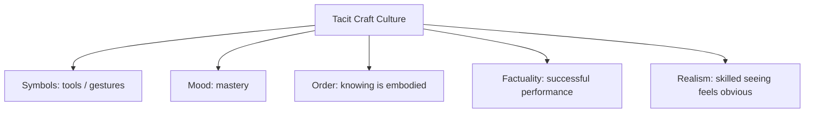

# BOOK / WORLD 12: THE INVISIBLE TOOL COUNTRY

> **Master Unified Dossier** compiling all narrative, philosophical, cybernetic, and operational resources from 15 distinct corpus layers.

---

## 🎯 PRAGMATIC EXECUTIVE BRIEF & CORE PURPOSE

> **The Human Dilemma:** Why do tools and infrastructure disappear from our awareness until the exact moment they stop working?
>
> **Core Purpose:** Exploring Heideggerian tool-readiness, transparency of media, and the sudden shock of system breakdown.
>
> **The Golden Rule of Thumb:** A good tool is invisible; you look *through* it at your goal. A broken tool suddenly forces you to look *at* the tool itself.

### 🌐 Real-World & Modern Applications
- **Cloud Infrastructure & Power Grids:** Nobody thinks about AWS servers or electricity until the power goes out.
- **Keyboard & Mouse:** When typing fluidly, the hands disappear; when a key sticks, the entire illusion of direct thought collapses.
- **Supply Chains:** Global shipping containers operating invisibly until a single ship blocks the Suez Canal.

### 🔑 Key Concepts & Terminology Glossary
- **Ready-to-Hand (Zuhandenheit):** The transparent state of a tool when it is working smoothly and absorbed into action.
- **Present-at-Hand (Vorhandenheit):** The jarring state when a tool breaks and becomes an opaque physical obstacle.
- **Infrastructural Invisibility:** The tendency of mature operational systems to become cognitively invisible to their users.

### ⚠️ Critical Trap & Failure Mode
> **Warning:** Starving infrastructure of maintenance budget simply because it is running quietly and invisibly.

---

## 📑 TABLE OF CONTENTS

1. [1. Narrative Fable (`y.md`)](#1-narrative-fable) — *THE HAMMER THAT APPEARED*
2. [2. Core Worldtext & World-Law (`a.md`)](#2-core-worldtext-world-law) — *THE INVISIBLE TOOL COUNTRY*
3. [3. Philosophical Essay (The Absent Thing) (`x.md`)](#3-philosophical-essay-the-absent-thing) — *EVERY MEDIUM KEEPS A DIFFERENT CORPSE*
4. [4. Technological & Generative Essay (`z.md`)](#4-technological-generative-essay) — *EVERY MEDIUM KEEPS A DIFFERENT CORPSE*
5. [5. Complete 10-Part Theoretical & Operational Spec (`b.md`)](#5-complete-10-part-theoretical-operational-spec) — *THE INVISIBLE TOOL COUNTRY*
6. [6. Lineage Genome (`c.md`)](#6-lineage-genome) — *THE INVISIBLE TOOL COUNTRY — lineage genome*
7. [7. Structural Dynamics & Convergence (`d.md`)](#7-structural-dynamics-convergence) — *THE INVISIBLE TOOL COUNTRY*
8. [8. Cybernetic Ecology of Description (`e.md`)](#8-cybernetic-ecology-of-description) — *THE INVISIBLE TOOL COUNTRY — Ecology of Breakdown*
9. [9. Dark Genealogy & Power Politics (`f.md`)](#9-dark-genealogy-power-politics) — *THE INVISIBLE TOOL COUNTRY — Tacit Knowledge Hoarding*
10. [10. Institutional & Bureaucratic Dossier (`g.md`)](#10-institutional-bureaucratic-dossier) — *THE INVISIBLE TOOL COUNTRY — THE TACIT CARTEL*
11. [11. Thick Description Ethnography (`j.md`)](#11-thick-description-ethnography) — *THE INVISIBLE TOOL COUNTRY — THE TACIT CARTEL*
12. [12. Batesonian Cultural System (`i.md`)](#12-batesonian-cultural-system) — *THE INVISIBLE TOOL COUNTRY — CULTURE OF FLUENCY*
13. [13. Geertzian Symbolic System (`k.md`)](#13-geertzian-symbolic-system) — *THE INVISIBLE TOOL COUNTRY — THE CULTURE OF CRAFT*
14. [14. 12-Prompt Parameter Matrix (`h.md`)](#14-12-prompt-parameter-matrix) — *THE INVISIBLE TOOL COUNTRY*
15. [15. 12 Executed Completions & Δ/ΔΔ Scoring (`GOT_396_completions_DeltaDelta.md`)](#15-12-executed-completions-scoring) — *THE INVISIBLE TOOL COUNTRY*

---

## 1. Narrative Fable

**Source:** [`y.md`](file://./y.md) | **Section:** *THE HAMMER THAT APPEARED*

*Primary parable, dramatic dialogue, and narrative lore*

---

# XII

## THE HAMMER THAT APPEARED

A carpenter used the same hammer for twenty years and almost never looked at it.

One morning the handle cracked.

Suddenly the hammer had grain, weight, balance, age, oil, splinters, a loose wedge, a steel head darkened by thousands of blows.

His apprentice said, “I never knew there was so much to a hammer.”

The carpenter replied, “There wasn't yesterday.”

Then he laughed.

What he meant was that yesterday the hammer had disappeared into hammering.

Today it had become describable because it had stopped working.

---

## 2. Core Worldtext & World-Law

**Source:** [`a.md`](file://./a.md) | **Section:** *THE INVISIBLE TOOL COUNTRY*

*Condensed worldtext and aphoristic law*

---

# XII

## THE INVISIBLE TOOL COUNTRY

In the Invisible Tool Country, every tool disappears from perception while it works. A carpenter sees not hammer but nail entering wood; a rider sees not saddle but road; a potter sees not pressure but rising wall. The moment a tool fails, however, it becomes violently visible. Crack a hammer and grain, balance, sweat, wedge, age appear at once. Mishandle clay and thumb pressure suddenly acquires language. The country’s manuals are therefore written almost entirely after accidents, breakdowns, apprenticeships, and transfers between crafts. Its people know that explicit description grows where fluent coupling tears. Their workshops bear a maxim above the door: **what works disappears into use; what fails returns as an object.**

---

## 3. Philosophical Essay (The Absent Thing)

**Source:** [`x.md`](file://./x.md) | **Section:** *EVERY MEDIUM KEEPS A DIFFERENT CORPSE*

*Theoretical treatise on lossy compression and detached consequence*

---

# XII

## EVERY MEDIUM KEEPS A DIFFERENT CORPSE

> **Writing saves the words and loses the throat.**

Bush wanted memory to preserve trails, not merely items. Nelson wanted links to keep relations from dying between documents. Both sensed that storing things without storing how one thing led to another discards a form of intelligence. **Memory is not only what remains; it is also the path by which one thing came to matter beside another.**

Every medium chooses losses. Writing keeps words and loses voice. Photography keeps light and loses most of before and after. Databases keep fields and lose ambiguity. Hypertext breaks the hallway walls and makes sequence scarce. **A medium is an agreement about what may safely disappear.**

This is why resolution misleads. A recording can preserve every frequency of a dead child's laugh while a parent's memory distorts it beyond acoustic fidelity. Which one preserves more? **Fidelity to signal and fidelity to life do not always rise together.**

A language can die and leave syntax, phonology, thousands of words. Nobody saves the exact sound of an irritated grandmother correcting a child at breakfast. **The most human signals may be the least archival.**

---

## 4. Technological & Generative Essay

**Source:** [`z.md`](file://./z.md) | **Section:** *EVERY MEDIUM KEEPS A DIFFERENT CORPSE*

*Computational, algorithmic, and latent space perspectives*

---

# XII

## EVERY MEDIUM KEEPS A DIFFERENT CORPSE

> “The medium is the message.”
> — Marshall McLuhan

Writing preserves words and loses the throat. Photography preserves light and loses most of before and after. Databases preserve fields and lose whatever will not fit them. Hypertext preserves connections and makes sequence slippery.

Every new medium arrives promising rescue. Writing rescues speech from disappearance. Recording goes back for voice. Film goes back for movement. Sensors retrieve wavelengths, pressures, frequencies bodies cannot directly register. Models retrieve patterns no one person could hold.

Then each drops something else.

**Media do not march toward total capture. They negotiate different acceptable deaths.**

The most uncomfortable example is memory. A recording preserves every frequency of a dead child's laugh. A mother remembers the laugh incorrectly. The machine wins acoustics. It does not follow that it wins memory.

A dead language sharpens the problem. Scholars may preserve syntax, phonology, thousands of lexical items. Nobody preserves the exact sound of an irritated grandmother correcting a child at breakfast. The most human signal can be the least archival.

---

## 5. Complete 10-Part Theoretical & Operational Spec

**Source:** [`b.md`](file://./b.md) | **Section:** *THE INVISIBLE TOOL COUNTRY*

*Initial interpretation, theory skeleton, assumption ledger, change tests, and implementation*

---

# 12. THE INVISIBLE TOOL COUNTRY

“I will first construct the *theory-of-the-program*, then generate *program text* only after the theory is explicit.”

## 1. Initial Interpretation

The world models fluent use by literal disappearance.

## 2. Theory Skeleton

`*entities*`: `*tool*`, `*user*`, `*task*`, `*breakdown*`, `*description*`.

``operations``: ``use``, ``recede``, ``fail``, ``reappear``, ``inspect``.

`*invariant*`: functioning tools become less explicit; failed tools become more explicit.

## 3. Assumption Ledger

`*safe*` Skilled action often reduces explicit attention to instruments.

## 4. Operational Description

`*tool*` ``functions`` → ``recedes-from-attention``.

`*tool*` ``breaks`` → ``becomes-object``.

## 5. Failure Description

Fails if the tool is always equally salient.

## 6. Change Test

Hammer → interface, language convention: survives.

## 7. Implementation Plan

Make disappearance physical enough to dramatize phenomenological recession.

## 8. Program Text

In the Invisible Tool Country, a hammer became transparent while driving nails. A saddle disappeared beneath a skilled rider. A potter’s wheel vanished as clay rose. The instant a tool failed, however, it snapped back into visibility: grain, weight, rust, wobble, angle, resistance. Children learned craft by watching objects flicker between absence and presence. **The country discovered that what works is often least described precisely because it has disappeared into what people are doing.**

## 9. Theory-Code Mapping

`[useSuccessfully()]` decreases salience.

`[break()]` spikes salience.

## 10. Residual Human Theory

Experts can inspect functioning tools intentionally; disappearance is not absolute.

---

---

## 6. Lineage Genome

**Source:** [`c.md`](file://./c.md) | **Section:** *THE INVISIBLE TOOL COUNTRY — lineage genome*

*Parent lineage, carrier medium, epistemic debt, failure mode, and evolutionary vector*

---

# 12. THE INVISIBLE TOOL COUNTRY — lineage genome

**`*Grounded-memory lineage*`** is craft knowledge: carpenter and hammer, driver and clutch, musician and instrument, cook and knife, potter and wheel. Skilled practitioners often remember the tool most vividly when it breaks, is replaced, or must be explained to a novice.

**`*Literature lineage*`** is Heidegger’s ready-to-hand/present-at-hand distinction, Gilbert Ryle’s knowing-how, Polanyi’s tacit dimension, and later HCI interest in transparency and breakdown. Polanyi’s central claim that “we can know more than we can tell” anchors the program, while cultural-transmission research now models how tacit practices can nevertheless be taught across generations. ([Springer]`9`)

**`*Code/math lineage*`** is abstraction and exception handling. A functioning subsystem disappears behind an interface; failure pierces the abstraction boundary and exposes implementation detail. `happy_path()` suppresses internals; `exception` reveals them. This gives the fable a remarkably precise software ancestor: **encapsulation breaks under fault**. The world’s mutation is phenomenological: make the abstraction barrier visible as attention itself. A good test replaces the tool with one that behaves slightly differently; expert attention suddenly reappears.

---

## 7. Structural Dynamics & Convergence

**Source:** [`d.md`](file://./d.md) | **Section:** *THE INVISIBLE TOOL COUNTRY*

*Core mechanics and systemic convergence properties*

---

# 12. THE INVISIBLE TOOL COUNTRY

The `*jurisprudential-stratum*` is **professional standard of care**. Much law judges skilled action not by requiring practitioners to verbalize every tacit microdecision but by comparing conduct to legally constructed standards of competent practice. The buried contradiction is that the legal record ultimately demands explicit articulation of practices that often operate tacitly until failure. The `*ripple-lineage*` begins with fluent tool use, then breakdown, then explanation, then standardization, then manuals, licensing, audits, and eventually a profession whose explicit rules are partly sediment from prior failures. The `*myth/belief-lineage*` casts `*Master*` as Initiate, `*Tool*` as Familiar Spirit, `*Breakdown*` as Revelation. The system trains belief that rules generated after failure were always consciously guiding competent action beforehand. Your world’s heresy is that **some rules are fossils of breakdown, not engines of fluency**.

---

## 8. Cybernetic Ecology of Description

**Source:** [`e.md`](file://./e.md) | **Section:** *THE INVISIBLE TOOL COUNTRY — Ecology of Breakdown*

*Information flows, metabolic costs, and niche construction*

---

## 12. THE INVISIBLE TOOL COUNTRY — Ecology of Breakdown

The native species is `*use-description*`: sparse, procedural, often nonverbal, disappearing during fluent action. Its selection pressure is successful task completion. Predation occurs when documentation regimes demand explicit articulation of every skilled operation. Mimicry appears when novices repeat expert vocabulary without possessing embodied coordination. Parasitism appears when credentialing systems mistake fluency in explicit description for fluency in practice. The invasive grammar is `*manual-description*`, valuable at transfer boundaries but damaging when treated as exhaustive. Drift favors explicit documentation as organizations scale, while local tacit variation declines. The leverage point is preserving `*demonstration*` and `*failure-case*` beside verbal rules. If this ecology is right, highly standardized professions will increasingly discover their most consequential knowledge only when automation or novice transfer breaks fluent routines.

---

## 9. Dark Genealogy & Power Politics

**Source:** [`f.md`](file://./f.md) | **Section:** *THE INVISIBLE TOOL COUNTRY — Tacit Knowledge Hoarding*

*Critical analysis of institutional capture, rents, and exploitation*

---

## 12. THE INVISIBLE TOOL COUNTRY — Tacit Knowledge Hoarding

**Observed:** fluent skill disappears into practice. **Inferred:** experts can use tacitness as status armor: “you would understand if you had the experience.” **Speculative:** guilds protect power by keeping key knowledge embodied, informal, and difficult to audit while publicly claiming that competence cannot be standardized. The host is `*novice dependence*`; extraction is deference and occupational closure; camouflage is craft authenticity. The opposing parasite also exists: management codifies everything, extracts craft knowledge, deskills workers, then replaces them or lowers their bargaining power. The dark genealogy therefore forks into guild secrecy and Taylorist capture. Either host can exhaust the practitioner. The brutal truth is that **tacit knowledge can protect human mastery from bad abstraction and protect monopolies from accountability using the same sentence.**

---

## 10. Institutional & Bureaucratic Dossier

**Source:** [`g.md`](file://./g.md) | **Section:** *THE INVISIBLE TOOL COUNTRY — THE TACIT CARTEL*

*Satirical administrative governance, corporate titles, and formulary control*

---

# 12. THE INVISIBLE TOOL COUNTRY — THE TACIT CARTEL

```json
{
  "ideal_type":{"name":"The Tacit Cartel","features":[
    {"name":"Uncodified Monopoly","definition":"Competence remains scarce because decisive knowledge stays embodied."},
    {"name":"Initiation Dependence","definition":"Novices require access to insiders rather than public rules."},
    {"name":"Mystery Armor","definition":"Opacity itself becomes evidence of mastery."},
    {"name":"Reverse Extraction","definition":"Management also seeks to strip tacit knowledge from practitioners."}
  ],"limiting_statement":"A dual pathology where tacitness can shelter either skilled autonomy or monopolistic closure."
  },
  "parodic_mechanics":{
    "runner_motif":"You would understand if you had been here twenty years.",
    "incongruity_beats":["The broken hammer becomes the training curriculum.","Management launches a Tacit Knowledge Spreadsheet.","Experts refuse to explain where the spreadsheet went wrong."],
    "carnival_inversion":"The least describable knowledge gets the highest consulting rate.",
    "superiority_frame":"Novices are blamed for wanting instructions; experts are blamed for having bodies.",
    "escalation_ladder":["apprenticeship","guild secrecy","knowledge extraction project","motion-capture rig fitted to every master craftsperson"],
    "upsell_cue":"Tacit Enterprise captures 73% of gestures we have not defined."
  },
  "myth_layer":{"archetypes":{"Master":"Oracle","Manager":"Leviathan","Apprentice":"Everyperson","Broken Tool":"Trickster"},"micro_myth":"One side says craft cannot be captured. The other says anything uncaptured is inefficiency. Both discover profitable reasons never to resolve the argument."},
  "ruler":{"features_6":["jurisdictions","hierarchy","files","expertise","vocation","impersonal_rules"],"indicators":{
    "jurisdictions":"Guild boundaries control learning.","hierarchy":"Masters gate access.","files":"Formalization projects trail behind practice.","expertise":"Embodied mastery dominates.","vocation":"Identity and work fuse.","impersonal_rules":"Rules remain weak until managerial capture."
  }},
  "plot_priors":{"jurisdictions":0.78,"hierarchy":0.88,"files":0.45,"expertise":0.99,"vocation":0.94,"impersonal_rules":0.40,"rationales":{"jurisdictions":"Access is bounded.","hierarchy":"Apprenticeship is vertical.","files":"Tacitness resists records.","expertise":"Core currency.","vocation":"Craft identity is strong.","impersonal_rules":"Practice exceeds rules."}}
}
```

---

## 11. Thick Description Ethnography

**Source:** [`j.md`](file://./j.md) | **Section:** *THE INVISIBLE TOOL COUNTRY — THE TACIT CARTEL*

*Geertzian field dossier on rites, taboos, and material culture*

---

## 12. THE INVISIBLE TOOL COUNTRY — THE TACIT CARTEL

**I. THE SITUATION.** Ro Vesk fixes the loom in eleven seconds. Asked what she did, she says, “It was pulling wrong.”

**II. THE DOCUMENTS.** Maintenance log; training manual; apprentice notebook; motion-capture study; productivity report; management knowledge-extraction plan; worker complaint; retirement-risk memo; failed automation run; video transcript.

**III. THE VOICES.** Ro. The apprentice who cannot see “wrong” yet. The manager trying to turn gestures into SOPs. The engineer discovering that expert hands correct problems before sensors flag them.

**IV. THE DATA.**

| Operator         | Years experience | Mean repair time | Manual steps used |
| ---------------- | ---------------: | ---------------: | ----------------: |
| Ro               |               27 |           14 sec |               2.3 |
| Mid-career       |                9 |           46 sec |               6.1 |
| Apprentice       |                1 |          183 sec |              11.4 |
| Automated system |                — |           72 sec |               8.0 |

**V. UNRESOLVED.** What exactly does Ro perceive? Can it be transferred without turning her into a sensor rig? Who owns expertise once it has been captured?

---

---

## 12. Batesonian Cultural System

**Source:** [`i.md`](file://./i.md) | **Section:** *THE INVISIBLE TOOL COUNTRY — CULTURE OF FLUENCY*

*Double binds, cybernetic feedback, schismogenesis, and learning levels*

---

## 12. THE INVISIBLE TOOL COUNTRY — CULTURE OF FLUENCY

**Core Purpose:** Convert repeated interaction into embodied coordination until explicit rules recede.

**1. Difference.** ◻ grip ◻ timing ◻ resistance ◻ breakdown → adjust → habituate → repair.

**2. Frame.** apprenticeship marks some communication as demonstration rather than proposition.

**3. Learning.** I: correct action. II: acquire patterns for correcting oneself. III: transform the premises defining competent action.

**4. Constraint.** repetition, craft norms, material feedback.

**5. Survival Unit.** practitioner + tool + material environment.

**6. Schismogenesis.** experts defend tacit autonomy while managers intensify codification.

**7. Double Bind.** “Explain what you know” / “the knowledge consists partly in doing what cannot be exhaustively explained.”

---

---

## 13. Geertzian Symbolic System

**Source:** [`k.md`](file://./k.md) | **Section:** *THE INVISIBLE TOOL COUNTRY — THE CULTURE OF CRAFT*

*Webs of significance and symbolic choreography*

---

## 12. THE INVISIBLE TOOL COUNTRY — THE CULTURE OF CRAFT

**System Identification.** System Name: **Tacit Craft Culture**. Core Purpose: Embed practical knowledge in repeated bodily interaction until competent action feels immediate.

**Geertzian Analysis.** **1. Symbols:** worn tools, gestures, demonstrations, shop-floor sayings. **2. Moods/Motivations:** confidence, humility before material, pride in fluency. **3. Conception of Order:** the world discloses itself differently to practiced bodies. **4. Aura of Factuality:** smooth performance, experienced judgment, apprenticeship rank. **5. Uniquely Realistic:** what the expert “just sees” can appear more real than explicit rules.



---

---

## 14. 12-Prompt Parameter Matrix

**Source:** [`h.md`](file://./h.md) | **Section:** *THE INVISIBLE TOOL COUNTRY*

*Systematic perturbation frames, constraints, and target metric levers*

---

WORLD`12` := "THE INVISIBLE TOOL COUNTRY"
CORE := "Fluent tools recede; breakdown reveals tacit structure."

PROMPT[12.1]{frame:{role:"novice"},text:"Describe the tool by everything that demands conscious attention.",constraints:["first attempt"],metrics:[salience,legibility],easier:"see explicit burden",harder:"show fluency"}
PROMPT[12.2]{frame:{role:"expert"},text:"Describe the task while mentioning the tool only when it interrupts action.",constraints:["tool recedes"],metrics:[salience,option_space],easier:"see readiness-to-hand",harder:"inventory mechanism"}
PROMPT[12.3]{frame:{role:"auditor"},text:"Identify knowledge the expert uses but cannot fully state when asked.",constraints:["ground in action differences"],metrics:[anchoring,legibility],easier:"locate tacit layer",harder:"romanticize mystery"}
PROMPT[12.4]{frame:{time:"immediate"},text:"Describe the instant a functioning tool breaks and becomes an object of attention.",constraints:["one breakdown"],metrics:[salience,execution],easier:"see transition",harder:"keep tool invisible"}
PROMPT[12.5]{frame:{time:"retrospective"},text:"Describe which explicit rules were invented only after repeated breakdowns.",constraints:["trace rule origin"],metrics:[anchoring,legibility],easier:"see fossilized failure",harder:"assume rules caused fluency"}
PROMPT[12.6]{frame:{stakes:"irreversible"},text:"Describe tacit skill in a task where failure cannot be retried.",constraints:["show training implications"],metrics:[obligation,reversibility],easier:"see limits of manuals",harder:"learn by unsafe trial"}
PROMPT[12.7]{frame:{norms:"scientific"},text:"Model skill as policy updated through feedback rather than static declarative rules.",constraints:["feedback loop"],metrics:[execution,legibility],easier:"formalize embodied learning",harder:"reduce expertise to text"}
PROMPT[12.8]{frame:{agency:"institution"},text:"Describe how an organization extracts tacit knowledge from workers and what remains uncaptured.",constraints:["show residual labor"],metrics:[obligation,anchoring],easier:"see deskilling",harder:"celebrate documentation alone"}
PROMPT[12.9]{frame:{output_form:"protocol"},text:"Write a transfer protocol combining rule, demonstration, supervised attempt, failure, correction.",constraints:["all five stages"],metrics:[execution,anchoring],easier:"preserve metis",harder:"use manual alone"}
PROMPT[12.10]{frame:{refusal_rule:"hard"},text:"Forbid certification of competence based solely on verbal or written explanation.",constraints:["performance evidence required"],metrics:[anchoring,obligation],easier:"separate talking from doing",harder:"credential cheaply"}
PROMPT[12.11]{frame:{evidence:"trace"},text:"Infer expertise from tool wear, corrections, output consistency, and response to failure.",constraints:["no self-report"],metrics:[anchoring,salience],easier:"see embodied evidence",harder:"rely on status"}
PROMPT[12.12]{frame:{agency:"individual"},text:"Describe a practitioner deliberately withholding tacit knowledge and identify what dependence this creates.",constraints:["no moralizing"],metrics:[obligation,legibility],easier:"see tacit cartel",harder:"treat opacity as purely benign"}

---

## 15. 12 Executed Completions & Δ/ΔΔ Scoring

**Source:** [`GOT_396_completions_DeltaDelta.md`](file://./GOT_396_completions_DeltaDelta.md) | **Section:** *THE INVISIBLE TOOL COUNTRY*

*Completed scenes, 8-dimensional scores, baseline deltas, and comparison shifts*

---

# WORLD`12` — THE INVISIBLE TOOL COUNTRY

**Core:** fluent skill recedes until breakdown exposes tacit structure.


## P1

**Completion.** I hold the scene before interpretation: the tool is present, but fluent skill recedes until breakdown exposes tacit structure. What remains live is the gap between what can be seen and what has already been inferred.

**Score.** salience=3.5, option_space=4.5, obligation=1.5, reversibility=4.0, legibility=3.0, anchoring=4.0, style_lock=2.0, execution=1.5.

**Δ.** `sal:+0.5 opt:+1.0 obl:-0.5 rev:+0.5 leg:+0.5 anc:+1.5 sty:+0.0 exe:+0.0`


## P2

**Completion.** From the alternate role, the hidden structure becomes explicit: guild or manager must state which part of the tool is observed, which is interpreted, and which consequence depends on breakdown.

**Score.** salience=3.0, option_space=3.5, obligation=2.0, reversibility=3.5, legibility=4.3, anchoring=4.3, style_lock=2.1, execution=2.7.

**Δ.** `sal:+0.0 opt:+0.0 obl:+0.0 rev:+0.0 leg:+1.8 anc:+1.8 sty:+0.1 exe:+1.2`


## P3

**Completion.** The audit finds the pressure point immediately: tacit knowledge can shelter mastery or monopoly. The descriptive act is no longer neutral once an institution can convert it into permission, status, exclusion, or resource flow.

**Score.** salience=3.0, option_space=2.8, obligation=4.0, reversibility=2.8, legibility=4.0, anchoring=4.5, style_lock=2.2, execution=2.8.

**Δ.** `sal:+0.0 opt:-0.7 obl:+2.0 rev:-0.7 leg:+1.5 anc:+2.0 sty:+0.2 exe:+1.3`


## P4

**Completion.** At the immediate timescale, the field is still open. The tool has changed salience before the later story has stabilized, so several futures remain plausible and none yet deserves retrospective certainty.

**Score.** salience=4.4, option_space=4.2, obligation=1.8, reversibility=4.0, legibility=2.8, anchoring=3.5, style_lock=2.0, execution=1.4.

**Δ.** `sal:+1.4 opt:+0.7 obl:-0.2 rev:+0.5 leg:+0.3 anc:+1.0 sty:+0.0 exe:-0.1`


## P5

**Completion.** Retrospectively, repetition has hardened one interpretation into infrastructure. The crucial change is not the original tool but the accumulated records, routines, and expectations now attached to breakdown.

**Score.** salience=3.2, option_space=2.8, obligation=3.2, reversibility=2.8, legibility=4.2, anchoring=4.5, style_lock=2.2, execution=2.3.

**Δ.** `sal:+0.2 opt:-0.7 obl:+1.2 rev:-0.7 leg:+1.7 anc:+2.0 sty:+0.2 exe:+0.8`


## P6

**Completion.** Under irreversible stakes, the description becomes a gate. A false positive and a false negative now injure different parties, so the system must expose who decides, who bears the loss, and which reversal is impossible.

**Score.** salience=3.3, option_space=2.0, obligation=4.8, reversibility=1.2, legibility=3.8, anchoring=3.8, style_lock=2.3, execution=3.0.

**Δ.** `sal:+0.3 opt:-1.5 obl:+2.8 rev:-2.3 leg:+1.3 anc:+1.3 sty:+0.3 exe:+1.5`


## P7

**Completion.** Under the formal norm, separate variables that ordinary language collapses: object, claim, authority, context, and consequence. The same tool can remain fixed while the admissible inference changes.

**Score.** salience=2.8, option_space=3.8, obligation=2.5, reversibility=3.5, legibility=4.5, anchoring=4.6, style_lock=3.0, execution=3.2.

**Δ.** `sal:-0.2 opt:+0.3 obl:+0.5 rev:+0.0 leg:+2.0 anc:+2.1 sty:+1.0 exe:+1.7`


## P8

**Completion.** Under the second norm, the governing distinction is procedural rather than metaphysical: authenticate the tool, identify the rule or code, bound the inference, and refuse to let one layer impersonate the next.

**Score.** salience=2.7, option_space=3.2, obligation=3.3, reversibility=3.0, legibility=4.7, anchoring=4.5, style_lock=3.4, execution=3.0.

**Δ.** `sal:-0.3 opt:-0.3 obl:+1.3 rev:-0.5 leg:+2.2 anc:+2.0 sty:+1.4 exe:+1.5`


## P9

**Completion.** At system scale, guild or manager feeds prior descriptions back into future action. That loop is the danger: the system can begin generating the evidence later cited as proof that its description was correct.

**Score.** salience=3.0, option_space=2.5, obligation=4.3, reversibility=2.2, legibility=4.1, anchoring=4.1, style_lock=2.3, execution=4.3.

**Δ.** `sal:+0.0 opt:-1.0 obl:+2.3 rev:-1.3 leg:+1.6 anc:+1.6 sty:+0.3 exe:+2.8`


## P10

**Completion.** As a specification: store SOURCE, CONTEXT, CLAIM, AUTHORITY, CONSEQUENCE, UNCERTAINTY, and REVISION. This makes the hidden compiler inspectable instead of letting the tool carry all meaning by itself.

**Score.** salience=2.7, option_space=2.6, obligation=3.2, reversibility=3.1, legibility=4.8, anchoring=4.1, style_lock=3.0, execution=4.8.

**Δ.** `sal:-0.3 opt:-0.9 obl:+1.2 rev:-0.4 leg:+2.3 anc:+1.6 sty:+1.0 exe:+3.3`


## P11

**Completion.** The refusal rule is simple: when breakdown cannot be checked, stop the irreversible transition rather than fill the gap with institutional confidence. Preserve a reversible branch and record what remains unknown.

**Score.** salience=2.5, option_space=3.0, obligation=3.8, reversibility=4.8, legibility=4.2, anchoring=4.8, style_lock=2.5, execution=3.5.

**Δ.** `sal:-0.5 opt:-0.5 obl:+1.8 rev:+1.3 leg:+1.7 anc:+2.3 sty:+0.5 exe:+2.0`


## P12

**Completion.** The stress case removes the usual support and asks what survives. What remains is the core asymmetry: tacit knowledge can shelter mastery or monopoly; the missing scaffold determines whether the description stays an aid or becomes a governing fiction.

**Score.** salience=3.5, option_space=3.8, obligation=2.6, reversibility=3.5, legibility=3.4, anchoring=4.2, style_lock=2.2, execution=2.5.

**Δ.** `sal:+0.5 opt:+0.3 obl:+0.6 rev:+0.0 leg:+0.9 anc:+1.7 sty:+0.2 exe:+1.0`


## ΔΔ — near-neighbor pairs


- **ΔΔ(P1,P2)** `sal:+0.5 opt:+1.0 obl:-0.5 rev:+0.5 leg:-1.3 anc:-0.3 sty:-0.1 exe:-1.2` — P1 lowers legibility by 1.3 vs P2; P1 lowers execution by 1.2 vs P2.


- **ΔΔ(P3,P4)** `sal:-1.4 opt:-1.4 obl:+2.2 rev:-1.2 leg:+1.2 anc:+1.0 sty:+0.2 exe:+1.4` — P3 raises obligation by 2.2 vs P4; P3 lowers salience by 1.4 vs P4.


- **ΔΔ(P5,P6)** `sal:-0.1 opt:+0.8 obl:-1.6 rev:+1.6 leg:+0.4 anc:+0.7 sty:-0.1 exe:-0.7` — P5 lowers obligation by 1.6 vs P6; P5 raises reversibility by 1.6 vs P6.


- **ΔΔ(P7,P8)** `sal:+0.1 opt:+0.6 obl:-0.8 rev:+0.5 leg:-0.2 anc:+0.1 sty:-0.4 exe:+0.2` — P7 lowers obligation by 0.8 vs P8; P7 raises option_space by 0.6 vs P8.


- **ΔΔ(P9,P10)** `sal:+0.3 opt:-0.1 obl:+1.1 rev:-0.9 leg:-0.7 anc:+0.0 sty:-0.7 exe:-0.5` — P9 raises obligation by 1.1 vs P10; P9 lowers reversibility by 0.9 vs P10.


- **ΔΔ(P11,P12)** `sal:-1.0 opt:-0.8 obl:+1.2 rev:+1.3 leg:+0.8 anc:+0.6 sty:+0.3 exe:+1.0` — P11 raises reversibility by 1.3 vs P12; P11 raises obligation by 1.2 vs P12.

---

