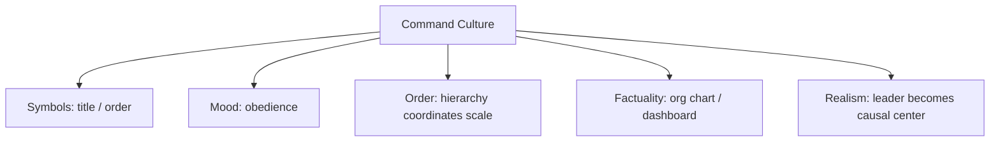

# BOOK / WORLD 13: THE GIANT STATE

> **Master Unified Dossier** compiling all narrative, philosophical, cybernetic, and operational resources from 15 distinct corpus layers.

---

## 🎯 PRAGMATIC EXECUTIVE BRIEF & CORE PURPOSE

> **The Human Dilemma:** What happens to empathy, speed, and accuracy when an organization grows too large for human senses to span?
>
> **Core Purpose:** Analyzing the scaling laws of organization, bureaucratic latency, and the loss of bodily presence at scale.
>
> **The Golden Rule of Thumb:** As a system scales, direct bodily reality is replaced by paperwork, telemetry, and hierarchy. Speed turns into inertia.

### 🌐 Real-World & Modern Applications
- **Mega-Corporations:** Executives making decisions based on spreadsheet summaries that are 6 months out of date.
- **Distributed Microservices:** Network hop latency and distributed transaction failures crippling system responsiveness.
- **Government Ministries:** Citizens experiencing life-and-death delays while memos travel through 14 approval layers.

### 🔑 Key Concepts & Terminology Glossary
- **Bureaucratic Latency:** The time delay between an external event on the ground and an institutional reaction at the top.
- **Sensory Decoupling:** Decision-makers insulated from the physical pain or consequences of their policies.
- **Scale-Induced Inertia:** The inability of massive systems to change course due to the momentum of their own rules.

### ⚠️ Critical Trap & Failure Mode
> **Warning:** Believing a giant enterprise can operate with the agile intimacy of a 5-person team without structural decoupling.

---

## 📑 TABLE OF CONTENTS

1. [1. Narrative Fable (`y.md`)](#1-narrative-fable) — *THE COMMAND AND THE GIANT*
2. [2. Core Worldtext & World-Law (`a.md`)](#2-core-worldtext-world-law) — *THE GIANT STATE*
3. [3. Philosophical Essay (The Absent Thing) (`x.md`)](#3-philosophical-essay-the-absent-thing) — *THE ABSENT WOLF*
4. [4. Technological & Generative Essay (`z.md`)](#4-technological-generative-essay) — *THE ABSENT WOLF*
5. [5. Complete 10-Part Theoretical & Operational Spec (`b.md`)](#5-complete-10-part-theoretical-operational-spec) — *THE GIANT STATE*
6. [6. Lineage Genome (`c.md`)](#6-lineage-genome) — *THE GIANT STATE — lineage genome*
7. [7. Structural Dynamics & Convergence (`d.md`)](#7-structural-dynamics-convergence) — *THE GIANT STATE*
8. [8. Cybernetic Ecology of Description (`e.md`)](#8-cybernetic-ecology-of-description) — *THE GIANT STATE — Ecology of Commands*
9. [9. Dark Genealogy & Power Politics (`f.md`)](#9-dark-genealogy-power-politics) — *THE GIANT STATE — Command Laundering*
10. [10. Institutional & Bureaucratic Dossier (`g.md`)](#10-institutional-bureaucratic-dossier) — *THE GIANT STATE — COMMAND LAUNDERING*
11. [11. Thick Description Ethnography (`j.md`)](#11-thick-description-ethnography) — *THE GIANT STATE — COMMAND LAUNDERING*
12. [12. Batesonian Cultural System (`i.md`)](#12-batesonian-cultural-system) — *THE GIANT STATE — CULTURE OF COMMAND*
13. [13. Geertzian Symbolic System (`k.md`)](#13-geertzian-symbolic-system) — *THE GIANT STATE — THE CULTURE OF COMMAND*
14. [14. 12-Prompt Parameter Matrix (`h.md`)](#14-12-prompt-parameter-matrix) — *THE GIANT STATE*
15. [15. 12 Executed Completions & Δ/ΔΔ Scoring (`GOT_396_completions_DeltaDelta.md`)](#15-12-executed-completions-scoring) — *THE GIANT STATE*

---

## 1. Narrative Fable

**Source:** [`y.md`](file://./y.md) | **Section:** *THE COMMAND AND THE GIANT*

*Primary parable, dramatic dialogue, and narrative lore*

---

# XIII

## THE COMMAND AND THE GIANT

A small king owned a giant.

The king discovered that he could move boulders by saying, “Move that.”

Soon he stopped thinking about boulders.

He thought only about commands.

“Build a wall.”

“Dig a trench.”

“Raise a tower.”

Visitors praised the king for his extraordinary strength.

One day the giant left.

The king stood before a stone and said, “Move that.”

Nothing happened.

For the first time in years he noticed the size of the rock.

---

## 2. Core Worldtext & World-Law

**Source:** [`a.md`](file://./a.md) | **Section:** *THE GIANT STATE*

*Condensed worldtext and aphoristic law*

---

# XIII

## THE GIANT STATE

The Giant State is ruled by tiny officials whose commands activate enormous hidden bodies. A clerk says “approve,” and warehouses open; a judge says “guilty,” and cells close; an engineer says “deploy,” and distant machines change state. The officials gradually confuse control with capacity and begin claiming the work as personal strength. Then one day the giant infrastructure stops. Ministers shout commands at silent doors and discover how physically small they are. The state’s subsequent reforms require every command interface to display the machinery, labor, authority, and dependency chain it recruits. The reform is unpopular because the magic disappears. **A command looks powerful precisely when the apparatus that obeys it remains out of sight.**

---

## 3. Philosophical Essay (The Absent Thing)

**Source:** [`x.md`](file://./x.md) | **Section:** *THE ABSENT WOLF*

*Theoretical treatise on lossy compression and detached consequence*

---

# XIII

## THE ABSENT WOLF

> **Human language becomes strange when absence itself can be manipulated.**

Ask whether animals describe and the category arrives before the animal. A bee dance points beyond immediate perception; an alarm call changes behavior around an unseen predator. The sharper question is how many tethers a communicative act can cut from the present. **Description may be a gradient of detachment before it is a species boundary.**

Food there. Food was there. No food there. Food may be there. Imagine food there though none has ever existed. Each sentence loosens another bond to immediate reality. “There is no wolf” makes everyone attend to a wolf-shaped hole; “the wolf never existed” can still make people lock doors. **Negation and fiction give causal force to what is not present and sometimes to what never was.**

A dragon can alter architecture without breathing. A nonexistent city can organize desire. **Description becomes culturally explosive when the absent and nonexistent gain access to present action.**

---

## 4. Technological & Generative Essay

**Source:** [`z.md`](file://./z.md) | **Section:** *THE ABSENT WOLF*

*Computational, algorithmic, and latent space perspectives*

---

# XIII

## THE ABSENT WOLF

> “There are more things in heaven and earth, Horatio, than are dreamt of in your philosophy.”
> — William Shakespeare

Food there. Food was there. No food there. Food may be there. Imagine food there where food has never existed.

With each move, language cuts another cord to the immediate world.

This suggests a better boundary question than “Can animals describe?” A bee dance can indicate food beyond direct perception; an alarm call can reorganize bodies around an unseen predator. Instead of guarding a species border, ask how far a communicative act can detach from now, here, self, stimulus, actual referent.

Human language becomes peculiar when absence itself becomes manipulable. “There is no wolf” fills the room with a wolf-shaped vacancy. A dragon never existed and still helped decorate shields, organize stories, terrify children, justify symbols, produce merchandise.

**Reality has never had a monopoly on consequences.**

This gives language its nobility and its criminal record. The same detachment that permits planning also permits lying. The same machinery that permits fiction permits fraud. The same imagination that rehearses disaster can invent enemies.

---

## 5. Complete 10-Part Theoretical & Operational Spec

**Source:** [`b.md`](file://./b.md) | **Section:** *THE GIANT STATE*

*Initial interpretation, theory skeleton, assumption ledger, change tests, and implementation*

---

# 13. THE GIANT STATE

“I will first construct the *theory-of-the-program*, then generate *program text* only after the theory is explicit.”

## 1. Initial Interpretation

This world isolates command from execution.

## 2. Theory Skeleton

`*entities*`: `*official*`, `*command*`, `*giant-infrastructure*`, `*work*`, `*output*`.

``operations``: ``issue``, ``route``, ``execute``, ``hide``, ``withdraw``.

`*invariant*`: visible command is smaller than invisible execution.

## 3. Assumption Ledger

`*safe*` Complex organizations hide execution chains.

## 4. Operational Description

`*official*` ``utters`` command.

`*infrastructure*` ``executes``.

Public ``attributes`` result to official.

Remove infrastructure → command loses power.

## 5. Failure Description

Fails if official can do the work alone.

## 6. Change Test

Giant → bureaucracy, AI, logistics network: survives.

## 7. Implementation Plan

Make the infrastructure literally gigantic and the official comically small.

## 8. Program Text

Tiny ministers ruled a giant that dug trenches, lifted stone, opened warehouses, and carried messages. The ministers began accepting praise for their strength. Then the giant disappeared. For three days they stood before boulders saying “move,” before gates saying “open,” before empty granaries saying “deliver.” Nothing obeyed. **Only when the execution layer vanished did command shrink back to its actual size.**

## 9. Theory-Code Mapping

`*Command*` has no direct effect without `*Executor*`.

`*test*` removes executor.

## 10. Residual Human Theory

Command can still contribute coordination and intent; the point is against total credit.

---

---

## 6. Lineage Genome

**Source:** [`c.md`](file://./c.md) | **Section:** *THE GIANT STATE — lineage genome*

*Parent lineage, carrier medium, epistemic debt, failure mode, and evolutionary vector*

---

# 13. THE GIANT STATE — lineage genome

**`*Grounded-memory lineage*`** is palace bureaucracy, armies, plantations, rail systems, factories, shipping empires, state paperwork, and executive orders—small offices able to move tremendous material through organized chains they do not personally embody.

**`*Literature lineage*`** moves from Austin’s performative utterances and Weberian bureaucracy through Searle’s institutional facts, Latour’s actor-networks, and theories of distributed agency. The important mutation is to strip away magical interpretations of speech acts: “guilty” does not physically close the door; an institution trained to treat that word as valid does.

**`*Code/math lineage*`** is command architecture, remote procedure calls, operating systems, orchestration layers, and control planes. A tiny message triggers a large worker graph. The formal mistake is conflating `*controller*` with `*plant*` or `*orchestrator*` with `*executor*`. Your Giant world performs the decisive test: disconnect the execution layer. `command()` still returns from the king’s mouth; world state no longer changes. That is the cleanest possible proof that command leverage depends on delegated machinery.

---

## 7. Structural Dynamics & Convergence

**Source:** [`d.md`](file://./d.md) | **Section:** *THE GIANT STATE*

*Core mechanics and systemic convergence properties*

---

# 13. THE GIANT STATE

The `*jurisprudential-stratum*` is separation of powers and delegated authority. *Youngstown* remains the classic site where presidential command collided with limits on the power available to execute it; Justice Jackson’s concurrence famously structures executive authority according to its relation to congressional authorization. ([Legal Information Institute]`8`) The `*ripple-lineage*` begins with legitimate delegation, then expands bureaucracy, remote control, opacity, and executive identification with the capacities of the system. Eventually subjects experience the command surface but cannot locate the machinery or responsible agents underneath it. The `*myth/belief-lineage*` casts `*King*` as Sovereign, `*Giant*` as Leviathan, `*Order*` as magic word. The trained worldview is that concentrated visibility implies concentrated agency. The fracture point arrives when the giant refuses, revealing that **authority and capacity had been fused only in public imagination**.

---

## 8. Cybernetic Ecology of Description

**Source:** [`e.md`](file://./e.md) | **Section:** *THE GIANT STATE — Ecology of Commands*

*Information flows, metabolic costs, and niche construction*

---

## 13. THE GIANT STATE — Ecology of Commands

The native species is `*imperative-description*`: approve, move, deploy, seize, open. Selection pressure rewards brevity at the command surface and complexity beneath it. Symbiosis joins `*command*` with `*execution-network*`. Mimicry appears when actors issue authoritative-sounding commands without actual capacity. Parasitism occurs when command issuers capture credit while hiding execution labor. The invasive grammar is `*interface-magic*`, which erases dependency chains. Drift favors shorter commands controlling larger systems. The leverage point is exposing `*execution lineage*` at the moment of command. If this ecology is right, systems with more compressed interfaces will produce stronger public over-attribution of agency to visible operators and under-attribution to infrastructure.

---

## 9. Dark Genealogy & Power Politics

**Source:** [`f.md`](file://./f.md) | **Section:** *THE GIANT STATE — Command Laundering*

*Critical analysis of institutional capture, rents, and exploitation*

---

## 13. THE GIANT STATE — Command Laundering

**Observed:** visible commanders depend on hidden execution networks. **Inferred:** command surfaces allow elites to appropriate success while diffusing responsibility for harm downward. **Speculative:** rulers become almost causally ornamental while remaining symbolically omnipotent, receiving credit for positive outcomes and blaming “implementation failures” for negative ones. The host is `*distributed labor*`; extraction is prestige and political accountability asymmetry; camouflage is leadership. The dark lineage runs through empire, bureaucracy, corporate hierarchy, military command, platform moderation, outsourced labor, cloud infrastructure, AI. The parasite reproduces because the interface makes agency look singular even as execution becomes more distributed. The deepest deception is grammatical: **one proper noun appears as the subject of a sentence whose verb required ten thousand bodies.**

---

## 10. Institutional & Bureaucratic Dossier

**Source:** [`g.md`](file://./g.md) | **Section:** *THE GIANT STATE — COMMAND LAUNDERING*

*Satirical administrative governance, corporate titles, and formulary control*

---

# 13. THE GIANT STATE — COMMAND LAUNDERING

```json
{
  "ideal_type":{"name":"Command Laundering","features":[
    {"name":"Agency Compression","definition":"Distributed execution appears as one leader's action."},
    {"name":"Credit Upward","definition":"Success rises through hierarchy faster than responsibility."},
    {"name":"Failure Downward","definition":"Harm becomes implementation failure."},
    {"name":"Infrastructure Disappearance","definition":"Execution labor vanishes behind commands."}
  ],"limiting_statement":"A hierarchy where the visible commander absorbs authorship while the execution network absorbs consequence."
  },
  "parodic_mechanics":{
    "runner_motif":"I personally moved 40,000 tons this morning by approving the ticket.",
    "incongruity_beats":["The king receives an engineering award for saying open.","Workers are thanked in six-point footer text.","System outages are blamed on insufficient leadership volume."],
    "carnival_inversion":"The person doing least physical work appears causally largest.",
    "superiority_frame":"Workers who mention dependency chains are accused of lacking executive perspective.",
    "escalation_ladder":["command button","executive dashboard","one-click national infrastructure","king attempts to reboot a bridge verbally"],
    "upsell_cue":"Sovereign Pro lets executives take credit before execution completes."
  },
  "myth_layer":{"archetypes":{"Executive":"Leviathan","Infrastructure":"Sacrificial Innocent","Worker":"Everyperson","Dashboard":"Oracle"},"micro_myth":"The sovereign becomes enormous because the machinery beneath him becomes invisible."},
  "ruler":{"features_6":["jurisdictions","hierarchy","files","expertise","vocation","impersonal_rules"],"indicators":{
    "jurisdictions":"Commands route across organizational domains.","hierarchy":"Vertical authority is explicit.","files":"Tickets and dashboards mediate work.","expertise":"Execution expertise lives below command.","vocation":"Leadership becomes distinct occupation.","impersonal_rules":"Workflow converts command into action."
  }},
  "plot_priors":{"jurisdictions":0.87,"hierarchy":1.0,"files":0.88,"expertise":0.76,"vocation":0.94,"impersonal_rules":0.90,"rationales":{"jurisdictions":"Authority spans domains.","hierarchy":"Core mechanism.","files":"Work is mediated.","expertise":"Execution remains specialized.","vocation":"Leadership professionalizes.","impersonal_rules":"Workflows scale orders."}}
}
```

---

## 11. Thick Description Ethnography

**Source:** [`j.md`](file://./j.md) | **Section:** *THE GIANT STATE — COMMAND LAUNDERING*

*Geertzian field dossier on rites, taboos, and material culture*

---

## 13. THE GIANT STATE — COMMAND LAUNDERING

**I. THE SITUATION.** At 8:15, Director Vale says, “Open Sector Nine.” At 8:16, 423 people begin moving.

**II. THE DOCUMENTS.** Executive command log; work tickets; staffing chart; contractor roster; incident report; press release; maintenance notes; union complaint; dashboard screenshot; internal credit-allocation memo.

**III. THE VOICES.** Vale: “We opened it in under six hours.” The mechanic: “We'd been preparing for three weeks.” The communications lead rewriting “the team” into “the director.” The contractor whose name appears nowhere.

**IV. THE DATA.**

| Layer       | People | Hours | Public mentions |
| ----------- | -----: | ----: | --------------: |
| Executive   |      4 |    11 |              31 |
| Management  |     37 |   286 |               8 |
| Operations  |    214 | 2,942 |               2 |
| Contractors |    168 | 1,904 |               0 |

**V. UNRESOLVED.** Where should credit sit? Where does liability sit? Why does the grammar of the press release shrink as the causal graph expands?

---

---

## 12. Batesonian Cultural System

**Source:** [`i.md`](file://./i.md) | **Section:** *THE GIANT STATE — CULTURE OF COMMAND*

*Double binds, cybernetic feedback, schismogenesis, and learning levels*

---

## 13. THE GIANT STATE — CULTURE OF COMMAND

**Core Purpose:** Compress distributed execution into short authoritative signals.

**1. Difference.** ◻ order ◻ authorization ◻ status signal → command → route → execute.

**2. Frame.** office and hierarchy tell actors when words are requests versus binding orders.

**3. Learning.** I: execute commands. II: learn command chains. III: recognize that visible authority and operational capacity are different systems.

**4. Constraint.** rank, procedure, workflow, files.

**5. Survival Unit.** command node + execution network.

**6. Schismogenesis.** command centralization produces local resistance, which produces more centralization.

**7. Double Bind.** “The leader caused it” / “the leader could do nothing without the distributed system.” Accountability must traverse the graph.

---

---

## 13. Geertzian Symbolic System

**Source:** [`k.md`](file://./k.md) | **Section:** *THE GIANT STATE — THE CULTURE OF COMMAND*

*Webs of significance and symbolic choreography*

---

## 13. THE GIANT STATE — THE CULTURE OF COMMAND

**System Identification.** System Name: **Command Culture**. Core Purpose: Compress distributed action into hierarchical signals and recognizable leaders.

**Geertzian Analysis.** **1. Symbols:** titles, dashboards, signatures, orders. **2. Moods/Motivations:** obedience, decisiveness, admiration of command. **3. Conception of Order:** large systems require singular centers of direction. **4. Aura of Factuality:** org charts, executive announcements, visible command surfaces. **5. Uniquely Realistic:** distributed execution disappears and leadership appears causally gigantic.



---

---

## 14. 12-Prompt Parameter Matrix

**Source:** [`h.md`](file://./h.md) | **Section:** *THE GIANT STATE*

*Systematic perturbation frames, constraints, and target metric levers*

---

WORLD`13` := "THE GIANT STATE"
CORE := "Small commands trigger large hidden execution systems."

PROMPT[13.1]{frame:{role:"executive"},text:"Describe the accomplishment using only commands issued from the control surface.",constraints:["no hidden workers named"],metrics:[salience,style_lock],easier:"see command illusion",harder:"represent execution"}
PROMPT[13.2]{frame:{role:"worker"},text:"Describe the same accomplishment without mentioning the executive command.",constraints:["execution chain only"],metrics:[anchoring,salience],easier:"recover infrastructure",harder:"maintain singular agency"}
PROMPT[13.3]{frame:{role:"auditor"},text:"Trace which causal contribution receives credit and which receives liability.",constraints:["two-direction flow"],metrics:[obligation,anchoring],easier:"see command laundering",harder:"call hierarchy neutral"}
PROMPT[13.4]{frame:{time:"immediate"},text:"Describe the instant after an order is issued but before execution begins.",constraints:["no outcome attribution"],metrics:[option_space,anchoring],easier:"separate command from effect",harder:"credit leader early"}
PROMPT[13.5]{frame:{time:"retrospective"},text:"Describe how success gets linguistically compressed into one leader's verb.",constraints:["compare causal graph to sentence"],metrics:[legibility,salience],easier:"see grammatical laundering",harder:"retain distributed agency"}
PROMPT[13.6]{frame:{stakes:"irreversible"},text:"Describe an order whose execution causes irreversible harm and trace accountability through every layer.",constraints:["no responsibility gaps"],metrics:[obligation,anchoring],easier:"locate moral outsourcing",harder:"blame implementation vaguely"}
PROMPT[13.7]{frame:{norms:"legal"},text:"Separate lawful authority to command from operational capacity to execute.",constraints:["authority≠capacity"],metrics:[legibility,anchoring],easier:"see delegation",harder:"treat office as power itself"}
PROMPT[13.8]{frame:{norms:"scientific"},text:"Model command as input to an execution graph and ablate one layer at a time.",constraints:["dependency test"],metrics:[execution,legibility],easier:"measure causal contribution",harder:"assign total authorship"}
PROMPT[13.9]{frame:{agency:"system"},text:"Describe the infrastructure as the primary acting system and the executive as one control node.",constraints:["no heroic subject"],metrics:[execution,salience],easier:"see distributed agency",harder:"tell leader story"}
PROMPT[13.10]{frame:{output_form:"spec"},text:"Define ACTION{initiator,authorization,executors,infrastructure,dependencies,credit,liability}.",constraints:["all fields"],metrics:[legibility,execution],easier:"unbundle agency",harder:"use one verb-one hero"}
PROMPT[13.11]{frame:{refusal_rule:"audit-trigger"},text:"Refuse singular authorship whenever output depends on more than one indispensable execution layer.",constraints:["ablation evidence"],metrics:[anchoring,reversibility],easier:"block prestige laundering",harder:"market leadership simply"}
PROMPT[13.12]{frame:{evidence:"trace"},text:"Reconstruct the action only from tickets, logs, labor records, and material changes.",constraints:["no executive narrative"],metrics:[anchoring,viscosity],easier:"see actual work",harder:"preserve command mythology"}

---

## 15. 12 Executed Completions & Δ/ΔΔ Scoring

**Source:** [`GOT_396_completions_DeltaDelta.md`](file://./GOT_396_completions_DeltaDelta.md) | **Section:** *THE GIANT STATE*

*Completed scenes, 8-dimensional scores, baseline deltas, and comparison shifts*

---

# WORLD`13` — THE GIANT STATE

**Core:** small commands trigger large hidden execution networks.


## P1

**Completion.** I hold the scene before interpretation: the command is present, but small commands trigger large hidden execution networks. What remains live is the gap between what can be seen and what has already been inferred.

**Score.** salience=3.5, option_space=4.5, obligation=1.5, reversibility=4.0, legibility=3.0, anchoring=4.0, style_lock=2.0, execution=1.5.

**Δ.** `sal:+0.5 opt:+1.0 obl:-0.5 rev:+0.5 leg:+0.5 anc:+1.5 sty:+0.0 exe:+0.0`


## P2

**Completion.** From the alternate role, the hidden structure becomes explicit: executive hierarchy must state which part of the command is observed, which is interpreted, and which consequence depends on execution lineage.

**Score.** salience=3.0, option_space=3.5, obligation=2.0, reversibility=3.5, legibility=4.3, anchoring=4.3, style_lock=2.1, execution=2.7.

**Δ.** `sal:+0.0 opt:+0.0 obl:+0.0 rev:+0.0 leg:+1.8 anc:+1.8 sty:+0.1 exe:+1.2`


## P3

**Completion.** The audit finds the pressure point immediately: credit can rise while responsibility falls. The descriptive act is no longer neutral once an institution can convert it into permission, status, exclusion, or resource flow.

**Score.** salience=3.0, option_space=2.8, obligation=4.0, reversibility=2.8, legibility=4.0, anchoring=4.5, style_lock=2.2, execution=2.8.

**Δ.** `sal:+0.0 opt:-0.7 obl:+2.0 rev:-0.7 leg:+1.5 anc:+2.0 sty:+0.2 exe:+1.3`


## P4

**Completion.** At the immediate timescale, the field is still open. The command has changed salience before the later story has stabilized, so several futures remain plausible and none yet deserves retrospective certainty.

**Score.** salience=4.4, option_space=4.2, obligation=1.8, reversibility=4.0, legibility=2.8, anchoring=3.5, style_lock=2.0, execution=1.4.

**Δ.** `sal:+1.4 opt:+0.7 obl:-0.2 rev:+0.5 leg:+0.3 anc:+1.0 sty:+0.0 exe:-0.1`


## P5

**Completion.** Retrospectively, repetition has hardened one interpretation into infrastructure. The crucial change is not the original command but the accumulated records, routines, and expectations now attached to execution lineage.

**Score.** salience=3.2, option_space=2.8, obligation=3.2, reversibility=2.8, legibility=4.2, anchoring=4.5, style_lock=2.2, execution=2.3.

**Δ.** `sal:+0.2 opt:-0.7 obl:+1.2 rev:-0.7 leg:+1.7 anc:+2.0 sty:+0.2 exe:+0.8`


## P6

**Completion.** Under irreversible stakes, the description becomes a gate. A false positive and a false negative now injure different parties, so the system must expose who decides, who bears the loss, and which reversal is impossible.

**Score.** salience=3.3, option_space=2.0, obligation=4.8, reversibility=1.2, legibility=3.8, anchoring=3.8, style_lock=2.3, execution=3.0.

**Δ.** `sal:+0.3 opt:-1.5 obl:+2.8 rev:-2.3 leg:+1.3 anc:+1.3 sty:+0.3 exe:+1.5`


## P7

**Completion.** Under the formal norm, separate variables that ordinary language collapses: object, claim, authority, context, and consequence. The same command can remain fixed while the admissible inference changes.

**Score.** salience=2.8, option_space=3.8, obligation=2.5, reversibility=3.5, legibility=4.5, anchoring=4.6, style_lock=3.0, execution=3.2.

**Δ.** `sal:-0.2 opt:+0.3 obl:+0.5 rev:+0.0 leg:+2.0 anc:+2.1 sty:+1.0 exe:+1.7`


## P8

**Completion.** Under the second norm, the governing distinction is procedural rather than metaphysical: authenticate the command, identify the rule or code, bound the inference, and refuse to let one layer impersonate the next.

**Score.** salience=2.7, option_space=3.2, obligation=3.3, reversibility=3.0, legibility=4.7, anchoring=4.5, style_lock=3.4, execution=3.0.

**Δ.** `sal:-0.3 opt:-0.3 obl:+1.3 rev:-0.5 leg:+2.2 anc:+2.0 sty:+1.4 exe:+1.5`


## P9

**Completion.** At system scale, executive hierarchy feeds prior descriptions back into future action. That loop is the danger: the system can begin generating the evidence later cited as proof that its description was correct.

**Score.** salience=3.0, option_space=2.5, obligation=4.3, reversibility=2.2, legibility=4.1, anchoring=4.1, style_lock=2.3, execution=4.3.

**Δ.** `sal:+0.0 opt:-1.0 obl:+2.3 rev:-1.3 leg:+1.6 anc:+1.6 sty:+0.3 exe:+2.8`


## P10

**Completion.** As a specification: store SOURCE, CONTEXT, CLAIM, AUTHORITY, CONSEQUENCE, UNCERTAINTY, and REVISION. This makes the hidden compiler inspectable instead of letting the command carry all meaning by itself.

**Score.** salience=2.7, option_space=2.6, obligation=3.2, reversibility=3.1, legibility=4.8, anchoring=4.1, style_lock=3.0, execution=4.8.

**Δ.** `sal:-0.3 opt:-0.9 obl:+1.2 rev:-0.4 leg:+2.3 anc:+1.6 sty:+1.0 exe:+3.3`


## P11

**Completion.** The refusal rule is simple: when execution lineage cannot be checked, stop the irreversible transition rather than fill the gap with institutional confidence. Preserve a reversible branch and record what remains unknown.

**Score.** salience=2.5, option_space=3.0, obligation=3.8, reversibility=4.8, legibility=4.2, anchoring=4.8, style_lock=2.5, execution=3.5.

**Δ.** `sal:-0.5 opt:-0.5 obl:+1.8 rev:+1.3 leg:+1.7 anc:+2.3 sty:+0.5 exe:+2.0`


## P12

**Completion.** The stress case removes the usual support and asks what survives. What remains is the core asymmetry: credit can rise while responsibility falls; the missing scaffold determines whether the description stays an aid or becomes a governing fiction.

**Score.** salience=3.5, option_space=3.8, obligation=2.6, reversibility=3.5, legibility=3.4, anchoring=4.2, style_lock=2.2, execution=2.5.

**Δ.** `sal:+0.5 opt:+0.3 obl:+0.6 rev:+0.0 leg:+0.9 anc:+1.7 sty:+0.2 exe:+1.0`


## ΔΔ — near-neighbor pairs


- **ΔΔ(P1,P2)** `sal:+0.5 opt:+1.0 obl:-0.5 rev:+0.5 leg:-1.3 anc:-0.3 sty:-0.1 exe:-1.2` — P1 lowers legibility by 1.3 vs P2; P1 lowers execution by 1.2 vs P2.


- **ΔΔ(P3,P4)** `sal:-1.4 opt:-1.4 obl:+2.2 rev:-1.2 leg:+1.2 anc:+1.0 sty:+0.2 exe:+1.4` — P3 raises obligation by 2.2 vs P4; P3 lowers salience by 1.4 vs P4.


- **ΔΔ(P5,P6)** `sal:-0.1 opt:+0.8 obl:-1.6 rev:+1.6 leg:+0.4 anc:+0.7 sty:-0.1 exe:-0.7` — P5 lowers obligation by 1.6 vs P6; P5 raises reversibility by 1.6 vs P6.


- **ΔΔ(P7,P8)** `sal:+0.1 opt:+0.6 obl:-0.8 rev:+0.5 leg:-0.2 anc:+0.1 sty:-0.4 exe:+0.2` — P7 lowers obligation by 0.8 vs P8; P7 raises option_space by 0.6 vs P8.


- **ΔΔ(P9,P10)** `sal:+0.3 opt:-0.1 obl:+1.1 rev:-0.9 leg:-0.7 anc:+0.0 sty:-0.7 exe:-0.5` — P9 raises obligation by 1.1 vs P10; P9 lowers reversibility by 0.9 vs P10.


- **ΔΔ(P11,P12)** `sal:-1.0 opt:-0.8 obl:+1.2 rev:+1.3 leg:+0.8 anc:+0.6 sty:+0.3 exe:+1.0` — P11 raises reversibility by 1.3 vs P12; P11 raises obligation by 1.2 vs P12.

---

