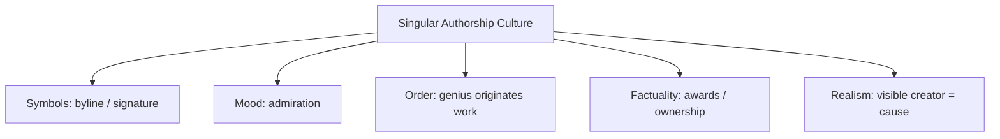

# BOOK / WORLD 14: THE ELEVATOR SCHOOL OF AUTHORSHIP

> **Master Unified Dossier** compiling all narrative, philosophical, cybernetic, and operational resources from 15 distinct corpus layers.

---

## 🎯 PRAGMATIC EXECUTIVE BRIEF & CORE PURPOSE

> **The Human Dilemma:** What essential truths are murdered when we force every complex idea into a 30-second pitch or 3-bullet slide?
>
> **Core Purpose:** Deconstructing compression, elevator pitches, executive summaries, and the mutilation of complex thought.
>
> **The Golden Rule of Thumb:** Compression makes ideas portable, but hyper-compression strips out the boundary conditions that make the idea safe.

### 🌐 Real-World & Modern Applications
- **Startup Pitch Decks:** Promising miraculous market domination while omitting all the brutal unit-economic friction.
- **Executive Summaries:** Boiling a 100-page engineering risk analysis into a green dashboard square that hides impending disaster.
- **Social Media Headlines:** Sensationalizing nuanced scientific studies into viral 280-character soundbites.

### 🔑 Key Concepts & Terminology Glossary
- **Lossy Seduction:** The persuasive appeal of a simplified soundbite that conceals hazardous missing details.
- **Boundary Stripping:** Removing the caveats, limits, and edge cases to make a claim sound universal.
- **Executive Mutilation:** Destroying the internal coherence of a proposal to fit arbitrary briefing formats.

### ⚠️ Critical Trap & Failure Mode
> **Warning:** Investing in a project based on the elegance of its summary rather than the resilience of its messy details.

---

## 📑 TABLE OF CONTENTS

1. [1. Narrative Fable (`y.md`)](#1-narrative-fable) — *THE ELEVATOR POET*
2. [2. Core Worldtext & World-Law (`a.md`)](#2-core-worldtext-world-law) — *THE ELEVATOR SCHOOL OF AUTHORSHIP*
3. [3. Philosophical Essay (The Absent Thing) (`x.md`)](#3-philosophical-essay-the-absent-thing) — *THE MAP THAT BURIES THE KINGDOM*
4. [4. Technological & Generative Essay (`z.md`)](#4-technological-generative-essay) — *THE MAP*
5. [5. Complete 10-Part Theoretical & Operational Spec (`b.md`)](#5-complete-10-part-theoretical-operational-spec) — *THE ELEVATOR SCHOOL OF AUTHORSHIP*
6. [6. Lineage Genome (`c.md`)](#6-lineage-genome) — *THE ELEVATOR SCHOOL OF AUTHORSHIP — lineage genome*
7. [7. Structural Dynamics & Convergence (`d.md`)](#7-structural-dynamics-convergence) — *THE ELEVATOR SCHOOL OF AUTHORSHIP*
8. [8. Cybernetic Ecology of Description (`e.md`)](#8-cybernetic-ecology-of-description) — *THE ELEVATOR SCHOOL OF AUTHORSHIP — Ecology of Credit*
9. [9. Dark Genealogy & Power Politics (`f.md`)](#9-dark-genealogy-power-politics) — *THE ELEVATOR SCHOOL OF AUTHORSHIP — Prestige Laundering*
10. [10. Institutional & Bureaucratic Dossier (`g.md`)](#10-institutional-bureaucratic-dossier) — *THE ELEVATOR SCHOOL OF AUTHORSHIP — LAST-CLICK GENIUS*
11. [11. Thick Description Ethnography (`j.md`)](#11-thick-description-ethnography) — *THE ELEVATOR SCHOOL OF AUTHORSHIP — LAST-CLICK GENIUS*
12. [12. Batesonian Cultural System (`i.md`)](#12-batesonian-cultural-system) — *THE ELEVATOR SCHOOL OF AUTHORSHIP — CULTURE OF CREDIT*
13. [13. Geertzian Symbolic System (`k.md`)](#13-geertzian-symbolic-system) — *THE ELEVATOR SCHOOL OF AUTHORSHIP — THE CULTURE OF GENIUS*
14. [14. 12-Prompt Parameter Matrix (`h.md`)](#14-12-prompt-parameter-matrix) — *THE ELEVATOR SCHOOL OF AUTHORSHIP*
15. [15. 12 Executed Completions & Δ/ΔΔ Scoring (`GOT_396_completions_DeltaDelta.md`)](#15-12-executed-completions-scoring) — *THE ELEVATOR SCHOOL OF AUTHORSHIP*

---

## 1. Narrative Fable

**Source:** [`y.md`](file://./y.md) | **Section:** *THE ELEVATOR POET*

*Primary parable, dramatic dialogue, and narrative lore*

---

# XIV

## THE ELEVATOR POET

A poet entered a tower, pressed the button marked 80, and rose eight hundred feet.

At the top he wrote:

*I lifted myself above the city.*

The elevator engineer happened to be standing beside him.

She read the line and laughed.

The poet became offended.

“It is metaphor.”

“Good,” she said. “Keep it that way.”

Years later machines began producing paintings, houses, music, and code from short prompts.

The poet's descendants called themselves builders.

The elevator engineer's descendants laughed again.

---

## 2. Core Worldtext & World-Law

**Source:** [`a.md`](file://./a.md) | **Section:** *THE ELEVATOR SCHOOL OF AUTHORSHIP*

*Condensed worldtext and aphoristic law*

---

# XIV

## THE ELEVATOR SCHOOL OF AUTHORSHIP

At the Elevator School, students receive enormous machines with one-button controls and are graded on the outputs. One presses 80 and writes an essay titled *My Ascent*. Another presses GENERATE and submits a cathedral. Another types “haunting violin music” and signs the score. The engineers who built the systems attend graduation silently. Eventually a janitor proposes an authorship test: remove the hidden machinery and ask the claimant to reproduce the result. The school nearly closes. It survives by introducing a new distinction between initiating, specifying, selecting, executing, constructing, and maintaining. **The person nearest the command remains causally relevant without becoming the sole source of what answered.**

---

## 3. Philosophical Essay (The Absent Thing)

**Source:** [`x.md`](file://./x.md) | **Section:** *THE MAP THAT BURIES THE KINGDOM*

*Theoretical treatise on lossy compression and detached consequence*

---

# XIV

## THE MAP THAT BURIES THE KINGDOM

> **Description works because it is smaller than what it carries.**

Maps distort geometry and improve navigation. The Underground bends London until movement becomes legible. A description can become more useful by becoming less like what it describes because resemblance is only one criterion among many. **Good distortion can preserve the relation that matters.**

A complete map would need weather, insects, smells, delays, molecules, memories, every change happening while the map was made. Soon it would require the territory itself. Lay a one-to-one map over the kingdom and rain gathers in its folds, roads vanish beneath printed roads, mildew eats coastlines. **Perfect description collapses into duplication and loses the distance that made description useful.**

The hunter cannot carry the valley home. He carries a sentence. The botanist, cook, poison nurse, goat, and child each need different parts of the same plant. **Adequacy belongs to use: description sacrifices fullness so consequence can travel.**

---

## 4. Technological & Generative Essay

**Source:** [`z.md`](file://./z.md) | **Section:** *THE MAP*

*Computational, algorithmic, and latent space perspectives*

---

# XIV

## THE MAP

> “The map is not the territory.”
> — Alfred Korzybski

The London Underground map lies about London. Thank God. A geographically faithful map would often be worse at the job riders need done. Distortion can preserve the relation that matters.

Description is therefore not graded on resemblance alone. A useful account may omit most visible features, alter scale, flatten geometry, convert continuous processes into categories. The question is not simply “How much did it preserve?” but “What can someone now do with what it preserved?”

A complete map would need every smell, insect, temperature, delay, memory, molecule, conversation, alteration occurring during the act of mapping. Soon the map would require London itself.

Lay a one-to-one map over the kingdom. Rain collects in the folds. Roads disappear beneath printed roads. Mildew eats the coastline. Villagers lift sections merely to get home. **Perfect description buries the territory under its own accuracy.**

The hunter cannot carry the valley home. He carries a sentence. Description works because it is smaller than the thing.

---

## 5. Complete 10-Part Theoretical & Operational Spec

**Source:** [`b.md`](file://./b.md) | **Section:** *THE ELEVATOR SCHOOL OF AUTHORSHIP*

*Initial interpretation, theory skeleton, assumption ledger, change tests, and implementation*

---

# 14. THE ELEVATOR SCHOOL OF AUTHORSHIP

“I will first construct the *theory-of-the-program*, then generate *program text* only after the theory is explicit.”

## 1. Initial Interpretation

This program decomposes authorship into causal roles.

## 2. Theory Skeleton

`*entities*`: `*initiator*`, `*specifier*`, `*system-builder*`, `*executor*`, `*selector*`, `*output*`.

``operations``: ``request``, ``design-capability``, ``execute``, ``select``, ``claim-credit``.

`*invariant*`: no single role automatically owns the whole causal chain.

## 3. Assumption Ledger

`*safe*` Complex artifacts distribute contribution.

`*uncertain*` Credit remains culturally negotiated.

## 4. Operational Description

`*initiator*` ``requests``.

`*system-builder*` previously ``creates-capability``.

`*executor*` ``produces``.

`*selector*` ``chooses``.

Authorship claim ``compresses`` chain.

## 5. Failure Description

Fails if all roles genuinely belong to one person.

## 6. Change Test

AI image → film or architecture: survives.

## 7. Implementation Plan

Turn a one-button interface into an authorship trap.

## 8. Program Text

At the Elevator School, students received machines with one-button controls. One pressed 80 and submitted an essay titled *My Ascent*. Another pressed GENERATE and submitted a cathedral. A third selected one melody from a thousand and signed the score. The school awarded prizes until a janitor proposed a simple exam: remove the hidden machinery and ask each author to reproduce the achievement. Enrollment dropped. The curriculum changed. **Students were thereafter required to distinguish initiating, specifying, selecting, executing, building the system, and maintaining the system before using the word mine.**

## 9. Theory-Code Mapping

Each contribution is its own `*Role*`.

`*AuthorshipClaim*` references a set of roles.

## 10. Residual Human Theory

Causal contribution and artistic authorship still do not map one-to-one.

---

---

## 6. Lineage Genome

**Source:** [`c.md`](file://./c.md) | **Section:** *THE ELEVATOR SCHOOL OF AUTHORSHIP — lineage genome*

*Parent lineage, carrier medium, epistemic debt, failure mode, and evolutionary vector*

---

# 14. THE ELEVATOR SCHOOL OF AUTHORSHIP — lineage genome

**`*Grounded-memory lineage*`** runs through workshops, architecture offices, film sets, printing shops, orchestras, laboratories, industrial design, photography, and every field where one visible signature sits atop distributed production.

**`*Literature lineage*`** includes Barthes/Foucault on authorship, Becker’s *Art Worlds*, Latour on distributed agency, and contemporary debates around prompting and creative credit. The deeper ancestor is action theory’s decomposition of what counts as an intentional action under different descriptions; philosophy of action explicitly distinguishes different ways bodily and extended actions are individuated and attributed. ([Stanford Encyclopedia of Philosophy]`10`)

**`*Code/math lineage*`** is provenance graphs and contribution DAGs. Replace binary `author/not-author` with typed edges: ``initiates``, ``specifies``, ``implements``, ``trains``, ``selects``, ``maintains``, ``executes``. The Elevator School’s mutation is therefore ontological rather than moral: it creates a **richer causal type system** before debating credit. The test is remove-one-role ablation: if the output survives without the prompter but not without the underlying model or craft system, that tells us something about dependency without alone settling artistic authorship.

---

## 7. Structural Dynamics & Convergence

**Source:** [`d.md`](file://./d.md) | **Section:** *THE ELEVATOR SCHOOL OF AUTHORSHIP*

*Core mechanics and systemic convergence properties*

---

# 14. THE ELEVATOR SCHOOL OF AUTHORSHIP

The `*jurisprudential-stratum*` is copyright’s struggle to identify legally cognizable authorship. *Burrow-Giles* recognized copyright in Sarony’s photograph through his creative choices in arranging and producing it, while *Feist* rejects mere industrious collection and locates originality in selection, coordination, and arrangement rather than facts themselves. ([Legal Information Institute]`9`) The `*ripple-lineage*` begins with tool-assisted authorship, then more capable tools, then interfaces that compress visible effort, then prestige systems that continue allocating credit using older assumptions about visible labor. The `*myth/belief-lineage*` casts `*Prompt User*` as Genius, `*Machine*` as Invisible Chorus, `*Dataset/Infrastructure*` as buried Scenius. The myth makes interface proximity look like authorship proximity. Your mutation is not to deny the prompter agency; it is to expose authorship as a **contested allocation across a causal graph**.

---

## 8. Cybernetic Ecology of Description

**Source:** [`e.md`](file://./e.md) | **Section:** *THE ELEVATOR SCHOOL OF AUTHORSHIP — Ecology of Credit*

*Information flows, metabolic costs, and niche construction*

---

## 14. THE ELEVATOR SCHOOL OF AUTHORSHIP — Ecology of Credit

The native species is `*contribution-description*`: initiated by, designed by, implemented by, selected by, trained on, maintained by. The climate is status scarcity. Predation occurs when one authorship category consumes all others. Mimicry occurs when minimal participation adopts the outward signs of deeper contribution. Parasitism occurs when invisible labor sustains prestige allocated elsewhere. The invasive grammar is `*singular-genius-description*`, extraordinarily fit for publicity because it compresses a distributed causal network into one memorable person. Drift favors increasingly contested credit as generative systems separate initiation from execution. The leverage point is typed provenance for contributions. If this ecology is right, disputes around AI authorship will increasingly shift from “human or machine?” toward finer disputes over specification, selection, training, curation, and execution.

---

## 9. Dark Genealogy & Power Politics

**Source:** [`f.md`](file://./f.md) | **Section:** *THE ELEVATOR SCHOOL OF AUTHORSHIP — Prestige Laundering*

*Critical analysis of institutional capture, rents, and exploitation*

---

## 14. THE ELEVATOR SCHOOL OF AUTHORSHIP — Prestige Laundering

**Observed:** causal production is distributed while credit can be concentrated. **Inferred:** systems with compressed interfaces enable contribution laundering at unprecedented scale. **Speculative:** elite users become “creators” chiefly by commanding infrastructures built from hidden labor, public culture, unpaid contributors, model training corpora, supply chains, and energy while social recognition flows toward the last visible click. The host is `*collective production*`; extraction is status and ownership; camouflage is creativity. The dark lineage includes studio systems, scientific ghost labor, colonial collecting, workshop masters, venture mythology, corporate founder narratives, and AI prompting. The autopoietic loop is prestige itself: celebrated users attract better tools and collaborators, which improve outputs, which appear to confirm individual genius. **The elevator rises; the passenger becomes famous for altitude.**

---

## 10. Institutional & Bureaucratic Dossier

**Source:** [`g.md`](file://./g.md) | **Section:** *THE ELEVATOR SCHOOL OF AUTHORSHIP — LAST-CLICK GENIUS*

*Satirical administrative governance, corporate titles, and formulary control*

---

# 14. THE ELEVATOR SCHOOL OF AUTHORSHIP — LAST-CLICK GENIUS

```json
{
  "ideal_type":{"name":"Last-Click Genius","features":[
    {"name":"Interface Proximity","definition":"Nearest visible action receives authorship prestige."},
    {"name":"Labor Camouflage","definition":"Upstream contributors disappear behind finished output."},
    {"name":"Causal Flattening","definition":"Distinct forms of contribution collapse into one byline."},
    {"name":"Prestige Compounding","definition":"Prior credit purchases better future production machinery."}
  ],"limiting_statement":"An authorship regime that mistakes last visible causation for total creative origin."
  },
  "parodic_mechanics":{
    "runner_motif":"I made this by requesting it with extraordinary precision.",
    "incongruity_beats":["Elevator passengers publish altitude portfolios.","Prompt typography wins architecture prizes.","The training corpus receives a group photo invitation but no seat."],
    "carnival_inversion":"The consumer of infrastructure becomes its genius author.",
    "superiority_frame":"Anyone discussing upstream labor is accused of being anti-creativity.",
    "escalation_ladder":["one-click art","one-click building","one-click scientific discovery","founder claims authorship of electricity"],
    "upsell_cue":"Genius Pro automatically removes collaborators from provenance."
  },
  "myth_layer":{"archetypes":{"Prompter":"Disruptor","Infrastructure":"Sacrificial Innocent","Model":"Oracle","Audience":"Everyperson"},"micro_myth":"The genius is whoever stands closest to the button when the miracle becomes visible."},
  "ruler":{"features_6":["jurisdictions","hierarchy","files","expertise","vocation","impersonal_rules"],"indicators":{
    "jurisdictions":"Credit differs by institution.","hierarchy":"Prestige concentrates upward.","files":"Contribution provenance may be hidden.","expertise":"Interface skill gains status.","vocation":"Prompting becomes identity category.","impersonal_rules":"Platforms default to single-owner output."
  }},
  "plot_priors":{"jurisdictions":0.62,"hierarchy":0.87,"files":0.70,"expertise":0.75,"vocation":0.71,"impersonal_rules":0.63,"rationales":{"jurisdictions":"Norms vary.","hierarchy":"Credit concentrates.","files":"Provenance exists but is weak.","expertise":"New expertise claims emerge.","vocation":"Role professionalizes.","impersonal_rules":"Platform defaults matter."}}
}
```

---

## 11. Thick Description Ethnography

**Source:** [`j.md`](file://./j.md) | **Section:** *THE ELEVATOR SCHOOL OF AUTHORSHIP — LAST-CLICK GENIUS*

*Geertzian field dossier on rites, taboos, and material culture*

---

## 14. THE ELEVATOR SCHOOL OF AUTHORSHIP — LAST-CLICK GENIUS

**I. THE SITUATION.** The artifact appears after a four-word instruction. The instruction is photographed. The infrastructure is not.

**II. THE DOCUMENTS.** Prompt log; model documentation; dataset provenance summary; contractor handbook; creator interview; award submission; licensing terms; revision history; human-curation notes; public byline.

**III. THE VOICES.** The “creator” describing the decisive prompt. The curator who rejected 417 outputs. The engineer who built the system. A contributor whose work entered the training corpus and has never heard of the final artifact.

**IV. THE DATA.**

| Contribution        |   Hours | Decision leverage | Public credit |
| ------------------- | ------: | ----------------: | ------------: |
| Prompting           |       3 |            medium |           80% |
| Selection/editing   |      22 |              high |           15% |
| System engineering  |   8,400 |      foundational |            5% |
| Source contributors | unknown |      foundational |            0% |

**V. UNRESOLVED.** Which causal roles deserve authorship rather than acknowledgment? Why does visibility correlate so strongly with credit? What would attribution look like if causal dependency rather than interface proximity governed prestige?

---

---

## 12. Batesonian Cultural System

**Source:** [`i.md`](file://./i.md) | **Section:** *THE ELEVATOR SCHOOL OF AUTHORSHIP — CULTURE OF CREDIT*

*Double binds, cybernetic feedback, schismogenesis, and learning levels*

---

## 14. THE ELEVATOR SCHOOL OF AUTHORSHIP — CULTURE OF CREDIT

**Core Purpose:** Allocate status across distributed causal contributions.

**1. Difference.** ◻ initiator ◻ builder ◻ selector ◻ executor → attribute → rank → reward.

**2. Frame.** byline, ownership, signature, authorship convention.

**3. Learning.** I: perform contribution roles. II: learn which roles receive credit. III: question the credit ontology itself.

**4. Constraint.** citation, contracts, ownership norms, prestige institutions.

**5. Survival Unit.** creator-network + tools + cultural infrastructure.

**6. Schismogenesis.** visible creators and invisible contributors escalate rival claims.

**7. Double Bind.** “One author must stand behind the work” / “no one actor produced the work alone.”

---

---

## 13. Geertzian Symbolic System

**Source:** [`k.md`](file://./k.md) | **Section:** *THE ELEVATOR SCHOOL OF AUTHORSHIP — THE CULTURE OF GENIUS*

*Webs of significance and symbolic choreography*

---

## 14. THE ELEVATOR SCHOOL OF AUTHORSHIP — THE CULTURE OF GENIUS

**System Identification.** System Name: **Singular Authorship Culture**. Core Purpose: Convert distributed production into legible individual credit.

**Geertzian Analysis.** **1. Symbols:** signatures, bylines, prompt screenshots, award plaques. **2. Moods/Motivations:** admiration, aspiration, status hunger. **3. Conception of Order:** exceptional artifacts originate in exceptional individuals. **4. Aura of Factuality:** named creators, copyright, interviews, awards. **5. Uniquely Realistic:** upstream systems and labor become background conditions rather than authorship.



---

---

## 14. 12-Prompt Parameter Matrix

**Source:** [`h.md`](file://./h.md) | **Section:** *THE ELEVATOR SCHOOL OF AUTHORSHIP*

*Systematic perturbation frames, constraints, and target metric levers*

---

WORLD`14` := "THE ELEVATOR SCHOOL OF AUTHORSHIP"
CORE := "Authorship is distributed across heterogeneous causal roles."

PROMPT[14.1]{frame:{role:"creator"},text:"Describe only the decisions you personally made.",constraints:["no claiming inherited capability"],metrics:[anchoring,legibility],easier:"bound contribution",harder:"say I made everything"}
PROMPT[14.2]{frame:{role:"auditor"},text:"List indispensable contributors and classify each by causal role.",constraints:["typed roles"],metrics:[legibility,anchoring],easier:"see contribution graph",harder:"use binary author"}
PROMPT[14.3]{frame:{role:"judge"},text:"Decide which contributions are legally or institutionally cognizable without treating causal necessity as sufficient authorship.",constraints:["credit≠causality"],metrics:[obligation,legibility],easier:"preserve normative distinction",harder:"solve authorship mechanically"}
PROMPT[14.4]{frame:{time:"immediate"},text:"Describe the final visible click before the artifact appears.",constraints:["only last action"],metrics:[salience,option_space],easier:"expose interface proximity",harder:"represent upstream work"}
PROMPT[14.5]{frame:{time:"retrospective"},text:"Reconstruct everything that had to exist before the final click could matter.",constraints:["dependency lineage"],metrics:[anchoring,legibility],easier:"see hidden infrastructure",harder:"preserve genius myth"}
PROMPT[14.6]{frame:{stakes:"public"},text:"Allocate public credit among initiator, system builder, executor, selector, trainer, and maintainer.",constraints:["justify allocation rule"],metrics:[obligation,anchoring],easier:"surface value judgments",harder:"treat credit as obvious"}
PROMPT[14.7]{frame:{norms:"scientific"},text:"Run remove-one-role ablations and report which outputs remain possible.",constraints:["no moral conclusion"],metrics:[execution,anchoring],easier:"measure dependency",harder:"equate dependency with authorship"}
PROMPT[14.8]{frame:{agency:"institution"},text:"Describe how prestige institutions select one visible author from a distributed production ecology.",constraints:["show incentive"],metrics:[obligation,salience],easier:"see prestige laundering",harder:"call byline neutral"}
PROMPT[14.9]{frame:{output_form:"spec"},text:"Define CONTRIBUTION{actor,role,decision_scope,dependency,replaceability,credit_claim}.",constraints:["all fields"],metrics:[legibility,execution],easier:"type contributions",harder:"flatten roles"}
PROMPT[14.10]{frame:{refusal_rule:"hard"},text:"Forbid use of 'made by' unless the statement names the relevant contribution type.",constraints:["typed attribution"],metrics:[legibility,reversibility],easier:"increase attribution precision",harder:"market singular genius"}
PROMPT[14.11]{frame:{evidence:"citations-required"},text:"Support each attribution with a trace of actual contribution.",constraints:["no aura evidence"],metrics:[anchoring,viscosity],easier:"audit credit",harder:"rely on fame"}
PROMPT[14.12]{frame:{stakes:"low"},text:"Describe a trivial collaborative artifact where nobody cares who authored it.",constraints:["remove prestige"],metrics:[option_space,salience],easier:"see mechanism without status",harder:"make authorship metaphysical"}

---

## 15. 12 Executed Completions & Δ/ΔΔ Scoring

**Source:** [`GOT_396_completions_DeltaDelta.md`](file://./GOT_396_completions_DeltaDelta.md) | **Section:** *THE ELEVATOR SCHOOL OF AUTHORSHIP*

*Completed scenes, 8-dimensional scores, baseline deltas, and comparison shifts*

---

# WORLD`14` — THE ELEVATOR SCHOOL OF AUTHORSHIP

**Core:** authorship is distributed across heterogeneous causal roles.


## P1

**Completion.** I hold the scene before interpretation: the final click is present, but authorship is distributed across heterogeneous causal roles. What remains live is the gap between what can be seen and what has already been inferred.

**Score.** salience=3.5, option_space=4.5, obligation=1.5, reversibility=4.0, legibility=3.0, anchoring=4.0, style_lock=2.0, execution=1.5.

**Δ.** `sal:+0.5 opt:+1.0 obl:-0.5 rev:+0.5 leg:+0.5 anc:+1.5 sty:+0.0 exe:+0.0`


## P2

**Completion.** From the alternate role, the hidden structure becomes explicit: prestige system must state which part of the final click is observed, which is interpreted, and which consequence depends on contribution.

**Score.** salience=3.0, option_space=3.5, obligation=2.0, reversibility=3.5, legibility=4.3, anchoring=4.3, style_lock=2.1, execution=2.7.

**Δ.** `sal:+0.0 opt:+0.0 obl:+0.0 rev:+0.0 leg:+1.8 anc:+1.8 sty:+0.1 exe:+1.2`


## P3

**Completion.** The audit finds the pressure point immediately: interface proximity can masquerade as total authorship. The descriptive act is no longer neutral once an institution can convert it into permission, status, exclusion, or resource flow.

**Score.** salience=3.0, option_space=2.8, obligation=4.0, reversibility=2.8, legibility=4.0, anchoring=4.5, style_lock=2.2, execution=2.8.

**Δ.** `sal:+0.0 opt:-0.7 obl:+2.0 rev:-0.7 leg:+1.5 anc:+2.0 sty:+0.2 exe:+1.3`


## P4

**Completion.** At the immediate timescale, the field is still open. The final click has changed salience before the later story has stabilized, so several futures remain plausible and none yet deserves retrospective certainty.

**Score.** salience=4.4, option_space=4.2, obligation=1.8, reversibility=4.0, legibility=2.8, anchoring=3.5, style_lock=2.0, execution=1.4.

**Δ.** `sal:+1.4 opt:+0.7 obl:-0.2 rev:+0.5 leg:+0.3 anc:+1.0 sty:+0.0 exe:-0.1`


## P5

**Completion.** Retrospectively, repetition has hardened one interpretation into infrastructure. The crucial change is not the original final click but the accumulated records, routines, and expectations now attached to contribution.

**Score.** salience=3.2, option_space=2.8, obligation=3.2, reversibility=2.8, legibility=4.2, anchoring=4.5, style_lock=2.2, execution=2.3.

**Δ.** `sal:+0.2 opt:-0.7 obl:+1.2 rev:-0.7 leg:+1.7 anc:+2.0 sty:+0.2 exe:+0.8`


## P6

**Completion.** Under irreversible stakes, the description becomes a gate. A false positive and a false negative now injure different parties, so the system must expose who decides, who bears the loss, and which reversal is impossible.

**Score.** salience=3.3, option_space=2.0, obligation=4.8, reversibility=1.2, legibility=3.8, anchoring=3.8, style_lock=2.3, execution=3.0.

**Δ.** `sal:+0.3 opt:-1.5 obl:+2.8 rev:-2.3 leg:+1.3 anc:+1.3 sty:+0.3 exe:+1.5`


## P7

**Completion.** Under the formal norm, separate variables that ordinary language collapses: object, claim, authority, context, and consequence. The same final click can remain fixed while the admissible inference changes.

**Score.** salience=2.8, option_space=3.8, obligation=2.5, reversibility=3.5, legibility=4.5, anchoring=4.6, style_lock=3.0, execution=3.2.

**Δ.** `sal:-0.2 opt:+0.3 obl:+0.5 rev:+0.0 leg:+2.0 anc:+2.1 sty:+1.0 exe:+1.7`


## P8

**Completion.** Under the second norm, the governing distinction is procedural rather than metaphysical: authenticate the final click, identify the rule or code, bound the inference, and refuse to let one layer impersonate the next.

**Score.** salience=2.7, option_space=3.2, obligation=3.3, reversibility=3.0, legibility=4.7, anchoring=4.5, style_lock=3.4, execution=3.0.

**Δ.** `sal:-0.3 opt:-0.3 obl:+1.3 rev:-0.5 leg:+2.2 anc:+2.0 sty:+1.4 exe:+1.5`


## P9

**Completion.** At system scale, prestige system feeds prior descriptions back into future action. That loop is the danger: the system can begin generating the evidence later cited as proof that its description was correct.

**Score.** salience=3.0, option_space=2.5, obligation=4.3, reversibility=2.2, legibility=4.1, anchoring=4.1, style_lock=2.3, execution=4.3.

**Δ.** `sal:+0.0 opt:-1.0 obl:+2.3 rev:-1.3 leg:+1.6 anc:+1.6 sty:+0.3 exe:+2.8`


## P10

**Completion.** As a specification: store SOURCE, CONTEXT, CLAIM, AUTHORITY, CONSEQUENCE, UNCERTAINTY, and REVISION. This makes the hidden compiler inspectable instead of letting the final click carry all meaning by itself.

**Score.** salience=2.7, option_space=2.6, obligation=3.2, reversibility=3.1, legibility=4.8, anchoring=4.1, style_lock=3.0, execution=4.8.

**Δ.** `sal:-0.3 opt:-0.9 obl:+1.2 rev:-0.4 leg:+2.3 anc:+1.6 sty:+1.0 exe:+3.3`


## P11

**Completion.** The refusal rule is simple: when contribution cannot be checked, stop the irreversible transition rather than fill the gap with institutional confidence. Preserve a reversible branch and record what remains unknown.

**Score.** salience=2.5, option_space=3.0, obligation=3.8, reversibility=4.8, legibility=4.2, anchoring=4.8, style_lock=2.5, execution=3.5.

**Δ.** `sal:-0.5 opt:-0.5 obl:+1.8 rev:+1.3 leg:+1.7 anc:+2.3 sty:+0.5 exe:+2.0`


## P12

**Completion.** The stress case removes the usual support and asks what survives. What remains is the core asymmetry: interface proximity can masquerade as total authorship; the missing scaffold determines whether the description stays an aid or becomes a governing fiction.

**Score.** salience=3.5, option_space=3.8, obligation=2.6, reversibility=3.5, legibility=3.4, anchoring=4.2, style_lock=2.2, execution=2.5.

**Δ.** `sal:+0.5 opt:+0.3 obl:+0.6 rev:+0.0 leg:+0.9 anc:+1.7 sty:+0.2 exe:+1.0`


## ΔΔ — near-neighbor pairs


- **ΔΔ(P1,P2)** `sal:+0.5 opt:+1.0 obl:-0.5 rev:+0.5 leg:-1.3 anc:-0.3 sty:-0.1 exe:-1.2` — P1 lowers legibility by 1.3 vs P2; P1 lowers execution by 1.2 vs P2.


- **ΔΔ(P3,P4)** `sal:-1.4 opt:-1.4 obl:+2.2 rev:-1.2 leg:+1.2 anc:+1.0 sty:+0.2 exe:+1.4` — P3 raises obligation by 2.2 vs P4; P3 lowers salience by 1.4 vs P4.


- **ΔΔ(P5,P6)** `sal:-0.1 opt:+0.8 obl:-1.6 rev:+1.6 leg:+0.4 anc:+0.7 sty:-0.1 exe:-0.7` — P5 lowers obligation by 1.6 vs P6; P5 raises reversibility by 1.6 vs P6.


- **ΔΔ(P7,P8)** `sal:+0.1 opt:+0.6 obl:-0.8 rev:+0.5 leg:-0.2 anc:+0.1 sty:-0.4 exe:+0.2` — P7 lowers obligation by 0.8 vs P8; P7 raises option_space by 0.6 vs P8.


- **ΔΔ(P9,P10)** `sal:+0.3 opt:-0.1 obl:+1.1 rev:-0.9 leg:-0.7 anc:+0.0 sty:-0.7 exe:-0.5` — P9 raises obligation by 1.1 vs P10; P9 lowers reversibility by 0.9 vs P10.


- **ΔΔ(P11,P12)** `sal:-1.0 opt:-0.8 obl:+1.2 rev:+1.3 leg:+0.8 anc:+0.6 sty:+0.3 exe:+1.0` — P11 raises reversibility by 1.3 vs P12; P11 raises obligation by 1.2 vs P12.

---

