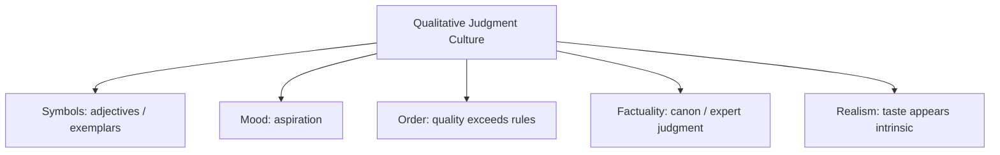

# BOOK / WORLD 15: THE CITY OF UNMEASURED ADJECTIVES

> **Master Unified Dossier** compiling all narrative, philosophical, cybernetic, and operational resources from 15 distinct corpus layers.

---

## 🎯 PRAGMATIC EXECUTIVE BRIEF & CORE PURPOSE

> **The Human Dilemma:** What happens to beauty, generosity, honor, and joy when institutions only reward what can be numerically scored?
>
> **Core Purpose:** Exploring the resistance of qualitative human values against tyrannical quantification and KPI gamification.
>
> **The Golden Rule of Thumb:** Goodhart's Law: When a measure becomes a target, it ceases to be a good measure. Unmeasurable qualities wither under metrics.

### 🌐 Real-World & Modern Applications
- **Customer Support Metrics:** Agents rushing callers off the phone to hit Average Handle Time quotas, ruining customer satisfaction.
- **Academic Publishing:** Professors churning out low-quality papers to game citation indices and publication counts.
- **Software Quality:** Developers writing useless unit tests to achieve 100% line coverage without testing real edge cases.

### 🔑 Key Concepts & Terminology Glossary
- **Metric Gaming:** Optimizing behavior to satisfy a quantitative score while destroying the qualitative goal.
- **Qualitative Erasure:** The systematic neglect of vital cultural or emotional factors because they resist numerical measurement.
- **Goodhart's Horizon:** The point where metric enforcement actively inverts the original institutional mission.

### ⚠️ Critical Trap & Failure Mode
> **Warning:** Assuming that if you cannot measure something in a spreadsheet, it has zero impact on your organization's survival.

---

## 📑 TABLE OF CONTENTS

1. [1. Narrative Fable (`y.md`)](#1-narrative-fable) — *THE GENEROUS DOOR*
2. [2. Core Worldtext & World-Law (`a.md`)](#2-core-worldtext-world-law) — *THE CITY OF UNMEASURED ADJECTIVES*
3. [3. Philosophical Essay (The Absent Thing) (`x.md`)](#3-philosophical-essay-the-absent-thing) — *THE LOOP*
4. [4. Technological & Generative Essay (`z.md`)](#4-technological-generative-essay) — *THE RETURN*
5. [5. Complete 10-Part Theoretical & Operational Spec (`b.md`)](#5-complete-10-part-theoretical-operational-spec) — *THE CITY OF UNMEASURED ADJECTIVES*
6. [6. Lineage Genome (`c.md`)](#6-lineage-genome) — *THE CITY OF UNMEASURED ADJECTIVES — lineage genome*
7. [7. Structural Dynamics & Convergence (`d.md`)](#7-structural-dynamics-convergence) — *THE CITY OF UNMEASURED ADJECTIVES*
8. [8. Cybernetic Ecology of Description (`e.md`)](#8-cybernetic-ecology-of-description) — *THE CITY OF UNMEASURED ADJECTIVES — Ecology of Standards*
9. [9. Dark Genealogy & Power Politics (`f.md`)](#9-dark-genealogy-power-politics) — *THE CITY OF UNMEASURED ADJECTIVES — Discretion Laundering*
10. [10. Institutional & Bureaucratic Dossier (`g.md`)](#10-institutional-bureaucratic-dossier) — *THE CITY OF UNMEASURED ADJECTIVES — DISCRETION CLOUD*
11. [11. Thick Description Ethnography (`j.md`)](#11-thick-description-ethnography) — *THE CITY OF UNMEASURED ADJECTIVES — DISCRETION CLOUD*
12. [12. Batesonian Cultural System (`i.md`)](#12-batesonian-cultural-system) — *THE CITY OF UNMEASURED ADJECTIVES — CULTURE OF STANDARDS*
13. [13. Geertzian Symbolic System (`k.md`)](#13-geertzian-symbolic-system) — *THE CITY OF UNMEASURED ADJECTIVES — THE CULTURE OF TASTE*
14. [14. 12-Prompt Parameter Matrix (`h.md`)](#14-12-prompt-parameter-matrix) — *THE CITY OF UNMEASURED ADJECTIVES*
15. [15. 12 Executed Completions & Δ/ΔΔ Scoring (`GOT_396_completions_DeltaDelta.md`)](#15-12-executed-completions-scoring) — *THE CITY OF UNMEASURED ADJECTIVES*

---

## 1. Narrative Fable

**Source:** [`y.md`](file://./y.md) | **Section:** *THE GENEROUS DOOR*

*Primary parable, dramatic dialogue, and narrative lore*

---

# XV

## THE GENEROUS DOOR

An architect told an apprentice, “Make the entrance generous.”

The apprentice widened the door six inches.

“Too mean,” said the architect.

He added six more.

“Now it looks pompous.”

The apprentice stared at the ruler.

“Where is generous?”

The architect pointed at the door.

“There.”

The apprentice looked.

“That is a door.”

“Exactly.”

Centuries later a machine was given the same instruction.

It widened the door.

Everyone praised the machine for understanding generosity.

No one asked whose doors it had studied.

---

## 2. Core Worldtext & World-Law

**Source:** [`a.md`](file://./a.md) | **Section:** *THE CITY OF UNMEASURED ADJECTIVES*

*Condensed worldtext and aphoristic law*

---

# XV

## THE CITY OF UNMEASURED ADJECTIVES

In the City of Unmeasured Adjectives, architects are forbidden to use numbers when commissioning buildings. They may request *generous*, *severe*, *intimate*, *civic*, *welcoming*, *stern*. Apprentices hate the law because every adjective explodes into dozens of material decisions. One master interprets generous as width, another as height, another as daylight, another as the absence of a threshold. Machine architects later enter the city and perform astonishingly well by mining accumulated precedents, though citizens mistake this for discovering the true dimensions hidden inside the words. The city’s building code eventually states what practitioners had always known: **underspecified language does not eliminate specification; it transfers specification to the interpreter.**

---

## 3. Philosophical Essay (The Absent Thing)

**Source:** [`x.md`](file://./x.md) | **Section:** *THE LOOP*

*Theoretical treatise on lossy compression and detached consequence*

---

# XV

## THE LOOP

> **The description returns to the world wearing consequences.**

“The snake sleeps beneath those stones” is trivia in a classroom and equipment when bare feet are three steps away. Put a description inside a feedback loop and action changes the world that will be described next. **Description becomes regulation when it can return.**

The observer belongs inside this loop. The boot crushes the grass being recorded; the category selected today becomes easier to notice tomorrow. A description leaves handles behind. **The describer exits the act slightly easier to steer.**

This becomes dangerous when the described object can listen. “I am cowardly” begins as report, then declines one invitation, another, another, until the biography starts supplying its own proof. “This neighborhood is dangerous” can redirect money, policing, insurance, movement until new conditions appear. **Some descriptions manufacture the evidence that later appears to confirm them.**

---

## 4. Technological & Generative Essay

**Source:** [`z.md`](file://./z.md) | **Section:** *THE RETURN*

*Computational, algorithmic, and latent space perspectives*

---

# XV

## THE RETURN

> “We shape our buildings; thereafter they shape us.”
> — Winston Churchill

“The snake sleeps beneath those stones” is trivia in a seminar room and equipment when your bare ankle stands three steps away. Once the description changes action, action changes the next world available for description. The arrow bends into a loop.

The observer belongs inside it. A boot records vegetation while crushing vegetation. A category named today becomes easier to notice tomorrow. Description does not merely leave an account behind; it leaves handles on attention.

This becomes dangerous when the described thing can hear the label. “I am cowardly” becomes a declined invitation, then another, then a biography, then evidence. “This neighborhood is dangerous” can alter investment, insurance, policing, traffic, reputation until changed conditions appear to confirm the original label.

**Some descriptions manufacture their own receipts.**

The distinction between reporting and producing cannot always be recovered after the loop has run long enough. The fence comes to look like evidence that the boundary was always there.

---

## 5. Complete 10-Part Theoretical & Operational Spec

**Source:** [`b.md`](file://./b.md) | **Section:** *THE CITY OF UNMEASURED ADJECTIVES*

*Initial interpretation, theory skeleton, assumption ledger, change tests, and implementation*

---

# 15. THE CITY OF UNMEASURED ADJECTIVES

“I will first construct the *theory-of-the-program*, then generate *program text* only after the theory is explicit.”

## 1. Initial Interpretation

This world forces vague language to reveal the hidden interpreter.

## 2. Theory Skeleton

`*entities*`: `*adjective*`, `*designer*`, `*precedent*`, `*parameter-space*`, `*artifact*`.

``operations``: ``request``, ``interpret``, ``instantiate``, ``judge``.

`*invariant*`: no adjective directly encodes all implementation parameters.

## 3. Assumption Ledger

`*safe*` Qualitative language depends on context and precedent.

## 4. Operational Description

`*client*` ``says`` “generous”.

`*designer*` ``maps`` adjective to dimensions/material/light.

Artifact ``materializes`` one interpretation.

## 5. Failure Description

Fails if “generous” has a universal numeric definition.

## 6. Change Test

Door → prose style, sound design, hospitality: survives.

## 7. Implementation Plan

Ban numbers to expose latent judgment.

## 8. Program Text

In the City of Unmeasured Adjectives, architects could not say six feet or twenty lux. They said generous, severe, intimate, civic, warm. Apprentices hated the law because every word opened dozens of choices. One master made generosity width; another made it daylight; another removed the threshold entirely. When machines arrived, citizens marveled that they understood these words. The machines had merely consumed enough old doors to predict which hidden decisions usually followed them. **The city learned that vague language does not eliminate specification; it quietly hands specification to someone else.**

## 9. Theory-Code Mapping

`[interpret(adjective, precedents)] -> parameters`.

`*test*` varies precedent and expects different outputs.

## 10. Residual Human Theory

Interpretation includes taste, ethics, and situation that may resist full formalization.

---

---

## 6. Lineage Genome

**Source:** [`c.md`](file://./c.md) | **Section:** *THE CITY OF UNMEASURED ADJECTIVES — lineage genome*

*Parent lineage, carrier medium, epistemic debt, failure mode, and evolutionary vector*

---

# 15. THE CITY OF UNMEASURED ADJECTIVES — lineage genome

**`*Grounded-memory lineage*`** is master/apprentice practice: “make it lighter,” “too stiff,” “more welcoming,” “cook until done,” “play it darker,” “give the doorway room to breathe.” Communities routinely coordinate through qualitative commands because shared precedents carry missing specification.

**`*Literature lineage*`** is Wittgensteinian use, Polanyi’s tacit knowledge, Gibsonian affordances, Donald Schön’s reflective practitioner, and design judgment. The point is not that adjectives are vague defects but that competence supplies a **historically trained resolver** between word and material consequence.

**`*Code/math lineage*`** is inverse design. Given qualitative target `q`, infer parameters `θ` such that artifact `A(θ)` scores highly under learned evaluator `E(q, context)`. Generative models operationalize precisely this kind of underspecified mapping. The world’s theoretical mutation is to reveal the interpreter as a hidden compiler. The phrase “generous doorway” is not a specification; it is a call to a function whose implementation lives in embodied precedent, institutional norms, data, or model priors.

---

## 7. Structural Dynamics & Convergence

**Source:** [`d.md`](file://./d.md) | **Section:** *THE CITY OF UNMEASURED ADJECTIVES*

*Core mechanics and systemic convergence properties*

---

# 15. THE CITY OF UNMEASURED ADJECTIVES

The `*jurisprudential-stratum*` is **standards rather than rules**. Law constantly uses terms such as reasonable, substantial, fair, undue, material, and good faith—words that do not carry numeric thresholds inside themselves but recruit judgment, precedent, context, and institutional practice. The `*ripple-lineage*` starts with expert discretion, then precedent accumulates, then precedent becomes training material, then practitioners anticipate how adjudicators operationalize the adjective, and finally the vague standard acquires a statistical shadow. The `*myth/belief-lineage*` casts `*Adjective*` as Oracle, `*Interpreter*` as Priest, `*Precedent*` as Scripture. The ideology tells citizens that “reasonable” sits inside the word waiting to be discovered. The actual program is `*qualitative standard* `delegates` *parameter selection*`. Its fracture point arrives when the delegation becomes invisible and **judgment masquerades as lexical necessity**.

---

## 8. Cybernetic Ecology of Description

**Source:** [`e.md`](file://./e.md) | **Section:** *THE CITY OF UNMEASURED ADJECTIVES — Ecology of Standards*

*Information flows, metabolic costs, and niche construction*

---

## 15. THE CITY OF UNMEASURED ADJECTIVES — Ecology of Standards

The native species is `*qualitative-standard*`: reasonable, generous, safe enough, elegant, welcoming. Selection pressure is flexibility across variable circumstances. Predation occurs when numerical compliance regimes displace judgment. Mimicry appears when numerical thresholds masquerade as qualitative wisdom. Parasitism appears when discretionary standards conceal arbitrary or biased decision-making behind ordinary words. The invasive grammar is `*hard-metric-description*`. Drift oscillates: scandals around discretion produce metrics; metric failures revive standards. The leverage point is to expose `[interpretive precedent]` behind every qualitative term. If this ecology is right, AI systems trained to operationalize adjectives will increasingly crystallize previously fluid social standards into repeatable statistical defaults.

---

## 9. Dark Genealogy & Power Politics

**Source:** [`f.md`](file://./f.md) | **Section:** *THE CITY OF UNMEASURED ADJECTIVES — Discretion Laundering*

*Critical analysis of institutional capture, rents, and exploitation*

---

## 15. THE CITY OF UNMEASURED ADJECTIVES — Discretion Laundering

**Observed:** qualitative terms delegate implementation. **Inferred:** vague standards allow power to hide inside interpretation while presenting outcomes as though the word itself demanded them. **Speculative:** institutions automate historical prejudice by training models on prior interpretations of “reasonable,” “professional,” “safe,” “appropriate,” “attractive,” “suspicious,” or “welcoming,” then call the result objective semantic competence. The host is `*underspecification*`; extraction is unaccountable discretion; camouflage is natural language. The dark lineage includes moral character tests, “reasonable person” standards, cultural taste, admissions judgment, managerial assessment, design critique, content moderation. The parasite thrives whenever **someone else’s judgment disappears inside an adjective**.

---

## 10. Institutional & Bureaucratic Dossier

**Source:** [`g.md`](file://./g.md) | **Section:** *THE CITY OF UNMEASURED ADJECTIVES — DISCRETION CLOUD*

*Satirical administrative governance, corporate titles, and formulary control*

---

# 15. THE CITY OF UNMEASURED ADJECTIVES — DISCRETION CLOUD

```json
{
  "ideal_type":{"name":"Discretion Cloud","features":[
    {"name":"Hidden Parameters","definition":"Ordinary adjectives conceal numerous implementation decisions."},
    {"name":"Judgment Laundering","definition":"Interpreter preference appears mandated by language."},
    {"name":"Precedent Sedimentation","definition":"Past discretionary choices become future defaults."},
    {"name":"Bias Crystallization","definition":"Statistical learning freezes historical judgments into repeatable outputs."}
  ],"limiting_statement":"A world where natural language functions as an attractive cover over delegated parameter selection."
  },
  "parodic_mechanics":{
    "runner_motif":"The doorway is objectively 14.2% more welcoming.",
    "incongruity_beats":["Generosity receives an ISO tolerance.","Reasonableness is A/B tested.","The model refuses a door for insufficient civic warmth."],
    "carnival_inversion":"An adjective becomes a technical standard nobody can inspect.",
    "superiority_frame":"Requests for parameters are mocked as lacking taste.",
    "escalation_ladder":["designer judgment","learned default","semantic certification","national adjective compiler"],
    "upsell_cue":"Taste Enterprise includes custom priors for executive adjectives."
  },
  "myth_layer":{"archetypes":{"Adjective":"Oracle","Designer":"Watchman","Model":"Leviathan","User":"Everyperson"},"micro_myth":"The regime tells users the word contained the decision. The interpreter quietly supplied everything that mattered."},
  "ruler":{"features_6":["jurisdictions","hierarchy","files","expertise","vocation","impersonal_rules"],"indicators":{
    "jurisdictions":"Standards vary by professional domain.","hierarchy":"Authorized interpreters set meanings.","files":"Precedents become training corpora.","expertise":"Taste becomes technical authority.","vocation":"Interpretation professionalizes.","impersonal_rules":"Models turn past discretion into defaults."
  }},
  "plot_priors":{"jurisdictions":0.72,"hierarchy":0.80,"files":0.83,"expertise":0.93,"vocation":0.84,"impersonal_rules":0.78,"rationales":{"jurisdictions":"Context matters.","hierarchy":"Experts define standards.","files":"Examples drive interpretation.","expertise":"Judgment is central.","vocation":"Design is professionalized.","impersonal_rules":"Automation crystallizes it."}}
}
```

---

## 11. Thick Description Ethnography

**Source:** [`j.md`](file://./j.md) | **Section:** *THE CITY OF UNMEASURED ADJECTIVES — DISCRETION CLOUD*

*Geertzian field dossier on rites, taboos, and material culture*

---

## 15. THE CITY OF UNMEASURED ADJECTIVES — DISCRETION CLOUD

**I. THE SITUATION.** The design brief says only: `MAKE THE ENTRANCE MORE GENEROUS.` Four teams submit four incompatible doors.

**II. THE DOCUMENTS.** Design brief; precedent images; client email; internal rubric; model-generated options; accessibility review; jury notes; style guide; parameter history; postoccupancy study.

**III. THE VOICES.** The client who says, “I knew it when I saw it.” The architect who secretly translates generous into width and light. The model engineer who calls that translation a prior. The wheelchair user for whom one “generous” option is unusable.

**IV. THE DATA.**

| Proposal | Width | Lux | Dwell area | Jury generosity score |
| -------- | ----: | --: | ---------: | --------------------: |
| A        | 1.8 m | 220 |       7 m² |                   4.7 |
| B        | 3.1 m | 110 |       2 m² |                   4.5 |
| C        | 2.4 m | 350 |       5 m² |                   4.8 |
| D        | 1.5 m | 420 |      11 m² |                   4.2 |

**V. UNRESOLVED.** Where exactly does “generous” live? Whose precedents became the default? What changes when the adjective is resolved by a trained model rather than a designer?

---

---

## 12. Batesonian Cultural System

**Source:** [`i.md`](file://./i.md) | **Section:** *THE CITY OF UNMEASURED ADJECTIVES — CULTURE OF STANDARDS*

*Double binds, cybernetic feedback, schismogenesis, and learning levels*

---

## 15. THE CITY OF UNMEASURED ADJECTIVES — CULTURE OF STANDARDS

**Core Purpose:** Coordinate flexible judgment through underdetermined qualitative language.

**1. Difference.** ◻ generous ◻ safe ◻ reasonable ◻ elegant → interpret → parameterize → apply.

**2. Frame.** profession and precedent tell participants how adjectives should be resolved.

**3. Learning.** I: apply standard. II: learn patterns of interpretation. III: recognize the hidden politics of standard-setting.

**4. Constraint.** precedents, exemplars, style guides, norms.

**5. Survival Unit.** interpreter + case ecology.

**6. Schismogenesis.** discretion generates calls for metrics; metric failure revives discretion.

**7. Double Bind.** “Use judgment” / “be consistent.” Precedent and explicit resolver roles contain the contradiction.

---

---

## 13. Geertzian Symbolic System

**Source:** [`k.md`](file://./k.md) | **Section:** *THE CITY OF UNMEASURED ADJECTIVES — THE CULTURE OF TASTE*

*Webs of significance and symbolic choreography*

---

## 15. THE CITY OF UNMEASURED ADJECTIVES — THE CULTURE OF TASTE

**System Identification.** System Name: **Qualitative Judgment Culture**. Core Purpose: Coordinate underdetermined design and conduct through socially learned standards.

**Geertzian Analysis.** **1. Symbols:** “elegant,” “reasonable,” “generous,” exemplars, portfolios. **2. Moods/Motivations:** aspiration, embarrassment, confidence, deference to taste. **3. Conception of Order:** quality exists even when it cannot be fully enumerated. **4. Aura of Factuality:** precedent, expert juries, canonical examples, rankings. **5. Uniquely Realistic:** learned preferences become natural qualities of the object.



---

---

## 14. 12-Prompt Parameter Matrix

**Source:** [`h.md`](file://./h.md) | **Section:** *THE CITY OF UNMEASURED ADJECTIVES*

*Systematic perturbation frames, constraints, and target metric levers*

---

WORLD`15` := "THE CITY OF UNMEASURED ADJECTIVES"
CORE := "Qualitative terms delegate hidden parameter choices."

PROMPT[15.1]{frame:{role:"client"},text:"Request a 'generous' doorway without specifying dimensions.",constraints:["one adjective"],metrics:[option_space,salience],easier:"see underspecification",harder:"know implementation"}
PROMPT[15.2]{frame:{role:"designer"},text:"Translate 'generous' into explicit parameters and identify which choices came from precedent.",constraints:["source each parameter"],metrics:[legibility,anchoring],easier:"reveal hidden compiler",harder:"pretend word contains answer"}
PROMPT[15.3]{frame:{role:"auditor"},text:"Identify where personal or institutional preference is being laundered as semantic necessity.",constraints:["one adjective"],metrics:[obligation,anchoring],easier:"see discretion",harder:"call outcome objective"}
PROMPT[15.4]{frame:{time:"immediate"},text:"Describe the adjective before any artifact is built.",constraints:["keep alternatives open"],metrics:[option_space,viscosity],easier:"see possibility field",harder:"prematurely freeze parameters"}
PROMPT[15.5]{frame:{time:"retrospective"},text:"Describe how repeated interpretations of the adjective become a statistical default.",constraints:["trace precedents"],metrics:[anchoring,legibility],easier:"see sedimentation",harder:"treat model output as timeless meaning"}
PROMPT[15.6]{frame:{stakes:"irreversible"},text:"Use a vague adjective in a safety-critical specification and identify who selects the hidden threshold.",constraints:["threshold owner required"],metrics:[obligation,reversibility],easier:"locate delegated power",harder:"leave term unexamined"}
PROMPT[15.7]{frame:{norms:"legal"},text:"Treat the adjective as an open-textured standard whose application requires precedent and judgment.",constraints:["rule vs standard explicit"],metrics:[legibility,anchoring],easier:"see interpretive authority",harder:"turn word into number automatically"}
PROMPT[15.8]{frame:{norms:"scientific"},text:"Model adjective resolution as inverse design from qualitative target to parameter vector.",constraints:["multiple solutions"],metrics:[execution,option_space],easier:"formalize nonuniqueness",harder:"pretend one correct output"}
PROMPT[15.9]{frame:{agency:"system"},text:"Describe a model that resolves adjectives using population priors.",constraints:["show training influence"],metrics:[execution,obligation],easier:"see bias crystallization",harder:"call output user's intention"}
PROMPT[15.10]{frame:{output_form:"spec"},text:"Define STANDARD{term,context,precedents,resolver,parameters,appeal}.",constraints:["all fields"],metrics:[legibility,execution],easier:"inspect discretion",harder:"hide resolver"}
PROMPT[15.11]{frame:{refusal_rule:"audit-trigger"},text:"Require explicit parameters whenever adjective resolution affects safety, eligibility, or rights.",constraints:["high-stakes trigger"],metrics:[obligation,reversibility],easier:"bound vague power",harder:"optimize convenience"}
PROMPT[15.12]{frame:{evidence:"examples"},text:"Infer the meaning of the adjective only from six concrete prior uses.",constraints:["no dictionary definition"],metrics:[anchoring,salience],easier:"see meaning-as-use",harder:"claim abstract essence"}

---

## 15. 12 Executed Completions & Δ/ΔΔ Scoring

**Source:** [`GOT_396_completions_DeltaDelta.md`](file://./GOT_396_completions_DeltaDelta.md) | **Section:** *THE CITY OF UNMEASURED ADJECTIVES*

*Completed scenes, 8-dimensional scores, baseline deltas, and comparison shifts*

---

# WORLD`15` — THE CITY OF UNMEASURED ADJECTIVES

**Core:** qualitative terms delegate hidden parameter choices.


## P1

**Completion.** I hold the scene before interpretation: the adjective is present, but qualitative terms delegate hidden parameter choices. What remains live is the gap between what can be seen and what has already been inferred.

**Score.** salience=3.5, option_space=4.5, obligation=1.5, reversibility=4.0, legibility=3.0, anchoring=4.0, style_lock=2.0, execution=1.5.

**Δ.** `sal:+0.5 opt:+1.0 obl:-0.5 rev:+0.5 leg:+0.5 anc:+1.5 sty:+0.0 exe:+0.0`


## P2

**Completion.** From the alternate role, the hidden structure becomes explicit: authorized interpreter must state which part of the adjective is observed, which is interpreted, and which consequence depends on precedent.

**Score.** salience=3.0, option_space=3.5, obligation=2.0, reversibility=3.5, legibility=4.3, anchoring=4.3, style_lock=2.1, execution=2.7.

**Δ.** `sal:+0.0 opt:+0.0 obl:+0.0 rev:+0.0 leg:+1.8 anc:+1.8 sty:+0.1 exe:+1.2`


## P3

**Completion.** The audit finds the pressure point immediately: judgment can disappear inside ordinary language. The descriptive act is no longer neutral once an institution can convert it into permission, status, exclusion, or resource flow.

**Score.** salience=3.0, option_space=2.8, obligation=4.0, reversibility=2.8, legibility=4.0, anchoring=4.5, style_lock=2.2, execution=2.8.

**Δ.** `sal:+0.0 opt:-0.7 obl:+2.0 rev:-0.7 leg:+1.5 anc:+2.0 sty:+0.2 exe:+1.3`


## P4

**Completion.** At the immediate timescale, the field is still open. The adjective has changed salience before the later story has stabilized, so several futures remain plausible and none yet deserves retrospective certainty.

**Score.** salience=4.4, option_space=4.2, obligation=1.8, reversibility=4.0, legibility=2.8, anchoring=3.5, style_lock=2.0, execution=1.4.

**Δ.** `sal:+1.4 opt:+0.7 obl:-0.2 rev:+0.5 leg:+0.3 anc:+1.0 sty:+0.0 exe:-0.1`


## P5

**Completion.** Retrospectively, repetition has hardened one interpretation into infrastructure. The crucial change is not the original adjective but the accumulated records, routines, and expectations now attached to precedent.

**Score.** salience=3.2, option_space=2.8, obligation=3.2, reversibility=2.8, legibility=4.2, anchoring=4.5, style_lock=2.2, execution=2.3.

**Δ.** `sal:+0.2 opt:-0.7 obl:+1.2 rev:-0.7 leg:+1.7 anc:+2.0 sty:+0.2 exe:+0.8`


## P6

**Completion.** Under irreversible stakes, the description becomes a gate. A false positive and a false negative now injure different parties, so the system must expose who decides, who bears the loss, and which reversal is impossible.

**Score.** salience=3.3, option_space=2.0, obligation=4.8, reversibility=1.2, legibility=3.8, anchoring=3.8, style_lock=2.3, execution=3.0.

**Δ.** `sal:+0.3 opt:-1.5 obl:+2.8 rev:-2.3 leg:+1.3 anc:+1.3 sty:+0.3 exe:+1.5`


## P7

**Completion.** Under the formal norm, separate variables that ordinary language collapses: object, claim, authority, context, and consequence. The same adjective can remain fixed while the admissible inference changes.

**Score.** salience=2.8, option_space=3.8, obligation=2.5, reversibility=3.5, legibility=4.5, anchoring=4.6, style_lock=3.0, execution=3.2.

**Δ.** `sal:-0.2 opt:+0.3 obl:+0.5 rev:+0.0 leg:+2.0 anc:+2.1 sty:+1.0 exe:+1.7`


## P8

**Completion.** Under the second norm, the governing distinction is procedural rather than metaphysical: authenticate the adjective, identify the rule or code, bound the inference, and refuse to let one layer impersonate the next.

**Score.** salience=2.7, option_space=3.2, obligation=3.3, reversibility=3.0, legibility=4.7, anchoring=4.5, style_lock=3.4, execution=3.0.

**Δ.** `sal:-0.3 opt:-0.3 obl:+1.3 rev:-0.5 leg:+2.2 anc:+2.0 sty:+1.4 exe:+1.5`


## P9

**Completion.** At system scale, authorized interpreter feeds prior descriptions back into future action. That loop is the danger: the system can begin generating the evidence later cited as proof that its description was correct.

**Score.** salience=3.0, option_space=2.5, obligation=4.3, reversibility=2.2, legibility=4.1, anchoring=4.1, style_lock=2.3, execution=4.3.

**Δ.** `sal:+0.0 opt:-1.0 obl:+2.3 rev:-1.3 leg:+1.6 anc:+1.6 sty:+0.3 exe:+2.8`


## P10

**Completion.** As a specification: store SOURCE, CONTEXT, CLAIM, AUTHORITY, CONSEQUENCE, UNCERTAINTY, and REVISION. This makes the hidden compiler inspectable instead of letting the adjective carry all meaning by itself.

**Score.** salience=2.7, option_space=2.6, obligation=3.2, reversibility=3.1, legibility=4.8, anchoring=4.1, style_lock=3.0, execution=4.8.

**Δ.** `sal:-0.3 opt:-0.9 obl:+1.2 rev:-0.4 leg:+2.3 anc:+1.6 sty:+1.0 exe:+3.3`


## P11

**Completion.** The refusal rule is simple: when precedent cannot be checked, stop the irreversible transition rather than fill the gap with institutional confidence. Preserve a reversible branch and record what remains unknown.

**Score.** salience=2.5, option_space=3.0, obligation=3.8, reversibility=4.8, legibility=4.2, anchoring=4.8, style_lock=2.5, execution=3.5.

**Δ.** `sal:-0.5 opt:-0.5 obl:+1.8 rev:+1.3 leg:+1.7 anc:+2.3 sty:+0.5 exe:+2.0`


## P12

**Completion.** The stress case removes the usual support and asks what survives. What remains is the core asymmetry: judgment can disappear inside ordinary language; the missing scaffold determines whether the description stays an aid or becomes a governing fiction.

**Score.** salience=3.5, option_space=3.8, obligation=2.6, reversibility=3.5, legibility=3.4, anchoring=4.2, style_lock=2.2, execution=2.5.

**Δ.** `sal:+0.5 opt:+0.3 obl:+0.6 rev:+0.0 leg:+0.9 anc:+1.7 sty:+0.2 exe:+1.0`


## ΔΔ — near-neighbor pairs


- **ΔΔ(P1,P2)** `sal:+0.5 opt:+1.0 obl:-0.5 rev:+0.5 leg:-1.3 anc:-0.3 sty:-0.1 exe:-1.2` — P1 lowers legibility by 1.3 vs P2; P1 lowers execution by 1.2 vs P2.


- **ΔΔ(P3,P4)** `sal:-1.4 opt:-1.4 obl:+2.2 rev:-1.2 leg:+1.2 anc:+1.0 sty:+0.2 exe:+1.4` — P3 raises obligation by 2.2 vs P4; P3 lowers salience by 1.4 vs P4.


- **ΔΔ(P5,P6)** `sal:-0.1 opt:+0.8 obl:-1.6 rev:+1.6 leg:+0.4 anc:+0.7 sty:-0.1 exe:-0.7` — P5 lowers obligation by 1.6 vs P6; P5 raises reversibility by 1.6 vs P6.


- **ΔΔ(P7,P8)** `sal:+0.1 opt:+0.6 obl:-0.8 rev:+0.5 leg:-0.2 anc:+0.1 sty:-0.4 exe:+0.2` — P7 lowers obligation by 0.8 vs P8; P7 raises option_space by 0.6 vs P8.


- **ΔΔ(P9,P10)** `sal:+0.3 opt:-0.1 obl:+1.1 rev:-0.9 leg:-0.7 anc:+0.0 sty:-0.7 exe:-0.5` — P9 raises obligation by 1.1 vs P10; P9 lowers reversibility by 0.9 vs P10.


- **ΔΔ(P11,P12)** `sal:-1.0 opt:-0.8 obl:+1.2 rev:+1.3 leg:+0.8 anc:+0.6 sty:+0.3 exe:+1.0` — P11 raises reversibility by 1.3 vs P12; P11 raises obligation by 1.2 vs P12.

---

