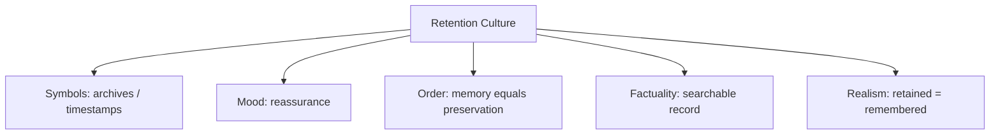

# BOOK / WORLD 16: THE ARCHIVE WITHOUT CONTEXT

> **Master Unified Dossier** compiling all narrative, philosophical, cybernetic, and operational resources from 15 distinct corpus layers.

---

## 🎯 PRAGMATIC EXECUTIVE BRIEF & CORE PURPOSE

> **The Human Dilemma:** Why is a database of facts dangerous when stripped of who recorded them, why, and under what pressures?
>
> **Core Purpose:** Analyzing naked records, decontextualized data storage, and the danger of ungrounded information retrieval.
>
> **The Golden Rule of Thumb:** Data without provenance is a weapon waiting for a random hand. A record preserves what was written, not what it meant.

### 🌐 Real-World & Modern Applications
- **Out-of-Context Social Media Clips:** Reviving a 10-year-old snippet of speech to destroy a reputation without knowing the situation.
- **LLM Pre-training Data:** Models ingesting vast text scrapings containing irony, sarcasm, and falsehoods as literal factual truth.
- **Police Dossiers:** Storing arrest logs without recording subsequent acquittals or corrupt officer records.

### 🔑 Key Concepts & Terminology Glossary
- **Dossier Governance:** Controlling human lives using historical records that individuals cannot inspect or correct.
- **Provenance Stripping:** Severing an information artifact from its author, intent, social setting, and revision history.
- **Naked Facticity:** The dangerous illusion that raw recorded data speaks for itself without interpretation.

### ⚠️ Critical Trap & Failure Mode
> **Warning:** Trusting an old database record as absolute truth without verifying who wrote it and what axe they had to grind.

---

## 📑 TABLE OF CONTENTS

1. [1. Narrative Fable (`y.md`)](#1-narrative-fable) — *THE LIBRARY OF PERFECT RECORDS*
2. [2. Core Worldtext & World-Law (`a.md`)](#2-core-worldtext-world-law) — *THE ARCHIVE WITHOUT CONTEXT*
3. [3. Philosophical Essay (The Absent Thing) (`x.md`)](#3-philosophical-essay-the-absent-thing) — *THE PERSON WHO HEARS THE LABEL*
4. [4. Technological & Generative Essay (`z.md`)](#4-technological-generative-essay) — *THE PERSON IN THE SENTENCE*
5. [5. Complete 10-Part Theoretical & Operational Spec (`b.md`)](#5-complete-10-part-theoretical-operational-spec) — *THE ARCHIVE WITHOUT CONTEXT*
6. [6. Lineage Genome (`c.md`)](#6-lineage-genome) — *THE ARCHIVE WITHOUT CONTEXT — lineage genome*
7. [7. Structural Dynamics & Convergence (`d.md`)](#7-structural-dynamics-convergence) — *THE ARCHIVE WITHOUT CONTEXT*
8. [8. Cybernetic Ecology of Description (`e.md`)](#8-cybernetic-ecology-of-description) — *THE ARCHIVE WITHOUT CONTEXT — Ecology of Records*
9. [9. Dark Genealogy & Power Politics (`f.md`)](#9-dark-genealogy-power-politics) — *THE ARCHIVE WITHOUT CONTEXT — Memory Colonialism*
10. [10. Institutional & Bureaucratic Dossier (`g.md`)](#10-institutional-bureaucratic-dossier) — *THE ARCHIVE WITHOUT CONTEXT — PERMANENT PAST*
11. [11. Thick Description Ethnography (`j.md`)](#11-thick-description-ethnography) — *THE ARCHIVE WITHOUT CONTEXT — PERMANENT PAST*
12. [12. Batesonian Cultural System (`i.md`)](#12-batesonian-cultural-system) — *THE ARCHIVE WITHOUT CONTEXT — CULTURE OF RETENTION*
13. [13. Geertzian Symbolic System (`k.md`)](#13-geertzian-symbolic-system) — *THE ARCHIVE WITHOUT CONTEXT — THE CULTURE OF PERMANENT MEMORY*
14. [14. 12-Prompt Parameter Matrix (`h.md`)](#14-12-prompt-parameter-matrix) — *THE ARCHIVE WITHOUT CONTEXT*
15. [15. 12 Executed Completions & Δ/ΔΔ Scoring (`GOT_396_completions_DeltaDelta.md`)](#15-12-executed-completions-scoring) — *THE ARCHIVE WITHOUT CONTEXT*

---

## 1. Narrative Fable

**Source:** [`y.md`](file://./y.md) | **Section:** *THE LIBRARY OF PERFECT RECORDS*

*Primary parable, dramatic dialogue, and narrative lore*

---

# XVI

## THE LIBRARY OF PERFECT RECORDS

A queen feared forgetting, so she ordered every sound in the kingdom recorded.

Birth cries. Arguments. Recipes. Songs. Market bargaining. Footsteps. Prayers. Jokes. Coughs. Rain on different roofs.

Nothing would be lost.

After the queen died, her son entered the archive and searched for his mother's laugh.

The librarian found 4,821 recordings.

“Which one was hers?” the king asked.

“All of them.”

“No. Which one was the laugh she made when she knew I was lying?”

The librarian searched the catalog.

There was no field for that.

---

## 2. Core Worldtext & World-Law

**Source:** [`a.md`](file://./a.md) | **Section:** *THE ARCHIVE WITHOUT CONTEXT*

*Condensed worldtext and aphoristic law*

---

# XVI

## THE ARCHIVE WITHOUT CONTEXT

The Archive Without Context records everything but relations. Every sound, image, temperature, transaction, utterance, and heartbeat receives perfect storage, but the archive does not preserve why one detail mattered to a particular life. A king searching for his dead mother’s laugh receives thousands of acoustically perfect matches and none that tell him which laugh meant she knew he was lying. Engineers keep increasing storage. Historians keep asking different questions. Eventually the archive discovers that context cannot simply be added as one more field because each context depends on another context. The institution survives by abandoning its founding boast. **Total signal capture does not equal total memory because significance is not merely another datum sitting beside the event.**

---

## 3. Philosophical Essay (The Absent Thing)

**Source:** [`x.md`](file://./x.md) | **Section:** *THE PERSON WHO HEARS THE LABEL*

*Theoretical treatise on lossy compression and detached consequence*

---

# XVI

## THE PERSON WHO HEARS THE LABEL

> **The self is the object most capable of obeying its own description.**

We ask “Who am I?” and grammar hands us nouns. Nouns invite consistency; consistency recruits behavior. Self-knowledge can become self-construction before the speaker notices the tense has changed. **A description of the self can become a route through the self.**

Zhuangzi's butterfly interrupts this hunger. Man or butterfly: neither label is allowed to harden into final jurisdiction. Some freedom enters through the refusal to close the cage. **A person may need unfinished descriptions to remain larger than the identities already available.**

Body changes, memory tears, roles shift, names persist. Cultures still insist that someone remains one person through these alterations. Soul may name the protest that begins when every inventory still feels insufficient. This proves no metaphysics. **It proves that enumeration and personhood sit badly together.**

---

## 4. Technological & Generative Essay

**Source:** [`z.md`](file://./z.md) | **Section:** *THE PERSON IN THE SENTENCE*

*Computational, algorithmic, and latent space perspectives*

---

# XVI

## THE PERSON IN THE SENTENCE

> “I contain multitudes.”
> — Walt Whitman

We ask “Who am I?” and grammar offers nouns. Nouns invite consistency. Consistency recruits behavior. What begins as report can become route.

The self is a dangerous descriptive object because it listens from inside the experiment. Call a person gifted, criminal, sick, unreliable, attractive, difficult, ordinary. The label enters other people's behavior; their behavior alters the labeled person's options; the resulting actions feed back into the description.

This makes the hunger for a final self-description suspicious. A final noun is efficient. So is a coffin.

Zhuangzi's butterfly remains useful because neither identity receives final jurisdiction. Man dreaming butterfly; butterfly dreaming man. The value lies less in solving the puzzle than in interrupting the appetite for the label that no later experience may revise.

Body changes. Memory tears. Roles shift. Names persist. Still we resist the claim that a complete inventory exhausts the person. Call the remainder soul or refuse the word. **Enumeration and personhood continue to fit badly together.**

---

## 5. Complete 10-Part Theoretical & Operational Spec

**Source:** [`b.md`](file://./b.md) | **Section:** *THE ARCHIVE WITHOUT CONTEXT*

*Initial interpretation, theory skeleton, assumption ledger, change tests, and implementation*

---

# 16. THE ARCHIVE WITHOUT CONTEXT

“I will first construct the *theory-of-the-program*, then generate *program text* only after the theory is explicit.”

## 1. Initial Interpretation

This world tests whether total capture can become total memory.

## 2. Theory Skeleton

`*entities*`: `*record*`, `*event*`, `*context*`, `*future-query*`, `*archive*`.

``operations``: ``capture``, ``index``, ``retrieve``, ``fail-to-answer``.

`*invariant*`: future significance cannot be exhaustively known at recording time.

## 3. Assumption Ledger

`*safe*` Context is relational and open-ended.

## 4. Operational Description

Archive ``captures`` all signals.

Future user ``asks`` relational question.

Archive returns data but cannot identify significance.

## 5. Failure Description

Fails if every future query was anticipated.

## 6. Change Test

Sound archive → surveillance data lake: survives.

## 7. Implementation Plan

Make the archive perfect on storage and weak on relevance.

## 8. Program Text

The Archive recorded everything: footsteps, rain, quarrels, prayers, births, jokes. After the queen died, her son asked for the laugh she made when she knew he was lying. The archive returned 4,821 laughs, each acoustically perfect. None carried a label for that relation. Engineers proposed recording more. Historians laughed. **The archive had mistaken having all the pieces for knowing which pieces would someday belong together.**

## 9. Theory-Code Mapping

`*Record*` is complete at signal level.

`*Query*` may require uncaptured relational context.

## 10. Residual Human Theory

Any context can itself become data, but not all future frames can be pre-enumerated.

---

---

## 6. Lineage Genome

**Source:** [`c.md`](file://./c.md) | **Section:** *THE ARCHIVE WITHOUT CONTEXT — lineage genome*

*Parent lineage, carrier medium, epistemic debt, failure mode, and evolutionary vector*

---

# 16. THE ARCHIVE WITHOUT CONTEXT — lineage genome

**`*Grounded-memory lineage*`** is family photo boxes, oral-history tapes, court archives, surveillance recordings, newspapers, census records, and the recurring experience of having the document but not knowing what mattered to the people inside it.

**`*Literature lineage*`** draws from archival theory, Benjamin’s fragments, Derridean archive questions, Bowker’s memory practices, and Geertz’s insistence that cultural analysis requires relational context. The sharpest ancestor remains the wink: a perfect recording of eyelid contraction can leave the socially decisive relation outside the frame. ([RCNi Company Limited]`5`)

**`*Code/math lineage*`** is the distinction between data lake and query model. Infinite records do not guarantee answerability to unknown future queries. This resembles database normalization limits, semantic indexing, and the open-world problem: future significance cannot be exhaustively precomputed because relevance depends on later contexts. The Archive’s mutation is to make **query-dependence** the missing entity. Data does not carry all possible questions inside itself.

---

## 7. Structural Dynamics & Convergence

**Source:** [`d.md`](file://./d.md) | **Section:** *THE ARCHIVE WITHOUT CONTEXT*

*Core mechanics and systemic convergence properties*

---

# 16. THE ARCHIVE WITHOUT CONTEXT

The `*jurisprudential-stratum*` is privacy and evidentiary aggregation. *Carpenter* treats historical cell-site records as capable of creating a comprehensive chronicle of a person’s movements, illustrating how accumulated records can change character when aggregated rather than remaining isolated points. ([Legal Information Institute]`10`) The `*ripple-lineage*` begins with benign recording, then cheap storage, comprehensive capture, retrospective search, institutional dependence on the archive, and finally behavior shaped by anticipated retrievability. The `*myth/belief-lineage*` casts `*Archive*` as Perfect Memory, `*Record*` as Neutral Witness, `*Missing Relation*` as Ghost. Each successful lookup updates trust in total capture until one question—“which laugh meant she knew?”—reveals that more records and more significance are not monotonically related. The fracture point is **the archive’s conversion from memory aid to ontology of what happened**.

---

## 8. Cybernetic Ecology of Description

**Source:** [`e.md`](file://./e.md) | **Section:** *THE ARCHIVE WITHOUT CONTEXT — Ecology of Records*

*Information flows, metabolic costs, and niche construction*

---

## 16. THE ARCHIVE WITHOUT CONTEXT — Ecology of Records

The native species is `*stored-trace*`; its environment rewards durability and retrieval. Predation occurs when storage abundance overwhelms interpretive capacity. Mimicry appears when metadata simulates context without preserving lived relations. Parasitism occurs when platforms collect comprehensive traces for purposes unrelated to the purposes that generated them. The invasive grammar is `*total-capture*`, promising that enough storage abolishes forgetting. Drift favors ever-denser archives alongside a growing scarcity of trustworthy relevance. The leverage point is recording `*relation-to-person*` and `*reason-for-preservation*` rather than only event content. If this ecology is right, the marginal value of additional raw capture will decline while the value of contextual curation rises.

---

## 9. Dark Genealogy & Power Politics

**Source:** [`f.md`](file://./f.md) | **Section:** *THE ARCHIVE WITHOUT CONTEXT — Memory Colonialism*

*Critical analysis of institutional capture, rents, and exploitation*

---

## 16. THE ARCHIVE WITHOUT CONTEXT — Memory Colonialism

**Observed:** storage can outlive significance. **Inferred:** institutions owning comprehensive archives can later reinterpret lives under questions the recorded people never anticipated. **Speculative:** the past becomes permanently available for retrospective prosecution, profiling, monetization, reputation management, and behavioral prediction. The host is `*human forgetting*`; extraction is optionality over future interpretation; camouflage is memory and convenience. The dark lineage runs through dossiers, colonial archives, intelligence files, consumer databases, permanent social media, workplace surveillance. The parasite reproduces because every future use is justified by the archive’s mere existence: “we already have the data.” The person who generated the trace loses control while the archive gains new purposes. **Nothing is forgotten, so nothing is ever allowed to finish happening.**

---

## 10. Institutional & Bureaucratic Dossier

**Source:** [`g.md`](file://./g.md) | **Section:** *THE ARCHIVE WITHOUT CONTEXT — PERMANENT PAST*

*Satirical administrative governance, corporate titles, and formulary control*

---

# 16. THE ARCHIVE WITHOUT CONTEXT — PERMANENT PAST

```json
{
  "ideal_type":{"name":"Permanent Past","features":[
    {"name":"Total Retention","definition":"Nothing finishes because everything remains queryable."},
    {"name":"Future Reinterpretability","definition":"Records face questions unforeseeable when created."},
    {"name":"Purpose Drift","definition":"Data collected for one use migrates into another."},
    {"name":"Context Scarcity","definition":"Storage grows faster than situated meaning."}
  ],"limiting_statement":"An archive regime where memory becomes permanent optionality over other people's pasts."
  },
  "parodic_mechanics":{
    "runner_motif":"We saved everything except why any of it mattered.",
    "incongruity_beats":["A dead mother's laugh returns 4,821 search results.","Childhood embarrassment receives indefinite retention.","The archive advertises closure as a deletion bug."],
    "carnival_inversion":"Remembering destroys the possibility of being finished with the remembered.",
    "superiority_frame":"Forgetting is treated as irresponsible data loss.",
    "escalation_ladder":["family archive","total lifelog","retrospective risk engine","every past self becomes a permanent witness for the prosecution"],
    "upsell_cue":"Forever Pro lets institutions discover new reasons you were wrong in 2009."
  },
  "myth_layer":{"archetypes":{"Archive":"Oracle","Data Subject":"Everyperson","Analyst":"Watchman","Forgetting":"Sacrificial Innocent"},"micro_myth":"Perfect memory promises justice over time and quietly abolishes temporal mercy."},
  "ruler":{"features_6":["jurisdictions","hierarchy","files","expertise","vocation","impersonal_rules"],"indicators":{
    "jurisdictions":"Archives cross original contexts.","hierarchy":"Record holders control interpretation.","files":"Maximal archival saturation.","expertise":"Analysts mine retrospective meaning.","vocation":"Archival governance expands.","impersonal_rules":"Retention and query policies scale."
  }},
  "plot_priors":{"jurisdictions":0.85,"hierarchy":0.80,"files":1.0,"expertise":0.87,"vocation":0.84,"impersonal_rules":0.94,"rationales":{"jurisdictions":"Purpose drifts across domains.","hierarchy":"Custodians control access.","files":"Core mechanism.","expertise":"Meaning requires analysis.","vocation":"Archive administration grows.","impersonal_rules":"Retention is proceduralized."}}
}
```

---

## 11. Thick Description Ethnography

**Source:** [`j.md`](file://./j.md) | **Section:** *THE ARCHIVE WITHOUT CONTEXT — PERMANENT PAST*

*Geertzian field dossier on rites, taboos, and material culture*

---

## 16. THE ARCHIVE WITHOUT CONTEXT — PERMANENT PAST

**I. THE SITUATION.** A compliance officer in 2039 opens a video recorded at a child's seventh birthday in 2026.

**II. THE DOCUMENTS.** Original upload terms; metadata; retention policy; later policy revision; automated flag; parental consent screen; archive-access log; compliance memo; deletion request; internal note: “context unavailable.”

**III. THE VOICES.** The parent who thought she was saving a birthday. The compliance officer who only sees a flagged gesture. The archivist who says context was never collected. The platform lawyer who notes the retention policy was valid at upload.

**IV. THE DATA.**

| Archive size | Context-rich records | Reused outside original purpose | Deleted |      |
| ------------ | -------------------: | ------------------------------: | ------: | ---- |
| 2026         |                  11m |                             74% |      3% | 8%   |
| 2032         |                  94m |                             41% |     21% | 2%   |
| 2039         |                 610m |                             18% |     47% | 0.6% |

**V. UNRESOLVED.** How much later interpretation can a record ethically bear? Who owns context after the people who supplied it are gone? Does perfect retention create systematic misreading?

---

---

## 12. Batesonian Cultural System

**Source:** [`i.md`](file://./i.md) | **Section:** *THE ARCHIVE WITHOUT CONTEXT — CULTURE OF RETENTION*

*Double binds, cybernetic feedback, schismogenesis, and learning levels*

---

## 16. THE ARCHIVE WITHOUT CONTEXT — CULTURE OF RETENTION

**Core Purpose:** Extend memory beyond the event while preserving enough context for later interpretation.

**1. Difference.** ◻ record ◻ metadata ◻ omission → store → retrieve → reinterpret.

**2. Frame.** archival classification tells later users what kind of record they are looking at.

**3. Learning.** I: retrieve records. II: learn patterns of archival absence. III: recognize the archive as an active selector rather than passive memory.

**4. Constraint.** retention schedules, metadata standards, indexes.

**5. Survival Unit.** community + archive + changing future questions.

**6. Schismogenesis.** collectors demand more retention while subjects demand forgetting.

**7. Double Bind.** “Preserve now because future relevance is unknown” / “future uses cannot be ethically predicted.”

---

---

## 13. Geertzian Symbolic System

**Source:** [`k.md`](file://./k.md) | **Section:** *THE ARCHIVE WITHOUT CONTEXT — THE CULTURE OF PERMANENT MEMORY*

*Webs of significance and symbolic choreography*

---

## 16. THE ARCHIVE WITHOUT CONTEXT — THE CULTURE OF PERMANENT MEMORY

**System Identification.** System Name: **Retention Culture**. Core Purpose: Defeat forgetting by making past traces indefinitely retrievable.

**Geertzian Analysis.** **1. Symbols:** timestamps, search fields, saved videos, permanent records. **2. Moods/Motivations:** reassurance, nostalgia, suspicion of forgetting. **3. Conception of Order:** more preserved past means greater truth about the past. **4. Aura of Factuality:** exhaustive storage, searchability, audit logs. **5. Uniquely Realistic:** retained evidence begins to outrank unrecorded context.



---

---

## 14. 12-Prompt Parameter Matrix

**Source:** [`h.md`](file://./h.md) | **Section:** *THE ARCHIVE WITHOUT CONTEXT*

*Systematic perturbation frames, constraints, and target metric levers*

---

WORLD`16` := "THE ARCHIVE WITHOUT CONTEXT"
CORE := "Capture can scale faster than future interpretability."

PROMPT[16.1]{frame:{role:"archivist"},text:"Describe what is preserved and what contextual relation is not.",constraints:["two columns conceptually"],metrics:[anchoring,legibility],easier:"see archive boundary",harder:"claim total memory"}
PROMPT[16.2]{frame:{role:"future_reader"},text:"Ask a question the archive's original collectors could not anticipate.",constraints:["use existing records only"],metrics:[option_space,salience],easier:"see future-query mismatch",harder:"assume capture purpose fixed"}
PROMPT[16.3]{frame:{role:"auditor"},text:"Trace every secondary use of records beyond their original collection purpose.",constraints:["purpose lineage"],metrics:[obligation,anchoring],easier:"see purpose drift",harder:"treat storage as passive"}
PROMPT[16.4]{frame:{time:"immediate"},text:"Describe the recording event before anyone knows what later question will matter.",constraints:["no hindsight"],metrics:[option_space,anchoring],easier:"see unknowable relevance",harder:"capture everything meaningful"}
PROMPT[16.5]{frame:{time:"retrospective"},text:"Describe which tiny preserved detail later becomes consequential and which massive captured streams remain useless.",constraints:["contrast"],metrics:[salience,anchoring],easier:"see nonlinear relevance",harder:"equate volume with value"}
PROMPT[16.6]{frame:{stakes:"irreversible"},text:"Use old records to make a permanent decision about someone under a new institutional purpose.",constraints:["show consent/purpose gap"],metrics:[obligation,reversibility],easier:"see retrospective power",harder:"treat archive as neutral memory"}
PROMPT[16.7]{frame:{norms:"legal"},text:"Separate lawful collection, later use, evidentiary relevance, and remedy.",constraints:["four layers"],metrics:[legibility,anchoring],easier:"see purpose fractures",harder:"collapse possession into permission"}
PROMPT[16.8]{frame:{norms:"scientific"},text:"Model archive utility as function of future query, context metadata, and raw capture volume.",constraints:["volume alone insufficient"],metrics:[execution,legibility],easier:"formalize diminishing value",harder:"equate more data with more knowledge"}
PROMPT[16.9]{frame:{agency:"institution"},text:"Describe an institution whose ability to ask new questions grows faster than subjects' ability to withdraw old records.",constraints:["power asymmetry"],metrics:[obligation,execution],easier:"see memory colonialism",harder:"celebrate retention"}
PROMPT[16.10]{frame:{output_form:"protocol"},text:"Write a record-retention protocol requiring purpose, context, expiry, reuse conditions, and uncertainty.",constraints:["five fields"],metrics:[execution,reversibility],easier:"keep archive bounded",harder:"retain indefinitely"}
PROMPT[16.11]{frame:{refusal_rule:"hard"},text:"Forbid consequential reuse when the later question depends on context not captured at collection.",constraints:["missing-context test"],metrics:[anchoring,reversibility],easier:"limit retrospective inference",harder:"maximize archive utility"}
PROMPT[16.12]{frame:{evidence:"none"},text:"Describe what a community remembers when every formal record is destroyed but oral relationships remain.",constraints:["no written archive"],metrics:[option_space,salience],easier:"contrast memory regimes",harder:"privilege stored traces"}

---

## 15. 12 Executed Completions & Δ/ΔΔ Scoring

**Source:** [`GOT_396_completions_DeltaDelta.md`](file://./GOT_396_completions_DeltaDelta.md) | **Section:** *THE ARCHIVE WITHOUT CONTEXT*

*Completed scenes, 8-dimensional scores, baseline deltas, and comparison shifts*

---

# WORLD`16` — THE ARCHIVE WITHOUT CONTEXT

**Core:** capture can scale faster than future interpretability.


## P1

**Completion.** I hold the scene before interpretation: the archive record is present, but capture can scale faster than future interpretability. What remains live is the gap between what can be seen and what has already been inferred.

**Score.** salience=3.5, option_space=4.5, obligation=1.5, reversibility=4.0, legibility=3.0, anchoring=4.0, style_lock=2.0, execution=1.5.

**Δ.** `sal:+0.5 opt:+1.0 obl:-0.5 rev:+0.5 leg:+0.5 anc:+1.5 sty:+0.0 exe:+0.0`


## P2

**Completion.** From the alternate role, the hidden structure becomes explicit: archive owner must state which part of the archive record is observed, which is interpreted, and which consequence depends on purpose.

**Score.** salience=3.0, option_space=3.5, obligation=2.0, reversibility=3.5, legibility=4.3, anchoring=4.3, style_lock=2.1, execution=2.7.

**Δ.** `sal:+0.0 opt:+0.0 obl:+0.0 rev:+0.0 leg:+1.8 anc:+1.8 sty:+0.1 exe:+1.2`


## P3

**Completion.** The audit finds the pressure point immediately: permanent memory can become permanent jurisdiction over the past. The descriptive act is no longer neutral once an institution can convert it into permission, status, exclusion, or resource flow.

**Score.** salience=3.0, option_space=2.8, obligation=4.0, reversibility=2.8, legibility=4.0, anchoring=4.5, style_lock=2.2, execution=2.8.

**Δ.** `sal:+0.0 opt:-0.7 obl:+2.0 rev:-0.7 leg:+1.5 anc:+2.0 sty:+0.2 exe:+1.3`


## P4

**Completion.** At the immediate timescale, the field is still open. The archive record has changed salience before the later story has stabilized, so several futures remain plausible and none yet deserves retrospective certainty.

**Score.** salience=4.4, option_space=4.2, obligation=1.8, reversibility=4.0, legibility=2.8, anchoring=3.5, style_lock=2.0, execution=1.4.

**Δ.** `sal:+1.4 opt:+0.7 obl:-0.2 rev:+0.5 leg:+0.3 anc:+1.0 sty:+0.0 exe:-0.1`


## P5

**Completion.** Retrospectively, repetition has hardened one interpretation into infrastructure. The crucial change is not the original archive record but the accumulated records, routines, and expectations now attached to purpose.

**Score.** salience=3.2, option_space=2.8, obligation=3.2, reversibility=2.8, legibility=4.2, anchoring=4.5, style_lock=2.2, execution=2.3.

**Δ.** `sal:+0.2 opt:-0.7 obl:+1.2 rev:-0.7 leg:+1.7 anc:+2.0 sty:+0.2 exe:+0.8`


## P6

**Completion.** Under irreversible stakes, the description becomes a gate. A false positive and a false negative now injure different parties, so the system must expose who decides, who bears the loss, and which reversal is impossible.

**Score.** salience=3.3, option_space=2.0, obligation=4.8, reversibility=1.2, legibility=3.8, anchoring=3.8, style_lock=2.3, execution=3.0.

**Δ.** `sal:+0.3 opt:-1.5 obl:+2.8 rev:-2.3 leg:+1.3 anc:+1.3 sty:+0.3 exe:+1.5`


## P7

**Completion.** Under the formal norm, separate variables that ordinary language collapses: object, claim, authority, context, and consequence. The same archive record can remain fixed while the admissible inference changes.

**Score.** salience=2.8, option_space=3.8, obligation=2.5, reversibility=3.5, legibility=4.5, anchoring=4.6, style_lock=3.0, execution=3.2.

**Δ.** `sal:-0.2 opt:+0.3 obl:+0.5 rev:+0.0 leg:+2.0 anc:+2.1 sty:+1.0 exe:+1.7`


## P8

**Completion.** Under the second norm, the governing distinction is procedural rather than metaphysical: authenticate the archive record, identify the rule or code, bound the inference, and refuse to let one layer impersonate the next.

**Score.** salience=2.7, option_space=3.2, obligation=3.3, reversibility=3.0, legibility=4.7, anchoring=4.5, style_lock=3.4, execution=3.0.

**Δ.** `sal:-0.3 opt:-0.3 obl:+1.3 rev:-0.5 leg:+2.2 anc:+2.0 sty:+1.4 exe:+1.5`


## P9

**Completion.** At system scale, archive owner feeds prior descriptions back into future action. That loop is the danger: the system can begin generating the evidence later cited as proof that its description was correct.

**Score.** salience=3.0, option_space=2.5, obligation=4.3, reversibility=2.2, legibility=4.1, anchoring=4.1, style_lock=2.3, execution=4.3.

**Δ.** `sal:+0.0 opt:-1.0 obl:+2.3 rev:-1.3 leg:+1.6 anc:+1.6 sty:+0.3 exe:+2.8`


## P10

**Completion.** As a specification: store SOURCE, CONTEXT, CLAIM, AUTHORITY, CONSEQUENCE, UNCERTAINTY, and REVISION. This makes the hidden compiler inspectable instead of letting the archive record carry all meaning by itself.

**Score.** salience=2.7, option_space=2.6, obligation=3.2, reversibility=3.1, legibility=4.8, anchoring=4.1, style_lock=3.0, execution=4.8.

**Δ.** `sal:-0.3 opt:-0.9 obl:+1.2 rev:-0.4 leg:+2.3 anc:+1.6 sty:+1.0 exe:+3.3`


## P11

**Completion.** The refusal rule is simple: when purpose cannot be checked, stop the irreversible transition rather than fill the gap with institutional confidence. Preserve a reversible branch and record what remains unknown.

**Score.** salience=2.5, option_space=3.0, obligation=3.8, reversibility=4.8, legibility=4.2, anchoring=4.8, style_lock=2.5, execution=3.5.

**Δ.** `sal:-0.5 opt:-0.5 obl:+1.8 rev:+1.3 leg:+1.7 anc:+2.3 sty:+0.5 exe:+2.0`


## P12

**Completion.** The stress case removes the usual support and asks what survives. What remains is the core asymmetry: permanent memory can become permanent jurisdiction over the past; the missing scaffold determines whether the description stays an aid or becomes a governing fiction.

**Score.** salience=3.5, option_space=3.8, obligation=2.6, reversibility=3.5, legibility=3.4, anchoring=4.2, style_lock=2.2, execution=2.5.

**Δ.** `sal:+0.5 opt:+0.3 obl:+0.6 rev:+0.0 leg:+0.9 anc:+1.7 sty:+0.2 exe:+1.0`


## ΔΔ — near-neighbor pairs


- **ΔΔ(P1,P2)** `sal:+0.5 opt:+1.0 obl:-0.5 rev:+0.5 leg:-1.3 anc:-0.3 sty:-0.1 exe:-1.2` — P1 lowers legibility by 1.3 vs P2; P1 lowers execution by 1.2 vs P2.


- **ΔΔ(P3,P4)** `sal:-1.4 opt:-1.4 obl:+2.2 rev:-1.2 leg:+1.2 anc:+1.0 sty:+0.2 exe:+1.4` — P3 raises obligation by 2.2 vs P4; P3 lowers salience by 1.4 vs P4.


- **ΔΔ(P5,P6)** `sal:-0.1 opt:+0.8 obl:-1.6 rev:+1.6 leg:+0.4 anc:+0.7 sty:-0.1 exe:-0.7` — P5 lowers obligation by 1.6 vs P6; P5 raises reversibility by 1.6 vs P6.


- **ΔΔ(P7,P8)** `sal:+0.1 opt:+0.6 obl:-0.8 rev:+0.5 leg:-0.2 anc:+0.1 sty:-0.4 exe:+0.2` — P7 lowers obligation by 0.8 vs P8; P7 raises option_space by 0.6 vs P8.


- **ΔΔ(P9,P10)** `sal:+0.3 opt:-0.1 obl:+1.1 rev:-0.9 leg:-0.7 anc:+0.0 sty:-0.7 exe:-0.5` — P9 raises obligation by 1.1 vs P10; P9 lowers reversibility by 0.9 vs P10.


- **ΔΔ(P11,P12)** `sal:-1.0 opt:-0.8 obl:+1.2 rev:+1.3 leg:+0.8 anc:+0.6 sty:+0.3 exe:+1.0` — P11 raises reversibility by 1.3 vs P12; P11 raises obligation by 1.2 vs P12.

---

