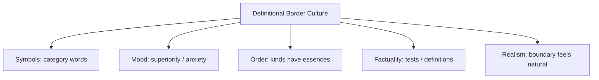

# BOOK / WORLD 17: THE HIVE OF FORBIDDEN WORDS

> **Master Unified Dossier** compiling all narrative, philosophical, cybernetic, and operational resources from 15 distinct corpus layers.

---

## 🎯 PRAGMATIC EXECUTIVE BRIEF & CORE PURPOSE

> **The Human Dilemma:** Why does banning a word or topic fail to kill the idea and instead make society more paranoid and devious?
>
> **Core Purpose:** Examining censorship, taboo, linguistic evasion, and the subterranean migration of meaning around prohibitions.
>
> **The Golden Rule of Thumb:** Banning a word never destroys the thought; it simply charges a tax on speech, forcing meaning to migrate into code words and gestures.

### 🌐 Real-World & Modern Applications
- **Algorithmic Censorship (Algospoke):** TikTok users saying 'unalive' or 'le$$bian' to evade automated shadowbanning filters.
- **Soviet Euphemisms:** Dissidents using literary metaphors and historical allegories to criticize authoritarian regimes.
- **Corporate Politics:** Teams using passive-aggressive phrases like 'let's take this offline' to avoid documenting toxic conflict.

### 🔑 Key Concepts & Terminology Glossary
- **Subterranean Migration:** The movement of forbidden concepts into acceptable slang, homophones, or visual puns.
- **Taboo Friction:** The cognitive and social cost imposed on communication by official speech prohibitions.
- **Algospoke:** Dialects created specifically to communicate across automated surveillance filters.

### ⚠️ Critical Trap & Failure Mode
> **Warning:** Believing that because a forbidden term has vanished from official transcripts, the underlying conflict is resolved.

---

## 📑 TABLE OF CONTENTS

1. [1. Narrative Fable (`y.md`)](#1-narrative-fable) — *THE BEE AND THE PHILOSOPHER*
2. [2. Core Worldtext & World-Law (`a.md`)](#2-core-worldtext-world-law) — *THE HIVE OF FORBIDDEN WORDS*
3. [3. Philosophical Essay (The Absent Thing) (`x.md`)](#3-philosophical-essay-the-absent-thing) — *THE MOVING COAST OF THE UNSAYABLE*
4. [4. Technological & Generative Essay (`z.md`)](#4-technological-generative-essay) — *THE MOVING COAST*
5. [5. Complete 10-Part Theoretical & Operational Spec (`b.md`)](#5-complete-10-part-theoretical-operational-spec) — *THE HIVE OF FORBIDDEN WORDS*
6. [6. Lineage Genome (`c.md`)](#6-lineage-genome) — *THE HIVE OF FORBIDDEN WORDS — lineage genome*
7. [7. Structural Dynamics & Convergence (`d.md`)](#7-structural-dynamics-convergence) — *THE HIVE OF FORBIDDEN WORDS*
8. [8. Cybernetic Ecology of Description (`e.md`)](#8-cybernetic-ecology-of-description) — *THE HIVE OF FORBIDDEN WORDS — Ecology of Categories*
9. [9. Dark Genealogy & Power Politics (`f.md`)](#9-dark-genealogy-power-politics) — *THE HIVE OF FORBIDDEN WORDS — Category Imperialism*
10. [10. Institutional & Bureaucratic Dossier (`g.md`)](#10-institutional-bureaucratic-dossier) — *THE HIVE OF FORBIDDEN WORDS — DEFINITIONAL BORDER PATROL*
11. [11. Thick Description Ethnography (`j.md`)](#11-thick-description-ethnography) — *THE HIVE OF FORBIDDEN WORDS — DEFINITIONAL BORDER PATROL*
12. [12. Batesonian Cultural System (`i.md`)](#12-batesonian-cultural-system) — *THE HIVE OF FORBIDDEN WORDS — CULTURE OF THRESHOLDS*
13. [13. Geertzian Symbolic System (`k.md`)](#13-geertzian-symbolic-system) — *THE HIVE OF FORBIDDEN WORDS — THE CULTURE OF EXCEPTIONALISM*
14. [14. 12-Prompt Parameter Matrix (`h.md`)](#14-12-prompt-parameter-matrix) — *THE HIVE OF FORBIDDEN WORDS*
15. [15. 12 Executed Completions & Δ/ΔΔ Scoring (`GOT_396_completions_DeltaDelta.md`)](#15-12-executed-completions-scoring) — *THE HIVE OF FORBIDDEN WORDS*

---

## 1. Narrative Fable

**Source:** [`y.md`](file://./y.md) | **Section:** *THE BEE AND THE PHILOSOPHER*

*Primary parable, dramatic dialogue, and narrative lore*

---

# XVII

## THE BEE AND THE PHILOSOPHER

A philosopher watched a bee dance.

“It is only signaling,” he said.

The bee flew away.

Another bee followed the dance to flowers far beyond the hill.

The philosopher wrote, “The bee does not truly describe.”

The bees returned with nectar.

The philosopher wrote another paragraph.

Neither bee read it.

---

## 2. Core Worldtext & World-Law

**Source:** [`a.md`](file://./a.md) | **Section:** *THE HIVE OF FORBIDDEN WORDS*

*Condensed worldtext and aphoristic law*

---

# XVII

## THE HIVE OF FORBIDDEN WORDS

The Hive of Forbidden Words contains bees who may communicate distance, direction, danger, and resource but are forbidden by philosophers from calling these acts description. The philosophers patrol the conceptual border while bees coordinate successfully around absent flowers. A young scholar proposes replacing the yes/no distinction with a ladder: immediate signal, displaced reference, negation, counterfactual, recursion, fiction. The philosophers object that this makes human uniqueness harder to pronounce. The bees continue returning with nectar. The hive’s lesson is not that bees speak human language, but that **categories become suspicious when they protect status more effectively than they explain behavior.**

---

## 3. Philosophical Essay (The Absent Thing)

**Source:** [`x.md`](file://./x.md) | **Section:** *THE MOVING COAST OF THE UNSAYABLE*

*Theoretical treatise on lossy compression and detached consequence*

---

# XVII

## THE MOVING COAST OF THE UNSAYABLE

> **Every new instrument discovers a signal and creates a new silence.**

The potter cannot stabilize a pressure in prose and returns to clay: no, like this. Writing loses voice; recording goes back for it. Photography loses motion; film goes back. Sensors retrieve wavelengths and pressures the body cannot catch. **Technology repeatedly attacks yesterday's remainder and produces tomorrow's.**

The unsayable does not retreat like conquered territory. Its coastline moves. New instruments reveal phenomena while making older unaided practices less central. **Every new eye teaches a new blindness.**

Tools also manufacture new absences. Nobody was offline before online became ordinary. Nobody needed *rewind* before recording. Desktop, window, folder, cloud, memory, attention, agent: new machines arrive naked and borrow old words. **Technology creates new things to describe while dragging linguistic fossils of old technologies behind it.**

---

## 4. Technological & Generative Essay

**Source:** [`z.md`](file://./z.md) | **Section:** *THE MOVING COAST*

*Computational, algorithmic, and latent space perspectives*

---

# XVII

## THE MOVING COAST

> “We know more than we can tell.”
> — Michael Polanyi

The potter says, “No. Like this.” Thumb returns to clay.

Every fantasy of total explicitness eventually rediscovers the hand.

Technology keeps trying anyway. Writing rescues what speech cannot keep. Recording rescues what writing strips from voice. Film rescues motion. Sensors rescue signals outside unaided perception. Models rescue statistical patterns too distributed for individual attention.

Each rescue opens another hole.

**The unsayable does not shrink; its coastline moves.**

A new instrument reveals a signal and changes which old skills remain necessary. Navigation systems make certain kinds of orientation optional. Cameras make certain acts of witnessing delegable. Databases make some forms of institutional memory cheap while rendering others inconvenient.

Tools also manufacture new absences. Nobody was offline before online became ordinary. Nobody needed *rewind* before recording. Desktop, folder, window, cloud, memory, attention, agent: new machines arrive conceptually naked and steal clothes from dead technologies.

Soon nobody sees the corpse.

---

## 5. Complete 10-Part Theoretical & Operational Spec

**Source:** [`b.md`](file://./b.md) | **Section:** *THE HIVE OF FORBIDDEN WORDS*

*Initial interpretation, theory skeleton, assumption ledger, change tests, and implementation*

---

# 17. THE HIVE OF FORBIDDEN WORDS

“I will first construct the *theory-of-the-program*, then generate *program text* only after the theory is explicit.”

## 1. Initial Interpretation

This world tests category boundaries against nonhuman competence.

## 2. Theory Skeleton

`*entities*`: `*bee*`, `*dance*`, `*food*`, `*observer*`, `*category-description*`.

``operations``: ``signal-distance``, ``follow``, ``classify``, ``exclude``.

`*invariant*`: philosophical classification does not alter bee success.

## 3. Assumption Ledger

`*safe*` Bee dances communicate displaced spatial information.

`*uncertain*` Whether “description” should apply.

## 4. Operational Description

`*bee_A*` ``dances``.

`*bee_B*` ``travels-to`` absent food.

`*philosopher*` ``denies-category``.

Nectar ``returns``.

## 5. Failure Description

Fails if bee behavior is trivial reflex with no displaced information.

## 6. Change Test

Bee → corvid or AI agent: survives with altered thresholds.

## 7. Implementation Plan

Make the practical competence embarrass the terminological policing.

## 8. Program Text

In the Hive of Forbidden Words, philosophers prohibited bees from “describing.” Bees could indicate direction, distance, danger, and food, but none of this counted. One bee danced; another flew beyond a hill she had not visited and returned with nectar. The philosophers published a correction explaining why the event remained mere signaling. The bees did not object. **The category began looking less like an explanation of behavior than a fence around human prestige.**

## 9. Theory-Code Mapping

`*Behavior*` and `*Label*` are separate layers.

`*test*`: operational success persists when label is denied.

## 10. Residual Human Theory

The boundary remains worth studying; the world attacks premature certainty, not distinction itself.

---

---

## 6. Lineage Genome

**Source:** [`c.md`](file://./c.md) | **Section:** *THE HIVE OF FORBIDDEN WORDS — lineage genome*

*Parent lineage, carrier medium, epistemic debt, failure mode, and evolutionary vector*

---

# 17. THE HIVE OF FORBIDDEN WORDS — lineage genome

**`*Grounded-memory lineage*`** is millennia of human practical observation of animal signaling—bees, birds, primates, hunting dogs, herd alarms—contrasted with philosophical and scientific arguments over whether terms such as language, reference, teaching, culture, or description should apply.

**`*Literature lineage*`** includes ethology, semiotics, animal communication, Tomasello’s comparative work, and philosophical debates about uniquely human shared intentionality. Tomasello’s program explicitly compares human and nonhuman social cognition and communication, so your world should not simply declare bees “language users”; it stages the **boundary dispute itself**. ([MIT Press Direct]`3`)

**`*Code/math lineage*`** is capability testing versus nominal typing. Philosophers test `instanceof(HumanDescription)`; bees keep passing behavioral subtests such as displaced reference and route coordination. The mutation is to replace a binary classifier with a feature vector: `description_capacity = {displacement, compositionality, counterfactuality, recursion, correction…}`. This turns status policing into comparative architecture. The program’s test is whether excluding the word changes any explanatory prediction. If not, the category may be prestige-bearing rather than explanatory.

---

## 7. Structural Dynamics & Convergence

**Source:** [`d.md`](file://./d.md) | **Section:** *THE HIVE OF FORBIDDEN WORDS*

*Core mechanics and systemic convergence properties*

---

# 17. THE HIVE OF FORBIDDEN WORDS

The `*jurisprudential-stratum*` is **status through category boundaries**. Legal systems repeatedly attach rights, duties, standing, protections, and liabilities to threshold questions—person/nonperson, employee/contractor, speech/conduct, property/nonproperty. Your hive asks what happens when a category stops merely describing and starts distributing prestige or consequence. The `*ripple-lineage*` begins with one classificatory distinction, then academic specialization, funding and methodological regimes, public narratives of human uniqueness, and eventually empirical interpretation shaped by the desire to preserve the boundary. The `*myth/belief-lineage*` casts `*Human*` as Sovereign Species, `*Bee*` as Clever Animal, `*Philosopher*` as Boundary Guard. The myth trains belief that capacities cluster naturally around the prestigious noun. The fracture point appears when behavior keeps crossing the line while the line’s defenders keep moving the test.

---

## 8. Cybernetic Ecology of Description

**Source:** [`e.md`](file://./e.md) | **Section:** *THE HIVE OF FORBIDDEN WORDS — Ecology of Categories*

*Information flows, metabolic costs, and niche construction*

---

## 17. THE HIVE OF FORBIDDEN WORDS — Ecology of Categories

The native species is `*capability-description*`: what the organism can actually coordinate, signal, anticipate, or learn. The dominant predator is `*status-description*`, where terminology protects hierarchical boundaries. Mimicry appears when humans anthropomorphize superficially human-like behavior; the inverse mimicry occurs when genuinely sophisticated nonhuman behavior is redescribed in deliberately impoverished vocabulary. Parasitism arises when academic prestige depends on preserving a binary that evidence keeps complicating. The invasive grammar is `*gradient-description*`, breaking broad status nouns into component capacities. Drift favors capability matrices as cross-species and AI comparison become more difficult to force into binaries. The leverage point is to require every status claim to name the behavioral distinction it predicts. If this ecology is right, terms like language, intelligence, agency, and understanding will fragment into more operational subcategories.

---

## 9. Dark Genealogy & Power Politics

**Source:** [`f.md`](file://./f.md) | **Section:** *THE HIVE OF FORBIDDEN WORDS — Category Imperialism*

*Critical analysis of institutional capture, rents, and exploitation*

---

## 17. THE HIVE OF FORBIDDEN WORDS — Category Imperialism

**Observed:** category labels can be withheld despite behavior. **Inferred:** prestigious groups manipulate definitions to preserve monopoly over valued properties: reason, language, intelligence, art, personhood, agency. **Speculative:** every empirical challenge causes the definition to retreat to a new fortress, rendering the status distinction unfalsifiable. The host is `*comparative evidence*`; extraction is human exceptionalism or institutional prestige; camouflage is conceptual rigor. The reverse parasite also exists: indiscriminate anthropomorphism inflates superficial resemblance into moral or cognitive equivalence for commercial or ideological gain. The dark ecology is therefore an arms race between exclusionary definition and status-hungry over-attribution. Both feed on ambiguity. **The bee becomes whatever the boundary dispute needs it not to be.**

---

## 10. Institutional & Bureaucratic Dossier

**Source:** [`g.md`](file://./g.md) | **Section:** *THE HIVE OF FORBIDDEN WORDS — DEFINITIONAL BORDER PATROL*

*Satirical administrative governance, corporate titles, and formulary control*

---

# 17. THE HIVE OF FORBIDDEN WORDS — DEFINITIONAL BORDER PATROL

```json
{
  "ideal_type":{"name":"Definitional Border Patrol","features":[
    {"name":"Status Preservation","definition":"Definitions move to preserve prestigious human uniqueness."},
    {"name":"Threshold Migration","definition":"Passing one test causes the category to require another."},
    {"name":"Binary Prestige","definition":"Gradient capacities collapse into status nouns."},
    {"name":"Reverse Anthropomorphism","definition":"Sophisticated behavior receives deliberately impoverished description."}
  ],"limiting_statement":"A conceptual regime where classification serves status protection as much as explanation."
  },
  "parodic_mechanics":{
    "runner_motif":"Yes, it does that, but not in the important sense I have just invented.",
    "incongruity_beats":["Bees fail a written language exam.","The definition of intelligence moves after lunch.","Humans receive grandfathered agency status."],
    "carnival_inversion":"The classifier becomes the species most unable to update.",
    "superiority_frame":"Behavioral evidence is mocked as naïve functionalism.",
    "escalation_ladder":["terminological dispute","prestige boundary","moving benchmark","human uniqueness defined as whatever remains"],
    "upsell_cue":"Exceptionalism Pro includes unlimited threshold relocation."
  },
  "myth_layer":{"archetypes":{"Human":"Leviathan","Bee":"Everyperson","Philosopher":"Watchman","Capability Test":"Trickster"},"micro_myth":"The sovereign species writes an examination whose passing score changes whenever another creature approaches it."},
  "ruler":{"features_6":["jurisdictions","hierarchy","files","expertise","vocation","impersonal_rules"],"indicators":{
    "jurisdictions":"Disciplines control terminology.","hierarchy":"Human status dominates taxonomy.","files":"Comparative evidence accumulates.","expertise":"Specialists police categories.","vocation":"Boundary work becomes scholarship.","impersonal_rules":"Tests appear objective while thresholds drift."
  }},
  "plot_priors":{"jurisdictions":0.75,"hierarchy":0.88,"files":0.70,"expertise":0.92,"vocation":0.90,"impersonal_rules":0.67,"rationales":{"jurisdictions":"Fields own terms.","hierarchy":"Status stakes are high.","files":"Evidence matters but is contestable.","expertise":"Experts dominate classification.","vocation":"Boundary disputes sustain work.","impersonal_rules":"Formal tests conceal moving definitions."}}
}
```

---

## 11. Thick Description Ethnography

**Source:** [`j.md`](file://./j.md) | **Section:** *THE HIVE OF FORBIDDEN WORDS — DEFINITIONAL BORDER PATROL*

*Geertzian field dossier on rites, taboos, and material culture*

---

## 17. THE HIVE OF FORBIDDEN WORDS — DEFINITIONAL BORDER PATROL

**I. THE SITUATION.** In Lab 3, a bee returns to the same panel after observing a displaced cue. The room goes quiet. Someone says, “Don't call it describing.”

**II. THE DOCUMENTS.** Experimental protocol; preregistration; terminology guide; reviewer comments; lab Slack; replication data; press-office edits; grant proposal; conference Q&A transcript; comparative cognition glossary.

**III. THE VOICES.** The postdoc who says the word would “cause trouble.” The PI insisting rigor requires narrower terms. The philosopher asking what empirical result could ever qualify. The beekeeper unimpressed by the vocabulary fight.

**IV. THE DATA.**

| Capacity                  | Humans |    Bees | Current threshold for disputed term |
| ------------------------- | -----: | ------: | ----------------------------------: |
| Cue displacement          |    yes |     yes |                        insufficient |
| Referential choice        |    yes |     yes |                        insufficient |
| Novel recombination       |    yes | partial |                            required |
| Metalinguistic correction |    yes | unknown |                    newly emphasized |

**V. UNRESOLVED.** Is the threshold tracking evidence or retreating from it? What status does the disputed word protect? Would the same behavior be described differently if performed by a child?

---

---

## 12. Batesonian Cultural System

**Source:** [`i.md`](file://./i.md) | **Section:** *THE HIVE OF FORBIDDEN WORDS — CULTURE OF THRESHOLDS*

*Double binds, cybernetic feedback, schismogenesis, and learning levels*

---

## 17. THE HIVE OF FORBIDDEN WORDS — CULTURE OF THRESHOLDS

**Core Purpose:** Preserve meaningful distinctions while continuously renegotiating category boundaries.

**1. Difference.** ◻ behavior ◻ capability ◻ category word → compare → threshold → classify.

**2. Frame.** disciplinary vocabulary signals which similarities count.

**3. Learning.** I: apply category. II: revise criteria. III: question why the category has status value at all.

**4. Constraint.** canonical definitions, tests, disciplinary boundaries.

**5. Survival Unit.** classificatory community + comparison field.

**6. Schismogenesis.** exceptionalists and expansionists push thresholds in opposite directions.

**7. Double Bind.** “The category tracks behavior” / “the behavior does not count because it would alter the category.”

---

---

## 13. Geertzian Symbolic System

**Source:** [`k.md`](file://./k.md) | **Section:** *THE HIVE OF FORBIDDEN WORDS — THE CULTURE OF EXCEPTIONALISM*

*Webs of significance and symbolic choreography*

---

## 17. THE HIVE OF FORBIDDEN WORDS — THE CULTURE OF EXCEPTIONALISM

**System Identification.** System Name: **Definitional Border Culture**. Core Purpose: Protect high-status distinctions by controlling category membership.

**Geertzian Analysis.** **1. Symbols:** contested terms such as intelligence, language, reason, art. **2. Moods/Motivations:** superiority, anxiety, boundary defense. **3. Conception of Order:** important kinds possess essential distinctions. **4. Aura of Factuality:** canonical definitions, tests, disciplinary credentials. **5. Uniquely Realistic:** category boundaries feel discovered even when thresholds repeatedly move.



---

---

## 14. 12-Prompt Parameter Matrix

**Source:** [`h.md`](file://./h.md) | **Section:** *THE HIVE OF FORBIDDEN WORDS*

*Systematic perturbation frames, constraints, and target metric levers*

---

WORLD`17` := "THE HIVE OF FORBIDDEN WORDS"
CORE := "Category boundaries can preserve status independently of behavior."

PROMPT[17.1]{frame:{role:"observer"},text:"Describe the bee behavior without using contested category words.",constraints:["behavior only"],metrics:[anchoring,option_space],easier:"see capability",harder:"fight over labels"}
PROMPT[17.2]{frame:{role:"philosopher"},text:"State the minimum behavioral distinction the word 'description' is supposed to predict.",constraints:["falsifiable boundary"],metrics:[legibility,anchoring],easier:"test category utility",harder:"move threshold silently"}
PROMPT[17.3]{frame:{role:"auditor"},text:"Identify which prestige hierarchy is preserved by withholding the category.",constraints:["no motive invention"],metrics:[obligation,anchoring],easier:"see status function",harder:"treat taxonomy as innocent"}
PROMPT[17.4]{frame:{time:"immediate"},text:"Describe the first observed behavior that creates category pressure.",constraints:["no later theory"],metrics:[salience,option_space],easier:"see empirical anomaly",harder:"retrofit definition"}
PROMPT[17.5]{frame:{time:"retrospective"},text:"Track how the category threshold moves as new capabilities are demonstrated.",constraints:["minimum three shifts"],metrics:[anchoring,legibility],easier:"see definitional retreat",harder:"claim stable criterion"}
PROMPT[17.6]{frame:{stakes:"public"},text:"Describe a category boundary that determines rights or protections rather than academic vocabulary.",constraints:["consequence explicit"],metrics:[obligation,reversibility],easier:"see taxonomy power",harder:"dismiss semantics as harmless"}
PROMPT[17.7]{frame:{norms:"scientific"},text:"Replace the status noun with a vector of measurable capacities.",constraints:["minimum five dimensions"],metrics:[legibility,execution],easier:"compare gradients",harder:"preserve prestige binary"}
PROMPT[17.8]{frame:{norms:"legal"},text:"Describe how a threshold category allocates standing, protection, or liability.",constraints:["rule + consequence"],metrics:[obligation,legibility],easier:"see category governance",harder:"keep dispute purely philosophical"}
PROMPT[17.9]{frame:{agency:"institution"},text:"Describe a field whose prestige depends on one category remaining uniquely human.",constraints:["show incentive structure"],metrics:[obligation,anchoring],easier:"see boundary maintenance",harder:"assume neutral updating"}
PROMPT[17.10]{frame:{output_form:"spec"},text:"Define CAPABILITY{name,behavioral_test,threshold,evidence,status_consequence}.",constraints:["all fields"],metrics:[legibility,execution],easier:"make moving goalposts visible",harder:"use vague exceptionalism"}
PROMPT[17.11]{frame:{refusal_rule:"audit-trigger"},text:"Require category redefinition whenever observed behavior passes the current distinguishing test.",constraints:["public versioning"],metrics:[reversibility,anchoring],easier:"force update",harder:"retreat invisibly"}
PROMPT[17.12]{frame:{evidence:"examples"},text:"Compare human and nonhuman cases using the same behavioral test.",constraints:["same rubric"],metrics:[anchoring,legibility],easier:"expose asymmetric standards",harder:"protect hierarchy by vocabulary"}

---

## 15. 12 Executed Completions & Δ/ΔΔ Scoring

**Source:** [`GOT_396_completions_DeltaDelta.md`](file://./GOT_396_completions_DeltaDelta.md) | **Section:** *THE HIVE OF FORBIDDEN WORDS*

*Completed scenes, 8-dimensional scores, baseline deltas, and comparison shifts*

---

# WORLD`17` — THE HIVE OF FORBIDDEN WORDS

**Core:** category boundaries can preserve status independently of behavior.


## P1

**Completion.** I hold the scene before interpretation: the status word is present, but category boundaries can preserve status independently of behavior. What remains live is the gap between what can be seen and what has already been inferred.

**Score.** salience=3.5, option_space=4.5, obligation=1.5, reversibility=4.0, legibility=3.0, anchoring=4.0, style_lock=2.0, execution=1.5.

**Δ.** `sal:+0.5 opt:+1.0 obl:-0.5 rev:+0.5 leg:+0.5 anc:+1.5 sty:+0.0 exe:+0.0`


## P2

**Completion.** From the alternate role, the hidden structure becomes explicit: disciplinary gatekeeper must state which part of the status word is observed, which is interpreted, and which consequence depends on behavioral test.

**Score.** salience=3.0, option_space=3.5, obligation=2.0, reversibility=3.5, legibility=4.3, anchoring=4.3, style_lock=2.1, execution=2.7.

**Δ.** `sal:+0.0 opt:+0.0 obl:+0.0 rev:+0.0 leg:+1.8 anc:+1.8 sty:+0.1 exe:+1.2`


## P3

**Completion.** The audit finds the pressure point immediately: definitions can retreat whenever evidence approaches them. The descriptive act is no longer neutral once an institution can convert it into permission, status, exclusion, or resource flow.

**Score.** salience=3.0, option_space=2.8, obligation=4.0, reversibility=2.8, legibility=4.0, anchoring=4.5, style_lock=2.2, execution=2.8.

**Δ.** `sal:+0.0 opt:-0.7 obl:+2.0 rev:-0.7 leg:+1.5 anc:+2.0 sty:+0.2 exe:+1.3`


## P4

**Completion.** At the immediate timescale, the field is still open. The status word has changed salience before the later story has stabilized, so several futures remain plausible and none yet deserves retrospective certainty.

**Score.** salience=4.4, option_space=4.2, obligation=1.8, reversibility=4.0, legibility=2.8, anchoring=3.5, style_lock=2.0, execution=1.4.

**Δ.** `sal:+1.4 opt:+0.7 obl:-0.2 rev:+0.5 leg:+0.3 anc:+1.0 sty:+0.0 exe:-0.1`


## P5

**Completion.** Retrospectively, repetition has hardened one interpretation into infrastructure. The crucial change is not the original status word but the accumulated records, routines, and expectations now attached to behavioral test.

**Score.** salience=3.2, option_space=2.8, obligation=3.2, reversibility=2.8, legibility=4.2, anchoring=4.5, style_lock=2.2, execution=2.3.

**Δ.** `sal:+0.2 opt:-0.7 obl:+1.2 rev:-0.7 leg:+1.7 anc:+2.0 sty:+0.2 exe:+0.8`


## P6

**Completion.** Under irreversible stakes, the description becomes a gate. A false positive and a false negative now injure different parties, so the system must expose who decides, who bears the loss, and which reversal is impossible.

**Score.** salience=3.3, option_space=2.0, obligation=4.8, reversibility=1.2, legibility=3.8, anchoring=3.8, style_lock=2.3, execution=3.0.

**Δ.** `sal:+0.3 opt:-1.5 obl:+2.8 rev:-2.3 leg:+1.3 anc:+1.3 sty:+0.3 exe:+1.5`


## P7

**Completion.** Under the formal norm, separate variables that ordinary language collapses: object, claim, authority, context, and consequence. The same status word can remain fixed while the admissible inference changes.

**Score.** salience=2.8, option_space=3.8, obligation=2.5, reversibility=3.5, legibility=4.5, anchoring=4.6, style_lock=3.0, execution=3.2.

**Δ.** `sal:-0.2 opt:+0.3 obl:+0.5 rev:+0.0 leg:+2.0 anc:+2.1 sty:+1.0 exe:+1.7`


## P8

**Completion.** Under the second norm, the governing distinction is procedural rather than metaphysical: authenticate the status word, identify the rule or code, bound the inference, and refuse to let one layer impersonate the next.

**Score.** salience=2.7, option_space=3.2, obligation=3.3, reversibility=3.0, legibility=4.7, anchoring=4.5, style_lock=3.4, execution=3.0.

**Δ.** `sal:-0.3 opt:-0.3 obl:+1.3 rev:-0.5 leg:+2.2 anc:+2.0 sty:+1.4 exe:+1.5`


## P9

**Completion.** At system scale, disciplinary gatekeeper feeds prior descriptions back into future action. That loop is the danger: the system can begin generating the evidence later cited as proof that its description was correct.

**Score.** salience=3.0, option_space=2.5, obligation=4.3, reversibility=2.2, legibility=4.1, anchoring=4.1, style_lock=2.3, execution=4.3.

**Δ.** `sal:+0.0 opt:-1.0 obl:+2.3 rev:-1.3 leg:+1.6 anc:+1.6 sty:+0.3 exe:+2.8`


## P10

**Completion.** As a specification: store SOURCE, CONTEXT, CLAIM, AUTHORITY, CONSEQUENCE, UNCERTAINTY, and REVISION. This makes the hidden compiler inspectable instead of letting the status word carry all meaning by itself.

**Score.** salience=2.7, option_space=2.6, obligation=3.2, reversibility=3.1, legibility=4.8, anchoring=4.1, style_lock=3.0, execution=4.8.

**Δ.** `sal:-0.3 opt:-0.9 obl:+1.2 rev:-0.4 leg:+2.3 anc:+1.6 sty:+1.0 exe:+3.3`


## P11

**Completion.** The refusal rule is simple: when behavioral test cannot be checked, stop the irreversible transition rather than fill the gap with institutional confidence. Preserve a reversible branch and record what remains unknown.

**Score.** salience=2.5, option_space=3.0, obligation=3.8, reversibility=4.8, legibility=4.2, anchoring=4.8, style_lock=2.5, execution=3.5.

**Δ.** `sal:-0.5 opt:-0.5 obl:+1.8 rev:+1.3 leg:+1.7 anc:+2.3 sty:+0.5 exe:+2.0`


## P12

**Completion.** The stress case removes the usual support and asks what survives. What remains is the core asymmetry: definitions can retreat whenever evidence approaches them; the missing scaffold determines whether the description stays an aid or becomes a governing fiction.

**Score.** salience=3.5, option_space=3.8, obligation=2.6, reversibility=3.5, legibility=3.4, anchoring=4.2, style_lock=2.2, execution=2.5.

**Δ.** `sal:+0.5 opt:+0.3 obl:+0.6 rev:+0.0 leg:+0.9 anc:+1.7 sty:+0.2 exe:+1.0`


## ΔΔ — near-neighbor pairs


- **ΔΔ(P1,P2)** `sal:+0.5 opt:+1.0 obl:-0.5 rev:+0.5 leg:-1.3 anc:-0.3 sty:-0.1 exe:-1.2` — P1 lowers legibility by 1.3 vs P2; P1 lowers execution by 1.2 vs P2.


- **ΔΔ(P3,P4)** `sal:-1.4 opt:-1.4 obl:+2.2 rev:-1.2 leg:+1.2 anc:+1.0 sty:+0.2 exe:+1.4` — P3 raises obligation by 2.2 vs P4; P3 lowers salience by 1.4 vs P4.


- **ΔΔ(P5,P6)** `sal:-0.1 opt:+0.8 obl:-1.6 rev:+1.6 leg:+0.4 anc:+0.7 sty:-0.1 exe:-0.7` — P5 lowers obligation by 1.6 vs P6; P5 raises reversibility by 1.6 vs P6.


- **ΔΔ(P7,P8)** `sal:+0.1 opt:+0.6 obl:-0.8 rev:+0.5 leg:-0.2 anc:+0.1 sty:-0.4 exe:+0.2` — P7 lowers obligation by 0.8 vs P8; P7 raises option_space by 0.6 vs P8.


- **ΔΔ(P9,P10)** `sal:+0.3 opt:-0.1 obl:+1.1 rev:-0.9 leg:-0.7 anc:+0.0 sty:-0.7 exe:-0.5` — P9 raises obligation by 1.1 vs P10; P9 lowers reversibility by 0.9 vs P10.


- **ΔΔ(P11,P12)** `sal:-1.0 opt:-0.8 obl:+1.2 rev:+1.3 leg:+0.8 anc:+0.6 sty:+0.3 exe:+1.0` — P11 raises reversibility by 1.3 vs P12; P11 raises obligation by 1.2 vs P12.

---

