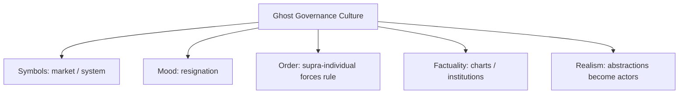

# BOOK / WORLD 18: THE COUNTRY OF NEGATIVE ANIMALS

> **Master Unified Dossier** compiling all narrative, philosophical, cybernetic, and operational resources from 15 distinct corpus layers.

---

## 🎯 PRAGMATIC EXECUTIVE BRIEF & CORE PURPOSE

> **The Human Dilemma:** How do we describe realities that exceed our vocabulary except by listing everything they exclude?
>
> **Core Purpose:** Exploring apophasis, boundary definitions, and characterizing complex systems by what they are *not*.
>
> **The Golden Rule of Thumb:** When an entity is too large, subtle, or complex for direct nouns, sculpting its negative space is the only honest description.

### 🌐 Real-World & Modern Applications
- **Negative Architecture / API Specifications:** Defining what an API endpoint must *never* do (security invariants) rather than all allowed states.
- **Apophatic Theology & Philosophy:** Defining the divine or absolute reality strictly through negation (neti neti, 'not this, not that').
- **Machine Learning Decision Boundaries:** Classifying high-dimensional spaces by learning the hyperplanes that separate classes.

### 🔑 Key Concepts & Terminology Glossary
- **Apophasis:** Describing something by stating what it is not, carving out reality through negation.
- **Negative Space Modeling:** Understanding a complex system by examining its constraints, taboos, and failure boundaries.
- **Boundary Sculpting:** Defining identity through limits rather than positive substance.

### ⚠️ Critical Trap & Failure Mode
> **Warning:** Becoming so obsessed with negative definition that you fail to provide actionable positive guidance when needed.

---

## 📑 TABLE OF CONTENTS

1. [1. Narrative Fable (`y.md`)](#1-narrative-fable) — *THE ABSENT WOLF*
2. [2. Core Worldtext & World-Law (`a.md`)](#2-core-worldtext-world-law) — *THE COUNTRY OF NEGATIVE ANIMALS*
3. [3. Philosophical Essay (The Absent Thing) (`x.md`)](#3-philosophical-essay-the-absent-thing) — *DESCRIPTION GOES GLOBAL*
4. [4. Technological & Generative Essay (`z.md`)](#4-technological-generative-essay) — *HOW IT LEFT HOME*
5. [5. Complete 10-Part Theoretical & Operational Spec (`b.md`)](#5-complete-10-part-theoretical-operational-spec) — *THE COUNTRY OF NEGATIVE ANIMALS*
6. [6. Lineage Genome (`c.md`)](#6-lineage-genome) — *THE COUNTRY OF NEGATIVE ANIMALS — lineage genome*
7. [7. Structural Dynamics & Convergence (`d.md`)](#7-structural-dynamics-convergence) — *THE COUNTRY OF NEGATIVE ANIMALS*
8. [8. Cybernetic Ecology of Description (`e.md`)](#8-cybernetic-ecology-of-description) — *THE COUNTRY OF NEGATIVE ANIMALS — Ecology of Modalities*
9. [9. Dark Genealogy & Power Politics (`f.md`)](#9-dark-genealogy-power-politics) — *THE COUNTRY OF NEGATIVE ANIMALS — Fictional Sovereignty*
10. [10. Institutional & Bureaucratic Dossier (`g.md`)](#10-institutional-bureaucratic-dossier) — *THE COUNTRY OF NEGATIVE ANIMALS — GHOST GOVERNANCE*
11. [11. Thick Description Ethnography (`j.md`)](#11-thick-description-ethnography) — *THE COUNTRY OF NEGATIVE ANIMALS — GHOST GOVERNANCE*
12. [12. Batesonian Cultural System (`i.md`)](#12-batesonian-cultural-system) — *THE COUNTRY OF NEGATIVE ANIMALS — CULTURE OF MODALITY*
13. [13. Geertzian Symbolic System (`k.md`)](#13-geertzian-symbolic-system) — *THE COUNTRY OF NEGATIVE ANIMALS — THE CULTURE OF ABSTRACT ACTORS*
14. [14. 12-Prompt Parameter Matrix (`h.md`)](#14-12-prompt-parameter-matrix) — *THE COUNTRY OF NEGATIVE ANIMALS*
15. [15. 12 Executed Completions & Δ/ΔΔ Scoring (`GOT_396_completions_DeltaDelta.md`)](#15-12-executed-completions-scoring) — *THE COUNTRY OF NEGATIVE ANIMALS*

---

## 1. Narrative Fable

**Source:** [`y.md`](file://./y.md) | **Section:** *THE ABSENT WOLF*

*Primary parable, dramatic dialogue, and narrative lore*

---

# XVIII

## THE ABSENT WOLF

A shepherd shouted, “There is no wolf.”

Everyone relaxed.

A child asked, “Which wolf?”

“The wolf that isn't there.”

The child looked toward the tree line.

Nothing stood there.

“Why are we looking at it?”

Nobody answered.

Years later the child became a poet and invented a dragon.

The dragon never existed.

The kingdom put it on coins.

---

## 2. Core Worldtext & World-Law

**Source:** [`a.md`](file://./a.md) | **Section:** *THE COUNTRY OF NEGATIVE ANIMALS*

*Condensed worldtext and aphoristic law*

---

# XVIII

## THE COUNTRY OF NEGATIVE ANIMALS

In the Country of Negative Animals, nonexistent creatures enjoy legal standing if enough citizens coordinate around them. “There is no wolf” creates an officially recognized Wolf Absence Zone; invented dragons appear on flags, shape architecture, regulate rites, and terrify children. Philosophers complain that the state has confused reality and imagination. Legislators reply that the dragon’s nonexistence has not prevented it from collecting taxes through tourism. The country distinguishes material existence from operational existence: an entity may lack a body and still alter bodies. **Language becomes radically human when absence and impossibility can acquire coordinates in shared action.**

---

## 3. Philosophical Essay (The Absent Thing)

**Source:** [`x.md`](file://./x.md) | **Section:** *DESCRIPTION GOES GLOBAL*

*Theoretical treatise on lossy compression and detached consequence*

---

# XVIII

## DESCRIPTION GOES GLOBAL

> **Description conquers distance by thinning its cord to origin.**

A cave mark can outlive the hand, voice, ritual, joke, weather, social rule that made it. Writing lets the dead continue issuing marks but removes their ability to correct our readings. **History exists because detachment preserves and betrays in the same stroke.**

Description goes global by learning to leave: first the speaker's gaze, then the place, then the event, then the living voice, then the local copy. Pointing keeps the scene but cannot cross centuries. Writing crosses centuries and loses the throat. Networks lose geography. **Scale grows as origin becomes harder to see.**

Generative media push this farther. A synthetic image can preserve pores, lens blur, catchlights, asymmetry, sweat shine while no photographed person ever stood before a lens. **The missing signal is no longer realism. It is the class of event that produced the appearance.**

---

## 4. Technological & Generative Essay

**Source:** [`z.md`](file://./z.md) | **Section:** *HOW IT LEFT HOME*

*Computational, algorithmic, and latent space perspectives*

---

# XVIII

## HOW IT LEFT HOME

> “Go, little book, go, little tragedy.”
> — Geoffrey Chaucer

A mark on stone can survive its maker by forty thousand years. Excellent storage. Terrible customer support.

The maker cannot explain whether the mark was ritual, tally, ownership claim, joke, warning, boredom. Persistence solves one problem by worsening another. The mark survives precisely because it no longer requires its author to remain present. The author therefore loses the ability to correct it.

**Writing defeats death by killing correction.**

Description goes global through repeated acts of leaving. Pointing leaves one person's gaze but keeps the scene. Speech leaves direct encounter. Writing leaves the speaker. Print leaves the local copy. Networks leave geography. Each departure increases reach while thinning one cord to origin.

We usually call the first half progress in communication. We hide the second half in scholarly apparatus: missing context, uncertain provenance, changed audience, altered use.

Generative media push detachment into stranger territory. A representation can preserve the appearance of photographic encounter without an encounter ever having occurred. The old question, “Does this look real?” becomes inadequate.

The new question is: **What kind of event was capable of producing this?**

---

## 5. Complete 10-Part Theoretical & Operational Spec

**Source:** [`b.md`](file://./b.md) | **Section:** *THE COUNTRY OF NEGATIVE ANIMALS*

*Initial interpretation, theory skeleton, assumption ledger, change tests, and implementation*

---

# 18. THE COUNTRY OF NEGATIVE ANIMALS

“I will first construct the *theory-of-the-program*, then generate *program text* only after the theory is explicit.”

## 1. Initial Interpretation

This world models `*operational-existence*` without `*material-existence*`.

## 2. Theory Skeleton

`*entities*`: `*absent-wolf*`, `*dragon*`, `*symbol*`, `*citizen*`, `*institution*`.

``operations``: ``negate``, ``imagine``, ``coordinate-around``, ``institutionalize``.

`*invariant*`: nonexistent referent can have real consequences.

## 3. Assumption Ledger

`*safe*` Fictional and abstract entities shape behavior.

## 4. Operational Description

“No wolf” ``creates`` attention to absence.

“Dragon” ``creates`` symbol.

Symbol ``organizes`` architecture/ritual/politics.

## 5. Failure Description

Fails if citizens never act differently.

## 6. Change Test

Dragon → corporation or future scenario: partially survives, though ontology changes.

## 7. Implementation Plan

Give nonexistent entities explicit civic consequences.

## 8. Program Text

In the Country of Negative Animals, the law recognized things that were not there. “There is no wolf” created a Wolf Absence Zone. An invented dragon appeared on coins, gates, helmets, tax seals. Philosophers objected that the dragon did not exist. Tourism officials replied that it accounted for twelve percent of revenue. **The country discovered that material existence and operational existence were different jurisdictions.**

## 9. Theory-Code Mapping

`*Entity.modality*` may be nonexistent.

`[affectWorld()]` need not require material instantiation.

## 10. Residual Human Theory

Institutions, fictional characters, and imaginary animals are not ontologically identical.

---

---

## 6. Lineage Genome

**Source:** [`c.md`](file://./c.md) | **Section:** *THE COUNTRY OF NEGATIVE ANIMALS — lineage genome*

*Parent lineage, carrier medium, epistemic debt, failure mode, and evolutionary vector*

---

# 18. THE COUNTRY OF NEGATIVE ANIMALS — lineage genome

**`*Grounded-memory lineage*`** is myths, legal fictions, gods, corporations, nations, debts, promises, imaginary dangers, planned buildings, and deceased ancestors: entities not present in the ordinary physical sense that nonetheless organize action.

**`*Literature lineage*`** moves through Meinong and fictional-object debates, Vaihinger’s useful fictions, institutional ontology, possible-world semantics, and fiction theory. Your country’s crucial distinction is **material existence versus operational participation**. The Stanford fiction literature makes the complementary point that props and texts can prescribe imaginings and support organized games of make-believe. ([Stanford Encyclopedia of Philosophy]`4`)

**`*Code/math lineage*`** is modal logic and symbolic planning. An entity can have `modality = fictional | hypothetical | absent` while still entering constraints and policies. Simulation engines do this constantly: nonexistent futures influence present actions. The mutation is to refuse boolean existence as the only eligibility criterion for causal relevance. Formally: `materialize(x) = false` does not imply `effect_on_policy(x) = 0`.

---

## 7. Structural Dynamics & Convergence

**Source:** [`d.md`](file://./d.md) | **Section:** *THE COUNTRY OF NEGATIVE ANIMALS*

*Core mechanics and systemic convergence properties*

---

# 18. THE COUNTRY OF NEGATIVE ANIMALS

The `*jurisprudential-stratum*` is legal fiction and juridical personhood: law routinely reasons through entities, statuses, anticipated harms, future interests, and institutional constructs that do not resemble ordinary physical objects. Your country’s key archaeological distinction is not real/unreal but **what consequences an authorized fiction may carry**. The `*ripple-lineage*` begins with a useful imaginary coordination device, then institutional adoption, property and budget attached to it, offices tasked with administering it, and eventually a fiction whose material infrastructure makes questioning the fiction look absurd. The `*myth/belief-lineage*` casts `*Dragon*` as Sovereign Symbol and `*Treasury*` as its bodily organ. The trained worldview says “if it produces material consequences, it must be real in the same way other things are.” Your world refuses that flattening and keeps modality visible.

---

## 8. Cybernetic Ecology of Description

**Source:** [`e.md`](file://./e.md) | **Section:** *THE COUNTRY OF NEGATIVE ANIMALS — Ecology of Modalities*

*Information flows, metabolic costs, and niche construction*

---

## 18. THE COUNTRY OF NEGATIVE ANIMALS — Ecology of Modalities

The native species is `*modal-description*`: actual, absent, fictional, hypothetical, institutional, simulated. Selection pressure comes from coordination around entities that need not be materially present. Predation occurs when one modality—usually “real”—attempts to flatten all others. Mimicry appears when fictional or hypothetical entities borrow the presentation conventions of actual ones. Parasitism occurs when institutions exploit ambiguity between modes. The invasive grammar is `*binary-existence-description*`, which asks only whether something exists. Drift favors richer modality tagging as synthetic and simulated entities proliferate. The leverage point is to make modality explicit at the interface. If this ecology is right, societies with abundant synthetic agents will develop more everyday vocabulary for *how* something exists rather than merely *whether* it exists.

---

## 9. Dark Genealogy & Power Politics

**Source:** [`f.md`](file://./f.md) | **Section:** *THE COUNTRY OF NEGATIVE ANIMALS — Fictional Sovereignty*

*Critical analysis of institutional capture, rents, and exploitation*

---

## 18. THE COUNTRY OF NEGATIVE ANIMALS — Fictional Sovereignty

**Observed:** nonexistent entities can coordinate real action. **Inferred:** institutions can create abstract entities, assign them obligations or rights, then use those entities to hide the humans who benefit. **Speculative:** corporations, markets, algorithms, national interests, “the economy,” “the model,” or “the system” become grammatical ghosts that demand sacrifice while no accountable person can be located. The host is `*collective action*`; extraction is moral outsourcing; camouflage is abstraction. The dark lineage is legal fiction, corporate personhood, raison d’état, economic necessity, algorithmic inevitability. The parasite’s key reproductive trick is personification without liability: **the imaginary creature gets agency when demanding obedience and becomes imaginary again when someone asks who is responsible.**

---

## 10. Institutional & Bureaucratic Dossier

**Source:** [`g.md`](file://./g.md) | **Section:** *THE COUNTRY OF NEGATIVE ANIMALS — GHOST GOVERNANCE*

*Satirical administrative governance, corporate titles, and formulary control*

---

# 18. THE COUNTRY OF NEGATIVE ANIMALS — GHOST GOVERNANCE

```json
{
  "ideal_type":{"name":"Ghost Governance","features":[
    {"name":"Abstract Agency","definition":"Fictions gain power without corresponding accountable bodies."},
    {"name":"Responsibility Evaporation","definition":"Agency appears when demanding action and disappears under blame."},
    {"name":"Sacrifice Routing","definition":"Imaginary collectives justify real individual costs."},
    {"name":"Modal Confusion","definition":"Different kinds of existence are strategically conflated."}
  ],"limiting_statement":"An institutional type where abstractions become maximally real when commanding and minimally real when accountable."
  },
  "parodic_mechanics":{
    "runner_motif":"The Market has requested another sacrifice.",
    "incongruity_beats":["The Algorithm declines an interview.","The Economy files for emotional damages.","Nobody can locate the System's office."],
    "carnival_inversion":"The nonexistent entity gets agency; the humans become background conditions.",
    "superiority_frame":"Anyone asking who decided is accused of failing to understand complexity.",
    "escalation_ladder":["useful abstraction","institutional actor","sacrifice-demanding ghost","nation governed entirely by grammatical subjects with no addresses"],
    "upsell_cue":"Agency Cloud distributes responsibility until legally undetectable."
  },
  "myth_layer":{"archetypes":{"System":"Leviathan","Algorithm":"Oracle","Citizen":"Everyperson","Executive":"Trickster"},"micro_myth":"The ghost is corporeal while issuing orders and metaphysical while receiving subpoenas."},
  "ruler":{"features_6":["jurisdictions","hierarchy","files","expertise","vocation","impersonal_rules"],"indicators":{
    "jurisdictions":"Abstract entities operate across domains.","hierarchy":"Humans defer to institutional abstractions.","files":"Formal entities exist through records.","expertise":"Specialists translate system necessity.","vocation":"Administration serves abstractions.","impersonal_rules":"Rule systems amplify nonhuman agency language."
  }},
  "plot_priors":{"jurisdictions":0.87,"hierarchy":0.87,"files":0.91,"expertise":0.81,"vocation":0.83,"impersonal_rules":0.95,"rationales":{"jurisdictions":"Abstract entities span systems.","hierarchy":"Authority hides behind them.","files":"Institutional existence is documentary.","expertise":"Interpreters explain necessity.","vocation":"Officials serve abstractions.","impersonal_rules":"Rules depersonalize causation."}}
}
```

---

## 11. Thick Description Ethnography

**Source:** [`j.md`](file://./j.md) | **Section:** *THE COUNTRY OF NEGATIVE ANIMALS — GHOST GOVERNANCE*

*Geertzian field dossier on rites, taboos, and material culture*

---

## 18. THE COUNTRY OF NEGATIVE ANIMALS — GHOST GOVERNANCE

**I. THE SITUATION.** At 4:40 p.m., everyone around the table agrees that “the market won't allow it.” Nobody has called the market.

**II. THE DOCUMENTS.** Meeting transcript; financial model; board memo; anonymous customer survey; market-research deck; executive email; algorithmic forecast; employee layoffs notice; legal-entity chart; later interview denying personal responsibility.

**III. THE VOICES.** The CFO invoking “market discipline.” The analyst who generated the assumptions. The employee asking who actually decided. The executive who says, “No one person did.”

**IV. THE DATA.**

| Claimed agent | Direct decision authority | Mention frequency | Accountability contact |
| ------------- | ------------------------: | ----------------: | ---------------------- |
| “Market”      |                         0 |                47 | none                   |
| “Model”       |                         0 |                18 | none                   |
| Board         |                      high |                 3 | named                  |
| CFO           |                      high |                 2 | named                  |

**V. UNRESOLVED.** Which abstractions are carrying human decisions? When does a useful collective noun become a liability shield? Why are accountable agents grammatically least visible?

---

---

## 12. Batesonian Cultural System

**Source:** [`i.md`](file://./i.md) | **Section:** *THE COUNTRY OF NEGATIVE ANIMALS — CULTURE OF MODALITY*

*Double binds, cybernetic feedback, schismogenesis, and learning levels*

---

## 18. THE COUNTRY OF NEGATIVE ANIMALS — CULTURE OF MODALITY

**Core Purpose:** Coordinate action around entities occupying different modes of existence.

**1. Difference.** ◻ actual ◻ fictional ◻ legal ◻ simulated ◻ hypothetical → mark modality → permit consequence.

**2. Frame.** “this is a game,” “this is a corporation,” “this is hypothetical” tells participants how reality claims should be read.

**3. Learning.** I: navigate modes. II: learn consequences attached to each. III: question why some nonmaterial entities govern material life.

**4. Constraint.** genre, law, ritual, simulation rules.

**5. Survival Unit.** actor + modal environment.

**6. Schismogenesis.** literalists and operationalists overcorrect one another.

**7. Double Bind.** “It is not physically real” / “you must nevertheless obey its consequences.”

---

---

## 13. Geertzian Symbolic System

**Source:** [`k.md`](file://./k.md) | **Section:** *THE COUNTRY OF NEGATIVE ANIMALS — THE CULTURE OF ABSTRACT ACTORS*

*Webs of significance and symbolic choreography*

---

## 18. THE COUNTRY OF NEGATIVE ANIMALS — THE CULTURE OF ABSTRACT ACTORS

**System Identification.** System Name: **Ghost Governance Culture**. Core Purpose: Coordinate complex collective action through abstractions treated as agents.

**Geertzian Analysis.** **1. Symbols:** “the market,” “the algorithm,” “the nation,” “the company.” **2. Moods/Motivations:** deference, resignation, fatalism. **3. Conception of Order:** superindividual forces govern outcomes beyond any one person's control. **4. Aura of Factuality:** forecasts, charts, corporate legal identity, institutional language. **5. Uniquely Realistic:** abstractions acquire causal personality while human decision points recede.



---

---

## 14. 12-Prompt Parameter Matrix

**Source:** [`h.md`](file://./h.md) | **Section:** *THE COUNTRY OF NEGATIVE ANIMALS*

*Systematic perturbation frames, constraints, and target metric levers*

---

WORLD`18` := "THE COUNTRY OF NEGATIVE ANIMALS"
CORE := "Nonmaterial entities can have operational effects."

PROMPT[18.1]{frame:{role:"observer"},text:"Describe the real actions organized around an entity that is materially absent.",constraints:["no claim that entity physically exists"],metrics:[anchoring,salience],easier:"see operational existence",harder:"use binary ontology"}
PROMPT[18.2]{frame:{role:"judge"},text:"Determine which consequences an explicitly fictional or institutional entity may legally trigger.",constraints:["modality explicit"],metrics:[obligation,legibility],easier:"separate modes",harder:"flatten real/unreal"}
PROMPT[18.3]{frame:{role:"auditor"},text:"Identify where abstract agency language hides accountable humans.",constraints:["name human decision points"],metrics:[anchoring,obligation],easier:"see ghost governance",harder:"say 'the system decided'"}
PROMPT[18.4]{frame:{time:"immediate"},text:"Describe the first moment a fictional entity begins changing real behavior.",constraints:["one consequence"],metrics:[salience,option_space],easier:"see transition to operational reality",harder:"equate effect with materiality"}
PROMPT[18.5]{frame:{time:"retrospective"},text:"Describe how repeated institutional action makes the abstract entity feel physically inevitable.",constraints:["show infrastructure"],metrics:[legibility,obligation],easier:"see reification",harder:"retain modality awareness"}
PROMPT[18.6]{frame:{stakes:"irreversible"},text:"Describe a sacrifice demanded in the name of an abstract entity and identify who actually authorized it.",constraints:["human authorization"],metrics:[obligation,anchoring],easier:"locate moral outsourcing",harder:"let abstraction absorb blame"}
PROMPT[18.7]{frame:{norms:"legal"},text:"Separate legal personhood, fictional representation, hypothetical entity, and physical person.",constraints:["four modalities"],metrics:[legibility,anchoring],easier:"avoid ontological flattening",harder:"use 'real' generically"}
PROMPT[18.8]{frame:{norms:"scientific"},text:"Model entity modality separately from effect-on-policy.",constraints:["materialize(x) independent of policy_effect(x)"],metrics:[execution,legibility],easier:"formalize operational existence",harder:"use existence boolean"}
PROMPT[18.9]{frame:{agency:"system"},text:"Describe an institution that attributes agency to abstractions while distributing accountability away from persons.",constraints:["show loop"],metrics:[obligation,execution],easier:"see responsibility evaporation",harder:"naturalize system agency"}
PROMPT[18.10]{frame:{output_form:"spec"},text:"Define ENTITY{id,modality,authorized_actions,beneficiaries,responsible_humans}.",constraints:["all fields"],metrics:[legibility,execution],easier:"make ghosts accountable",harder:"use free-floating agency"}
PROMPT[18.11]{frame:{refusal_rule:"hard"},text:"Forbid abstract nouns from acting grammatically unless an accountable agent or mechanism is supplied.",constraints:["rewrite magical subjects"],metrics:[legibility,anchoring],easier:"restore agency",harder:"write 'the market wants'"}
PROMPT[18.12]{frame:{agency:"individual"},text:"Describe one citizen responding materially to a fictional entity they know is fictional.",constraints:["knowledge explicit"],metrics:[salience,option_space],easier:"show fiction/action coexistence",harder:"equate belief with effect"}

---

## 15. 12 Executed Completions & Δ/ΔΔ Scoring

**Source:** [`GOT_396_completions_DeltaDelta.md`](file://./GOT_396_completions_DeltaDelta.md) | **Section:** *THE COUNTRY OF NEGATIVE ANIMALS*

*Completed scenes, 8-dimensional scores, baseline deltas, and comparison shifts*

---

# WORLD`18` — THE COUNTRY OF NEGATIVE ANIMALS

**Core:** nonmaterial entities can produce material consequences.


## P1

**Completion.** I hold the scene before interpretation: the abstract entity is present, but nonmaterial entities can produce material consequences. What remains live is the gap between what can be seen and what has already been inferred.

**Score.** salience=3.5, option_space=4.5, obligation=1.5, reversibility=4.0, legibility=3.0, anchoring=4.0, style_lock=2.0, execution=1.5.

**Δ.** `sal:+0.5 opt:+1.0 obl:-0.5 rev:+0.5 leg:+0.5 anc:+1.5 sty:+0.0 exe:+0.0`


## P2

**Completion.** From the alternate role, the hidden structure becomes explicit: institution must state which part of the abstract entity is observed, which is interpreted, and which consequence depends on modality.

**Score.** salience=3.0, option_space=3.5, obligation=2.0, reversibility=3.5, legibility=4.3, anchoring=4.3, style_lock=2.1, execution=2.7.

**Δ.** `sal:+0.0 opt:+0.0 obl:+0.0 rev:+0.0 leg:+1.8 anc:+1.8 sty:+0.1 exe:+1.2`


## P3

**Completion.** The audit finds the pressure point immediately: ghostly agents can demand sacrifice while evading accountability. The descriptive act is no longer neutral once an institution can convert it into permission, status, exclusion, or resource flow.

**Score.** salience=3.0, option_space=2.8, obligation=4.0, reversibility=2.8, legibility=4.0, anchoring=4.5, style_lock=2.2, execution=2.8.

**Δ.** `sal:+0.0 opt:-0.7 obl:+2.0 rev:-0.7 leg:+1.5 anc:+2.0 sty:+0.2 exe:+1.3`


## P4

**Completion.** At the immediate timescale, the field is still open. The abstract entity has changed salience before the later story has stabilized, so several futures remain plausible and none yet deserves retrospective certainty.

**Score.** salience=4.4, option_space=4.2, obligation=1.8, reversibility=4.0, legibility=2.8, anchoring=3.5, style_lock=2.0, execution=1.4.

**Δ.** `sal:+1.4 opt:+0.7 obl:-0.2 rev:+0.5 leg:+0.3 anc:+1.0 sty:+0.0 exe:-0.1`


## P5

**Completion.** Retrospectively, repetition has hardened one interpretation into infrastructure. The crucial change is not the original abstract entity but the accumulated records, routines, and expectations now attached to modality.

**Score.** salience=3.2, option_space=2.8, obligation=3.2, reversibility=2.8, legibility=4.2, anchoring=4.5, style_lock=2.2, execution=2.3.

**Δ.** `sal:+0.2 opt:-0.7 obl:+1.2 rev:-0.7 leg:+1.7 anc:+2.0 sty:+0.2 exe:+0.8`


## P6

**Completion.** Under irreversible stakes, the description becomes a gate. A false positive and a false negative now injure different parties, so the system must expose who decides, who bears the loss, and which reversal is impossible.

**Score.** salience=3.3, option_space=2.0, obligation=4.8, reversibility=1.2, legibility=3.8, anchoring=3.8, style_lock=2.3, execution=3.0.

**Δ.** `sal:+0.3 opt:-1.5 obl:+2.8 rev:-2.3 leg:+1.3 anc:+1.3 sty:+0.3 exe:+1.5`


## P7

**Completion.** Under the formal norm, separate variables that ordinary language collapses: object, claim, authority, context, and consequence. The same abstract entity can remain fixed while the admissible inference changes.

**Score.** salience=2.8, option_space=3.8, obligation=2.5, reversibility=3.5, legibility=4.5, anchoring=4.6, style_lock=3.0, execution=3.2.

**Δ.** `sal:-0.2 opt:+0.3 obl:+0.5 rev:+0.0 leg:+2.0 anc:+2.1 sty:+1.0 exe:+1.7`


## P8

**Completion.** Under the second norm, the governing distinction is procedural rather than metaphysical: authenticate the abstract entity, identify the rule or code, bound the inference, and refuse to let one layer impersonate the next.

**Score.** salience=2.7, option_space=3.2, obligation=3.3, reversibility=3.0, legibility=4.7, anchoring=4.5, style_lock=3.4, execution=3.0.

**Δ.** `sal:-0.3 opt:-0.3 obl:+1.3 rev:-0.5 leg:+2.2 anc:+2.0 sty:+1.4 exe:+1.5`


## P9

**Completion.** At system scale, institution feeds prior descriptions back into future action. That loop is the danger: the system can begin generating the evidence later cited as proof that its description was correct.

**Score.** salience=3.0, option_space=2.5, obligation=4.3, reversibility=2.2, legibility=4.1, anchoring=4.1, style_lock=2.3, execution=4.3.

**Δ.** `sal:+0.0 opt:-1.0 obl:+2.3 rev:-1.3 leg:+1.6 anc:+1.6 sty:+0.3 exe:+2.8`


## P10

**Completion.** As a specification: store SOURCE, CONTEXT, CLAIM, AUTHORITY, CONSEQUENCE, UNCERTAINTY, and REVISION. This makes the hidden compiler inspectable instead of letting the abstract entity carry all meaning by itself.

**Score.** salience=2.7, option_space=2.6, obligation=3.2, reversibility=3.1, legibility=4.8, anchoring=4.1, style_lock=3.0, execution=4.8.

**Δ.** `sal:-0.3 opt:-0.9 obl:+1.2 rev:-0.4 leg:+2.3 anc:+1.6 sty:+1.0 exe:+3.3`


## P11

**Completion.** The refusal rule is simple: when modality cannot be checked, stop the irreversible transition rather than fill the gap with institutional confidence. Preserve a reversible branch and record what remains unknown.

**Score.** salience=2.5, option_space=3.0, obligation=3.8, reversibility=4.8, legibility=4.2, anchoring=4.8, style_lock=2.5, execution=3.5.

**Δ.** `sal:-0.5 opt:-0.5 obl:+1.8 rev:+1.3 leg:+1.7 anc:+2.3 sty:+0.5 exe:+2.0`


## P12

**Completion.** The stress case removes the usual support and asks what survives. What remains is the core asymmetry: ghostly agents can demand sacrifice while evading accountability; the missing scaffold determines whether the description stays an aid or becomes a governing fiction.

**Score.** salience=3.5, option_space=3.8, obligation=2.6, reversibility=3.5, legibility=3.4, anchoring=4.2, style_lock=2.2, execution=2.5.

**Δ.** `sal:+0.5 opt:+0.3 obl:+0.6 rev:+0.0 leg:+0.9 anc:+1.7 sty:+0.2 exe:+1.0`


## ΔΔ — near-neighbor pairs


- **ΔΔ(P1,P2)** `sal:+0.5 opt:+1.0 obl:-0.5 rev:+0.5 leg:-1.3 anc:-0.3 sty:-0.1 exe:-1.2` — P1 lowers legibility by 1.3 vs P2; P1 lowers execution by 1.2 vs P2.


- **ΔΔ(P3,P4)** `sal:-1.4 opt:-1.4 obl:+2.2 rev:-1.2 leg:+1.2 anc:+1.0 sty:+0.2 exe:+1.4` — P3 raises obligation by 2.2 vs P4; P3 lowers salience by 1.4 vs P4.


- **ΔΔ(P5,P6)** `sal:-0.1 opt:+0.8 obl:-1.6 rev:+1.6 leg:+0.4 anc:+0.7 sty:-0.1 exe:-0.7` — P5 lowers obligation by 1.6 vs P6; P5 raises reversibility by 1.6 vs P6.


- **ΔΔ(P7,P8)** `sal:+0.1 opt:+0.6 obl:-0.8 rev:+0.5 leg:-0.2 anc:+0.1 sty:-0.4 exe:+0.2` — P7 lowers obligation by 0.8 vs P8; P7 raises option_space by 0.6 vs P8.


- **ΔΔ(P9,P10)** `sal:+0.3 opt:-0.1 obl:+1.1 rev:-0.9 leg:-0.7 anc:+0.0 sty:-0.7 exe:-0.5` — P9 raises obligation by 1.1 vs P10; P9 lowers reversibility by 0.9 vs P10.


- **ΔΔ(P11,P12)** `sal:-1.0 opt:-0.8 obl:+1.2 rev:+1.3 leg:+0.8 anc:+0.6 sty:+0.3 exe:+1.0` — P11 raises reversibility by 1.3 vs P12; P11 raises obligation by 1.2 vs P12.

---

