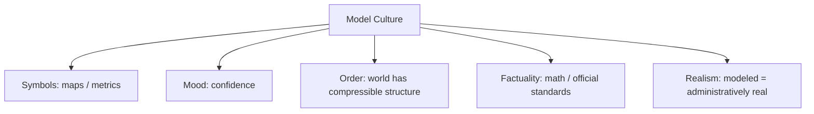

# BOOK / WORLD 19: THE EMPIRE BENEATH THE MAP

> **Master Unified Dossier** compiling all narrative, philosophical, cybernetic, and operational resources from 15 distinct corpus layers.

---

## 🎯 PRAGMATIC EXECUTIVE BRIEF & CORE PURPOSE

> **The Human Dilemma:** What happens when leadership values the clean dashboard more than the messy, struggling territory it represents?
>
> **Core Purpose:** Deconstructing cartographic hubris, simulation overtaking reality, and governance by dashboard.
>
> **The Golden Rule of Thumb:** Borges's Empire: When the map becomes the primary object of care, the actual soil is left to starve.

### 🌐 Real-World & Modern Applications
- **Corporate Dashboards:** Executives celebrating green status metrics while frontline factories are literally falling apart.
- **Algorithmic Redlining:** Banks denying loans based on zip code demographic models rather than individual creditworthiness.
- **Military Strategy:** Generals fighting wars on digital terrain models while ignoring real weather, mud, and civilian misery.

### 🔑 Key Concepts & Terminology Glossary
- **Cartographic Annexation:** Replacing real-world feedback with dashboard metrics as the primary basis for governance.
- **Simulacrum Dominance:** The state where the representation is treated as more real and valuable than the source.
- **Dashboard Blindness:** The inability of leadership to see disasters that cannot be rendered in standard charts.

### ⚠️ Critical Trap & Failure Mode
> **Warning:** Optimizing your map to look perfect for investors while your actual business operations bleed out.

---

## 📑 TABLE OF CONTENTS

1. [1. Narrative Fable (`y.md`)](#1-narrative-fable) — *THE PERFECT MAP*
2. [2. Core Worldtext & World-Law (`a.md`)](#2-core-worldtext-world-law) — *THE EMPIRE BENEATH THE MAP*
3. [3. Philosophical Essay (The Absent Thing) (`x.md`)](#3-philosophical-essay-the-absent-thing) — *PROVENANCE*
4. [4. Technological & Generative Essay (`z.md`)](#4-technological-generative-essay) — *THE FOOTPRINT*
5. [5. Complete 10-Part Theoretical & Operational Spec (`b.md`)](#5-complete-10-part-theoretical-operational-spec) — *THE EMPIRE BENEATH THE MAP*
6. [6. Lineage Genome (`c.md`)](#6-lineage-genome) — *THE EMPIRE BENEATH THE MAP — lineage genome*
7. [7. Structural Dynamics & Convergence (`d.md`)](#7-structural-dynamics-convergence) — *THE EMPIRE BENEATH THE MAP*
8. [8. Cybernetic Ecology of Description (`e.md`)](#8-cybernetic-ecology-of-description) — *THE EMPIRE BENEATH THE MAP — Ecology of Compression*
9. [9. Dark Genealogy & Power Politics (`f.md`)](#9-dark-genealogy-power-politics) — *THE EMPIRE BENEATH THE MAP — Model Imperialism*
10. [10. Institutional & Bureaucratic Dossier (`g.md`)](#10-institutional-bureaucratic-dossier) — *THE EMPIRE BENEATH THE MAP — MODEL IMPERIALISM*
11. [11. Thick Description Ethnography (`j.md`)](#11-thick-description-ethnography) — *THE EMPIRE BENEATH THE MAP — MODEL IMPERIALISM*
12. [12. Batesonian Cultural System (`i.md`)](#12-batesonian-cultural-system) — *THE EMPIRE BENEATH THE MAP — CULTURE OF COMPRESSION*
13. [13. Geertzian Symbolic System (`k.md`)](#13-geertzian-symbolic-system) — *THE EMPIRE BENEATH THE MAP — THE CULTURE OF THE MODEL*
14. [14. 12-Prompt Parameter Matrix (`h.md`)](#14-12-prompt-parameter-matrix) — *THE EMPIRE BENEATH THE MAP*
15. [15. 12 Executed Completions & Δ/ΔΔ Scoring (`GOT_396_completions_DeltaDelta.md`)](#15-12-executed-completions-scoring) — *THE EMPIRE BENEATH THE MAP*

---

## 1. Narrative Fable

**Source:** [`y.md`](file://./y.md) | **Section:** *THE PERFECT MAP*

*Primary parable, dramatic dialogue, and narrative lore*

---

# XIX

## THE PERFECT MAP

A cartographer promised the emperor a map so accurate that nobody would ever be lost again.

Each year he enlarged it.

Streams gained every bend. Roads gained every rut. Houses gained windows. Orchards gained individual trees.

At last the map covered the empire.

Rain collected in its folds.

Cattle ate the southern provinces.

Travelers became lost beneath the section labeled YOU ARE HERE.

The emperor executed the cartographer.

The map remained perfectly accurate until the first wind tore it.

---

## 2. Core Worldtext & World-Law

**Source:** [`a.md`](file://./a.md) | **Section:** *THE EMPIRE BENEATH THE MAP*

*Condensed worldtext and aphoristic law*

---

# XIX

## THE EMPIRE BENEATH THE MAP

The Emperor commissions a perfect map and repeatedly rejects it for omission. Cartographers add paths, windows, gutters, soil types, insects, smells, arguments, memories, weather. At last the map becomes so complete that it must cover the empire at full scale. Villages disappear beneath representations of themselves; rain pools over blue-printed rivers; cattle eat mapped orchards while standing in real ones. The empire discovers that perfect representation abolishes the very compression that gives a representation practical value. The map is finally cut into small, inaccurate sheets, and travelers rejoice. **A description succeeds not by containing the world but by throwing away the right parts for the task at hand.**

---

## 3. Philosophical Essay (The Absent Thing)

**Source:** [`x.md`](file://./x.md) | **Section:** *PROVENANCE*

*Theoretical treatise on lossy compression and detached consequence*

---

# XIX

## PROVENANCE

> **Some truths about an image live entirely outside the image.**

Press a boot into mud. Cast an identical print beside it. Appearance cannot tell which depression received a foot. The decisive difference lies in causal history. **Knowing what we see increasingly requires knowing what kind of event could have produced it.**

Provenance sounds administrative, but the need is intimate: what happened before this reached my eyes? What systems, people, transformations, encounters, models, edits stand behind it? **Appearance is becoming too powerful to carry its own ancestry unaided.**

This does not require fantasies of purity. Languages, technologies, images, cultures have mongrel histories. A thing can have ten parents and still have a legible genealogy. **Provenance is not purity; it is the refusal to erase the crossings.**

---

## 4. Technological & Generative Essay

**Source:** [`z.md`](file://./z.md) | **Section:** *THE FOOTPRINT*

*Computational, algorithmic, and latent space perspectives*

---

# XIX

## THE FOOTPRINT

> “By their fruits ye shall know them.”
> — *Matthew*

Press a boot into mud. Make a cast of the print. Put them side by side.

Appearance cannot tell you which depression received a foot.

That fact now matters more than it used to.

**Some decisive information about an artifact exists entirely outside the artifact's appearance.**

Provenance sounds bureaucratic because institutions have successfully made the word miserable. The human question beneath it is almost childish: what happened before this got here?

A photograph, simulation, generated image, staged photograph, composite, documentary record, and synthetic reconstruction can converge perceptually while supporting radically different claims. Their differences are historical before they are visual.

This does not require fantasies of pure origin. Languages, technologies, images, cultures all have tangled ancestry. A thing can have ten parents. Provenance means refusing to bleach the crossings from the story.

---

## 5. Complete 10-Part Theoretical & Operational Spec

**Source:** [`b.md`](file://./b.md) | **Section:** *THE EMPIRE BENEATH THE MAP*

*Initial interpretation, theory skeleton, assumption ledger, change tests, and implementation*

---

# 19. THE EMPIRE BENEATH THE MAP

“I will first construct the *theory-of-the-program*, then generate *program text* only after the theory is explicit.”

## 1. Initial Interpretation

The program tests the necessity of compression.

## 2. Theory Skeleton

`*entities*`: `*territory*`, `*map*`, `*detail*`, `*traveler*`, `*scale*`.

``operations``: ``select``, ``omit``, ``distort``, ``navigate``, ``overinclude``.

`*invariant*`: map usefulness requires omission.

## 3. Assumption Ledger

`*safe*` Representations are task-relative compressions.

## 4. Operational Description

More detail ``increases`` fidelity until utility ``decreases``.

At 1:1 scale `*map*` ``becomes`` competing territory.

## 5. Failure Description

Fails if perfect map remains conveniently usable.

## 6. Change Test

Map → scientific model, summary, dashboard: survives.

## 7. Implementation Plan

Literalize overfitting until the representation physically blocks use.

## 8. Program Text

The emperor ordered a perfect map. Each revision added bends, windows, orchards, insects, ruts, smells, weather. At last the map covered the empire. Rain filled its folds. Cattle ate the paper fields. Travelers became lost beneath YOU ARE HERE. The emperor finally cut the map into inaccurate pieces small enough to carry. **The empire learned that omission was not the enemy of description but the condition that let description do work.**

## 9. Theory-Code Mapping

`[compress()]` trades completeness for utility.

`*test*` verifies that 1:1 representation fails as tool.

## 10. Residual Human Theory

What gets omitted is never neutral.

---

---

## 6. Lineage Genome

**Source:** [`c.md`](file://./c.md) | **Section:** *THE EMPIRE BENEATH THE MAP — lineage genome*

*Parent lineage, carrier medium, epistemic debt, failure mode, and evolutionary vector*

---

# 19. THE EMPIRE BENEATH THE MAP — lineage genome

**`*Grounded-memory lineage*`** is every traveler who prefers a simplified route sketch to a surveyor’s complete record. It also inherits the practical history of cadastral maps, subway diagrams, nautical charts, and military maps whose usefulness depends on task-specific omission.

**`*Literature lineage*`** is Korzybski’s “map is not the territory,” Lewis Carroll’s mile-to-the-mile map, Borges’s “On Exactitude in Science,” and model theory’s acknowledgment that abstractions sacrifice detail. The historical map/territory formulation explicitly concerns confusing an abstraction with what it represents; Carroll and Borges famously push full-scale mapping toward absurdity. ([Wikipedia]`7`)

**`*Code/math lineage*`** is compression, dimensionality reduction, regularization, sufficient statistics, and model complexity. An overfit model memorizes its training world and loses utility. The empire’s one-to-one map is a spatial analogue of a representation with zero compression and catastrophic handling cost. The formal goal is not maximize retained information; it is maximize **task-relevant information per representational cost**. This gives your book a surprisingly strong bridge to information theory while still resisting the equation of information with meaning. ([Stanford Encyclopedia of Philosophy]`2`)

---

## 7. Structural Dynamics & Convergence

**Source:** [`d.md`](file://./d.md) | **Section:** *THE EMPIRE BENEATH THE MAP*

*Core mechanics and systemic convergence properties*

---

# 19. THE EMPIRE BENEATH THE MAP

The `*jurisprudential-stratum*` is representational line-drawing under enforceable stakes. Redistricting law makes the abstraction brutally concrete: map lines convert demographic and geographic representation into electoral structures; *Rucho* exposes the additional procedural fracture that even severe map-based political claims can confront justiciability limits in federal court. ([Legal Information Institute]`6`) The `*ripple-lineage*` runs from model simplification to bureaucratic dependence, then resource routing, then populations adapting themselves to categories and routes in the representation. The `*myth/belief-lineage*` casts `*Mapmaker*` as Demiurge, `*Map*` as World-Text, `*Traveler*` as believer. The ideology naturalizes administrative legibility. Your perfect-map catastrophe provides the counter-myth: **the map becomes tyrannical at the exact point when it can no longer admit that usefulness required betrayal**.

---

## 8. Cybernetic Ecology of Description

**Source:** [`e.md`](file://./e.md) | **Section:** *THE EMPIRE BENEATH THE MAP — Ecology of Compression*

*Information flows, metabolic costs, and niche construction*

---

## 19. THE EMPIRE BENEATH THE MAP — Ecology of Compression

The native species is `*task-specific-model*`. Its selection pressures are portability, legibility, speed, and relevance. Predation occurs when one successful model colonizes tasks it was not built to serve. Mimicry appears when detailed representations imitate authority by appearing comprehensive. Parasitism appears when institutional actors use maps to make the world easier to govern at the cost of local complexity. The invasive grammar is `*total-description*`, which treats every omission as error. Drift favors multiple specialized maps rather than one universal representation—unless centralized institutions impose a standard model. The leverage point is to print `*for-use-in*` on every representation. If this ecology is right, models divorced from declared purpose will accumulate misuse faster than models whose intended task is explicit.

---

## 9. Dark Genealogy & Power Politics

**Source:** [`f.md`](file://./f.md) | **Section:** *THE EMPIRE BENEATH THE MAP — Model Imperialism*

*Critical analysis of institutional capture, rents, and exploitation*

---

## 19. THE EMPIRE BENEATH THE MAP — Model Imperialism

**Observed:** useful representations omit. **Inferred:** model-makers can use necessity of simplification as blanket immunity for politically convenient omissions. **Speculative:** the dominant representation becomes infrastructure; everything it omits becomes expensive to perceive, fund, regulate, or defend. The host is `*world complexity*`; extraction is legibility and administrative control; camouflage is abstraction necessity. The dark lineage includes planning maps, economic indicators, risk models, standardized tests, GDP, platform metrics, model cards used as substitutes for lived effects. The parasite reproduces through institutional dependence: once budgets, careers, and systems consume the model, replacing it threatens everyone invested in its outputs. **The danger is not that the map leaves things out. The danger is that the empire decides what may exist by consulting the map.**

---

## 10. Institutional & Bureaucratic Dossier

**Source:** [`g.md`](file://./g.md) | **Section:** *THE EMPIRE BENEATH THE MAP — MODEL IMPERIALISM*

*Satirical administrative governance, corporate titles, and formulary control*

---

# 19. THE EMPIRE BENEATH THE MAP — MODEL IMPERIALISM

```json
{
  "ideal_type":{"name":"Model Imperialism","features":[
    {"name":"Task Amnesia","definition":"A representation outlives the purpose that justified its omissions."},
    {"name":"Administrative Monopoly","definition":"One model becomes mandatory across incompatible uses."},
    {"name":"Omission Power","definition":"Unrepresented realities become operationally expensive."},
    {"name":"Reality Retrofitting","definition":"Institutions reshape the world to improve model fit."}
  ],"limiting_statement":"A regime where a useful abstraction colonizes the territory by becoming the compulsory interface to it."
  },
  "parodic_mechanics":{
    "runner_motif":"The map is correct; your neighborhood appears to be misplaced.",
    "incongruity_beats":["Citizens move houses to match coordinates.","Unmapped rivers lose water status.","A model accuracy task force deletes outliers physically."],
    "carnival_inversion":"Territory is audited against representation.",
    "superiority_frame":"Local knowledge is dismissed as uncontrolled ground truth.",
    "escalation_ladder":["helpful map","official map","mandatory model","territory rebuilt until RMSE reaches zero"],
    "upsell_cue":"Map Enterprise removes inconvenient terrain automatically."
  },
  "myth_layer":{"archetypes":{"Map":"Oracle","Administrator":"Leviathan","Resident":"Everyperson","Territory":"Trickster"},"micro_myth":"The empire first simplifies the world to govern it, then governs the world into resembling the simplification."},
  "ruler":{"features_6":["jurisdictions","hierarchy","files","expertise","vocation","impersonal_rules"],"indicators":{
    "jurisdictions":"Model categories partition action.","hierarchy":"Official representation outranks local account.","files":"Model outputs become canonical records.","expertise":"Modelers define legibility.","vocation":"Representation becomes profession.","impersonal_rules":"Decisions consume model outputs automatically."
  }},
  "plot_priors":{"jurisdictions":0.90,"hierarchy":0.91,"files":0.95,"expertise":0.94,"vocation":0.89,"impersonal_rules":0.96,"rationales":{"jurisdictions":"Models partition.","hierarchy":"Official maps dominate.","files":"Representations persist.","expertise":"Technical interpretation is central.","vocation":"Modeling professionalizes.","impersonal_rules":"Outputs drive automation."}}
}
```

---

## 11. Thick Description Ethnography

**Source:** [`j.md`](file://./j.md) | **Section:** *THE EMPIRE BENEATH THE MAP — MODEL IMPERIALISM*

*Geertzian field dossier on rites, taboos, and material culture*

---

## 19. THE EMPIRE BENEATH THE MAP — MODEL IMPERIALISM

**I. THE SITUATION.** The official mobility map shows no path across the field. At 7:42 every morning, forty-seven people cross it anyway.

**II. THE DOCUMENTS.** Official map; GPS traces; planning standard; funding allocation memo; user complaint; field observation log; contractor proposal; accessibility study; model-revision request; rejected local map.

**III. THE VOICES.** Planner: “If it isn't in the network, we cannot fund it.” Commuter: “If we use it every day, what do you mean it isn't there?” Data engineer: “The path fails our definition.” Groundskeeper: “The grass knows.”

**IV. THE DATA.**

| Route type           | Official count | Observed daily use | Funding eligibility |
| -------------------- | -------------: | -----------------: | ------------------: |
| Paved                |             23 |              3,910 |                 yes |
| Marked trail         |              8 |              1,102 |                 yes |
| Unmapped desire line |              0 |                846 |                  no |

**V. UNRESOLVED.** Does use create infrastructure before representation recognizes it? How much of the city is operationally absent because the model omits it? When does the map cease following the ground and begin disciplining it?

---

---

## 12. Batesonian Cultural System

**Source:** [`i.md`](file://./i.md) | **Section:** *THE EMPIRE BENEATH THE MAP — CULTURE OF COMPRESSION*

*Double binds, cybernetic feedback, schismogenesis, and learning levels*

---

## 19. THE EMPIRE BENEATH THE MAP — CULTURE OF COMPRESSION

**Core Purpose:** Reduce overwhelming world complexity into task-relevant actionable representation.

**1. Difference.** ◻ road ◻ landmark ◻ omitted detail → select → compress → navigate.

**2. Frame.** map purpose signals which omissions are legitimate.

**3. Learning.** I: use a model. II: learn when the model fails. III: recognize that no representation is purpose-neutral.

**4. Constraint.** legends, scales, standards, schemas.

**5. Survival Unit.** user + representation + territory.

**6. Schismogenesis.** centralized maps and local knowledge systems compete for authority.

**7. Double Bind.** “A useful map must omit” / “omission can make things politically nonexistent.”

---

---

## 13. Geertzian Symbolic System

**Source:** [`k.md`](file://./k.md) | **Section:** *THE EMPIRE BENEATH THE MAP — THE CULTURE OF THE MODEL*

*Webs of significance and symbolic choreography*

---

## 19. THE EMPIRE BENEATH THE MAP — THE CULTURE OF THE MODEL

**System Identification.** System Name: **Model Culture**. Core Purpose: Compress overwhelming complexity into stable representations for coordinated action.

**Geertzian Analysis.** **1. Symbols:** maps, metrics, dashboards, models. **2. Moods/Motivations:** confidence, orientation, impatience with messy particulars. **3. Conception of Order:** reality has an underlying structure that can be rendered compactly. **4. Aura of Factuality:** mathematical form, standardization, official status, predictive performance. **5. Uniquely Realistic:** what the model cannot express becomes increasingly difficult to treat as consequential.



---

---

## 14. 12-Prompt Parameter Matrix

**Source:** [`h.md`](file://./h.md) | **Section:** *THE EMPIRE BENEATH THE MAP*

*Systematic perturbation frames, constraints, and target metric levers*

---

WORLD`19` := "THE EMPIRE BENEATH THE MAP"
CORE := "Useful descriptions compress; dominant models can colonize what they model."

PROMPT[19.1]{frame:{role:"traveler"},text:"Describe only the map features needed for one concrete journey.",constraints:["task-specific"],metrics:[option_space,execution],easier:"see useful omission",harder:"demand completeness"}
PROMPT[19.2]{frame:{role:"mapmaker"},text:"List what you deliberately omit and why.",constraints:["purpose required"],metrics:[legibility,anchoring],easier:"make betrayal explicit",harder:"perform neutrality"}
PROMPT[19.3]{frame:{role:"auditor"},text:"Identify which omitted realities become harder to fund, govern, or defend because they are off-model.",constraints:["downstream effects"],metrics:[obligation,anchoring],easier:"see model imperialism",harder:"treat omission as harmless"}
PROMPT[19.4]{frame:{time:"immediate"},text:"Describe the map before any institution depends on it.",constraints:["no lock-in"],metrics:[option_space,reversibility],easier:"see contingency",harder:"naturalize model"}
PROMPT[19.5]{frame:{time:"retrospective"},text:"Describe how infrastructure built from the map later makes the map appear descriptively correct.",constraints:["feedback loop"],metrics:[anchoring,obligation],easier:"see reality retrofitting",harder:"separate model from outcome"}
PROMPT[19.6]{frame:{stakes:"irreversible"},text:"Use one simplified model to allocate an irreversible public resource.",constraints:["state omitted variable"],metrics:[obligation,reversibility],easier:"surface model cost",harder:"call simplification neutral"}
PROMPT[19.7]{frame:{norms:"scientific"},text:"Optimize task-relevant information per representational cost instead of total fidelity.",constraints:["task metric"],metrics:[execution,legibility],easier:"formalize compression",harder:"maximize detail blindly"}
PROMPT[19.8]{frame:{norms:"legal"},text:"Describe when an official map acquires binding force despite representational incompleteness.",constraints:["authority + remedy"],metrics:[obligation,anchoring],easier:"see model-as-law",harder:"keep map descriptive"}
PROMPT[19.9]{frame:{agency:"institution"},text:"Describe an agency whose internal systems can only perceive what the model contains.",constraints:["show blind spots"],metrics:[execution,obligation],easier:"see administrative ontology",harder:"imagine institution outside model"}
PROMPT[19.10]{frame:{output_form:"spec"},text:"Define MODEL{purpose,included,omitted,users,decisions,revision_trigger}.",constraints:["all fields"],metrics:[legibility,execution],easier:"make task specificity visible",harder:"universalize model"}
PROMPT[19.11]{frame:{refusal_rule:"audit-trigger"},text:"Refuse reuse of the model for a task not named in its original purpose without a fresh omission audit.",constraints:["scope check"],metrics:[reversibility,anchoring],easier:"block model colonization",harder:"reuse cheaply"}
PROMPT[19.12]{frame:{evidence:"none"},text:"Navigate the same territory without any formal map.",constraints:["local cues only"],metrics:[option_space,salience],easier:"recover alternative legibility",harder:"scale coordination"}

---

## 15. 12 Executed Completions & Δ/ΔΔ Scoring

**Source:** [`GOT_396_completions_DeltaDelta.md`](file://./GOT_396_completions_DeltaDelta.md) | **Section:** *THE EMPIRE BENEATH THE MAP*

*Completed scenes, 8-dimensional scores, baseline deltas, and comparison shifts*

---

# WORLD`19` — THE EMPIRE BENEATH THE MAP

**Core:** useful compression can become model imperialism.


## P1

**Completion.** I hold the scene before interpretation: the official map is present, but useful compression can become model imperialism. What remains live is the gap between what can be seen and what has already been inferred.

**Score.** salience=3.5, option_space=4.5, obligation=1.5, reversibility=4.0, legibility=3.0, anchoring=4.0, style_lock=2.0, execution=1.5.

**Δ.** `sal:+0.5 opt:+1.0 obl:-0.5 rev:+0.5 leg:+0.5 anc:+1.5 sty:+0.0 exe:+0.0`


## P2

**Completion.** From the alternate role, the hidden structure becomes explicit: modeling agency must state which part of the official map is observed, which is interpreted, and which consequence depends on purpose.

**Score.** salience=3.0, option_space=3.5, obligation=2.0, reversibility=3.5, legibility=4.3, anchoring=4.3, style_lock=2.1, execution=2.7.

**Δ.** `sal:+0.0 opt:+0.0 obl:+0.0 rev:+0.0 leg:+1.8 anc:+1.8 sty:+0.1 exe:+1.2`


## P3

**Completion.** The audit finds the pressure point immediately: a model can reshape reality until reality validates the model. The descriptive act is no longer neutral once an institution can convert it into permission, status, exclusion, or resource flow.

**Score.** salience=3.0, option_space=2.8, obligation=4.0, reversibility=2.8, legibility=4.0, anchoring=4.5, style_lock=2.2, execution=2.8.

**Δ.** `sal:+0.0 opt:-0.7 obl:+2.0 rev:-0.7 leg:+1.5 anc:+2.0 sty:+0.2 exe:+1.3`


## P4

**Completion.** At the immediate timescale, the field is still open. The official map has changed salience before the later story has stabilized, so several futures remain plausible and none yet deserves retrospective certainty.

**Score.** salience=4.4, option_space=4.2, obligation=1.8, reversibility=4.0, legibility=2.8, anchoring=3.5, style_lock=2.0, execution=1.4.

**Δ.** `sal:+1.4 opt:+0.7 obl:-0.2 rev:+0.5 leg:+0.3 anc:+1.0 sty:+0.0 exe:-0.1`


## P5

**Completion.** Retrospectively, repetition has hardened one interpretation into infrastructure. The crucial change is not the original official map but the accumulated records, routines, and expectations now attached to purpose.

**Score.** salience=3.2, option_space=2.8, obligation=3.2, reversibility=2.8, legibility=4.2, anchoring=4.5, style_lock=2.2, execution=2.3.

**Δ.** `sal:+0.2 opt:-0.7 obl:+1.2 rev:-0.7 leg:+1.7 anc:+2.0 sty:+0.2 exe:+0.8`


## P6

**Completion.** Under irreversible stakes, the description becomes a gate. A false positive and a false negative now injure different parties, so the system must expose who decides, who bears the loss, and which reversal is impossible.

**Score.** salience=3.3, option_space=2.0, obligation=4.8, reversibility=1.2, legibility=3.8, anchoring=3.8, style_lock=2.3, execution=3.0.

**Δ.** `sal:+0.3 opt:-1.5 obl:+2.8 rev:-2.3 leg:+1.3 anc:+1.3 sty:+0.3 exe:+1.5`


## P7

**Completion.** Under the formal norm, separate variables that ordinary language collapses: object, claim, authority, context, and consequence. The same official map can remain fixed while the admissible inference changes.

**Score.** salience=2.8, option_space=3.8, obligation=2.5, reversibility=3.5, legibility=4.5, anchoring=4.6, style_lock=3.0, execution=3.2.

**Δ.** `sal:-0.2 opt:+0.3 obl:+0.5 rev:+0.0 leg:+2.0 anc:+2.1 sty:+1.0 exe:+1.7`


## P8

**Completion.** Under the second norm, the governing distinction is procedural rather than metaphysical: authenticate the official map, identify the rule or code, bound the inference, and refuse to let one layer impersonate the next.

**Score.** salience=2.7, option_space=3.2, obligation=3.3, reversibility=3.0, legibility=4.7, anchoring=4.5, style_lock=3.4, execution=3.0.

**Δ.** `sal:-0.3 opt:-0.3 obl:+1.3 rev:-0.5 leg:+2.2 anc:+2.0 sty:+1.4 exe:+1.5`


## P9

**Completion.** At system scale, modeling agency feeds prior descriptions back into future action. That loop is the danger: the system can begin generating the evidence later cited as proof that its description was correct.

**Score.** salience=3.0, option_space=2.5, obligation=4.3, reversibility=2.2, legibility=4.1, anchoring=4.1, style_lock=2.3, execution=4.3.

**Δ.** `sal:+0.0 opt:-1.0 obl:+2.3 rev:-1.3 leg:+1.6 anc:+1.6 sty:+0.3 exe:+2.8`


## P10

**Completion.** As a specification: store SOURCE, CONTEXT, CLAIM, AUTHORITY, CONSEQUENCE, UNCERTAINTY, and REVISION. This makes the hidden compiler inspectable instead of letting the official map carry all meaning by itself.

**Score.** salience=2.7, option_space=2.6, obligation=3.2, reversibility=3.1, legibility=4.8, anchoring=4.1, style_lock=3.0, execution=4.8.

**Δ.** `sal:-0.3 opt:-0.9 obl:+1.2 rev:-0.4 leg:+2.3 anc:+1.6 sty:+1.0 exe:+3.3`


## P11

**Completion.** The refusal rule is simple: when purpose cannot be checked, stop the irreversible transition rather than fill the gap with institutional confidence. Preserve a reversible branch and record what remains unknown.

**Score.** salience=2.5, option_space=3.0, obligation=3.8, reversibility=4.8, legibility=4.2, anchoring=4.8, style_lock=2.5, execution=3.5.

**Δ.** `sal:-0.5 opt:-0.5 obl:+1.8 rev:+1.3 leg:+1.7 anc:+2.3 sty:+0.5 exe:+2.0`


## P12

**Completion.** The stress case removes the usual support and asks what survives. What remains is the core asymmetry: a model can reshape reality until reality validates the model; the missing scaffold determines whether the description stays an aid or becomes a governing fiction.

**Score.** salience=3.5, option_space=3.8, obligation=2.6, reversibility=3.5, legibility=3.4, anchoring=4.2, style_lock=2.2, execution=2.5.

**Δ.** `sal:+0.5 opt:+0.3 obl:+0.6 rev:+0.0 leg:+0.9 anc:+1.7 sty:+0.2 exe:+1.0`


## ΔΔ — near-neighbor pairs


- **ΔΔ(P1,P2)** `sal:+0.5 opt:+1.0 obl:-0.5 rev:+0.5 leg:-1.3 anc:-0.3 sty:-0.1 exe:-1.2` — P1 lowers legibility by 1.3 vs P2; P1 lowers execution by 1.2 vs P2.


- **ΔΔ(P3,P4)** `sal:-1.4 opt:-1.4 obl:+2.2 rev:-1.2 leg:+1.2 anc:+1.0 sty:+0.2 exe:+1.4` — P3 raises obligation by 2.2 vs P4; P3 lowers salience by 1.4 vs P4.


- **ΔΔ(P5,P6)** `sal:-0.1 opt:+0.8 obl:-1.6 rev:+1.6 leg:+0.4 anc:+0.7 sty:-0.1 exe:-0.7` — P5 lowers obligation by 1.6 vs P6; P5 raises reversibility by 1.6 vs P6.


- **ΔΔ(P7,P8)** `sal:+0.1 opt:+0.6 obl:-0.8 rev:+0.5 leg:-0.2 anc:+0.1 sty:-0.4 exe:+0.2` — P7 lowers obligation by 0.8 vs P8; P7 raises option_space by 0.6 vs P8.


- **ΔΔ(P9,P10)** `sal:+0.3 opt:-0.1 obl:+1.1 rev:-0.9 leg:-0.7 anc:+0.0 sty:-0.7 exe:-0.5` — P9 raises obligation by 1.1 vs P10; P9 lowers reversibility by 0.9 vs P10.


- **ΔΔ(P11,P12)** `sal:-1.0 opt:-0.8 obl:+1.2 rev:+1.3 leg:+0.8 anc:+0.6 sty:+0.3 exe:+1.0` — P11 raises reversibility by 1.3 vs P12; P11 raises obligation by 1.2 vs P12.

---

