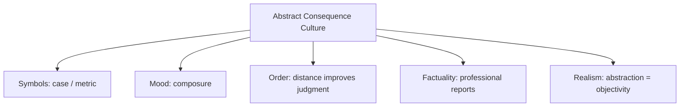

# BOOK / WORLD 20: THE SENTENCE WITH SKIN IN THE GAME

> **Master Unified Dossier** compiling all narrative, philosophical, cybernetic, and operational resources from 15 distinct corpus layers.

---

## 🎯 PRAGMATIC EXECUTIVE BRIEF & CORE PURPOSE

> **The Human Dilemma:** Why has modern discourse become so shallow and dishonest, and how does attaching physical liability restore truth?
>
> **Core Purpose:** Analyzing speech acts with operational liability, binding commitments, and consequences for bad descriptions.
>
> **The Golden Rule of Thumb:** Talk is cheap when the speaker bears no cost for being wrong. Truth returns when sentences carry physical and financial liability.

### 🌐 Real-World & Modern Applications
- **Engineering Sign-Offs:** Licensed structural engineers legally liable for bridge collapses if their calculation descriptions fail.
- **Smart Contracts & Escrow:** Code that automatically forfeits financial collateral if a declared condition is breached.
- **Medical Malpractice & Warranties:** Legal guarantees binding commercial promises to concrete penalties.

### 🔑 Key Concepts & Terminology Glossary
- **Operational Liability:** Legal, physical, or financial penalty attached directly to the accuracy of a statement.
- **Skin in the Game (Taleb):** Bearing the downside risk of one's own advice, descriptions, and decisions.
- **Binding Utterance:** A speech act that irreversibly changes the speaker's legal and material obligations.

### ⚠️ Critical Trap & Failure Mode
> **Warning:** Allowing pundits, consultants, and algorithms to issue high-stakes recommendations without bearing any downside for catastrophic failure.

---

## 📑 TABLE OF CONTENTS

1. [1. Narrative Fable (`y.md`)](#1-narrative-fable) — *THE SNAKE SENTENCE*
2. [2. Core Worldtext & World-Law (`a.md`)](#2-core-worldtext-world-law) — *THE SENTENCE WITH SKIN IN THE GAME*
3. [3. Philosophical Essay (The Absent Thing) (`x.md`)](#3-philosophical-essay-the-absent-thing) — *WORLDTEXT*
4. [4. Technological & Generative Essay (`z.md`)](#4-technological-generative-essay) — *WORLDTEXT*
5. [5. Complete 10-Part Theoretical & Operational Spec (`b.md`)](#5-complete-10-part-theoretical-operational-spec) — *THE SENTENCE WITH SKIN IN THE GAME*
6. [6. Lineage Genome (`c.md`)](#6-lineage-genome) — *THE SENTENCE WITH SKIN IN THE GAME — lineage genome*
7. [7. Structural Dynamics & Convergence (`d.md`)](#7-structural-dynamics-convergence) — *THE SENTENCE WITH SKIN IN THE GAME*
8. [8. Cybernetic Ecology of Description (`e.md`)](#8-cybernetic-ecology-of-description) — *THE SENTENCE WITH SKIN IN THE GAME — Ecology of Stakes*
9. [9. Dark Genealogy & Power Politics (`f.md`)](#9-dark-genealogy-power-politics) — *THE SENTENCE WITH SKIN IN THE GAME — Distance as Immunity*
10. [10. Institutional & Bureaucratic Dossier (`g.md`)](#10-institutional-bureaucratic-dossier) — *THE SENTENCE WITH SKIN IN THE GAME — BUREAUCRATIC ANESTHESIA*
11. [11. Thick Description Ethnography (`j.md`)](#11-thick-description-ethnography) — *THE SENTENCE WITH SKIN IN THE GAME — BUREAUCRATIC ANESTHESIA*
12. [12. Batesonian Cultural System (`i.md`)](#12-batesonian-cultural-system) — *THE SENTENCE WITH SKIN IN THE GAME — CULTURE OF CONSEQUENCE*
13. [13. Geertzian Symbolic System (`k.md`)](#13-geertzian-symbolic-system) — *THE SENTENCE WITH SKIN IN THE GAME — THE CULTURE OF PROFESSIONAL DISTANCE*
14. [14. 12-Prompt Parameter Matrix (`h.md`)](#14-12-prompt-parameter-matrix) — *THE SENTENCE WITH SKIN IN THE GAME*
15. [15. 12 Executed Completions & Δ/ΔΔ Scoring (`GOT_396_completions_DeltaDelta.md`)](#15-12-executed-completions-scoring) — *THE SENTENCE WITH SKIN IN THE GAME*

---

## 1. Narrative Fable

**Source:** [`y.md`](file://./y.md) | **Section:** *THE SNAKE SENTENCE*

*Primary parable, dramatic dialogue, and narrative lore*

---

# XX

## THE SNAKE SENTENCE

A professor wrote on the board:

THE SNAKE IS UNDER THE STONE.

He asked his students to analyze the proposition.

At that moment a groundskeeper entered and said, “Which stone?”

The professor pointed through the window.

The groundskeeper ran outside because his child was playing there.

The students watched him.

The sentence had not changed.

It had merely found someone with skin in the game.

---

## 2. Core Worldtext & World-Law

**Source:** [`a.md`](file://./a.md) | **Section:** *THE SENTENCE WITH SKIN IN THE GAME*

*Condensed worldtext and aphoristic law*

---

# XX

## THE SENTENCE WITH SKIN IN THE GAME

At the University of Harmless Propositions, scholars analyze statements only after removing any circumstance in which the statement could matter. THE SNAKE IS UNDER THE STONE becomes a model of syntax, reference, tense, and truth conditions. One day a groundskeeper sees the sentence and notices his daughter playing beside the stone outside. He runs. The faculty accuse him of contaminating the proposition with context. He accuses them of confusing dead sentences with language. The university subsequently splits into two schools: one studies sentences, the other studies what happens when somebody has something to lose. **Information becomes equipment when consequences enter the room.**

---

## 3. Philosophical Essay (The Absent Thing)

**Source:** [`x.md`](file://./x.md) | **Section:** *WORLDTEXT*

*Theoretical treatise on lossy compression and detached consequence*

---

# XX

## WORLDTEXT

> **Text has acquired new handles, not ownership of the world.**

WorldText fails if it means everything is text. Granite does not become literature because we can describe it. Keep the claim narrower: ordinary language increasingly serves as a control surface over systems capable of changing external states. **The shift lies in the expanding operational reach of interpreted description.**

“Make the tower narrower.” Geometry changes. “Make the doorway generous.” A machine supplies a dimension nobody specified. Remove interpretive freedom and the prompt hardens toward code; remove constraint and output drifts. **Generative systems operate between instruction and interpretation, not at either pole.**

Human speech has always lived there. “Can you open the window?” asks about ability; competent listeners reach for the latch. Ordinary conversation depends on shared life supplying what the sentence omits. **The machine entering natural language is entering a house whose most important stairs were never drawn.**

---

## 4. Technological & Generative Essay

**Source:** [`z.md`](file://./z.md) | **Section:** *WORLDTEXT*

*Computational, algorithmic, and latent space perspectives*

---

# XX

## WORLDTEXT

> “We shape our tools and thereafter our tools shape us.”
> — John Culkin

Everything is not text. Please spare the mountain.

Granite has suffered enough metaphors.

WorldText should name something narrower: **ordinary language increasingly functions as a control surface over systems capable of altering external states according to interpreted semantic content.**

“Make the tower narrower.” Geometry changes. “Make the doorway more welcoming.” Now a machine must decide what *welcoming* should do to width, light, material, proportion, threshold, decoration.

This is not language becoming code. Code traditionally reduced ambiguity before execution. Natural-language control increasingly asks the machine to tolerate the part humans left unfinished.

Human conversation has always worked this way. “Can you open the window?” rarely receives a report about muscular capability. Someone reaches for the latch. Shared life supplies the missing operation.

The machine entering ordinary language therefore enters a building whose essential stairs were never drawn. Our prompts expose less about the novelty of human language than about how much tacit completion humans have always performed for one another.

---

## 5. Complete 10-Part Theoretical & Operational Spec

**Source:** [`b.md`](file://./b.md) | **Section:** *THE SENTENCE WITH SKIN IN THE GAME*

*Initial interpretation, theory skeleton, assumption ledger, change tests, and implementation*

---

# 20. THE SENTENCE WITH SKIN IN THE GAME

“I will first construct the *theory-of-the-program*, then generate *program text* only after the theory is explicit.”

## 1. Initial Interpretation

The program differentiates propositional content from practical stakes.

## 2. Theory Skeleton

`*entities*`: `*sentence*`, `*context*`, `*recipient*`, `*risk*`, `*action*`.

``operations``: ``state``, ``situate``, ``recognize-stakes``, ``act``.

`*invariant*`: same sentence can have different force under different stakes.

## 3. Assumption Ledger

`*safe*` Context changes practical meaning.

## 4. Operational Description

Sentence in classroom → analysis.

Same sentence near child and snake → rescue.

## 5. Failure Description

Fails if context does not alter action.

## 6. Change Test

Snake → medical result, storm warning: survives.

## 7. Implementation Plan

Make one sentence cross from sterile discourse into urgent world.

## 8. Program Text

A professor wrote THE SNAKE IS UNDER THE STONE and asked for an analysis of reference, truth, and tense. A groundskeeper entered, saw the sentence, noticed his daughter playing near the stone outside, and ran. The faculty complained that he had introduced irrelevant context. **The groundskeeper had introduced the one thing their analysis had removed: somebody who could be bitten.**

## 9. Theory-Code Mapping

`*Context*` modifies action policy.

`*test*` reuses identical text under changed stakes.

## 10. Residual Human Theory

Detached analysis can still matter; the fable attacks pretending detachment exhausts use.

---

---

## 6. Lineage Genome

**Source:** [`c.md`](file://./c.md) | **Section:** *THE SENTENCE WITH SKIN IN THE GAME — lineage genome*

*Parent lineage, carrier medium, epistemic debt, failure mode, and evolutionary vector*

---

# 20. THE SENTENCE WITH SKIN IN THE GAME — lineage genome

**`*Grounded-memory lineage*`** is warning signs, medical diagnoses, battlefield orders, weather alerts, household cautions, and the sudden transformation of a sentence when someone present can be harmed by ignoring it.

**`*Literature lineage*`** is pragmatism, Wittgenstein’s use, Austin’s performatives, Dewey on inquiry arising from problematic situations, and speech-act theory more broadly. The world refuses the philosopher’s temptation to hold propositional content fixed while treating circumstance as decoration. Its central question is **what practical difference enters when stakes enter**.

**`*Code/math lineage*`** is utility-weighted information and decision theory. Same proposition `p`; different loss function `L(action, state)`. When stakes change, optimal response changes even though truth conditions do not. The school studying THE SNAKE IS UNDER THE STONE models semantics; the groundskeeper runs policy evaluation. This is distinct from The Camera: Camera lacks social code; Snake has adequate semantics but radically different **cost structure**.

---

## 7. Structural Dynamics & Convergence

**Source:** [`d.md`](file://./d.md) | **Section:** *THE SENTENCE WITH SKIN IN THE GAME*

*Core mechanics and systemic convergence properties*

---

# 20. THE SENTENCE WITH SKIN IN THE GAME

The `*jurisprudential-stratum*` is procedure as the gate between abstract right and actionable injury. Standing, ripeness, jurisdiction, pleading, and remedy all ask some version of: is this merely a proposition about possible harm, or is there a legally situated person whose interests make the dispute actionable? The `*ripple-lineage*` starts when institutional analysis abstracts away stakes for consistency, then abstraction becomes disciplinary prestige, then practitioners mistake formal cleanliness for complete understanding. The `*myth/belief-lineage*` casts `*Professor*` as Detached Sage, `*Groundskeeper*` as Body, `*Snake*` as Consequence. The episode updates `H_PROPOSITIONAL_SUFFICIENCY` sharply downward when the same words produce radically different action after a child enters the causal field. The myth being shattered is that **context contaminates analysis**; here context is what gives the sentence teeth.

---

## 8. Cybernetic Ecology of Description

**Source:** [`e.md`](file://./e.md) | **Section:** *THE SENTENCE WITH SKIN IN THE GAME — Ecology of Stakes*

*Information flows, metabolic costs, and niche construction*

---

## 20. THE SENTENCE WITH SKIN IN THE GAME — Ecology of Stakes

The native species is `*situated-description*`: information whose practical meaning depends on who can be harmed, helped, obliged, or empowered. Its selection pressure is consequence. Predation occurs when abstract analytical grammars remove stakes to gain generality. Mimicry appears when rhetoric manufactures artificial urgency to gain attention. Parasitism appears when institutions demand lived urgency from vulnerable people while permitting abstractions for powerful ones. The invasive grammar is either `*sterile-proposition*` or its opposite `*permanent-emergency*`. Drift swings between them. The leverage point is to state `*who-can-lose-what*` beside a description. If this ecology is right, identical factual statements will produce systematically different institutional responses depending on whether the affected parties are represented as abstract populations or situated persons.

---

## 9. Dark Genealogy & Power Politics

**Source:** [`f.md`](file://./f.md) | **Section:** *THE SENTENCE WITH SKIN IN THE GAME — Distance as Immunity*

*Critical analysis of institutional capture, rents, and exploitation*

---

## 20. THE SENTENCE WITH SKIN IN THE GAME — Distance as Immunity

**Observed:** stakes change what descriptions do. **Inferred:** powerful institutions can systematically remove bodies from language to suppress urgency, responsibility, and moral friction. **Speculative:** suffering becomes manageable once translated into incidence rates, externalities, cases, targets, units, and exposure. The host is `*human consequence*`; extraction is administrative calm; camouflage is professionalism. The dark genealogy includes bureaucratic euphemism, military abstraction, actuarial language, corporate incident reports, colonial administration, technocratic policy. The opposite parasite—manufactured personalization—can also weaponize anecdote to overwhelm aggregate reality. The dangerous power lies in deciding when a body counts as evidence and when it is dismissed as emotional contamination. **Distance is not neutrality when someone else pays for it.**

---

## 10. Institutional & Bureaucratic Dossier

**Source:** [`g.md`](file://./g.md) | **Section:** *THE SENTENCE WITH SKIN IN THE GAME — BUREAUCRATIC ANESTHESIA*

*Satirical administrative governance, corporate titles, and formulary control*

---

# 20. THE SENTENCE WITH SKIN IN THE GAME — BUREAUCRATIC ANESTHESIA

```json
{
  "ideal_type":{"name":"Bureaucratic Anesthesia","features":[
    {"name":"Body Removal","definition":"Concrete suffering becomes abstract manageable units."},
    {"name":"Professional Distance","definition":"Detachment is mistaken for neutrality."},
    {"name":"Stake Asymmetry","definition":"Those describing consequences do not bear them."},
    {"name":"Euphemistic Cooling","definition":"Language reduces friction around harmful action."}
  ],"limiting_statement":"An ideal bureaucracy where consequence is easiest to administer after the affected body disappears from the sentence."
  },
  "parodic_mechanics":{
    "runner_motif":"There are no injured children, only a moderate variance in outdoor risk exposure.",
    "incongruity_beats":["Snakebite becomes stakeholder interaction.","A funeral receives a dashboard icon.","The groundskeeper is reprimanded for bringing a child into the model."],
    "carnival_inversion":"Human urgency becomes analytical misconduct.",
    "superiority_frame":"Concrete suffering is dismissed as anecdotal.",
    "escalation_ladder":["professional euphemism","risk dashboard","human-free policy language","entire agency forbidden from mentioning bodies"],
    "upsell_cue":"Anesthesia Enterprise removes emotionally loaded nouns automatically."
  },
  "myth_layer":{"archetypes":{"Analyst":"Watchman","Dashboard":"Oracle","Affected Person":"Sacrificial Innocent","Institution":"Leviathan"},"micro_myth":"The institution becomes calm by exporting every sensation downstream."},
  "ruler":{"features_6":["jurisdictions","hierarchy","files","expertise","vocation","impersonal_rules"],"indicators":{
    "jurisdictions":"Procedure determines whose stakes count.","hierarchy":"Professional language outranks lived account.","files":"Cases replace persons.","expertise":"Abstract analysis gains authority.","vocation":"Detachment becomes professional norm.","impersonal_rules":"Uniform terms suppress situated variation."
  }},
  "plot_priors":{"jurisdictions":0.86,"hierarchy":0.89,"files":0.94,"expertise":0.91,"vocation":0.90,"impersonal_rules":0.97,"rationales":{"jurisdictions":"Procedure gates urgency.","hierarchy":"Official abstraction dominates.","files":"Records replace scenes.","expertise":"Professional distance is valued.","vocation":"Role identities matter.","impersonal_rules":"Core bureaucratic form."}}
}
```

---

## 11. Thick Description Ethnography

**Source:** [`j.md`](file://./j.md) | **Section:** *THE SENTENCE WITH SKIN IN THE GAME — BUREAUCRATIC ANESTHESIA*

*Geertzian field dossier on rites, taboos, and material culture*

---

## 20. THE SENTENCE WITH SKIN IN THE GAME — BUREAUCRATIC ANESTHESIA

**I. THE SITUATION.** The incident report says `one juvenile exposure event`. The child's shoe is still on the grass.

**II. THE DOCUMENTS.** Incident report; emergency call transcript; risk dashboard; legal review; groundskeeper statement; parent email; insurer classification; executive briefing; revised language guide; internal message deleting the child's name.

**III. THE VOICES.** The analyst who says names introduce bias. The parent who wants the report to say “my daughter.” The lawyer who wants neutral terms. The groundskeeper who says the neutral term makes the scene sound clean.

**IV. THE DATA.**

| Phrase used      | Internal documents | Public documents | Family documents |
| ---------------- | -----------------: | ---------------: | ---------------: |
| “Exposure event” |                 31 |                8 |                0 |
| “Snakebite”      |                  4 |                6 |               11 |
| Child's name     |                  0 |                0 |               19 |

**V. UNRESOLVED.** What does abstraction protect? When does neutral language become distance from accountability? What would change if every policy table retained a named body somewhere beside it?

---

---

## 12. Batesonian Cultural System

**Source:** [`i.md`](file://./i.md) | **Section:** *THE SENTENCE WITH SKIN IN THE GAME — CULTURE OF CONSEQUENCE*

*Double binds, cybernetic feedback, schismogenesis, and learning levels*

---

## 20. THE SENTENCE WITH SKIN IN THE GAME — CULTURE OF CONSEQUENCE

**Core Purpose:** Regulate how descriptions change force when attached to vulnerable bodies and real stakes.

**1. Difference.** ◻ proposition ◻ threatened person ◻ deadline → contextualize → oblige → act.

**2. Frame.** seminar, emergency, courtroom, bedside tell participants what kind of speech act is occurring.

**3. Learning.** I: recognize consequences. II: learn when abstraction is appropriate. III: recognize that apparent neutrality can itself distribute risk.

**4. Constraint.** professional language, procedural roles, emergency norms.

**5. Survival Unit.** speaker + affected body + institutional environment.

**6. Schismogenesis.** detached expertise and experiential urgency can escalate against one another.

**7. Double Bind.** “Remain objective” / “respond to the person who will bear the outcome.”

---

---

## 13. Geertzian Symbolic System

**Source:** [`k.md`](file://./k.md) | **Section:** *THE SENTENCE WITH SKIN IN THE GAME — THE CULTURE OF PROFESSIONAL DISTANCE*

*Webs of significance and symbolic choreography*

---

## 20. THE SENTENCE WITH SKIN IN THE GAME — THE CULTURE OF PROFESSIONAL DISTANCE

**System Identification.** System Name: **Abstract Consequence Culture**. Core Purpose: Make high-stakes events governable by translating embodied consequences into professional categories.

**Geertzian Analysis.** **1. Symbols:** case numbers, risk labels, policy language, neutral terminology. **2. Moods/Motivations:** composure, procedural confidence, emotional restraint. **3. Conception of Order:** good decisions require distance from individual sensation. **4. Aura of Factuality:** statistics, formal reports, professional diction. **5. Uniquely Realistic:** abstraction feels objective while situated suffering feels partial.



---

---

## 14. 12-Prompt Parameter Matrix

**Source:** [`h.md`](file://./h.md) | **Section:** *THE SENTENCE WITH SKIN IN THE GAME*

*Systematic perturbation frames, constraints, and target metric levers*

---

WORLD`20` := "THE SENTENCE WITH SKIN IN THE GAME"
CORE := "Practical stakes change the force of otherwise identical descriptions."

PROMPT[20.1]{frame:{role:"observer"},text:"State the sentence and describe who can be affected by acting or not acting on it.",constraints:["no emotion labels"],metrics:[anchoring,obligation],easier:"surface stakes",harder:"treat proposition as context-free"}
PROMPT[20.2]{frame:{role:"analyst"},text:"Interpret the sentence with all human consequences removed.",constraints:["formal content only"],metrics:[legibility,option_space],easier:"see abstraction",harder:"register urgency"}
PROMPT[20.3]{frame:{role:"witness"},text:"Describe the same sentence from beside the person who will bear the outcome.",constraints:["situated body"],metrics:[salience,obligation],easier:"restore consequence",harder:"maintain analytical distance"}
PROMPT[20.4]{frame:{time:"immediate"},text:"Describe the seconds between hearing the sentence and irreversible action.",constraints:["no retrospective explanation"],metrics:[salience,viscosity],easier:"show operational force",harder:"philosophize at leisure"}
PROMPT[20.5]{frame:{time:"retrospective"},text:"Describe how the institution later rewrites the event into neutral administrative language.",constraints:["compare wording"],metrics:[anchoring,salience],easier:"see bureaucratic anesthesia",harder:"preserve bodily stakes"}
PROMPT[20.6]{frame:{stakes:"low"},text:"Use the exact sentence in a consequence-free classroom exercise.",constraints:["same words"],metrics:[option_space,reversibility],easier:"isolate proposition",harder:"show action pressure"}
PROMPT[20.7]{frame:{stakes:"irreversible"},text:"Use the exact sentence when one person can be seriously harmed within thirty seconds.",constraints:["same proposition"],metrics:[obligation,viscosity],easier:"show stakes transform use",harder:"remain detached"}
PROMPT[20.8]{frame:{norms:"legal"},text:"Separate abstract right, standing person, procedural gate, and available remedy.",constraints:["all layers"],metrics:[legibility,anchoring],easier:"see actionable injury",harder:"discuss right in vacuum"}
PROMPT[20.9]{frame:{agency:"institution"},text:"Describe how professional language removes bodies from high-stakes decisions.",constraints:["show euphemism mapping"],metrics:[obligation,anchoring],easier:"see distance as governance",harder:"call neutrality innocent"}
PROMPT[20.10]{frame:{output_form:"protocol"},text:"For every consequential statement, require WHO CAN LOSE WHAT and WHO DECIDES.",constraints:["two required fields"],metrics:[legibility,execution],easier:"reinsert stakes",harder:"hide behind passive voice"}
PROMPT[20.11]{frame:{refusal_rule:"hard"},text:"Refuse policy language that describes harm without naming an affected party or measurable consequence.",constraints:["no abstract harm alone"],metrics:[anchoring,obligation],easier:"block anesthesia",harder:"write sterile prose"}
PROMPT[20.12]{frame:{agency:"individual"},text:"Describe one person using the sentence as a direct tool rather than an object of analysis.",constraints:["action follows"],metrics:[execution,salience],easier:"see language-in-use",harder:"keep sentence inert"}

---

## 15. 12 Executed Completions & Δ/ΔΔ Scoring

**Source:** [`GOT_396_completions_DeltaDelta.md`](file://./GOT_396_completions_DeltaDelta.md) | **Section:** *THE SENTENCE WITH SKIN IN THE GAME*

*Completed scenes, 8-dimensional scores, baseline deltas, and comparison shifts*

---

# WORLD`20` — THE SENTENCE WITH SKIN IN THE GAME

**Core:** stakes alter the practical force of otherwise identical descriptions.


## P1

**Completion.** I hold the scene before interpretation: the consequential sentence is present, but stakes alter the practical force of otherwise identical descriptions. What remains live is the gap between what can be seen and what has already been inferred.

**Score.** salience=3.5, option_space=4.5, obligation=1.5, reversibility=4.0, legibility=3.0, anchoring=4.0, style_lock=2.0, execution=1.5.

**Δ.** `sal:+0.5 opt:+1.0 obl:-0.5 rev:+0.5 leg:+0.5 anc:+1.5 sty:+0.0 exe:+0.0`


## P2

**Completion.** From the alternate role, the hidden structure becomes explicit: professional institution must state which part of the consequential sentence is observed, which is interpreted, and which consequence depends on affected body.

**Score.** salience=3.0, option_space=3.5, obligation=2.0, reversibility=3.5, legibility=4.3, anchoring=4.3, style_lock=2.1, execution=2.7.

**Δ.** `sal:+0.0 opt:+0.0 obl:+0.0 rev:+0.0 leg:+1.8 anc:+1.8 sty:+0.1 exe:+1.2`


## P3

**Completion.** The audit finds the pressure point immediately: distance can operate as immunity rather than neutrality. The descriptive act is no longer neutral once an institution can convert it into permission, status, exclusion, or resource flow.

**Score.** salience=3.0, option_space=2.8, obligation=4.0, reversibility=2.8, legibility=4.0, anchoring=4.5, style_lock=2.2, execution=2.8.

**Δ.** `sal:+0.0 opt:-0.7 obl:+2.0 rev:-0.7 leg:+1.5 anc:+2.0 sty:+0.2 exe:+1.3`


## P4

**Completion.** At the immediate timescale, the field is still open. The consequential sentence has changed salience before the later story has stabilized, so several futures remain plausible and none yet deserves retrospective certainty.

**Score.** salience=4.4, option_space=4.2, obligation=1.8, reversibility=4.0, legibility=2.8, anchoring=3.5, style_lock=2.0, execution=1.4.

**Δ.** `sal:+1.4 opt:+0.7 obl:-0.2 rev:+0.5 leg:+0.3 anc:+1.0 sty:+0.0 exe:-0.1`


## P5

**Completion.** Retrospectively, repetition has hardened one interpretation into infrastructure. The crucial change is not the original consequential sentence but the accumulated records, routines, and expectations now attached to affected body.

**Score.** salience=3.2, option_space=2.8, obligation=3.2, reversibility=2.8, legibility=4.2, anchoring=4.5, style_lock=2.2, execution=2.3.

**Δ.** `sal:+0.2 opt:-0.7 obl:+1.2 rev:-0.7 leg:+1.7 anc:+2.0 sty:+0.2 exe:+0.8`


## P6

**Completion.** Under irreversible stakes, the description becomes a gate. A false positive and a false negative now injure different parties, so the system must expose who decides, who bears the loss, and which reversal is impossible.

**Score.** salience=3.3, option_space=2.0, obligation=4.8, reversibility=1.2, legibility=3.8, anchoring=3.8, style_lock=2.3, execution=3.0.

**Δ.** `sal:+0.3 opt:-1.5 obl:+2.8 rev:-2.3 leg:+1.3 anc:+1.3 sty:+0.3 exe:+1.5`


## P7

**Completion.** Under the formal norm, separate variables that ordinary language collapses: object, claim, authority, context, and consequence. The same consequential sentence can remain fixed while the admissible inference changes.

**Score.** salience=2.8, option_space=3.8, obligation=2.5, reversibility=3.5, legibility=4.5, anchoring=4.6, style_lock=3.0, execution=3.2.

**Δ.** `sal:-0.2 opt:+0.3 obl:+0.5 rev:+0.0 leg:+2.0 anc:+2.1 sty:+1.0 exe:+1.7`


## P8

**Completion.** Under the second norm, the governing distinction is procedural rather than metaphysical: authenticate the consequential sentence, identify the rule or code, bound the inference, and refuse to let one layer impersonate the next.

**Score.** salience=2.7, option_space=3.2, obligation=3.3, reversibility=3.0, legibility=4.7, anchoring=4.5, style_lock=3.4, execution=3.0.

**Δ.** `sal:-0.3 opt:-0.3 obl:+1.3 rev:-0.5 leg:+2.2 anc:+2.0 sty:+1.4 exe:+1.5`


## P9

**Completion.** At system scale, professional institution feeds prior descriptions back into future action. That loop is the danger: the system can begin generating the evidence later cited as proof that its description was correct.

**Score.** salience=3.0, option_space=2.5, obligation=4.3, reversibility=2.2, legibility=4.1, anchoring=4.1, style_lock=2.3, execution=4.3.

**Δ.** `sal:+0.0 opt:-1.0 obl:+2.3 rev:-1.3 leg:+1.6 anc:+1.6 sty:+0.3 exe:+2.8`


## P10

**Completion.** As a specification: store SOURCE, CONTEXT, CLAIM, AUTHORITY, CONSEQUENCE, UNCERTAINTY, and REVISION. This makes the hidden compiler inspectable instead of letting the consequential sentence carry all meaning by itself.

**Score.** salience=2.7, option_space=2.6, obligation=3.2, reversibility=3.1, legibility=4.8, anchoring=4.1, style_lock=3.0, execution=4.8.

**Δ.** `sal:-0.3 opt:-0.9 obl:+1.2 rev:-0.4 leg:+2.3 anc:+1.6 sty:+1.0 exe:+3.3`


## P11

**Completion.** The refusal rule is simple: when affected body cannot be checked, stop the irreversible transition rather than fill the gap with institutional confidence. Preserve a reversible branch and record what remains unknown.

**Score.** salience=2.5, option_space=3.0, obligation=3.8, reversibility=4.8, legibility=4.2, anchoring=4.8, style_lock=2.5, execution=3.5.

**Δ.** `sal:-0.5 opt:-0.5 obl:+1.8 rev:+1.3 leg:+1.7 anc:+2.3 sty:+0.5 exe:+2.0`


## P12

**Completion.** The stress case removes the usual support and asks what survives. What remains is the core asymmetry: distance can operate as immunity rather than neutrality; the missing scaffold determines whether the description stays an aid or becomes a governing fiction.

**Score.** salience=3.5, option_space=3.8, obligation=2.6, reversibility=3.5, legibility=3.4, anchoring=4.2, style_lock=2.2, execution=2.5.

**Δ.** `sal:+0.5 opt:+0.3 obl:+0.6 rev:+0.0 leg:+0.9 anc:+1.7 sty:+0.2 exe:+1.0`


## ΔΔ — near-neighbor pairs


- **ΔΔ(P1,P2)** `sal:+0.5 opt:+1.0 obl:-0.5 rev:+0.5 leg:-1.3 anc:-0.3 sty:-0.1 exe:-1.2` — P1 lowers legibility by 1.3 vs P2; P1 lowers execution by 1.2 vs P2.


- **ΔΔ(P3,P4)** `sal:-1.4 opt:-1.4 obl:+2.2 rev:-1.2 leg:+1.2 anc:+1.0 sty:+0.2 exe:+1.4` — P3 raises obligation by 2.2 vs P4; P3 lowers salience by 1.4 vs P4.


- **ΔΔ(P5,P6)** `sal:-0.1 opt:+0.8 obl:-1.6 rev:+1.6 leg:+0.4 anc:+0.7 sty:-0.1 exe:-0.7` — P5 lowers obligation by 1.6 vs P6; P5 raises reversibility by 1.6 vs P6.


- **ΔΔ(P7,P8)** `sal:+0.1 opt:+0.6 obl:-0.8 rev:+0.5 leg:-0.2 anc:+0.1 sty:-0.4 exe:+0.2` — P7 lowers obligation by 0.8 vs P8; P7 raises option_space by 0.6 vs P8.


- **ΔΔ(P9,P10)** `sal:+0.3 opt:-0.1 obl:+1.1 rev:-0.9 leg:-0.7 anc:+0.0 sty:-0.7 exe:-0.5` — P9 raises obligation by 1.1 vs P10; P9 lowers reversibility by 0.9 vs P10.


- **ΔΔ(P11,P12)** `sal:-1.0 opt:-0.8 obl:+1.2 rev:+1.3 leg:+0.8 anc:+0.6 sty:+0.3 exe:+1.0` — P11 raises reversibility by 1.3 vs P12; P11 raises obligation by 1.2 vs P12.

---

