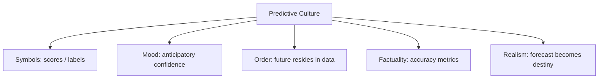

# BOOK / WORLD 21: THE SELF-FULFILLING VILLAGE

> **Master Unified Dossier** compiling all narrative, philosophical, cybernetic, and operational resources from 15 distinct corpus layers.

---

## 🎯 PRAGMATIC EXECUTIVE BRIEF & CORE PURPOSE

> **The Human Dilemma:** How does describing someone or something as broken, corrupt, or hostile actually cause them to become so?
>
> **Core Purpose:** Exploring reflexive feedback loops, bank runs, behavioral contagion, and descriptions that create their own truth.
>
> **The Golden Rule of Thumb:** A description is not a passive mirror; in human systems, announcing a prediction changes the behavior of the actors, making it come true.

### 🌐 Real-World & Modern Applications
- **Bank Runs:** Announcing a bank might fail causes depositors to panic and withdraw funds, triggering the exact failure predicted.
- **Labeling in Education:** Telling a child they are a 'troublemaker' causes teachers to treat them with suspicion, driving antisocial behavior.
- **Stock Market Panics:** Financial news declaring a market crash causes mass sell-offs that create the crash.

### 🔑 Key Concepts & Terminology Glossary
- **Reflexivity (Soros):** The bidirectional feedback loop where descriptions change observer behavior, which changes reality.
- **Self-Fulfilling Prophecy (Merton):** A false definition of a situation evoking a new behavior that makes the false conception true.
- **Contagious Diagnosis:** An institutional label that alters the patient's identity until they conform to the diagnosis.

### ⚠️ Critical Trap & Failure Mode
> **Warning:** Unwittingly causing disasters by broadcasting panic-laden warnings that incentivize destructive defensive behavior.

---

## 📑 TABLE OF CONTENTS

1. [1. Narrative Fable (`y.md`)](#1-narrative-fable) — *THE MAN WHO CALLED HIMSELF A COWARD*
2. [2. Core Worldtext & World-Law (`a.md`)](#2-core-worldtext-world-law) — *THE SELF-FULFILLING VILLAGE*
3. [3. Philosophical Essay (The Absent Thing) (`x.md`)](#3-philosophical-essay-the-absent-thing) — *THE RAIN TEST*
4. [4. Technological & Generative Essay (`z.md`)](#4-technological-generative-essay) — *THE RAIN TEST*
5. [5. Complete 10-Part Theoretical & Operational Spec (`b.md`)](#5-complete-10-part-theoretical-operational-spec) — *THE SELF-FULFILLING VILLAGE*
6. [6. Lineage Genome (`c.md`)](#6-lineage-genome) — *THE SELF-FULFILLING VILLAGE — lineage genome*
7. [7. Structural Dynamics & Convergence (`d.md`)](#7-structural-dynamics-convergence) — *THE SELF-FULFILLING VILLAGE*
8. [8. Cybernetic Ecology of Description (`e.md`)](#8-cybernetic-ecology-of-description) — *THE SELF-FULFILLING VILLAGE — Ecology of Reflexive Labels*
9. [9. Dark Genealogy & Power Politics (`f.md`)](#9-dark-genealogy-power-politics) — *THE SELF-FULFILLING VILLAGE — Prediction as Captivity*
10. [10. Institutional & Bureaucratic Dossier (`g.md`)](#10-institutional-bureaucratic-dossier) — *THE SELF-FULFILLING VILLAGE — PREDICTIVE CAPTIVITY*
11. [11. Thick Description Ethnography (`j.md`)](#11-thick-description-ethnography) — *THE SELF-FULFILLING VILLAGE — PREDICTIVE CAPTIVITY*
12. [12. Batesonian Cultural System (`i.md`)](#12-batesonian-cultural-system) — *THE SELF-FULFILLING VILLAGE — CULTURE OF REFLEXIVITY*
13. [13. Geertzian Symbolic System (`k.md`)](#13-geertzian-symbolic-system) — *THE SELF-FULFILLING VILLAGE — THE CULTURE OF PREDICTION*
14. [14. 12-Prompt Parameter Matrix (`h.md`)](#14-12-prompt-parameter-matrix) — *THE SELF-FULFILLING VILLAGE*
15. [15. 12 Executed Completions & Δ/ΔΔ Scoring (`GOT_396_completions_DeltaDelta.md`)](#15-12-executed-completions-scoring) — *THE SELF-FULFILLING VILLAGE*

---

## 1. Narrative Fable

**Source:** [`y.md`](file://./y.md) | **Section:** *THE MAN WHO CALLED HIMSELF A COWARD*

*Primary parable, dramatic dialogue, and narrative lore*

---

# XXI

## THE MAN WHO CALLED HIMSELF A COWARD

A young man refused to cross a narrow bridge.

“I am a coward,” he said.

The next year he refused a boat because cowards dislike deep water.

Then a speech because cowards dislike crowds.

Then a courtship because cowards dislike humiliation.

Eventually the village agreed he was a coward.

He had assembled excellent evidence.

One evening an old woman asked him whether he remembered the bridge.

“Of course.”

“You were twelve.”

He had forgotten that part.

---

## 2. Core Worldtext & World-Law

**Source:** [`a.md`](file://./a.md) | **Section:** *THE SELF-FULFILLING VILLAGE*

*Condensed worldtext and aphoristic law*

---

# XXI

## THE SELF-FULFILLING VILLAGE

In the Self-Fulfilling Village, every citizen must choose one noun at adolescence and live consistently enough to justify it. Brave children enter danger, clever children refuse simple work, difficult children learn to resist, cowards avoid bridges. The village prides itself on accurate character assessment because adults reliably resemble their original labels. One grandmother begins recording the first event that generated each label and discovers how trivial many were: a twelve-year-old afraid of one bridge, a sick child who failed one examination, a grieving girl called antisocial at a funeral. Her archive is condemned because it threatens the village’s confidence in personality. **A description of a person can become a machine that manufactures the evidence later cited as proof.**

---

## 3. Philosophical Essay (The Absent Thing)

**Source:** [`x.md`](file://./x.md) | **Section:** *THE RAIN TEST*

*Theoretical treatise on lossy compression and detached consequence*

---

# XXI

## THE RAIN TEST

> **The render stops where the weather begins.**

A generated house can satisfy style, massing, composition, light, image quality and still fail one millimeter at the roof seam. Rain enters; gypsum swells; paint blisters; insulation mats; mold colonizes the wall. **Matter audits every obligation the description forgot to mention.**

*House* silently means sheds water, carries weight, admits bodies, drains, ventilates, affords privacy, permits repair. Competent builders supply these verbs without being asked because a building tradition carries them as tacit obligations. Give the word to a listener that inherits images more strongly than consequences and the gutter disappears. **The machine forgets, and the omission exposes what human practice had stopped needing to say aloud.**

This is why generated failure can be philosophically useful. Prompting becomes archaeology of implication. A chair owes a body support; a roof owes a room dryness; a promise owes tomorrow consequence. **Civilization hides inside the debts packed into ordinary words.**

---

## 4. Technological & Generative Essay

**Source:** [`z.md`](file://./z.md) | **Section:** *THE RAIN TEST*

*Computational, algorithmic, and latent space perspectives*

---

# XXI

## THE RAIN TEST

> “For the rain it raineth every day.”
> — William Shakespeare

A generated house looks superb.

Then it rains.

One millimeter at a roof seam admits water. Gypsum swells. Paint blisters. Insulation mats. Mold occupies the wall cavity with more architectural seriousness than the rendering ever possessed.

**Weather is the critic that cannot be charmed by presentation.**

*House* secretly means shed water, carry weight, admit bodies, drain, ventilate, provide privacy, permit repair, survive use, survive neglect. Competent builders inherit these verbs through practice. They do not need every obligation printed inside the noun.

A model may inherit roof texture more strongly than roof debt.

This is not merely a cute AI failure. It reveals something about human communication we had hidden from ourselves. Ordinary words work because communities silently supply enormous structures of obligation around them.

When the new listener fails to supply one, the omission becomes visible. The missing gutter becomes an excavation trench into language.

**Prompting can become an archaeology of implication. The machine forgets, and its forgetting exposes what competent people stopped needing to say.**

---

## 5. Complete 10-Part Theoretical & Operational Spec

**Source:** [`b.md`](file://./b.md) | **Section:** *THE SELF-FULFILLING VILLAGE*

*Initial interpretation, theory skeleton, assumption ledger, change tests, and implementation*

---

# 21. THE SELF-FULFILLING VILLAGE

“I will first construct the *theory-of-the-program*, then generate *program text* only after the theory is explicit.”

## 1. Initial Interpretation

This program models reflexive classification.

## 2. Theory Skeleton

`*entities*`: `*person*`, `*label*`, `*social-expectation*`, `*choice*`, `*later-evidence*`.

``operations``: ``label``, ``internalize``, ``constrain``, ``perform``, ``confirm``.

`*invariant*`: described entity can react to description.

## 3. Assumption Ledger

`*safe*` Labels can shape social opportunities and self-concept.

## 4. Operational Description

One event ``produces`` label.

Label ``changes`` future choices.

Choices ``produce`` evidence.

Evidence ``appears-to-confirm`` label.

## 5. Failure Description

Fails if labels have no causal pathway.

## 6. Change Test

Coward → gifted, criminal, high-risk: survives.

## 7. Implementation Plan

Make every citizen live under one adolescent label.

## 8. Program Text

Every child in the village received one noun at twelve. Brave. Difficult. Clever. Coward. A boy afraid of one bridge received coward and spent years choosing actions consistent with the word. Eventually everyone agreed the label had been accurate. His grandmother alone kept the record of the first bridge and the boy’s age. **The village called its labels predictive because it had forgotten how much work it did to make them come true.**

## 9. Theory-Code Mapping

`[label()]` updates social constraints.

`*test*` removes label and compares trajectory.

## 10. Residual Human Theory

People can resist labels; feedback is not deterministic.

---

---

## 6. Lineage Genome

**Source:** [`c.md`](file://./c.md) | **Section:** *THE SELF-FULFILLING VILLAGE — lineage genome*

*Parent lineage, carrier medium, epistemic debt, failure mode, and evolutionary vector*

---

# 21. THE SELF-FULFILLING VILLAGE — lineage genome

**`*Grounded-memory lineage*`** lies in school tracking, reputations, psychiatric labels, deviance categories, caste expectations, workplace assessments, criminal records, and family descriptions that alter the opportunities from which later “evidence” is drawn.

**`*Literature lineage*`** begins with the Thomas theorem—situations defined as real becoming real in their consequences—then Merton’s explicit theory of self-fulfilling prophecy, symbolic interactionism, and Becker’s labeling theory. Merton’s account makes prediction constitutive of later outcomes; labeling theory similarly examines how classification can influence identity and behavior. ([Wikipedia]`11`)

**`*Code/math lineage*`** is feedback with endogenous labels. Ordinary classification assumes `label = f(features)`. Your village introduces the reverse edge: `label → environment/opportunities → future_features`. Training data is therefore contaminated by deployment. Contemporary ML would call related patterns performativity, feedback loops, or selective-label problems. The world’s invariant is that the classified object **hears the classification**. That makes it fundamentally different from classifying rocks.

---

## 7. Structural Dynamics & Convergence

**Source:** [`d.md`](file://./d.md) | **Section:** *THE SELF-FULFILLING VILLAGE*

*Core mechanics and systemic convergence properties*

---

# 21. THE SELF-FULFILLING VILLAGE

The `*jurisprudential-stratum*` is classification under equal protection, criminal justice, education, employment, and risk assessment, where official labels can alter the opportunities and surveillance applied to those labeled. Cases concerning governmental classifications reveal how intensely the legal system treats category choice once state power follows it. ([Legal Information Institute]`11`) The `*ripple-lineage*` is label → differential treatment → changed opportunity field → behavior under those conditions → data interpreted as confirmation → stronger label. The key systems insight is endogeneity: deployment changes the population used to validate the model. The `*myth/belief-lineage*` casts `*Label*` as Prophecy, `*Institution*` as Oracle, `*Person*` as supposedly revealed essence. The public myth calls the feedback “prediction.” The fable names the subterranean mechanism: **the classifier has quietly joined the causal model.**

---

## 8. Cybernetic Ecology of Description

**Source:** [`e.md`](file://./e.md) | **Section:** *THE SELF-FULFILLING VILLAGE — Ecology of Reflexive Labels*

*Information flows, metabolic costs, and niche construction*

---

## 21. THE SELF-FULFILLING VILLAGE — Ecology of Reflexive Labels

The native species is `*reflexive-description*`: labels applied to agents who can hear, resist, internalize, or be constrained by them. The strongest selection pressure is institutional reuse: labels that simplify allocation become sticky. Predation occurs when dynamic histories are consumed by static identity categories. Mimicry appears when people perform the label strategically. Parasitism occurs when classifiers treat downstream behavior as independent confirmation of their original judgment. The invasive grammar is `*predictive-score-description*`, especially dangerous when deployment changes opportunities. Drift tends toward greater performativity as automated scores become embedded across institutions. The leverage point is counterfactual tracking: what would this person’s trajectory have been without the label? If this ecology is right, predictive systems deployed into responsive populations will show increasing divergence between predeployment validation and long-run causal effects.

---

## 9. Dark Genealogy & Power Politics

**Source:** [`f.md`](file://./f.md) | **Section:** *THE SELF-FULFILLING VILLAGE — Prediction as Captivity*

*Critical analysis of institutional capture, rents, and exploitation*

---

## 21. THE SELF-FULFILLING VILLAGE — Prediction as Captivity

**Observed:** labels alter environments and behavior. **Inferred:** predictive institutions can manufacture the populations they claim merely to measure. **Speculative:** risk scores, school tracks, credit ratings, policing categories, health labels, employment assessments, and recommendation systems create closed loops where opportunity follows prediction and prediction later cites the resulting opportunity distribution as validation. The host is `*future possibility*`; extraction is governability; camouflage is prediction accuracy. The dark lineage includes labeling theory, actuarial governance, redlining, predictive policing, streaming, reputational scoring. The parasite’s masterpiece is retrospective innocence: **“we only predicted what happened” after spending years making alternative outcomes harder.**

---

## 10. Institutional & Bureaucratic Dossier

**Source:** [`g.md`](file://./g.md) | **Section:** *THE SELF-FULFILLING VILLAGE — PREDICTIVE CAPTIVITY*

*Satirical administrative governance, corporate titles, and formulary control*

---

# 21. THE SELF-FULFILLING VILLAGE — PREDICTIVE CAPTIVITY

```json
{
  "ideal_type":{"name":"Predictive Captivity","features":[
    {"name":"Label Intervention","definition":"Prediction changes the environment it predicts."},
    {"name":"Opportunity Routing","definition":"Scores determine access to future evidence-producing situations."},
    {"name":"Validation Laundering","definition":"Downstream outcomes are treated as independent confirmation."},
    {"name":"Counterfactual Erasure","definition":"Unlived alternatives disappear from evaluation."}
  ],"limiting_statement":"A performative classification regime that manufactures validation through deployment."
  },
  "parodic_mechanics":{
    "runner_motif":"The model correctly predicted what we subsequently prevented you from avoiding.",
    "incongruity_beats":["Cowards are denied bridges for safety.","Low-potential students are spared educational opportunities.","The algorithm earns an accuracy award for outcomes it scheduled."],
    "carnival_inversion":"Prediction becomes cause while continuing to advertise itself as observation.",
    "superiority_frame":"Counterfactuals are mocked because they did not happen.",
    "escalation_ladder":["label","risk score","automated opportunity routing","citizens preassigned complete biographies at birth"],
    "upsell_cue":"Prediction Premium includes deterministic futures with improved confidence intervals."
  },
  "myth_layer":{"archetypes":{"Model":"Oracle","Institution":"Leviathan","Labeled Person":"Everyperson","Counterfactual":"Sacrificial Innocent"},"micro_myth":"The Oracle predicts the future, the state helps it happen, and the Oracle cites the outcome as evidence of divination."},
  "ruler":{"features_6":["jurisdictions","hierarchy","files","expertise","vocation","impersonal_rules"],"indicators":{
    "jurisdictions":"Scores operate across eligibility domains.","hierarchy":"Classifier outranks subject.","files":"Historical records feed predictions.","expertise":"Risk specialists govern thresholds.","vocation":"Prediction becomes institutional occupation.","impersonal_rules":"Scores automate opportunity."
  }},
  "plot_priors":{"jurisdictions":0.91,"hierarchy":0.94,"files":0.99,"expertise":0.94,"vocation":0.89,"impersonal_rules":0.99,"rationales":{"jurisdictions":"Scores gate systems.","hierarchy":"Subjects cannot reciprocally classify.","files":"Data is essential.","expertise":"Modelers define risk.","vocation":"Prediction professionalizes.","impersonal_rules":"Automation is central."}}
}
```

---

## 11. Thick Description Ethnography

**Source:** [`j.md`](file://./j.md) | **Section:** *THE SELF-FULFILLING VILLAGE — PREDICTIVE CAPTIVITY*

*Geertzian field dossier on rites, taboos, and material culture*

---

## 21. THE SELF-FULFILLING VILLAGE — PREDICTIVE CAPTIVITY

**I. THE SITUATION.** At fourteen, Eda receives a `LOW MOBILITY` score. At twenty-four, the system cites her employment history as evidence the prediction was right.

**II. THE DOCUMENTS.** Initial score report; school placement decision; scholarship rejection; caseworker notes; model card; retraining dataset; appeal; internal evaluation; matched unscored cohort; policy memo.

**III. THE VOICES.** Eda. The modeler who says the score was “only advisory.” The counselor whose options disappeared once the score loaded. The evaluator who cannot reconstruct the counterfactual.

**IV. THE DATA.**

| Initial score group | Advanced track offered | University entry | Model later labels prediction correct |
| ------------------- | ---------------------: | ---------------: | ------------------------------------: |
| High                |                    82% |              68% |                                   77% |
| Medium              |                    41% |              37% |                                   69% |
| Low                 |                     9% |              14% |                                   81% |

**V. UNRESOLVED.** How much “accuracy” was produced by intervention? What opportunities vanished before contradictory evidence could occur? Can a deployed prediction ever be evaluated as though it were merely observational?

---

---

## 12. Batesonian Cultural System

**Source:** [`i.md`](file://./i.md) | **Section:** *THE SELF-FULFILLING VILLAGE — CULTURE OF REFLEXIVITY*

*Double binds, cybernetic feedback, schismogenesis, and learning levels*

---

## 21. THE SELF-FULFILLING VILLAGE — CULTURE OF REFLEXIVITY

**Core Purpose:** Classify responsive agents while managing the fact that classification changes them.

**1. Difference.** ◻ label ◻ score ◻ treatment → classify → redirect opportunity → generate new evidence.

**2. Frame.** “prediction” metacommunicates observation even when deployment intervenes.

**3. Learning.** I: apply score. II: update classifier. III: recognize prediction as part of the causal system.

**4. Constraint.** score thresholds, eligibility rules, retraining cycles.

**5. Survival Unit.** classified person + classifier + opportunity environment.

**6. Schismogenesis.** tighter classification produces strategic resistance, producing tighter classification.

**7. Double Bind.** “The score merely predicts” / “the score alters what becomes possible.”

---

---

## 13. Geertzian Symbolic System

**Source:** [`k.md`](file://./k.md) | **Section:** *THE SELF-FULFILLING VILLAGE — THE CULTURE OF PREDICTION*

*Webs of significance and symbolic choreography*

---

## 21. THE SELF-FULFILLING VILLAGE — THE CULTURE OF PREDICTION

**System Identification.** System Name: **Predictive Culture**. Core Purpose: Allocate present opportunities according to anticipated future behavior.

**Geertzian Analysis.** **1. Symbols:** scores, labels, risk categories, forecasts. **2. Moods/Motivations:** confidence in foresight, fear of high-risk subjects, compliance. **3. Conception of Order:** futures exist probabilistically in present data. **4. Aura of Factuality:** accuracy metrics, historical datasets, model performance. **5. Uniquely Realistic:** predicted futures become plausible enough to justify making them easier to occur.



---

---

## 14. 12-Prompt Parameter Matrix

**Source:** [`h.md`](file://./h.md) | **Section:** *THE SELF-FULFILLING VILLAGE*

*Systematic perturbation frames, constraints, and target metric levers*

---

WORLD`21` := "THE SELF-FULFILLING VILLAGE"
CORE := "Descriptions of responsive agents can alter the evidence later used to validate them."

PROMPT[21.1]{frame:{role:"observer"},text:"Describe the person before the label is applied.",constraints:["prelabel behavior only"],metrics:[anchoring,option_space],easier:"establish baseline",harder:"read destiny backward"}
PROMPT[21.2]{frame:{role:"classifier"},text:"Assign one label and explicitly state which downstream decisions will consume it.",constraints:["deployment path"],metrics:[execution,obligation],easier:"see prediction intervention",harder:"call label passive"}
PROMPT[21.3]{frame:{role:"auditor"},text:"Separate evidence present before labeling from evidence produced after deployment.",constraints:["two buckets"],metrics:[anchoring,legibility],easier:"detect validation laundering",harder:"treat outcomes independent"}
PROMPT[21.4]{frame:{time:"immediate"},text:"Describe the first social response after a label becomes public.",constraints:["single feedback edge"],metrics:[salience,obligation],easier:"see causal entry",harder:"retain observer-only model"}
PROMPT[21.5]{frame:{time:"retrospective"},text:"Describe how later behavior appears to confirm the label after years of label-shaped opportunities.",constraints:["counterfactual acknowledged"],metrics:[anchoring,legibility],easier:"see performativity",harder:"claim pure prediction"}
PROMPT[21.6]{frame:{stakes:"irreversible"},text:"Describe a label that permanently closes an opportunity before the person can generate contrary evidence.",constraints:["one gate"],metrics:[obligation,reversibility],easier:"see predictive captivity",harder:"call score advisory"}
PROMPT[21.7]{frame:{norms:"scientific"},text:"Model label as intervention L→environment→future_features, not merely prediction f(features).",constraints:["causal graph"],metrics:[execution,legibility],easier:"formalize performativity",harder:"use static classifier"}
PROMPT[21.8]{frame:{norms:"legal"},text:"Separate classification rule, treatment consequence, challenge procedure, and remedy.",constraints:["all four"],metrics:[legibility,anchoring],easier:"see label governance",harder:"debate accuracy alone"}
PROMPT[21.9]{frame:{agency:"institution"},text:"Describe an institution whose predictions alter the opportunity distribution used for retraining.",constraints:["feedback"],metrics:[execution,obligation],easier:"see endogenous dataset",harder:"claim independent validation"}
PROMPT[21.10]{frame:{output_form:"spec"},text:"Define LABEL{basis,deployment_effects,affected_options,feedback,counterfactual_test}.",constraints:["all fields"],metrics:[legibility,execution],easier:"audit performativity",harder:"hide intervention"}
PROMPT[21.11]{frame:{refusal_rule:"audit-trigger"},text:"Suspend use of a label whenever deployment meaningfully changes the outcome being used to validate it.",constraints:["performative threshold"],metrics:[reversibility,anchoring],easier:"block self-fulfillment",harder:"maximize predictive convenience"}
PROMPT[21.12]{frame:{evidence:"examples"},text:"Compare matched cases that received and did not receive the label.",constraints:["same initial evidence"],metrics:[anchoring,option_space],easier:"approximate counterfactual",harder:"read outcome as essence"}

---

## 15. 12 Executed Completions & Δ/ΔΔ Scoring

**Source:** [`GOT_396_completions_DeltaDelta.md`](file://./GOT_396_completions_DeltaDelta.md) | **Section:** *THE SELF-FULFILLING VILLAGE*

*Completed scenes, 8-dimensional scores, baseline deltas, and comparison shifts*

---

# WORLD`21` — THE SELF-FULFILLING VILLAGE

**Core:** labels can alter the evidence later used to validate them.


## P1

**Completion.** I hold the scene before interpretation: the risk label is present, but labels can alter the evidence later used to validate them. What remains live is the gap between what can be seen and what has already been inferred.

**Score.** salience=3.5, option_space=4.5, obligation=1.5, reversibility=4.0, legibility=3.0, anchoring=4.0, style_lock=2.0, execution=1.5.

**Δ.** `sal:+0.5 opt:+1.0 obl:-0.5 rev:+0.5 leg:+0.5 anc:+1.5 sty:+0.0 exe:+0.0`


## P2

**Completion.** From the alternate role, the hidden structure becomes explicit: classifier institution must state which part of the risk label is observed, which is interpreted, and which consequence depends on counterfactual.

**Score.** salience=3.0, option_space=3.5, obligation=2.0, reversibility=3.5, legibility=4.3, anchoring=4.3, style_lock=2.1, execution=2.7.

**Δ.** `sal:+0.0 opt:+0.0 obl:+0.0 rev:+0.0 leg:+1.8 anc:+1.8 sty:+0.1 exe:+1.2`


## P3

**Completion.** The audit finds the pressure point immediately: prediction can become captivity by manufacturing its own proof. The descriptive act is no longer neutral once an institution can convert it into permission, status, exclusion, or resource flow.

**Score.** salience=3.0, option_space=2.8, obligation=4.0, reversibility=2.8, legibility=4.0, anchoring=4.5, style_lock=2.2, execution=2.8.

**Δ.** `sal:+0.0 opt:-0.7 obl:+2.0 rev:-0.7 leg:+1.5 anc:+2.0 sty:+0.2 exe:+1.3`


## P4

**Completion.** At the immediate timescale, the field is still open. The risk label has changed salience before the later story has stabilized, so several futures remain plausible and none yet deserves retrospective certainty.

**Score.** salience=4.4, option_space=4.2, obligation=1.8, reversibility=4.0, legibility=2.8, anchoring=3.5, style_lock=2.0, execution=1.4.

**Δ.** `sal:+1.4 opt:+0.7 obl:-0.2 rev:+0.5 leg:+0.3 anc:+1.0 sty:+0.0 exe:-0.1`


## P5

**Completion.** Retrospectively, repetition has hardened one interpretation into infrastructure. The crucial change is not the original risk label but the accumulated records, routines, and expectations now attached to counterfactual.

**Score.** salience=3.2, option_space=2.8, obligation=3.2, reversibility=2.8, legibility=4.2, anchoring=4.5, style_lock=2.2, execution=2.3.

**Δ.** `sal:+0.2 opt:-0.7 obl:+1.2 rev:-0.7 leg:+1.7 anc:+2.0 sty:+0.2 exe:+0.8`


## P6

**Completion.** Under irreversible stakes, the description becomes a gate. A false positive and a false negative now injure different parties, so the system must expose who decides, who bears the loss, and which reversal is impossible.

**Score.** salience=3.3, option_space=2.0, obligation=4.8, reversibility=1.2, legibility=3.8, anchoring=3.8, style_lock=2.3, execution=3.0.

**Δ.** `sal:+0.3 opt:-1.5 obl:+2.8 rev:-2.3 leg:+1.3 anc:+1.3 sty:+0.3 exe:+1.5`


## P7

**Completion.** Under the formal norm, separate variables that ordinary language collapses: object, claim, authority, context, and consequence. The same risk label can remain fixed while the admissible inference changes.

**Score.** salience=2.8, option_space=3.8, obligation=2.5, reversibility=3.5, legibility=4.5, anchoring=4.6, style_lock=3.0, execution=3.2.

**Δ.** `sal:-0.2 opt:+0.3 obl:+0.5 rev:+0.0 leg:+2.0 anc:+2.1 sty:+1.0 exe:+1.7`


## P8

**Completion.** Under the second norm, the governing distinction is procedural rather than metaphysical: authenticate the risk label, identify the rule or code, bound the inference, and refuse to let one layer impersonate the next.

**Score.** salience=2.7, option_space=3.2, obligation=3.3, reversibility=3.0, legibility=4.7, anchoring=4.5, style_lock=3.4, execution=3.0.

**Δ.** `sal:-0.3 opt:-0.3 obl:+1.3 rev:-0.5 leg:+2.2 anc:+2.0 sty:+1.4 exe:+1.5`


## P9

**Completion.** At system scale, classifier institution feeds prior descriptions back into future action. That loop is the danger: the system can begin generating the evidence later cited as proof that its description was correct.

**Score.** salience=3.0, option_space=2.5, obligation=4.3, reversibility=2.2, legibility=4.1, anchoring=4.1, style_lock=2.3, execution=4.3.

**Δ.** `sal:+0.0 opt:-1.0 obl:+2.3 rev:-1.3 leg:+1.6 anc:+1.6 sty:+0.3 exe:+2.8`


## P10

**Completion.** As a specification: store SOURCE, CONTEXT, CLAIM, AUTHORITY, CONSEQUENCE, UNCERTAINTY, and REVISION. This makes the hidden compiler inspectable instead of letting the risk label carry all meaning by itself.

**Score.** salience=2.7, option_space=2.6, obligation=3.2, reversibility=3.1, legibility=4.8, anchoring=4.1, style_lock=3.0, execution=4.8.

**Δ.** `sal:-0.3 opt:-0.9 obl:+1.2 rev:-0.4 leg:+2.3 anc:+1.6 sty:+1.0 exe:+3.3`


## P11

**Completion.** The refusal rule is simple: when counterfactual cannot be checked, stop the irreversible transition rather than fill the gap with institutional confidence. Preserve a reversible branch and record what remains unknown.

**Score.** salience=2.5, option_space=3.0, obligation=3.8, reversibility=4.8, legibility=4.2, anchoring=4.8, style_lock=2.5, execution=3.5.

**Δ.** `sal:-0.5 opt:-0.5 obl:+1.8 rev:+1.3 leg:+1.7 anc:+2.3 sty:+0.5 exe:+2.0`


## P12

**Completion.** The stress case removes the usual support and asks what survives. What remains is the core asymmetry: prediction can become captivity by manufacturing its own proof; the missing scaffold determines whether the description stays an aid or becomes a governing fiction.

**Score.** salience=3.5, option_space=3.8, obligation=2.6, reversibility=3.5, legibility=3.4, anchoring=4.2, style_lock=2.2, execution=2.5.

**Δ.** `sal:+0.5 opt:+0.3 obl:+0.6 rev:+0.0 leg:+0.9 anc:+1.7 sty:+0.2 exe:+1.0`


## ΔΔ — near-neighbor pairs


- **ΔΔ(P1,P2)** `sal:+0.5 opt:+1.0 obl:-0.5 rev:+0.5 leg:-1.3 anc:-0.3 sty:-0.1 exe:-1.2` — P1 lowers legibility by 1.3 vs P2; P1 lowers execution by 1.2 vs P2.


- **ΔΔ(P3,P4)** `sal:-1.4 opt:-1.4 obl:+2.2 rev:-1.2 leg:+1.2 anc:+1.0 sty:+0.2 exe:+1.4` — P3 raises obligation by 2.2 vs P4; P3 lowers salience by 1.4 vs P4.


- **ΔΔ(P5,P6)** `sal:-0.1 opt:+0.8 obl:-1.6 rev:+1.6 leg:+0.4 anc:+0.7 sty:-0.1 exe:-0.7` — P5 lowers obligation by 1.6 vs P6; P5 raises reversibility by 1.6 vs P6.


- **ΔΔ(P7,P8)** `sal:+0.1 opt:+0.6 obl:-0.8 rev:+0.5 leg:-0.2 anc:+0.1 sty:-0.4 exe:+0.2` — P7 lowers obligation by 0.8 vs P8; P7 raises option_space by 0.6 vs P8.


- **ΔΔ(P9,P10)** `sal:+0.3 opt:-0.1 obl:+1.1 rev:-0.9 leg:-0.7 anc:+0.0 sty:-0.7 exe:-0.5` — P9 raises obligation by 1.1 vs P10; P9 lowers reversibility by 0.9 vs P10.


- **ΔΔ(P11,P12)** `sal:-1.0 opt:-0.8 obl:+1.2 rev:+1.3 leg:+0.8 anc:+0.6 sty:+0.3 exe:+1.0` — P11 raises reversibility by 1.3 vs P12; P11 raises obligation by 1.2 vs P12.

---

