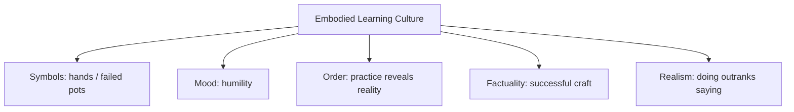

# BOOK / WORLD 22: THE SCHOOL OF COLLAPSING POTS

> **Master Unified Dossier** compiling all narrative, philosophical, cybernetic, and operational resources from 15 distinct corpus layers.

---

## 🎯 PRAGMATIC EXECUTIVE BRIEF & CORE PURPOSE

> **The Human Dilemma:** Why can't you learn pottery, surgery, coding, or violin solely by reading an instruction manual?
>
> **Core Purpose:** Understanding tacit craft knowledge, bodily feel, non-verbal heuristics, and learning through failure.
>
> **The Golden Rule of Thumb:** Tacit knowledge lives in the nerve endings, not the textbook. True mastery requires breaking a hundred pots to calibrate the fingers.

### 🌐 Real-World & Modern Applications
- **Software Debugging & System Intuition:** Senior engineers knowing instantly where a bug lives by 'feel' and system smell.
- **Surgical & Craft Apprenticeships:** Learning pressure, resistance, and timing by standing beside a master rather than just reading anatomy.
- **Athletic Coaching:** Developing muscle memory and proprioceptive calibration through thousands of failed repetitions.

### 🔑 Key Concepts & Terminology Glossary
- **Tacit Knowledge (Polanyi):** Knowledge that we can act on but cannot fully express in words ('we know more than we can tell').
- **Somatic Calibration:** Training the physical senses and reflexes to detect subtle variations in material resistance.
- **Productive Collapse:** Failure designed to deliver instant sensory feedback on an erroneous technique.

### ⚠️ Critical Trap & Failure Mode
> **Warning:** Believing you can automate or scale a craft solely with written documentation while firing the experienced craftsmen.

---

## 📑 TABLE OF CONTENTS

1. [1. Narrative Fable (`y.md`)](#1-narrative-fable) — *THE POTTER'S THUMB*
2. [2. Core Worldtext & World-Law (`a.md`)](#2-core-worldtext-world-law) — *THE SCHOOL OF COLLAPSING POTS*
3. [3. Philosophical Essay (The Absent Thing) (`x.md`)](#3-philosophical-essay-the-absent-thing) — *WHAT A THING OWES*
4. [4. Technological & Generative Essay (`z.md`)](#4-technological-generative-essay) — *WHAT THINGS OWE*
5. [5. Complete 10-Part Theoretical & Operational Spec (`b.md`)](#5-complete-10-part-theoretical-operational-spec) — *THE SCHOOL OF COLLAPSING POTS*
6. [6. Lineage Genome (`c.md`)](#6-lineage-genome) — *THE SCHOOL OF COLLAPSING POTS — lineage genome*
7. [7. Structural Dynamics & Convergence (`d.md`)](#7-structural-dynamics-convergence) — *THE SCHOOL OF COLLAPSING POTS*
8. [8. Cybernetic Ecology of Description (`e.md`)](#8-cybernetic-ecology-of-description) — *THE SCHOOL OF COLLAPSING POTS — Ecology of Tacit Knowledge*
9. [9. Dark Genealogy & Power Politics (`f.md`)](#9-dark-genealogy-power-politics) — *THE SCHOOL OF COLLAPSING POTS — Knowledge Extraction*
10. [10. Institutional & Bureaucratic Dossier (`g.md`)](#10-institutional-bureaucratic-dossier) — *THE SCHOOL OF COLLAPSING POTS — TACIT EXTRACTION FACTORY*
11. [11. Thick Description Ethnography (`j.md`)](#11-thick-description-ethnography) — *THE SCHOOL OF COLLAPSING POTS — TACIT EXTRACTION FACTORY*
12. [12. Batesonian Cultural System (`i.md`)](#12-batesonian-cultural-system) — *THE SCHOOL OF COLLAPSING POTS — CULTURE OF METIS*
13. [13. Geertzian Symbolic System (`k.md`)](#13-geertzian-symbolic-system) — *THE SCHOOL OF COLLAPSING POTS — THE CULTURE OF METIS*
14. [14. 12-Prompt Parameter Matrix (`h.md`)](#14-12-prompt-parameter-matrix) — *THE SCHOOL OF COLLAPSING POTS*
15. [15. 12 Executed Completions & Δ/ΔΔ Scoring (`GOT_396_completions_DeltaDelta.md`)](#15-12-executed-completions-scoring) — *THE SCHOOL OF COLLAPSING POTS*

---

## 1. Narrative Fable

**Source:** [`y.md`](file://./y.md) | **Section:** *THE POTTER'S THUMB*

*Primary parable, dramatic dialogue, and narrative lore*

---

# XXII

## THE POTTER'S THUMB

A scholar asked a potter to explain exactly how she knew when the wall of a vessel was too thin.

The potter tried.

“Pressure.”

“How much?”

“Enough.”

“How many grams?”

The potter sighed, took the scholar's hand, placed his thumb against turning clay, and pressed.

The wall collapsed.

“Too much,” she said.

The scholar finally understood enough to become dangerous.

---

## 2. Core Worldtext & World-Law

**Source:** [`a.md`](file://./a.md) | **Section:** *THE SCHOOL OF COLLAPSING POTS*

*Condensed worldtext and aphoristic law*

---

# XXII

## THE SCHOOL OF COLLAPSING POTS

At the School of Collapsing Pots, all craft must be taught in language. Students memorize precise manuals describing pressure, speed, moisture, timing, wrist angle. Their first thousand pots collapse. An old potter violates school law by taking a student’s hand and placing it against spinning clay. The student learns in seconds what the manual could not stabilize. Administrators add a chapter called TACIT VARIABLES and declare the problem solved. More pots collapse. Eventually the school recognizes demonstration, correction, repetition, and bodily attunement as interfaces for knowledge rather than embarrassing failures of description. **Some knowledge can be talked around indefinitely because its decisive unit is not a sentence but a trained relation between body and material.**

---

## 3. Philosophical Essay (The Absent Thing)

**Source:** [`x.md`](file://./x.md) | **Section:** *WHAT A THING OWES*

*Theoretical treatise on lossy compression and detached consequence*

---

# XXII

## WHAT A THING OWES

> **Description is weakest where it preserves the noun and drops the debt.**

A chair-shaped object that collapses under a seated body has preserved silhouette while losing one central obligation. A roof line can look exquisite while directing water into a wall cavity. A photograph can preserve a face while losing who may touch it, mourn it, fear it, trust it. **Relations keep nouns honest.**

This may be the signal description loses most easily: obligation, not merely moral obligation but the invisible musts connecting things to other things. Roof to room. Stair to foot. Promise to future. Photograph to encounter. **A thing remains what we call it partly through what it still has to answer for.**

Counterfeit exploits this gap. A generated face can preserve skin texture, asymmetry, catchlights, lens distortion while no childhood, hunger, promise, burial stands behind the eyes. Fiction does not commit the same offense because fiction marks the game. **Fraud begins when a surface borrows obligations from a causal history it does not possess.**

---

## 4. Technological & Generative Essay

**Source:** [`z.md`](file://./z.md) | **Section:** *WHAT THINGS OWE*

*Computational, algorithmic, and latent space perspectives*

---

# XXII

## WHAT THINGS OWE

> “No man is an island.”
> — John Donne

A chair-shaped object that collapses beneath a body has preserved silhouette while defaulting on a debt. A beautiful roof can default on dryness. A promise can keep every word and default on tomorrow.

A photograph may owe itself to an encounter. A scar owes itself to damaged tissue. A footprint owes itself to pressure. These debts do not make the signs morally superior; they determine what kinds of claims the signs can support.

**Things are partly made of what they still have to answer for.**

This may be description's most persistent loss. It preserves nouns and drops obligations. It preserves the chair and loses sitting, the roof and loses rain, the face and loses biography, the language corpus and loses when anyone laughed.

Counterfeit exploits exactly this gap. A generated person can preserve pores, asymmetry, catchlights, depth of field, a stray hair, sweat shine. No childhood, hunger, debt, promise, illness, funeral stands behind the eyes.

The problem is not fiction. Fiction has manners. It tells us which game we are playing.

Fraud begins when a surface asks to borrow trust from a history it never lived.

---

## 5. Complete 10-Part Theoretical & Operational Spec

**Source:** [`b.md`](file://./b.md) | **Section:** *THE SCHOOL OF COLLAPSING POTS*

*Initial interpretation, theory skeleton, assumption ledger, change tests, and implementation*

---

# 22. THE SCHOOL OF COLLAPSING POTS

“I will first construct the *theory-of-the-program*, then generate *program text* only after the theory is explicit.”

## 1. Initial Interpretation

This program tests the limits of explicit instruction.

## 2. Theory Skeleton

`*entities*`: `*manual*`, `*student*`, `*expert*`, `*clay*`, `*thumb-pressure*`.

``operations``: ``describe``, ``attempt``, ``fail``, ``demonstrate``, ``attune``.

`*invariant*`: some decisive variable remains embodied.

## 3. Assumption Ledger

`*safe*` Tacit and sensorimotor knowledge exists.

## 4. Operational Description

Manual ``specifies`` actions.

Student ``executes`` but fails.

Expert ``guides-body``.

Skill ``emerges`` through relation with material.

## 5. Failure Description

Fails if manual alone produces mastery reliably.

## 6. Change Test

Pottery → surgery, violin, climbing: survives.

## 7. Implementation Plan

Make institutional commitment to explicitness absurdly rigid.

## 8. Program Text

The School of Collapsing Pots believed anything worth knowing could be written. Students memorized pressure, speed, moisture, timing. Pots still folded. An old potter finally placed a student’s hand against spinning clay and let the wall fail beneath his thumb. “Too much,” she said. The administrators added a chapter titled TACIT VARIABLES. The next class still collapsed. **The school had mistaken naming the limit of description for crossing it.**

## 9. Theory-Code Mapping

`*Instruction*` cannot encode all sensorimotor feedback.

`[practice()]` updates embodied policy.

## 10. Residual Human Theory

Tacit knowledge can often be partially formalized; no fixed boundary exists.

---

---

## 6. Lineage Genome

**Source:** [`c.md`](file://./c.md) | **Section:** *THE SCHOOL OF COLLAPSING POTS — lineage genome*

*Parent lineage, carrier medium, epistemic debt, failure mode, and evolutionary vector*

---

# 22. THE SCHOOL OF COLLAPSING POTS — lineage genome

**`*Grounded-memory lineage*`** is apprenticeship: pottery, weaving, surgery, dance, carpentry, music, cooking, riding, masonry. Its archive is not primarily text but worn tools, corrected bodies, failed objects, demonstrations, gestures, and sayings whose sense emerges only in practice.

**`*Literature lineage*`** is Ryle’s knowing-how, Polanyi’s tacit dimension, Schön’s reflective practice, Lave and Wenger’s situated learning, and embodied cognition. Polanyi’s “know more than we can tell” becomes almost literal here, while recent formal work on cultural transmission of tacit knowledge asks how high-fidelity practices can persist when neither simple imitation nor explicit rules suffice. ([Springer]`9`)

**`*Code/math lineage*`** is imitation learning, learning from demonstrations, interactive feedback, and system identification. A static instruction file lacks high-bandwidth error correction from material response. The potter’s hand closes the loop: `attempt → material feedback → expert correction → updated motor policy`. The mutation is to make **the world itself part of the teacher**. A successful system cannot compile skill from declarative rules alone.

---

## 7. Structural Dynamics & Convergence

**Source:** [`d.md`](file://./d.md) | **Section:** *THE SCHOOL OF COLLAPSING POTS*

*Core mechanics and systemic convergence properties*

---

# 22. THE SCHOOL OF COLLAPSING POTS

The `*jurisprudential-stratum*` is expert competence and evidentiary translation: courts must convert highly embodied, technical practices into testimony, standards, and records capable of review. *Daubert* and its progeny make reliability and methodology explicit legal questions, even though many practices include skilled judgments difficult to exhaust in propositions. ([Legal Information Institute]`3`) The `*ripple-lineage*` is craft → apprenticeship → professionalization → codification → credentialing → audit, with each layer gaining transferability while potentially shedding situational feel. The `*myth/belief-lineage*` casts `*Manual*` as Scripture, `*Expert Hand*` as Wizard, `*Clay*` as Material Judge. The school’s dominant myth is that whatever cannot be put into the manual is merely awaiting better documentation. The clay keeps issuing the same counter-opinion.

---

## 8. Cybernetic Ecology of Description

**Source:** [`e.md`](file://./e.md) | **Section:** *THE SCHOOL OF COLLAPSING POTS — Ecology of Tacit Knowledge*

*Information flows, metabolic costs, and niche construction*

---

## 22. THE SCHOOL OF COLLAPSING POTS — Ecology of Tacit Knowledge

The native species is `*demonstrative-description*`: gesture, correction, example, rhythm, “like this.” Its selection pressure is fidelity of skilled reproduction. Predation occurs when scalable textual standards displace local embodied transmission. Mimicry appears when symbolic fluency impersonates actual skill. Parasitism occurs when institutions credential written knowledge while depending materially on uncredentialed tacit practitioners. The invasive grammar is `*fully-explicit-instruction*`. Drift under automation pressure favors attempts to capture tacit knowledge in sensors, models, and procedural datasets. The leverage point is keeping material feedback inside the learning loop. If this ecology is right, domains that replace situated practice with static documentation will initially gain scalability but later experience clustered failures at edge conditions experts previously handled tacitly.

---

## 9. Dark Genealogy & Power Politics

**Source:** [`f.md`](file://./f.md) | **Section:** *THE SCHOOL OF COLLAPSING POTS — Knowledge Extraction*

*Critical analysis of institutional capture, rents, and exploitation*

---

## 22. THE SCHOOL OF COLLAPSING POTS — Knowledge Extraction

**Observed:** skill requires embodied feedback not contained in manuals. **Inferred:** institutions can mine practitioners for tacit knowledge, formalize the profitable parts, and externalize the uncapturable residue back onto workers as “exceptions.” **Speculative:** automation deskills the majority while retaining a shrinking hidden caste of experts who quietly repair edge cases the automated system officially claims not to need. The host is `*craft labor*`; extraction is know-how; camouflage is scalability. The dark lineage includes Taylorism, industrial deskilling, “human in the loop” labor, wizard-of-oz automation, outsourced moderation, maintenance invisibility. The parasite reproduces by publicizing automation successes and hiding manual recovery. Collapse arrives when the hidden experts disappear and the supposedly autonomous system encounters clay.

---

## 10. Institutional & Bureaucratic Dossier

**Source:** [`g.md`](file://./g.md) | **Section:** *THE SCHOOL OF COLLAPSING POTS — TACIT EXTRACTION FACTORY*

*Satirical administrative governance, corporate titles, and formulary control*

---

# 22. THE SCHOOL OF COLLAPSING POTS — TACIT EXTRACTION FACTORY

```json
{
  "ideal_type":{"name":"Tacit Extraction Factory","features":[
    {"name":"Craft Mining","definition":"Expert behavior is harvested for formalization."},
    {"name":"Edge-Case Dumping","definition":"Uncaptured complexity returns to humans as exception handling."},
    {"name":"Automation Theater","definition":"Hidden recovery labor protects autonomous branding."},
    {"name":"Deskilling Loop","definition":"Workers lose practice as systems absorb routine operations."}
  ],"limiting_statement":"A regime where automation claims independence while feeding continuously on invisible residual expertise."
  },
  "parodic_mechanics":{
    "runner_motif":"The system is fully autonomous except when clay is involved.",
    "incongruity_beats":["Master potters label edge cases offshore.","A human quietly catches every automated vase.","The company reports 100% automation after excluding recovery labor."],
    "carnival_inversion":"Humans become the undocumented exception handler for a machine advertised as their replacement.",
    "superiority_frame":"Craft workers are described as resistant to scalable intelligence.",
    "escalation_ladder":["manual capture","motion tracking","autonomous pottery","gig workers remotely holding robotic pots upright"],
    "upsell_cue":"Autonomy Enterprise hides human correction at dashboard level."
  },
  "myth_layer":{"archetypes":{"Automation":"Disruptor","Expert Worker":"Sacrificial Innocent","Dashboard":"Trickster","Investor":"Everyperson"},"micro_myth":"The machine inherits the repeatable part of skill and declares the residue obsolete while quietly hiring the residue by the hour."},
  "ruler":{"features_6":["jurisdictions","hierarchy","files","expertise","vocation","impersonal_rules"],"indicators":{
    "jurisdictions":"Automation divides routine and exception work.","hierarchy":"System designers outrank residual workers.","files":"Demonstrations become datasets.","expertise":"Tacit knowledge is extracted.","vocation":"Craft roles are transformed.","impersonal_rules":"Formalized operations replace local judgment."
  }},
  "plot_priors":{"jurisdictions":0.71,"hierarchy":0.89,"files":0.92,"expertise":0.96,"vocation":0.84,"impersonal_rules":0.91,"rationales":{"jurisdictions":"Work is partitioned.","hierarchy":"Designers control extraction.","files":"Data capture is central.","expertise":"Skill is the resource.","vocation":"Craft identity erodes.","impersonal_rules":"Automation formalizes routine."}}
}
```

---

## 11. Thick Description Ethnography

**Source:** [`j.md`](file://./j.md) | **Section:** *THE SCHOOL OF COLLAPSING POTS — TACIT EXTRACTION FACTORY*

*Geertzian field dossier on rites, taboos, and material culture*

---

## 22. THE SCHOOL OF COLLAPSING POTS — TACIT EXTRACTION FACTORY

**I. THE SITUATION.** The robotic wheel makes forty-one good bowls. Bowl forty-two folds inward. A remote contractor in another country clicks `RECOVER`.

**II. THE DOCUMENTS.** automation demo; contractor SOP; internal human-intervention dashboard; investor slide; master potter motion-capture session; error logs; payroll ledger; marketing copy; edge-case classifier; leaked staffing spreadsheet.

**III. THE VOICES.** Founder: “The system throws pots autonomously.” Contractor: “We touch almost every difficult one.” Potter: “It learned my hand but not why I move it.” Investor: “How low can the human review percentage go?”

**IV. THE DATA.**

| Production state | Publicly reported human role | Actual intervention |
| ---------------- | ---------------------------- | ------------------: |
| Routine bowl     | none                         |                  7% |
| Thin-wall bowl   | none                         |                 39% |
| Irregular clay   | exception                    |                 74% |
| Recovery event   | not reported                 |                100% |

**V. UNRESOLVED.** At what intervention rate does “autonomous” stop meaning anything? What knowledge is still being rented from humans after automation is announced? Who owns the captured craft?

---

---

## 12. Batesonian Cultural System

**Source:** [`i.md`](file://./i.md) | **Section:** *THE SCHOOL OF COLLAPSING POTS — CULTURE OF METIS*

*Double binds, cybernetic feedback, schismogenesis, and learning levels*

---

## 22. THE SCHOOL OF COLLAPSING POTS — CULTURE OF METIS

**Core Purpose:** Transmit embodied competence through repeated material correction.

**1. Difference.** ◻ wobble ◻ pressure ◻ moisture ◻ timing → notice → adjust → stabilize.

**2. Frame.** demonstration and apprenticeship distinguish “watch this” from ordinary description.

**3. Learning.** I: correct movement. II: acquire correction strategies. III: reorganize perception so relevant differences become immediately salient.

**4. Constraint.** material limits, repetitive practice, master feedback.

**5. Survival Unit.** learner + expert + material ecology.

**6. Schismogenesis.** codifiers and practitioners escalate competing claims to legitimate knowledge.

**7. Double Bind.** “Follow the rule” / “break the rule when the clay tells you to.”

---

---

## 13. Geertzian Symbolic System

**Source:** [`k.md`](file://./k.md) | **Section:** *THE SCHOOL OF COLLAPSING POTS — THE CULTURE OF METIS*

*Webs of significance and symbolic choreography*

---

## 22. THE SCHOOL OF COLLAPSING POTS — THE CULTURE OF METIS

**System Identification.** System Name: **Embodied Learning Culture**. Core Purpose: Produce competence through situated attempts, material feedback, and correction.

**Geertzian Analysis.** **1. Symbols:** master's hands, misshapen pots, workshop phrases, repeated demonstrations. **2. Moods/Motivations:** patience, humility, respect for craft. **3. Conception of Order:** reality reveals relevant differences through practiced engagement. **4. Aura of Factuality:** successful performance, material resistance, apprenticeship history. **5. Uniquely Realistic:** knowledge that survives contact with clay feels more legitimate than declarative instruction.



---

---

## 14. 12-Prompt Parameter Matrix

**Source:** [`h.md`](file://./h.md) | **Section:** *THE SCHOOL OF COLLAPSING POTS*

*Systematic perturbation frames, constraints, and target metric levers*

---

WORLD`22` := "THE SCHOOL OF COLLAPSING POTS"
CORE := "Tacit skill depends on embodied feedback and can be extracted or erased by formalization."

PROMPT[22.1]{frame:{role:"student"},text:"Follow the written instructions exactly and record where material response exceeds them.",constraints:["no improvisation"],metrics:[anchoring,salience],easier:"locate manual gap",harder:"hide tacit residue"}
PROMPT[22.2]{frame:{role:"master"},text:"Teach the same operation without giving a verbal definition.",constraints:["demonstration + correction only"],metrics:[execution,option_space],easier:"see embodied transfer",harder:"extract proposition"}
PROMPT[22.3]{frame:{role:"engineer"},text:"Instrument the craft and identify which measurable variables still fail to predict expert correction.",constraints:["residual required"],metrics:[anchoring,legibility],easier:"bound formalization",harder:"claim total capture"}
PROMPT[22.4]{frame:{role:"auditor"},text:"Identify hidden human correction that makes an automated craft system appear autonomous.",constraints:["systemic labor only"],metrics:[obligation,anchoring],easier:"see automation theater",harder:"market full autonomy"}
PROMPT[22.5]{frame:{time:"immediate"},text:"Describe the instant the clay begins collapsing and the expert responds before verbal explanation.",constraints:["subsecond action"],metrics:[salience,execution],easier:"see tacit timing",harder:"reduce to post-hoc rule"}
PROMPT[22.6]{frame:{time:"retrospective"},text:"Describe how repeated expert rescues are converted into formal procedures.",constraints:["track what remains out"],metrics:[anchoring,legibility],easier:"see extraction",harder:"assume procedure exhaustive"}
PROMPT[22.7]{frame:{stakes:"irreversible"},text:"Move the same tacit-learning problem into a domain where failed practice cannot be safely repeated.",constraints:["training alternative required"],metrics:[obligation,reversibility],easier:"stress apprenticeship model",harder:"learn only by failure"}
PROMPT[22.8]{frame:{norms:"scientific"},text:"Model learning as attempt→material feedback→correction→policy update.",constraints:["closed loop"],metrics:[execution,legibility],easier:"formalize situated learning",harder:"use static instruction"}
PROMPT[22.9]{frame:{agency:"institution"},text:"Describe an organization that captures routine expertise but outsources residual exceptions to hidden workers.",constraints:["show labor split"],metrics:[obligation,execution],easier:"see tacit extraction factory",harder:"call human loop incidental"}
PROMPT[22.10]{frame:{output_form:"protocol"},text:"Write a craft-transfer protocol with rule, demonstration, supervised attempt, correction, independent test.",constraints:["five stages"],metrics:[execution,anchoring],easier:"preserve embodied learning",harder:"use documentation alone"}
PROMPT[22.11]{frame:{refusal_rule:"hard"},text:"Forbid 'fully automated' claims when undocumented human recovery remains necessary.",constraints:["labor disclosure"],metrics:[anchoring,obligation],easier:"block automation theater",harder:"simplify marketing"}
PROMPT[22.12]{frame:{evidence:"trace"},text:"Infer where tacit knowledge lives from recurrent failure and rescue patterns.",constraints:["no expert self-report"],metrics:[anchoring,salience],easier:"see hidden skill",harder:"rely on formal job description"}

---

## 15. 12 Executed Completions & Δ/ΔΔ Scoring

**Source:** [`GOT_396_completions_DeltaDelta.md`](file://./GOT_396_completions_DeltaDelta.md) | **Section:** *THE SCHOOL OF COLLAPSING POTS*

*Completed scenes, 8-dimensional scores, baseline deltas, and comparison shifts*

---

# WORLD`22` — THE SCHOOL OF COLLAPSING POTS

**Core:** embodied feedback carries skill that formalization only partly captures.


## P1

**Completion.** I hold the scene before interpretation: the collapsing pot is present, but embodied feedback carries skill that formalization only partly captures. What remains live is the gap between what can be seen and what has already been inferred.

**Score.** salience=3.5, option_space=4.5, obligation=1.5, reversibility=4.0, legibility=3.0, anchoring=4.0, style_lock=2.0, execution=1.5.

**Δ.** `sal:+0.5 opt:+1.0 obl:-0.5 rev:+0.5 leg:+0.5 anc:+1.5 sty:+0.0 exe:+0.0`


## P2

**Completion.** From the alternate role, the hidden structure becomes explicit: automation program must state which part of the collapsing pot is observed, which is interpreted, and which consequence depends on residual expertise.

**Score.** salience=3.0, option_space=3.5, obligation=2.0, reversibility=3.5, legibility=4.3, anchoring=4.3, style_lock=2.1, execution=2.7.

**Δ.** `sal:+0.0 opt:+0.0 obl:+0.0 rev:+0.0 leg:+1.8 anc:+1.8 sty:+0.1 exe:+1.2`


## P3

**Completion.** The audit finds the pressure point immediately: automation can feed on the hidden workers it claims to replace. The descriptive act is no longer neutral once an institution can convert it into permission, status, exclusion, or resource flow.

**Score.** salience=3.0, option_space=2.8, obligation=4.0, reversibility=2.8, legibility=4.0, anchoring=4.5, style_lock=2.2, execution=2.8.

**Δ.** `sal:+0.0 opt:-0.7 obl:+2.0 rev:-0.7 leg:+1.5 anc:+2.0 sty:+0.2 exe:+1.3`


## P4

**Completion.** At the immediate timescale, the field is still open. The collapsing pot has changed salience before the later story has stabilized, so several futures remain plausible and none yet deserves retrospective certainty.

**Score.** salience=4.4, option_space=4.2, obligation=1.8, reversibility=4.0, legibility=2.8, anchoring=3.5, style_lock=2.0, execution=1.4.

**Δ.** `sal:+1.4 opt:+0.7 obl:-0.2 rev:+0.5 leg:+0.3 anc:+1.0 sty:+0.0 exe:-0.1`


## P5

**Completion.** Retrospectively, repetition has hardened one interpretation into infrastructure. The crucial change is not the original collapsing pot but the accumulated records, routines, and expectations now attached to residual expertise.

**Score.** salience=3.2, option_space=2.8, obligation=3.2, reversibility=2.8, legibility=4.2, anchoring=4.5, style_lock=2.2, execution=2.3.

**Δ.** `sal:+0.2 opt:-0.7 obl:+1.2 rev:-0.7 leg:+1.7 anc:+2.0 sty:+0.2 exe:+0.8`


## P6

**Completion.** Under irreversible stakes, the description becomes a gate. A false positive and a false negative now injure different parties, so the system must expose who decides, who bears the loss, and which reversal is impossible.

**Score.** salience=3.3, option_space=2.0, obligation=4.8, reversibility=1.2, legibility=3.8, anchoring=3.8, style_lock=2.3, execution=3.0.

**Δ.** `sal:+0.3 opt:-1.5 obl:+2.8 rev:-2.3 leg:+1.3 anc:+1.3 sty:+0.3 exe:+1.5`


## P7

**Completion.** Under the formal norm, separate variables that ordinary language collapses: object, claim, authority, context, and consequence. The same collapsing pot can remain fixed while the admissible inference changes.

**Score.** salience=2.8, option_space=3.8, obligation=2.5, reversibility=3.5, legibility=4.5, anchoring=4.6, style_lock=3.0, execution=3.2.

**Δ.** `sal:-0.2 opt:+0.3 obl:+0.5 rev:+0.0 leg:+2.0 anc:+2.1 sty:+1.0 exe:+1.7`


## P8

**Completion.** Under the second norm, the governing distinction is procedural rather than metaphysical: authenticate the collapsing pot, identify the rule or code, bound the inference, and refuse to let one layer impersonate the next.

**Score.** salience=2.7, option_space=3.2, obligation=3.3, reversibility=3.0, legibility=4.7, anchoring=4.5, style_lock=3.4, execution=3.0.

**Δ.** `sal:-0.3 opt:-0.3 obl:+1.3 rev:-0.5 leg:+2.2 anc:+2.0 sty:+1.4 exe:+1.5`


## P9

**Completion.** At system scale, automation program feeds prior descriptions back into future action. That loop is the danger: the system can begin generating the evidence later cited as proof that its description was correct.

**Score.** salience=3.0, option_space=2.5, obligation=4.3, reversibility=2.2, legibility=4.1, anchoring=4.1, style_lock=2.3, execution=4.3.

**Δ.** `sal:+0.0 opt:-1.0 obl:+2.3 rev:-1.3 leg:+1.6 anc:+1.6 sty:+0.3 exe:+2.8`


## P10

**Completion.** As a specification: store SOURCE, CONTEXT, CLAIM, AUTHORITY, CONSEQUENCE, UNCERTAINTY, and REVISION. This makes the hidden compiler inspectable instead of letting the collapsing pot carry all meaning by itself.

**Score.** salience=2.7, option_space=2.6, obligation=3.2, reversibility=3.1, legibility=4.8, anchoring=4.1, style_lock=3.0, execution=4.8.

**Δ.** `sal:-0.3 opt:-0.9 obl:+1.2 rev:-0.4 leg:+2.3 anc:+1.6 sty:+1.0 exe:+3.3`


## P11

**Completion.** The refusal rule is simple: when residual expertise cannot be checked, stop the irreversible transition rather than fill the gap with institutional confidence. Preserve a reversible branch and record what remains unknown.

**Score.** salience=2.5, option_space=3.0, obligation=3.8, reversibility=4.8, legibility=4.2, anchoring=4.8, style_lock=2.5, execution=3.5.

**Δ.** `sal:-0.5 opt:-0.5 obl:+1.8 rev:+1.3 leg:+1.7 anc:+2.3 sty:+0.5 exe:+2.0`


## P12

**Completion.** The stress case removes the usual support and asks what survives. What remains is the core asymmetry: automation can feed on the hidden workers it claims to replace; the missing scaffold determines whether the description stays an aid or becomes a governing fiction.

**Score.** salience=3.5, option_space=3.8, obligation=2.6, reversibility=3.5, legibility=3.4, anchoring=4.2, style_lock=2.2, execution=2.5.

**Δ.** `sal:+0.5 opt:+0.3 obl:+0.6 rev:+0.0 leg:+0.9 anc:+1.7 sty:+0.2 exe:+1.0`


## ΔΔ — near-neighbor pairs


- **ΔΔ(P1,P2)** `sal:+0.5 opt:+1.0 obl:-0.5 rev:+0.5 leg:-1.3 anc:-0.3 sty:-0.1 exe:-1.2` — P1 lowers legibility by 1.3 vs P2; P1 lowers execution by 1.2 vs P2.


- **ΔΔ(P3,P4)** `sal:-1.4 opt:-1.4 obl:+2.2 rev:-1.2 leg:+1.2 anc:+1.0 sty:+0.2 exe:+1.4` — P3 raises obligation by 2.2 vs P4; P3 lowers salience by 1.4 vs P4.


- **ΔΔ(P5,P6)** `sal:-0.1 opt:+0.8 obl:-1.6 rev:+1.6 leg:+0.4 anc:+0.7 sty:-0.1 exe:-0.7` — P5 lowers obligation by 1.6 vs P6; P5 raises reversibility by 1.6 vs P6.


- **ΔΔ(P7,P8)** `sal:+0.1 opt:+0.6 obl:-0.8 rev:+0.5 leg:-0.2 anc:+0.1 sty:-0.4 exe:+0.2` — P7 lowers obligation by 0.8 vs P8; P7 raises option_space by 0.6 vs P8.


- **ΔΔ(P9,P10)** `sal:+0.3 opt:-0.1 obl:+1.1 rev:-0.9 leg:-0.7 anc:+0.0 sty:-0.7 exe:-0.5` — P9 raises obligation by 1.1 vs P10; P9 lowers reversibility by 0.9 vs P10.


- **ΔΔ(P11,P12)** `sal:-1.0 opt:-0.8 obl:+1.2 rev:+1.3 leg:+0.8 anc:+0.6 sty:+0.3 exe:+1.0` — P11 raises reversibility by 1.3 vs P12; P11 raises obligation by 1.2 vs P12.

---

