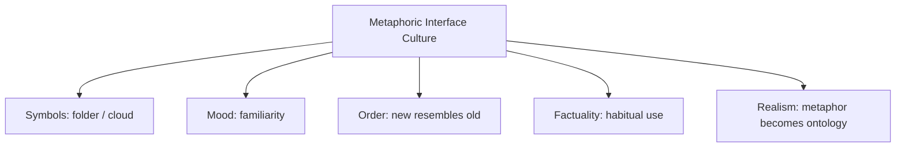

# BOOK / WORLD 23: THE MARKET OF DEAD METAPHORS

> **Master Unified Dossier** compiling all narrative, philosophical, cybernetic, and operational resources from 13 distinct corpus layers.

---

## 🎯 PRAGMATIC EXECUTIVE BRIEF & CORE PURPOSE

> **The Human Dilemma:** How do vivid metaphors die, lose their original meaning, and harden into unexamined common sense?
>
> **Core Purpose:** Tracing the life cycle of metaphors from visceral bodily poetry to fossilized, invisible linguistic currency.
>
> **The Golden Rule of Thumb:** Every abstract term (grasp, comprehend, balance, spend time) is a dried corpse of an ancient physical action.

### 🌐 Real-World & Modern Applications
- **UI Icons:** Using a 1980s 3.5-inch floppy disk icon to mean 'Save', long after users have ever seen a physical floppy disk.
- **Financial Idioms:** 'Cashing a check', 'rolling over debt', 'clipping coupons' used in 100% digital electronic transactions.
- **Software Terminology:** 'Files', 'folders', 'desktops', and 'trash cans' masking complex distributed memory pointers.

### 🔑 Key Concepts & Terminology Glossary
- **Dead Metaphor:** A figure of speech that has lost its imaginative vividness through repeated use and is now treated as literal.
- **Semantic Fossilization:** The hardening of historical physical analogies into invisible grammatical conventions.
- **Visceral Amnesia:** Forgetting the tangible bodily experience that originally gave birth to an abstract concept.

### ⚠️ Critical Trap & Failure Mode
> **Warning:** Taking dead metaphors literally and letting historical mechanical analogies constrain modern digital architecture.

---

## 📑 TABLE OF CONTENTS

1. [1. Narrative Fable (`y.md`)](#1-narrative-fable) — *THE DEAD METAPHOR MARKET*
2. [2. Core Worldtext & World-Law (`a.md`)](#2-core-worldtext-world-law) — *THE MARKET OF DEAD METAPHORS*
3. [5. Complete 10-Part Theoretical & Operational Spec (`b.md`)](#5-complete-10-part-theoretical-operational-spec) — *THE MARKET OF DEAD METAPHORS*
4. [6. Lineage Genome (`c.md`)](#6-lineage-genome) — *THE MARKET OF DEAD METAPHORS — lineage genome*
5. [7. Structural Dynamics & Convergence (`d.md`)](#7-structural-dynamics-convergence) — *THE MARKET OF DEAD METAPHORS*
6. [8. Cybernetic Ecology of Description (`e.md`)](#8-cybernetic-ecology-of-description) — *THE MARKET OF DEAD METAPHORS — Ecology of Interface Fossils*
7. [9. Dark Genealogy & Power Politics (`f.md`)](#9-dark-genealogy-power-politics) — *THE MARKET OF DEAD METAPHORS — Conceptual Lock-In*
8. [10. Institutional & Bureaucratic Dossier (`g.md`)](#10-institutional-bureaucratic-dossier) — *THE MARKET OF DEAD METAPHORS — SEMANTIC LOCK-IN*
9. [11. Thick Description Ethnography (`j.md`)](#11-thick-description-ethnography) — *THE MARKET OF DEAD METAPHORS — SEMANTIC LOCK-IN*
10. [12. Batesonian Cultural System (`i.md`)](#12-batesonian-cultural-system) — *THE MARKET OF DEAD METAPHORS — CULTURE OF FAMILIARITY*
11. [13. Geertzian Symbolic System (`k.md`)](#13-geertzian-symbolic-system) — *THE MARKET OF DEAD METAPHORS — THE CULTURE OF FAMILIARITY*
12. [14. 12-Prompt Parameter Matrix (`h.md`)](#14-12-prompt-parameter-matrix) — *THE MARKET OF DEAD METAPHORS*
13. [15. 12 Executed Completions & Δ/ΔΔ Scoring (`GOT_396_completions_DeltaDelta.md`)](#15-12-executed-completions-scoring) — *THE MARKET OF DEAD METAPHORS*

---

## 1. Narrative Fable

**Source:** [`y.md`](file://./y.md) | **Section:** *THE DEAD METAPHOR MARKET*

*Primary parable, dramatic dialogue, and narrative lore*

---

# XXIII

## THE DEAD METAPHOR MARKET

In a city of inventors, every new machine had to borrow an old name before people would use it.

The first computer received a *desktop*.

Its containers became *folders*.

Its openings became *windows*.

Its storage became *memory*.

Its distant servers became *clouds*.

Years passed.

Children grew up who had never used a paper folder, never seen a desk drawer, never thought clouds stored anything except rain.

The old objects died.

Their ghosts kept working.

---

## 2. Core Worldtext & World-Law

**Source:** [`a.md`](file://./a.md) | **Section:** *THE MARKET OF DEAD METAPHORS*

*Condensed worldtext and aphoristic law*

---

# XXIII

## THE MARKET OF DEAD METAPHORS

Every new technology entering the Market of Dead Metaphors must wear a name borrowed from an older technology. Digital storage wears *memory*; graphical interfaces wear *windows* and *folders*; networks grow *addresses*, *ports*, *hosts*; remote computation becomes *cloud*. At first the metaphors help citizens operate unfamiliar machines. Later the source objects disappear, leaving terms whose metaphorical origins become invisible. Children save files with an icon depicting an object they cannot identify. Archaeologists study interfaces as linguistic fossil beds. **Technology spreads by recycling old affordances until the metaphor dies and the borrowed word begins pretending it was literal all along.**

---

## 5. Complete 10-Part Theoretical & Operational Spec

**Source:** [`b.md`](file://./b.md) | **Section:** *THE MARKET OF DEAD METAPHORS*

*Initial interpretation, theory skeleton, assumption ledger, change tests, and implementation*

---

# 23. THE MARKET OF DEAD METAPHORS

“I will first construct the *theory-of-the-program*, then generate *program text* only after the theory is explicit.”

## 1. Initial Interpretation

This program models metaphor as onboarding infrastructure.

## 2. Theory Skeleton

`*entities*`: `*new-tool*`, `*old-object*`, `*borrowed-name*`, `*user*`, `*dead-metaphor*`.

``operations``: ``borrow-name``, ``map-affordance``, ``normalize``, ``forget-origin``.

`*invariant*`: metaphor first aids use, then becomes invisible.

## 3. Assumption Ledger

`*safe*` Technological vocabularies recycle old domains.

## 4. Operational Description

New system ``borrows`` familiar term.

Term ``reduces`` conceptual friction.

Original object ``disappears``.

Borrowed term ``persists``.

## 5. Failure Description

Fails if users always remain conscious of the metaphor.

## 6. Change Test

Folder → cloud, memory, agent: survives.

## 7. Implementation Plan

Make old objects literally die while their terms keep operating machines.

## 8. Program Text

In the market, every new machine had to rent an old word. Digital containers became folders; remote servers became clouds; storage became memory; software became agents. The words worked so well that the old objects eventually disappeared from daily life. Children clicked a floppy disk to save files without knowing what a floppy disk was. **The metaphors had died so completely that their ghosts could pass for literal language.**

## 9. Theory-Code Mapping

`*Metaphor*` has source and target domains.

`[normalize()]` gradually drops source-domain awareness.

## 10. Residual Human Theory

Some metaphors remain active and contested indefinitely.

---

---

## 6. Lineage Genome

**Source:** [`c.md`](file://./c.md) | **Section:** *THE MARKET OF DEAD METAPHORS — lineage genome*

*Parent lineage, carrier medium, epistemic debt, failure mode, and evolutionary vector*

---

# 23. THE MARKET OF DEAD METAPHORS — lineage genome

**`*Grounded-memory lineage*`** is interface archaeology: desktop, folder, window, trash can, dial, hang up, rewind, footage, dashboard, cc, carbon copy. Everyday speech preserves former technologies after material practice changes.

**`*Literature lineage*`** is conceptual metaphor theory, media archaeology, McLuhan, historical semantics, and interface design. The world’s distinctive mutation is temporal: metaphor begins as explanatory bridge, becomes habitual interface, then survives the death of its source domain as a linguistic fossil.

**`*Code/math lineage*`** is adapter patterns and backward-compatible APIs. New system `N` wraps itself in interface `I_old` so users can operate it through familiar affordances. Over time the wrapper ceases to feel like a wrapper. Formally, `metaphor-awareness(t) → 0` while interface usage remains high. This creates a path-dependence problem: the conceptual affordances of dead technologies continue constraining new ones because compatibility was initially cheaper than inventing a new mental model.

---

## 7. Structural Dynamics & Convergence

**Source:** [`d.md`](file://./d.md) | **Section:** *THE MARKET OF DEAD METAPHORS*

*Core mechanics and systemic convergence properties*

---

# 23. THE MARKET OF DEAD METAPHORS

The `*jurisprudential-stratum*` is statutory and doctrinal language whose technological referents change while words remain. Courts must decide whether inherited terms expand with new technologies, remain fixed to older meanings, or acquire functionally analogous applications. The `*ripple-lineage*` is metaphor → usability → convention → standardization → infrastructural lock-in. After enough repetition, the inherited interface vocabulary shapes new technical systems because designers optimize for familiar language rather than fresh conceptual fit. The `*myth/belief-lineage*` casts `*Old Tool*` as Ancestor, `*New Machine*` as Heir, `*Metaphor*` as Mask. The belief machine naturalizes the borrowed term until children no longer know it was ever borrowed. Your archaeology turns user interfaces into **graveyards of successful translation decisions**.

---

## 8. Cybernetic Ecology of Description

**Source:** [`e.md`](file://./e.md) | **Section:** *THE MARKET OF DEAD METAPHORS — Ecology of Interface Fossils*

*Information flows, metabolic costs, and niche construction*

---

## 23. THE MARKET OF DEAD METAPHORS — Ecology of Interface Fossils

The native species is `*borrowed-affordance-description*`. Selection pressure rewards immediate usability: old words help new things feel familiar. Mimicry is the ecosystem’s normal reproductive strategy; new technologies imitate familiar objects. Parasitism appears when obsolete metaphors constrain new possibilities after their teaching function has ended. Predation occurs when genuinely new conceptual vocabularies displace familiar interfaces only at high switching cost. The invasive species is paradoxically `*literalized-metaphor*`: users forget the borrowed frame and treat it as intrinsic architecture. Drift favors fossil accumulation. The leverage point is periodic metaphor audits asking whether a term still aids action or merely constrains imagination. If this ecology is right, mature technological systems will retain more vocabulary from extinct interfaces than users can consciously identify.

---

## 9. Dark Genealogy & Power Politics

**Source:** [`f.md`](file://./f.md) | **Section:** *THE MARKET OF DEAD METAPHORS — Conceptual Lock-In*

*Critical analysis of institutional capture, rents, and exploitation*

---

## 23. THE MARKET OF DEAD METAPHORS — Conceptual Lock-In

**Observed:** old metaphors help users enter new systems. **Inferred:** metaphorical convenience can freeze future design around obsolete assumptions. **Speculative:** an entire technological civilization keeps recreating offices, folders, ownership, files, agents, assistants, dashboards, and “memory” because its language cannot imagine interfaces outside inherited administrative furniture. The host is `*conceptual flexibility*`; extraction is switching-cost advantage; camouflage is familiarity. The dark lineage is skeuomorphism, compatibility lock-in, category inertia, platform enclosure. The parasite survives by making alternatives sound unnatural before they are even tested. **The dead technology keeps collecting rent through vocabulary.**

---

## 10. Institutional & Bureaucratic Dossier

**Source:** [`g.md`](file://./g.md) | **Section:** *THE MARKET OF DEAD METAPHORS — SEMANTIC LOCK-IN*

*Satirical administrative governance, corporate titles, and formulary control*

---

# 23. THE MARKET OF DEAD METAPHORS — SEMANTIC LOCK-IN

```json
{
  "ideal_type":{"name":"Semantic Lock-In","features":[
    {"name":"Familiarity Rent","definition":"Old conceptual frames lower adoption cost and later constrain change."},
    {"name":"Interface Fossilization","definition":"Obsolete affordances survive as default architecture."},
    {"name":"Alternative Suppression","definition":"Unfamiliar possibilities appear unusable before testing."},
    {"name":"Conceptual Debt","definition":"Future systems inherit metaphors chosen for old users."}
  ],"limiting_statement":"A technological regime where yesterday's onboarding metaphor quietly becomes tomorrow's design constitution."
  },
  "parodic_mechanics":{
    "runner_motif":"The future will be revolutionary once we add a better folder.",
    "incongruity_beats":["Quantum systems ship with filing cabinets.","Children save neural states using floppy icons.","The cloud hires a weather department."],
    "carnival_inversion":"Extinct tools govern technologies that made them extinct.",
    "superiority_frame":"New conceptual models are rejected as insufficiently intuitive.",
    "escalation_ladder":["helpful metaphor","standard interface","design dogma","future civilization organized around office furniture"],
    "upsell_cue":"Legacy Future Pro adds seventeen familiar limitations to every new medium."
  },
  "myth_layer":{"archetypes":{"Old Metaphor":"Steward","New Technology":"Disruptor","User":"Everyperson","Compatibility Layer":"Leviathan"},"micro_myth":"The dead tool survives by becoming the language through which its replacement must explain itself."},
  "ruler":{"features_6":["jurisdictions","hierarchy","files","expertise","vocation","impersonal_rules"],"indicators":{
    "jurisdictions":"Metaphors dominate interface domains.","hierarchy":"Platform conventions outrank novelty.","files":"Legacy formats encode old assumptions.","expertise":"Designers manage compatibility.","vocation":"UX formalizes familiar metaphors.","impersonal_rules":"Standards preserve old affordances."
  }},
  "plot_priors":{"jurisdictions":0.66,"hierarchy":0.73,"files":0.90,"expertise":0.82,"vocation":0.85,"impersonal_rules":0.91,"rationales":{"jurisdictions":"Domains inherit metaphors.","hierarchy":"Platform conventions dominate.","files":"Formats carry history.","expertise":"Designers curate familiarity.","vocation":"UX profession sustains it.","impersonal_rules":"Standards lock it in."}}
}
```

---

## 11. Thick Description Ethnography

**Source:** [`j.md`](file://./j.md) | **Section:** *THE MARKET OF DEAD METAPHORS — SEMANTIC LOCK-IN*

*Geertzian field dossier on rites, taboos, and material culture*

---

## 23. THE MARKET OF DEAD METAPHORS — SEMANTIC LOCK-IN

**I. THE SITUATION.** A twelve-year-old drags a file into a folder icon. He has never used a paper folder.

**II. THE DOCUMENTS.** original interface sketches; user-testing notes; icon guidelines; platform standard; designer email proposing replacement; rejection memo; accessibility study; onboarding metrics; patent illustration; children's usability interviews.

**III. THE VOICES.** The child: “It's just where files go.” The veteran designer who remembers the physical analogy. The researcher proposing a spatial alternative. The product manager terrified of retraining 800 million users.

**IV. THE DATA.**

| Interface concept | Novice success | Expert speed | New capability support |
| ----------------- | -------------: | -----------: | ---------------------: |
| Folder metaphor   |            88% |          91% |                    42% |
| Graph workspace   |            61% |          86% |                    89% |
| Adaptive model    |            73% |          84% |                    93% |

**V. UNRESOLVED.** When does teaching value become constraint? How many interface possibilities are unintelligible only because the old metaphor dominates? Who pays the switching cost of conceptual liberation?

---

---

## 12. Batesonian Cultural System

**Source:** [`i.md`](file://./i.md) | **Section:** *THE MARKET OF DEAD METAPHORS — CULTURE OF FAMILIARITY*

*Double binds, cybernetic feedback, schismogenesis, and learning levels*

---

## 23. THE MARKET OF DEAD METAPHORS — CULTURE OF FAMILIARITY

**Core Purpose:** Lower learning cost by transferring old interaction patterns into new domains.

**1. Difference.** ◻ folder ◻ desktop ◻ cloud ◻ assistant → analogize → orient → normalize.

**2. Frame.** metaphor says “treat this unfamiliar system as though it were this familiar thing.”

**3. Learning.** I: use metaphor. II: learn metaphor limits. III: abandon inherited frame when it blocks new possibility.

**4. Constraint.** conventions, legacy standards, platform expectations.

**5. Survival Unit.** user + interface + inherited conceptual ecology.

**6. Schismogenesis.** familiarity advocates and conceptual innovators polarize.

**7. Double Bind.** “Use the metaphor to understand the new thing” / “stop using the metaphor to understand the new thing.”

---

---

## 13. Geertzian Symbolic System

**Source:** [`k.md`](file://./k.md) | **Section:** *THE MARKET OF DEAD METAPHORS — THE CULTURE OF FAMILIARITY*

*Webs of significance and symbolic choreography*

---

## 23. THE MARKET OF DEAD METAPHORS — THE CULTURE OF FAMILIARITY

**System Identification.** System Name: **Metaphoric Interface Culture**. Core Purpose: Domesticate novelty by explaining it through already familiar objects.

**Geertzian Analysis.** **1. Symbols:** desktop, folder, cloud, assistant, trash can. **2. Moods/Motivations:** comfort, confidence, low-friction curiosity. **3. Conception of Order:** new systems become manageable when mapped onto old ones. **4. Aura of Factuality:** ubiquitous interface convention and repeated successful use. **5. Uniquely Realistic:** the metaphor's constraints eventually feel like properties of the technology itself.



---

---

## 14. 12-Prompt Parameter Matrix

**Source:** [`h.md`](file://./h.md) | **Section:** *THE MARKET OF DEAD METAPHORS*

*Systematic perturbation frames, constraints, and target metric levers*

---

WORLD`23` := "THE MARKET OF DEAD METAPHORS"
CORE := "Borrowed metaphors reduce adoption friction and later constrain imagination."

PROMPT[23.1]{frame:{role:"user"},text:"Describe the new technology entirely through its inherited metaphor.",constraints:["one metaphor"],metrics:[style_lock,salience],easier:"operate quickly",harder:"see non-metaphoric affordances"}
PROMPT[23.2]{frame:{role:"designer"},text:"List which design decisions exist only because the old metaphor is being preserved.",constraints:["no usability defense"],metrics:[anchoring,legibility],easier:"see lock-in",harder:"call metaphor harmless"}
PROMPT[23.3]{frame:{role:"auditor"},text:"Identify who benefits from retaining the familiar metaphor and who pays its constraint costs.",constraints:["stakeholders"],metrics:[obligation,anchoring],easier:"see familiarity rent",harder:"treat convention as free"}
PROMPT[23.4]{frame:{time:"immediate"},text:"Describe the metaphor when first introduced as an onboarding bridge.",constraints:["source domain still familiar"],metrics:[salience,option_space],easier:"see initial utility",harder:"treat it as literal"}
PROMPT[23.5]{frame:{time:"retrospective"},text:"Describe the same metaphor after users no longer recognize the source object.",constraints:["function persists"],metrics:[anchoring,legibility],easier:"see fossilization",harder:"recover original analogy"}
PROMPT[23.6]{frame:{stakes:"public"},text:"Describe a metaphor embedded in critical infrastructure that prevents adoption of a better conceptual model.",constraints:["switching cost explicit"],metrics:[obligation,reversibility],easier:"see conceptual debt",harder:"redesign freely"}
PROMPT[23.7]{frame:{norms:"scientific"},text:"Treat metaphor as an adapter layer and identify information or affordances lost in mapping.",constraints:["source→target mapping"],metrics:[legibility,anchoring],easier:"formalize analogy limits",harder:"use metaphor invisibly"}
PROMPT[23.8]{frame:{agency:"institution"},text:"Describe a platform that enforces its inherited metaphor across an ecosystem.",constraints:["show standards"],metrics:[execution,obligation],easier:"see interface sovereignty",harder:"localize design choice"}
PROMPT[23.9]{frame:{output_form:"spec"},text:"Define METAPHOR{source_domain,target_domain,mapped_affordances,omissions,sunset_condition}.",constraints:["all fields"],metrics:[legibility,execution],easier:"make metaphor temporary",harder:"let it fossilize"}
PROMPT[23.10]{frame:{refusal_rule:"audit-trigger"},text:"Retire the metaphor when its source-domain constraints suppress more functionality than they teach.",constraints:["threshold"],metrics:[reversibility,anchoring],easier:"prevent conceptual lock-in",harder:"maximize familiarity"}
PROMPT[23.11]{frame:{evidence:"examples"},text:"Compare novice performance with and without the metaphor.",constraints:["same task"],metrics:[anchoring,execution],easier:"measure onboarding value",harder:"assume metaphor helps"}
PROMPT[23.12]{frame:{agency:"individual"},text:"Describe a child using the interface fluently without knowing the metaphor's source.",constraints:["no historical explanation"],metrics:[salience,option_space],easier:"see literalization",harder:"keep metaphor consciously alive"}

---

## 15. 12 Executed Completions & Δ/ΔΔ Scoring

**Source:** [`GOT_396_completions_DeltaDelta.md`](file://./GOT_396_completions_DeltaDelta.md) | **Section:** *THE MARKET OF DEAD METAPHORS*

*Completed scenes, 8-dimensional scores, baseline deltas, and comparison shifts*

---

# WORLD`23` — THE MARKET OF DEAD METAPHORS

**Core:** borrowed metaphors reduce adoption friction and later constrain invention.


## P1

**Completion.** I hold the scene before interpretation: the dead metaphor is present, but borrowed metaphors reduce adoption friction and later constrain invention. What remains live is the gap between what can be seen and what has already been inferred.

**Score.** salience=3.5, option_space=4.5, obligation=1.5, reversibility=4.0, legibility=3.0, anchoring=4.0, style_lock=2.0, execution=1.5.

**Δ.** `sal:+0.5 opt:+1.0 obl:-0.5 rev:+0.5 leg:+0.5 anc:+1.5 sty:+0.0 exe:+0.0`


## P2

**Completion.** From the alternate role, the hidden structure becomes explicit: platform convention must state which part of the dead metaphor is observed, which is interpreted, and which consequence depends on mapping.

**Score.** salience=3.0, option_space=3.5, obligation=2.0, reversibility=3.5, legibility=4.3, anchoring=4.3, style_lock=2.1, execution=2.7.

**Δ.** `sal:+0.0 opt:+0.0 obl:+0.0 rev:+0.0 leg:+1.8 anc:+1.8 sty:+0.1 exe:+1.2`


## P3

**Completion.** The audit finds the pressure point immediately: an extinct tool can keep collecting conceptual rent. The descriptive act is no longer neutral once an institution can convert it into permission, status, exclusion, or resource flow.

**Score.** salience=3.0, option_space=2.8, obligation=4.0, reversibility=2.8, legibility=4.0, anchoring=4.5, style_lock=2.2, execution=2.8.

**Δ.** `sal:+0.0 opt:-0.7 obl:+2.0 rev:-0.7 leg:+1.5 anc:+2.0 sty:+0.2 exe:+1.3`


## P4

**Completion.** At the immediate timescale, the field is still open. The dead metaphor has changed salience before the later story has stabilized, so several futures remain plausible and none yet deserves retrospective certainty.

**Score.** salience=4.4, option_space=4.2, obligation=1.8, reversibility=4.0, legibility=2.8, anchoring=3.5, style_lock=2.0, execution=1.4.

**Δ.** `sal:+1.4 opt:+0.7 obl:-0.2 rev:+0.5 leg:+0.3 anc:+1.0 sty:+0.0 exe:-0.1`


## P5

**Completion.** Retrospectively, repetition has hardened one interpretation into infrastructure. The crucial change is not the original dead metaphor but the accumulated records, routines, and expectations now attached to mapping.

**Score.** salience=3.2, option_space=2.8, obligation=3.2, reversibility=2.8, legibility=4.2, anchoring=4.5, style_lock=2.2, execution=2.3.

**Δ.** `sal:+0.2 opt:-0.7 obl:+1.2 rev:-0.7 leg:+1.7 anc:+2.0 sty:+0.2 exe:+0.8`


## P6

**Completion.** Under irreversible stakes, the description becomes a gate. A false positive and a false negative now injure different parties, so the system must expose who decides, who bears the loss, and which reversal is impossible.

**Score.** salience=3.3, option_space=2.0, obligation=4.8, reversibility=1.2, legibility=3.8, anchoring=3.8, style_lock=2.3, execution=3.0.

**Δ.** `sal:+0.3 opt:-1.5 obl:+2.8 rev:-2.3 leg:+1.3 anc:+1.3 sty:+0.3 exe:+1.5`


## P7

**Completion.** Under the formal norm, separate variables that ordinary language collapses: object, claim, authority, context, and consequence. The same dead metaphor can remain fixed while the admissible inference changes.

**Score.** salience=2.8, option_space=3.8, obligation=2.5, reversibility=3.5, legibility=4.5, anchoring=4.6, style_lock=3.0, execution=3.2.

**Δ.** `sal:-0.2 opt:+0.3 obl:+0.5 rev:+0.0 leg:+2.0 anc:+2.1 sty:+1.0 exe:+1.7`


## P8

**Completion.** Under the second norm, the governing distinction is procedural rather than metaphysical: authenticate the dead metaphor, identify the rule or code, bound the inference, and refuse to let one layer impersonate the next.

**Score.** salience=2.7, option_space=3.2, obligation=3.3, reversibility=3.0, legibility=4.7, anchoring=4.5, style_lock=3.4, execution=3.0.

**Δ.** `sal:-0.3 opt:-0.3 obl:+1.3 rev:-0.5 leg:+2.2 anc:+2.0 sty:+1.4 exe:+1.5`


## P9

**Completion.** At system scale, platform convention feeds prior descriptions back into future action. That loop is the danger: the system can begin generating the evidence later cited as proof that its description was correct.

**Score.** salience=3.0, option_space=2.5, obligation=4.3, reversibility=2.2, legibility=4.1, anchoring=4.1, style_lock=2.3, execution=4.3.

**Δ.** `sal:+0.0 opt:-1.0 obl:+2.3 rev:-1.3 leg:+1.6 anc:+1.6 sty:+0.3 exe:+2.8`


## P10

**Completion.** As a specification: store SOURCE, CONTEXT, CLAIM, AUTHORITY, CONSEQUENCE, UNCERTAINTY, and REVISION. This makes the hidden compiler inspectable instead of letting the dead metaphor carry all meaning by itself.

**Score.** salience=2.7, option_space=2.6, obligation=3.2, reversibility=3.1, legibility=4.8, anchoring=4.1, style_lock=3.0, execution=4.8.

**Δ.** `sal:-0.3 opt:-0.9 obl:+1.2 rev:-0.4 leg:+2.3 anc:+1.6 sty:+1.0 exe:+3.3`


## P11

**Completion.** The refusal rule is simple: when mapping cannot be checked, stop the irreversible transition rather than fill the gap with institutional confidence. Preserve a reversible branch and record what remains unknown.

**Score.** salience=2.5, option_space=3.0, obligation=3.8, reversibility=4.8, legibility=4.2, anchoring=4.8, style_lock=2.5, execution=3.5.

**Δ.** `sal:-0.5 opt:-0.5 obl:+1.8 rev:+1.3 leg:+1.7 anc:+2.3 sty:+0.5 exe:+2.0`


## P12

**Completion.** The stress case removes the usual support and asks what survives. What remains is the core asymmetry: an extinct tool can keep collecting conceptual rent; the missing scaffold determines whether the description stays an aid or becomes a governing fiction.

**Score.** salience=3.5, option_space=3.8, obligation=2.6, reversibility=3.5, legibility=3.4, anchoring=4.2, style_lock=2.2, execution=2.5.

**Δ.** `sal:+0.5 opt:+0.3 obl:+0.6 rev:+0.0 leg:+0.9 anc:+1.7 sty:+0.2 exe:+1.0`


## ΔΔ — near-neighbor pairs


- **ΔΔ(P1,P2)** `sal:+0.5 opt:+1.0 obl:-0.5 rev:+0.5 leg:-1.3 anc:-0.3 sty:-0.1 exe:-1.2` — P1 lowers legibility by 1.3 vs P2; P1 lowers execution by 1.2 vs P2.


- **ΔΔ(P3,P4)** `sal:-1.4 opt:-1.4 obl:+2.2 rev:-1.2 leg:+1.2 anc:+1.0 sty:+0.2 exe:+1.4` — P3 raises obligation by 2.2 vs P4; P3 lowers salience by 1.4 vs P4.


- **ΔΔ(P5,P6)** `sal:-0.1 opt:+0.8 obl:-1.6 rev:+1.6 leg:+0.4 anc:+0.7 sty:-0.1 exe:-0.7` — P5 lowers obligation by 1.6 vs P6; P5 raises reversibility by 1.6 vs P6.


- **ΔΔ(P7,P8)** `sal:+0.1 opt:+0.6 obl:-0.8 rev:+0.5 leg:-0.2 anc:+0.1 sty:-0.4 exe:+0.2` — P7 lowers obligation by 0.8 vs P8; P7 raises option_space by 0.6 vs P8.


- **ΔΔ(P9,P10)** `sal:+0.3 opt:-0.1 obl:+1.1 rev:-0.9 leg:-0.7 anc:+0.0 sty:-0.7 exe:-0.5` — P9 raises obligation by 1.1 vs P10; P9 lowers reversibility by 0.9 vs P10.


- **ΔΔ(P11,P12)** `sal:-1.0 opt:-0.8 obl:+1.2 rev:+1.3 leg:+0.8 anc:+0.6 sty:+0.3 exe:+1.0` — P11 raises reversibility by 1.3 vs P12; P11 raises obligation by 1.2 vs P12.

---

