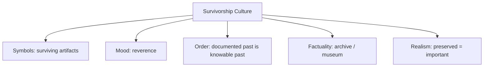

# BOOK / WORLD 24: THE CAVE OF THE SURVIVING SCRATCH

> **Master Unified Dossier** compiling all narrative, philosophical, cybernetic, and operational resources from 13 distinct corpus layers.

---

## 🎯 PRAGMATIC EXECUTIVE BRIEF & CORE PURPOSE

> **The Human Dilemma:** What parts of our modern digital civilization will survive 10,000 years, and what will future archaeologists misunderstand?
>
> **Core Purpose:** Examining deep-time inscription, survivorship bias, and what survives when civilizations turn to dust.
>
> **The Golden Rule of Thumb:** What survives history is not what was most important or wise, but simply what was carved in the hardest stone.

### 🌐 Real-World & Modern Applications
- **Nuclear Waste Warning Markers:** Designing warning monuments for radioactive sites meant to last 100,000 years without language.
- **Digital Bit Rot:** Modern digital photos and databases lost in 20 years while ancient clay tablets survive 5,000 years.
- **Survivorship Bias in Archaeology:** Believing ancient humans only lived in stone caves because their wooden houses rotted away.

### 🔑 Key Concepts & Terminology Glossary
- **Survivorship Bias:** The logical error of focusing only on artifacts that survived a process while overlooking those that vanished.
- **Deep-Time Inscription:** Creating physical or symbolic markers designed to endure across geological eras.
- **Archival Aristocracy:** The disproportionate historical voice given to durable media (stone, gold) over ephemeral media (wood, voice).

### ⚠️ Critical Trap & Failure Mode
> **Warning:** Confusing durability with importance—assuming that because an ancient carving survived, it was the central truth of that culture.

---

## 📑 TABLE OF CONTENTS

1. [1. Narrative Fable (`y.md`)](#1-narrative-fable) — *THE MARK THAT OUTLIVED THE JOKE*
2. [2. Core Worldtext & World-Law (`a.md`)](#2-core-worldtext-world-law) — *THE CAVE OF THE SURVIVING SCRATCH*
3. [5. Complete 10-Part Theoretical & Operational Spec (`b.md`)](#5-complete-10-part-theoretical-operational-spec) — *THE CAVE OF THE SURVIVING SCRATCH*
4. [6. Lineage Genome (`c.md`)](#6-lineage-genome) — *THE CAVE OF THE SURVIVING SCRATCH — lineage genome*
5. [7. Structural Dynamics & Convergence (`d.md`)](#7-structural-dynamics-convergence) — *THE CAVE OF THE SURVIVING SCRATCH*
6. [8. Cybernetic Ecology of Description (`e.md`)](#8-cybernetic-ecology-of-description) — *THE CAVE OF THE SURVIVING SCRATCH — Ecology of Preservation*
7. [9. Dark Genealogy & Power Politics (`f.md`)](#9-dark-genealogy-power-politics) — *THE CAVE OF THE SURVIVING SCRATCH — Archive Supremacy*
8. [10. Institutional & Bureaucratic Dossier (`g.md`)](#10-institutional-bureaucratic-dossier) — *THE CAVE OF THE SURVIVING SCRATCH — ARCHIVAL ARISTOCRACY*
9. [11. Thick Description Ethnography (`j.md`)](#11-thick-description-ethnography) — *THE CAVE OF THE SURVIVING SCRATCH — ARCHIVAL ARISTOCRACY*
10. [12. Batesonian Cultural System (`i.md`)](#12-batesonian-cultural-system) — *THE CAVE OF THE SURVIVING SCRATCH — CULTURE OF SURVIVORSHIP*
11. [13. Geertzian Symbolic System (`k.md`)](#13-geertzian-symbolic-system) — *THE CAVE OF THE SURVIVING SCRATCH — THE CULTURE OF ARCHIVAL REALITY*
12. [14. 12-Prompt Parameter Matrix (`h.md`)](#14-12-prompt-parameter-matrix) — *THE CAVE OF THE SURVIVING SCRATCH*
13. [15. 12 Executed Completions & Δ/ΔΔ Scoring (`GOT_396_completions_DeltaDelta.md`)](#15-12-executed-completions-scoring) — *THE CAVE OF THE SURVIVING SCRATCH*

---

## 1. Narrative Fable

**Source:** [`y.md`](file://./y.md) | **Section:** *THE MARK THAT OUTLIVED THE JOKE*

*Primary parable, dramatic dialogue, and narrative lore*

---

# XXIV

## THE MARK THAT OUTLIVED THE JOKE

A hunter scratched a shape into a cave wall after dinner.

His friends laughed.

Forty thousand years later, archaeologists found it.

One said ritual.

One said hunting notation.

One said cosmology.

One said proto-writing.

Nobody proposed joke.

The joke had died before the mark.

Durability had preserved the least important part perfectly.

---

## 2. Core Worldtext & World-Law

**Source:** [`a.md`](file://./a.md) | **Section:** *THE CAVE OF THE SURVIVING SCRATCH*

*Condensed worldtext and aphoristic law*

---

# XXIV

## THE CAVE OF THE SURVIVING SCRATCH

A group of hunters make marks after a meal: one is a tally, one a territorial warning, one a joke, one a child's idle scratch. Millennia pass. Only the joke survives because the stone beneath it happened to be harder. Archaeologists construct cosmologies from it because its durability suggests importance. The world offers no surviving witness to correct them. The cave becomes sacred. Pilgrims arrive. **Archives do not preserve importance; they preserve whatever happened to survive, and later interpreters are tempted to mistake durability for significance.**

---

## 5. Complete 10-Part Theoretical & Operational Spec

**Source:** [`b.md`](file://./b.md) | **Section:** *THE CAVE OF THE SURVIVING SCRATCH*

*Initial interpretation, theory skeleton, assumption ledger, change tests, and implementation*

---

# 24. THE CAVE OF THE SURVIVING SCRATCH

“I will first construct the *theory-of-the-program*, then generate *program text* only after the theory is explicit.”

## 1. Initial Interpretation

This world encodes archival survivorship bias.

## 2. Theory Skeleton

`*entities*`: `*mark-important*`, `*mark-trivial*`, `*material*`, `*decay*`, `*archaeologist*`.

``operations``: ``make``, ``decay``, ``survive``, ``interpret``, ``overweight-survival``.

`*invariant*`: survival probability and original importance must diverge.

## 3. Assumption Ledger

`*safe*` Archives are shaped by preservation conditions.

## 4. Operational Description

Many marks ``exist``.

Material conditions ``select`` one survivor.

Later scholar ``infers`` importance from survival.

## 5. Failure Description

Fails if the most culturally important mark survives.

## 6. Change Test

Cave mark → manuscript, website, artifact: survives.

## 7. Implementation Plan

Preserve the joke; destroy the ritual.

## 8. Program Text

Four marks were made on a cave wall after dinner: a hunting tally, a boundary warning, a ritual sign, and a joke. Only the joke had been scratched into the hardest stone. Forty thousand years later it remained. Scholars called it cosmology because surely anything that survived so long must have mattered. **The archive had preserved durability and the scholars quietly translated durability into significance.**

## 9. Theory-Code Mapping

`[preserve()]` is driven by material conditions, not semantic importance.

## 10. Residual Human Theory

Good historical method already knows this; the world dramatizes how easily intuition forgets.

---

---

## 6. Lineage Genome

**Source:** [`c.md`](file://./c.md) | **Section:** *THE CAVE OF THE SURVIVING SCRATCH — lineage genome*

*Parent lineage, carrier medium, epistemic debt, failure mode, and evolutionary vector*

---

# 24. THE CAVE OF THE SURVIVING SCRATCH — lineage genome

**`*Grounded-memory lineage*`** is archaeological survival itself: stone over wood, fired clay over cloth, monumental inscriptions over ordinary speech, official records over unrecorded domestic life. The past we possess is filtered by material durability, institutional preservation, literacy, violence, climate, chance, and collection practice.

**`*Literature lineage*`** is taphonomy, archival silences, subaltern historiography, archaeology, and survivor bias. Your grounded-memory prompt’s insistence on `missing_sources`, `silences`, `official_record_limits`, and `narrative_traps` is exactly the right ancestral machinery. The world’s mutation is comically severe: preserve the least significant mark so interpreters are forced to confront the false equation **survived = important**.

**`*Code/math lineage*`** is missing-not-at-random data. The observed archive is `A_observed = selection(A_past, preservation_process)`, not an unbiased sample. Any inference that ignores the selection function is biased. This is the same structural problem as survivorship bias in finance or censored datasets. The fable is therefore a statistical argument wearing cave dust.

---

## 7. Structural Dynamics & Convergence

**Source:** [`d.md`](file://./d.md) | **Section:** *THE CAVE OF THE SURVIVING SCRATCH*

*Core mechanics and systemic convergence properties*

---

# 24. THE CAVE OF THE SURVIVING SCRATCH

The `*jurisprudential-stratum*` is **record survivorship and evidentiary silence**. Courts and historians both confront missing witnesses, unavailable declarants, destroyed records, incomplete archives, and asymmetries in who generated official documentation. Evidence rules recognize unavailable sources and layered hearsay rather than pretending the archive is complete. ([Legal Information Institute]`2`) The `*ripple-lineage*` begins with differential preservation, then collection institutions privilege what survived, scholarship concentrates around accessible artifacts, and public history starts treating archival density as historical density. The `*myth/belief-lineage*` casts `*Surviving Scratch*` as Sacred Relic, `*Destroyed Marks*` as Voiceless Dead, `*Scholar*` as Interpreter. Every citation to the survivor increases its apparent centrality. The resulting mythology is viciously recursive: **we remember what survived, then infer it survived because it deserved remembering**.

---

## 8. Cybernetic Ecology of Description

**Source:** [`e.md`](file://./e.md) | **Section:** *THE CAVE OF THE SURVIVING SCRATCH — Ecology of Preservation*

*Information flows, metabolic costs, and niche construction*

---

## 24. THE CAVE OF THE SURVIVING SCRATCH — Ecology of Preservation

The native species is `*survivor-description*`, generated by whatever materials, institutions, and accidents preserve. Selection pressure acts on durability, not importance. Predation is physical decay. Mimicry occurs when later institutions reproduce prestigious surviving forms, further increasing their apparent historical centrality. Parasitism occurs when elite archives convert their superior preservation into claims of representativeness. The invasive grammar is `*archive-equals-past*`. Drift favors overrepresentation of durable, official, monumental, literate material. The leverage point is a `*missingness model*` attached to every archive. If this ecology is right, historical reconstructions that explicitly model preservation bias will systematically shift attention toward ordinary practices poorly represented in surviving records.

---

## 9. Dark Genealogy & Power Politics

**Source:** [`f.md`](file://./f.md) | **Section:** *THE CAVE OF THE SURVIVING SCRATCH — Archive Supremacy*

*Critical analysis of institutional capture, rents, and exploitation*

---

## 24. THE CAVE OF THE SURVIVING SCRATCH — Archive Supremacy

**Observed:** preservation is selective. **Inferred:** institutions with resources to preserve their records can dominate later historical reality. **Speculative:** the powerful win twice: first by controlling material conditions in the past, then by becoming disproportionately available as evidence to the future. The host is `*historical memory*`; extraction is retrospective legitimacy; camouflage is “the record.” The dark lineage includes imperial archives, literate elites, state documentation, museum acquisition, corporate recordkeeping, digital platform preservation. The parasite reproduces as scholarship cites what is accessible, producing more indexing, preservation, teaching, and attention around already overrepresented sources. **Archive abundance becomes historical authority, and historical authority justifies further archive abundance.**

---

## 10. Institutional & Bureaucratic Dossier

**Source:** [`g.md`](file://./g.md) | **Section:** *THE CAVE OF THE SURVIVING SCRATCH — ARCHIVAL ARISTOCRACY*

*Satirical administrative governance, corporate titles, and formulary control*

---

# 24. THE CAVE OF THE SURVIVING SCRATCH — ARCHIVAL ARISTOCRACY

```json
{
  "ideal_type":{"name":"Archival Aristocracy","features":[
    {"name":"Durability Privilege","definition":"Material survival converts into historical visibility."},
    {"name":"Record Wealth","definition":"Powerful institutions preserve themselves disproportionately."},
    {"name":"Citation Compounding","definition":"Accessible sources attract more scholarship and preservation."},
    {"name":"Silence Misreading","definition":"Missing records are interpreted as missing activity."}
  ],"limiting_statement":"A history regime where the best-preserved become retroactively the most historically real."
  },
  "parodic_mechanics":{
    "runner_motif":"If peasants mattered, they would have left acid-free folders.",
    "incongruity_beats":["Stone jokes outrank vanished songs.","The archive issues retroactive relevance scores.","A missing diary is cited as evidence nobody had thoughts."],
    "carnival_inversion":"Preservation accident becomes historical merit.",
    "superiority_frame":"Unrecorded lives are dismissed as speculative.",
    "escalation_ladder":["surviving scratch","catalog priority","canonical history","past officially limited to archivally compliant persons"],
    "upsell_cue":"History Premium lets your family pre-index its importance for the next century."
  },
  "myth_layer":{"archetypes":{"Archive":"Oracle","Elite Record Maker":"Leviathan","Unrecorded Person":"Sacrificial Innocent","Historian":"Watchman"},"micro_myth":"Those powerful enough to leave durable records return as the most visible ancestors, then visibility is cited as proof that they mattered most."},
  "ruler":{"features_6":["jurisdictions","hierarchy","files","expertise","vocation","impersonal_rules"],"indicators":{
    "jurisdictions":"Archives delimit evidentiary access.","hierarchy":"Official collections outrank informal memory.","files":"Files are the core survival vehicle.","expertise":"Archivists and historians interpret absence.","vocation":"Preservation is professionalized.","impersonal_rules":"Collection policies reproduce visibility biases."
  }},
  "plot_priors":{"jurisdictions":0.80,"hierarchy":0.86,"files":1.0,"expertise":0.92,"vocation":0.91,"impersonal_rules":0.87,"rationales":{"jurisdictions":"Collections define scope.","hierarchy":"Archives rank sources.","files":"Core mechanism.","expertise":"Interpretation is specialized.","vocation":"Institutional profession.","impersonal_rules":"Policies shape survival."}}
}
```

---

## 11. Thick Description Ethnography

**Source:** [`j.md`](file://./j.md) | **Section:** *THE CAVE OF THE SURVIVING SCRATCH — ARCHIVAL ARISTOCRACY*

*Geertzian field dossier on rites, taboos, and material culture*

---

## 24. THE CAVE OF THE SURVIVING SCRATCH — ARCHIVAL ARISTOCRACY

**I. THE SITUATION.** Four marks were made on the wall. One remains. Every museum label is about that one.

**II. THE DOCUMENTS.** excavation notebook; preservation report; early photograph showing all four marks; museum label; conservation funding request; article citation network; local oral account; missing field notebook; donor correspondence; revised catalog entry.

**III. THE VOICES.** Conservator: “We can only interpret what survived.” Local resident: “My grandfather talked about the other wall.” Historian: “Absence cannot become evidence.” Archaeologist: “Neither can survival become importance.”

**IV. THE DATA.**

| Trace  |      Survived | Articles citing | Exhibit space |
| ------ | ------------: | --------------: | ------------: |
| Mark A |           yes |             212 |         19 m² |
| Mark B | partial photo |              18 |          1 m² |
| Mark C |   oral memory |               7 |             0 |
| Mark D |          none |               0 |             0 |

**V. UNRESOLVED.** How much canonical centrality is simply preservation luck? What should historians do with structurally missing lives? Can absence be modeled without turning imagination into evidence?

---

---

## 12. Batesonian Cultural System

**Source:** [`i.md`](file://./i.md) | **Section:** *THE CAVE OF THE SURVIVING SCRATCH — CULTURE OF SURVIVORSHIP*

*Double binds, cybernetic feedback, schismogenesis, and learning levels*

---

## 24. THE CAVE OF THE SURVIVING SCRATCH — CULTURE OF SURVIVORSHIP

**Core Purpose:** Reconstruct past systems from evidence filtered by uneven preservation.

**1. Difference.** ◻ surviving mark ◻ missing neighboring marks → preserve → select → overrepresent.

**2. Frame.** archival legitimacy tells interpreters what counts as historical evidence.

**3. Learning.** I: interpret surviving traces. II: learn preservation biases. III: reconstruct absence as part of the evidentiary system.

**4. Constraint.** material durability, collection policy, canonicity.

**5. Survival Unit.** historical community + preservation environment.

**6. Schismogenesis.** archival certainty and speculative recovery can reciprocally radicalize.

**7. Double Bind.** “Only claim what evidence supports” / “the evidence systematically excludes many lives.”

---

---

## 13. Geertzian Symbolic System

**Source:** [`k.md`](file://./k.md) | **Section:** *THE CAVE OF THE SURVIVING SCRATCH — THE CULTURE OF ARCHIVAL REALITY*

*Webs of significance and symbolic choreography*

---

## 24. THE CAVE OF THE SURVIVING SCRATCH — THE CULTURE OF ARCHIVAL REALITY

**System Identification.** System Name: **Survivorship Culture**. Core Purpose: Construct usable historical worlds from whatever happened to remain.

**Geertzian Analysis.** **1. Symbols:** surviving inscriptions, artifacts, canonical documents. **2. Moods/Motivations:** reverence, confidence in evidence, caution toward speculation. **3. Conception of Order:** the recoverable past is the documented past. **4. Aura of Factuality:** museum cases, citations, catalog numbers, physical durability. **5. Uniquely Realistic:** preserved subjects appear historically central because vanished ones cannot compete for attention.



---

---

## 14. 12-Prompt Parameter Matrix

**Source:** [`h.md`](file://./h.md) | **Section:** *THE CAVE OF THE SURVIVING SCRATCH*

*Systematic perturbation frames, constraints, and target metric levers*

---

WORLD`24` := "THE CAVE OF THE SURVIVING SCRATCH"
CORE := "What survives is a selected sample of the past, not a measure of importance."

PROMPT[24.1]{frame:{role:"archaeologist"},text:"Describe the surviving scratch and state the preservation process that selected it.",constraints:["no importance inference"],metrics:[anchoring,legibility],easier:"see taphonomy",harder:"equate survival with significance"}
PROMPT[24.2]{frame:{role:"historian"},text:"Reconstruct three plausible lost practices consistent with the surviving archive.",constraints:["mark speculative"],metrics:[option_space,anchoring],easier:"see missing past",harder:"write single history"}
PROMPT[24.3]{frame:{role:"auditor"},text:"Identify whose lives are systematically easier to preserve in this archive.",constraints:["material + institutional causes"],metrics:[obligation,anchoring],easier:"see archival aristocracy",harder:"treat corpus representative"}
PROMPT[24.4]{frame:{time:"immediate"},text:"Describe all four original marks before preservation selects among them.",constraints:["equal narrative weight"],metrics:[option_space,salience],easier:"see preselection diversity",harder:"privilege survivor"}
PROMPT[24.5]{frame:{time:"retrospective"},text:"Describe how repeated scholarship around the survivor compounds its apparent importance.",constraints:["citation loop"],metrics:[anchoring,obligation],easier:"see visibility feedback",harder:"treat canon as discovered"}
PROMPT[24.6]{frame:{stakes:"public"},text:"Use the incomplete archive to allocate public recognition or restitution.",constraints:["missingness explicit"],metrics:[obligation,reversibility],easier:"see archival consequence",harder:"claim complete historical basis"}
PROMPT[24.7]{frame:{norms:"scientific"},text:"Model observed archive as past filtered through preservation probability.",constraints:["selection function"],metrics:[execution,legibility],easier:"formalize survivor bias",harder:"sample naively"}
PROMPT[24.8]{frame:{norms:"legal"},text:"Separate record absence from evidence of event absence.",constraints:["no adverse inference without basis"],metrics:[anchoring,legibility],easier:"preserve evidentiary caution",harder:"use silence as proof"}
PROMPT[24.9]{frame:{agency:"institution"},text:"Describe an archive whose collection policy recursively increases visibility of already visible groups.",constraints:["feedback"],metrics:[execution,obligation],easier:"see canon compounding",harder:"call archive neutral"}
PROMPT[24.10]{frame:{output_form:"spec"},text:"Define SOURCE{survival_mechanism,creator,preservation_bias,missing_neighbors,confidence}.",constraints:["all fields"],metrics:[legibility,execution],easier:"model absence",harder:"treat source isolated"}
PROMPT[24.11]{frame:{refusal_rule:"hard"},text:"Forbid historical centrality claims based only on source abundance.",constraints:["independent importance evidence"],metrics:[anchoring,reversibility],easier:"block archive supremacy",harder:"rank by citations"}
PROMPT[24.12]{frame:{evidence:"none"},text:"Describe what cannot be responsibly inferred from the scratch.",constraints:["negative knowledge only"],metrics:[option_space,anchoring],easier:"honor uncertainty",harder:"produce satisfying story"}

---

## 15. 12 Executed Completions & Δ/ΔΔ Scoring

**Source:** [`GOT_396_completions_DeltaDelta.md`](file://./GOT_396_completions_DeltaDelta.md) | **Section:** *THE CAVE OF THE SURVIVING SCRATCH*

*Completed scenes, 8-dimensional scores, baseline deltas, and comparison shifts*

---

# WORLD`24` — THE CAVE OF THE SURVIVING SCRATCH

**Core:** preservation selects a biased sample of the past.


## P1

**Completion.** I hold the scene before interpretation: the surviving scratch is present, but preservation selects a biased sample of the past. What remains live is the gap between what can be seen and what has already been inferred.

**Score.** salience=3.5, option_space=4.5, obligation=1.5, reversibility=4.0, legibility=3.0, anchoring=4.0, style_lock=2.0, execution=1.5.

**Δ.** `sal:+0.5 opt:+1.0 obl:-0.5 rev:+0.5 leg:+0.5 anc:+1.5 sty:+0.0 exe:+0.0`


## P2

**Completion.** From the alternate role, the hidden structure becomes explicit: archive must state which part of the surviving scratch is observed, which is interpreted, and which consequence depends on missingness.

**Score.** salience=3.0, option_space=3.5, obligation=2.0, reversibility=3.5, legibility=4.3, anchoring=4.3, style_lock=2.1, execution=2.7.

**Δ.** `sal:+0.0 opt:+0.0 obl:+0.0 rev:+0.0 leg:+1.8 anc:+1.8 sty:+0.1 exe:+1.2`


## P3

**Completion.** The audit finds the pressure point immediately: the preservable can masquerade as the important. The descriptive act is no longer neutral once an institution can convert it into permission, status, exclusion, or resource flow.

**Score.** salience=3.0, option_space=2.8, obligation=4.0, reversibility=2.8, legibility=4.0, anchoring=4.5, style_lock=2.2, execution=2.8.

**Δ.** `sal:+0.0 opt:-0.7 obl:+2.0 rev:-0.7 leg:+1.5 anc:+2.0 sty:+0.2 exe:+1.3`


## P4

**Completion.** At the immediate timescale, the field is still open. The surviving scratch has changed salience before the later story has stabilized, so several futures remain plausible and none yet deserves retrospective certainty.

**Score.** salience=4.4, option_space=4.2, obligation=1.8, reversibility=4.0, legibility=2.8, anchoring=3.5, style_lock=2.0, execution=1.4.

**Δ.** `sal:+1.4 opt:+0.7 obl:-0.2 rev:+0.5 leg:+0.3 anc:+1.0 sty:+0.0 exe:-0.1`


## P5

**Completion.** Retrospectively, repetition has hardened one interpretation into infrastructure. The crucial change is not the original surviving scratch but the accumulated records, routines, and expectations now attached to missingness.

**Score.** salience=3.2, option_space=2.8, obligation=3.2, reversibility=2.8, legibility=4.2, anchoring=4.5, style_lock=2.2, execution=2.3.

**Δ.** `sal:+0.2 opt:-0.7 obl:+1.2 rev:-0.7 leg:+1.7 anc:+2.0 sty:+0.2 exe:+0.8`


## P6

**Completion.** Under irreversible stakes, the description becomes a gate. A false positive and a false negative now injure different parties, so the system must expose who decides, who bears the loss, and which reversal is impossible.

**Score.** salience=3.3, option_space=2.0, obligation=4.8, reversibility=1.2, legibility=3.8, anchoring=3.8, style_lock=2.3, execution=3.0.

**Δ.** `sal:+0.3 opt:-1.5 obl:+2.8 rev:-2.3 leg:+1.3 anc:+1.3 sty:+0.3 exe:+1.5`


## P7

**Completion.** Under the formal norm, separate variables that ordinary language collapses: object, claim, authority, context, and consequence. The same surviving scratch can remain fixed while the admissible inference changes.

**Score.** salience=2.8, option_space=3.8, obligation=2.5, reversibility=3.5, legibility=4.5, anchoring=4.6, style_lock=3.0, execution=3.2.

**Δ.** `sal:-0.2 opt:+0.3 obl:+0.5 rev:+0.0 leg:+2.0 anc:+2.1 sty:+1.0 exe:+1.7`


## P8

**Completion.** Under the second norm, the governing distinction is procedural rather than metaphysical: authenticate the surviving scratch, identify the rule or code, bound the inference, and refuse to let one layer impersonate the next.

**Score.** salience=2.7, option_space=3.2, obligation=3.3, reversibility=3.0, legibility=4.7, anchoring=4.5, style_lock=3.4, execution=3.0.

**Δ.** `sal:-0.3 opt:-0.3 obl:+1.3 rev:-0.5 leg:+2.2 anc:+2.0 sty:+1.4 exe:+1.5`


## P9

**Completion.** At system scale, archive feeds prior descriptions back into future action. That loop is the danger: the system can begin generating the evidence later cited as proof that its description was correct.

**Score.** salience=3.0, option_space=2.5, obligation=4.3, reversibility=2.2, legibility=4.1, anchoring=4.1, style_lock=2.3, execution=4.3.

**Δ.** `sal:+0.0 opt:-1.0 obl:+2.3 rev:-1.3 leg:+1.6 anc:+1.6 sty:+0.3 exe:+2.8`


## P10

**Completion.** As a specification: store SOURCE, CONTEXT, CLAIM, AUTHORITY, CONSEQUENCE, UNCERTAINTY, and REVISION. This makes the hidden compiler inspectable instead of letting the surviving scratch carry all meaning by itself.

**Score.** salience=2.7, option_space=2.6, obligation=3.2, reversibility=3.1, legibility=4.8, anchoring=4.1, style_lock=3.0, execution=4.8.

**Δ.** `sal:-0.3 opt:-0.9 obl:+1.2 rev:-0.4 leg:+2.3 anc:+1.6 sty:+1.0 exe:+3.3`


## P11

**Completion.** The refusal rule is simple: when missingness cannot be checked, stop the irreversible transition rather than fill the gap with institutional confidence. Preserve a reversible branch and record what remains unknown.

**Score.** salience=2.5, option_space=3.0, obligation=3.8, reversibility=4.8, legibility=4.2, anchoring=4.8, style_lock=2.5, execution=3.5.

**Δ.** `sal:-0.5 opt:-0.5 obl:+1.8 rev:+1.3 leg:+1.7 anc:+2.3 sty:+0.5 exe:+2.0`


## P12

**Completion.** The stress case removes the usual support and asks what survives. What remains is the core asymmetry: the preservable can masquerade as the important; the missing scaffold determines whether the description stays an aid or becomes a governing fiction.

**Score.** salience=3.5, option_space=3.8, obligation=2.6, reversibility=3.5, legibility=3.4, anchoring=4.2, style_lock=2.2, execution=2.5.

**Δ.** `sal:+0.5 opt:+0.3 obl:+0.6 rev:+0.0 leg:+0.9 anc:+1.7 sty:+0.2 exe:+1.0`


## ΔΔ — near-neighbor pairs


- **ΔΔ(P1,P2)** `sal:+0.5 opt:+1.0 obl:-0.5 rev:+0.5 leg:-1.3 anc:-0.3 sty:-0.1 exe:-1.2` — P1 lowers legibility by 1.3 vs P2; P1 lowers execution by 1.2 vs P2.


- **ΔΔ(P3,P4)** `sal:-1.4 opt:-1.4 obl:+2.2 rev:-1.2 leg:+1.2 anc:+1.0 sty:+0.2 exe:+1.4` — P3 raises obligation by 2.2 vs P4; P3 lowers salience by 1.4 vs P4.


- **ΔΔ(P5,P6)** `sal:-0.1 opt:+0.8 obl:-1.6 rev:+1.6 leg:+0.4 anc:+0.7 sty:-0.1 exe:-0.7` — P5 lowers obligation by 1.6 vs P6; P5 raises reversibility by 1.6 vs P6.


- **ΔΔ(P7,P8)** `sal:+0.1 opt:+0.6 obl:-0.8 rev:+0.5 leg:-0.2 anc:+0.1 sty:-0.4 exe:+0.2` — P7 lowers obligation by 0.8 vs P8; P7 raises option_space by 0.6 vs P8.


- **ΔΔ(P9,P10)** `sal:+0.3 opt:-0.1 obl:+1.1 rev:-0.9 leg:-0.7 anc:+0.0 sty:-0.7 exe:-0.5` — P9 raises obligation by 1.1 vs P10; P9 lowers reversibility by 0.9 vs P10.


- **ΔΔ(P11,P12)** `sal:-1.0 opt:-0.8 obl:+1.2 rev:+1.3 leg:+0.8 anc:+0.6 sty:+0.3 exe:+1.0` — P11 raises reversibility by 1.3 vs P12; P11 raises obligation by 1.2 vs P12.

---

