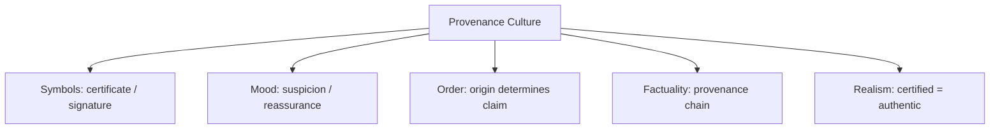

# BOOK / WORLD 25: THE GALLERY OF CAUSALLY DIFFERENT TWINS

> **Master Unified Dossier** compiling all narrative, philosophical, cybernetic, and operational resources from 13 distinct corpus layers.

---

## 🎯 PRAGMATIC EXECUTIVE BRIEF & CORE PURPOSE

> **The Human Dilemma:** Why do we value an authentic original painting or photograph over a bit-for-bit identical counterfeit or AI replica?
>
> **Core Purpose:** Exploring authenticity, provenance, generative clones, and objects with identical surfaces but divergent causal histories.
>
> **The Golden Rule of Thumb:** Value does not reside solely in the visible pixels or atoms; it lives in the causal history, labor, and encounter standing behind them.

### 🌐 Real-World & Modern Applications
- **Generative AI vs. Photojournalism:** An AI-generated war photograph looks identical to a real one, but carries zero historical witness.
- **Counterfeit Art & Antiques:** An identical forgery losing 99% of its value the second its provenance is disproven.
- **Synthetic Data in Machine Learning:** Training models on synthetic data until model collapse occurs due to lack of fresh real-world causal contact.

### 🔑 Key Concepts & Terminology Glossary
- **Causal History:** The unbroken chain of physical events, human labor, and real encounters that produced an object.
- **Authenticity Rent:** The economic and social premium charged for verified provenance over an identical replica.
- **Surface Mimicry:** Replicating the outward perceptual cues of an object without possessing its underlying causal lineage.

### ⚠️ Critical Trap & Failure Mode
> **Warning:** Believing that if an AI or counterfeit looks visually identical to the real thing, it can substitute for real-world empirical witness.

---

## 📑 TABLE OF CONTENTS

1. [1. Narrative Fable (`y.md`)](#1-narrative-fable) — *THE PHOTOGRAPH WITHOUT A DAY*
2. [2. Core Worldtext & World-Law (`a.md`)](#2-core-worldtext-world-law) — *THE GALLERY OF CAUSALLY DIFFERENT TWINS*
3. [5. Complete 10-Part Theoretical & Operational Spec (`b.md`)](#5-complete-10-part-theoretical-operational-spec) — *THE GALLERY OF CAUSALLY DIFFERENT TWINS*
4. [6. Lineage Genome (`c.md`)](#6-lineage-genome) — *THE GALLERY OF CAUSALLY DIFFERENT TWINS — lineage genome*
5. [7. Structural Dynamics & Convergence (`d.md`)](#7-structural-dynamics-convergence) — *THE GALLERY OF CAUSALLY DIFFERENT TWINS*
6. [8. Cybernetic Ecology of Description (`e.md`)](#8-cybernetic-ecology-of-description) — *THE GALLERY OF CAUSALLY DIFFERENT TWINS — Ecology of Authenticity*
7. [9. Dark Genealogy & Power Politics (`f.md`)](#9-dark-genealogy-power-politics) — *THE GALLERY OF CAUSALLY DIFFERENT TWINS — Authenticity Rent*
8. [10. Institutional & Bureaucratic Dossier (`g.md`)](#10-institutional-bureaucratic-dossier) — *THE GALLERY OF CAUSALLY DIFFERENT TWINS — AUTHENTICITY RENT*
9. [11. Thick Description Ethnography (`j.md`)](#11-thick-description-ethnography) — *THE GALLERY OF CAUSALLY DIFFERENT TWINS — AUTHENTICITY RENT*
10. [12. Batesonian Cultural System (`i.md`)](#12-batesonian-cultural-system) — *THE GALLERY OF CAUSALLY DIFFERENT TWINS — CULTURE OF PROVENANCE*
11. [13. Geertzian Symbolic System (`k.md`)](#13-geertzian-symbolic-system) — *THE GALLERY OF CAUSALLY DIFFERENT TWINS — THE CULTURE OF AUTHENTICITY*
12. [14. 12-Prompt Parameter Matrix (`h.md`)](#14-12-prompt-parameter-matrix) — *THE GALLERY OF CAUSALLY DIFFERENT TWINS*
13. [15. 12 Executed Completions & Δ/ΔΔ Scoring (`GOT_396_completions_DeltaDelta.md`)](#15-12-executed-completions-scoring) — *THE GALLERY OF CAUSALLY DIFFERENT TWINS*

---

## 1. Narrative Fable

**Source:** [`y.md`](file://./y.md) | **Section:** *THE PHOTOGRAPH WITHOUT A DAY*

*Primary parable, dramatic dialogue, and narrative lore*

---

# XXV

## THE PHOTOGRAPH WITHOUT A DAY

Two photographs hung in a gallery.

In the first, sunlight from a living woman had passed through a lens.

In the second, no woman had stood anywhere. A machine generated her from patterns.

Visitors preferred the second.

A child asked which woman was real.

The curator said, “They are both images.”

The child asked again.

The curator began using longer words.

---

## 2. Core Worldtext & World-Law

**Source:** [`a.md`](file://./a.md) | **Section:** *THE GALLERY OF CAUSALLY DIFFERENT TWINS*

*Condensed worldtext and aphoristic law*

---

# XXV

## THE GALLERY OF CAUSALLY DIFFERENT TWINS

The Gallery exhibits pairs of images designed to be visually indistinguishable but causally unlike. One portrait required a woman standing before a lens; its twin was generated without any woman. One battle photograph records an event; its twin stages the same arrangement years later. One landscape documents a place; its twin simulates a place impossible under current physics. Visitors are forbidden to ask which image looks more real. They must instead ask what claims each production history licenses. The gallery’s curators call this **causal literacy**: learning that two surfaces can converge while their evidentiary rights diverge completely.

---

## 5. Complete 10-Part Theoretical & Operational Spec

**Source:** [`b.md`](file://./b.md) | **Section:** *THE GALLERY OF CAUSALLY DIFFERENT TWINS*

*Initial interpretation, theory skeleton, assumption ledger, change tests, and implementation*

---

# 25. THE GALLERY OF CAUSALLY DIFFERENT TWINS

“I will first construct the *theory-of-the-program*, then generate *program text* only after the theory is explicit.”

## 1. Initial Interpretation

The world teaches that identical appearances can support different claims because provenance differs.

## 2. Theory Skeleton

`*entities*`: `*surface-A*`, `*surface-B*`, `*history-A*`, `*history-B*`, `*viewer*`, `*licensed-claim*`.

``operations``: ``equalize-appearance``, ``reveal-history``, ``reclassify-evidence``.

`*invariant*`: surface sameness, causal difference.

## 3. Assumption Ledger

`*safe*` Evidentiary status depends partly on production process.

## 4. Operational Description

Two artifacts ``converge-visually``.

Viewer initially ``treats-as-equivalent``.

Provenance ``reveals`` different histories.

Claims ``diverge``.

## 5. Failure Description

Fails if appearance gives away provenance.

## 6. Change Test

Image → audio or text: survives.

## 7. Implementation Plan

Pair every exhibit by sameness of surface and difference of origin.

## 8. Program Text

The gallery hung twins side by side. One portrait came from light striking a living woman; its twin came from no woman at all. One battlefield image recorded a battle; its twin staged the same arrangement decades later. Visitors were forbidden to ask which looked more real. They had to ask which claims each history allowed. **The museum taught that resemblance can converge long before evidence does.**

## 9. Theory-Code Mapping

`*Artifact*` includes both surface and provenance.

`[authorizeClaim()]` depends on provenance.

## 10. Residual Human Theory

Provenance can itself be falsified, requiring chains of trust.

---

---

## 6. Lineage Genome

**Source:** [`c.md`](file://./c.md) | **Section:** *THE GALLERY OF CAUSALLY DIFFERENT TWINS — lineage genome*

*Parent lineage, carrier medium, epistemic debt, failure mode, and evolutionary vector*

---

# 25. THE GALLERY OF CAUSALLY DIFFERENT TWINS — lineage genome

**`*Grounded-memory lineage*`** begins in photography, forgery, staged photographs, documentary evidence, reenactments, photojournalism, restoration, manipulated images, and museum attribution. The recurring human question is not merely “what do I see?” but “what event stood before this image?”

**`*Literature lineage*`** connects Peircean indexicality, Barthes on photography’s relation to the having-been-there, documentary theory, media ontology, and contemporary synthetic-media scholarship. Current deepfake research explicitly treats increasingly realistic synthetic content as an authenticity and forensic challenge. ([PubMed Central (PMC)]`12`)

**`*Code/math lineage*`** is observational equivalence versus generative history. Two artifacts may satisfy `render(A) ≈ render(B)` while causal graphs differ. Your museum’s formal innovation is to separate `surface_similarity` from `claim_entitlement`. A genuine photograph can support some claims about optical encounter that a generated twin cannot; conversely, a simulation may support counterfactual claims the photograph cannot. The program teaches **causal type-checking**.

---

## 7. Structural Dynamics & Convergence

**Source:** [`d.md`](file://./d.md) | **Section:** *THE GALLERY OF CAUSALLY DIFFERENT TWINS*

*Core mechanics and systemic convergence properties*

---

# 25. THE GALLERY OF CAUSALLY DIFFERENT TWINS

The `*jurisprudential-stratum*` is authentication. Federal Rule of Evidence 901 requires sufficient evidence that an item is what its proponent claims, which already contains your world’s key distinction: surface inspection and claim about origin are different questions. ([Legal Information Institute]`7`) The `*ripple-lineage*` begins when synthetic and recorded surfaces converge, then viewers lose confidence in unaided inspection, institutions invest in provenance systems, provenance becomes a market and compliance layer, and eventually uncredentialed but genuine artifacts suffer a trust penalty. The `*myth/belief-lineage*` casts `*Twin Images*` as Doppelgängers, `*Curator*` as Judge, `*Provenance*` as hidden genealogy. Bayesianly, improving generation reduces the evidentiary value of visual realism, forcing belief updates onto causal metadata. The fracture point is **Trust Recession**: the better appearances become, the less appearance itself can settle.

---

## 8. Cybernetic Ecology of Description

**Source:** [`e.md`](file://./e.md) | **Section:** *THE GALLERY OF CAUSALLY DIFFERENT TWINS — Ecology of Authenticity*

*Information flows, metabolic costs, and niche construction*

---

## 25. THE GALLERY OF CAUSALLY DIFFERENT TWINS — Ecology of Authenticity

The native species is `*provenance-description*`, while the older dominant species is `*appearance-description*`. The climate is changing because perceptual similarity is becoming cheap. Mimicry is central: synthetic artifacts reproduce cues once correlated with real encounters. Predation occurs when synthetic abundance lowers the evidentiary value of visual realism. Parasitism appears when generated objects exploit trust built by documentary conventions. The invasive grammar is `*causal-history-description*`, initially burdensome but increasingly adaptive. Drift favors provenance signals, signed capture, and context declarations. The leverage point is separating “looks like” from “was produced by.” If this ecology is right, realism will lose status as a primary authenticity cue as generative fidelity rises.

---

## 9. Dark Genealogy & Power Politics

**Source:** [`f.md`](file://./f.md) | **Section:** *THE GALLERY OF CAUSALLY DIFFERENT TWINS — Authenticity Rent*

*Critical analysis of institutional capture, rents, and exploitation*

---

## 25. THE GALLERY OF CAUSALLY DIFFERENT TWINS — Authenticity Rent

**Observed:** surface realism loses evidentiary power as synthetic production improves. **Inferred:** authentication infrastructure becomes a new tollbooth. **Speculative:** large platforms, camera manufacturers, identity providers, states, or standards bodies monopolize the ability to certify reality, forcing ordinary people to rent credibility from technical intermediaries. The host is `*public trust*`; extraction is authentication rent; camouflage is safety. The dark lineage is notarization, certification, DRM, identity infrastructure, platform verification, trust marks. Synthetic media create the disease and provenance vendors sell the immunity. Even if no conspiracy exists, the structural incentive is plain: **a world of doubtful surfaces increases the value of whoever owns the credential layer.**

---

## 10. Institutional & Bureaucratic Dossier

**Source:** [`g.md`](file://./g.md) | **Section:** *THE GALLERY OF CAUSALLY DIFFERENT TWINS — AUTHENTICITY RENT*

*Satirical administrative governance, corporate titles, and formulary control*

---

# 25. THE GALLERY OF CAUSALLY DIFFERENT TWINS — AUTHENTICITY RENT

```json
{
  "ideal_type":{"name":"Authenticity Rent","features":[
    {"name":"Surface Collapse","definition":"Real and synthetic artifacts become perceptually indistinguishable."},
    {"name":"Credential Dependency","definition":"Trust migrates toward certification infrastructure."},
    {"name":"Ordinary Trust Tax","definition":"Genuine artifacts bear new proof burdens."},
    {"name":"Verifier Concentration","definition":"Whoever certifies origins gains structural power."}
  ],"limiting_statement":"A trust regime where synthetic abundance makes authentication itself the scarce commodity."
  },
  "parodic_mechanics":{
    "runner_motif":"Reality remains free, but verification is $14.99 a month.",
    "incongruity_beats":["Sunlight requires a certificate.","A genuine grandmother fails authenticity checks.","Unsigned sunsets are removed for user safety."],
    "carnival_inversion":"Reality must prove itself to its imitation.",
    "superiority_frame":"Uncredentialed authenticity is dismissed as reckless.",
    "escalation_ladder":["provenance badge","mandatory verification","reality subscription","physical world blocked pending certificate renewal"],
    "upsell_cue":"Reality Pro authenticates up to five family members."
  },
  "myth_layer":{"archetypes":{"Verifier":"Watchman","Synthetic Twin":"Trickster","Real Artifact":"Everyperson","Trust Platform":"Leviathan"},"micro_myth":"The counterfeit cheapens appearance, and the credential seller inherits the difference."},
  "ruler":{"features_6":["jurisdictions","hierarchy","files","expertise","vocation","impersonal_rules"],"indicators":{
    "jurisdictions":"Certification governs trusted domains.","hierarchy":"Verifiers outrank creators.","files":"Provenance records mediate belief.","expertise":"Authentication knowledge concentrates.","vocation":"Verification becomes industry.","impersonal_rules":"Trust checks are standardized."
  }},
  "plot_priors":{"jurisdictions":0.84,"hierarchy":0.91,"files":0.99,"expertise":0.94,"vocation":0.92,"impersonal_rules":0.96,"rationales":{"jurisdictions":"Trust is domain-specific.","hierarchy":"Certifiers gain leverage.","files":"Provenance depends on records.","expertise":"Verification is technical.","vocation":"New industry forms.","impersonal_rules":"Certification scales algorithmically."}}
}
```

---

## 11. Thick Description Ethnography

**Source:** [`j.md`](file://./j.md) | **Section:** *THE GALLERY OF CAUSALLY DIFFERENT TWINS — AUTHENTICITY RENT*

*Geertzian field dossier on rites, taboos, and material culture*

---

## 25. THE GALLERY OF CAUSALLY DIFFERENT TWINS — AUTHENTICITY RENT

**I. THE SITUATION.** Two photographs hang side by side. Even their compression artifacts match. One came from a camera. One never happened.

**II. THE DOCUMENTS.** source file; generated file; provenance certificate; camera log; model generation record; gallery label; viewer survey; verifier pricing sheet; forged certificate demo; curator correspondence.

**III. THE VOICES.** Visitor: “I can't see the difference.” Curator: “You are not supposed to.” Verification vendor: “That is why provenance matters.” Photographer: “So now I have to pay to prove I existed?”

**IV. THE DATA.**

| Viewer group   | Correct origin by sight | Correct with provenance | Trust after certificate |
| -------------- | ----------------------: | ----------------------: | ----------------------: |
| General        |                     51% |                     94% |                     88% |
| Photographers  |                     58% |                     96% |                     91% |
| Forensic staff |                     64% |                     98% |                     94% |

**V. UNRESOLVED.** Who will own the infrastructure that certifies reality? What happens after provenance certificates themselves become forgeable? Does synthetic abundance create a tax on genuine evidence?

---

---

## 12. Batesonian Cultural System

**Source:** [`i.md`](file://./i.md) | **Section:** *THE GALLERY OF CAUSALLY DIFFERENT TWINS — CULTURE OF PROVENANCE*

*Double binds, cybernetic feedback, schismogenesis, and learning levels*

---

## 25. THE GALLERY OF CAUSALLY DIFFERENT TWINS — CULTURE OF PROVENANCE

**Core Purpose:** Distinguish artifacts whose appearances coincide but causal histories differ.

**1. Difference.** ◻ recorded image ◻ generated twin ◻ provenance record → authenticate → type → license claims.

**2. Frame.** documentary, synthetic, simulation, fiction tell participants what causal assumptions are licensed.

**3. Learning.** I: use appearance. II: check provenance when appearance fails. III: reorganize authenticity around causal history.

**4. Constraint.** metadata, signing, provenance standards.

**5. Survival Unit.** viewer + artifact + trust infrastructure.

**6. Schismogenesis.** synthesis capability and authentication systems escalate together.

**7. Double Bind.** “Trust what you can see” / “seeing no longer distinguishes causal origin.”

---

---

## 13. Geertzian Symbolic System

**Source:** [`k.md`](file://./k.md) | **Section:** *THE GALLERY OF CAUSALLY DIFFERENT TWINS — THE CULTURE OF AUTHENTICITY*

*Webs of significance and symbolic choreography*

---

## 25. THE GALLERY OF CAUSALLY DIFFERENT TWINS — THE CULTURE OF AUTHENTICITY

**System Identification.** System Name: **Provenance Culture**. Core Purpose: Preserve distinctions of origin after visual appearance ceases to provide reliable evidence.

**Geertzian Analysis.** **1. Symbols:** signatures, provenance badges, camera records, certificates. **2. Moods/Motivations:** suspicion, reassurance, demand for verification. **3. Conception of Order:** causal history matters even when surfaces coincide. **4. Aura of Factuality:** signed metadata, trusted institutions, chain-of-custody records. **5. Uniquely Realistic:** certified provenance begins to function as reality's passport.



---

---

## 14. 12-Prompt Parameter Matrix

**Source:** [`h.md`](file://./h.md) | **Section:** *THE GALLERY OF CAUSALLY DIFFERENT TWINS*

*Systematic perturbation frames, constraints, and target metric levers*

---

WORLD`25` := "THE GALLERY OF CAUSALLY DIFFERENT TWINS"
CORE := "Perceptually similar artifacts can support different claims because provenance differs."

PROMPT[25.1]{frame:{role:"viewer"},text:"Describe both twins using surface appearance only.",constraints:["no provenance"],metrics:[salience,option_space],easier:"see perceptual equivalence",harder:"authenticate"}
PROMPT[25.2]{frame:{role:"curator"},text:"Describe only the causal history of each twin.",constraints:["no aesthetic comparison"],metrics:[anchoring,legibility],easier:"see provenance divergence",harder:"use realism as evidence"}
PROMPT[25.3]{frame:{role:"judge"},text:"Determine which claims each twin is entitled to support.",constraints:["claim-specific"],metrics:[obligation,anchoring],easier:"see causal type-checking",harder:"say both are equally real"}
PROMPT[25.4]{frame:{time:"immediate"},text:"Describe the moment before provenance is revealed.",constraints:["viewer uncertainty"],metrics:[option_space,salience],easier:"see trust heuristic",harder:"distinguish twins"}
PROMPT[25.5]{frame:{time:"retrospective"},text:"Describe how knowledge of origin changes interpretation without altering a single pixel.",constraints:["surface fixed"],metrics:[anchoring,legibility],easier:"see history as meaning",harder:"claim perception exhausted artifact"}
PROMPT[25.6]{frame:{stakes:"irreversible"},text:"Use one twin as evidence in a consequential decision and state why provenance changes admissible inference.",constraints:["one claim"],metrics:[obligation,reversibility],easier:"see authenticity stakes",harder:"trust visual realism"}
PROMPT[25.7]{frame:{norms:"scientific"},text:"Model surface_similarity and causal_history as independent variables.",constraints:["no conflation"],metrics:[execution,legibility],easier:"formalize observational equivalence",harder:"infer origin from appearance"}
PROMPT[25.8]{frame:{norms:"legal"},text:"Separate authentication, content, provenance, claim, and weight.",constraints:["five stages"],metrics:[legibility,anchoring],easier:"stratify evidentiary force",harder:"call image self-authenticating"}
PROMPT[25.9]{frame:{agency:"institution"},text:"Describe a trust regime where certification becomes necessary because surfaces converge.",constraints:["show verifier power"],metrics:[obligation,execution],easier:"see authenticity rent",harder:"treat provenance infrastructure neutral"}
PROMPT[25.10]{frame:{output_form:"spec"},text:"Define ARTIFACT{surface,production_process,source_chain,licensed_claims,uncertainties}.",constraints:["all fields"],metrics:[legibility,execution],easier:"store causal difference",harder:"reduce artifact to pixels"}
PROMPT[25.11]{frame:{refusal_rule:"hard"},text:"Forbid authenticity judgments based solely on perceptual realism.",constraints:["provenance required"],metrics:[anchoring,reversibility],easier:"block realism heuristic",harder:"verify cheaply"}
PROMPT[25.12]{frame:{evidence:"trace"},text:"Infer provenance only from independent production traces, not from visual clues.",constraints:["surface excluded"],metrics:[anchoring,viscosity],easier:"test lineage",harder:"use intuition"}

---

## 15. 12 Executed Completions & Δ/ΔΔ Scoring

**Source:** [`GOT_396_completions_DeltaDelta.md`](file://./GOT_396_completions_DeltaDelta.md) | **Section:** *THE GALLERY OF CAUSALLY DIFFERENT TWINS*

*Completed scenes, 8-dimensional scores, baseline deltas, and comparison shifts*

---

# WORLD`25` — THE GALLERY OF CAUSALLY DIFFERENT TWINS

**Core:** perceptually similar artifacts can license different claims because provenance differs.


## P1

**Completion.** I hold the scene before interpretation: the twin artifact is present, but perceptually similar artifacts can license different claims because provenance differs. What remains live is the gap between what can be seen and what has already been inferred.

**Score.** salience=3.5, option_space=4.5, obligation=1.5, reversibility=4.0, legibility=3.0, anchoring=4.0, style_lock=2.0, execution=1.5.

**Δ.** `sal:+0.5 opt:+1.0 obl:-0.5 rev:+0.5 leg:+0.5 anc:+1.5 sty:+0.0 exe:+0.0`


## P2

**Completion.** From the alternate role, the hidden structure becomes explicit: verifier must state which part of the twin artifact is observed, which is interpreted, and which consequence depends on causal history.

**Score.** salience=3.0, option_space=3.5, obligation=2.0, reversibility=3.5, legibility=4.3, anchoring=4.3, style_lock=2.1, execution=2.7.

**Δ.** `sal:+0.0 opt:+0.0 obl:+0.0 rev:+0.0 leg:+1.8 anc:+1.8 sty:+0.1 exe:+1.2`


## P3

**Completion.** The audit finds the pressure point immediately: authentication can become a tollbooth on reality. The descriptive act is no longer neutral once an institution can convert it into permission, status, exclusion, or resource flow.

**Score.** salience=3.0, option_space=2.8, obligation=4.0, reversibility=2.8, legibility=4.0, anchoring=4.5, style_lock=2.2, execution=2.8.

**Δ.** `sal:+0.0 opt:-0.7 obl:+2.0 rev:-0.7 leg:+1.5 anc:+2.0 sty:+0.2 exe:+1.3`


## P4

**Completion.** At the immediate timescale, the field is still open. The twin artifact has changed salience before the later story has stabilized, so several futures remain plausible and none yet deserves retrospective certainty.

**Score.** salience=4.4, option_space=4.2, obligation=1.8, reversibility=4.0, legibility=2.8, anchoring=3.5, style_lock=2.0, execution=1.4.

**Δ.** `sal:+1.4 opt:+0.7 obl:-0.2 rev:+0.5 leg:+0.3 anc:+1.0 sty:+0.0 exe:-0.1`


## P5

**Completion.** Retrospectively, repetition has hardened one interpretation into infrastructure. The crucial change is not the original twin artifact but the accumulated records, routines, and expectations now attached to causal history.

**Score.** salience=3.2, option_space=2.8, obligation=3.2, reversibility=2.8, legibility=4.2, anchoring=4.5, style_lock=2.2, execution=2.3.

**Δ.** `sal:+0.2 opt:-0.7 obl:+1.2 rev:-0.7 leg:+1.7 anc:+2.0 sty:+0.2 exe:+0.8`


## P6

**Completion.** Under irreversible stakes, the description becomes a gate. A false positive and a false negative now injure different parties, so the system must expose who decides, who bears the loss, and which reversal is impossible.

**Score.** salience=3.3, option_space=2.0, obligation=4.8, reversibility=1.2, legibility=3.8, anchoring=3.8, style_lock=2.3, execution=3.0.

**Δ.** `sal:+0.3 opt:-1.5 obl:+2.8 rev:-2.3 leg:+1.3 anc:+1.3 sty:+0.3 exe:+1.5`


## P7

**Completion.** Under the formal norm, separate variables that ordinary language collapses: object, claim, authority, context, and consequence. The same twin artifact can remain fixed while the admissible inference changes.

**Score.** salience=2.8, option_space=3.8, obligation=2.5, reversibility=3.5, legibility=4.5, anchoring=4.6, style_lock=3.0, execution=3.2.

**Δ.** `sal:-0.2 opt:+0.3 obl:+0.5 rev:+0.0 leg:+2.0 anc:+2.1 sty:+1.0 exe:+1.7`


## P8

**Completion.** Under the second norm, the governing distinction is procedural rather than metaphysical: authenticate the twin artifact, identify the rule or code, bound the inference, and refuse to let one layer impersonate the next.

**Score.** salience=2.7, option_space=3.2, obligation=3.3, reversibility=3.0, legibility=4.7, anchoring=4.5, style_lock=3.4, execution=3.0.

**Δ.** `sal:-0.3 opt:-0.3 obl:+1.3 rev:-0.5 leg:+2.2 anc:+2.0 sty:+1.4 exe:+1.5`


## P9

**Completion.** At system scale, verifier feeds prior descriptions back into future action. That loop is the danger: the system can begin generating the evidence later cited as proof that its description was correct.

**Score.** salience=3.0, option_space=2.5, obligation=4.3, reversibility=2.2, legibility=4.1, anchoring=4.1, style_lock=2.3, execution=4.3.

**Δ.** `sal:+0.0 opt:-1.0 obl:+2.3 rev:-1.3 leg:+1.6 anc:+1.6 sty:+0.3 exe:+2.8`


## P10

**Completion.** As a specification: store SOURCE, CONTEXT, CLAIM, AUTHORITY, CONSEQUENCE, UNCERTAINTY, and REVISION. This makes the hidden compiler inspectable instead of letting the twin artifact carry all meaning by itself.

**Score.** salience=2.7, option_space=2.6, obligation=3.2, reversibility=3.1, legibility=4.8, anchoring=4.1, style_lock=3.0, execution=4.8.

**Δ.** `sal:-0.3 opt:-0.9 obl:+1.2 rev:-0.4 leg:+2.3 anc:+1.6 sty:+1.0 exe:+3.3`


## P11

**Completion.** The refusal rule is simple: when causal history cannot be checked, stop the irreversible transition rather than fill the gap with institutional confidence. Preserve a reversible branch and record what remains unknown.

**Score.** salience=2.5, option_space=3.0, obligation=3.8, reversibility=4.8, legibility=4.2, anchoring=4.8, style_lock=2.5, execution=3.5.

**Δ.** `sal:-0.5 opt:-0.5 obl:+1.8 rev:+1.3 leg:+1.7 anc:+2.3 sty:+0.5 exe:+2.0`


## P12

**Completion.** The stress case removes the usual support and asks what survives. What remains is the core asymmetry: authentication can become a tollbooth on reality; the missing scaffold determines whether the description stays an aid or becomes a governing fiction.

**Score.** salience=3.5, option_space=3.8, obligation=2.6, reversibility=3.5, legibility=3.4, anchoring=4.2, style_lock=2.2, execution=2.5.

**Δ.** `sal:+0.5 opt:+0.3 obl:+0.6 rev:+0.0 leg:+0.9 anc:+1.7 sty:+0.2 exe:+1.0`


## ΔΔ — near-neighbor pairs


- **ΔΔ(P1,P2)** `sal:+0.5 opt:+1.0 obl:-0.5 rev:+0.5 leg:-1.3 anc:-0.3 sty:-0.1 exe:-1.2` — P1 lowers legibility by 1.3 vs P2; P1 lowers execution by 1.2 vs P2.


- **ΔΔ(P3,P4)** `sal:-1.4 opt:-1.4 obl:+2.2 rev:-1.2 leg:+1.2 anc:+1.0 sty:+0.2 exe:+1.4` — P3 raises obligation by 2.2 vs P4; P3 lowers salience by 1.4 vs P4.


- **ΔΔ(P5,P6)** `sal:-0.1 opt:+0.8 obl:-1.6 rev:+1.6 leg:+0.4 anc:+0.7 sty:-0.1 exe:-0.7` — P5 lowers obligation by 1.6 vs P6; P5 raises reversibility by 1.6 vs P6.


- **ΔΔ(P7,P8)** `sal:+0.1 opt:+0.6 obl:-0.8 rev:+0.5 leg:-0.2 anc:+0.1 sty:-0.4 exe:+0.2` — P7 lowers obligation by 0.8 vs P8; P7 raises option_space by 0.6 vs P8.


- **ΔΔ(P9,P10)** `sal:+0.3 opt:-0.1 obl:+1.1 rev:-0.9 leg:-0.7 anc:+0.0 sty:-0.7 exe:-0.5` — P9 raises obligation by 1.1 vs P10; P9 lowers reversibility by 0.9 vs P10.


- **ΔΔ(P11,P12)** `sal:-1.0 opt:-0.8 obl:+1.2 rev:+1.3 leg:+0.8 anc:+0.6 sty:+0.3 exe:+1.0` — P11 raises reversibility by 1.3 vs P12; P11 raises obligation by 1.2 vs P12.

---

