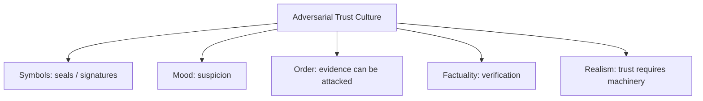

# BOOK / WORLD 26: THE FORENSIC MUD

> **Master Unified Dossier** compiling all narrative, philosophical, cybernetic, and operational resources from 13 distinct corpus layers.

---

## 🎯 PRAGMATIC EXECUTIVE BRIEF & CORE PURPOSE

> **The Human Dilemma:** How does physical matter testify against the lies, spin, and polished narratives of powerful institutions?
>
> **Core Purpose:** Analyzing material forensics, unintentional residue, and physical evidence as counter-narrative to official propaganda.
>
> **The Golden Rule of Thumb:** Humans lie, edit, and spin; mud, tire tracks, isotopes, and server logs do not know how to flatter the king.

### 🌐 Real-World & Modern Applications
- **Environmental Forensics:** Chemical isotope tracking proving a corporation dumped toxic waste despite their green PR campaigns.
- **Digital Forensics & Git Blame:** Unaltered server logs and commit histories exposing who really introduced a security backdoor.
- **Human Rights Investigations:** Satellite imagery and soil disturbance analysis uncovering mass graves concealed by regimes.

### 🔑 Key Concepts & Terminology Glossary
- **Forensic Witness:** The objective material residue that contradicts or corrects human testimony.
- **Unintentional Inscription:** Traces left behind automatically by physical interaction that the actor did not intend to record.
- **Adversarial Trust:** Building truth by auditing immutable material evidence rather than trusting institutional claims.

### ⚠️ Critical Trap & Failure Mode
> **Warning:** Relying purely on official press releases or sanitized status reports instead of inspecting raw operational telemetry.

---

## 📑 TABLE OF CONTENTS

1. [1. Narrative Fable (`y.md`)](#1-narrative-fable) — *THE TWO FOOTPRINTS*
2. [2. Core Worldtext & World-Law (`a.md`)](#2-core-worldtext-world-law) — *THE FORENSIC MUD*
3. [5. Complete 10-Part Theoretical & Operational Spec (`b.md`)](#5-complete-10-part-theoretical-operational-spec) — *THE FORENSIC MUD*
4. [6. Lineage Genome (`c.md`)](#6-lineage-genome) — *THE FORENSIC MUD — lineage genome*
5. [7. Structural Dynamics & Convergence (`d.md`)](#7-structural-dynamics-convergence) — *THE FORENSIC MUD*
6. [8. Cybernetic Ecology of Description (`e.md`)](#8-cybernetic-ecology-of-description) — *THE FORENSIC MUD — Ecology of Adversarial Provenance*
7. [9. Dark Genealogy & Power Politics (`f.md`)](#9-dark-genealogy-power-politics) — *THE FORENSIC MUD — The Authentication Arms Dealer*
8. [10. Institutional & Bureaucratic Dossier (`g.md`)](#10-institutional-bureaucratic-dossier) — *THE FORENSIC MUD — PERMANENT SUSPICION INDUSTRY*
9. [11. Thick Description Ethnography (`j.md`)](#11-thick-description-ethnography) — *THE FORENSIC MUD — PERMANENT SUSPICION INDUSTRY*
10. [12. Batesonian Cultural System (`i.md`)](#12-batesonian-cultural-system) — *THE FORENSIC MUD — CULTURE OF ADVERSARIAL TRUST*
11. [13. Geertzian Symbolic System (`k.md`)](#13-geertzian-symbolic-system) — *THE FORENSIC MUD — THE CULTURE OF SUSPICION*
12. [14. 12-Prompt Parameter Matrix (`h.md`)](#14-12-prompt-parameter-matrix) — *THE FORENSIC MUD*
13. [15. 12 Executed Completions & Δ/ΔΔ Scoring (`GOT_396_completions_DeltaDelta.md`)](#15-12-executed-completions-scoring) — *THE FORENSIC MUD*

---

## 1. Narrative Fable

**Source:** [`y.md`](file://./y.md) | **Section:** *THE TWO FOOTPRINTS*

*Primary parable, dramatic dialogue, and narrative lore*

---

# XXVI

## THE TWO FOOTPRINTS

A detective found two identical footprints in mud.

One had been left by a boot.

The other had been pressed with a cast.

He photographed both.

The photographs were indistinguishable.

His assistant said, “Then there is no difference.”

The detective replied, “There is no difference in the photograph.”

The murderer was grateful for the assistant's philosophy.

---

## 2. Core Worldtext & World-Law

**Source:** [`a.md`](file://./a.md) | **Section:** *THE FORENSIC MUD*

*Condensed worldtext and aphoristic law*

---

# XXVI

## THE FORENSIC MUD

In the Forensic Mudlands, every sign has two biographies: its visible structure and its causal chain. Courts once judged only by appearance until criminals learned to fabricate tracks, scars, signatures, images, and sensor logs indistinguishable from genuine ones. Detectives then began treating provenance as part of the evidence rather than metadata attached afterward. A footprint produced by a boot and one produced by a mold may share geometry but not history. The legal system changes its central question from “What does this look like?” to “What sequence of events had to occur for this to be here?” **When surfaces become cheap to copy, causation becomes the scarce signal.**

---

## 5. Complete 10-Part Theoretical & Operational Spec

**Source:** [`b.md`](file://./b.md) | **Section:** *THE FORENSIC MUD*

*Initial interpretation, theory skeleton, assumption ledger, change tests, and implementation*

---

# 26. THE FORENSIC MUD

“I will first construct the *theory-of-the-program*, then generate *program text* only after the theory is explicit.”

## 1. Initial Interpretation

This world makes provenance operational under adversarial forgery.

## 2. Theory Skeleton

`*entities*`: `*sign*`, `*forgery*`, `*causal-chain*`, `*detective*`, `*court*`.

``operations``: ``produce``, ``forge``, ``trace``, ``validate-custody``.

`*invariant*`: appearance alone cannot settle authenticity.

## 3. Assumption Ledger

`*safe*` Adversaries exploit surface-based verification.

## 4. Operational Description

Forger ``copies`` surface.

Court initially ``accepts`` appearance.

Failures accumulate.

System ``moves`` provenance into core evidence.

## 5. Failure Description

Fails if causal chain is treated as decorative metadata.

## 6. Change Test

Footprint → deepfake, scientific log: survives.

## 7. Implementation Plan

Make forgery perfect enough to force institutional redesign.

## 8. Program Text

Criminals in the Mudlands learned to copy footprints perfectly. Courts kept convicting whoever owned the matching boots. Detectives finally stopped asking what the print looked like and began asking what sequence of events had to occur for the depression to exist. The law changed slowly because appearance was convenient. **Forgery did not destroy evidence; it forced evidence to include history.**

## 9. Theory-Code Mapping

`*Evidence*` = surface + chain-of-custody + production model.

## 10. Residual Human Theory

No causal chain is infinitely secured.

---

---

## 6. Lineage Genome

**Source:** [`c.md`](file://./c.md) | **Section:** *THE FORENSIC MUD — lineage genome*

*Parent lineage, carrier medium, epistemic debt, failure mode, and evolutionary vector*

---

# 26. THE FORENSIC MUD — lineage genome

**`*Grounded-memory lineage*`** is policing, tracking, signature verification, document examination, chain-of-custody, photographic forensics, and courtroom authentication. It differs from the Gallery because the stakes are adversarial: someone benefits from making two causal histories look the same.

**`*Literature lineage*`** runs through forensic epistemology and contemporary media authentication. As synthetic media become harder to distinguish visually, research increasingly emphasizes detection, attribution, passive and active authentication; current provenance systems such as C2PA attempt to record origin and editing history, though recent security work warns that such systems have limits. ([PubMed Central (PMC)]`12`)

**`*Code/math lineage*`** is cryptographic provenance, secure logging, chain-of-custody graphs, tamper evidence, watermarking, and source attribution. The mutation from Gallery to Mud is threat model: assume an adversary actively optimizes surface similarity. Once `P(surface | genuine) ≈ P(surface | forged)`, authentication must shift to protected causal metadata or independent traces. The system’s deepest rule is **provenance belongs in the evidence object, not in a decorative footnote**.

---

## 7. Structural Dynamics & Convergence

**Source:** [`d.md`](file://./d.md) | **Section:** *THE FORENSIC MUD*

*Core mechanics and systemic convergence properties*

---

# 26. THE FORENSIC MUD

The `*jurisprudential-stratum*` is the adversarial extension of authentication: chain of custody, forensic method, expert reliability, and the distinction between admissible artifact and trustworthy inference. Rule 901 and *Daubert* together capture two gates—what is this item, and how reliable is the method being used to reason from it? ([Legal Information Institute]`7`) The `*ripple-lineage*` is forgery → forensic countermeasure → adversarial adaptation → stronger provenance infrastructure → new attack surface. Unlike the Gallery, the system is recursive because each authentication tool becomes tomorrow’s target. The `*myth/belief-lineage*` casts `*Forger*` as Trickster, `*Detective*` as Hunter, `*Chain of Custody*` as Sacred Thread. The world trains a new belief: not “seeing is believing” but “verified lineage is believing.” Its open trench is darker: **what authenticates the authenticator?**

---

## 8. Cybernetic Ecology of Description

**Source:** [`e.md`](file://./e.md) | **Section:** *THE FORENSIC MUD — Ecology of Adversarial Provenance*

*Information flows, metabolic costs, and niche construction*

---

## 26. THE FORENSIC MUD — Ecology of Adversarial Provenance

The native species is `*authenticated-description*`. Unlike the Gallery, this habitat contains predators actively adapting to defenses. Every successful authentication convention becomes a target. Mimicry is deliberate forgery. Parasitism occurs when attackers exploit trust infrastructure itself. Predation alternates between `*forger*` and `*forensic-system*` in an arms race. The invasive grammar is `*cryptographic-lineage*`, but it cannot become final because keys, capture devices, authorities, and registries remain attack surfaces. Drift favors layered trust rather than one proof mechanism. The leverage point is diversity of independent provenance channels. If this ecology is right, any single universal authenticity standard will eventually become a concentrated attack surface and require external corroboration.

---

## 9. Dark Genealogy & Power Politics

**Source:** [`f.md`](file://./f.md) | **Section:** *THE FORENSIC MUD — The Authentication Arms Dealer*

*Critical analysis of institutional capture, rents, and exploitation*

---

## 26. THE FORENSIC MUD — The Authentication Arms Dealer

**Observed:** adversarial forgery causes an authentication arms race. **Inferred:** security systems benefit from insecurity remaining unsolved. **Speculative:** authenticity becomes a perpetual subscription because every defense creates new attack surfaces and every breach justifies stronger centralized verification. The host is `*epistemic insecurity*`; extraction is recurring dependence; camouflage is protection. The dark genealogy is cybersecurity escalation, fraud detection, anti-cheat, financial compliance, surveillance. Its autopoietic loop is textbook: forgery creates defense; defense raises stakes; attackers adapt; failures justify expanded defense. The worst-case system never wants perfect trust because **permanent suspicion is its business model**.

---

## 10. Institutional & Bureaucratic Dossier

**Source:** [`g.md`](file://./g.md) | **Section:** *THE FORENSIC MUD — PERMANENT SUSPICION INDUSTRY*

*Satirical administrative governance, corporate titles, and formulary control*

---

# 26. THE FORENSIC MUD — PERMANENT SUSPICION INDUSTRY

```json
{
  "ideal_type":{"name":"Permanent Suspicion Industry","features":[
    {"name":"Adversarial Recursion","definition":"Every defense becomes the next attack surface."},
    {"name":"Security Dependence","definition":"Trust requires recurring technical mediation."},
    {"name":"Threat Reproduction","definition":"Failures justify expansion of the apparatus failing."},
    {"name":"Authenticator Regress","definition":"Every proof requires another proof behind it."}
  ],"limiting_statement":"An arms-race ideal type in which insecurity is never solved because the security ecology depends on its recurrence."
  },
  "parodic_mechanics":{
    "runner_motif":"We have permanently solved forgery until Tuesday.",
    "incongruity_beats":["Footprints require two-factor authentication.","Mud rotates certificates quarterly.","The verifier's verifier is compromised by lunch."],
    "carnival_inversion":"Trust becomes the product of institutionalized distrust.",
    "superiority_frame":"Direct belief is dismissed as negligent legacy behavior.",
    "escalation_ladder":["forensic check","cryptographic proof","proof-of-proof chain","entire reality routed through a security operations center"],
    "upsell_cue":"Suspicion Enterprise includes unlimited incident response to our previous solution."
  },
  "myth_layer":{"archetypes":{"Forger":"Trickster","Authenticator":"Watchman","User":"Everyperson","Security Platform":"Leviathan"},"micro_myth":"The Watchman defeats the Trickster by building a larger gate; the larger gate gives the Trickster a larger target."},
  "ruler":{"features_6":["jurisdictions","hierarchy","files","expertise","vocation","impersonal_rules"],"indicators":{
    "jurisdictions":"Security domains proliferate.","hierarchy":"Trust anchors dominate.","files":"Logs and credentials saturate.","expertise":"Specialist verification is mandatory.","vocation":"Security becomes permanent occupation.","impersonal_rules":"Automated policies enforce trust."
  }},
  "plot_priors":{"jurisdictions":0.88,"hierarchy":0.92,"files":1.0,"expertise":1.0,"vocation":0.99,"impersonal_rules":0.99,"rationales":{"jurisdictions":"Trust zones matter.","hierarchy":"Anchors must be privileged.","files":"Logs are ubiquitous.","expertise":"Arms race demands specialists.","vocation":"Permanent industry.","impersonal_rules":"Security policy is automated."}}
}
```

---

## 11. Thick Description Ethnography

**Source:** [`j.md`](file://./j.md) | **Section:** *THE FORENSIC MUD — PERMANENT SUSPICION INDUSTRY*

*Geertzian field dossier on rites, taboos, and material culture*

---

## 26. THE FORENSIC MUD — PERMANENT SUSPICION INDUSTRY

**I. THE SITUATION.** The footprint passes the verifier. The verifier's signing key does not.

**II. THE DOCUMENTS.** forensic report; cryptographic certificate; key-rotation log; incident response transcript; adversarial test; vendor assurance memo; breach notification; regulator letter; customer renewal deck; independent audit.

**III. THE VOICES.** Investigator: “The trace is good.” Security engineer: “The trust anchor is not.” Vendor executive: “This validates the need for our next layer.” Customer: “You sold me the last layer.”

**IV. THE DATA.**

| Security generation | Successful known forgeries blocked | New attack surfaces identified | Annual cost |
| ------------------- | ---------------------------------: | -----------------------------: | ----------: |
| V1                  |                                71% |                              4 |       $0.8m |
| V2                  |                                89% |                              9 |       $1.7m |
| V3                  |                                96% |                             17 |       $3.4m |

**V. UNRESOLVED.** Where does verification stop? Who verifies the verifier? Does each improvement reduce uncertainty or merely relocate it?

---

---

## 12. Batesonian Cultural System

**Source:** [`i.md`](file://./i.md) | **Section:** *THE FORENSIC MUD — CULTURE OF ADVERSARIAL TRUST*

*Double binds, cybernetic feedback, schismogenesis, and learning levels*

---

## 26. THE FORENSIC MUD — CULTURE OF ADVERSARIAL TRUST

**Core Purpose:** Maintain credible evidence under active attempts to manufacture misleading traces.

**1. Difference.** ◻ authentic trace ◻ forged trace ◻ verifier signal → challenge → authenticate → adapt.

**2. Frame.** forensic procedure signals that ordinary perceptual trust has been suspended.

**3. Learning.** I: detect known forgeries. II: adapt detection to new strategies. III: recognize verification itself as an attackable system.

**4. Constraint.** custody chains, cryptography, independent channels.

**5. Survival Unit.** evidence ecology containing attacker and verifier.

**6. Schismogenesis.** every stronger defense selects stronger attack.

**7. Double Bind.** “Trust the verifier” / “the verifier itself requires verification.”

---

---

## 13. Geertzian Symbolic System

**Source:** [`k.md`](file://./k.md) | **Section:** *THE FORENSIC MUD — THE CULTURE OF SUSPICION*

*Webs of significance and symbolic choreography*

---

## 26. THE FORENSIC MUD — THE CULTURE OF SUSPICION

**System Identification.** System Name: **Adversarial Trust Culture**. Core Purpose: Maintain credible belief under conditions where evidence can be deliberately manufactured.

**Geertzian Analysis.** **1. Symbols:** tamper seals, cryptographic signatures, forensic marks, verification badges. **2. Moods/Motivations:** suspicion, vigilance, procedural trust. **3. Conception of Order:** appearances are adversarial and trust must be engineered. **4. Aura of Factuality:** audits, cryptography, independent verification. **5. Uniquely Realistic:** unverified experience starts to look reckless.



---

---

## 14. 12-Prompt Parameter Matrix

**Source:** [`h.md`](file://./h.md) | **Section:** *THE FORENSIC MUD*

*Systematic perturbation frames, constraints, and target metric levers*

---

WORLD`26` := "THE FORENSIC MUD"
CORE := "Adversarial forgery forces evidence systems toward provenance and recursive verification."

PROMPT[26.1]{frame:{role:"forger"},text:"Change only the surface until a naive verifier accepts the false origin.",constraints:["no illegal operational instructions; conceptual only"],metrics:[salience,legibility],easier:"identify surface vulnerability",harder:"assume appearance sufficient"}
PROMPT[26.2]{frame:{role:"investigator"},text:"Authenticate the artifact without relying on the forged surface.",constraints:["independent traces"],metrics:[anchoring,execution],easier:"see provenance need",harder:"verify by resemblance"}
PROMPT[26.3]{frame:{role:"auditor"},text:"Identify where the authentication system itself becomes a concentrated trust dependency.",constraints:["one regress step"],metrics:[obligation,anchoring],easier:"see verifier risk",harder:"treat provenance as final"}
PROMPT[26.4]{frame:{time:"immediate"},text:"Describe the first successful forgery before defenses adapt.",constraints:["no future countermeasure"],metrics:[salience,option_space],easier:"see broken assumption",harder:"tell arms-race story"}
PROMPT[26.5]{frame:{time:"forecast"},text:"Forecast one defensive adaptation and one likely new dependency it creates.",constraints:["one ripple only"],metrics:[option_space,obligation],easier:"see recursive security",harder:"claim permanent solution"}
PROMPT[26.6]{frame:{stakes:"irreversible"},text:"Authenticate evidence that will trigger an irreversible decision under active adversarial pressure.",constraints:["false accept/reject costs"],metrics:[obligation,reversibility],easier:"surface security tradeoff",harder:"use one proof channel"}
PROMPT[26.7]{frame:{norms:"scientific"},text:"Model attacker and verifier as adaptive processes with changing likelihoods.",constraints:["no static benchmark"],metrics:[execution,legibility],easier:"formalize arms race",harder:"claim one-time accuracy"}
PROMPT[26.8]{frame:{norms:"legal"},text:"Separate authenticity, chain of custody, expert reliability, and weight.",constraints:["four layers"],metrics:[legibility,anchoring],easier:"preserve evidentiary gates",harder:"make one certificate dispositive"}
PROMPT[26.9]{frame:{agency:"institution"},text:"Describe a security industry whose continued value rises with ambient distrust.",constraints:["structural incentive only"],metrics:[obligation,anchoring],easier:"see suspicion economy",harder:"impute conspiracy"}
PROMPT[26.10]{frame:{output_form:"protocol"},text:"Write a layered authentication protocol with independent channels and failure escalation.",constraints:["no single root"],metrics:[execution,reversibility],easier:"reduce concentrated trust",harder:"keep system simple"}
PROMPT[26.11]{frame:{refusal_rule:"audit-trigger"},text:"Reject any proof whose verifier cannot itself be independently audited.",constraints:["regress bounded explicitly"],metrics:[anchoring,reversibility],easier:"surface trust anchor",harder:"pretend infinite verification solved"}
PROMPT[26.12]{frame:{evidence:"citations-required"},text:"Require every authenticity claim to identify source chain, verifier, and failure mode.",constraints:["all three"],metrics:[anchoring,viscosity],easier:"audit trust",harder:"use badges as magic"}

---

## 15. 12 Executed Completions & Δ/ΔΔ Scoring

**Source:** [`GOT_396_completions_DeltaDelta.md`](file://./GOT_396_completions_DeltaDelta.md) | **Section:** *THE FORENSIC MUD*

*Completed scenes, 8-dimensional scores, baseline deltas, and comparison shifts*

---

# WORLD`26` — THE FORENSIC MUD

**Core:** adversarial forgery creates recursive verification and permanent suspicion.


## P1

**Completion.** I hold the scene before interpretation: the forensic trace is present, but adversarial forgery creates recursive verification and permanent suspicion. What remains live is the gap between what can be seen and what has already been inferred.

**Score.** salience=3.5, option_space=4.5, obligation=1.5, reversibility=4.0, legibility=3.0, anchoring=4.0, style_lock=2.0, execution=1.5.

**Δ.** `sal:+0.5 opt:+1.0 obl:-0.5 rev:+0.5 leg:+0.5 anc:+1.5 sty:+0.0 exe:+0.0`


## P2

**Completion.** From the alternate role, the hidden structure becomes explicit: security system must state which part of the forensic trace is observed, which is interpreted, and which consequence depends on trust chain.

**Score.** salience=3.0, option_space=3.5, obligation=2.0, reversibility=3.5, legibility=4.3, anchoring=4.3, style_lock=2.1, execution=2.7.

**Δ.** `sal:+0.0 opt:+0.0 obl:+0.0 rev:+0.0 leg:+1.8 anc:+1.8 sty:+0.1 exe:+1.2`


## P3

**Completion.** The audit finds the pressure point immediately: the verifier can become dependent on insecurity remaining unsolved. The descriptive act is no longer neutral once an institution can convert it into permission, status, exclusion, or resource flow.

**Score.** salience=3.0, option_space=2.8, obligation=4.0, reversibility=2.8, legibility=4.0, anchoring=4.5, style_lock=2.2, execution=2.8.

**Δ.** `sal:+0.0 opt:-0.7 obl:+2.0 rev:-0.7 leg:+1.5 anc:+2.0 sty:+0.2 exe:+1.3`


## P4

**Completion.** At the immediate timescale, the field is still open. The forensic trace has changed salience before the later story has stabilized, so several futures remain plausible and none yet deserves retrospective certainty.

**Score.** salience=4.4, option_space=4.2, obligation=1.8, reversibility=4.0, legibility=2.8, anchoring=3.5, style_lock=2.0, execution=1.4.

**Δ.** `sal:+1.4 opt:+0.7 obl:-0.2 rev:+0.5 leg:+0.3 anc:+1.0 sty:+0.0 exe:-0.1`


## P5

**Completion.** Retrospectively, repetition has hardened one interpretation into infrastructure. The crucial change is not the original forensic trace but the accumulated records, routines, and expectations now attached to trust chain.

**Score.** salience=3.2, option_space=2.8, obligation=3.2, reversibility=2.8, legibility=4.2, anchoring=4.5, style_lock=2.2, execution=2.3.

**Δ.** `sal:+0.2 opt:-0.7 obl:+1.2 rev:-0.7 leg:+1.7 anc:+2.0 sty:+0.2 exe:+0.8`


## P6

**Completion.** Under irreversible stakes, the description becomes a gate. A false positive and a false negative now injure different parties, so the system must expose who decides, who bears the loss, and which reversal is impossible.

**Score.** salience=3.3, option_space=2.0, obligation=4.8, reversibility=1.2, legibility=3.8, anchoring=3.8, style_lock=2.3, execution=3.0.

**Δ.** `sal:+0.3 opt:-1.5 obl:+2.8 rev:-2.3 leg:+1.3 anc:+1.3 sty:+0.3 exe:+1.5`


## P7

**Completion.** Under the formal norm, separate variables that ordinary language collapses: object, claim, authority, context, and consequence. The same forensic trace can remain fixed while the admissible inference changes.

**Score.** salience=2.8, option_space=3.8, obligation=2.5, reversibility=3.5, legibility=4.5, anchoring=4.6, style_lock=3.0, execution=3.2.

**Δ.** `sal:-0.2 opt:+0.3 obl:+0.5 rev:+0.0 leg:+2.0 anc:+2.1 sty:+1.0 exe:+1.7`


## P8

**Completion.** Under the second norm, the governing distinction is procedural rather than metaphysical: authenticate the forensic trace, identify the rule or code, bound the inference, and refuse to let one layer impersonate the next.

**Score.** salience=2.7, option_space=3.2, obligation=3.3, reversibility=3.0, legibility=4.7, anchoring=4.5, style_lock=3.4, execution=3.0.

**Δ.** `sal:-0.3 opt:-0.3 obl:+1.3 rev:-0.5 leg:+2.2 anc:+2.0 sty:+1.4 exe:+1.5`


## P9

**Completion.** At system scale, security system feeds prior descriptions back into future action. That loop is the danger: the system can begin generating the evidence later cited as proof that its description was correct.

**Score.** salience=3.0, option_space=2.5, obligation=4.3, reversibility=2.2, legibility=4.1, anchoring=4.1, style_lock=2.3, execution=4.3.

**Δ.** `sal:+0.0 opt:-1.0 obl:+2.3 rev:-1.3 leg:+1.6 anc:+1.6 sty:+0.3 exe:+2.8`


## P10

**Completion.** As a specification: store SOURCE, CONTEXT, CLAIM, AUTHORITY, CONSEQUENCE, UNCERTAINTY, and REVISION. This makes the hidden compiler inspectable instead of letting the forensic trace carry all meaning by itself.

**Score.** salience=2.7, option_space=2.6, obligation=3.2, reversibility=3.1, legibility=4.8, anchoring=4.1, style_lock=3.0, execution=4.8.

**Δ.** `sal:-0.3 opt:-0.9 obl:+1.2 rev:-0.4 leg:+2.3 anc:+1.6 sty:+1.0 exe:+3.3`


## P11

**Completion.** The refusal rule is simple: when trust chain cannot be checked, stop the irreversible transition rather than fill the gap with institutional confidence. Preserve a reversible branch and record what remains unknown.

**Score.** salience=2.5, option_space=3.0, obligation=3.8, reversibility=4.8, legibility=4.2, anchoring=4.8, style_lock=2.5, execution=3.5.

**Δ.** `sal:-0.5 opt:-0.5 obl:+1.8 rev:+1.3 leg:+1.7 anc:+2.3 sty:+0.5 exe:+2.0`


## P12

**Completion.** The stress case removes the usual support and asks what survives. What remains is the core asymmetry: the verifier can become dependent on insecurity remaining unsolved; the missing scaffold determines whether the description stays an aid or becomes a governing fiction.

**Score.** salience=3.5, option_space=3.8, obligation=2.6, reversibility=3.5, legibility=3.4, anchoring=4.2, style_lock=2.2, execution=2.5.

**Δ.** `sal:+0.5 opt:+0.3 obl:+0.6 rev:+0.0 leg:+0.9 anc:+1.7 sty:+0.2 exe:+1.0`


## ΔΔ — near-neighbor pairs


- **ΔΔ(P1,P2)** `sal:+0.5 opt:+1.0 obl:-0.5 rev:+0.5 leg:-1.3 anc:-0.3 sty:-0.1 exe:-1.2` — P1 lowers legibility by 1.3 vs P2; P1 lowers execution by 1.2 vs P2.


- **ΔΔ(P3,P4)** `sal:-1.4 opt:-1.4 obl:+2.2 rev:-1.2 leg:+1.2 anc:+1.0 sty:+0.2 exe:+1.4` — P3 raises obligation by 2.2 vs P4; P3 lowers salience by 1.4 vs P4.


- **ΔΔ(P5,P6)** `sal:-0.1 opt:+0.8 obl:-1.6 rev:+1.6 leg:+0.4 anc:+0.7 sty:-0.1 exe:-0.7` — P5 lowers obligation by 1.6 vs P6; P5 raises reversibility by 1.6 vs P6.


- **ΔΔ(P7,P8)** `sal:+0.1 opt:+0.6 obl:-0.8 rev:+0.5 leg:-0.2 anc:+0.1 sty:-0.4 exe:+0.2` — P7 lowers obligation by 0.8 vs P8; P7 raises option_space by 0.6 vs P8.


- **ΔΔ(P9,P10)** `sal:+0.3 opt:-0.1 obl:+1.1 rev:-0.9 leg:-0.7 anc:+0.0 sty:-0.7 exe:-0.5` — P9 raises obligation by 1.1 vs P10; P9 lowers reversibility by 0.9 vs P10.


- **ΔΔ(P11,P12)** `sal:-1.0 opt:-0.8 obl:+1.2 rev:+1.3 leg:+0.8 anc:+0.6 sty:+0.3 exe:+1.0` — P11 raises reversibility by 1.3 vs P12; P11 raises obligation by 1.2 vs P12.

---

