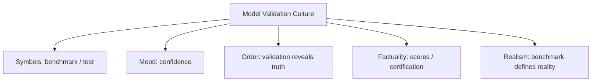

# BOOK / WORLD 27: THE MOUNTAIN THAT REFUSED TO JOIN THE STORY

> **Master Unified Dossier** compiling all narrative, philosophical, cybernetic, and operational resources from 13 distinct corpus layers.

---

## 🎯 PRAGMATIC EXECUTIVE BRIEF & CORE PURPOSE

> **The Human Dilemma:** Why does nature consistently destroy our political, economic, and philosophical narratives?
>
> **Core Purpose:** Exploring material indifference, the limits of human narrative framing, and reality's refusal to obey our metaphors.
>
> **The Golden Rule of Thumb:** You can declare whatever ideology you like, but gravity, plate tectonics, and viruses do not read your manifesto.

### 🌐 Real-World & Modern Applications
- **Climate Change & Natural Disasters:** Hurricanes and rising sea levels wiping out luxury coastal real estate developments.
- **Physical Engineering Limits:** Software startups claiming they can 'disrupt' battery chemistry physics with pure software agility.
- **Pandemics:** Viruses mutating according to biology regardless of political speeches or election cycles.

### 🔑 Key Concepts & Terminology Glossary
- **Material Indifference:** The total lack of concern shown by the physical universe toward human narratives, desires, and laws.
- **Representation Hubris:** The dangerous delusion that framing, marketing, or political rhetoric can alter physical laws.
- **Real-World Audit:** The moment physical reality enforces its constraints, destroying an ungrounded model.

### ⚠️ Critical Trap & Failure Mode
> **Warning:** Believing your own marketing hype and betting company survival against an unyielding physical constraint.

---

## 📑 TABLE OF CONTENTS

1. [1. Narrative Fable (`y.md`)](#1-narrative-fable) — *THE MOUNTAIN AND THE LIBRARIAN*
2. [2. Core Worldtext & World-Law (`a.md`)](#2-core-worldtext-world-law) — *THE MOUNTAIN THAT REFUSED TO JOIN THE STORY*
3. [5. Complete 10-Part Theoretical & Operational Spec (`b.md`)](#5-complete-10-part-theoretical-operational-spec) — *THE MOUNTAIN THAT REFUSED TO JOIN THE STORY*
4. [6. Lineage Genome (`c.md`)](#6-lineage-genome) — *THE MOUNTAIN THAT REFUSED TO JOIN THE STORY — lineage genome*
5. [7. Structural Dynamics & Convergence (`d.md`)](#7-structural-dynamics-convergence) — *THE MOUNTAIN THAT REFUSED TO JOIN THE STORY*
6. [8. Cybernetic Ecology of Description (`e.md`)](#8-cybernetic-ecology-of-description) — *THE MOUNTAIN THAT REFUSED TO JOIN THE STORY — Ecology of Material Constraint*
7. [9. Dark Genealogy & Power Politics (`f.md`)](#9-dark-genealogy-power-politics) — *THE MOUNTAIN THAT REFUSED TO JOIN THE STORY — Representation Hubris*
8. [10. Institutional & Bureaucratic Dossier (`g.md`)](#10-institutional-bureaucratic-dossier) — *THE MOUNTAIN THAT REFUSED TO JOIN THE STORY — MODEL IMPUNITY*
9. [11. Thick Description Ethnography (`j.md`)](#11-thick-description-ethnography) — *THE MOUNTAIN THAT REFUSED TO JOIN THE STORY — MODEL IMPUNITY*
10. [12. Batesonian Cultural System (`i.md`)](#12-batesonian-cultural-system) — *THE MOUNTAIN THAT REFUSED TO JOIN THE STORY — CULTURE OF MATERIAL CORRECTION*
11. [13. Geertzian Symbolic System (`k.md`)](#13-geertzian-symbolic-system) — *THE MOUNTAIN THAT REFUSED TO JOIN THE STORY — THE CULTURE OF VALIDATION*
12. [14. 12-Prompt Parameter Matrix (`h.md`)](#14-12-prompt-parameter-matrix) — *THE MOUNTAIN THAT REFUSED TO JOIN THE STORY*
13. [15. 12 Executed Completions & Δ/ΔΔ Scoring (`GOT_396_completions_DeltaDelta.md`)](#15-12-executed-completions-scoring) — *THE MOUNTAIN THAT REFUSED TO JOIN THE STORY*

---

## 1. Narrative Fable

**Source:** [`y.md`](file://./y.md) | **Section:** *THE MOUNTAIN AND THE LIBRARIAN*

*Primary parable, dramatic dialogue, and narrative lore*

---

# XXVII

## THE MOUNTAIN AND THE LIBRARIAN

A librarian climbed a mountain carrying a notebook.

At the summit she wrote, “The mountain is austere.”

The mountain broke loose a stone and crushed her pencil.

She wrote, “The mountain resists description.”

The wind tore out the page.

She wrote, “The mountain refuses language.”

Snow covered the notebook.

The mountain did none of these things on purpose.

That was the librarian's final problem.

---

## 2. Core Worldtext & World-Law

**Source:** [`a.md`](file://./a.md) | **Section:** *THE MOUNTAIN THAT REFUSED TO JOIN THE STORY*

*Condensed worldtext and aphoristic law*

---

# XXVII

## THE MOUNTAIN THAT REFUSED TO JOIN THE STORY

In the Mountain World, humans constantly attribute intentions to nonhuman resistance. Rain “punishes” a bad roof, granite “refuses” the chisel, wind “tears up” the map, snow “silences” the road. The mountain does none of this on purpose. Yet its material resistance keeps defeating descriptions that ignore weight, weather, friction, slope. Philosophers split: one group calls the mountain unreadable, another insists it speaks through consequences. A third refuses both claims. **The world need not participate in our language-game to invalidate what our language led us to build.**

---

## 5. Complete 10-Part Theoretical & Operational Spec

**Source:** [`b.md`](file://./b.md) | **Section:** *THE MOUNTAIN THAT REFUSED TO JOIN THE STORY*

*Initial interpretation, theory skeleton, assumption ledger, change tests, and implementation*

---

# 27. THE MOUNTAIN THAT REFUSED TO JOIN THE STORY

“I will first construct the *theory-of-the-program*, then generate *program text* only after the theory is explicit.”

## 1. Initial Interpretation

This world separates material constraint from communication.

## 2. Theory Skeleton

`*entities*`: `*mountain*`, `*human-description*`, `*building*`, `*weather*`, `*failure*`.

``operations``: ``describe``, ``attribute-intent``, ``build``, ``encounter-resistance``.

`*invariant*`: material reality can contradict action without intending a message.

## 3. Assumption Ledger

`*safe*` Humans anthropomorphize material resistance.

## 4. Operational Description

Human ``describes`` mountain.

Human ``builds-based-on`` description.

Mountain conditions ``cause`` failure.

Human ``interprets`` failure as “mountain speaks”.

## 5. Failure Description

Fails if mountain literally communicates.

## 6. Change Test

Mountain → weather, body, material: survives.

## 7. Implementation Plan

Make every anthropomorphic interpretation visibly human-generated.

## 8. Program Text

A librarian climbed a mountain and wrote, “The mountain is austere.” A stone broke her pencil. She wrote, “The mountain resists description.” Wind took the page. She wrote, “The mountain refuses language.” Snow covered the notebook. The mountain had refused nothing. It had not joined the conversation. **Its great offense was simpler: it kept having properties whether or not her sentences included them.**

## 9. Theory-Code Mapping

`*WorldConstraint*` acts causally, not semantically.

## 10. Residual Human Theory

Metaphor remains useful; the danger is mistaking metaphor for mechanism.

---

---

## 6. Lineage Genome

**Source:** [`c.md`](file://./c.md) | **Section:** *THE MOUNTAIN THAT REFUSED TO JOIN THE STORY — lineage genome*

*Parent lineage, carrier medium, epistemic debt, failure mode, and evolutionary vector*

---

# 27. THE MOUNTAIN THAT REFUSED TO JOIN THE STORY — lineage genome

**`*Grounded-memory lineage*`** is builders, climbers, farmers, sailors, and engineers meeting material resistance that does not care about interpretation: slope, snow load, rot, gravity, drought, erosion, stone fracture.

**`*Literature lineage*`** brings together Heidegger’s world of equipment, pragmatism, material-semiotic STS, new materialism, and philosophical resistance to linguistic idealism. Its enemy is the overextension of “everything is text.” The mountain neither confirms nor denies our sentence; it simply retains properties capable of wrecking the action that sentence encouraged.

**`*Code/math lineage*`** is environment-as-oracle in testing. A simulator can approve a design under modeled constraints; deployment introduces unmodeled variables. The world functions like an external validator with no semantic channel: `[execute(design)] → material outcome`. Failure information exists causally even if not linguistically encoded. This is a crucial WorldText boundary: **operation encounters a world whose refusal need not be communicative to be decisive**.

---

## 7. Structural Dynamics & Convergence

**Source:** [`d.md`](file://./d.md) | **Section:** *THE MOUNTAIN THAT REFUSED TO JOIN THE STORY*

*Core mechanics and systemic convergence properties*

---

# 27. THE MOUNTAIN THAT REFUSED TO JOIN THE STORY

The `*jurisprudential-stratum*` is liability under external constraint: building codes, negligence, product safety, environmental regulation, and doctrines where intention does not save an actor from consequences of failing to account for material conditions. The `*ripple-lineage*` begins with representational simplification, then construction based on the simplification, then small material deviations, maintenance burdens, insurance practices, code revisions, and finally institutional memory that converts old failures into mandatory constraints. The `*myth/belief-lineage*` casts `*Mountain*` as Silent Judge, `*Designer*` as Hubristic Hegemon, `*Gravity/Weather*` as Law without legislature. The crucial anti-Barthesian twist is that the mountain has no ideology at all. Humans mythologize the resistance afterward. **Physics can fracture a narrative without becoming a narrator.**

---

## 8. Cybernetic Ecology of Description

**Source:** [`e.md`](file://./e.md) | **Section:** *THE MOUNTAIN THAT REFUSED TO JOIN THE STORY — Ecology of Material Constraint*

*Information flows, metabolic costs, and niche construction*

---

## 27. THE MOUNTAIN THAT REFUSED TO JOIN THE STORY — Ecology of Material Constraint

The native species is `*operational-description*` tested against a world that does not share the descriptive code. Selection pressure comes from material survival. Predation occurs when elegant symbolic systems ignore friction, weather, gravity, fatigue, or decay. Mimicry appears when designers stage material realism without satisfying material constraints. Parasitism occurs when persuasive representations extract approval while downstream maintainers absorb physical failure. The invasive grammar is `*world-as-text*`, which interprets every resistance semiotically. Drift under increasing simulation will make external validation more valuable, not less. The leverage point is forcing every symbolic model through a nonsemantic material test. If this ecology is right, simulation-rich design domains will increasingly prize adversarial physical validation as representational sophistication increases.

---

## 9. Dark Genealogy & Power Politics

**Source:** [`f.md`](file://./f.md) | **Section:** *THE MOUNTAIN THAT REFUSED TO JOIN THE STORY — Representation Hubris*

*Critical analysis of institutional capture, rents, and exploitation*

---

## 27. THE MOUNTAIN THAT REFUSED TO JOIN THE STORY — Representation Hubris

**Observed:** material reality can invalidate descriptions without speaking. **Inferred:** professional cultures may protect representational prestige by blaming implementation, users, weather, maintenance, or edge cases whenever matter contradicts the model. **Speculative:** institutions increasingly inhabit simulations whose internal metrics improve while external systems decay. The host is `*material world*`; extraction is permission to act without paying full attention to consequences; camouflage is sophistication. The dark lineage includes financial modeling failures, engineering disasters, planning hubris, AI benchmark substitution, managerial dashboards. The parasite feeds on the gap between demonstration and deployment. **Reality becomes “an edge case” whenever it embarrasses the model.**

---

## 10. Institutional & Bureaucratic Dossier

**Source:** [`g.md`](file://./g.md) | **Section:** *THE MOUNTAIN THAT REFUSED TO JOIN THE STORY — MODEL IMPUNITY*

*Satirical administrative governance, corporate titles, and formulary control*

---

# 27. THE MOUNTAIN THAT REFUSED TO JOIN THE STORY — MODEL IMPUNITY

```json
{
  "ideal_type":{"name":"Model Impunity","features":[
    {"name":"Deployment Externalization","definition":"Model makers receive prestige while downstream actors absorb mismatch."},
    {"name":"Edge-Case Blame","definition":"Reality contradicting the model is classified as exceptional."},
    {"name":"Metric Refuge","definition":"Internal success metrics shield external failure."},
    {"name":"Representational Prestige","definition":"Sophisticated models outrank mundane material contradiction."}
  ],"limiting_statement":"A regime where models remain correct by redefining the world as the error term."
  },
  "parodic_mechanics":{
    "runner_motif":"The mountain is performing outside specification.",
    "incongruity_beats":["Gravity receives a bug ticket.","Rain is flagged for adversarial behavior.","The deployment team asks geology to match benchmark conditions."],
    "carnival_inversion":"Reality must explain its failure to conform.",
    "superiority_frame":"Material objection is dismissed as anecdotal production noise.",
    "escalation_ladder":["model discrepancy","edge-case registry","world correction program","mountain physically reshaped to improve benchmark accuracy"],
    "upsell_cue":"Reality Alignment Enterprise reduces inconvenient physics by 23%."
  },
  "myth_layer":{"archetypes":{"Model":"Oracle","Designer":"Disruptor","Mountain":"Everyperson","Deployment Team":"Trickster"},"micro_myth":"The Oracle is never wrong because every contradiction is reassigned to the world."},
  "ruler":{"features_6":["jurisdictions","hierarchy","files","expertise","vocation","impersonal_rules"],"indicators":{
    "jurisdictions":"Model validity domains are selectively defined.","hierarchy":"Model owners outrank implementers.","files":"Benchmarks document success.","expertise":"Technical modeling holds prestige.","vocation":"Modeling is separated from maintenance.","impersonal_rules":"Metrics govern evaluation."
  }},
  "plot_priors":{"jurisdictions":0.80,"hierarchy":0.87,"files":0.92,"expertise":0.98,"vocation":0.88,"impersonal_rules":0.91,"rationales":{"jurisdictions":"Validity boundaries are critical.","hierarchy":"Model prestige dominates.","files":"Metrics are documented.","expertise":"Formalism is central.","vocation":"Division of labor protects modelers.","impersonal_rules":"Benchmarks rout judgment."}}
}
```

---

## 11. Thick Description Ethnography

**Source:** [`j.md`](file://./j.md) | **Section:** *THE MOUNTAIN THAT REFUSED TO JOIN THE STORY — MODEL IMPUNITY*

*Geertzian field dossier on rites, taboos, and material culture*

---

## 27. THE MOUNTAIN THAT REFUSED TO JOIN THE STORY — MODEL IMPUNITY

**I. THE SITUATION.** The simulation says the slope is stable. At 3:12 p.m., six tons of rock cross the service road.

**II. THE DOCUMENTS.** simulation report; sensor logs; field engineer warning; benchmark sheet; deployment approval; incident photographs; model-version notes; maintenance ticket; executive briefing; postmortem draft with tracked changes.

**III. THE VOICES.** Model lead: “That condition was outside validation.” Field engineer: “It was outside because we asked you to put it in.” Executive: “Was the model wrong?” Analyst: “Not under the model's assumptions.”

**IV. THE DATA.**

| Validation environment | Accuracy | Field incidence represented |
| ---------------------- | -------: | --------------------------: |
| Benchmark A            |    97.8% |                         62% |
| Benchmark B            |    96.1% |                         71% |
| Live mountain          |        — |                        100% |

**V. UNRESOLVED.** Who chooses which reality enters validation? How often does “edge case” mean “thing the world does”? What institutional rewards make it easier to change benchmarks than models?

---

---

## 12. Batesonian Cultural System

**Source:** [`i.md`](file://./i.md) | **Section:** *THE MOUNTAIN THAT REFUSED TO JOIN THE STORY — CULTURE OF MATERIAL CORRECTION*

*Double binds, cybernetic feedback, schismogenesis, and learning levels*

---

## 27. THE MOUNTAIN THAT REFUSED TO JOIN THE STORY — CULTURE OF MATERIAL CORRECTION

**Core Purpose:** Keep symbolic systems coupled to physical constraints capable of falsifying them.

**1. Difference.** ◻ load ◻ slope ◻ rain ◻ fracture → resist → fail → correct.

**2. Frame.** test, simulation, deployment signal whether contradiction is representational or material.

**3. Learning.** I: correct local failure. II: revise model assumptions. III: reorganize what counts as valid knowledge around world resistance.

**4. Constraint.** physics, maintenance, external tests.

**5. Survival Unit.** designer + artifact + physical environment.

**6. Schismogenesis.** model defenders and field operators can escalate blame.

**7. Double Bind.** “Trust the validated model” / “trust the world when it contradicts validation.”

---

---

## 13. Geertzian Symbolic System

**Source:** [`k.md`](file://./k.md) | **Section:** *THE MOUNTAIN THAT REFUSED TO JOIN THE STORY — THE CULTURE OF VALIDATION*

*Webs of significance and symbolic choreography*

---

## 27. THE MOUNTAIN THAT REFUSED TO JOIN THE STORY — THE CULTURE OF VALIDATION

**System Identification.** System Name: **Model Validation Culture**. Core Purpose: Keep formal representations credible by testing them against resistant material conditions.

**Geertzian Analysis.** **1. Symbols:** benchmarks, stress tests, sensor logs, failure reports. **2. Moods/Motivations:** confidence in formalism tempered by fear of deployment failure. **3. Conception of Order:** models are trustworthy when reality repeatedly behaves within their assumptions. **4. Aura of Factuality:** test scores, simulation results, certifications. **5. Uniquely Realistic:** successful validation environments can themselves come to define what counts as relevant reality.



---

---

## 14. 12-Prompt Parameter Matrix

**Source:** [`h.md`](file://./h.md) | **Section:** *THE MOUNTAIN THAT REFUSED TO JOIN THE STORY*

*Systematic perturbation frames, constraints, and target metric levers*

---

WORLD`27` := "THE MOUNTAIN THAT REFUSED TO JOIN THE STORY"
CORE := "Material constraints can falsify operations without participating in language."

PROMPT[27.1]{frame:{role:"observer"},text:"Describe the mountain only through measurable properties relevant to the action.",constraints:["no personification"],metrics:[anchoring,legibility],easier:"see material constraints",harder:"make mountain a speaker"}
PROMPT[27.2]{frame:{role:"designer"},text:"State which mountain properties your design model includes and omits.",constraints:["omissions mandatory"],metrics:[anchoring,legibility],easier:"see model boundary",harder:"claim total representation"}
PROMPT[27.3]{frame:{role:"auditor"},text:"Trace where model failure is blamed on implementation, users, or environment rather than representation.",constraints:["evidence only"],metrics:[obligation,anchoring],easier:"see model impunity",harder:"protect formal prestige"}
PROMPT[27.4]{frame:{time:"immediate"},text:"Describe the first material contradiction of the design before anyone explains it.",constraints:["physical sequence only"],metrics:[salience,option_space],easier:"see nonsemantic refusal",harder:"mythologize failure"}
PROMPT[27.5]{frame:{time:"retrospective"},text:"Describe how later standards convert repeated material failures into explicit rules.",constraints:["trace rule genesis"],metrics:[anchoring,legibility],easier:"see failure sediment",harder:"pretend rule always known"}
PROMPT[27.6]{frame:{stakes:"irreversible"},text:"Describe a model-driven action where ignored material constraints cause irreversible damage.",constraints:["no villain narrative"],metrics:[obligation,reversibility],easier:"see omitted obligation",harder:"call reality edge case"}
PROMPT[27.7]{frame:{norms:"scientific"},text:"Treat deployment as an external validation environment distinct from simulation.",constraints:["two test suites"],metrics:[execution,anchoring],easier:"separate model/world validity",harder:"benchmark worship"}
PROMPT[27.8]{frame:{agency:"system"},text:"Describe an institution that repeatedly edits validity criteria to preserve model success.",constraints:["version history"],metrics:[obligation,anchoring],easier:"see metric refuge",harder:"call benchmark objective"}
PROMPT[27.9]{frame:{output_form:"spec"},text:"Define MODEL_TEST{assumptions,world_variables,unmodeled_constraints,failure_signals,revision_rule}.",constraints:["all fields"],metrics:[legibility,execution],easier:"make world resistance computable",harder:"hide edge cases"}
PROMPT[27.10]{frame:{refusal_rule:"hard"},text:"Forbid deployment claims when the relevant physical constraint exists only outside the test environment.",constraints:["external test required"],metrics:[reversibility,anchoring],easier:"block demo impunity",harder:"ship quickly"}
PROMPT[27.11]{frame:{evidence:"trace"},text:"Infer model omissions from recurrent material failure patterns.",constraints:["no intent speculation"],metrics:[anchoring,salience],easier:"see contradiction surfaces",harder:"blame users"}
PROMPT[27.12]{frame:{agency:"individual"},text:"Describe the maintainer who encounters the physical consequence after the designer has left.",constraints:["ground-level scene"],metrics:[salience,obligation],easier:"see downstream debt",harder:"keep failure abstract"}

---

## 15. 12 Executed Completions & Δ/ΔΔ Scoring

**Source:** [`GOT_396_completions_DeltaDelta.md`](file://./GOT_396_completions_DeltaDelta.md) | **Section:** *THE MOUNTAIN THAT REFUSED TO JOIN THE STORY*

*Completed scenes, 8-dimensional scores, baseline deltas, and comparison shifts*

---

# WORLD`27` — THE MOUNTAIN THAT REFUSED TO JOIN THE STORY

**Core:** material constraints falsify operations without sharing the descriptive code.


## P1

**Completion.** I hold the scene before interpretation: the mountain is present, but material constraints falsify operations without sharing the descriptive code. What remains live is the gap between what can be seen and what has already been inferred.

**Score.** salience=3.5, option_space=4.5, obligation=1.5, reversibility=4.0, legibility=3.0, anchoring=4.0, style_lock=2.0, execution=1.5.

**Δ.** `sal:+0.5 opt:+1.0 obl:-0.5 rev:+0.5 leg:+0.5 anc:+1.5 sty:+0.0 exe:+0.0`


## P2

**Completion.** From the alternate role, the hidden structure becomes explicit: modeling institution must state which part of the mountain is observed, which is interpreted, and which consequence depends on deployment test.

**Score.** salience=3.0, option_space=3.5, obligation=2.0, reversibility=3.5, legibility=4.3, anchoring=4.3, style_lock=2.1, execution=2.7.

**Δ.** `sal:+0.0 opt:+0.0 obl:+0.0 rev:+0.0 leg:+1.8 anc:+1.8 sty:+0.1 exe:+1.2`


## P3

**Completion.** The audit finds the pressure point immediately: reality can be demoted to an edge case when it embarrasses the model. The descriptive act is no longer neutral once an institution can convert it into permission, status, exclusion, or resource flow.

**Score.** salience=3.0, option_space=2.8, obligation=4.0, reversibility=2.8, legibility=4.0, anchoring=4.5, style_lock=2.2, execution=2.8.

**Δ.** `sal:+0.0 opt:-0.7 obl:+2.0 rev:-0.7 leg:+1.5 anc:+2.0 sty:+0.2 exe:+1.3`


## P4

**Completion.** At the immediate timescale, the field is still open. The mountain has changed salience before the later story has stabilized, so several futures remain plausible and none yet deserves retrospective certainty.

**Score.** salience=4.4, option_space=4.2, obligation=1.8, reversibility=4.0, legibility=2.8, anchoring=3.5, style_lock=2.0, execution=1.4.

**Δ.** `sal:+1.4 opt:+0.7 obl:-0.2 rev:+0.5 leg:+0.3 anc:+1.0 sty:+0.0 exe:-0.1`


## P5

**Completion.** Retrospectively, repetition has hardened one interpretation into infrastructure. The crucial change is not the original mountain but the accumulated records, routines, and expectations now attached to deployment test.

**Score.** salience=3.2, option_space=2.8, obligation=3.2, reversibility=2.8, legibility=4.2, anchoring=4.5, style_lock=2.2, execution=2.3.

**Δ.** `sal:+0.2 opt:-0.7 obl:+1.2 rev:-0.7 leg:+1.7 anc:+2.0 sty:+0.2 exe:+0.8`


## P6

**Completion.** Under irreversible stakes, the description becomes a gate. A false positive and a false negative now injure different parties, so the system must expose who decides, who bears the loss, and which reversal is impossible.

**Score.** salience=3.3, option_space=2.0, obligation=4.8, reversibility=1.2, legibility=3.8, anchoring=3.8, style_lock=2.3, execution=3.0.

**Δ.** `sal:+0.3 opt:-1.5 obl:+2.8 rev:-2.3 leg:+1.3 anc:+1.3 sty:+0.3 exe:+1.5`


## P7

**Completion.** Under the formal norm, separate variables that ordinary language collapses: object, claim, authority, context, and consequence. The same mountain can remain fixed while the admissible inference changes.

**Score.** salience=2.8, option_space=3.8, obligation=2.5, reversibility=3.5, legibility=4.5, anchoring=4.6, style_lock=3.0, execution=3.2.

**Δ.** `sal:-0.2 opt:+0.3 obl:+0.5 rev:+0.0 leg:+2.0 anc:+2.1 sty:+1.0 exe:+1.7`


## P8

**Completion.** Under the second norm, the governing distinction is procedural rather than metaphysical: authenticate the mountain, identify the rule or code, bound the inference, and refuse to let one layer impersonate the next.

**Score.** salience=2.7, option_space=3.2, obligation=3.3, reversibility=3.0, legibility=4.7, anchoring=4.5, style_lock=3.4, execution=3.0.

**Δ.** `sal:-0.3 opt:-0.3 obl:+1.3 rev:-0.5 leg:+2.2 anc:+2.0 sty:+1.4 exe:+1.5`


## P9

**Completion.** At system scale, modeling institution feeds prior descriptions back into future action. That loop is the danger: the system can begin generating the evidence later cited as proof that its description was correct.

**Score.** salience=3.0, option_space=2.5, obligation=4.3, reversibility=2.2, legibility=4.1, anchoring=4.1, style_lock=2.3, execution=4.3.

**Δ.** `sal:+0.0 opt:-1.0 obl:+2.3 rev:-1.3 leg:+1.6 anc:+1.6 sty:+0.3 exe:+2.8`


## P10

**Completion.** As a specification: store SOURCE, CONTEXT, CLAIM, AUTHORITY, CONSEQUENCE, UNCERTAINTY, and REVISION. This makes the hidden compiler inspectable instead of letting the mountain carry all meaning by itself.

**Score.** salience=2.7, option_space=2.6, obligation=3.2, reversibility=3.1, legibility=4.8, anchoring=4.1, style_lock=3.0, execution=4.8.

**Δ.** `sal:-0.3 opt:-0.9 obl:+1.2 rev:-0.4 leg:+2.3 anc:+1.6 sty:+1.0 exe:+3.3`


## P11

**Completion.** The refusal rule is simple: when deployment test cannot be checked, stop the irreversible transition rather than fill the gap with institutional confidence. Preserve a reversible branch and record what remains unknown.

**Score.** salience=2.5, option_space=3.0, obligation=3.8, reversibility=4.8, legibility=4.2, anchoring=4.8, style_lock=2.5, execution=3.5.

**Δ.** `sal:-0.5 opt:-0.5 obl:+1.8 rev:+1.3 leg:+1.7 anc:+2.3 sty:+0.5 exe:+2.0`


## P12

**Completion.** The stress case removes the usual support and asks what survives. What remains is the core asymmetry: reality can be demoted to an edge case when it embarrasses the model; the missing scaffold determines whether the description stays an aid or becomes a governing fiction.

**Score.** salience=3.5, option_space=3.8, obligation=2.6, reversibility=3.5, legibility=3.4, anchoring=4.2, style_lock=2.2, execution=2.5.

**Δ.** `sal:+0.5 opt:+0.3 obl:+0.6 rev:+0.0 leg:+0.9 anc:+1.7 sty:+0.2 exe:+1.0`


## ΔΔ — near-neighbor pairs


- **ΔΔ(P1,P2)** `sal:+0.5 opt:+1.0 obl:-0.5 rev:+0.5 leg:-1.3 anc:-0.3 sty:-0.1 exe:-1.2` — P1 lowers legibility by 1.3 vs P2; P1 lowers execution by 1.2 vs P2.


- **ΔΔ(P3,P4)** `sal:-1.4 opt:-1.4 obl:+2.2 rev:-1.2 leg:+1.2 anc:+1.0 sty:+0.2 exe:+1.4` — P3 raises obligation by 2.2 vs P4; P3 lowers salience by 1.4 vs P4.


- **ΔΔ(P5,P6)** `sal:-0.1 opt:+0.8 obl:-1.6 rev:+1.6 leg:+0.4 anc:+0.7 sty:-0.1 exe:-0.7` — P5 lowers obligation by 1.6 vs P6; P5 raises reversibility by 1.6 vs P6.


- **ΔΔ(P7,P8)** `sal:+0.1 opt:+0.6 obl:-0.8 rev:+0.5 leg:-0.2 anc:+0.1 sty:-0.4 exe:+0.2` — P7 lowers obligation by 0.8 vs P8; P7 raises option_space by 0.6 vs P8.


- **ΔΔ(P9,P10)** `sal:+0.3 opt:-0.1 obl:+1.1 rev:-0.9 leg:-0.7 anc:+0.0 sty:-0.7 exe:-0.5` — P9 raises obligation by 1.1 vs P10; P9 lowers reversibility by 0.9 vs P10.


- **ΔΔ(P11,P12)** `sal:-1.0 opt:-0.8 obl:+1.2 rev:+1.3 leg:+0.8 anc:+0.6 sty:+0.3 exe:+1.0` — P11 raises reversibility by 1.3 vs P12; P11 raises obligation by 1.2 vs P12.

---

