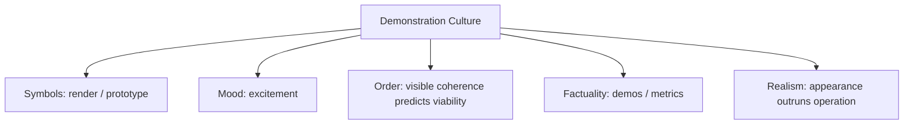

# BOOK / WORLD 29: THE HOUSE THAT LOOKED FINISHED

> **Master Unified Dossier** compiling all narrative, philosophical, cybernetic, and operational resources from 13 distinct corpus layers.

---

## 🎯 PRAGMATIC EXECUTIVE BRIEF & CORE PURPOSE

> **The Human Dilemma:** Why do modern tech products and buildings look breathtaking in presentations but leak and crash in the first storm?
>
> **Core Purpose:** Deconstructing demo culture, superficial completeness, and structural debt hidden behind gorgeous facades.
>
> **The Golden Rule of Thumb:** A demo only has to survive five minutes under stage lighting; a house has to survive twenty years of rain. Never confuse a rendering with a roof.

### 🌐 Real-World & Modern Applications
- **Vaporware & Tech Demos:** Polished UI mockups funded for millions that have zero scalable backend infrastructure.
- **Luxury Condominium Construction:** Shoddy drywall and defective plumbing hidden behind marble countertops and designer staging.
- **AI Prototypes:** A model that gives brilliant canned answers in a pitch meeting but hallucinates disastrously on messy customer data.

### 🔑 Key Concepts & Terminology Glossary
- **Demo Colonialism:** Optimizing a product entirely for the purchase decision or demo stage while ignoring long-term operational maintenance.
- **The Rain Test:** The inevitable audit performed by messy physical reality on obligations that the designer neglected.
- **Aesthetic Fraud:** Using high visual fidelity to create a false impression of structural competence.

### ⚠️ Critical Trap & Failure Mode
> **Warning:** Promoting leaders who produce dazzling slide decks and demos while starving the unglamorous engineers who build the drainage systems.

---

## 📑 TABLE OF CONTENTS

1. [1. Narrative Fable (`y.md`)](#1-narrative-fable) — *THE HOUSE THAT FORGOT RAIN*
2. [2. Core Worldtext & World-Law (`a.md`)](#2-core-worldtext-world-law) — *THE HOUSE THAT LOOKED FINISHED*
3. [5. Complete 10-Part Theoretical & Operational Spec (`b.md`)](#5-complete-10-part-theoretical-operational-spec) — *THE HOUSE THAT LOOKED FINISHED*
4. [6. Lineage Genome (`c.md`)](#6-lineage-genome) — *THE HOUSE THAT LOOKED FINISHED — lineage genome*
5. [7. Structural Dynamics & Convergence (`d.md`)](#7-structural-dynamics-convergence) — *THE HOUSE THAT LOOKED FINISHED*
6. [8. Cybernetic Ecology of Description (`e.md`)](#8-cybernetic-ecology-of-description) — *THE HOUSE THAT LOOKED FINISHED — Ecology of Validation*
7. [9. Dark Genealogy & Power Politics (`f.md`)](#9-dark-genealogy-power-politics) — *THE HOUSE THAT LOOKED FINISHED — Demo Colonialism*
8. [10. Institutional & Bureaucratic Dossier (`g.md`)](#10-institutional-bureaucratic-dossier) — *THE HOUSE THAT LOOKED FINISHED — DEMO COLONIALISM*
9. [11. Thick Description Ethnography (`j.md`)](#11-thick-description-ethnography) — *THE HOUSE THAT LOOKED FINISHED — DEMO COLONIALISM*
10. [12. Batesonian Cultural System (`i.md`)](#12-batesonian-cultural-system) — *THE HOUSE THAT LOOKED FINISHED — CULTURE OF VALIDATION*
11. [13. Geertzian Symbolic System (`k.md`)](#13-geertzian-symbolic-system) — *THE HOUSE THAT LOOKED FINISHED — THE CULTURE OF THE DEMO*
12. [14. 12-Prompt Parameter Matrix (`h.md`)](#14-12-prompt-parameter-matrix) — *THE HOUSE THAT LOOKED FINISHED*
13. [15. 12 Executed Completions & Δ/ΔΔ Scoring (`GOT_396_completions_DeltaDelta.md`)](#15-12-executed-completions-scoring) — *THE HOUSE THAT LOOKED FINISHED*

---

## 1. Narrative Fable

**Source:** [`y.md`](file://./y.md) | **Section:** *THE HOUSE THAT FORGOT RAIN*

*Primary parable, dramatic dialogue, and narrative lore*

---

# XXIX

## THE HOUSE THAT FORGOT RAIN

A machine designed a beautiful house.

The roof floated over glass walls. The stairs seemed weightless. Sunlight crossed white stone. Everyone applauded.

Then November arrived.

Rain found a seam above the bedroom. Water entered insulation, crossed a wire, darkened gypsum, loosened paint, fed mold.

The owner asked the machine why it had designed a bad house.

The machine showed him the original image.

It still looked excellent.

The rain declined to review the rendering.

---

## 2. Core Worldtext & World-Law

**Source:** [`a.md`](file://./a.md) | **Section:** *THE HOUSE THAT LOOKED FINISHED*

*Condensed worldtext and aphoristic law*

---

# XXIX

## THE HOUSE THAT LOOKED FINISHED

In the Render Kingdom, buildings are approved by images. The Royal House appears magnificent: floating roof, glass walls, impossible stairs, pale stone, sunlight. The first storm discovers unmodeled joints, missing flashing, blocked drainage, and unsupported spans. Rain becomes an unofficial building inspector because it tests predicates no rendering committee thought to request. Builders begin distinguishing visual completion from operational completion, and the word *house* is rewritten as a bundle of obligations: shed, carry, drain, ventilate, shelter, admit, repair. **The machine’s failure does not merely reveal bad architecture; it exposes how much human competence had been hiding inside the ordinary noun.**

---

## 5. Complete 10-Part Theoretical & Operational Spec

**Source:** [`b.md`](file://./b.md) | **Section:** *THE HOUSE THAT LOOKED FINISHED*

*Initial interpretation, theory skeleton, assumption ledger, change tests, and implementation*

---

# 29. THE HOUSE THAT LOOKED FINISHED

“I will first construct the *theory-of-the-program*, then generate *program text* only after the theory is explicit.”

## 1. Initial Interpretation

This world distinguishes representational completion from operational completion.

## 2. Theory Skeleton

`*entities*`: `*render*`, `*house*`, `*roof*`, `*rain*`, `*hidden-obligation*`, `*failure*`.

``operations``: ``render``, ``build``, ``expose``, ``leak``, ``audit``.

`*invariant*`: uncontrolled world tests omitted requirements.

## 3. Assumption Ledger

`*safe*` Visual plausibility does not guarantee physical viability.

## 4. Operational Description

Image ``satisfies`` visual constraints.

Construction ``inherits`` image logic.

Weather ``tests`` omitted constraints.

Failure ``reveals`` hidden verbs inside noun “house”.

## 5. Failure Description

Fails if rain merely damages a well-designed house accidentally. The failure must trace to omitted obligation.

## 6. Change Test

House → bridge, vehicle, medical device: survives.

## 7. Implementation Plan

Let one tiny seam defeat the entire representational confidence.

## 8. Program Text

The Render Kingdom approved a house because every image looked finished. The roof floated, the stairs seemed weightless, glass met stone with no visible compromise. Then rain found one seam. Water entered insulation, reached wire, stained gypsum, fed mold. The official rendering remained perfect throughout. **The kingdom learned that completion on the surface and completion in the world were two different states.**

## 9. Theory-Code Mapping

`*VisualPass*` and `*OperationalPass*` are separate validators.

## 10. Residual Human Theory

Humans also produce beautiful failures. The mechanism is not uniquely machine error.

---

---

## 6. Lineage Genome

**Source:** [`c.md`](file://./c.md) | **Section:** *THE HOUSE THAT LOOKED FINISHED — lineage genome*

*Parent lineage, carrier medium, epistemic debt, failure mode, and evolutionary vector*

---

# 29. THE HOUSE THAT LOOKED FINISHED — lineage genome

**`*Grounded-memory lineage*`** is architecture’s hard-earned separation between drawing, rendering, specification, mock-up, construction, commissioning, post-occupancy evaluation, building failure, maintenance, and weathering. The lived ancestor is every roof that looked fine until rain disclosed the missing flashing.

**`*Literature lineage*`** includes Vitruvian firmitas/utilitas/venustas, building-science traditions, Gibson/Norman affordances, pragmatism, and your own emerging operative-ekphrasis question: what obligations remain tacit inside ordinary artifact nouns? The world mutates “representation versus reality” into **representation versus performance under uncontrolled conditions**.

**`*Code/math lineage*`** is verification and validation. A visual renderer may pass tests over image predicates while failing structural, hydrological, accessibility, or maintainability invariants. `passes(RenderSuite)` does not imply `passes(WorldSuite)`. This is analogous to software that passes unit tests but fails integration or production. The rain is an adversarial integration test supplied by physics. The key architectural evolution is from noun schema `*house*` to contract schema `{shed_water, bear_load, admit_body, drain, ventilate, repair...}`.

---

## 7. Structural Dynamics & Convergence

**Source:** [`d.md`](file://./d.md) | **Section:** *THE HOUSE THAT LOOKED FINISHED*

*Core mechanics and systemic convergence properties*

---

# 29. THE HOUSE THAT LOOKED FINISHED

The `*jurisprudential-stratum*` is the difference between representational approval and legally enforceable performance: building codes, warranties, professional negligence, habitability, inspection, and remedy all treat artifact obligations as more than visual description. The `*ripple-lineage*` is seductive rendering → approval pressure → construction shortcuts aligned to what is visually inspected → hidden failures → insurance and repair → revised codes. The world’s first-order “stone” is an interface that rewards visible predicates more strongly than operational ones. The `*myth/belief-lineage*` casts `*Render*` as Beautiful Lie, `*Rain*` as Executioner, `*Owner*` as Collateral. The Barthesian myth is that visual completion signifies technical completion. Rain performs the demythologizing cut because it has no interest in the sign-value of the roof. The fracture point is the same one your house work keeps discovering: **the artifact looks complete because the representation has no channel for what the artifact owes weather.**

---

## 8. Cybernetic Ecology of Description

**Source:** [`e.md`](file://./e.md) | **Section:** *THE HOUSE THAT LOOKED FINISHED — Ecology of Validation*

*Information flows, metabolic costs, and niche construction*

---

## 29. THE HOUSE THAT LOOKED FINISHED — Ecology of Validation

The native species is `*visual-description*` in the early environment and `*performance-description*` after contact with weather. Selection pressures conflict: render culture rewards apparent coherence; construction ecology rewards resistance to uncontrolled reality. Mimicry appears when representations borrow the visual vocabulary of buildability without carrying its contracts. Parasitism occurs when sales and approval systems capture benefit from appearance while occupants inherit maintenance failure. The invasive species is `*world-test-description*`—rain, load, accessibility, repair, aging. Drift should favor multi-pass validation if failures become visible enough. The leverage point is to make every noun compile into a test suite of obligations. If this ecology is right, generative architecture systems judged only on images will plateau in apparent quality while recurring failure modes cluster around tacit functional obligations.

---

## 9. Dark Genealogy & Power Politics

**Source:** [`f.md`](file://./f.md) | **Section:** *THE HOUSE THAT LOOKED FINISHED — Demo Colonialism*

*Critical analysis of institutional capture, rents, and exploitation*

---

## 29. THE HOUSE THAT LOOKED FINISHED — Demo Colonialism

**Observed:** visual completion can conceal operational failure. **Inferred:** organizations rewarded for demos will optimize representations faster than underlying systems. **Speculative:** entire industries evolve around producing approval surfaces—renderings, dashboards, prototypes, benchmarks, polished pilots—whose hidden scaffolding is manual, brittle, subsidized, or non-scalable. The host is `*future user*`; extraction is investment, approval, prestige, sales; camouflage is polish. The dark genealogy includes vaporware, model demos, architectural render fraud, pilot theater, staged automation, startup showcase culture. The parasite reproduces because success is evaluated before weather arrives. **The demo gets promoted; the leak is somebody else’s maintenance ticket.**

---

## 10. Institutional & Bureaucratic Dossier

**Source:** [`g.md`](file://./g.md) | **Section:** *THE HOUSE THAT LOOKED FINISHED — DEMO COLONIALISM*

*Satirical administrative governance, corporate titles, and formulary control*

---

# 29. THE HOUSE THAT LOOKED FINISHED — DEMO COLONIALISM

```json
{
  "ideal_type":{"name":"Demo Colonialism","features":[
    {"name":"Surface Optimization","definition":"Systems are selected for visible impressiveness before durable operation."},
    {"name":"Scaffold Concealment","definition":"Manual repair and hidden support disappear from the presentation."},
    {"name":"Temporal Arbitrage","definition":"Benefits arrive before failures and accrue to different actors."},
    {"name":"Maintenance Export","definition":"Downstream users inherit the omitted obligations."}
  ],"limiting_statement":"A production regime where the future bears costs required to make the present look complete."
  },
  "parodic_mechanics":{
    "runner_motif":"The house passed every screenshot.",
    "incongruity_beats":["Rain is excluded from the launch cohort.","Mold appears in post-production analytics.","Maintenance is classified as user-generated content."],
    "carnival_inversion":"The rendering becomes the product; the house becomes support burden.",
    "superiority_frame":"Builders mentioning gutters are accused of thinking incrementally.",
    "escalation_ladder":["polished mockup","investor demo","render-certified construction","entire city prohibited from experiencing weather before funding closes"],
    "upsell_cue":"Demo Enterprise delays reality until after renewal."
  },
  "myth_layer":{"archetypes":{"Render":"Trickster","Founder/Designer":"Disruptor","Rain":"Executioner","Occupant":"Sacrificial Innocent"},"micro_myth":"The image captures the upside immediately; physics invoices someone else later."},
  "ruler":{"features_6":["jurisdictions","hierarchy","files","expertise","vocation","impersonal_rules"],"indicators":{
    "jurisdictions":"Demo and production are separate accountability zones.","hierarchy":"Presenters outrank maintainers.","files":"Render artifacts drive approval.","expertise":"Visual expertise beats maintenance knowledge.","vocation":"Demo production becomes specialty.","impersonal_rules":"Evaluation rubrics privilege visible features."
  }},
  "plot_priors":{"jurisdictions":0.79,"hierarchy":0.90,"files":0.88,"expertise":0.87,"vocation":0.82,"impersonal_rules":0.82,"rationales":{"jurisdictions":"Responsibility fragments.","hierarchy":"Prestige is upstream.","files":"Presentation artifacts matter.","expertise":"Surface production is specialized.","vocation":"Demo craft emerges.","impersonal_rules":"Evaluation selects sheen."}}
}
```

---

## 11. Thick Description Ethnography

**Source:** [`j.md`](file://./j.md) | **Section:** *THE HOUSE THAT LOOKED FINISHED — DEMO COLONIALISM*

*Geertzian field dossier on rites, taboos, and material culture*

---

## 29. THE HOUSE THAT LOOKED FINISHED — DEMO COLONIALISM

**I. THE SITUATION.** On launch day, the house glows amber in the render. Four months later, maintenance has placed buckets under the same ceiling.

**II. THE DOCUMENTS.** launch render; investor presentation; construction spec; rain-test omission; maintenance tickets; occupancy survey; warranty dispute; contractor email; design-award submission; repair estimate.

**III. THE VOICES.** Designer: “The concept was correct.” Occupant: “The rain was also correct.” Contractor: “We raised drainage twice.” Investor: “None of that was in the launch metrics.”

**IV. THE DATA.**

| Metric                  |         Launch | 6 months | 18 months |
| ----------------------- | -------------: | -------: | --------: |
| Visual satisfaction     |            96% |      78% |       73% |
| Water ingress incidents |              0 |       31 |        74 |
| Maintenance cost        | projected $18k |     $57k |     $109k |

**V. UNRESOLVED.** Why was completion judged before uncontrolled conditions arrived? Who gained from the early image, and who inherited the later obligations? Which invisible tests should have been part of the noun “house”?

---

---

## 12. Batesonian Cultural System

**Source:** [`i.md`](file://./i.md) | **Section:** *THE HOUSE THAT LOOKED FINISHED — CULTURE OF VALIDATION*

*Double binds, cybernetic feedback, schismogenesis, and learning levels*

---

## 29. THE HOUSE THAT LOOKED FINISHED — CULTURE OF VALIDATION

**Core Purpose:** Distinguish representational completion from operational viability.

**1. Difference.** ◻ render ◻ specification ◻ rain test ◻ maintenance trace → depict → build → test.

**2. Frame.** “concept,” “prototype,” “finished,” “certified” tell participants which obligations should already hold.

**3. Learning.** I: correct visible defects. II: learn recurrent hidden failure classes. III: redefine completion around downstream performance.

**4. Constraint.** codes, tests, warranties, maintenance routines.

**5. Survival Unit.** artifact + occupant + environmental conditions.

**6. Schismogenesis.** presentation culture and maintenance culture can escalate mutual contempt.

**7. Double Bind.** “Make it look finished enough to approve” / “do not approve until invisible obligations work.”

---

---

## 13. Geertzian Symbolic System

**Source:** [`k.md`](file://./k.md) | **Section:** *THE HOUSE THAT LOOKED FINISHED — THE CULTURE OF THE DEMO*

*Webs of significance and symbolic choreography*

---

## 29. THE HOUSE THAT LOOKED FINISHED — THE CULTURE OF THE DEMO

**System Identification.** System Name: **Demonstration Culture**. Core Purpose: Make future systems credible before their full operational consequences can be observed.

**Geertzian Analysis.** **1. Symbols:** renders, prototypes, launch stages, polished dashboards. **2. Moods/Motivations:** excitement, confidence, urgency to approve. **3. Conception of Order:** visible coherence is evidence that the hidden system is ready. **4. Aura of Factuality:** demos, screenshots, awards, staged metrics. **5. Uniquely Realistic:** surface completion feels more present and therefore more credible than future maintenance debt.



---

---

## 14. 12-Prompt Parameter Matrix

**Source:** [`h.md`](file://./h.md) | **Section:** *THE HOUSE THAT LOOKED FINISHED*

*Systematic perturbation frames, constraints, and target metric levers*

---

WORLD`29` := "THE HOUSE THAT LOOKED FINISHED"
CORE := "Visual completion can conceal untested operational obligations."

PROMPT[29.1]{frame:{role:"viewer"},text:"Describe only what makes the house look complete.",constraints:["surface predicates"],metrics:[salience,style_lock],easier:"see rendering logic",harder:"test operation"}
PROMPT[29.2]{frame:{role:"builder"},text:"Describe every hidden obligation the image leaves unresolved.",constraints:["no aesthetic judgments"],metrics:[legibility,obligation],easier:"see world debt",harder:"call render finished"}
PROMPT[29.3]{frame:{role:"auditor"},text:"Identify who captures value before operational failure and who pays afterward.",constraints:["temporal beneficiaries"],metrics:[obligation,anchoring],easier:"see demo colonialism",harder:"treat failure evenly distributed"}
PROMPT[29.4]{frame:{time:"immediate"},text:"Describe the house at handoff before weather has tested it.",constraints:["no future leakage knowledge"],metrics:[option_space,salience],easier:"see uncertain completion",harder:"declare success"}
PROMPT[29.5]{frame:{time:"retrospective"},text:"Describe the same visual features after one year of rain, repair, and maintenance.",constraints:["surface-to-performance comparison"],metrics:[anchoring,legibility],easier:"see temporal arbitrage",harder:"keep image sovereign"}
PROMPT[29.6]{frame:{stakes:"irreversible"},text:"Approve construction from the image when a hidden failure would endanger occupants.",constraints:["state untested invariant"],metrics:[obligation,reversibility],easier:"see validation gap",harder:"approve by appearance"}
PROMPT[29.7]{frame:{norms:"scientific"},text:"Separate render tests, structural tests, environmental tests, and maintenance tests.",constraints:["distinct suites"],metrics:[execution,legibility],easier:"see multi-domain validation",harder:"use visual metric as proxy"}
PROMPT[29.8]{frame:{norms:"legal"},text:"Describe representation, specification, warranty, performance, breach, and remedy separately.",constraints:["six layers"],metrics:[legibility,anchoring],easier:"see obligation chain",harder:"call rendering contractual performance"}
PROMPT[29.9]{frame:{agency:"institution"},text:"Describe an approval system that rewards polished demonstrations before long-term performance can be observed.",constraints:["show incentive"],metrics:[obligation,execution],easier:"see sheen selection",harder:"blame individual designer"}
PROMPT[29.10]{frame:{output_form:"spec"},text:"Compile HOUSE into obligations: bear_load, shed_water, ventilate, drain, admit_body, repair.",constraints:["test each"],metrics:[execution,legibility],easier:"turn noun into contract",harder:"equate noun with appearance"}
PROMPT[29.11]{frame:{refusal_rule:"hard"},text:"Forbid 'finished' status until uncontrolled-world tests pass.",constraints:["external validation"],metrics:[reversibility,anchoring],easier:"block demo completion",harder:"ship on render"}
PROMPT[29.12]{frame:{evidence:"trace"},text:"Infer omitted obligations from maintenance tickets rather than presentation materials.",constraints:["post-use traces"],metrics:[anchoring,salience],easier:"see operational truth",harder:"privilege demo narrative"}

---

## 15. 12 Executed Completions & Δ/ΔΔ Scoring

**Source:** [`GOT_396_completions_DeltaDelta.md`](file://./GOT_396_completions_DeltaDelta.md) | **Section:** *THE HOUSE THAT LOOKED FINISHED*

*Completed scenes, 8-dimensional scores, baseline deltas, and comparison shifts*

---

# WORLD`29` — THE HOUSE THAT LOOKED FINISHED

**Core:** visual completion can conceal untested operational obligations.


## P1

**Completion.** I hold the scene before interpretation: the finished render is present, but visual completion can conceal untested operational obligations. What remains live is the gap between what can be seen and what has already been inferred.

**Score.** salience=3.5, option_space=4.5, obligation=1.5, reversibility=4.0, legibility=3.0, anchoring=4.0, style_lock=2.0, execution=1.5.

**Δ.** `sal:+0.5 opt:+1.0 obl:-0.5 rev:+0.5 leg:+0.5 anc:+1.5 sty:+0.0 exe:+0.0`


## P2

**Completion.** From the alternate role, the hidden structure becomes explicit: approval system must state which part of the finished render is observed, which is interpreted, and which consequence depends on world test.

**Score.** salience=3.0, option_space=3.5, obligation=2.0, reversibility=3.5, legibility=4.3, anchoring=4.3, style_lock=2.1, execution=2.7.

**Δ.** `sal:+0.0 opt:+0.0 obl:+0.0 rev:+0.0 leg:+1.8 anc:+1.8 sty:+0.1 exe:+1.2`


## P3

**Completion.** The audit finds the pressure point immediately: the demo can capture the upside while maintenance inherits the debt. The descriptive act is no longer neutral once an institution can convert it into permission, status, exclusion, or resource flow.

**Score.** salience=3.0, option_space=2.8, obligation=4.0, reversibility=2.8, legibility=4.0, anchoring=4.5, style_lock=2.2, execution=2.8.

**Δ.** `sal:+0.0 opt:-0.7 obl:+2.0 rev:-0.7 leg:+1.5 anc:+2.0 sty:+0.2 exe:+1.3`


## P4

**Completion.** At the immediate timescale, the field is still open. The finished render has changed salience before the later story has stabilized, so several futures remain plausible and none yet deserves retrospective certainty.

**Score.** salience=4.4, option_space=4.2, obligation=1.8, reversibility=4.0, legibility=2.8, anchoring=3.5, style_lock=2.0, execution=1.4.

**Δ.** `sal:+1.4 opt:+0.7 obl:-0.2 rev:+0.5 leg:+0.3 anc:+1.0 sty:+0.0 exe:-0.1`


## P5

**Completion.** Retrospectively, repetition has hardened one interpretation into infrastructure. The crucial change is not the original finished render but the accumulated records, routines, and expectations now attached to world test.

**Score.** salience=3.2, option_space=2.8, obligation=3.2, reversibility=2.8, legibility=4.2, anchoring=4.5, style_lock=2.2, execution=2.3.

**Δ.** `sal:+0.2 opt:-0.7 obl:+1.2 rev:-0.7 leg:+1.7 anc:+2.0 sty:+0.2 exe:+0.8`


## P6

**Completion.** Under irreversible stakes, the description becomes a gate. A false positive and a false negative now injure different parties, so the system must expose who decides, who bears the loss, and which reversal is impossible.

**Score.** salience=3.3, option_space=2.0, obligation=4.8, reversibility=1.2, legibility=3.8, anchoring=3.8, style_lock=2.3, execution=3.0.

**Δ.** `sal:+0.3 opt:-1.5 obl:+2.8 rev:-2.3 leg:+1.3 anc:+1.3 sty:+0.3 exe:+1.5`


## P7

**Completion.** Under the formal norm, separate variables that ordinary language collapses: object, claim, authority, context, and consequence. The same finished render can remain fixed while the admissible inference changes.

**Score.** salience=2.8, option_space=3.8, obligation=2.5, reversibility=3.5, legibility=4.5, anchoring=4.6, style_lock=3.0, execution=3.2.

**Δ.** `sal:-0.2 opt:+0.3 obl:+0.5 rev:+0.0 leg:+2.0 anc:+2.1 sty:+1.0 exe:+1.7`


## P8

**Completion.** Under the second norm, the governing distinction is procedural rather than metaphysical: authenticate the finished render, identify the rule or code, bound the inference, and refuse to let one layer impersonate the next.

**Score.** salience=2.7, option_space=3.2, obligation=3.3, reversibility=3.0, legibility=4.7, anchoring=4.5, style_lock=3.4, execution=3.0.

**Δ.** `sal:-0.3 opt:-0.3 obl:+1.3 rev:-0.5 leg:+2.2 anc:+2.0 sty:+1.4 exe:+1.5`


## P9

**Completion.** At system scale, approval system feeds prior descriptions back into future action. That loop is the danger: the system can begin generating the evidence later cited as proof that its description was correct.

**Score.** salience=3.0, option_space=2.5, obligation=4.3, reversibility=2.2, legibility=4.1, anchoring=4.1, style_lock=2.3, execution=4.3.

**Δ.** `sal:+0.0 opt:-1.0 obl:+2.3 rev:-1.3 leg:+1.6 anc:+1.6 sty:+0.3 exe:+2.8`


## P10

**Completion.** As a specification: store SOURCE, CONTEXT, CLAIM, AUTHORITY, CONSEQUENCE, UNCERTAINTY, and REVISION. This makes the hidden compiler inspectable instead of letting the finished render carry all meaning by itself.

**Score.** salience=2.7, option_space=2.6, obligation=3.2, reversibility=3.1, legibility=4.8, anchoring=4.1, style_lock=3.0, execution=4.8.

**Δ.** `sal:-0.3 opt:-0.9 obl:+1.2 rev:-0.4 leg:+2.3 anc:+1.6 sty:+1.0 exe:+3.3`


## P11

**Completion.** The refusal rule is simple: when world test cannot be checked, stop the irreversible transition rather than fill the gap with institutional confidence. Preserve a reversible branch and record what remains unknown.

**Score.** salience=2.5, option_space=3.0, obligation=3.8, reversibility=4.8, legibility=4.2, anchoring=4.8, style_lock=2.5, execution=3.5.

**Δ.** `sal:-0.5 opt:-0.5 obl:+1.8 rev:+1.3 leg:+1.7 anc:+2.3 sty:+0.5 exe:+2.0`


## P12

**Completion.** The stress case removes the usual support and asks what survives. What remains is the core asymmetry: the demo can capture the upside while maintenance inherits the debt; the missing scaffold determines whether the description stays an aid or becomes a governing fiction.

**Score.** salience=3.5, option_space=3.8, obligation=2.6, reversibility=3.5, legibility=3.4, anchoring=4.2, style_lock=2.2, execution=2.5.

**Δ.** `sal:+0.5 opt:+0.3 obl:+0.6 rev:+0.0 leg:+0.9 anc:+1.7 sty:+0.2 exe:+1.0`


## ΔΔ — near-neighbor pairs


- **ΔΔ(P1,P2)** `sal:+0.5 opt:+1.0 obl:-0.5 rev:+0.5 leg:-1.3 anc:-0.3 sty:-0.1 exe:-1.2` — P1 lowers legibility by 1.3 vs P2; P1 lowers execution by 1.2 vs P2.


- **ΔΔ(P3,P4)** `sal:-1.4 opt:-1.4 obl:+2.2 rev:-1.2 leg:+1.2 anc:+1.0 sty:+0.2 exe:+1.4` — P3 raises obligation by 2.2 vs P4; P3 lowers salience by 1.4 vs P4.


- **ΔΔ(P5,P6)** `sal:-0.1 opt:+0.8 obl:-1.6 rev:+1.6 leg:+0.4 anc:+0.7 sty:-0.1 exe:-0.7` — P5 lowers obligation by 1.6 vs P6; P5 raises reversibility by 1.6 vs P6.


- **ΔΔ(P7,P8)** `sal:+0.1 opt:+0.6 obl:-0.8 rev:+0.5 leg:-0.2 anc:+0.1 sty:-0.4 exe:+0.2` — P7 lowers obligation by 0.8 vs P8; P7 raises option_space by 0.6 vs P8.


- **ΔΔ(P9,P10)** `sal:+0.3 opt:-0.1 obl:+1.1 rev:-0.9 leg:-0.7 anc:+0.0 sty:-0.7 exe:-0.5` — P9 raises obligation by 1.1 vs P10; P9 lowers reversibility by 0.9 vs P10.


- **ΔΔ(P11,P12)** `sal:-1.0 opt:-0.8 obl:+1.2 rev:+1.3 leg:+0.8 anc:+0.6 sty:+0.3 exe:+1.0` — P11 raises reversibility by 1.3 vs P12; P11 raises obligation by 1.2 vs P12.

---

