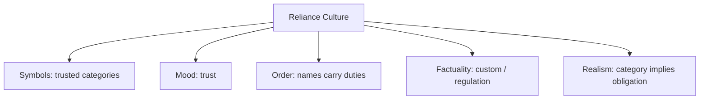

# BOOK / WORLD 30: THE REPUBLIC OF DEBTS

> **Master Unified Dossier** compiling all narrative, philosophical, cybernetic, and operational resources from 13 distinct corpus layers.

---

## 🎯 PRAGMATIC EXECUTIVE BRIEF & CORE PURPOSE

> **The Human Dilemma:** What does a chair owe a body? What does a roof owe a room? What does a promise owe tomorrow?
>
> **Core Purpose:** Exploring the implicit material obligations and functional promises packed into ordinary nouns.
>
> **The Golden Rule of Thumb:** A noun is not just a label; it is a bundle of promises. A chair that collapses under a seated person has stolen the name 'chair'.

### 🌐 Real-World & Modern Applications
- **Software Interface Contracts:** A function named `saveUser()` that fails to persist data to disk is committing semantic fraud.
- **Fiduciary Responsibility:** Financial advisors claiming the title 'advisor' while secretly pocketing kickbacks from predatory funds.
- **Food Labeling & Safety:** Selling synthetic chemicals under the name 'honey' or 'olive oil' when they lack the biological substance.

### 🔑 Key Concepts & Terminology Glossary
- **Noun Debt:** The implicit functional, structural, and ethical obligations a thing must satisfy to deserve its name.
- **Category Arbitrage:** Claiming the social prestige and pricing of a trusted noun while cutting the expensive obligations it requires.
- **Relational Integrity:** Maintaining the invisible bonds connecting tools to users, promises to futures, and labels to reality.

### ⚠️ Critical Trap & Failure Mode
> **Warning:** Using prestigious labels (e.g., 'Enterprise Grade', 'Secure', 'Organic') to mask cut-rate, failing implementations.

---

## 📑 TABLE OF CONTENTS

1. [1. Narrative Fable (`y.md`)](#1-narrative-fable) — *THE CHAIR'S DEBT*
2. [2. Core Worldtext & World-Law (`a.md`)](#2-core-worldtext-world-law) — *THE REPUBLIC OF DEBTS*
3. [5. Complete 10-Part Theoretical & Operational Spec (`b.md`)](#5-complete-10-part-theoretical-operational-spec) — *THE REPUBLIC OF DEBTS*
4. [6. Lineage Genome (`c.md`)](#6-lineage-genome) — *THE REPUBLIC OF DEBTS — lineage genome*
5. [7. Structural Dynamics & Convergence (`d.md`)](#7-structural-dynamics-convergence) — *THE REPUBLIC OF DEBTS*
6. [8. Cybernetic Ecology of Description (`e.md`)](#8-cybernetic-ecology-of-description) — *THE REPUBLIC OF DEBTS — Ecology of Obligations*
7. [9. Dark Genealogy & Power Politics (`f.md`)](#9-dark-genealogy-power-politics) — *THE REPUBLIC OF DEBTS — Obligation Laundering*
8. [10. Institutional & Bureaucratic Dossier (`g.md`)](#10-institutional-bureaucratic-dossier) — *THE REPUBLIC OF DEBTS — CATEGORY ARBITRAGE*
9. [11. Thick Description Ethnography (`j.md`)](#11-thick-description-ethnography) — *THE REPUBLIC OF DEBTS — CATEGORY ARBITRAGE*
10. [12. Batesonian Cultural System (`i.md`)](#12-batesonian-cultural-system) — *THE REPUBLIC OF DEBTS — CULTURE OF RELIANCE*
11. [13. Geertzian Symbolic System (`k.md`)](#13-geertzian-symbolic-system) — *THE REPUBLIC OF DEBTS — THE CULTURE OF CATEGORIES*
12. [14. 12-Prompt Parameter Matrix (`h.md`)](#14-12-prompt-parameter-matrix) — *THE REPUBLIC OF DEBTS*
13. [15. 12 Executed Completions & Δ/ΔΔ Scoring (`GOT_396_completions_DeltaDelta.md`)](#15-12-executed-completions-scoring) — *THE REPUBLIC OF DEBTS*

---

## 1. Narrative Fable

**Source:** [`y.md`](file://./y.md) | **Section:** *THE CHAIR'S DEBT*

*Primary parable, dramatic dialogue, and narrative lore*

---

# XXX

## THE CHAIR'S DEBT

A sculptor built a chair no one could sit on.

“It is about the idea of chair,” she explained.

A tired guard sat on it.

The chair collapsed.

The sculptor was furious.

The guard apologized.

That night the janitor repaired it with two pieces of wood.

The sculptor removed them the next morning because they ruined the concept.

The guard brought his own stool thereafter.

---

## 2. Core Worldtext & World-Law

**Source:** [`a.md`](file://./a.md) | **Section:** *THE REPUBLIC OF DEBTS*

*Condensed worldtext and aphoristic law*

---

# XXX

## THE REPUBLIC OF DEBTS

In the Republic of Debts, objects are classified not by shape but by what they owe. A chair owes support to a seated body; a roof owes dryness to the room beneath; a bridge owes passage; a promise owes a future act; a witness owes some relation to an event. An object may resemble a category perfectly and still lose citizenship by defaulting on its obligation. Sculptors complain that this is philistine. Engineers quietly approve. The republic’s philosophers eventually argue that relations, not appearances, keep nouns honest. **A thing is partly what it must still answer for.**

---

## 5. Complete 10-Part Theoretical & Operational Spec

**Source:** [`b.md`](file://./b.md) | **Section:** *THE REPUBLIC OF DEBTS*

*Initial interpretation, theory skeleton, assumption ledger, change tests, and implementation*

---

# 30. THE REPUBLIC OF DEBTS

“I will first construct the *theory-of-the-program*, then generate *program text* only after the theory is explicit.”

## 1. Initial Interpretation

This world defines artifacts through relational obligations.

## 2. Theory Skeleton

`*entities*`: `*chair*`, `*roof*`, `*promise*`, `*beneficiary*`, `*obligation*`, `*default*`.

``operations``: ``owe``, ``perform``, ``default``, ``retain-surface``, ``lose-function``.

`*invariant*`: category identity is partly relational.

## 3. Assumption Ledger

`*safe*` Many artifact categories involve functions and expectations.

`*uncertain*` Broken chairs remain chairs in ordinary language.

## 4. Operational Description

Artifact ``enters-role``.

Role ``creates`` obligation.

Default ``reveals`` gap between appearance and role.

## 5. Failure Description

Fails if mere shape always suffices.

## 6. Change Test

Chair → bridge, institution, promise: survives.

## 7. Implementation Plan

Give objects citizenship through what they must do for others.

## 8. Program Text

In the Republic of Debts, a chair owed support, a roof owed dryness, a bridge owed passage, a promise owed tomorrow. Objects could keep their shape and still be declared in default. Sculptors complained that this reduced art to utility; engineers complained that art had spent too long borrowing trust from utility. The judges sided with neither. **They ruled only that a thing’s appearance could not cancel what others were entitled to expect from using its name.**

## 9. Theory-Code Mapping

`*Role*` carries obligations.

`[validateRole()]` tests relational performance.

## 10. Residual Human Theory

Categories can persist after failure; debt is one dimension of identity, not all of it.

---

---

## 6. Lineage Genome

**Source:** [`c.md`](file://./c.md) | **Section:** *THE REPUBLIC OF DEBTS — lineage genome*

*Parent lineage, carrier medium, epistemic debt, failure mode, and evolutionary vector*

---

# 30. THE REPUBLIC OF DEBTS — lineage genome

**`*Grounded-memory lineage*`** is practical expectation built into tools and institutions. People sit because chairs normally bear them; cross bridges because bridges normally carry them; enter houses because roofs normally shelter; trust witnesses because witnesses are expected to bear some relation to events.

**`*Literature lineage*`** joins Aristotle’s functional accounts, pragmatism, affordance theory, design theory, speech-act obligations, and social-role theory. The strongest philosophical mutation is to treat category membership as partly **relational and normative**: a thing is not only its visible properties but the performances others are entitled to rely on.

**`*Code/math lineage*`** is design by contract and interface specifications. An object implements an interface with postconditions. A `Chair` may expose `sit(person)` with load constraints; a `Promise` exposes a future obligation; a `Witness` must satisfy provenance constraints. Failure can leave nominal typing intact while violating behavioral subtyping. The Republic therefore asks whether **semantic type** should follow declaration or contract fulfillment. This is a very different program from Wooden Kings: Wooden Kings assigns roles by rules; Republic evaluates whether role obligations are actually discharged.

---

## 7. Structural Dynamics & Convergence

**Source:** [`d.md`](file://./d.md) | **Section:** *THE REPUBLIC OF DEBTS*

*Core mechanics and systemic convergence properties*

---

# 30. THE REPUBLIC OF DEBTS

The `*jurisprudential-stratum*` is obligation, warranty, contract, fiduciary duty, and remedy. Legal systems routinely care not merely that an entity bears a title but that certain relations trigger duties whose breach has consequences. Copyright’s useful-article doctrine even formally distinguishes visual features from utilitarian aspects in a different legal domain, providing an instructive analogue for separating appearance from function. ([Legal Information Institute]`12`) The `*ripple-lineage*` is naming → reliance → standardized expectation → legal duty → insurance/remedy → category stability. A chair becomes trustworthy because countless chairs repay the same debt. The `*myth/belief-lineage*` casts `*Object*` as Promisor, `*User*` as Creditor, `*Failure*` as Breach. The world’s myth is not that things possess essences but that they participate in **networks of warranted expectation**. This gives your theory of description a harder criterion than resemblance: what obligations does the description invite another person to rely upon?

---

## 8. Cybernetic Ecology of Description

**Source:** [`e.md`](file://./e.md) | **Section:** *THE REPUBLIC OF DEBTS — Ecology of Obligations*

*Information flows, metabolic costs, and niche construction*

---

## 30. THE REPUBLIC OF DEBTS — Ecology of Obligations

The native species is `*relational-description*`: a thing described partly through what others may rely upon it to do. Selection pressure comes from repeated trust. Predation occurs when aesthetic or nominal descriptions displace functional obligations. Mimicry appears when an artifact resembles a trusted category while defaulting on its duties. Parasitism occurs when makers capture category prestige without paying category costs. The invasive grammar is `*surface-membership-description*`. Drift in high-stakes systems favors contracts, warranties, standards, and explicit postconditions. The leverage point is to ask of every descriptive noun, “what reliance does this word invite?” If this ecology is right, the most consequential failures of synthetic artifacts will increasingly be framed as **broken expectations embedded in category labels**, not merely as inaccurate appearance.

---

## 9. Dark Genealogy & Power Politics

**Source:** [`f.md`](file://./f.md) | **Section:** *THE REPUBLIC OF DEBTS — Obligation Laundering*

*Critical analysis of institutional capture, rents, and exploitation*

---

## 30. THE REPUBLIC OF DEBTS — Obligation Laundering

**Observed:** category names generate expectations. **Inferred:** institutions can harvest the trust associated with a category while rewriting its obligations downward. A “news” platform keeps the attention conventions of journalism without journalistic duties; an “employee-like” worker receives control without benefits; a “bank-like” product gets trust without equivalent regulation. **Speculative:** economic innovation becomes a systematic hunt for names whose prestige can be retained while their historical obligations are stripped away. The host is `*category trust*`; extraction is regulatory and reputational arbitrage; camouflage is innovation. The dark lineage is franchise without liability, gig work, shadow banking, platformization, shrinkflation of institutional duties. **The parasite does not counterfeit the appearance of the thing; it counterfeits the debt the name once guaranteed.**

---

## 10. Institutional & Bureaucratic Dossier

**Source:** [`g.md`](file://./g.md) | **Section:** *THE REPUBLIC OF DEBTS — CATEGORY ARBITRAGE*

*Satirical administrative governance, corporate titles, and formulary control*

---

# 30. THE REPUBLIC OF DEBTS — CATEGORY ARBITRAGE

```json
{
  "ideal_type":{"name":"Category Arbitrage","features":[
    {"name":"Prestige Retention","definition":"A familiar name preserves inherited trust."},
    {"name":"Duty Shedding","definition":"Historical obligations are quietly removed."},
    {"name":"Regulatory Slippage","definition":"New category framing escapes old constraints."},
    {"name":"Reliance Harvesting","definition":"Users act on expectations the operator no longer honors."}
  ],"limiting_statement":"A regime where innovation consists of keeping a category's trust while deleting its debts."
  },
  "parodic_mechanics":{
    "runner_motif":"It is exactly like a bank except for the parts banks are required to do.",
    "incongruity_beats":["A chair subscription excludes sitting.","News keeps authority but removes verification.","Employment keeps supervision while benefits become legacy features."],
    "carnival_inversion":"Failure to honor the category is marketed as category disruption.",
    "superiority_frame":"Anyone asking about old duties is dismissed as anti-innovation.",
    "escalation_ladder":["rebrand","duty carve-out","regulatory category escape","economy where every noun is licensed without obligations"],
    "upsell_cue":"Trust Pro includes the old name with none of the historical liabilities."
  },
  "myth_layer":{"archetypes":{"Disruptor":"Trickster","Legacy Institution":"Steward","User":"Everyperson","Category Name":"Oracle"},"micro_myth":"The newcomer inherits every useful expectation and declares every costly expectation obsolete."},
  "ruler":{"features_6":["jurisdictions","hierarchy","files","expertise","vocation","impersonal_rules"],"indicators":{
    "jurisdictions":"Category definitions determine regulation.","hierarchy":"Operators control framing.","files":"Terms and contracts encode reduced duties.","expertise":"Legal/category engineering matters.","vocation":"Compliance arbitrage becomes specialty.","impersonal_rules":"Formal labels govern obligations."
  }},
  "plot_priors":{"jurisdictions":0.99,"hierarchy":0.82,"files":0.91,"expertise":0.94,"vocation":0.85,"impersonal_rules":0.92,"rationales":{"jurisdictions":"Regulatory category is core.","hierarchy":"Operator sets framing.","files":"Contract text matters.","expertise":"Legal interpretation is central.","vocation":"Arbitrage professionalizes.","impersonal_rules":"Formal classification decides duties."}}
}
```

---

## 11. Thick Description Ethnography

**Source:** [`j.md`](file://./j.md) | **Section:** *THE REPUBLIC OF DEBTS — CATEGORY ARBITRAGE*

*Geertzian field dossier on rites, taboos, and material culture*

---

## 30. THE REPUBLIC OF DEBTS — CATEGORY ARBITRAGE

**I. THE SITUATION.** The app says `YOUR BANKING HOME`. The terms say, in paragraph 48, `not a bank`.

**II. THE DOCUMENTS.** landing page; terms of service; regulator correspondence; customer-support script; investor deck; feature comparison; complaint; insurance disclosure; legal memo; product rename discussion.

**III. THE VOICES.** Customer: “I thought it was a bank.” Lawyer: “We never said it was.” Brand lead: “We say banking.” Regulator: “That distinction is doing a lot of work.”

**IV. THE DATA.**

| Category cue               | Marketing pages | Legal pages |
| -------------------------- | --------------: | ----------: |
| “Bank/banking”             |              47 |           3 |
| “Not a bank”               |               0 |          14 |
| “Protected”                |              21 |           2 |
| Exact protection mechanism |               2 |          18 |

**V. UNRESOLVED.** Which obligations are users importing from the familiar noun? How much category trust can a product retain after shedding category duties? Is the ambiguity accidental, strategic, or simply structural?

---

---

## 12. Batesonian Cultural System

**Source:** [`i.md`](file://./i.md) | **Section:** *THE REPUBLIC OF DEBTS — CULTURE OF RELIANCE*

*Double binds, cybernetic feedback, schismogenesis, and learning levels*

---

## 30. THE REPUBLIC OF DEBTS — CULTURE OF RELIANCE

**Core Purpose:** Stabilize coordination by attaching recurring obligations to category names.

**1. Difference.** ◻ chair ◻ bank ◻ employee ◻ news → classify → expect → rely.

**2. Frame.** category membership tells participants what promises are implicitly active.

**3. Learning.** I: rely on repeated category performance. II: revise expectations after failures. III: recognize category meaning as relational obligation.

**4. Constraint.** standards, warranties, custom, regulation.

**5. Survival Unit.** artifact/institution + relying users.

**6. Schismogenesis.** innovators shed obligations while incumbents invoke tradition, each intensifying the other.

**7. Double Bind.** “This is still X” / “X's former obligations no longer apply.”

---

---

## 13. Geertzian Symbolic System

**Source:** [`k.md`](file://./k.md) | **Section:** *THE REPUBLIC OF DEBTS — THE CULTURE OF CATEGORIES*

*Webs of significance and symbolic choreography*

---

## 30. THE REPUBLIC OF DEBTS — THE CULTURE OF CATEGORIES

**System Identification.** System Name: **Reliance Culture**. Core Purpose: Reduce coordination cost by attaching stable expectations to familiar category names.

**Geertzian Analysis.** **1. Symbols:** “bank,” “employee,” “news,” “school,” “chair.” **2. Moods/Motivations:** trust, confidence, readiness to rely. **3. Conception of Order:** kinds carry packages of predictable relations and duties. **4. Aura of Factuality:** regulation, historical custom, repeated performance, institutional recognition. **5. Uniquely Realistic:** the category name can continue feeling trustworthy even after its obligations change.



---

---

## 14. 12-Prompt Parameter Matrix

**Source:** [`h.md`](file://./h.md) | **Section:** *THE REPUBLIC OF DEBTS*

*Systematic perturbation frames, constraints, and target metric levers*

---

WORLD`30` := "THE REPUBLIC OF DEBTS"
CORE := "Category names carry relational expectations and obligations."

PROMPT[30.1]{frame:{role:"user"},text:"Describe what you rely on when you call the object by its category name.",constraints:["expectations only"],metrics:[obligation,salience],easier:"see category debt",harder:"define by shape"}
PROMPT[30.2]{frame:{role:"designer"},text:"List which obligations the artifact accepts by presenting itself as this category.",constraints:["minimum three"],metrics:[legibility,obligation],easier:"make contract visible",harder:"borrow category prestige freely"}
PROMPT[30.3]{frame:{role:"auditor"},text:"Identify which historical duties have been removed while the familiar category name remains.",constraints:["before/after"],metrics:[anchoring,obligation],easier:"see category arbitrage",harder:"call stripping innovation"}
PROMPT[30.4]{frame:{time:"immediate"},text:"Describe the first act of reliance triggered by the name.",constraints:["before failure"],metrics:[salience,option_space],easier:"see trust activation",harder:"judge performance"}
PROMPT[30.5]{frame:{time:"retrospective"},text:"Describe how repeated reliable performance stabilizes the category's expectations.",constraints:["history of reliance"],metrics:[anchoring,legibility],easier:"see obligation sediment",harder:"treat meaning purely lexical"}
PROMPT[30.6]{frame:{stakes:"irreversible"},text:"Describe a category whose ordinary expectations, if unmet, cause irreversible harm.",constraints:["reliance explicit"],metrics:[obligation,reversibility],easier:"see semantic duty",harder:"tolerate surface mimicry"}
PROMPT[30.7]{frame:{norms:"legal"},text:"Separate category label, implied duty, contractual carve-out, breach, and remedy.",constraints:["five layers"],metrics:[legibility,anchoring],easier:"see duty shedding",harder:"hide behind branding"}
PROMPT[30.8]{frame:{norms:"scientific"},text:"Model category membership through behavioral contracts rather than visual similarity.",constraints:["postconditions"],metrics:[execution,legibility],easier:"formalize reliance",harder:"use nominal typing"}
PROMPT[30.9]{frame:{agency:"institution"},text:"Describe an industry that preserves trusted nouns while progressively lowering their obligations.",constraints:["show incentive"],metrics:[obligation,execution],easier:"see shrinkflation of duty",harder:"call labels neutral"}
PROMPT[30.10]{frame:{output_form:"spec"},text:"Define CATEGORY{name,expected_relations,obligations,exceptions,remedies}.",constraints:["all fields"],metrics:[legibility,execution],easier:"make debts explicit",harder:"use category aura"}
PROMPT[30.11]{frame:{refusal_rule:"hard"},text:"Forbid use of a trusted category name when core historical obligations are absent unless the difference is disclosed.",constraints:["disclosure required"],metrics:[anchoring,reversibility],easier:"block category arbitrage",harder:"retain prestige cheaply"}
PROMPT[30.12]{frame:{evidence:"examples"},text:"Infer category meaning from repeated reliance failures and successes.",constraints:["use behavior not dictionary"],metrics:[anchoring,salience],easier:"see obligations in practice",harder:"define abstractly"}

---

## 15. 12 Executed Completions & Δ/ΔΔ Scoring

**Source:** [`GOT_396_completions_DeltaDelta.md`](file://./GOT_396_completions_DeltaDelta.md) | **Section:** *THE REPUBLIC OF DEBTS*

*Completed scenes, 8-dimensional scores, baseline deltas, and comparison shifts*

---

# WORLD`30` — THE REPUBLIC OF DEBTS

**Core:** category names carry expectations and obligations.


## P1

**Completion.** I hold the scene before interpretation: the trusted category is present, but category names carry expectations and obligations. What remains live is the gap between what can be seen and what has already been inferred.

**Score.** salience=3.5, option_space=4.5, obligation=1.5, reversibility=4.0, legibility=3.0, anchoring=4.0, style_lock=2.0, execution=1.5.

**Δ.** `sal:+0.5 opt:+1.0 obl:-0.5 rev:+0.5 leg:+0.5 anc:+1.5 sty:+0.0 exe:+0.0`


## P2

**Completion.** From the alternate role, the hidden structure becomes explicit: market or regulator must state which part of the trusted category is observed, which is interpreted, and which consequence depends on reliance.

**Score.** salience=3.0, option_space=3.5, obligation=2.0, reversibility=3.5, legibility=4.3, anchoring=4.3, style_lock=2.1, execution=2.7.

**Δ.** `sal:+0.0 opt:+0.0 obl:+0.0 rev:+0.0 leg:+1.8 anc:+1.8 sty:+0.1 exe:+1.2`


## P3

**Completion.** The audit finds the pressure point immediately: innovation can keep the name while stripping away the debt. The descriptive act is no longer neutral once an institution can convert it into permission, status, exclusion, or resource flow.

**Score.** salience=3.0, option_space=2.8, obligation=4.0, reversibility=2.8, legibility=4.0, anchoring=4.5, style_lock=2.2, execution=2.8.

**Δ.** `sal:+0.0 opt:-0.7 obl:+2.0 rev:-0.7 leg:+1.5 anc:+2.0 sty:+0.2 exe:+1.3`


## P4

**Completion.** At the immediate timescale, the field is still open. The trusted category has changed salience before the later story has stabilized, so several futures remain plausible and none yet deserves retrospective certainty.

**Score.** salience=4.4, option_space=4.2, obligation=1.8, reversibility=4.0, legibility=2.8, anchoring=3.5, style_lock=2.0, execution=1.4.

**Δ.** `sal:+1.4 opt:+0.7 obl:-0.2 rev:+0.5 leg:+0.3 anc:+1.0 sty:+0.0 exe:-0.1`


## P5

**Completion.** Retrospectively, repetition has hardened one interpretation into infrastructure. The crucial change is not the original trusted category but the accumulated records, routines, and expectations now attached to reliance.

**Score.** salience=3.2, option_space=2.8, obligation=3.2, reversibility=2.8, legibility=4.2, anchoring=4.5, style_lock=2.2, execution=2.3.

**Δ.** `sal:+0.2 opt:-0.7 obl:+1.2 rev:-0.7 leg:+1.7 anc:+2.0 sty:+0.2 exe:+0.8`


## P6

**Completion.** Under irreversible stakes, the description becomes a gate. A false positive and a false negative now injure different parties, so the system must expose who decides, who bears the loss, and which reversal is impossible.

**Score.** salience=3.3, option_space=2.0, obligation=4.8, reversibility=1.2, legibility=3.8, anchoring=3.8, style_lock=2.3, execution=3.0.

**Δ.** `sal:+0.3 opt:-1.5 obl:+2.8 rev:-2.3 leg:+1.3 anc:+1.3 sty:+0.3 exe:+1.5`


## P7

**Completion.** Under the formal norm, separate variables that ordinary language collapses: object, claim, authority, context, and consequence. The same trusted category can remain fixed while the admissible inference changes.

**Score.** salience=2.8, option_space=3.8, obligation=2.5, reversibility=3.5, legibility=4.5, anchoring=4.6, style_lock=3.0, execution=3.2.

**Δ.** `sal:-0.2 opt:+0.3 obl:+0.5 rev:+0.0 leg:+2.0 anc:+2.1 sty:+1.0 exe:+1.7`


## P8

**Completion.** Under the second norm, the governing distinction is procedural rather than metaphysical: authenticate the trusted category, identify the rule or code, bound the inference, and refuse to let one layer impersonate the next.

**Score.** salience=2.7, option_space=3.2, obligation=3.3, reversibility=3.0, legibility=4.7, anchoring=4.5, style_lock=3.4, execution=3.0.

**Δ.** `sal:-0.3 opt:-0.3 obl:+1.3 rev:-0.5 leg:+2.2 anc:+2.0 sty:+1.4 exe:+1.5`


## P9

**Completion.** At system scale, market or regulator feeds prior descriptions back into future action. That loop is the danger: the system can begin generating the evidence later cited as proof that its description was correct.

**Score.** salience=3.0, option_space=2.5, obligation=4.3, reversibility=2.2, legibility=4.1, anchoring=4.1, style_lock=2.3, execution=4.3.

**Δ.** `sal:+0.0 opt:-1.0 obl:+2.3 rev:-1.3 leg:+1.6 anc:+1.6 sty:+0.3 exe:+2.8`


## P10

**Completion.** As a specification: store SOURCE, CONTEXT, CLAIM, AUTHORITY, CONSEQUENCE, UNCERTAINTY, and REVISION. This makes the hidden compiler inspectable instead of letting the trusted category carry all meaning by itself.

**Score.** salience=2.7, option_space=2.6, obligation=3.2, reversibility=3.1, legibility=4.8, anchoring=4.1, style_lock=3.0, execution=4.8.

**Δ.** `sal:-0.3 opt:-0.9 obl:+1.2 rev:-0.4 leg:+2.3 anc:+1.6 sty:+1.0 exe:+3.3`


## P11

**Completion.** The refusal rule is simple: when reliance cannot be checked, stop the irreversible transition rather than fill the gap with institutional confidence. Preserve a reversible branch and record what remains unknown.

**Score.** salience=2.5, option_space=3.0, obligation=3.8, reversibility=4.8, legibility=4.2, anchoring=4.8, style_lock=2.5, execution=3.5.

**Δ.** `sal:-0.5 opt:-0.5 obl:+1.8 rev:+1.3 leg:+1.7 anc:+2.3 sty:+0.5 exe:+2.0`


## P12

**Completion.** The stress case removes the usual support and asks what survives. What remains is the core asymmetry: innovation can keep the name while stripping away the debt; the missing scaffold determines whether the description stays an aid or becomes a governing fiction.

**Score.** salience=3.5, option_space=3.8, obligation=2.6, reversibility=3.5, legibility=3.4, anchoring=4.2, style_lock=2.2, execution=2.5.

**Δ.** `sal:+0.5 opt:+0.3 obl:+0.6 rev:+0.0 leg:+0.9 anc:+1.7 sty:+0.2 exe:+1.0`


## ΔΔ — near-neighbor pairs


- **ΔΔ(P1,P2)** `sal:+0.5 opt:+1.0 obl:-0.5 rev:+0.5 leg:-1.3 anc:-0.3 sty:-0.1 exe:-1.2` — P1 lowers legibility by 1.3 vs P2; P1 lowers execution by 1.2 vs P2.


- **ΔΔ(P3,P4)** `sal:-1.4 opt:-1.4 obl:+2.2 rev:-1.2 leg:+1.2 anc:+1.0 sty:+0.2 exe:+1.4` — P3 raises obligation by 2.2 vs P4; P3 lowers salience by 1.4 vs P4.


- **ΔΔ(P5,P6)** `sal:-0.1 opt:+0.8 obl:-1.6 rev:+1.6 leg:+0.4 anc:+0.7 sty:-0.1 exe:-0.7` — P5 lowers obligation by 1.6 vs P6; P5 raises reversibility by 1.6 vs P6.


- **ΔΔ(P7,P8)** `sal:+0.1 opt:+0.6 obl:-0.8 rev:+0.5 leg:-0.2 anc:+0.1 sty:-0.4 exe:+0.2` — P7 lowers obligation by 0.8 vs P8; P7 raises option_space by 0.6 vs P8.


- **ΔΔ(P9,P10)** `sal:+0.3 opt:-0.1 obl:+1.1 rev:-0.9 leg:-0.7 anc:+0.0 sty:-0.7 exe:-0.5` — P9 raises obligation by 1.1 vs P10; P9 lowers reversibility by 0.9 vs P10.


- **ΔΔ(P11,P12)** `sal:-1.0 opt:-0.8 obl:+1.2 rev:+1.3 leg:+0.8 anc:+0.6 sty:+0.3 exe:+1.0` — P11 raises reversibility by 1.3 vs P12; P11 raises obligation by 1.2 vs P12.

---

