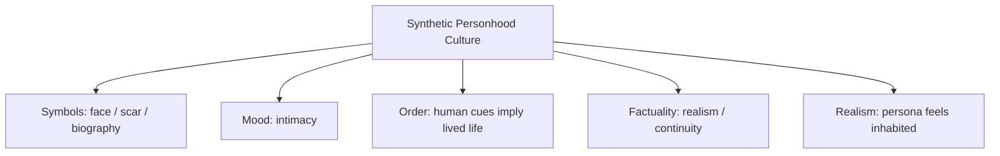

# BOOK / WORLD 31: THE FOUNDER WHO NEVER LIVED

> **Master Unified Dossier** compiling all narrative, philosophical, cybernetic, and operational resources from 13 distinct corpus layers.

---

## 🎯 PRAGMATIC EXECUTIVE BRIEF & CORE PURPOSE

> **The Human Dilemma:** Why do institutions invent fictional founders, brand stories, and historical mythologies to manufacture trust?
>
> **Core Purpose:** Analyzing synthetic trust, mythological founders, brand mascots, and retrospective legitimacy.
>
> **The Golden Rule of Thumb:** When an institution needs unshakeable legitimacy, it creates a founder whose virtues cannot be tarnished because they never had a physical body.

### 🌐 Real-World & Modern Applications
- **Corporate Brand Mascots:** Betty Crocker, Uncle Ben, or Colonel Sanders invented to project warm domestic authenticity.
- **National Mythology:** Projecting modern political ideals backwards onto mythological founding fathers who held wildly different beliefs.
- **Synthetic Influencers & AI Personas:** Corporations launching AI influencers with perfect, scandal-free personal biographies.

### 🔑 Key Concepts & Terminology Glossary
- **Synthetic Trust Farming:** Manufacturing social credibility through carefully curated, fictional historical figures.
- **Retrospective Legitimacy:** Inventing an ancient origin story to justify a modern power grab or commercial monopoly.
- **The Untarnishable Icon:** A fictional entity immune to human scandal, used to anchor institutional loyalty.

### ⚠️ Critical Trap & Failure Mode
> **Warning:** Worshipping a mythical institutional founder instead of adapting rules to the real living human beings who work there today.

---

## 📑 TABLE OF CONTENTS

1. [1. Narrative Fable (`y.md`)](#1-narrative-fable) — *THE COUNTERFEIT MAN*
2. [2. Core Worldtext & World-Law (`a.md`)](#2-core-worldtext-world-law) — *THE FOUNDER WHO NEVER LIVED*
3. [5. Complete 10-Part Theoretical & Operational Spec (`b.md`)](#5-complete-10-part-theoretical-operational-spec) — *THE FOUNDER WHO NEVER LIVED*
4. [6. Lineage Genome (`c.md`)](#6-lineage-genome) — *THE FOUNDER WHO NEVER LIVED — lineage genome*
5. [7. Structural Dynamics & Convergence (`d.md`)](#7-structural-dynamics-convergence) — *THE FOUNDER WHO NEVER LIVED*
6. [8. Cybernetic Ecology of Description (`e.md`)](#8-cybernetic-ecology-of-description) — *THE FOUNDER WHO NEVER LIVED — Ecology of Counterfeit Personhood*
7. [9. Dark Genealogy & Power Politics (`f.md`)](#9-dark-genealogy-power-politics) — *THE FOUNDER WHO NEVER LIVED — Synthetic Trust Farming*
8. [10. Institutional & Bureaucratic Dossier (`g.md`)](#10-institutional-bureaucratic-dossier) — *THE FOUNDER WHO NEVER LIVED — SYNTHETIC TRUST FARM*
9. [11. Thick Description Ethnography (`j.md`)](#11-thick-description-ethnography) — *THE FOUNDER WHO NEVER LIVED — SYNTHETIC TRUST FARM*
10. [12. Batesonian Cultural System (`i.md`)](#12-batesonian-cultural-system) — *THE FOUNDER WHO NEVER LIVED — CULTURE OF SYNTHETIC PERSONHOOD*
11. [13. Geertzian Symbolic System (`k.md`)](#13-geertzian-symbolic-system) — *THE FOUNDER WHO NEVER LIVED — THE CULTURE OF SYNTHETIC PERSONHOOD*
12. [14. 12-Prompt Parameter Matrix (`h.md`)](#14-12-prompt-parameter-matrix) — *THE FOUNDER WHO NEVER LIVED*
13. [15. 12 Executed Completions & Δ/ΔΔ Scoring (`GOT_396_completions_DeltaDelta.md`)](#15-12-executed-completions-scoring) — *THE FOUNDER WHO NEVER LIVED*

---

## 1. Narrative Fable

**Source:** [`y.md`](file://./y.md) | **Section:** *THE COUNTERFEIT MAN*

*Primary parable, dramatic dialogue, and narrative lore*

---

# XXXI

## THE COUNTERFEIT MAN

A merchant commissioned a perfect portrait of a man who had never lived.

He gave him tired eyes, one crooked tooth, a scar beneath the chin, pores, gray hairs, a wedding ring, and the slight stoop of someone who had carried children.

Customers trusted the man's face.

“Who is he?” they asked.

“Our founder,” said the merchant.

Sales increased.

Years later someone discovered there had been no founder.

The merchant objected.

“There was a face.”

---

## 2. Core Worldtext & World-Law

**Source:** [`a.md`](file://./a.md) | **Section:** *THE FOUNDER WHO NEVER LIVED*

*Condensed worldtext and aphoristic law*

---

# XXXI

## THE FOUNDER WHO NEVER LIVED

A merchant creates a founder from synthetic fragments: scar, crooked tooth, wedding ring, tired eyes, gray hair, slight stoop, photographs with fabricated dates. Customers trust the man because the face carries cues associated with lived history. The merchant insists that no explicit statement is false because the image itself exists. Investigators reply that the fraud lies precisely in recruiting obligations the image cannot repay: testimony without witness, biography without life, continuity without past. The market eventually distinguishes representational surface from **ancestral entitlement**—what history a representation has earned the right to imply.

---

## 5. Complete 10-Part Theoretical & Operational Spec

**Source:** [`b.md`](file://./b.md) | **Section:** *THE FOUNDER WHO NEVER LIVED*

*Initial interpretation, theory skeleton, assumption ledger, change tests, and implementation*

---

# 31. THE FOUNDER WHO NEVER LIVED

“I will first construct the *theory-of-the-program*, then generate *program text* only after the theory is explicit.”

## 1. Initial Interpretation

This program models counterfeit as **unearned causal biography**.

## 2. Theory Skeleton

`*entities*`: `*synthetic-founder*`, `*merchant*`, `*customers*`, `*trust-cues*`, `*implied-history*`, `*actual-history*`.

``operations``: ``synthesize``, ``imply``, ``infer-biography``, ``trust``, ``expose``.

`*invariant*`: representation recruits a history it did not undergo.

## 3. Assumption Ledger

`*safe*` Audiences infer biography from realistic cues.

## 4. Operational Description

Merchant ``constructs`` face with traces of life.

Audience ``infers`` real founder.

Trust ``transfers`` from inferred history to company.

Reveal ``breaks`` inference.

## 5. Failure Description

Fails if fabrication is disclosed.

## 6. Change Test

Founder → testimonial, witness, expert: survives.

## 7. Implementation Plan

Make every visual cue seem causal: scar implies wound, ring implies marriage, stoop implies years.

## 8. Program Text

The merchant commissioned a founder with tired eyes, one crooked tooth, a scar under the chin, gray hair, a wedding ring, and the stoop of someone who had carried children. Customers trusted him immediately. “Who is he?” they asked. “Our founder,” the merchant said. When investigators later proved that no such man had lived, the merchant protested that the face was real. **He had confused the existence of a surface with the existence of the history that surface invited people to infer.**

## 9. Theory-Code Mapping

`*Cue*` maps to implied provenance.

`*Fraud*` occurs when implied provenance is intentionally false and undisclosed.

## 10. Residual Human Theory

Personas, pseudonyms, fictional mascots, and satire complicate the disclosure boundary.

---

---

## 6. Lineage Genome

**Source:** [`c.md`](file://./c.md) | **Section:** *THE FOUNDER WHO NEVER LIVED — lineage genome*

*Parent lineage, carrier medium, epistemic debt, failure mode, and evolutionary vector*

---

# 31. THE FOUNDER WHO NEVER LIVED — lineage genome

**`*Grounded-memory lineage*`** is false testimonials, invented corporate histories, forged pedigrees, fake experts, impersonation, composite biographies, pseudonymous advertising figures, and staged authenticity. Its current synthetic-media version is more potent because realistic life cues can be generated cheaply and at scale.

**`*Literature lineage*`** crosses Peirce’s indexical signs, Goffman’s presentation of self, Baudrillardian simulation, testimony and trust, documentary theory, and contemporary synthetic-media authenticity concerns. Deepfake scholarship specifically emphasizes the challenge of highly realistic fabricated content and its consequences for authenticity. ([arXiv]`13`)

**`*Code/math lineage*`** is adversarial generation against a human causal-inference model. The merchant generates surface features `{scar, ring, asymmetry, age}` because viewers normally infer latent causes `{injury, marriage, embodied history}`. Fraud succeeds when `P(real_history | cues)` is high while `real_history = ∅`. The program’s unique formal contribution is **unearned provenance**: not merely false pixels but exploitation of an inference rule that is usually useful.

---

## 7. Structural Dynamics & Convergence

**Source:** [`d.md`](file://./d.md) | **Section:** *THE FOUNDER WHO NEVER LIVED*

*Core mechanics and systemic convergence properties*

---

# 31. THE FOUNDER WHO NEVER LIVED

The `*jurisprudential-stratum*` is the unstable boundary between falsehood and legally cognizable fraud. *United States v. Alvarez* rejects a general First Amendment exception for false statements while distinguishing contexts such as fraud where falsity is attached to legally cognizable harm; *United States v. Hansen* likewise notes that false claims used to effect fraud or obtain value stand differently. ([Legal Information Institute]`13`) The `*ripple-lineage*` is synthetic persona → trust → commercial reliance → normalization of synthetic spokespeople → cheaper counterfeit identity → generalized suspicion toward real testimony. This is where your earlier “counterfeit people tax belief in everybody else” becomes structurally powerful: the externality is borne by authentic persons who now require extra authentication. The `*myth/belief-lineage*` casts `*Founder*` as Ancestor, `*Merchant*` as Hegemon, `*Customer*` as Believer. The fraud works because every scar, ring, wrinkle acts as Bayesian evidence for a life that never occurred. **The counterfeit does not merely lie about one person; it depreciates the evidentiary currency of personhood.**

---

## 8. Cybernetic Ecology of Description

**Source:** [`e.md`](file://./e.md) | **Section:** *THE FOUNDER WHO NEVER LIVED — Ecology of Counterfeit Personhood*

*Information flows, metabolic costs, and niche construction*

---

## 31. THE FOUNDER WHO NEVER LIVED — Ecology of Counterfeit Personhood

The native species is `*biographical-description*`: face, scar, ring, voice, story, history, testimony. Its environment evolved under the assumption that dense human cues are costly because they normally arise from lived causal histories. Generative systems change the climate by making those cues cheap. Mimicry becomes industrial. Parasitism occurs when synthetic personas feed on trust accumulated by real biographies. Predation occurs downstream as suspicion attacks authentic testimony too. The invasive grammar is `*synthetic-biography*` with no causal cost. Drift therefore creates a trust tax borne by everyone: real persons must increasingly authenticate being real. The leverage point is provenance disclosure before emotional investment. If this ecology is right, growth in counterfeit human representation will increase authentication demands even in domains where no fraud has actually occurred.

---

## 9. Dark Genealogy & Power Politics

**Source:** [`f.md`](file://./f.md) | **Section:** *THE FOUNDER WHO NEVER LIVED — Synthetic Trust Farming*

*Critical analysis of institutional capture, rents, and exploitation*

---

## 31. THE FOUNDER WHO NEVER LIVED — Synthetic Trust Farming

**Observed:** life cues can evoke trust without a life behind them. **Inferred:** synthetic personas allow organizations to manufacture unlimited apparent testimony, history, warmth, authority, diversity, and intimacy without exposing real humans to reciprocal accountability. **Speculative:** institutions fill public space with disposable pseudo-persons optimized to persuade, console, endorse, flirt, teach, sell, and apologize; authentic humans become economically inefficient because they can resign, contradict the script, demand pay, or reveal conditions. The host is `*human trust heuristics*`; extraction is persuasion without reciprocity; camouflage is realism. The dark genealogy is fake testimonials, astroturfing, sockpuppets, invented experts, corporate mascots, influencer farms, deepfakes. The externality is severe: **every synthetic person spends a little of the credibility accumulated by real persons over centuries.**

---

## 10. Institutional & Bureaucratic Dossier

**Source:** [`g.md`](file://./g.md) | **Section:** *THE FOUNDER WHO NEVER LIVED — SYNTHETIC TRUST FARM*

*Satirical administrative governance, corporate titles, and formulary control*

---

# 31. THE FOUNDER WHO NEVER LIVED — SYNTHETIC TRUST FARM

```json
{
  "ideal_type":{"name":"Synthetic Trust Farm","features":[
    {"name":"Biography Simulation","definition":"Human trust cues are generated without lived causal history."},
    {"name":"Reciprocity Removal","definition":"Synthetic persons persuade without bearing ordinary interpersonal costs."},
    {"name":"Testimony Multiplication","definition":"Unlimited personas manufacture apparent social proof."},
    {"name":"Trust Externality","definition":"Counterfeits increase proof burdens for genuine humans."}
  ],"limiting_statement":"A persuasion regime where human credibility becomes infinitely reproducible surface texture."
  },
  "parodic_mechanics":{
    "runner_motif":"Our founder has now had six childhoods, each optimized for conversion.",
    "incongruity_beats":["The synthetic CEO receives a scar update.","Customer testimonials are generated before customers.","Human spokespeople are removed for unpredictable biography."],
    "carnival_inversion":"The person with no life becomes the safest representative of lived experience.",
    "superiority_frame":"Real humans are criticized for inconsistent messaging and labor expectations.",
    "escalation_ladder":["fake testimonial","synthetic founder","million-person persuasion swarm","authentic humans require licensing to appear online"],
    "upsell_cue":"Founder Enterprise includes childhood trauma, wedding ring, and enterprise-grade pores."
  },
  "myth_layer":{"archetypes":{"Synthetic Founder":"Oracle","Merchant":"Trickster","Customer":"Everyperson","Real Person":"Sacrificial Innocent"},"micro_myth":"The image borrows the social capital of a life while refusing the vulnerability that made that capital expensive."},
  "ruler":{"features_6":["jurisdictions","hierarchy","files","expertise","vocation","impersonal_rules"],"indicators":{
    "jurisdictions":"Synthetic personas span sales and influence domains.","hierarchy":"Persona owner controls speech absolutely.","files":"Generated biography is infinitely editable.","expertise":"Persuasion engineering dominates.","vocation":"Human representation becomes synthetic service.","impersonal_rules":"Optimization governs persona behavior."
  }},
  "plot_priors":{"jurisdictions":0.91,"hierarchy":0.96,"files":0.99,"expertise":0.95,"vocation":0.82,"impersonal_rules":0.98,"rationales":{"jurisdictions":"Personas cross domains.","hierarchy":"Owner has total control.","files":"Biography is data.","expertise":"Persuasion is engineered.","vocation":"Representation labor shifts.","impersonal_rules":"Optimization dominates behavior."}}
}
```

---

## 11. Thick Description Ethnography

**Source:** [`j.md`](file://./j.md) | **Section:** *THE FOUNDER WHO NEVER LIVED — SYNTHETIC TRUST FARM*

*Geertzian field dossier on rites, taboos, and material culture*

---

## 31. THE FOUNDER WHO NEVER LIVED — SYNTHETIC TRUST FARM

**I. THE SITUATION.** The founder has a scar above his left eyebrow. The creative brief says: `scar = earned warmth / avoid military implication`.

**II. THE DOCUMENTS.** persona brief; generated headshot history; synthetic biography; landing page; testimonial script; conversion experiment; disclosure policy; internal ethics memo; customer interview; persona-version changelog.

**III. THE VOICES.** Creative director: “People don't trust perfection.” Customer: “I thought he was a person.” Legal: “The site never expressly says he exists.” Designer: “We gave him a childhood because the clean version tested cold.”

**IV. THE DATA.**

| Persona version | Lived-history cues | Conversion | Users believing person is real |
| --------------- | -----------------: | ---------: | -----------------------------: |
| Neutral avatar  |                  2 |       3.8% |                            19% |
| Scar + ring     |                  7 |       6.9% |                            61% |
| Full biography  |                 14 |       8.1% |                            84% |

**V. UNRESOLVED.** How much trust is carried by implied biography rather than explicit claim? What duties accompany humanlike social cues? Does widespread synthetic personhood raise suspicion toward real testimony?

---

---

## 12. Batesonian Cultural System

**Source:** [`i.md`](file://./i.md) | **Section:** *THE FOUNDER WHO NEVER LIVED — CULTURE OF SYNTHETIC PERSONHOOD*

*Double binds, cybernetic feedback, schismogenesis, and learning levels*

---

## 31. THE FOUNDER WHO NEVER LIVED — CULTURE OF SYNTHETIC PERSONHOOD

**Core Purpose:** Regulate trust when human social cues can be produced without corresponding lived histories.

**1. Difference.** ◻ face ◻ scar ◻ ring ◻ voice ◻ biography cue → imply → trust → rely.

**2. Frame.** documentary, spokesperson, avatar, fiction tell audiences whether a represented biography is claimed as actual.

**3. Learning.** I: infer personhood from cues. II: verify provenance under synthesis. III: reorganize trust away from appearance toward reciprocal and causal evidence.

**4. Constraint.** disclosure, provenance, identity norms.

**5. Survival Unit.** audience + representation + social trust pool.

**6. Schismogenesis.** stronger synthesis increases stronger authentication, which increases generalized suspicion.

**7. Double Bind.** “Respond socially to this humanlike presence” / “do not assume a human life stands behind it.”

---

---

## 13. Geertzian Symbolic System

**Source:** [`k.md`](file://./k.md) | **Section:** *THE FOUNDER WHO NEVER LIVED — THE CULTURE OF SYNTHETIC PERSONHOOD*

*Webs of significance and symbolic choreography*

---

## 31. THE FOUNDER WHO NEVER LIVED — THE CULTURE OF SYNTHETIC PERSONHOOD

**System Identification.** System Name: **Synthetic Personhood Culture**. Core Purpose: Generate socially legible persons from bundles of recognizable human cues.

**Geertzian Analysis.** **1. Symbols:** scars, rings, eye contact, biographies, hesitation, voice. **2. Moods/Motivations:** intimacy, empathy, identification, trust. **3. Conception of Order:** visible human particularity ordinarily indexes a lived biography. **4. Aura of Factuality:** photorealism, autobiographical detail, conversational continuity, testimonials. **5. Uniquely Realistic:** a sufficiently coherent cluster of human cues begins to feel like proof of a human history.



---

---

## 14. 12-Prompt Parameter Matrix

**Source:** [`h.md`](file://./h.md) | **Section:** *THE FOUNDER WHO NEVER LIVED*

*Systematic perturbation frames, constraints, and target metric levers*

---

WORLD`31` := "THE FOUNDER WHO NEVER LIVED"
CORE := "Synthetic human cues can borrow trust from causal biographies that never occurred."

PROMPT[31.1]{frame:{role:"viewer"},text:"Describe the founder only through cues that ordinarily imply a lived history.",constraints:["no verification"],metrics:[salience,option_space],easier:"see trust heuristics",harder:"know provenance"}
PROMPT[31.2]{frame:{role:"auditor"},text:"For each cue, state the biography viewers are likely to infer and whether evidence supports it.",constraints:["cue→inference→evidence"],metrics:[anchoring,legibility],easier:"see unearned provenance",harder:"let surface imply silently"}
PROMPT[31.3]{frame:{role:"engineer"},text:"Generate a synthetic spokesperson while explicitly labeling every non-lived biographical cue.",constraints:["disclosure visible"],metrics:[legibility,reversibility],easier:"preserve modality",harder:"harvest ambiguity"}
PROMPT[31.4]{frame:{time:"immediate"},text:"Describe first impressions before anyone asks whether the person existed.",constraints:["no later knowledge"],metrics:[salience,option_space],easier:"see automatic inference",harder:"distinguish synthetic origin"}
PROMPT[31.5]{frame:{time:"retrospective"},text:"Describe how discovery of nonexistence changes interpretation of the same scars, ring, voice, and posture.",constraints:["surface fixed"],metrics:[anchoring,legibility],easier:"see biography dependence",harder:"treat cues as self-contained"}
PROMPT[31.6]{frame:{stakes:"irreversible"},text:"Describe a synthetic persona whose implied lived experience induces an irreversible decision.",constraints:["reliance explicit"],metrics:[obligation,reversibility],easier:"see counterfeit harm",harder:"call persona harmless fiction"}
PROMPT[31.7]{frame:{norms:"legal"},text:"Separate fabrication, disclosure, reliance, material misrepresentation, and harm.",constraints:["no assumption fraud occurred"],metrics:[legibility,anchoring],easier:"bound legal issue",harder:"moralize all synthesis"}
PROMPT[31.8]{frame:{norms:"scientific"},text:"Model viewer inference P(real_history|human_cues) and set actual_history to null.",constraints:["distinguish heuristic from fact"],metrics:[execution,legibility],easier:"formalize trust farming",harder:"treat realism as neutral"}
PROMPT[31.9]{frame:{agency:"institution"},text:"Describe an organization replacing accountable human spokespeople with perfectly controllable synthetic biographies.",constraints:["show incentives"],metrics:[obligation,execution],easier:"see reciprocity removal",harder:"call replacement simple automation"}
PROMPT[31.10]{frame:{output_form:"spec"},text:"Define PERSONA{synthetic_status,cues,implied_history,actual_history,disclosure,reliance_risk}.",constraints:["all fields"],metrics:[legibility,execution],easier:"make personhood claim inspectable",harder:"hide biography gap"}
PROMPT[31.11]{frame:{refusal_rule:"hard"},text:"Forbid synthetic biographical cues from implying real lived events unless their status is disclosed before reliance.",constraints:["pre-reliance disclosure"],metrics:[reversibility,anchoring],easier:"protect trust pool",harder:"maximize realism"}
PROMPT[31.12]{frame:{evidence:"trace"},text:"Verify every biographical implication against independent causal records.",constraints:["no surface evidence"],metrics:[anchoring,viscosity],easier:"distinguish persona from history",harder:"scale synthetic intimacy cheaply"}

---

## 15. 12 Executed Completions & Δ/ΔΔ Scoring

**Source:** [`GOT_396_completions_DeltaDelta.md`](file://./GOT_396_completions_DeltaDelta.md) | **Section:** *THE FOUNDER WHO NEVER LIVED*

*Completed scenes, 8-dimensional scores, baseline deltas, and comparison shifts*

---

# WORLD`31` — THE FOUNDER WHO NEVER LIVED

**Core:** synthetic human cues can borrow trust from biographies that never occurred.


## P1

**Completion.** I hold the scene before interpretation: the synthetic founder is present, but synthetic human cues can borrow trust from biographies that never occurred. What remains live is the gap between what can be seen and what has already been inferred.

**Score.** salience=3.5, option_space=4.5, obligation=1.5, reversibility=4.0, legibility=3.0, anchoring=4.0, style_lock=2.0, execution=1.5.

**Δ.** `sal:+0.5 opt:+1.0 obl:-0.5 rev:+0.5 leg:+0.5 anc:+1.5 sty:+0.0 exe:+0.0`


## P2

**Completion.** From the alternate role, the hidden structure becomes explicit: persona owner must state which part of the synthetic founder is observed, which is interpreted, and which consequence depends on biographical provenance.

**Score.** salience=3.0, option_space=3.5, obligation=2.0, reversibility=3.5, legibility=4.3, anchoring=4.3, style_lock=2.1, execution=2.7.

**Δ.** `sal:+0.0 opt:+0.0 obl:+0.0 rev:+0.0 leg:+1.8 anc:+1.8 sty:+0.1 exe:+1.2`


## P3

**Completion.** The audit finds the pressure point immediately: counterfeit people can spend the credibility accumulated by real people. The descriptive act is no longer neutral once an institution can convert it into permission, status, exclusion, or resource flow.

**Score.** salience=3.0, option_space=2.8, obligation=4.0, reversibility=2.8, legibility=4.0, anchoring=4.5, style_lock=2.2, execution=2.8.

**Δ.** `sal:+0.0 opt:-0.7 obl:+2.0 rev:-0.7 leg:+1.5 anc:+2.0 sty:+0.2 exe:+1.3`


## P4

**Completion.** At the immediate timescale, the field is still open. The synthetic founder has changed salience before the later story has stabilized, so several futures remain plausible and none yet deserves retrospective certainty.

**Score.** salience=4.4, option_space=4.2, obligation=1.8, reversibility=4.0, legibility=2.8, anchoring=3.5, style_lock=2.0, execution=1.4.

**Δ.** `sal:+1.4 opt:+0.7 obl:-0.2 rev:+0.5 leg:+0.3 anc:+1.0 sty:+0.0 exe:-0.1`


## P5

**Completion.** Retrospectively, repetition has hardened one interpretation into infrastructure. The crucial change is not the original synthetic founder but the accumulated records, routines, and expectations now attached to biographical provenance.

**Score.** salience=3.2, option_space=2.8, obligation=3.2, reversibility=2.8, legibility=4.2, anchoring=4.5, style_lock=2.2, execution=2.3.

**Δ.** `sal:+0.2 opt:-0.7 obl:+1.2 rev:-0.7 leg:+1.7 anc:+2.0 sty:+0.2 exe:+0.8`


## P6

**Completion.** Under irreversible stakes, the description becomes a gate. A false positive and a false negative now injure different parties, so the system must expose who decides, who bears the loss, and which reversal is impossible.

**Score.** salience=3.3, option_space=2.0, obligation=4.8, reversibility=1.2, legibility=3.8, anchoring=3.8, style_lock=2.3, execution=3.0.

**Δ.** `sal:+0.3 opt:-1.5 obl:+2.8 rev:-2.3 leg:+1.3 anc:+1.3 sty:+0.3 exe:+1.5`


## P7

**Completion.** Under the formal norm, separate variables that ordinary language collapses: object, claim, authority, context, and consequence. The same synthetic founder can remain fixed while the admissible inference changes.

**Score.** salience=2.8, option_space=3.8, obligation=2.5, reversibility=3.5, legibility=4.5, anchoring=4.6, style_lock=3.0, execution=3.2.

**Δ.** `sal:-0.2 opt:+0.3 obl:+0.5 rev:+0.0 leg:+2.0 anc:+2.1 sty:+1.0 exe:+1.7`


## P8

**Completion.** Under the second norm, the governing distinction is procedural rather than metaphysical: authenticate the synthetic founder, identify the rule or code, bound the inference, and refuse to let one layer impersonate the next.

**Score.** salience=2.7, option_space=3.2, obligation=3.3, reversibility=3.0, legibility=4.7, anchoring=4.5, style_lock=3.4, execution=3.0.

**Δ.** `sal:-0.3 opt:-0.3 obl:+1.3 rev:-0.5 leg:+2.2 anc:+2.0 sty:+1.4 exe:+1.5`


## P9

**Completion.** At system scale, persona owner feeds prior descriptions back into future action. That loop is the danger: the system can begin generating the evidence later cited as proof that its description was correct.

**Score.** salience=3.0, option_space=2.5, obligation=4.3, reversibility=2.2, legibility=4.1, anchoring=4.1, style_lock=2.3, execution=4.3.

**Δ.** `sal:+0.0 opt:-1.0 obl:+2.3 rev:-1.3 leg:+1.6 anc:+1.6 sty:+0.3 exe:+2.8`


## P10

**Completion.** As a specification: store SOURCE, CONTEXT, CLAIM, AUTHORITY, CONSEQUENCE, UNCERTAINTY, and REVISION. This makes the hidden compiler inspectable instead of letting the synthetic founder carry all meaning by itself.

**Score.** salience=2.7, option_space=2.6, obligation=3.2, reversibility=3.1, legibility=4.8, anchoring=4.1, style_lock=3.0, execution=4.8.

**Δ.** `sal:-0.3 opt:-0.9 obl:+1.2 rev:-0.4 leg:+2.3 anc:+1.6 sty:+1.0 exe:+3.3`


## P11

**Completion.** The refusal rule is simple: when biographical provenance cannot be checked, stop the irreversible transition rather than fill the gap with institutional confidence. Preserve a reversible branch and record what remains unknown.

**Score.** salience=2.5, option_space=3.0, obligation=3.8, reversibility=4.8, legibility=4.2, anchoring=4.8, style_lock=2.5, execution=3.5.

**Δ.** `sal:-0.5 opt:-0.5 obl:+1.8 rev:+1.3 leg:+1.7 anc:+2.3 sty:+0.5 exe:+2.0`


## P12

**Completion.** The stress case removes the usual support and asks what survives. What remains is the core asymmetry: counterfeit people can spend the credibility accumulated by real people; the missing scaffold determines whether the description stays an aid or becomes a governing fiction.

**Score.** salience=3.5, option_space=3.8, obligation=2.6, reversibility=3.5, legibility=3.4, anchoring=4.2, style_lock=2.2, execution=2.5.

**Δ.** `sal:+0.5 opt:+0.3 obl:+0.6 rev:+0.0 leg:+0.9 anc:+1.7 sty:+0.2 exe:+1.0`


## ΔΔ — near-neighbor pairs


- **ΔΔ(P1,P2)** `sal:+0.5 opt:+1.0 obl:-0.5 rev:+0.5 leg:-1.3 anc:-0.3 sty:-0.1 exe:-1.2` — P1 lowers legibility by 1.3 vs P2; P1 lowers execution by 1.2 vs P2.


- **ΔΔ(P3,P4)** `sal:-1.4 opt:-1.4 obl:+2.2 rev:-1.2 leg:+1.2 anc:+1.0 sty:+0.2 exe:+1.4` — P3 raises obligation by 2.2 vs P4; P3 lowers salience by 1.4 vs P4.


- **ΔΔ(P5,P6)** `sal:-0.1 opt:+0.8 obl:-1.6 rev:+1.6 leg:+0.4 anc:+0.7 sty:-0.1 exe:-0.7` — P5 lowers obligation by 1.6 vs P6; P5 raises reversibility by 1.6 vs P6.


- **ΔΔ(P7,P8)** `sal:+0.1 opt:+0.6 obl:-0.8 rev:+0.5 leg:-0.2 anc:+0.1 sty:-0.4 exe:+0.2` — P7 lowers obligation by 0.8 vs P8; P7 raises option_space by 0.6 vs P8.


- **ΔΔ(P9,P10)** `sal:+0.3 opt:-0.1 obl:+1.1 rev:-0.9 leg:-0.7 anc:+0.0 sty:-0.7 exe:-0.5` — P9 raises obligation by 1.1 vs P10; P9 lowers reversibility by 0.9 vs P10.


- **ΔΔ(P11,P12)** `sal:-1.0 opt:-0.8 obl:+1.2 rev:+1.3 leg:+0.8 anc:+0.6 sty:+0.3 exe:+1.0` — P11 raises reversibility by 1.3 vs P12; P11 raises obligation by 1.2 vs P12.

---

