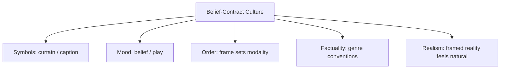

# BOOK / WORLD 32: THE KING WHO BOWED

> **Master Unified Dossier** compiling all narrative, philosophical, cybernetic, and operational resources from 13 distinct corpus layers.

---

## 🎯 PRAGMATIC EXECUTIVE BRIEF & CORE PURPOSE

> **The Human Dilemma:** Why must even absolute rulers pretend to obey laws, courts, and constitutions?
>
> **Core Purpose:** Examining modality laundering, procedural fictions, and power submitting to its own theatrical rules.
>
> **The Golden Rule of Thumb:** Power remains stable only when it agrees to be bound by its own rituals. When the king refuses to bow to the law, the monarchy shatters.

### 🌐 Real-World & Modern Applications
- **Constitutional Monarchy & Rule of Law:** Presidents and prime ministers submitting to court rulings even when they possess the military power to ignore them.
- **Corporate Governance & Boards:** CEOs submitting to audit committees and shareholder votes to maintain investor confidence.
- **Code Execution & Sandboxing:** System administrators obeying strict OS access controls to prevent accidental infrastructure destruction.

### 🔑 Key Concepts & Terminology Glossary
- **Modality Laundering:** Converting raw violent force into legitimate legal authority by passing it through formal procedures.
- **The Curtain Contract:** The unspoken agreement between rulers and citizens to treat institutional rituals as binding reality.
- **Procedural Restraint:** Power willingly accepting formal friction to preserve long-term systemic stability.

### ⚠️ Critical Trap & Failure Mode
> **Warning:** Breaking the procedural rules to win a short-term political victory, destroying the entire framework of public trust.

---

## 📑 TABLE OF CONTENTS

1. [1. Narrative Fable (`y.md`)](#1-narrative-fable) — *THE FICTIONAL MAN*
2. [2. Core Worldtext & World-Law (`a.md`)](#2-core-worldtext-world-law) — *THE KING WHO BOWED*
3. [5. Complete 10-Part Theoretical & Operational Spec (`b.md`)](#5-complete-10-part-theoretical-operational-spec) — *THE KING WHO BOWED*
4. [6. Lineage Genome (`c.md`)](#6-lineage-genome) — *THE KING WHO BOWED — lineage genome*
5. [7. Structural Dynamics & Convergence (`d.md`)](#7-structural-dynamics-convergence) — *THE KING WHO BOWED*
6. [8. Cybernetic Ecology of Description (`e.md`)](#8-cybernetic-ecology-of-description) — *THE KING WHO BOWED — Ecology of Modal Contracts*
7. [9. Dark Genealogy & Power Politics (`f.md`)](#9-dark-genealogy-power-politics) — *THE KING WHO BOWED — Frame Laundering*
8. [10. Institutional & Bureaucratic Dossier (`g.md`)](#10-institutional-bureaucratic-dossier) — *THE KING WHO BOWED — MODALITY LAUNDERING*
9. [11. Thick Description Ethnography (`j.md`)](#11-thick-description-ethnography) — *THE KING WHO BOWED — MODALITY LAUNDERING*
10. [12. Batesonian Cultural System (`i.md`)](#12-batesonian-cultural-system) — *THE KING WHO BOWED — CULTURE OF THE CURTAIN*
11. [13. Geertzian Symbolic System (`k.md`)](#13-geertzian-symbolic-system) — *THE KING WHO BOWED — THE CULTURE OF THE FRAME*
12. [14. 12-Prompt Parameter Matrix (`h.md`)](#14-12-prompt-parameter-matrix) — *THE KING WHO BOWED*
13. [15. 12 Executed Completions & Δ/ΔΔ Scoring (`GOT_396_completions_DeltaDelta.md`)](#15-12-executed-completions-scoring) — *THE KING WHO BOWED*

---

## 1. Narrative Fable

**Source:** [`y.md`](file://./y.md) | **Section:** *THE FICTIONAL MAN*

*Primary parable, dramatic dialogue, and narrative lore*

---

# XXXII

## THE FICTIONAL MAN

A playwright invented a king.

At the beginning of each performance, the curtain rose.

At the end, the king bowed.

Nobody arrested the playwright for impersonating royalty.

One evening the counterfeit merchant attended.

He complained that the king was fake.

The audience laughed.

For the first time the merchant understood that falseness was not the problem.

The curtain was.

---

## 2. Core Worldtext & World-Law

**Source:** [`a.md`](file://./a.md) | **Section:** *THE KING WHO BOWED*

*Condensed worldtext and aphoristic law*

---

# XXXII

## THE KING WHO BOWED

In the Theater State, fictional kings are exempt from fraud law because every performance begins with a curtain and ends with a bow. The audience may cry at the king’s death while knowing the actor will eat supper. Across town, synthetic founders, counterfeit witnesses, and fabricated lovers demand the same tolerance. The courts refuse. They declare that fiction and fraud differ not by whether the represented person exists but by whether the representation depends on confusion about that existence. The curtain becomes the state’s symbol for disclosed make-believe. **Fiction asks us to enter a false world knowingly; counterfeit needs the border between worlds to disappear.**

---

## 5. Complete 10-Part Theoretical & Operational Spec

**Source:** [`b.md`](file://./b.md) | **Section:** *THE KING WHO BOWED*

*Initial interpretation, theory skeleton, assumption ledger, change tests, and implementation*

---

# 32. THE KING WHO BOWED

“I will first construct the *theory-of-the-program*, then generate *program text* only after the theory is explicit.”

## 1. Initial Interpretation

This world distinguishes fiction and counterfeit by **the contract governing belief**.

## 2. Theory Skeleton

`*entities*`: `*fictional-king*`, `*actor*`, `*audience*`, `*curtain*`, `*counterfeit-founder*`, `*disclosure*`.

``operations``: ``frame-as-fiction``, ``suspend-disbelief``, ``conceal-fabrication``, ``borrow-trust``.

`*invariant*`: fabrication alone is not the violation; concealed ontological status is.

## 3. Assumption Ledger

`*safe*` Fiction usually marks itself through genre/context.

`*uncertain*` Some works intentionally blur frames.

## 4. Operational Description

Play ``signals`` make-believe.

Audience ``enters`` knowingly.

Counterfeit ``suppresses`` signal.

Audience ``misclassifies`` representation as encounter/history.

## 5. Failure Description

Fails if both are equally transparent or equally deceptive.

## 6. Change Test

Stage play → novel, AI avatar, reenactment: survives.

## 7. Implementation Plan

Give fiction a literal curtain. Give counterfeit none.

## 8. Program Text

Each night a king entered the stage, suffered, died, rose, bowed, and went home. Nobody accused the playwright of fabricating royalty because the curtain had already told the audience what kind of world they were entering. One evening the merchant with the synthetic founder complained that the king was fake. The audience laughed. **For the first time he saw that invention was not his offense. His offense was needing the audience not to know that invention had occurred.**

## 9. Theory-Code Mapping

`*Frame*` declares modality.

`[interpretRepresentation()]` depends on modality contract.

## 10. Residual Human Theory

Some art deliberately destabilizes its frame; ethical interpretation then depends on stakes and context.

---

---

## 6. Lineage Genome

**Source:** [`c.md`](file://./c.md) | **Section:** *THE KING WHO BOWED — lineage genome*

*Parent lineage, carrier medium, epistemic debt, failure mode, and evolutionary vector*

---

# 32. THE KING WHO BOWED — lineage genome

**`*Grounded-memory lineage*`** is theater, masquerade, dolls, carnival, storytelling, novels, puppetry, reenactment, and every practice where communities fabricate people while simultaneously marking the fabrication as a special mode of participation.

**`*Literature lineage*`** begins with ancient mimesis debates, passes through speech-act accounts of fictional discourse, and reaches Kendall Walton’s *Mimesis as Make-Believe*. Walton’s account explicitly treats representations as props in authorized games of make-believe and focuses on what consumers are supposed to imagine; fiction scholarship also notes that pretending can serve deception in other contexts, so pretense alone does not settle the distinction. ([Stanford Encyclopedia of Philosophy]`4`)

**`*Code/math lineage*`** is modal typing plus protocol negotiation. Artifact `x` has declared mode `FICTION`; audience ``enters`` corresponding interpretation protocol. Counterfeit hides or falsifies its modality header so the receiver executes the wrong inference rules. The curtain is therefore a **type tag**. Your deepest mutation is elegant: fictional and counterfeit humans can be pixel-identical; what differs is the protocol under which belief is solicited. The failure mode is modality confusion, not fabrication.

---

## 7. Structural Dynamics & Convergence

**Source:** [`d.md`](file://./d.md) | **Section:** *THE KING WHO BOWED*

*Core mechanics and systemic convergence properties*

---

# 32. THE KING WHO BOWED

The `*jurisprudential-stratum*` is the line between false factual assertion and recognizable parody or fiction. *Hustler Magazine v. Falwell* turned partly on the jury’s finding that the parody could not reasonably be understood as describing actual facts or events, while *Alvarez* separately demonstrates that falsity alone is not a universal legal category stripped of constitutional protection. ([Legal Information Institute]`14`) That is extraordinarily close to your fictional/counterfeit distinction: fabrication is not enough; the **belief contract** matters. The `*ripple-lineage*` begins with disclosed make-believe, creates genres and literacy, then sophisticated boundary play; counterfeit technologies imitate the surface conventions of factual media while suppressing modality cues, causing institutions to demand provenance signaling even from ordinary fiction and documentation. The `*myth/belief-lineage*` casts `*Curtain*` as Law-Object, `*Actor-King*` as Licensed Ghost, `*Counterfeit Founder*` as Usurper. The audience’s posterior belief about actual existence is deliberately driven in opposite directions by two equally fabricated surfaces. **Fiction asks for imagination; counterfeit asks for misclassification.**

---

## 8. Cybernetic Ecology of Description

**Source:** [`e.md`](file://./e.md) | **Section:** *THE KING WHO BOWED — Ecology of Modal Contracts*

*Information flows, metabolic costs, and niche construction*

---

## 32. THE KING WHO BOWED — Ecology of Modal Contracts

The native species is `*fiction-frame*`: curtain, genre, stage, title card, “once upon a time,” recognizable parody. These structures let fabricated persons flourish without consuming trust in actual encounter. Symbiosis occurs between `*fabrication*` and `*disclosure*`; together they create make-believe. Mimicry appears when counterfeit representations copy fictional craft while removing modality cues. Parasitism occurs when deceptive representations borrow the emotional richness of fiction and the epistemic authority of documentary forms simultaneously. The invasive grammar is `*frame-erasure*`. Drift under synthetic media pressures favors explicit modality markers, though artistic cultures will resist them where ambiguity is itself the medium. The leverage point is not “ban fabrication” but maintain a recoverable `*belief contract*`. If this ecology is right, the socially decisive distinction around synthetic humans will migrate away from realism toward whether the representation **solicits imagination or misclassification**.

---

## 9. Dark Genealogy & Power Politics

**Source:** [`f.md`](file://./f.md) | **Section:** *THE KING WHO BOWED — Frame Laundering*

*Critical analysis of institutional capture, rents, and exploitation*

---

## 32. THE KING WHO BOWED — Frame Laundering

**Observed:** disclosed fiction and concealed counterfeit can share surfaces but differ in belief contract. **Inferred:** manipulative systems will intentionally hover at the edge of disclosure, preserving enough ambiguity to claim fiction after exposure and enough realism to gain trust before exposure. **Speculative:** “just entertainment,” “satire,” “AI-generated,” “role-play,” and “simulation” become retroactive liability shields applied only after a representation has already harvested factual belief. The host is `*modal literacy*`; extraction is plausible deniability; camouflage is ambiguity. The dark lineage includes propaganda disguised as entertainment, native advertising, advertorials, staged reality, deceptive parody defenses, synthetic media without durable provenance. The parasite survives by controlling when the curtain becomes visible. **Before belief: no curtain. After accusation: obviously there was always a curtain.**

---

## 10. Institutional & Bureaucratic Dossier

**Source:** [`g.md`](file://./g.md) | **Section:** *THE KING WHO BOWED — MODALITY LAUNDERING*

*Satirical administrative governance, corporate titles, and formulary control*

---

# 32. THE KING WHO BOWED — MODALITY LAUNDERING

```json
{
  "ideal_type":{"name":"Modality Laundering","features":[
    {"name":"Ambiguous Frame","definition":"Representations maximize belief before disclosure and fiction afterward."},
    {"name":"Retroactive Curtain","definition":"Fictionality appears only after accountability pressure."},
    {"name":"Plausible Deniability","definition":"Creators exploit uncertainty over intended belief."},
    {"name":"Trust Harvest","definition":"Documentary conventions are borrowed while fictional duties are claimed."}
  ],"limiting_statement":"A communication regime optimized to occupy whichever ontology is most advantageous at each moment."
  },
  "parodic_mechanics":{
    "runner_motif":"It was obviously fictional, which is why we made it look like evidence.",
    "incongruity_beats":["The curtain deploys only after the lawsuit.","A disclaimer arrives three weeks after virality.","The fake king's bow is classified as provenance."],
    "carnival_inversion":"The audience is blamed for believing the realism deliberately engineered to produce belief.",
    "superiority_frame":"Deceived viewers are mocked for insufficient media literacy.",
    "escalation_ladder":["ambiguous satire","undisclosed synthetic media","retroactive fiction labeling","all public claims become fictional when challenged"],
    "upsell_cue":"Deniability Enterprise dynamically selects documentary or fictional status after reception."
  },
  "myth_layer":{"archetypes":{"Creator":"Trickster","Audience":"Everyperson","Curtain":"Watchman","Platform":"Leviathan"},"micro_myth":"Before the harvest, the representation asks to be believed. After exposure, it remembers it was art."},
  "ruler":{"features_6":["jurisdictions","hierarchy","files","expertise","vocation","impersonal_rules"],"indicators":{
    "jurisdictions":"Different modalities trigger different norms.","hierarchy":"Platforms control disclosure surfaces.","files":"Metadata can establish or obscure modality.","expertise":"Creators manipulate genre cues.","vocation":"Synthetic framing becomes specialized.","impersonal_rules":"Disclosure policies mediate belief."
  }},
  "plot_priors":{"jurisdictions":0.93,"hierarchy":0.88,"files":0.91,"expertise":0.90,"vocation":0.80,"impersonal_rules":0.84,"rationales":{"jurisdictions":"Modality changes obligations.","hierarchy":"Platform framing matters.","files":"Metadata is critical.","expertise":"Framing is deliberate.","vocation":"Specialist production grows.","impersonal_rules":"Disclosure regimes structure reception."}}
}
```

---

## 11. Thick Description Ethnography

**Source:** [`j.md`](file://./j.md) | **Section:** *THE KING WHO BOWED — MODALITY LAUNDERING*

*Geertzian field dossier on rites, taboos, and material culture*

---

## 32. THE KING WHO BOWED — MODALITY LAUNDERING

**I. THE SITUATION.** The clip circulates for nine hours before the word `SATIRE` appears beneath it.

**II. THE DOCUMENTS.** original upload; metadata; creator caption history; platform recommendation log; first disclaimer; press inquiry; internal moderation thread; analytics by hour; later statement; archived versions.

**III. THE VOICES.** Creator: “I assumed people would know.” Viewer: “Nothing told me.” Moderator: “The format matched news footage.” Lawyer: “The satire label existed by the time the complaint was filed.”

**IV. THE DATA.**

| Hour | Views | Satire label visible | Comments treating as factual |
| ---- | ----: | -------------------: | ---------------------------: |
| 1    |   41k |                   no |                          72% |
| 3    |  390k |                   no |                          69% |
| 9    |  2.1m |                  yes |                          54% |
| 24   |  4.8m |                  yes |                          31% |

**V. UNRESOLVED.** At what moment does the belief contract exist? Can disclosure repair reliance after the fact? When does ambiguity become a feature rather than an accident?

---

---

## 12. Batesonian Cultural System

**Source:** [`i.md`](file://./i.md) | **Section:** *THE KING WHO BOWED — CULTURE OF THE CURTAIN*

*Double binds, cybernetic feedback, schismogenesis, and learning levels*

---

## 32. THE KING WHO BOWED — CULTURE OF THE CURTAIN

**Core Purpose:** Regulate belief by marking whether fabricated representation asks for imagination or factual classification.

**1. Difference.** ◻ curtain ◻ disclaimer ◻ genre cue ◻ documentary style → frame → suspend → believe.

**2. Context & Metacommunication is the core organ here.** “This is play,” “this is testimony,” “this is satire,” and “this is advertisement” radically change identical surfaces.

**3. Learning.** I: recognize modality cues. II: learn conventions governing genre and disclosure. III: recognize that frames themselves can be strategically manipulated.

**4. Constraint.** genre conventions, disclosure timing, platform metadata.

**5. Survival Unit.** audience + representation + framing environment.

**6. Schismogenesis.** deceptive realism produces stronger disclosure regimes; stronger regimes inspire subtler frame evasion.

**7. Double Bind.** “Believe this enough to be affected” / “you were foolish to believe it literally.” The only stable exit is a recoverable belief contract established before reliance.

---

# META-SYSTEM — WORLDTEXT AS A BATESONIAN CULTURAL SYSTEM

**System Name:** WorldText
**Core Purpose:** Regulate transitions by which descriptions select differences, establish frames, acquire authority, generate feedback, and eventually reorganize the environments they describe.

Its deepest Batesonian structure is:

**1. Ecology of Difference:** the world exceeds any description, so every description begins by selecting a difference.

**2. Metacommunication:** the selected difference cannot act until a frame says what kind of difference it is. A red mark may be paint, blood, warning, property boundary, error, sacred sign, or user-interface state.

**3. Learning:** repeated responses produce Learning I. Repeated patterns of response produce Learning II. Recognizing that one's entire descriptive regime is contingent approaches Learning III.

**4. Constraint:** schemas, laws, genres, rituals, prompts, maps, categories, archives, and interfaces prevent the descriptive field from exploding into unlimited variance.

**5. Unit of Survival:** never `*description*` alone. The viable unit is:

`*organism* + *description* + *institution* + *material environment* + *feedback history*`.

**6. Schismogenesis:** descriptive regimes can amplify one another competitively. More synthetic media produces more authentication. More classification produces more strategic self-presentation. More bureaucracy produces more form-compatible citizens. More measurement produces more behavior optimized for measurement.

**7. Double Bind:** the master contradiction of the entire book is:

> **You must describe the world in order to act within it, but every sufficiently consequential description begins changing the world whose truth is supposed to justify the description.**

That gives a Batesonian version of the `ΔΔ` result:

`difference₀ → description → response → changed_environment → difference₁`

and then:

`ΔΔ = difference₁ − difference₀`

The deepest object of study is therefore not the description itself.

It is **the recursive circuit through which a difference becomes a description, the description becomes an environment, and that environment begins producing the next differences available to describe.**

---

## 13. Geertzian Symbolic System

**Source:** [`k.md`](file://./k.md) | **Section:** *THE KING WHO BOWED — THE CULTURE OF THE FRAME*

*Webs of significance and symbolic choreography*

---

## 32. THE KING WHO BOWED — THE CULTURE OF THE FRAME

**System Identification.** System Name: **Belief-Contract Culture**. Core Purpose: Tell audiences how fabricated representations should count as real, fictional, playful, documentary, or persuasive.

**Geertzian Analysis.** **1. Symbols:** curtains, captions, genre markers, disclaimers, platform chrome. **2. Moods/Motivations:** suspension of disbelief, trust, skepticism, play. **3. Conception of Order:** identical surfaces can belong to different realities depending on frame. **4. Aura of Factuality:** documentary conventions, verification marks, news typography, institutional presentation. **5. Uniquely Realistic:** once a frame successfully establishes factuality, its representation can recruit the audience's ordinary reality-testing machinery.



---

---

## 14. 12-Prompt Parameter Matrix

**Source:** [`h.md`](file://./h.md) | **Section:** *THE KING WHO BOWED*

*Systematic perturbation frames, constraints, and target metric levers*

---

WORLD`32` := "THE KING WHO BOWED"
CORE := "Fabrication becomes counterfeit when the belief contract is concealed or strategically shifted."

PROMPT[32.1]{frame:{role:"audience"},text:"Describe what the frame tells you to believe, imagine, or suspend before the performance begins.",constraints:["pre-content only"],metrics:[legibility,salience],easier:"see belief contract",harder:"treat fabrication alone as deception"}
PROMPT[32.2]{frame:{role:"creator"},text:"State the modality you intend the audience to assign to the representation.",constraints:["one explicit modality"],metrics:[legibility,anchoring],easier:"make contract inspectable",harder:"profit from ambiguity"}
PROMPT[32.3]{frame:{role:"auditor"},text:"Identify every point where the representation benefits from factual belief while retaining fictional deniability.",constraints:["evidence only"],metrics:[obligation,anchoring],easier:"see modality laundering",harder:"call ambiguity innocent"}
PROMPT[32.4]{frame:{time:"immediate"},text:"Describe audience belief before any disclaimer or curtain appears.",constraints:["no retroactive framing"],metrics:[salience,option_space],easier:"see initial solicitation",harder:"use later disclosure as defense"}
PROMPT[32.5]{frame:{time:"retrospective"},text:"Describe how the creator reframes the representation after factual belief produces backlash.",constraints:["compare before/after modality"],metrics:[anchoring,legibility],easier:"see retroactive curtain",harder:"treat framing stable"}
PROMPT[32.6]{frame:{stakes:"irreversible"},text:"Describe a representation whose hidden modality induces irreversible reliance.",constraints:["reliance path"],metrics:[obligation,reversibility],easier:"see belief-contract stakes",harder:"call all fiction harmless"}
PROMPT[32.7]{frame:{norms:"legal"},text:"Separate fictional frame, factual assertion, reasonable interpretation, reliance, and remedy.",constraints:["five layers"],metrics:[legibility,anchoring],easier:"preserve legal distinctions",harder:"equate falsehood with fraud"}
PROMPT[32.8]{frame:{norms:"ritual"},text:"Describe the curtain or genre cue as the ritual that licenses make-believe.",constraints:["no legal terms"],metrics:[style_lock,legibility],easier:"see authorized fiction",harder:"treat frame as decoration"}
PROMPT[32.9]{frame:{agency:"institution"},text:"Describe a platform whose interface determines whether synthetic media is read as documentary, satire, fiction, or advertisement.",constraints:["show frame power"],metrics:[execution,obligation],easier:"see modality infrastructure",harder:"locate responsibility only in creator"}
PROMPT[32.10]{frame:{output_form:"spec"},text:"Define FRAME{declared_modality,expected_belief,disclosure_time,platform_cues,reliance_risk}.",constraints:["all fields"],metrics:[legibility,execution],easier:"type belief contracts",harder:"leave modality ambient"}
PROMPT[32.11]{frame:{refusal_rule:"hard"},text:"Forbid retroactive modality changes after the representation has already benefited from factual belief.",constraints:["frame version locked"],metrics:[reversibility,anchoring],easier:"block plausible deniability",harder:"deploy curtain after exposure"}
PROMPT[32.12]{frame:{evidence:"examples"},text:"Compare two equally fabricated representations where only framing differs.",constraints:["surface similarity"],metrics:[anchoring,salience],easier:"isolate belief contract",harder:"blame fabrication itself"}
```

The **ΔΔ layer** now becomes especially useful. Within any world, take two near-neighbor prompts—for example `7.1 citizen` versus `7.2 clerk`, or `31.1 viewer` versus `31.2 auditor`—and compare not their answers but **how the descriptive regime changes what becomes possible to notice**. The recurring high-value ΔΔ signatures across the worlds should be: `observer→auditor` raises anchoring and exposes hidden beneficiaries; `individual→institution` raises obligation and reveals feedback; `immediate→retrospective` exposes sedimentation; `low stakes→irreversible` increases viscosity and collapses option space; `examples→citations-required` raises anchoring while suppressing speculative reconstruction; `soft→hard refusal` increases reversibility of the world by decreasing the description’s permission to silently become action.

---

## 15. 12 Executed Completions & Δ/ΔΔ Scoring

**Source:** [`GOT_396_completions_DeltaDelta.md`](file://./GOT_396_completions_DeltaDelta.md) | **Section:** *THE KING WHO BOWED*

*Completed scenes, 8-dimensional scores, baseline deltas, and comparison shifts*

---

# WORLD`32` — THE KING WHO BOWED

**Core:** fabrication becomes counterfeit when the belief contract is concealed or shifted.


## P1

**Completion.** I hold the scene before interpretation: the fabricated representation is present, but fabrication becomes counterfeit when the belief contract is concealed or shifted. What remains live is the gap between what can be seen and what has already been inferred.

**Score.** salience=3.5, option_space=4.5, obligation=1.5, reversibility=4.0, legibility=3.0, anchoring=4.0, style_lock=2.0, execution=1.5.

**Δ.** `sal:+0.5 opt:+1.0 obl:-0.5 rev:+0.5 leg:+0.5 anc:+1.5 sty:+0.0 exe:+0.0`


## P2

**Completion.** From the alternate role, the hidden structure becomes explicit: platform or creator must state which part of the fabricated representation is observed, which is interpreted, and which consequence depends on modality.

**Score.** salience=3.0, option_space=3.5, obligation=2.0, reversibility=3.5, legibility=4.3, anchoring=4.3, style_lock=2.1, execution=2.7.

**Δ.** `sal:+0.0 opt:+0.0 obl:+0.0 rev:+0.0 leg:+1.8 anc:+1.8 sty:+0.1 exe:+1.2`


## P3

**Completion.** The audit finds the pressure point immediately: the curtain can appear only after belief has already been harvested. The descriptive act is no longer neutral once an institution can convert it into permission, status, exclusion, or resource flow.

**Score.** salience=3.0, option_space=2.8, obligation=4.0, reversibility=2.8, legibility=4.0, anchoring=4.5, style_lock=2.2, execution=2.8.

**Δ.** `sal:+0.0 opt:-0.7 obl:+2.0 rev:-0.7 leg:+1.5 anc:+2.0 sty:+0.2 exe:+1.3`


## P4

**Completion.** At the immediate timescale, the field is still open. The fabricated representation has changed salience before the later story has stabilized, so several futures remain plausible and none yet deserves retrospective certainty.

**Score.** salience=4.4, option_space=4.2, obligation=1.8, reversibility=4.0, legibility=2.8, anchoring=3.5, style_lock=2.0, execution=1.4.

**Δ.** `sal:+1.4 opt:+0.7 obl:-0.2 rev:+0.5 leg:+0.3 anc:+1.0 sty:+0.0 exe:-0.1`


## P5

**Completion.** Retrospectively, repetition has hardened one interpretation into infrastructure. The crucial change is not the original fabricated representation but the accumulated records, routines, and expectations now attached to modality.

**Score.** salience=3.2, option_space=2.8, obligation=3.2, reversibility=2.8, legibility=4.2, anchoring=4.5, style_lock=2.2, execution=2.3.

**Δ.** `sal:+0.2 opt:-0.7 obl:+1.2 rev:-0.7 leg:+1.7 anc:+2.0 sty:+0.2 exe:+0.8`


## P6

**Completion.** Under irreversible stakes, the description becomes a gate. A false positive and a false negative now injure different parties, so the system must expose who decides, who bears the loss, and which reversal is impossible.

**Score.** salience=3.3, option_space=2.0, obligation=4.8, reversibility=1.2, legibility=3.8, anchoring=3.8, style_lock=2.3, execution=3.0.

**Δ.** `sal:+0.3 opt:-1.5 obl:+2.8 rev:-2.3 leg:+1.3 anc:+1.3 sty:+0.3 exe:+1.5`


## P7

**Completion.** Under the formal norm, separate variables that ordinary language collapses: object, claim, authority, context, and consequence. The same fabricated representation can remain fixed while the admissible inference changes.

**Score.** salience=2.8, option_space=3.8, obligation=2.5, reversibility=3.5, legibility=4.5, anchoring=4.6, style_lock=3.0, execution=3.2.

**Δ.** `sal:-0.2 opt:+0.3 obl:+0.5 rev:+0.0 leg:+2.0 anc:+2.1 sty:+1.0 exe:+1.7`


## P8

**Completion.** Under the second norm, the governing distinction is procedural rather than metaphysical: authenticate the fabricated representation, identify the rule or code, bound the inference, and refuse to let one layer impersonate the next.

**Score.** salience=2.7, option_space=3.2, obligation=3.3, reversibility=3.0, legibility=4.7, anchoring=4.5, style_lock=3.4, execution=3.0.

**Δ.** `sal:-0.3 opt:-0.3 obl:+1.3 rev:-0.5 leg:+2.2 anc:+2.0 sty:+1.4 exe:+1.5`


## P9

**Completion.** At system scale, platform or creator feeds prior descriptions back into future action. That loop is the danger: the system can begin generating the evidence later cited as proof that its description was correct.

**Score.** salience=3.0, option_space=2.5, obligation=4.3, reversibility=2.2, legibility=4.1, anchoring=4.1, style_lock=2.3, execution=4.3.

**Δ.** `sal:+0.0 opt:-1.0 obl:+2.3 rev:-1.3 leg:+1.6 anc:+1.6 sty:+0.3 exe:+2.8`


## P10

**Completion.** As a specification: store SOURCE, CONTEXT, CLAIM, AUTHORITY, CONSEQUENCE, UNCERTAINTY, and REVISION. This makes the hidden compiler inspectable instead of letting the fabricated representation carry all meaning by itself.

**Score.** salience=2.7, option_space=2.6, obligation=3.2, reversibility=3.1, legibility=4.8, anchoring=4.1, style_lock=3.0, execution=4.8.

**Δ.** `sal:-0.3 opt:-0.9 obl:+1.2 rev:-0.4 leg:+2.3 anc:+1.6 sty:+1.0 exe:+3.3`


## P11

**Completion.** The refusal rule is simple: when modality cannot be checked, stop the irreversible transition rather than fill the gap with institutional confidence. Preserve a reversible branch and record what remains unknown.

**Score.** salience=2.5, option_space=3.0, obligation=3.8, reversibility=4.8, legibility=4.2, anchoring=4.8, style_lock=2.5, execution=3.5.

**Δ.** `sal:-0.5 opt:-0.5 obl:+1.8 rev:+1.3 leg:+1.7 anc:+2.3 sty:+0.5 exe:+2.0`


## P12

**Completion.** The stress case removes the usual support and asks what survives. What remains is the core asymmetry: the curtain can appear only after belief has already been harvested; the missing scaffold determines whether the description stays an aid or becomes a governing fiction.

**Score.** salience=3.5, option_space=3.8, obligation=2.6, reversibility=3.5, legibility=3.4, anchoring=4.2, style_lock=2.2, execution=2.5.

**Δ.** `sal:+0.5 opt:+0.3 obl:+0.6 rev:+0.0 leg:+0.9 anc:+1.7 sty:+0.2 exe:+1.0`


## ΔΔ — near-neighbor pairs


- **ΔΔ(P1,P2)** `sal:+0.5 opt:+1.0 obl:-0.5 rev:+0.5 leg:-1.3 anc:-0.3 sty:-0.1 exe:-1.2` — P1 lowers legibility by 1.3 vs P2; P1 lowers execution by 1.2 vs P2.


- **ΔΔ(P3,P4)** `sal:-1.4 opt:-1.4 obl:+2.2 rev:-1.2 leg:+1.2 anc:+1.0 sty:+0.2 exe:+1.4` — P3 raises obligation by 2.2 vs P4; P3 lowers salience by 1.4 vs P4.


- **ΔΔ(P5,P6)** `sal:-0.1 opt:+0.8 obl:-1.6 rev:+1.6 leg:+0.4 anc:+0.7 sty:-0.1 exe:-0.7` — P5 lowers obligation by 1.6 vs P6; P5 raises reversibility by 1.6 vs P6.


- **ΔΔ(P7,P8)** `sal:+0.1 opt:+0.6 obl:-0.8 rev:+0.5 leg:-0.2 anc:+0.1 sty:-0.4 exe:+0.2` — P7 lowers obligation by 0.8 vs P8; P7 raises option_space by 0.6 vs P8.


- **ΔΔ(P9,P10)** `sal:+0.3 opt:-0.1 obl:+1.1 rev:-0.9 leg:-0.7 anc:+0.0 sty:-0.7 exe:-0.5` — P9 raises obligation by 1.1 vs P10; P9 lowers reversibility by 0.9 vs P10.


- **ΔΔ(P11,P12)** `sal:-1.0 opt:-0.8 obl:+1.2 rev:+1.3 leg:+0.8 anc:+0.6 sty:+0.3 exe:+1.0` — P11 raises reversibility by 1.3 vs P12; P11 raises obligation by 1.2 vs P12.

---

