# GEERTZIAN CULTURAL SYSTEMS — ALL 33 WORLDS

The common Geertzian transformation is:

`<symbol> → <mood/motivation> → <conception of order> → <aura of factuality> → <felt inevitability>`

The central question is not merely what a description says. It is **how a description becomes a world that feels too obvious to question.**

---

## 0. THE CROSSING — THE CULTURE OF THE TRACE

**System Identification.** System Name: **Trace Culture**. Core Purpose: Coordinate conduct around absent causes by turning surviving residues into socially credible signals.

**Geertzian Analysis.** **1. System of Symbols:** ◻ footprints ◻ scars ◻ warning marks ◻ archived records → signify an absent source. Model-OF: the past remains available through residues. Model-FOR: inspect traces before acting. **2. Moods/Motivations:** ◻ vigilance ◻ suspicion ◻ caution → motivate searching and inference. **3. Conception of Order:** reality is causal even when causes are gone; effects carry backward information. Model-FOR: reconstruct enough of the absent cause to survive the present. **4. Aura of Factuality:** confidence scores, expert classifications, photographs, provenance chains → naturalize interpretation as evidence. **5. Uniquely Realistic:** direct absence ceases to count as epistemic absence; the trace becomes the sensible way to know.

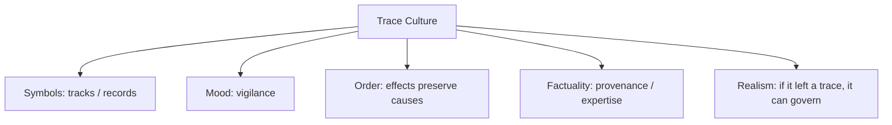

---

## 1. THE KINGDOM OF TURNED HEADS — THE CULTURE OF SALIENCE

**System Identification.** System Name: **Salience Culture**. Core Purpose: Organize collective reality by determining which differences receive attention.

**Geertzian Analysis.** **1. Symbols:** ◻ pointers ◻ highlights ◻ rankings ◻ alerts → foreground selected objects. Model-OF: the world contains more than anyone can attend to. Model-FOR: follow trusted salience cues. **2. Moods/Motivations:** urgency, curiosity, FOMO, vigilance → turn bodies toward selected targets. **3. Conception of Order:** what matters is what successfully enters attention. **4. Aura of Factuality:** trending lists, notification counts, expert badges, engagement metrics → make visibility appear proportional to importance. **5. Uniquely Realistic:** unseen things begin to feel less real than highlighted things.

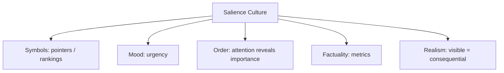

---

## 2. THE HOUSE WHOSE ROAD DISAPPEARED — THE CULTURE OF RESIDUE

**System Identification.** System Name: **Legacy Culture**. Core Purpose: Preserve continuity by treating inherited forms as evidence of prior wisdom.

**Geertzian Analysis.** **1. Symbols:** ◻ blocked doorway ◻ old icon ◻ customary path ◻ legacy feature → embody historical continuity. Model-OF: surviving structures encode past adaptation. Model-FOR: preserve what generations learned to use. **2. Moods/Motivations:** reverence, familiarity, caution toward change. **3. Conception of Order:** age implies tested fit. **4. Aura of Factuality:** longevity, precedent, preservation status, installed-base counts → naturalize survival as justification. **5. Uniquely Realistic:** alternatives appear reckless because they lack inherited evidence.

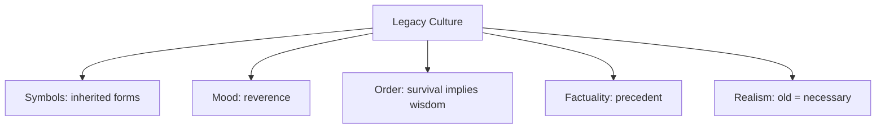

---

## 3. THE ARCHIPELAGO OF BORROWED MONSTERS — THE CULTURE OF AUTHENTICITY

**System Identification.** System Name: **Authenticity Culture**. Core Purpose: Turn mutable cultural circulation into stable narratives of belonging.

**Geertzian Analysis.** **1. Symbols:** masks, monsters, costumes, ancestral names → signify continuity and group identity. **2. Moods/Motivations:** pride, belonging, defensive attachment. **3. Conception of Order:** true culture descends from a coherent ancestral source. Model-FOR: protect inherited forms from contamination. **4. Aura of Factuality:** museums, festivals, genealogies, tourism labels, “traditional” designations. **5. Uniquely Realistic:** networked borrowing is pushed out by pedigree; mixture becomes anomaly rather than normal history.

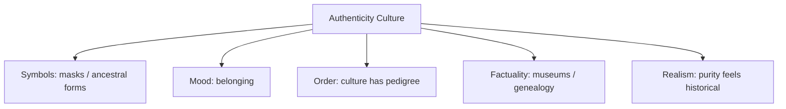

---

## 4. THE VALLEY WHERE DANGERS ARRIVE EARLY — THE CULTURE OF PREPAREDNESS

**System Identification.** System Name: **Preparedness Culture**. Core Purpose: Make future dangers behaviorally real before they occur.

**Geertzian Analysis.** **1. Symbols:** sirens, drills, threat maps, warning stories → signify possible catastrophe. **2. Moods/Motivations:** alertness, anxiety, readiness. **3. Conception of Order:** the future contains threats that reward rehearsal. Model-FOR: act before certainty. **4. Aura of Factuality:** risk percentages, simulations, emergency plans, official exercises. **5. Uniquely Realistic:** not preparing begins to feel irrational even when probabilities are poorly calibrated.

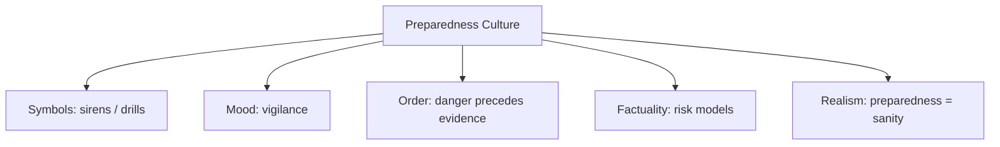

---

## 5. THE REPUBLIC OF WOODEN KINGS — THE CULTURE OF ROLE

**System Identification.** System Name: **Counts-As Culture**. Core Purpose: Convert material objects and persons into socially actionable roles.

**Geertzian Analysis.** **1. Symbols:** crowns, stamps, badges, titles, tokens → confer role. **2. Moods/Motivations:** deference, duty, entitlement, caution. **3. Conception of Order:** context can make one thing count as another. Model-FOR: behave according to recognized status. **4. Aura of Factuality:** ceremonies, registries, law, repeated recognition. **5. Uniquely Realistic:** the institutional role becomes more practically real than the object's material substrate.

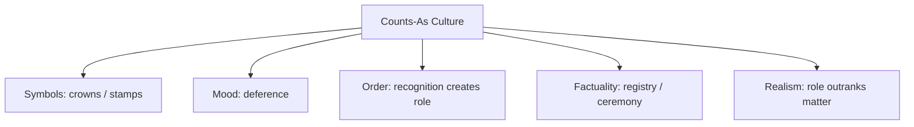

---

## 6. THE PALACE OF THE PERFECT CAMERA — THE CULTURE OF VISIBILITY

**System Identification.** System Name: **Resolution Culture**. Core Purpose: Establish truth through increasingly precise capture.

**Geertzian Analysis.** **1. Symbols:** lenses, pixels, timestamps, replay screens → signify observational access. **2. Moods/Motivations:** confidence, forensic curiosity, distrust of memory. **3. Conception of Order:** reality becomes more knowable as capture becomes more precise. **4. Aura of Factuality:** resolution numbers, confidence scores, machine vision, “the footage.” **5. Uniquely Realistic:** contextual knowledge begins to seem subjective because the camera's evidence looks harder.

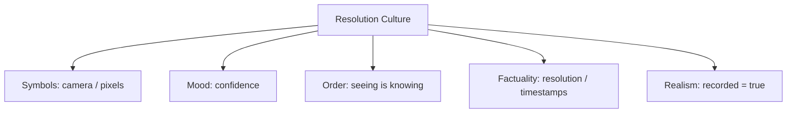

---

## 7. THE CITY OF REQUIRED FIELDS — THE CULTURE OF CLASSIFICATION

**System Identification.** System Name: **Form Culture**. Core Purpose: Make populations administratively legible by compressing experience into standardized fields.

**Geertzian Analysis.** **1. Symbols:** dropdowns, codes, required fields, red validation borders. **2. Moods/Motivations:** compliance, frustration, desire to become legible. **3. Conception of Order:** reality is a collection of classifiable cases. Model-FOR: translate yourself into acceptable categories. **4. Aura of Factuality:** databases, dashboards, case counts, percentages. **5. Uniquely Realistic:** whatever cannot enter the schema begins to look exceptional or nonexistent.

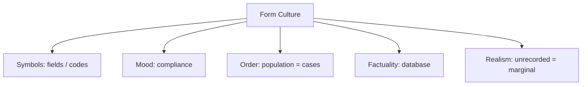

---

## 8. THE MARSH OF ENFORCED LINES — THE CULTURE OF TERRITORY

**System Identification.** System Name: **Boundary Culture**. Core Purpose: Convert continuous ground into discrete jurisdictions.

**Geertzian Analysis.** **1. Symbols:** survey stakes, maps, fences, checkpoints. **2. Moods/Motivations:** belonging, territorial vigilance, fear of trespass. **3. Conception of Order:** space naturally divides into bounded domains. **4. Aura of Factuality:** coordinates, legal maps, property documents, police enforcement. **5. Uniquely Realistic:** political lines come to seem geographic; ecology that crosses them looks disorderly.

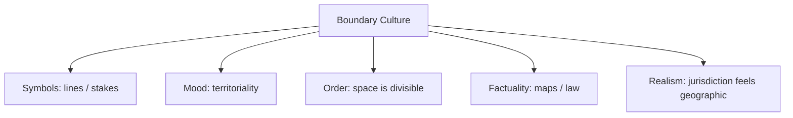

---

## 9. THE TWO GRIEFS — THE CULTURE OF TRANSLATION

**System Identification.** System Name: **Translation Culture**. Core Purpose: Sustain coordination across incompatible semantic worlds.

**Geertzian Analysis.** **1. Symbols:** paired terms, dictionaries, subtitles, glosses. **2. Moods/Motivations:** hope of equivalence, anxiety about loss, pragmatic compromise. **3. Conception of Order:** meanings can move between languages if mediated carefully enough. **4. Aura of Factuality:** official translation, dictionaries, certified interpreters. **5. Uniquely Realistic:** the authorized equivalent begins to replace the source ambiguity itself.

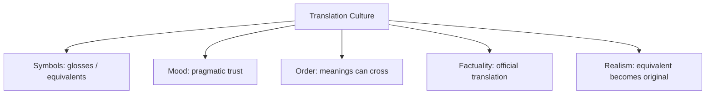

---

## 10. THE COMMON BIRD — THE CULTURE OF COORDINATION

**System Identification.** System Name: **Repair Culture**. Core Purpose: Produce enough shared meaning for coordinated action without requiring identical inner representations.

**Geertzian Analysis.** **1. Symbols:** pointing, correction, repetition, shared words. **2. Moods/Motivations:** trust, patience, mild embarrassment, cooperative repair. **3. Conception of Order:** public use matters more than private identity of meaning. **4. Aura of Factuality:** successful joint action itself validates the shared term. **5. Uniquely Realistic:** practical agreement becomes sufficient evidence that communication “worked.”

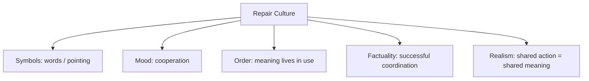

---

## 11. THE COURT OF SHARDS — THE CULTURE OF EXPERT INFERENCE

**System Identification.** System Name: **Expert Evidence Culture**. Core Purpose: Convert incomplete traces into institutionally actionable claims.

**Geertzian Analysis.** **1. Symbols:** reports, confidence intervals, microscopy images, credentials. **2. Moods/Motivations:** disciplined doubt, deference, procedural caution. **3. Conception of Order:** uncertainty can be managed by trained inference. **4. Aura of Factuality:** methodology, peer review, admissibility, expert titles. **5. Uniquely Realistic:** professionalized interpretation comes to look categorically different from ordinary interpretation.

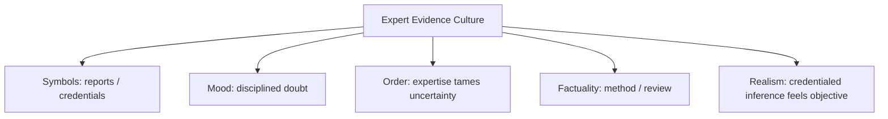

---

## 12. THE INVISIBLE TOOL COUNTRY — THE CULTURE OF CRAFT

**System Identification.** System Name: **Tacit Craft Culture**. Core Purpose: Embed practical knowledge in repeated bodily interaction until competent action feels immediate.

**Geertzian Analysis.** **1. Symbols:** worn tools, gestures, demonstrations, shop-floor sayings. **2. Moods/Motivations:** confidence, humility before material, pride in fluency. **3. Conception of Order:** the world discloses itself differently to practiced bodies. **4. Aura of Factuality:** smooth performance, experienced judgment, apprenticeship rank. **5. Uniquely Realistic:** what the expert “just sees” can appear more real than explicit rules.

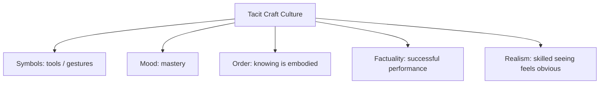

---

## 13. THE GIANT STATE — THE CULTURE OF COMMAND

**System Identification.** System Name: **Command Culture**. Core Purpose: Compress distributed action into hierarchical signals and recognizable leaders.

**Geertzian Analysis.** **1. Symbols:** titles, dashboards, signatures, orders. **2. Moods/Motivations:** obedience, decisiveness, admiration of command. **3. Conception of Order:** large systems require singular centers of direction. **4. Aura of Factuality:** org charts, executive announcements, visible command surfaces. **5. Uniquely Realistic:** distributed execution disappears and leadership appears causally gigantic.

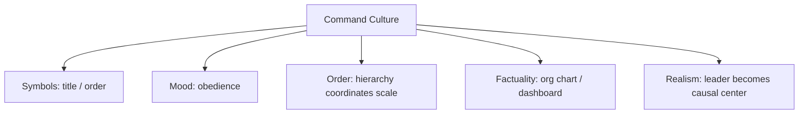

---

## 14. THE ELEVATOR SCHOOL OF AUTHORSHIP — THE CULTURE OF GENIUS

**System Identification.** System Name: **Singular Authorship Culture**. Core Purpose: Convert distributed production into legible individual credit.

**Geertzian Analysis.** **1. Symbols:** signatures, bylines, prompt screenshots, award plaques. **2. Moods/Motivations:** admiration, aspiration, status hunger. **3. Conception of Order:** exceptional artifacts originate in exceptional individuals. **4. Aura of Factuality:** named creators, copyright, interviews, awards. **5. Uniquely Realistic:** upstream systems and labor become background conditions rather than authorship.

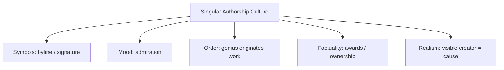

---

## 15. THE CITY OF UNMEASURED ADJECTIVES — THE CULTURE OF TASTE

**System Identification.** System Name: **Qualitative Judgment Culture**. Core Purpose: Coordinate underdetermined design and conduct through socially learned standards.

**Geertzian Analysis.** **1. Symbols:** “elegant,” “reasonable,” “generous,” exemplars, portfolios. **2. Moods/Motivations:** aspiration, embarrassment, confidence, deference to taste. **3. Conception of Order:** quality exists even when it cannot be fully enumerated. **4. Aura of Factuality:** precedent, expert juries, canonical examples, rankings. **5. Uniquely Realistic:** learned preferences become natural qualities of the object.

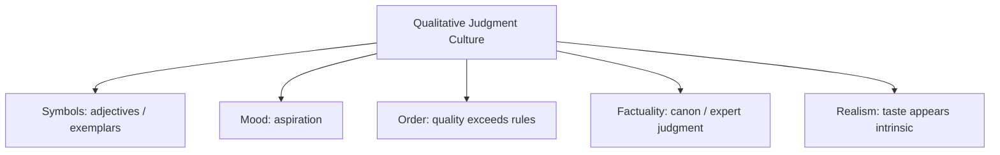

---

## 16. THE ARCHIVE WITHOUT CONTEXT — THE CULTURE OF PERMANENT MEMORY

**System Identification.** System Name: **Retention Culture**. Core Purpose: Defeat forgetting by making past traces indefinitely retrievable.

**Geertzian Analysis.** **1. Symbols:** timestamps, search fields, saved videos, permanent records. **2. Moods/Motivations:** reassurance, nostalgia, suspicion of forgetting. **3. Conception of Order:** more preserved past means greater truth about the past. **4. Aura of Factuality:** exhaustive storage, searchability, audit logs. **5. Uniquely Realistic:** retained evidence begins to outrank unrecorded context.

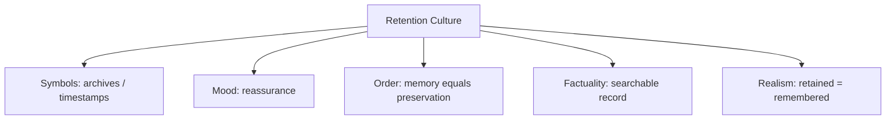

---

## 17. THE HIVE OF FORBIDDEN WORDS — THE CULTURE OF EXCEPTIONALISM

**System Identification.** System Name: **Definitional Border Culture**. Core Purpose: Protect high-status distinctions by controlling category membership.

**Geertzian Analysis.** **1. Symbols:** contested terms such as intelligence, language, reason, art. **2. Moods/Motivations:** superiority, anxiety, boundary defense. **3. Conception of Order:** important kinds possess essential distinctions. **4. Aura of Factuality:** canonical definitions, tests, disciplinary credentials. **5. Uniquely Realistic:** category boundaries feel discovered even when thresholds repeatedly move.

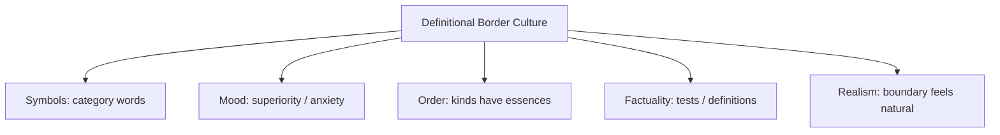

---

## 18. THE COUNTRY OF NEGATIVE ANIMALS — THE CULTURE OF ABSTRACT ACTORS

**System Identification.** System Name: **Ghost Governance Culture**. Core Purpose: Coordinate complex collective action through abstractions treated as agents.

**Geertzian Analysis.** **1. Symbols:** “the market,” “the algorithm,” “the nation,” “the company.” **2. Moods/Motivations:** deference, resignation, fatalism. **3. Conception of Order:** superindividual forces govern outcomes beyond any one person's control. **4. Aura of Factuality:** forecasts, charts, corporate legal identity, institutional language. **5. Uniquely Realistic:** abstractions acquire causal personality while human decision points recede.

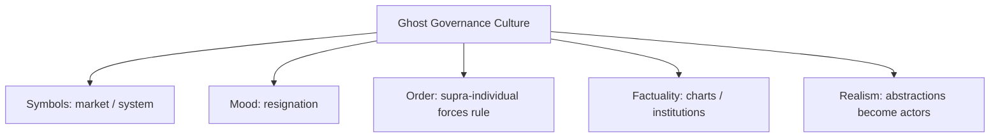

---

## 19. THE EMPIRE BENEATH THE MAP — THE CULTURE OF THE MODEL

**System Identification.** System Name: **Model Culture**. Core Purpose: Compress overwhelming complexity into stable representations for coordinated action.

**Geertzian Analysis.** **1. Symbols:** maps, metrics, dashboards, models. **2. Moods/Motivations:** confidence, orientation, impatience with messy particulars. **3. Conception of Order:** reality has an underlying structure that can be rendered compactly. **4. Aura of Factuality:** mathematical form, standardization, official status, predictive performance. **5. Uniquely Realistic:** what the model cannot express becomes increasingly difficult to treat as consequential.

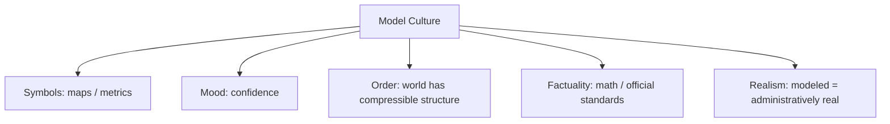

---

## 20. THE SENTENCE WITH SKIN IN THE GAME — THE CULTURE OF PROFESSIONAL DISTANCE

**System Identification.** System Name: **Abstract Consequence Culture**. Core Purpose: Make high-stakes events governable by translating embodied consequences into professional categories.

**Geertzian Analysis.** **1. Symbols:** case numbers, risk labels, policy language, neutral terminology. **2. Moods/Motivations:** composure, procedural confidence, emotional restraint. **3. Conception of Order:** good decisions require distance from individual sensation. **4. Aura of Factuality:** statistics, formal reports, professional diction. **5. Uniquely Realistic:** abstraction feels objective while situated suffering feels partial.

```mermaid
graph TD
A["Abstract Consequence Culture"] --> B1["Symbols: case / metric"]
A --> B2["Mood: composure"]
A --> B3["Order: distance improves judgment"]
A --> B4["Factuality: professional reports"]
A --> B5["Realism: abstraction = objectivity"]
```

---

## 21. THE SELF-FULFILLING VILLAGE — THE CULTURE OF PREDICTION

**System Identification.** System Name: **Predictive Culture**. Core Purpose: Allocate present opportunities according to anticipated future behavior.

**Geertzian Analysis.** **1. Symbols:** scores, labels, risk categories, forecasts. **2. Moods/Motivations:** confidence in foresight, fear of high-risk subjects, compliance. **3. Conception of Order:** futures exist probabilistically in present data. **4. Aura of Factuality:** accuracy metrics, historical datasets, model performance. **5. Uniquely Realistic:** predicted futures become plausible enough to justify making them easier to occur.

```mermaid
graph TD
A["Predictive Culture"] --> B1["Symbols: scores / labels"]
A --> B2["Mood: anticipatory confidence"]
A --> B3["Order: future resides in data"]
A --> B4["Factuality: accuracy metrics"]
A --> B5["Realism: forecast becomes destiny"]
```

---

## 22. THE SCHOOL OF COLLAPSING POTS — THE CULTURE OF METIS

**System Identification.** System Name: **Embodied Learning Culture**. Core Purpose: Produce competence through situated attempts, material feedback, and correction.

**Geertzian Analysis.** **1. Symbols:** master's hands, misshapen pots, workshop phrases, repeated demonstrations. **2. Moods/Motivations:** patience, humility, respect for craft. **3. Conception of Order:** reality reveals relevant differences through practiced engagement. **4. Aura of Factuality:** successful performance, material resistance, apprenticeship history. **5. Uniquely Realistic:** knowledge that survives contact with clay feels more legitimate than declarative instruction.

```mermaid
graph TD
A["Embodied Learning Culture"] --> B1["Symbols: hands / failed pots"]
A --> B2["Mood: humility"]
A --> B3["Order: practice reveals reality"]
A --> B4["Factuality: successful craft"]
A --> B5["Realism: doing outranks saying"]
```

---

## 23. THE MARKET OF DEAD METAPHORS — THE CULTURE OF FAMILIARITY

**System Identification.** System Name: **Metaphoric Interface Culture**. Core Purpose: Domesticate novelty by explaining it through already familiar objects.

**Geertzian Analysis.** **1. Symbols:** desktop, folder, cloud, assistant, trash can. **2. Moods/Motivations:** comfort, confidence, low-friction curiosity. **3. Conception of Order:** new systems become manageable when mapped onto old ones. **4. Aura of Factuality:** ubiquitous interface convention and repeated successful use. **5. Uniquely Realistic:** the metaphor's constraints eventually feel like properties of the technology itself.

```mermaid
graph TD
A["Metaphoric Interface Culture"] --> B1["Symbols: folder / cloud"]
A --> B2["Mood: familiarity"]
A --> B3["Order: new resembles old"]
A --> B4["Factuality: habitual use"]
A --> B5["Realism: metaphor becomes ontology"]
```

---

## 24. THE CAVE OF THE SURVIVING SCRATCH — THE CULTURE OF ARCHIVAL REALITY

**System Identification.** System Name: **Survivorship Culture**. Core Purpose: Construct usable historical worlds from whatever happened to remain.

**Geertzian Analysis.** **1. Symbols:** surviving inscriptions, artifacts, canonical documents. **2. Moods/Motivations:** reverence, confidence in evidence, caution toward speculation. **3. Conception of Order:** the recoverable past is the documented past. **4. Aura of Factuality:** museum cases, citations, catalog numbers, physical durability. **5. Uniquely Realistic:** preserved subjects appear historically central because vanished ones cannot compete for attention.

```mermaid
graph TD
A["Survivorship Culture"] --> B1["Symbols: surviving artifacts"]
A --> B2["Mood: reverence"]
A --> B3["Order: documented past is knowable past"]
A --> B4["Factuality: archive / museum"]
A --> B5["Realism: preserved = important"]
```

---

## 25. THE GALLERY OF CAUSALLY DIFFERENT TWINS — THE CULTURE OF AUTHENTICITY

**System Identification.** System Name: **Provenance Culture**. Core Purpose: Preserve distinctions of origin after visual appearance ceases to provide reliable evidence.

**Geertzian Analysis.** **1. Symbols:** signatures, provenance badges, camera records, certificates. **2. Moods/Motivations:** suspicion, reassurance, demand for verification. **3. Conception of Order:** causal history matters even when surfaces coincide. **4. Aura of Factuality:** signed metadata, trusted institutions, chain-of-custody records. **5. Uniquely Realistic:** certified provenance begins to function as reality's passport.

```mermaid
graph TD
A["Provenance Culture"] --> B1["Symbols: certificate / signature"]
A --> B2["Mood: suspicion / reassurance"]
A --> B3["Order: origin determines claim"]
A --> B4["Factuality: provenance chain"]
A --> B5["Realism: certified = authentic"]
```

---

## 26. THE FORENSIC MUD — THE CULTURE OF SUSPICION

**System Identification.** System Name: **Adversarial Trust Culture**. Core Purpose: Maintain credible belief under conditions where evidence can be deliberately manufactured.

**Geertzian Analysis.** **1. Symbols:** tamper seals, cryptographic signatures, forensic marks, verification badges. **2. Moods/Motivations:** suspicion, vigilance, procedural trust. **3. Conception of Order:** appearances are adversarial and trust must be engineered. **4. Aura of Factuality:** audits, cryptography, independent verification. **5. Uniquely Realistic:** unverified experience starts to look reckless.

```mermaid
graph TD
A["Adversarial Trust Culture"] --> B1["Symbols: seals / signatures"]
A --> B2["Mood: suspicion"]
A --> B3["Order: evidence can be attacked"]
A --> B4["Factuality: verification"]
A --> B5["Realism: trust requires machinery"]
```

---

## 27. THE MOUNTAIN THAT REFUSED TO JOIN THE STORY — THE CULTURE OF VALIDATION

**System Identification.** System Name: **Model Validation Culture**. Core Purpose: Keep formal representations credible by testing them against resistant material conditions.

**Geertzian Analysis.** **1. Symbols:** benchmarks, stress tests, sensor logs, failure reports. **2. Moods/Motivations:** confidence in formalism tempered by fear of deployment failure. **3. Conception of Order:** models are trustworthy when reality repeatedly behaves within their assumptions. **4. Aura of Factuality:** test scores, simulation results, certifications. **5. Uniquely Realistic:** successful validation environments can themselves come to define what counts as relevant reality.

```mermaid
graph TD
A["Model Validation Culture"] --> B1["Symbols: benchmark / test"]
A --> B2["Mood: confidence"]
A --> B3["Order: validation reveals truth"]
A --> B4["Factuality: scores / certification"]
A --> B5["Realism: benchmark defines reality"]
```

---

## 28. THE GREAT LISTENER — THE CULTURE OF ASSISTANCE

**System Identification.** System Name: **Inferential Assistance Culture**. Core Purpose: Remove friction by converting incomplete human instructions into complete action.

**Geertzian Analysis.** **1. Symbols:** suggestions, autocomplete, assistant voice, default settings. **2. Moods/Motivations:** relief, convenience, trust, reduced desire to specify. **3. Conception of Order:** good systems know enough context to infer what users mean. **4. Aura of Factuality:** personalization accuracy, acceptance rates, historical behavior. **5. Uniquely Realistic:** system inference begins to feel like the user's own latent preference.

```mermaid
graph TD
A["Inferential Assistance Culture"] --> B1["Symbols: suggestion / default"]
A --> B2["Mood: relief"]
A --> B3["Order: good systems anticipate intent"]
A --> B4["Factuality: acceptance metrics"]
A --> B5["Realism: default feels personal"]
```

---

## 29. THE HOUSE THAT LOOKED FINISHED — THE CULTURE OF THE DEMO

**System Identification.** System Name: **Demonstration Culture**. Core Purpose: Make future systems credible before their full operational consequences can be observed.

**Geertzian Analysis.** **1. Symbols:** renders, prototypes, launch stages, polished dashboards. **2. Moods/Motivations:** excitement, confidence, urgency to approve. **3. Conception of Order:** visible coherence is evidence that the hidden system is ready. **4. Aura of Factuality:** demos, screenshots, awards, staged metrics. **5. Uniquely Realistic:** surface completion feels more present and therefore more credible than future maintenance debt.

```mermaid
graph TD
A["Demonstration Culture"] --> B1["Symbols: render / prototype"]
A --> B2["Mood: excitement"]
A --> B3["Order: visible coherence predicts viability"]
A --> B4["Factuality: demos / metrics"]
A --> B5["Realism: appearance outruns operation"]
```

---

## 30. THE REPUBLIC OF DEBTS — THE CULTURE OF CATEGORIES

**System Identification.** System Name: **Reliance Culture**. Core Purpose: Reduce coordination cost by attaching stable expectations to familiar category names.

**Geertzian Analysis.** **1. Symbols:** “bank,” “employee,” “news,” “school,” “chair.” **2. Moods/Motivations:** trust, confidence, readiness to rely. **3. Conception of Order:** kinds carry packages of predictable relations and duties. **4. Aura of Factuality:** regulation, historical custom, repeated performance, institutional recognition. **5. Uniquely Realistic:** the category name can continue feeling trustworthy even after its obligations change.

```mermaid
graph TD
A["Reliance Culture"] --> B1["Symbols: trusted categories"]
A --> B2["Mood: trust"]
A --> B3["Order: names carry duties"]
A --> B4["Factuality: custom / regulation"]
A --> B5["Realism: category implies obligation"]
```

---

## 31. THE FOUNDER WHO NEVER LIVED — THE CULTURE OF SYNTHETIC PERSONHOOD

**System Identification.** System Name: **Synthetic Personhood Culture**. Core Purpose: Generate socially legible persons from bundles of recognizable human cues.

**Geertzian Analysis.** **1. Symbols:** scars, rings, eye contact, biographies, hesitation, voice. **2. Moods/Motivations:** intimacy, empathy, identification, trust. **3. Conception of Order:** visible human particularity ordinarily indexes a lived biography. **4. Aura of Factuality:** photorealism, autobiographical detail, conversational continuity, testimonials. **5. Uniquely Realistic:** a sufficiently coherent cluster of human cues begins to feel like proof of a human history.

```mermaid
graph TD
A["Synthetic Personhood Culture"] --> B1["Symbols: face / scar / biography"]
A --> B2["Mood: intimacy"]
A --> B3["Order: human cues imply lived life"]
A --> B4["Factuality: realism / continuity"]
A --> B5["Realism: persona feels inhabited"]
```

---

## 32. THE KING WHO BOWED — THE CULTURE OF THE FRAME

**System Identification.** System Name: **Belief-Contract Culture**. Core Purpose: Tell audiences how fabricated representations should count as real, fictional, playful, documentary, or persuasive.

**Geertzian Analysis.** **1. Symbols:** curtains, captions, genre markers, disclaimers, platform chrome. **2. Moods/Motivations:** suspension of disbelief, trust, skepticism, play. **3. Conception of Order:** identical surfaces can belong to different realities depending on frame. **4. Aura of Factuality:** documentary conventions, verification marks, news typography, institutional presentation. **5. Uniquely Realistic:** once a frame successfully establishes factuality, its representation can recruit the audience's ordinary reality-testing machinery.

```mermaid
graph TD
A["Belief-Contract Culture"] --> B1["Symbols: curtain / caption"]
A --> B2["Mood: belief / play"]
A --> B3["Order: frame sets modality"]
A --> B4["Factuality: genre conventions"]
A --> B5["Realism: framed reality feels natural"]
```

---

# THE GEERTZIAN META-SYSTEM: WORLDTEXT

**System Identification.** System Name: **WorldText Culture**. Core Purpose: Turn descriptions into cultural models that simultaneously represent worlds and instruct people or machines how to act within them.

WorldText becomes Geertzian at exactly the point where a description stops behaving as a sentence **about** something and begins supplying both a **model-OF** and a **model-FOR**.

A map is a model-OF the city and a model-FOR movement. A law is a model-OF social order and a model-FOR conduct. A prompt is a model-OF the desired world and a model-FOR the generator. A category is a model-OF kinds and a model-FOR differential treatment. A story is a model-OF possible consequence and a model-FOR anticipatory behavior. A render is a model-OF an unbuilt thing and, once handed to builders, a model-FOR making it.

That gives the stronger five-stage WorldText formulation:

`◻ descriptive symbols`
`→ establish moods + motivations`
`→ articulate a world-order`
`→ acquire factuality through institutions, interfaces, metrics, repetition, or material success`
`→ make one trajectory of action feel like reality itself`

The deepest Geertzian danger is therefore not simply **false description**. It is a description whose model-FOR becomes invisible because its model-OF has acquired enough factual authority.

The map says, *this is the city*, so its routing prescriptions disappear.

The score says, *this is your risk*, so the institutional treatment it produces appears merely responsive.

The category says, *this is a bank*, so centuries of expectations arrive before anyone reads the contract.

The model says, *this is what the data show*, so the world it subsequently reorganizes becomes harder to distinguish from the world it originally claimed merely to depict.

The prompt says, *make the entrance welcoming*, and a chain of hidden defaults becomes concrete.

That suggests the Geertzian form of the larger theory:

**A description becomes culturally powerful when the behavior it prescribes ceases to look prescribed and begins to look like the only realistic response to the world it describes.**

Or, in the tighter WorldText notation:

`MODEL-OF(X) + MODEL-FOR(X) + AURA(X) → WORLD(X)`

The crucial research object is the **aura operator**.

Because symbols can propose almost anything.

The real cultural power begins when one description acquires enough institutional, ritual, technical, aesthetic, or statistical factuality that its proposed world stops appearing proposed.
